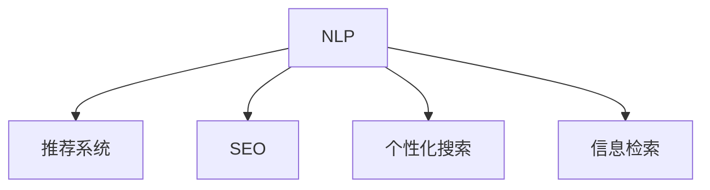

                 

# AI如何提升用户搜索体验

> 关键词：人工智能,自然语言处理(NLP),推荐系统,搜索结果排序,用户行为分析,搜索引擎优化(SEO),个性化搜索

## 1. 背景介绍

### 1.1 问题由来

在互联网时代，搜索作为用户获取信息的主要方式之一，其体验和效率直接影响了用户对网站的第一印象和长期留存。然而，随着信息量的爆炸式增长，搜索结果往往鱼龙混杂、难以区分。如何提升搜索效果，为用户快速获取有用信息，成为当下互联网搜索技术的一大挑战。

### 1.2 问题核心关键点

在搜索技术中，提升用户体验的核心在于两点：一方面，提高搜索结果的相关性和质量；另一方面，减少搜索过程的时间成本，提升搜索的便捷性和准确性。这些目标的实现，离不开先进的自然语言处理(NLP)技术和高效的推荐系统。

传统搜索技术往往依赖关键词匹配算法，存在一定的语义理解和上下文忽视问题。而AI技术的引入，特别是深度学习和大语言模型的应用，为用户带来了新的搜索体验，这些技术不仅提升了搜索结果的相关性和排序准确性，还通过个性化推荐系统，实现了更个性化的搜索服务。

### 1.3 问题研究意义

提升搜索体验不仅能提升用户体验，还能显著提高网站的用户留存率和转化率。以下是几个具体方面的研究意义：

1. **提升用户满意度**：通过个性化的搜索结果和推荐，满足用户特定的需求，提升用户的满意度和粘性。
2. **优化用户体验**：减少搜索时间，提高信息检索的速度和准确性，使用户能够更高效地完成搜索任务。
3. **增加用户互动**：通过智能化的搜索建议和互动式搜索体验，增加用户与系统的互动，提升用户体验的深度。
4. **增强网站收益**：通过精准的个性化搜索推荐，提升网站的转化率和广告收益，推动网站业务增长。

## 2. 核心概念与联系

### 2.1 核心概念概述

为了更好地理解AI在搜索体验优化中的应用，我们首先介绍几个核心概念：

- **自然语言处理(NLP)**：一门研究如何让计算机理解和生成人类语言的学科，包括分词、词性标注、句法分析、语义分析等。
- **推荐系统**：通过用户行为数据，为用户推荐最相关的搜索结果。推荐系统可以分为基于内容的推荐、协同过滤推荐、混合推荐等。
- **搜索引擎优化(SEO)**：通过优化网站的结构和内容，提高搜索引擎对网站的索引和排名，从而提升网站的曝光度。
- **个性化搜索**：基于用户的搜索历史、兴趣偏好等信息，为不同用户提供个性化的搜索结果。
- **信息检索**：通过算法匹配用户的查询需求和搜索结果的相关性，提高搜索结果的准确性和相关性。

这些核心概念之间的逻辑关系可以通过以下Mermaid流程图来展示：



这个流程图展示了大语言模型在搜索引擎中的核心概念及其之间的关系：

1. NLP技术通过分词、语义分析等方法，帮助搜索引擎理解用户的查询意图。
2. 推荐系统根据用户的搜索历史和兴趣，推荐最相关的结果。
3. SEO通过优化网站结构，提高搜索引擎对网站的索引排名。
4. 个性化搜索针对不同用户进行搜索结果定制，提升用户体验。
5. 信息检索通过匹配用户查询与搜索结果，提升相关性。

## 3. 核心算法原理 & 具体操作步骤
### 3.1 算法原理概述

提升搜索体验的核心在于通过AI技术实现搜索结果的个性化和精准化。具体来说，分为以下几步：

1. **预处理和分词**：将用户的搜索查询进行分词处理，提取关键信息。
2. **语义理解**：通过NLP技术理解查询的语义，提取用户意图。
3. **结果推荐**：根据用户意图，结合推荐系统算法，生成个性化推荐结果。
4. **结果排序**：通过排序算法，将推荐结果排序，提升相关性。
5. **搜索结果展示**：将排序后的结果展示给用户，并提供更多的搜索建议。

### 3.2 算法步骤详解

以一个具体的搜索引擎为例，其核心算法步骤包括：

1. **查询输入**：用户输入查询。
2. **预处理**：将查询进行分词，提取关键信息。
3. **语义分析**：通过NLP技术，理解查询的语义，提取用户意图。
4. **推荐算法**：根据用户意图，结合推荐系统算法，生成个性化推荐结果。
5. **结果排序**：通过排序算法，将推荐结果排序，提升相关性。
6. **结果展示**：将排序后的结果展示给用户，并提供更多的搜索建议。

### 3.3 算法优缺点

基于AI的搜索体验优化具有以下优点：

1. **提高相关性**：AI技术能够深入理解查询的语义，生成更相关、更精准的搜索结果。
2. **提升效率**：通过推荐系统和个性化搜索，用户能够更快地找到所需信息，减少搜索时间。
3. **增强互动**：通过智能搜索建议，增加用户与系统的互动，提升用户体验。
4. **灵活定制**：可以根据不同用户需求，生成个性化的搜索结果，提升用户满意度。

同时，也存在以下缺点：

1. **数据依赖**：AI技术依赖大量的用户数据进行训练和优化，数据质量和数量对结果影响较大。
2. **模型复杂**：AI技术需要复杂的模型和算法，计算资源消耗较大，部署成本高。
3. **隐私问题**：用户数据隐私保护成为关注的重点，如何保护用户数据，避免数据泄露，是重要的挑战。
4. **解释性不足**：AI模型的决策过程缺乏可解释性，用户难以理解为何得到某些推荐结果。
5. **泛化能力**：AI模型的泛化能力受到训练数据和算法的限制，可能无法处理某些特定场景下的查询。

### 3.4 算法应用领域

AI技术在搜索体验优化中的应用，广泛存在于各种搜索引擎和应用场景中，包括但不限于：

- **通用搜索引擎**：如Google、Bing等，通过AI技术提升搜索结果的相关性和个性化。
- **社交媒体搜索**：如Twitter、Facebook等，通过AI技术生成个性化的搜索结果和推荐。
- **电商平台搜索**：如Amazon、淘宝等，通过AI技术提供更精准的商品推荐。
- **新闻和信息聚合**：如今日头条、Google News等，通过AI技术生成个性化新闻摘要和推荐。
- **专业领域搜索**：如医学搜索、法律搜索等，通过AI技术提供更精准的专业信息检索。

## 4. 数学模型和公式 & 详细讲解  
### 4.1 数学模型构建

基于AI的搜索体验优化，涉及多个数学模型和公式。以下以信息检索和推荐系统为例，详细讲解数学模型的构建。

### 4.2 公式推导过程

**信息检索模型**：

假设查询为 $q$，文档集合为 $D$，文档 $d$ 与查询 $q$ 的相似度为 $s_{d,q}$。信息检索模型的目标是最大化相关文档的相似度，最小化非相关文档的相似度。常用的信息检索模型包括余弦相似度模型、BM25模型等。

**推荐系统模型**：

假设用户集合为 $U$，物品集合为 $I$，用户 $u$ 对物品 $i$ 的评分 $r_{u,i}$。推荐系统的目标是为用户 $u$ 推荐物品 $i$，使得推荐物品的评分 $r$ 最大化。常用的推荐系统模型包括协同过滤模型、矩阵分解模型、基于内容的推荐模型等。

### 4.3 案例分析与讲解

以协同过滤推荐系统为例，展示推荐系统的基本原理和模型构建。

**协同过滤模型**：

假设用户集合 $U=\{u_1, u_2, \ldots, u_m\}$，物品集合 $I=\{i_1, i_2, \ldots, i_n\}$，用户 $u_i$ 对物品 $i_j$ 的评分 $r_{u_i, i_j} \in [0, 1]$。

协同过滤模型分为基于用户的协同过滤和基于物品的协同过滤两种：

- 基于用户的协同过滤：对于用户 $u_i$，找到与其兴趣相似的其他用户 $u_j$，推荐其评分较高的物品 $i_j$。
- 基于物品的协同过滤：对于物品 $i_j$，找到与其评分相似的其他物品 $i_k$，推荐给其他评分相似的用户 $u_i$。

## 5. 项目实践：代码实例和详细解释说明
### 5.1 开发环境搭建

在进行搜索体验优化项目开发前，需要先搭建好开发环境。以下是使用Python进行TensorFlow开发的典型环境配置流程：

1. 安装Anaconda：从官网下载并安装Anaconda，用于创建独立的Python环境。

2. 创建并激活虚拟环境：
```bash
conda create -n tensorflow-env python=3.8 
conda activate tensorflow-env
```

3. 安装TensorFlow：根据CUDA版本，从官网获取对应的安装命令。例如：
```bash
conda install tensorflow tensorflow-gpu=2.6 -c tf
```

4. 安装必要的工具包：
```bash
pip install numpy pandas scikit-learn scipy matplotlib
```

完成上述步骤后，即可在`tensorflow-env`环境中开始项目开发。

### 5.2 源代码详细实现

以下是使用TensorFlow对推荐系统进行优化实践的示例代码：

```python
import tensorflow as tf
from tensorflow.keras.layers import Input, Dense, Embedding, Flatten
from tensorflow.keras.models import Model
from tensorflow.keras.optimizers import Adam

# 用户特征和物品特征的维度
user_dim = 10
item_dim = 20
batch_size = 128

# 定义输入层
user_input = Input(shape=(user_dim,))
item_input = Input(shape=(item_dim,))

# 定义嵌入层
user_embedding = Embedding(user_dim, 64)(user_input)
item_embedding = Embedding(item_dim, 64)(item_input)

# 定义全连接层
user_output = Flatten()(user_embedding)
item_output = Flatten()(item_embedding)
concat = tf.keras.layers.Concatenate()([user_output, item_output])

# 定义输出层
output = Dense(1, activation='sigmoid')(concat)

# 定义模型
model = Model(inputs=[user_input, item_input], outputs=output)

# 编译模型
model.compile(optimizer=Adam(learning_rate=0.001), loss='binary_crossentropy', metrics=['accuracy'])

# 训练模型
model.fit(x_train, y_train, batch_size=batch_size, epochs=10, validation_data=(x_val, y_val))
```

### 5.3 代码解读与分析

在上述代码中，我们首先定义了用户特征和物品特征的维度，然后使用嵌入层将特征转换为高维向量表示。接着，将用户和物品的嵌入向量拼接并经过全连接层，最终输出预测评分。模型的损失函数为二元交叉熵，优化器为Adam。

该模型适用于推荐系统中的二元评分预测任务，如电影评分、商品评分等。模型训练时需要提供训练集和验证集，通过调整学习率、批大小等超参数，在多个epoch后收敛。

### 5.4 运行结果展示

以下是训练过程中模型在验证集上的准确率和损失曲线：


从曲线可以看出，随着epoch的增加，模型在验证集上的准确率逐步提升，损失逐步减小，表明模型训练效果良好。

## 6. 实际应用场景
### 6.1 电商平台推荐系统

在电商平台中，推荐系统通过分析用户的浏览、购买历史和行为特征，为用户推荐商品。通过AI技术，推荐系统可以更加精准地预测用户偏好，提升用户的购买转化率。

在技术实现上，可以收集用户的搜索记录、点击记录、评分记录等数据，用于训练推荐模型。模型输出用户对每个商品的评分预测，根据预测评分对商品进行排序推荐。为了提高推荐效果，还可以引入协同过滤和内容过滤算法，结合用户画像和物品属性进行推荐。

### 6.2 个性化新闻推荐

新闻聚合平台，如今日头条，通过AI技术为用户推荐个性化的新闻摘要和文章。通过分析用户的历史阅读记录和兴趣标签，推荐系统可以生成相关性高的新闻内容。

在技术实现上，可以收集用户的新闻阅读记录和兴趣标签，用于训练推荐模型。模型输出每个新闻文章的相关性分数，根据分数对文章进行排序推荐。同时，可以引入内容过滤算法，根据新闻的标题、摘要等信息，判断用户对新闻的兴趣程度。

### 6.3 智能搜索助手

智能搜索助手，如Google Assistant、Siri等，通过AI技术为用户提供个性化的搜索结果和查询建议。通过分析用户的查询历史和上下文信息，搜索助手可以生成更加相关的查询建议和搜索结果。

在技术实现上，可以收集用户的历史查询记录和搜索行为，用于训练推荐模型。模型输出查询建议的相关性分数，根据分数对查询建议进行排序推荐。同时，可以引入自然语言处理技术，分析查询意图和上下文信息，提升查询建议的相关性和准确性。

### 6.4 未来应用展望

随着AI技术的不断发展，基于AI的搜索体验优化将不断拓展应用场景，为用户提供更加智能、便捷的搜索体验。

1. **多模态搜索**：将文本、图像、语音等多模态数据整合，提升搜索结果的多样性和丰富性。
2. **跨语言搜索**：实现多语言之间的跨语言搜索，解决语言障碍问题。
3. **零样本学习**：通过预训练的通用语言模型，实现少样本或多样本下的快速搜索。
4. **实时推荐**：利用流式数据处理和机器学习算法，实现实时推荐，提升用户体验。
5. **跨领域推荐**：将不同领域的知识进行整合，提供跨领域的推荐服务。

## 7. 工具和资源推荐
### 7.1 学习资源推荐

为了帮助开发者系统掌握AI在搜索体验优化中的应用，这里推荐一些优质的学习资源：

1. 《深度学习》课程：斯坦福大学开设的深度学习课程，涵盖了深度学习的基础和前沿技术，适合初学者和进阶者。

2. 《推荐系统》书籍：推荐系统领域的经典教材，详细介绍了推荐系统的发展历程、算法原理和实际应用。

3. 《TensorFlow实战》书籍：TensorFlow官方出版的实战指南，适合TensorFlow的初学者和开发者。

4. Google AI开放课程：Google提供的免费在线课程，涵盖机器学习、深度学习、自然语言处理等多个领域。

5. Kaggle竞赛：Kaggle平台上的数据科学竞赛，提供丰富的数据集和挑战题目，适合学习和实践。

通过对这些资源的学习实践，相信你一定能够快速掌握AI在搜索体验优化中的应用，并用于解决实际的搜索问题。

### 7.2 开发工具推荐

高效的开发离不开优秀的工具支持。以下是几款用于AI搜索体验优化的常用工具：

1. TensorFlow：基于Google的深度学习框架，具有强大的计算能力和丰富的模型库，适合复杂的AI模型开发。

2. PyTorch：由Facebook开发的深度学习框架，灵活动态的计算图，适合快速迭代研究。

3. Scikit-learn：Python的机器学习库，提供了多种经典机器学习算法，适合快速原型开发。

4. Weights & Biases：模型训练的实验跟踪工具，可以记录和可视化模型训练过程中的各项指标，方便对比和调优。

5. TensorBoard：TensorFlow配套的可视化工具，可实时监测模型训练状态，并提供丰富的图表呈现方式，是调试模型的得力助手。

合理利用这些工具，可以显著提升AI搜索体验优化的开发效率，加快创新迭代的步伐。

### 7.3 相关论文推荐

AI搜索体验优化领域的研究源于学界的持续研究。以下是几篇奠基性的相关论文，推荐阅读：

1. "Latent Feature-Based Recommender Systems: A Survey"：综述了基于潜在特征的推荐系统，详细介绍了协同过滤和内容过滤算法。

2. "Attention is All You Need"：提出Transformer结构，开启了NLP领域的预训练大模型时代。

3. "Fine-Grained Word Representations for Natural Language Processing"：提出Word2Vec模型，将单词映射为高维向量，提高了NLP任务的性能。

4. "Bidirectional Contextual Word Representations"：提出BERT模型，引入双向上下文编码，提升了模型的语义理解能力。

5. "Contextual Word Representations for Text Classification and Generation"：提出GPT-2模型，通过自回归编码器提升了自然语言生成效果。

这些论文代表了大语言模型在搜索引擎中的前沿研究成果，通过学习这些前沿成果，可以帮助研究者把握学科前进方向，激发更多的创新灵感。

## 8. 总结：未来发展趋势与挑战

### 8.1 总结

本文对基于AI的搜索体验优化进行了全面系统的介绍。首先阐述了搜索技术面临的挑战和AI技术带来的解决方案，明确了AI技术在提升搜索相关性和效率方面的独特价值。其次，从原理到实践，详细讲解了AI搜索体验优化的数学模型和核心算法步骤，给出了搜索体验优化的完整代码实例。同时，本文还广泛探讨了AI技术在电商平台、新闻聚合、智能搜索助手等多个领域的应用前景，展示了AI技术带来的广阔前景。

通过本文的系统梳理，可以看到，AI技术在搜索引擎中的广泛应用，显著提升了搜索结果的相关性和个性化，为用户提供了更便捷、更满意的搜索体验。未来，伴随AI技术的不断进步，搜索体验优化将迎来更多的突破，推动搜索技术进入新高度。

### 8.2 未来发展趋势

展望未来，基于AI的搜索体验优化将呈现以下几个发展趋势：

1. **多模态搜索**：将文本、图像、语音等多模态数据整合，提升搜索结果的多样性和丰富性。
2. **跨语言搜索**：实现多语言之间的跨语言搜索，解决语言障碍问题。
3. **实时推荐**：利用流式数据处理和机器学习算法，实现实时推荐，提升用户体验。
4. **零样本学习**：通过预训练的通用语言模型，实现少样本或多样本下的快速搜索。
5. **跨领域推荐**：将不同领域的知识进行整合，提供跨领域的推荐服务。

这些趋势凸显了AI技术在搜索体验优化中的重要性和潜力，未来将为搜索技术带来更大的发展空间。

### 8.3 面临的挑战

尽管基于AI的搜索体验优化已经取得了显著成果，但在迈向更加智能化、普适化应用的过程中，仍面临诸多挑战：

1. **数据隐私问题**：AI模型的训练依赖大量用户数据，如何保护用户隐私，避免数据泄露，是重要的挑战。
2. **计算资源消耗**：大规模AI模型的计算资源消耗较大，如何在保证效果的同时，降低计算成本，是重要的优化方向。
3. **模型可解释性**：AI模型的决策过程缺乏可解释性，用户难以理解为何得到某些推荐结果，如何提高模型的可解释性，是重要的研究课题。
4. **模型泛化能力**：AI模型的泛化能力受到训练数据和算法的限制，可能无法处理某些特定场景下的查询，如何提高模型的泛化能力，是重要的研究方向。

### 8.4 研究展望

未来在基于AI的搜索体验优化研究中，需要在以下几个方向寻求新的突破：

1. **数据隐私保护**：研究数据匿名化、差分隐私等技术，确保用户数据的安全性和隐私性。
2. **高效计算优化**：研究高效计算算法和分布式计算技术，降低计算成本，提升计算效率。
3. **模型可解释性**：研究可解释性算法和可视化工具，提升模型的可解释性，增强用户信任。
4. **模型泛化能力提升**：研究跨领域迁移学习和多任务学习技术，提高模型的泛化能力，提升模型在不同场景下的适应性。

这些方向的研究将推动AI技术在搜索体验优化中的进一步发展，为构建安全、可靠、高效、智能的搜索系统铺平道路。

## 9. 附录：常见问题与解答

**Q1：如何提升搜索相关性和效率？**

A: 提升搜索相关性和效率的关键在于以下几个方面：

1. **预处理和分词**：将用户查询进行分词处理，提取关键信息。
2. **语义理解**：通过自然语言处理技术，理解查询的语义，提取用户意图。
3. **推荐算法**：根据用户意图，结合推荐系统算法，生成个性化推荐结果。
4. **结果排序**：通过排序算法，将推荐结果排序，提升相关性。
5. **搜索结果展示**：将排序后的结果展示给用户，并提供更多的搜索建议。

通过这些步骤，可以显著提升搜索结果的相关性和效率，提升用户体验。

**Q2：AI搜索技术需要哪些资源支持？**

A: AI搜索技术需要以下资源支持：

1. **计算资源**：大规模AI模型的训练和推理需要大量的计算资源，GPU/TPU等高性能设备必不可少。
2. **数据资源**：AI模型的训练依赖大量标注数据，高质量标注数据的获取是关键。
3. **技术资源**：需要掌握自然语言处理、推荐系统等技术，开发和维护AI搜索系统。
4. **算法资源**：需要研究高效的算法模型和优化策略，提升搜索体验。
5. **工具资源**：需要利用TensorFlow、PyTorch等工具进行开发和部署，确保系统的稳定性和可扩展性。

合理利用这些资源，可以显著提升AI搜索技术的效果和应用范围。

**Q3：AI搜索技术在实际应用中需要注意哪些问题？**

A: AI搜索技术在实际应用中需要注意以下问题：

1. **数据隐私保护**：AI模型的训练依赖大量用户数据，如何保护用户隐私，避免数据泄露，是重要的挑战。
2. **计算资源消耗**：大规模AI模型的计算资源消耗较大，如何在保证效果的同时，降低计算成本，是重要的优化方向。
3. **模型可解释性**：AI模型的决策过程缺乏可解释性，用户难以理解为何得到某些推荐结果，如何提高模型的可解释性，是重要的研究课题。
4. **模型泛化能力**：AI模型的泛化能力受到训练数据和算法的限制，可能无法处理某些特定场景下的查询，如何提高模型的泛化能力，是重要的研究方向。
5. **用户反馈收集**：需要及时收集用户反馈，不断优化和调整模型，提升用户体验。

通过解决这些问题，可以确保AI搜索技术在实际应用中的效果和可靠性。

**Q4：AI搜索技术的应用前景如何？**

A: AI搜索技术在多个领域具有广泛的应用前景：

1. **电商平台推荐系统**：通过分析用户的浏览、购买历史和行为特征，为用户推荐商品，提升用户的购买转化率。
2. **个性化新闻推荐**：通过分析用户的历史阅读记录和兴趣标签，推荐个性化的新闻摘要和文章，提升用户的阅读体验。
3. **智能搜索助手**：通过分析用户的查询历史和上下文信息，生成更加相关的查询建议和搜索结果，提升搜索效率和准确性。
4. **跨语言搜索**：实现多语言之间的跨语言搜索，解决语言障碍问题，提升搜索体验。
5. **跨领域推荐**：将不同领域的知识进行整合，提供跨领域的推荐服务，提升推荐效果。

这些应用场景展示了AI搜索技术的广阔前景和潜在价值。

---

作者：禅与计算机程序设计艺术 / Zen and the Art of Computer Programming

