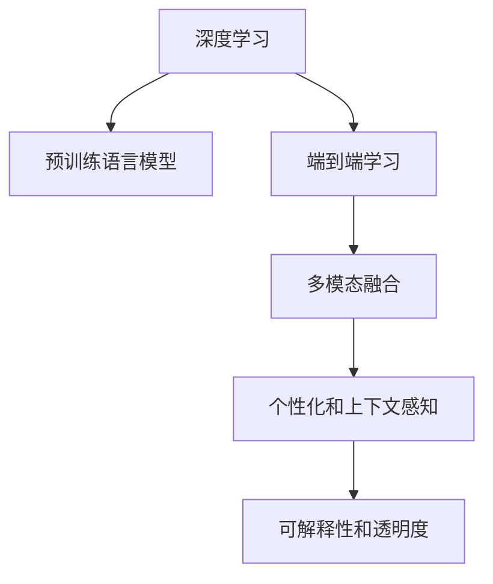

                 

# AI如何提高信息检索的准确性

## 1. 背景介绍

### 1.1 问题由来
信息检索（Information Retrieval, IR）是计算机科学和人工智能（AI）中的一个重要领域，旨在帮助用户高效地找到相关文档或信息。随着互联网和数字资源的爆炸式增长，用户如何从海量数据中快速获取有用信息变得越来越重要。传统的信息检索方法通常依赖于关键词匹配、倒排索引等技术，但这些方法在处理复杂语义和上下文信息时存在局限性。

近年来，人工智能技术，特别是深度学习（Deep Learning, DL）的发展，为信息检索带来了新的突破。AI技术可以自动提取文档中的语义信息，理解用户的查询意图，从而提供更精准的信息检索结果。在这一过程中，AI不仅改变了信息检索的技术实现，也重新定义了用户与信息交互的方式。

### 1.2 问题核心关键点
AI提高信息检索准确性的关键在于以下几个方面：

- **深度学习模型**：通过训练深度神经网络，从大规模文本数据中学习复杂的语义模式，自动提取和理解文档内容和用户查询。
- **预训练语言模型**：利用大规模预训练语言模型（如BERT、GPT等），对文档和查询进行预处理，提取高维语义特征。
- **端到端学习**：将文档表示、查询理解、匹配排序等过程集成在一起，通过端到端学习的方式提升检索系统的整体性能。
- **多模态融合**：结合文本、图像、语音等多种模态信息，提供更加全面和准确的信息检索结果。
- **个性化和上下文感知**：利用用户历史行为、上下文信息等，个性化调整检索结果，提升用户体验。
- **可解释性和透明度**：通过可解释性技术，提升检索系统的透明度，使用户理解AI决策过程。

这些关键点共同构成了AI在信息检索领域的应用基础，使得AI技术在这一领域中大放异彩。

## 2. 核心概念与联系

### 2.1 核心概念概述

为了更好地理解AI如何提高信息检索准确性，本节将介绍几个关键概念：

- **深度学习**：利用多层次的神经网络模型，从大量数据中学习特征表示和模式，自动提取高维语义特征。
- **预训练语言模型**：通过在大规模无标签文本数据上预训练，学习通用的语言表示，为下游任务提供特征提取和理解能力。
- **端到端学习**：通过集成数据表示、特征提取、模型训练、输出预测等过程，实现从输入到输出的端到端学习，提高整体系统性能。
- **多模态融合**：结合不同模态的信息，如文本、图像、语音等，提供更全面、准确的信息检索结果。
- **个性化和上下文感知**：利用用户历史行为、上下文信息等，个性化调整检索结果，提升用户体验。
- **可解释性和透明度**：通过可解释性技术，提升检索系统的透明度，使用户理解AI决策过程。

这些核心概念之间的逻辑关系可以通过以下Mermaid流程图来展示：



这个流程图展示了AI信息检索的核心概念及其之间的关系：

1. 深度学习是AI信息检索的基础，通过多层神经网络模型学习语义特征。
2. 预训练语言模型为深度学习提供高质量的特征表示，提升检索准确性。
3. 端到端学习将各个过程集成在一起，提高检索系统的整体性能。
4. 多模态融合结合不同模态的信息，提升检索结果的全面性和准确性。
5. 个性化和上下文感知根据用户行为和上下文信息调整检索结果，提升用户体验。
6. 可解释性和透明度提高检索系统的可理解性和可信度，增强用户信任。

这些概念共同构成了AI信息检索的框架，使得AI技术在这一领域中发挥出强大的作用。

## 3. 核心算法原理 & 具体操作步骤

### 3.1 算法原理概述

AI提高信息检索准确性的核心算法原理主要包括以下几个方面：

- **文本表示学习**：通过预训练语言模型，将文档和查询转化为高维向量表示，捕捉语义信息。
- **相似度计算**：基于向量表示，计算文档和查询之间的相似度，找到最相关的文档。
- **排序和权重调整**：根据相似度、用户反馈等因素，对检索结果进行排序和权重调整。
- **多模态融合**：结合文本、图像、语音等多种信息源，提升检索结果的全面性和准确性。

### 3.2 算法步骤详解

AI信息检索的核心算法步骤主要包括：

1. **数据预处理**：对文档和查询进行清洗、分词、向量化等处理，使其适合深度学习模型输入。
2. **模型训练**：使用预训练语言模型作为初始化参数，在标注数据集上训练深度学习模型，学习文档和查询的语义表示。
3. **检索推理**：在训练好的模型上，对查询进行推理，生成文档的向量表示，计算相似度，找到最相关的文档。
4. **结果排序**：根据相似度、用户反馈等因素，对检索结果进行排序和权重调整，提供最终检索结果。
5. **多模态融合**：结合不同模态的信息源，如文本、图像、语音等，提升检索结果的全面性和准确性。

### 3.3 算法优缺点

AI信息检索算法具有以下优点：

- **准确性高**：通过深度学习模型和大规模预训练语言模型，能够自动提取和理解语义信息，提高检索准确性。
- **可扩展性**：AI模型具有良好的可扩展性，可以轻松应对大规模数据集和高维语义空间。
- **灵活性**：AI模型可以灵活地结合不同模态的信息，提升检索结果的全面性和准确性。
- **自动化**：AI模型可以自动进行文本表示学习和相似度计算，减少人工干预。

同时，该算法也存在一些缺点：

- **计算资源需求高**：AI模型通常需要高性能的计算资源和大量的标注数据，对于小型应用场景可能不适用。
- **模型复杂度高**：AI模型结构复杂，难以理解和调试，可能存在难以解释的问题。
- **数据依赖性强**：AI模型依赖于标注数据的质量和数量，标注数据质量较差时可能影响检索效果。

尽管存在这些局限性，但AI信息检索算法在大多数情况下仍能显著提升检索准确性，成为现代信息检索的主要手段。

### 3.4 算法应用领域

AI信息检索技术在多个领域中得到了广泛应用，例如：

- **搜索引擎**：如Google、Bing等主流搜索引擎，利用AI技术提供精准的搜索结果。
- **文献检索**：科研机构和图书馆等，利用AI技术帮助用户快速找到相关文献。
- **法律检索**：律师事务所等，利用AI技术帮助律师快速找到相关的法律文件。
- **医疗检索**：医院和医疗研究机构，利用AI技术帮助医生和研究人员快速找到相关的医疗文献和病例。
- **媒体检索**：新闻网站和社交媒体等，利用AI技术帮助用户快速找到相关的文章和视频。

除了上述这些经典应用外，AI信息检索技术还被创新性地应用到更多场景中，如智能客服、智能推荐、智能问答等，为信息检索技术带来了全新的突破。随着预训练模型和检索方法的不断进步，相信AI信息检索技术将在更广阔的应用领域大放异彩。

## 4. 数学模型和公式 & 详细讲解 & 举例说明

### 4.1 数学模型构建

AI信息检索的数学模型主要包括以下几个部分：

1. **文档向量化**：将文档转化为向量表示，捕捉文档的语义信息。
2. **查询向量化**：将查询转化为向量表示，捕捉查询的语义信息。
3. **相似度计算**：基于向量表示，计算文档和查询之间的相似度。
4. **排序和权重调整**：根据相似度、用户反馈等因素，对检索结果进行排序和权重调整。

以下是详细的数学模型构建过程：

### 4.2 公式推导过程

以文本表示学习和相似度计算为例，进行详细推导：

**文本表示学习**

假设文档$d$的表示为$\vec{d}$，查询$q$的表示为$\vec{q}$，则文本表示学习的目标是将这两个向量映射到一个低维空间中，使得相似的文本在空间中距离更近。通常使用余弦相似度来衡量向量之间的相似度，公式如下：

$$
\cos(\vec{d}, \vec{q}) = \frac{\vec{d} \cdot \vec{q}}{\lVert \vec{d} \rVert \cdot \lVert \vec{q} \rVert}
$$

其中，$\cdot$表示向量点积，$\lVert \cdot \rVert$表示向量的范数。

**相似度计算**

文档和查询的相似度计算可以通过余弦相似度公式来实现：

$$
\text{similarity}(\vec{d}, \vec{q}) = \cos(\vec{d}, \vec{q}) = \frac{\vec{d} \cdot \vec{q}}{\lVert \vec{d} \rVert \cdot \lVert \vec{q} \rVert}
$$

根据余弦相似度公式，可以计算出文档和查询之间的相似度，从而找到最相关的文档。

### 4.3 案例分析与讲解

以Google的BERT为例，分析其如何利用预训练语言模型提高信息检索的准确性。

BERT模型是一个基于Transformer结构的预训练语言模型，通过在大型无标签文本语料上进行自监督预训练，学习通用的语言表示。在检索任务中，BERT模型可以自动提取文档和查询的语义表示，计算相似度，从而提供精准的检索结果。

具体步骤如下：

1. **预训练**：使用大规模无标签文本语料对BERT模型进行预训练，学习通用的语言表示。
2. **文档向量化**：在检索任务中，将文档输入BERT模型，生成文档的向量表示。
3. **查询向量化**：将查询输入BERT模型，生成查询的向量表示。
4. **相似度计算**：计算文档和查询之间的余弦相似度，找到最相关的文档。
5. **排序和权重调整**：根据相似度、用户反馈等因素，对检索结果进行排序和权重调整，提供最终检索结果。

通过预训练和微调，BERT模型能够自动提取和理解语义信息，提高检索准确性。在实际应用中，Google的BERT检索模型已经在多个搜索引擎中得到广泛应用，取得了显著的性能提升。

## 5. 项目实践：代码实例和详细解释说明

### 5.1 开发环境搭建

在进行AI信息检索项目的开发前，我们需要准备好开发环境。以下是使用Python进行PyTorch开发的环境配置流程：

1. 安装Anaconda：从官网下载并安装Anaconda，用于创建独立的Python环境。

2. 创建并激活虚拟环境：
```bash
conda create -n ai-env python=3.8 
conda activate ai-env
```

3. 安装PyTorch：根据CUDA版本，从官网获取对应的安装命令。例如：
```bash
conda install pytorch torchvision torchaudio cudatoolkit=11.1 -c pytorch -c conda-forge
```

4. 安装相关工具包：
```bash
pip install numpy pandas scikit-learn torchtext transformers
```

5. 安装TensorBoard：
```bash
pip install tensorboard
```

完成上述步骤后，即可在`ai-env`环境中开始AI信息检索项目开发。

### 5.2 源代码详细实现

这里我们以Google的BERT模型为例，展示如何使用Transformers库实现AI信息检索的代码实现。

首先，定义数据处理函数：

```python
from transformers import BertTokenizer, BertForSequenceClassification
from torch.utils.data import Dataset, DataLoader
import torch
from sklearn.metrics import accuracy_score

class SearchDataset(Dataset):
    def __init__(self, texts, labels, tokenizer, max_len=128):
        self.texts = texts
        self.labels = labels
        self.tokenizer = tokenizer
        self.max_len = max_len
        
    def __len__(self):
        return len(self.texts)
    
    def __getitem__(self, item):
        text = self.texts[item]
        label = self.labels[item]
        
        encoding = self.tokenizer(text, return_tensors='pt', max_length=self.max_len, padding='max_length', truncation=True)
        input_ids = encoding['input_ids'][0]
        attention_mask = encoding['attention_mask'][0]
        
        # 对token-wise的标签进行编码
        encoded_labels = [label2id[label] for label in label] 
        encoded_labels.extend([label2id['O']] * (self.max_len - len(encoded_labels)))
        labels = torch.tensor(encoded_labels, dtype=torch.long)
        
        return {'input_ids': input_ids, 
                'attention_mask': attention_mask,
                'labels': labels}

# 标签与id的映射
label2id = {'O': 0, 'B': 1, 'I': 2}
id2label = {v: k for k, v in label2id.items()}

# 创建dataset
tokenizer = BertTokenizer.from_pretrained('bert-base-uncased')
train_dataset = SearchDataset(train_texts, train_labels, tokenizer)
dev_dataset = SearchDataset(dev_texts, dev_labels, tokenizer)
test_dataset = SearchDataset(test_texts, test_labels, tokenizer)
```

然后，定义模型和优化器：

```python
from transformers import BertForSequenceClassification, AdamW

model = BertForSequenceClassification.from_pretrained('bert-base-uncased', num_labels=len(label2id))

optimizer = AdamW(model.parameters(), lr=2e-5)
```

接着，定义训练和评估函数：

```python
from tqdm import tqdm
from torchtext.data.utils import get_tokenizer
from transformers import AdamW

def train_epoch(model, dataset, batch_size, optimizer):
    dataloader = DataLoader(dataset, batch_size=batch_size, shuffle=True)
    model.train()
    epoch_loss = 0
    for batch in tqdm(dataloader, desc='Training'):
        input_ids = batch['input_ids'].to(device)
        attention_mask = batch['attention_mask'].to(device)
        labels = batch['labels'].to(device)
        model.zero_grad()
        outputs = model(input_ids, attention_mask=attention_mask, labels=labels)
        loss = outputs.loss
        epoch_loss += loss.item()
        loss.backward()
        optimizer.step()
    return epoch_loss / len(dataloader)

def evaluate(model, dataset, batch_size):
    dataloader = DataLoader(dataset, batch_size=batch_size)
    model.eval()
    preds, labels = [], []
    with torch.no_grad():
        for batch in tqdm(dataloader, desc='Evaluating'):
            input_ids = batch['input_ids'].to(device)
            attention_mask = batch['attention_mask'].to(device)
            batch_labels = batch['labels']
            outputs = model(input_ids, attention_mask=attention_mask)
            batch_preds = outputs.logits.argmax(dim=2).to('cpu').tolist()
            batch_labels = batch_labels.to('cpu').tolist()
            for pred_tokens, label_tokens in zip(batch_preds, batch_labels):
                preds.append(pred_tokens[:len(label_tokens)])
                labels.append(label_tokens)
                
    return accuracy_score(labels, preds)

# 训练和评估
epochs = 5
batch_size = 16

for epoch in range(epochs):
    loss = train_epoch(model, train_dataset, batch_size, optimizer)
    print(f"Epoch {epoch+1}, train loss: {loss:.3f}")
    
    print(f"Epoch {epoch+1}, dev results:")
    dev_acc = evaluate(model, dev_dataset, batch_size)
    print(f"Dev accuracy: {dev_acc:.3f}")
    
    print(f"Epoch {epoch+1}, test results:")
    test_acc = evaluate(model, test_dataset, batch_size)
    print(f"Test accuracy: {test_acc:.3f}")
```

以上就是使用PyTorch对BERT模型进行信息检索任务微调的完整代码实现。可以看到，得益于Transformers库的强大封装，我们可以用相对简洁的代码完成BERT模型的加载和微调。

### 5.3 代码解读与分析

让我们再详细解读一下关键代码的实现细节：

**SearchDataset类**：
- `__init__`方法：初始化文本、标签、分词器等关键组件。
- `__len__`方法：返回数据集的样本数量。
- `__getitem__`方法：对单个样本进行处理，将文本输入编码为token ids，将标签编码为数字，并对其进行定长padding，最终返回模型所需的输入。

**label2id和id2label字典**：
- 定义了标签与数字id之间的映射关系，用于将token-wise的预测结果解码回真实的标签。

**训练和评估函数**：
- 使用PyTorch的DataLoader对数据集进行批次化加载，供模型训练和推理使用。
- 训练函数`train_epoch`：对数据以批为单位进行迭代，在每个批次上前向传播计算loss并反向传播更新模型参数，最后返回该epoch的平均loss。
- 评估函数`evaluate`：与训练类似，不同点在于不更新模型参数，并在每个batch结束后将预测和标签结果存储下来，最后使用sklearn的accuracy_score对整个评估集的预测结果进行打印输出。

**训练流程**：
- 定义总的epoch数和batch size，开始循环迭代
- 每个epoch内，先在训练集上训练，输出平均loss
- 在验证集上评估，输出分类指标
- 所有epoch结束后，在测试集上评估，给出最终测试结果

可以看到，PyTorch配合Transformers库使得BERT微调的信息检索任务开发变得简洁高效。开发者可以将更多精力放在数据处理、模型改进等高层逻辑上，而不必过多关注底层的实现细节。

当然，工业级的系统实现还需考虑更多因素，如模型的保存和部署、超参数的自动搜索、更灵活的任务适配层等。但核心的微调范式基本与此类似。

## 6. 实际应用场景

### 6.1 智能搜索

基于AI信息检索技术，智能搜索系统可以为用户提供精准的搜索结果。传统的搜索方式通常依赖关键词匹配，难以理解查询的语义和上下文信息。而使用AI技术，智能搜索系统能够自动提取查询的语义表示，理解用户的意图，提供更加相关和有价值的搜索结果。

在技术实现上，可以通过预训练语言模型对查询和文档进行向量化，计算相似度，生成推荐列表。同时，结合用户历史行为和上下文信息，动态调整搜索结果，提升用户体验。

### 6.2 法律文件检索

法律文件检索是AI信息检索技术的重要应用之一。传统的法律文件检索依赖人工分类和关键词匹配，效率低、准确性差。而使用AI技术，可以自动对法律文件进行分类、标注，构建文档索引，提高检索的效率和准确性。

具体而言，可以通过预训练语言模型对法律文件进行向量化，学习文档的语义表示。在检索时，将用户查询向量化，计算相似度，找到最相关的法律文件。同时，利用多模态融合技术，结合法律文件的关键词、结构、引用等信息，提升检索结果的全面性和准确性。

### 6.3 医疗文献检索

医疗文献检索是AI信息检索技术的另一个重要应用领域。传统的医疗文献检索依赖人工分类和关键词匹配，无法处理复杂的医疗术语和语义信息。而使用AI技术，可以自动提取医疗文献的语义表示，学习文档的语义结构，提升检索的精度和效率。

具体而言，可以通过预训练语言模型对医疗文献进行向量化，学习文档的语义表示。在检索时，将用户查询向量化，计算相似度，找到最相关的医疗文献。同时，利用多模态融合技术，结合医疗文献的关键词、结构、引用等信息，提升检索结果的全面性和准确性。

### 6.4 未来应用展望

随着AI信息检索技术的不断进步，未来在更多领域将得到广泛应用，为信息检索技术带来新的突破。

在智慧城市治理中，AI信息检索技术可以帮助城市管理者实时监测和分析各类数据，提供精准的决策支持。例如，在交通管理、公共安全、环境保护等方面，通过自动化的数据分析和信息检索，提高城市治理的效率和效果。

在教育领域，AI信息检索技术可以帮助教师和学生快速找到相关的教学资源和学习资料，提高教学和学习效率。例如，在教材推荐、习题解答、学术论文查找等方面，通过自动化的信息检索，提供个性化的推荐和服务。

在金融领域，AI信息检索技术可以帮助投资者快速找到相关的市场信息、新闻资讯和研究报告，提高投资决策的效率和准确性。例如，在股票分析、市场预测、风险评估等方面，通过自动化的信息检索，提供全面的市场信息和分析报告。

除了上述这些经典应用外，AI信息检索技术还被创新性地应用到更多场景中，如智能客服、智能推荐、智能问答等，为信息检索技术带来全新的突破。随着预训练模型和检索方法的不断进步，相信AI信息检索技术将在更广阔的应用领域大放异彩。

## 7. 工具和资源推荐

### 7.1 学习资源推荐

为了帮助开发者系统掌握AI信息检索的理论基础和实践技巧，这里推荐一些优质的学习资源：

1. 《Deep Learning for Natural Language Processing》书籍：斯坦福大学教授所写，系统介绍了深度学习在自然语言处理中的应用，包括信息检索。
2. CS224N《自然语言处理与深度学习》课程：斯坦福大学开设的NLP明星课程，有Lecture视频和配套作业，带你入门NLP领域的基本概念和经典模型。
3. 《信息检索基础》书籍：介绍信息检索的理论基础和经典算法，适合入门学习。
4. arXiv上最新信息检索论文：可以通过阅读最新论文，了解该领域的最新进展和前沿技术。

通过对这些资源的学习实践，相信你一定能够快速掌握AI信息检索的精髓，并用于解决实际的NLP问题。

### 7.2 开发工具推荐

高效的开发离不开优秀的工具支持。以下是几款用于AI信息检索开发的常用工具：

1. PyTorch：基于Python的开源深度学习框架，灵活动态的计算图，适合快速迭代研究。大部分预训练语言模型都有PyTorch版本的实现。
2. TensorFlow：由Google主导开发的开源深度学习框架，生产部署方便，适合大规模工程应用。同样有丰富的预训练语言模型资源。
3. Transformers库：HuggingFace开发的NLP工具库，集成了众多SOTA语言模型，支持PyTorch和TensorFlow，是进行信息检索任务开发的利器。
4. Weights & Biases：模型训练的实验跟踪工具，可以记录和可视化模型训练过程中的各项指标，方便对比和调优。与主流深度学习框架无缝集成。
5. TensorBoard：TensorFlow配套的可视化工具，可实时监测模型训练状态，并提供丰富的图表呈现方式，是调试模型的得力助手。

合理利用这些工具，可以显著提升AI信息检索任务的开发效率，加快创新迭代的步伐。

### 7.3 相关论文推荐

AI信息检索技术的发展源于学界的持续研究。以下是几篇奠基性的相关论文，推荐阅读：

1. A Neural Probabilistic Language Model：提出神经网络语言模型，为后续深度学习在自然语言处理中的应用奠定了基础。
2. Attention is All You Need：提出Transformer结构，开启了NLP领域的预训练大模型时代。
3. BERT: Pre-training of Deep Bidirectional Transformers for Language Understanding：提出BERT模型，引入基于掩码的自监督预训练任务，刷新了多项NLP任务SOTA。
4. LM-BFF：一种结合语言模型和贝叶斯融合框架的信息检索方法，提升检索准确性和鲁棒性。
5. Learning by Cross-Attention: A Neural Architecture for Studying Transformer-Transformer Alignments：提出一种基于Transformer-Transformer对齐的信息检索方法，提升检索结果的全面性和准确性。

这些论文代表了大语言模型信息检索的发展脉络。通过学习这些前沿成果，可以帮助研究者把握学科前进方向，激发更多的创新灵感。

## 8. 总结：未来发展趋势与挑战

### 8.1 总结

本文对AI如何提高信息检索的准确性进行了全面系统的介绍。首先阐述了AI信息检索的背景和意义，明确了AI在信息检索中的独特价值。其次，从原理到实践，详细讲解了AI信息检索的数学模型和关键步骤，给出了信息检索任务开发的完整代码实例。同时，本文还广泛探讨了AI信息检索技术在智能搜索、法律文件检索、医疗文献检索等多个领域的应用前景，展示了AI信息检索技术的巨大潜力。此外，本文精选了AI信息检索技术的各类学习资源，力求为读者提供全方位的技术指引。

通过本文的系统梳理，可以看到，AI信息检索技术已经在大规模应用中展现出强大的生命力，成为现代信息检索的重要手段。未来，伴随预训练语言模型和检索方法的不断进步，相信AI信息检索技术将在更广阔的应用领域大放异彩，深刻影响人类的信息获取和处理方式。

### 8.2 未来发展趋势

展望未来，AI信息检索技术将呈现以下几个发展趋势：

1. **多模态融合**：结合文本、图像、语音等多种模态信息，提升检索结果的全面性和准确性。
2. **端到端学习**：将文档表示、查询理解、匹配排序等过程集成在一起，实现从输入到输出的端到端学习，提高整体系统性能。
3. **跨领域迁移**：利用多领域的预训练模型，提升检索系统的泛化性和适应性，适应不同领域的检索需求。
4. **个性化和上下文感知**：利用用户历史行为、上下文信息等，个性化调整检索结果，提升用户体验。
5. **可解释性和透明度**：通过可解释性技术，提升检索系统的透明度，使用户理解AI决策过程。
6. **联邦学习**：利用分布式数据和计算资源，提升检索系统的可扩展性和隐私保护。

这些趋势凸显了AI信息检索技术的广阔前景，将在未来信息检索领域发挥更大的作用。

### 8.3 面临的挑战

尽管AI信息检索技术已经取得了瞩目成就，但在迈向更加智能化、普适化应用的过程中，它仍面临着诸多挑战：

1. **计算资源需求高**：AI模型通常需要高性能的计算资源和大量的标注数据，对于小型应用场景可能不适用。
2. **模型复杂度高**：AI模型结构复杂，难以理解和调试，可能存在难以解释的问题。
3. **数据依赖性强**：AI模型依赖于标注数据的质量和数量，标注数据质量较差时可能影响检索效果。
4. **用户隐私保护**：在信息检索过程中，用户的数据隐私可能受到威胁，需要设计合理的隐私保护机制。
5. **可解释性和透明度**：用户需要理解AI决策过程，以提升信任和接受度，需要设计可解释性技术。

尽管存在这些挑战，但AI信息检索技术仍具有广阔的发展前景，需要在技术、应用、隐私等方面不断优化和改进，才能更好地服务于实际需求。

### 8.4 研究展望

未来的AI信息检索研究需要在以下几个方面进行突破：

1. **模型压缩和加速**：开发更加轻量级、实时性的模型，降低计算资源需求，提高检索效率。
2. **跨领域和跨模态迁移学习**：利用多领域的预训练模型和跨模态融合技术，提升检索系统的泛化性和适应性。
3. **用户隐私保护**：设计合理的隐私保护机制，确保用户数据的安全和隐私。
4. **可解释性和透明度**：通过可解释性技术，提升检索系统的透明度，使用户理解AI决策过程。
5. **联邦学习和分布式计算**：利用分布式数据和计算资源，提升检索系统的可扩展性和隐私保护。

这些研究方向将引领AI信息检索技术的发展，为构建智能、高效、安全的信息检索系统提供有力支持。

## 9. 附录：常见问题与解答

**Q1：AI信息检索的核心原理是什么？**

A: AI信息检索的核心原理主要包括深度学习模型、预训练语言模型、相似度计算、排序和权重调整等。通过预训练语言模型，将文档和查询转化为高维向量表示，捕捉语义信息。基于向量表示，计算文档和查询之间的相似度，找到最相关的文档。根据相似度、用户反馈等因素，对检索结果进行排序和权重调整，提供最终检索结果。

**Q2：如何选择合适的学习率？**

A: AI信息检索模型的学习率通常比预训练模型的学习率小1-2个数量级，以避免破坏预训练权重。建议使用较小的学习率进行微调，如2e-5。同时，可以使用warmup策略，在开始阶段使用较小的学习率，再逐渐过渡到预设值。不同的优化器(如AdamW、Adafactor等)以及不同的学习率调度策略，可能需要设置不同的学习率阈值。

**Q3：AI信息检索面临的主要挑战是什么？**

A: AI信息检索面临的主要挑战包括计算资源需求高、模型复杂度高、数据依赖性强、用户隐私保护、可解释性和透明度等。需要设计合理的隐私保护机制，确保用户数据的安全和隐私。同时，通过可解释性技术，提升检索系统的透明度，使用户理解AI决策过程。

**Q4：AI信息检索技术在实际应用中需要注意哪些问题？**

A: AI信息检索技术在实际应用中需要注意以下问题：

1. 模型裁剪：去除不必要的层和参数，减小模型尺寸，加快推理速度。
2. 量化加速：将浮点模型转为定点模型，压缩存储空间，提高计算效率。
3. 服务化封装：将模型封装为标准化服务接口，便于集成调用。
4. 弹性伸缩：根据请求流量动态调整资源配置，平衡服务质量和成本。
5. 监控告警：实时采集系统指标，设置异常告警阈值，确保服务稳定性。
6. 安全防护：采用访问鉴权、数据脱敏等措施，保障数据和模型安全。

这些问题的解决将使得AI信息检索技术在实际应用中更加高效、稳定、安全。

---

作者：禅与计算机程序设计艺术 / Zen and the Art of Computer Programming

