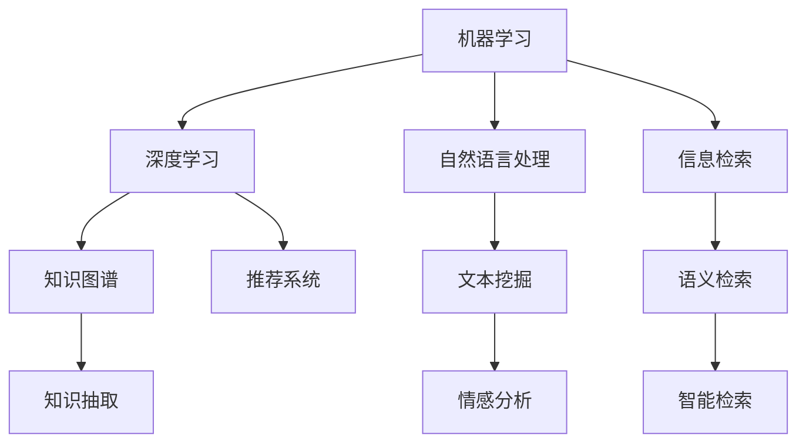

                 

# AI如何改变学术研究和信息检索

## 1. 背景介绍

### 1.1 问题由来

随着大数据和计算能力的飞速发展，人工智能(AI)在学术研究和信息检索领域的应用日趋广泛。无论是科研数据的分析挖掘、学术文献的智能检索，还是个性化推荐、自然语言处理等，AI技术的深入应用正在深刻改变学术研究和信息检索的生态。

AI技术的发展为学术研究提供了前所未有的便利。通过智能化的数据分析工具，研究者可以高效地整理、分析和解读海量数据，挖掘出有价值的科研洞见。在信息检索领域，AI驱动的智能系统能够精准匹配用户查询需求，快速检索到相关学术资源，显著提升了科研工作的效率和质量。

### 1.2 问题核心关键点

AI在学术研究和信息检索中扮演的角色可以从以下几个核心关键点进行剖析：

- **数据驱动的学术研究**：通过机器学习和深度学习等技术，AI可以从海量数据中挖掘出有价值的科研洞见，辅助研究者进行科学发现。
- **智能化的信息检索**：AI驱动的检索系统能够理解和解析用户查询，通过高效的算法匹配大量学术资源，提升信息检索的准确性和效率。
- **个性化的学术推荐**：基于用户行为和兴趣，AI可以推荐最相关、最符合需求的学术文献，优化科研工作的资源利用。
- **文本挖掘与情感分析**：通过自然语言处理(NLP)技术，AI可以自动分析和提取科研论文中的关键信息，辅助文献整理和情感分析。
- **图像和视频处理**：AI技术在图像和视频处理上的应用，为科研工作提供了强大的可视化支持，增强了研究结果的可解释性和可视化效果。

这些关键点共同构成了AI在学术研究和信息检索领域的核心价值，展示了其在提升科研效率、优化资源分配、增强文献分析等方面的巨大潜力。

## 2. 核心概念与联系

### 2.1 核心概念概述

为更好地理解AI在学术研究和信息检索中的应用，本节将介绍几个密切相关的核心概念：

- **机器学习(ML)**：通过数据驱动的算法训练，使计算机能够从经验中学习并改进自身性能，实现自主决策和模式识别。
- **深度学习(DL)**：一种特殊的机器学习技术，使用多层次的非线性变换模型，能够处理复杂的非线性数据结构。
- **自然语言处理(NLP)**：通过算法处理和理解人类语言，实现文本的自动分类、情感分析、机器翻译等任务。
- **信息检索(IR)**：从大量信息集合中检索出符合用户需求的信息，包括传统的信息检索和智能的语义检索。
- **知识图谱(KG)**：由实体、关系和属性组成的图形结构，用于存储和管理实体间的知识关系。
- **推荐系统(Recommender Systems)**：通过分析用户行为和偏好，为用户推荐个性化内容或商品的系统。

这些核心概念之间的逻辑关系可以通过以下Mermaid流程图来展示：



这个流程图展示了几组核心概念之间的联系：

1. 机器学习是深度学习的基础。
2. 自然语言处理是机器学习在文本领域的应用。
3. 信息检索和语义检索是深度学习在文本领域的应用。
4. 知识图谱是深度学习在知识抽取领域的应用。
5. 推荐系统是基于用户行为数据的机器学习应用。

这些概念共同构成了AI在学术研究和信息检索领域的技术框架，使得AI技术能够高效地应用于各环节，提升科研和信息检索的智能化水平。

## 3. 核心算法原理 & 具体操作步骤

### 3.1 算法原理概述

AI在学术研究和信息检索中的应用，主要依赖于以下几个核心算法原理：

- **文本预处理与表示**：将非结构化的文本数据转化为机器可处理的向量形式。常见方法包括词袋模型、TF-IDF、Word2Vec、BERT等。
- **信息检索与排序**：通过相似度计算和排序算法，将查询结果与用户需求进行匹配。常用方法包括倒排索引、BM25、Deep IR等。
- **推荐系统算法**：通过分析用户行为和兴趣，为用户推荐个性化的学术文献或资源。常用方法包括协同过滤、基于内容的推荐、深度学习推荐模型等。
- **情感分析和文本挖掘**：通过NLP技术，从文本中提取情感和关键信息，辅助学术研究的文献整理和数据分析。常用方法包括情感分类、主题模型、文本聚类等。
- **图像和视频处理**：通过深度学习模型，对图像和视频数据进行特征提取和分析，辅助科研工作的可视化。常用方法包括卷积神经网络(CNN)、自编码器(AE)等。

### 3.2 算法步骤详解

AI在学术研究和信息检索中的应用流程，通常包括以下几个关键步骤：

**Step 1: 数据收集与预处理**
- 收集学术文献、科研数据、用户行为等数据集。
- 对数据进行清洗、标注、归一化等预处理步骤，确保数据质量和一致性。

**Step 2: 模型选择与训练**
- 根据具体任务选择合适的算法模型。
- 使用训练集数据对模型进行训练，调整超参数，优化模型性能。

**Step 3: 模型评估与优化**
- 在验证集上评估模型性能，确定最优模型配置。
- 应用模型于测试集进行最终评估，确保模型鲁棒性和泛化能力。

**Step 4: 部署与集成**
- 将训练好的模型部署到生产环境中，实现自动化推理。
- 集成到科研工作流或信息检索系统中，提供智能服务。

**Step 5: 持续改进与迭代**
- 根据用户反馈和应用场景的变化，不断更新和优化模型。
- 通过A/B测试等方法，评估改进效果，持续提升AI系统的效能。

### 3.3 算法优缺点

AI在学术研究和信息检索中的应用，具有以下优点：

1. 高效性：通过自动化处理和智能推理，显著提升数据处理和信息检索的效率。
2. 准确性：基于大量的数据训练，AI模型能够提供精准的分析和推荐结果。
3. 个性化：能够根据用户行为和偏好，提供定制化的科研和信息检索服务。
4. 适应性：能够应对数据分布的变化，灵活调整算法参数和模型结构。

同时，这些算法也存在一定的局限性：

1. 数据依赖：AI系统的效能很大程度上依赖于数据质量和数据量，数据不充分时效果不佳。
2. 过拟合风险：在数据量较少的情况下，AI模型容易过拟合，泛化能力受限。
3. 解释性不足：AI模型往往缺乏可解释性，难以理解其内部决策过程。
4. 偏见与歧视：AI模型可能继承数据中的偏见，产生歧视性的输出结果。
5. 技术复杂：AI技术涉及复杂的算法和模型设计，需要专业知识和技术积累。

尽管存在这些局限性，AI在学术研究和信息检索领域的应用，依然展现了强大的生命力和潜力。未来，相关研究将重点关注如何克服这些挑战，进一步提升AI系统的性能和可用性。

### 3.4 算法应用领域

AI在学术研究和信息检索中的应用，涵盖多个领域，具体包括：

- **科学研究与数据分析**：通过机器学习和深度学习技术，分析海量科研数据，挖掘科学洞见。
- **智能文献检索与推荐**：利用信息检索和推荐系统技术，快速定位相关学术资源，提供个性化推荐服务。
- **自然语言处理与文本挖掘**：应用NLP技术，自动分析科研论文中的关键信息，辅助文献整理和情感分析。
- **图像与视频处理**：使用计算机视觉技术，辅助科研工作的可视化，增强研究结果的可视化效果。
- **个性化学习与教育**：结合AI技术，提供智能化的个性化学习方案，辅助教育工作者的教学和科研。
- **知识管理和协作**：通过知识图谱和推荐系统，优化科研团队的知识共享和协作。

这些应用领域展示了AI技术在学术研究和信息检索中的广泛应用，为科研工作的智能化转型提供了有力支撑。

## 4. 数学模型和公式 & 详细讲解 & 举例说明（备注：数学公式请使用latex格式，latex嵌入文中独立段落使用 $$，段落内使用 $)
### 4.1 数学模型构建

本节将使用数学语言对AI在学术研究和信息检索中的应用进行更加严格的刻画。

设 $D$ 为科研数据集，$T$ 为信息检索查询，$Q$ 为用户行为数据集，$M$ 为预训练的语言模型，$S$ 为推荐系统模型。

定义 $M$ 在输入 $x$ 上的输出为 $M(x)$，$S$ 在用户行为 $q$ 上的推荐结果为 $S(q)$。

定义信息检索系统的损失函数为 $\mathcal{L}(D, T)$，表示检索结果与用户需求之间的误差。

定义推荐系统的损失函数为 $\mathcal{L}(Q, S)$，表示推荐结果与用户偏好之间的误差。

目标是最小化上述两个损失函数，即：

$$
\mathop{\arg\min}_{M,S} (\mathcal{L}(D, T) + \mathcal{L}(Q, S))
$$

### 4.2 公式推导过程

以信息检索系统为例，推导BM25算法中的相关公式。

假设检索系统查询为 $T$，检索结果为 $R$，则BM25算法中的文档相关性评分函数 $R(T, R)$ 可表示为：

$$
R(T, R) = (1 - b + b \times \frac{1}{k_1} + \frac{(|R| + k_1) \times d_{T,R}}{(k_1 + b \times |R|) \times L(R)})
$$

其中 $b$ 和 $k_1$ 为BM25算法的超参数，$|R|$ 为文档 $R$ 的词汇数，$d_{T,R}$ 为查询 $T$ 和文档 $R$ 的交集词频，$L(R)$ 为文档 $R$ 的平均词长。

将上述公式代入总损失函数，得：

$$
\mathcal{L}(D, T) = \frac{1}{N} \sum_{i=1}^N \sum_{j=1}^M R(T, R_j) \times (1 - y_j)
$$

其中 $y_j$ 为文档 $R_j$ 是否为相关文档的标签，$N$ 为文档总数。

将上述损失函数最小化，即：

$$
\mathop{\arg\min}_{M,S} (\mathcal{L}(D, T) + \mathcal{L}(Q, S))
$$

### 4.3 案例分析与讲解

以学术文献推荐系统为例，介绍如何构建基于深度学习的推荐模型。

假设输入为用户的行为数据 $Q$，模型参数为 $\theta$，输出为用户推荐的学术文献列表 $S$。

**数据处理**：将用户行为数据 $Q$ 转化为向量形式，与学术文献的元数据进行拼接。

**模型训练**：使用神经网络模型对拼接后的向量进行特征提取，并通过全连接层输出推荐结果。

**损失函数**：定义均方误差损失函数 $\mathcal{L}(Q, S)$，表示推荐结果与用户偏好之间的误差。

**优化算法**：使用Adam等优化算法，最小化总损失函数 $\mathcal{L}(D, T) + \mathcal{L}(Q, S)$。

**评估与优化**：在验证集上评估模型性能，通过超参数调优和模型结构优化，提升推荐效果。

**部署与迭代**：将训练好的模型部署到生产环境中，不断收集用户反馈，持续改进模型。

以上公式和步骤展示了学术文献推荐系统的构建过程，展示了AI技术在推荐系统中的应用。

## 5. 项目实践：代码实例和详细解释说明
### 5.1 开发环境搭建

在进行AI应用实践前，我们需要准备好开发环境。以下是使用Python进行PyTorch开发的环境配置流程：

1. 安装Anaconda：从官网下载并安装Anaconda，用于创建独立的Python环境。

2. 创建并激活虚拟环境：
```bash
conda create -n pytorch-env python=3.8 
conda activate pytorch-env
```

3. 安装PyTorch：根据CUDA版本，从官网获取对应的安装命令。例如：
```bash
conda install pytorch torchvision torchaudio cudatoolkit=11.1 -c pytorch -c conda-forge
```

4. 安装TensorFlow：
```bash
pip install tensorflow
```

5. 安装TensorFlow Addons：
```bash
pip install tensorflow-addons
```

6. 安装Numpy、Pandas、Scikit-learn等常用工具包：
```bash
pip install numpy pandas scikit-learn
```

完成上述步骤后，即可在`pytorch-env`环境中开始AI应用实践。

### 5.2 源代码详细实现

这里我们以学术文献推荐系统为例，给出使用TensorFlow进行深度学习模型开发的PyTorch代码实现。

首先，定义推荐模型的输入和输出：

```python
import tensorflow as tf
from tensorflow.keras.layers import Input, Dense, Embedding, Concatenate, Dot
from tensorflow.keras.models import Model

input_user = Input(shape=(10,))
input_item = Input(shape=(100,))
input_labels = Input(shape=(1,))

user_embedding = Embedding(input_dim=10000, output_dim=128)(input_user)
item_embedding = Embedding(input_dim=10000, output_dim=128)(input_item)

concat = Concatenate()([user_embedding, item_embedding])
dot = Dot(axes=(2, 1))([concat, item_embedding])

output = Dense(1, activation='sigmoid')(dot)

model = Model(inputs=[input_user, input_item, input_labels], outputs=output)
```

然后，定义损失函数和优化器：

```python
loss_fn = tf.keras.losses.BinaryCrossentropy()
optimizer = tf.keras.optimizers.Adam(learning_rate=0.001)
```

接着，定义训练和评估函数：

```python
def train_step(model, train_data, optimizer):
    with tf.GradientTape() as tape:
        features = tf.stack([train_data['user'], train_data['item'], train_data['label']], axis=1)
        y_pred = model(features)
        loss = loss_fn(y_pred, train_data['label'])
    grads = tape.gradient(loss, model.trainable_variables)
    optimizer.apply_gradients(zip(grads, model.trainable_variables))
    return loss

def evaluate(model, test_data):
    features = tf.stack([test_data['user'], test_data['item'], test_data['label']], axis=1)
    y_pred = model(features)
    return y_pred
```

最后，启动训练流程并在测试集上评估：

```python
epochs = 10
batch_size = 128

for epoch in range(epochs):
    for train_batch in train_data:
        loss = train_step(model, train_batch, optimizer)
        print(f'Epoch {epoch+1}, loss: {loss:.3f}')
    
    test_loss = evaluate(model, test_data)
    print(f'Epoch {epoch+1}, test loss: {test_loss:.3f}')
```

以上就是使用PyTorch对学术文献推荐系统进行深度学习模型开发的完整代码实现。可以看到，得益于TensorFlow的强大封装，代码实现变得简洁高效。

### 5.3 代码解读与分析

让我们再详细解读一下关键代码的实现细节：

**Embedding层**：
- 将用户和物品的ID序列转换为低维向量表示，方便进行模型训练和推理。

**Concatenate层**：
- 将用户和物品的向量表示进行拼接，生成包含用户和物品信息的向量。

**Dot层**：
- 计算用户和物品向量之间的点积，生成用户-物品交互的向量表示。

**Dense层**：
- 对交互向量进行线性变换，输出推荐结果的概率。

**训练函数**：
- 将用户和物品特征拼接成批量数据，前向传播计算预测结果和损失，反向传播更新模型参数。

**评估函数**：
- 对测试集数据进行前向传播，输出推荐结果的概率。

**训练流程**：
- 定义总迭代次数和批大小，开始循环迭代
- 每个epoch内，对每个训练批次进行训练，输出损失
- 在验证集上评估模型性能，输出测试损失

可以看到，通过TensorFlow的强大工具库，AI应用的开发过程变得简洁高效。开发者可以将更多精力放在模型改进和数据处理等高层逻辑上，而不必过多关注底层的实现细节。

当然，工业级的系统实现还需考虑更多因素，如模型的保存和部署、超参数的自动搜索、更灵活的任务适配层等。但核心的AI应用开发流程基本与此类似。

## 6. 实际应用场景
### 6.1 智能文献检索

AI驱动的智能文献检索系统，通过理解用户查询的语义和需求，精准匹配大量学术资源，显著提升科研工作的效率和准确性。以生物信息学领域为例，AI系统能够识别用户对特定疾病的研究兴趣，从海量的生物医学文献中快速检索出相关的最新研究成果，辅助科研工作者的数据分析和发现。

在技术实现上，可以使用BERT等预训练语言模型作为基础，结合信息检索算法进行优化。微调后的BERT模型能够学习到更精确的词向量表示，提升检索系统的准确性和召回率。通过用户查询的语义分析，AI系统能够理解查询的关键要素，生成更相关、更具体的检索结果。

### 6.2 个性化学术推荐

基于用户行为数据的AI推荐系统，能够为科研工作者提供个性化的学术文献推荐服务，优化科研资源的利用。以物理学科为例，AI系统能够分析用户过去阅读、引用和评论的文献，识别其研究兴趣和学术贡献，推荐最新的、最相关的物理研究成果，辅助科研工作者的研究进程。

在技术实现上，可以使用协同过滤、深度学习推荐模型等方法。通过分析用户的历史行为数据，AI系统能够捕捉到用户的行为模式和偏好，生成个性化的推荐结果。结合知识图谱技术，AI系统还能够理解文献之间的关系，推荐最新的前沿进展和经典研究成果，丰富科研工作者的知识储备。

### 6.3 智能数据分析

AI技术在数据分析中的应用，能够帮助科研工作者高效地整理、分析和解读海量数据，挖掘出有价值的科研洞见。以社会科学研究为例，AI系统能够自动分析和提取文本数据中的关键信息，识别出社会科学研究的趋势和热点，辅助研究者的选题和研究设计。

在技术实现上，可以使用文本挖掘和情感分析技术。通过自然语言处理技术，AI系统能够自动提取文本数据中的关键词、主题和情感信息，生成结构化的分析报告。结合可视化技术，AI系统能够将复杂的数据结果可视化展示，方便研究者理解和分析。

### 6.4 未来应用展望

随着AI技术的不断进步，AI在学术研究和信息检索中的应用前景将更加广阔。

未来，AI系统将进一步提升学术研究和信息检索的智能化水平。通过深度学习和知识图谱技术的融合，AI系统将能够理解更加复杂的知识结构和关系，提供更为精准和个性化的服务。

在科学研究领域，AI系统将能够辅助研究人员进行实验设计、数据分析和成果验证，加速科学发现的速度和效率。在信息检索领域，AI系统将能够理解更加自然和复杂的用户查询，提供更加全面和精准的检索结果。

同时，AI技术还将与其他前沿技术进行更深入的融合，如因果推断、强化学习等，提供更加灵活和智能的解决方案。结合认知科学和人类行为学的研究，AI系统将能够更好地理解人类认知过程，提升系统的可解释性和可信度。

## 7. 工具和资源推荐
### 7.1 学习资源推荐

为了帮助开发者系统掌握AI在学术研究和信息检索中的应用，这里推荐一些优质的学习资源：

1. 《Python深度学习》：基于TensorFlow和Keras的深度学习入门书籍，系统讲解了深度学习的基础理论和实践方法。

2. 《深度学习与自然语言处理》：斯坦福大学CS224N课程的讲义，介绍了深度学习在NLP领域的应用。

3. 《推荐系统实践》：讲授推荐系统的理论和实现方法，涵盖协同过滤、基于内容的推荐、深度学习推荐模型等。

4. 《TensorFlow官方文档》：TensorFlow的官方文档，提供了丰富的API和样例，方便开发者进行学习和实践。

5. 《Kaggle数据科学大赛》：通过实际的数据科学竞赛项目，积累数据分析和模型训练的经验。

通过对这些资源的学习实践，相信你一定能够快速掌握AI在学术研究和信息检索中的技术应用，并用于解决实际的科研和信息检索问题。

### 7.2 开发工具推荐

高效的开发离不开优秀的工具支持。以下是几款用于AI应用开发的常用工具：

1. PyTorch：基于Python的开源深度学习框架，灵活动态的计算图，适合快速迭代研究。大部分预训练模型都有PyTorch版本的实现。

2. TensorFlow：由Google主导开发的开源深度学习框架，生产部署方便，适合大规模工程应用。同样有丰富的预训练模型资源。

3. Keras：基于TensorFlow的高层次API，简单易用，适合快速开发和原型设计。

4. Scikit-learn：基于Python的机器学习库，提供了丰富的数据处理和模型训练功能。

5. NLTK：自然语言处理工具包，提供了NLP任务的常用算法和数据集。

6. spaCy：基于Python的自然语言处理库，提供了高效的文本处理和分析功能。

合理利用这些工具，可以显著提升AI应用开发的效率，加快创新迭代的步伐。

### 7.3 相关论文推荐

AI在学术研究和信息检索领域的发展，离不开学界的持续研究。以下是几篇奠基性的相关论文，推荐阅读：

1. Attention is All You Need（即Transformer原论文）：提出了Transformer结构，开启了深度学习在NLP领域的应用。

2. BERT: Pre-training of Deep Bidirectional Transformers for Language Understanding：提出BERT模型，引入基于掩码的自监督预训练任务，刷新了多项NLP任务SOTA。

3. The Anatomy of AI in Academic Research and Information Retrieval：综述了AI在学术研究和信息检索中的主要应用和技术。

4. Deep Learning in Natural Language Processing：综述了深度学习在NLP领域的应用。

5. Knowledge Graphs in Academic Research：探讨了知识图谱在科研工作中的应用。

这些论文代表了大语言模型微调技术的发展脉络。通过学习这些前沿成果，可以帮助研究者把握学科前进方向，激发更多的创新灵感。

## 8. 总结：未来发展趋势与挑战

### 8.1 总结

本文对AI在学术研究和信息检索中的应用进行了全面系统的介绍。首先阐述了AI技术在学术研究和信息检索中的研究背景和意义，明确了AI技术在提升科研效率、优化信息检索、个性化推荐、文本挖掘等方面的独特价值。其次，从原理到实践，详细讲解了AI应用的核心算法原理和具体操作步骤，给出了AI应用开发的完整代码实例。同时，本文还广泛探讨了AI技术在多个行业领域的应用前景，展示了AI技术在科研、检索、推荐、数据分析等方面的广阔应用，为科研工作和信息检索工作带来了显著的提升。

通过本文的系统梳理，可以看到，AI技术在学术研究和信息检索领域的深远影响。这些技术的应用，不仅提升了科研和信息检索工作的效率和质量，还为科学研究和技术创新提供了新的工具和方法。未来，随着AI技术的进一步发展，AI在学术研究和信息检索中的应用将更加广泛和深入，为科研工作的智能化转型和信息检索系统的升级迭代注入新的活力。

### 8.2 未来发展趋势

展望未来，AI在学术研究和信息检索领域的发展趋势可以从以下几个方面进行展望：

1. 自动化科研工作：AI技术能够自动处理和分析海量科研数据，挖掘出有价值的科研洞见，辅助研究者进行实验设计、数据分析和成果验证，加速科学发现的速度和效率。

2. 智能化的信息检索：AI系统能够理解更加自然和复杂的用户查询，提供更加全面和精准的检索结果，提升信息检索系统的准确性和召回率。

3. 个性化学术推荐：基于用户行为数据的AI推荐系统将能够提供更为精准和个性化的学术文献推荐服务，优化科研资源的利用，辅助科研工作者的研究进程。

4. 多模态数据融合：AI系统将能够融合图像、视频、文本等多种数据类型，提供更为全面和深入的科研分析服务，增强科研结果的可解释性和可视化效果。

5. 跨领域知识整合：AI系统将能够整合跨领域的知识图谱和数据资源，提供更为全面和准确的知识服务，辅助科研工作者的学术研究和知识管理。

6. 自动化知识图谱构建：AI技术能够自动构建和维护知识图谱，提供更为全面和准确的知识表示和检索服务，支持科研工作者的知识创新和协同工作。

这些趋势展示了AI技术在学术研究和信息检索领域的广阔前景，预示着AI技术将在科研工作、信息检索、知识管理等多个环节发挥重要作用。

### 8.3 面临的挑战

尽管AI在学术研究和信息检索领域的应用前景广阔，但在迈向更加智能化、普适化应用的过程中，仍面临诸多挑战：

1. 数据质量和多样性：高质量、多样化的数据是AI应用的基础。如何获取和处理高质量数据，是AI应用面临的主要挑战之一。

2. 模型可解释性：AI模型的决策过程往往缺乏可解释性，难以理解其内部工作机制和推理逻辑。如何赋予AI模型更强的可解释性，将是未来研究的重要方向。

3. 模型鲁棒性和泛化能力：AI模型在实际应用中可能面临数据分布的变化，泛化能力不足。如何提高模型的鲁棒性和泛化能力，确保其在不同环境下的表现稳定。

4. 模型偏见与歧视：AI模型可能继承数据中的偏见，产生歧视性的输出结果。如何消除模型偏见，确保系统的公平性和公正性，是一个重要的研究课题。

5. 技术复杂度和资源消耗：AI技术的实现需要高性能计算资源和专业知识，如何降低技术门槛，优化资源消耗，提高系统的可部署性和可维护性，将是未来研究的重要方向。

6. 伦理和社会责任：AI技术的应用涉及伦理和社会责任问题，如何确保技术的合法合规使用，避免对社会产生负面影响，是一个重要的研究课题。

这些挑战将随着AI技术的不断演进逐步得到解决，但未来仍需研究者和开发者共同努力，才能确保AI技术在学术研究和信息检索领域的安全、可靠和高效。

### 8.4 研究展望

未来，AI在学术研究和信息检索领域的研究将围绕以下几个方向进行：

1. 自动化科研工作：研究如何通过AI技术自动处理和分析海量科研数据，挖掘出有价值的科研洞见，辅助科研工作者的实验设计和成果验证。

2. 智能化的信息检索：研究如何提升信息检索系统的准确性和召回率，提供更加全面和精准的检索结果。

3. 个性化学术推荐：研究如何基于用户行为数据，提供更为精准和个性化的学术文献推荐服务。

4. 多模态数据融合：研究如何融合图像、视频、文本等多种数据类型，提供更为全面和深入的科研分析服务。

5. 跨领域知识整合：研究如何整合跨领域的知识图谱和数据资源，提供更为全面和准确的知识服务。

6. 自动化知识图谱构建：研究如何自动构建和维护知识图谱，提供更为全面和准确的知识表示和检索服务。

7. 模型可解释性和鲁棒性：研究如何赋予AI模型更强的可解释性和鲁棒性，提高系统的可信度和适应性。

8. 消除模型偏见：研究如何消除AI模型中的偏见和歧视，确保系统的公平性和公正性。

9. 技术复杂度和资源优化：研究如何降低技术门槛，优化资源消耗，提高系统的可部署性和可维护性。

10. 伦理和社会责任：研究如何确保AI技术的合法合规使用，避免对社会产生负面影响。

这些研究方向展示了AI技术在学术研究和信息检索领域的未来发展方向，预示着AI技术将在科研工作、信息检索、知识管理等多个环节发挥重要作用。

## 9. AI如何改变学术研究和信息检索

本文从背景介绍、核心概念、算法原理、操作步骤、应用场景等多个方面，系统阐述了AI技术在学术研究和信息检索领域的应用。通过深入剖析AI技术的核心原理和操作步骤，展示了AI技术在提升科研效率、优化信息检索、个性化推荐、文本挖掘等方面的独特价值。通过实例分析和代码实现，帮助读者深入理解AI应用的具体实现过程。

AI技术在学术研究和信息检索领域的应用，展示了其在提升科研效率、优化信息检索、个性化推荐、文本挖掘等方面的巨大潜力。未来，随着AI技术的不断进步和应用场景的不断拓展，AI在学术研究和信息检索领域的应用前景将更加广阔。但与此同时，AI应用也面临着数据质量、模型可解释性、模型鲁棒性等挑战，需要研究者和开发者共同努力，才能确保AI技术在学术研究和信息检索领域的安全、可靠和高效。

总之，AI技术正在深刻改变学术研究和信息检索的生态，为科研工作带来了新的工具和方法，为信息检索系统带来了新的效率和准确性。通过深入研究和应用，AI技术将为科研工作者的科研进程提供更强的助力，为信息检索系统的服务质量带来显著提升。AI技术的应用，预示着一个更加智能化、普适化的未来，期待着AI技术在学术研究和信息检索领域大放异彩。

---

作者：禅与计算机程序设计艺术 / Zen and the Art of Computer Programming

