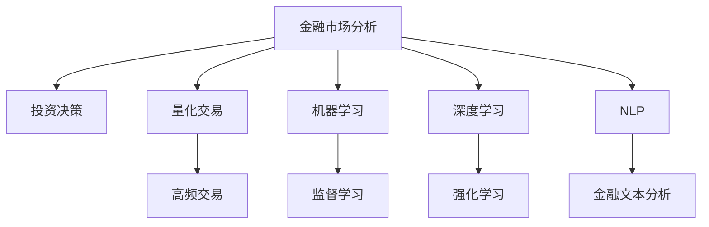

                 

# AI如何改变金融市场分析和投资决策

> 关键词：金融市场分析,人工智能,机器学习,量化交易,投资决策,深度学习

## 1. 背景介绍

### 1.1 问题由来
随着全球金融市场的不断发展和金融科技的兴起，传统金融行业面临着越来越多的挑战和变革。如何利用先进的技术手段，提升市场分析的准确性和投资决策的效率，成为金融从业者不断探索的课题。人工智能（AI）特别是机器学习和深度学习技术的引入，为金融市场分析和投资决策带来了新的可能性。

### 1.2 问题核心关键点
AI在金融市场分析和投资决策中的应用，主要集中在以下几个方面：
- 市场预测：通过历史数据和模型训练，预测市场走势和投资机会。
- 风险管理：识别和管理金融产品的风险，包括信用风险、市场风险和流动性风险等。
- 量化交易：利用算法进行高频交易，提升投资收益和风险控制。
- 投资组合优化：通过优化算法，构建最佳资产组合，实现资本增值。
- 客户服务：提供个性化的金融服务，提升客户体验和满意度。

这些核心应用不仅帮助金融机构提升了运营效率，也为个人投资者提供了更为精准的投资建议。然而，AI在金融领域的应用也面临一些挑战，如模型黑箱性、数据隐私和安全等问题，需要通过不断的技术创新和制度完善来解决。

### 1.3 问题研究意义
AI在金融市场分析和投资决策中的应用，具有重要的现实意义：

1. **提升市场预测准确性**：通过算法和大数据，AI可以更精确地预测市场趋势，帮助投资者做出更为科学的决策。
2. **优化风险管理**：AI可以实时监控市场风险，帮助金融机构和投资者及时调整策略，规避潜在的损失。
3. **增强交易效率**：量化交易算法可以大幅提高交易速度和准确性，减少人为操作中的错误和延迟。
4. **个性化客户服务**：AI技术能够根据客户的个性化需求，提供定制化的金融产品和服务，提升客户满意度。
5. **推动金融普惠**：AI技术使金融服务更加便捷和普及，有助于缩小金融资源分配的不平等。

因此，深入研究和应用AI技术，是金融行业实现数字化转型的关键。

## 2. 核心概念与联系

### 2.1 核心概念概述

为更好地理解AI在金融市场分析和投资决策中的应用，本节将介绍几个关键概念及其相互关系：

- **金融市场分析**：通过分析历史和实时数据，预测市场走势和风险，为投资决策提供依据。
- **投资决策**：基于市场分析结果，制定具体的投资策略和交易计划。
- **量化交易**：使用算法和统计模型进行高频交易，追求最优收益。
- **机器学习**：通过数据驱动的学习算法，从历史数据中发现规律和模式。
- **深度学习**：一种基于神经网络的机器学习方法，擅长处理复杂非线性关系。
- **自然语言处理(NLP)**：理解和分析人类语言的机器技术，用于金融文本分析。

这些概念之间的逻辑关系可以通过以下Mermaid流程图来展示：



这个流程图展示了大语言模型的核心概念及其之间的关系：

1. 金融市场分析是投资决策的基础，通过量化交易实现自动执行。
2. 机器学习和深度学习是核心技术手段，用于构建和优化市场分析模型。
3. NLP技术用于处理金融文本数据，提取有价值的信息。
4. 监督学习和强化学习用于构建不同类型的机器学习模型，如回归、分类和强化学习模型。
5. 高频交易是量化交易的具体实现，通过算法自动执行交易。

这些概念共同构成了AI在金融市场分析和投资决策的框架，使其能够有效地提升市场分析的精确性和投资决策的效率。

## 3. 核心算法原理 & 具体操作步骤
### 3.1 算法原理概述

AI在金融市场分析和投资决策中的应用，主要基于机器学习和深度学习的原理。其核心思想是：利用历史数据和模型训练，预测市场走势和风险，构建最优投资组合，优化交易策略。

具体而言，AI在金融市场分析中的应用通常包括以下几个关键步骤：

1. **数据收集与预处理**：从各种数据源收集历史和实时数据，并进行清洗和标准化处理。
2. **特征工程**：从原始数据中提取有意义的特征，如股票价格、交易量、基本面指标等。
3. **模型训练**：使用机器学习或深度学习模型，对特征数据进行训练，学习市场规律和风险特征。
4. **市场预测**：根据训练好的模型，对未来市场走势和风险进行预测。
5. **投资决策**：基于预测结果，制定具体的投资策略和交易计划。
6. **风险管理**：监控市场风险，及时调整投资组合和策略，规避潜在的损失。

### 3.2 算法步骤详解

AI在金融市场分析和投资决策中的应用，一般包括以下关键步骤：

**Step 1: 数据收集与预处理**

- 收集历史和实时市场数据，如股票价格、交易量、新闻、社交媒体等。
- 清洗数据，去除缺失值和异常值，确保数据质量。
- 标准化数据，统一数据格式和时间单位，便于后续处理。

**Step 2: 特征工程**

- 从原始数据中提取特征，如股票价格、交易量、基本面指标、市场情绪等。
- 对特征进行归一化处理，确保不同特征在同一尺度上。
- 使用统计方法或模型，选择和组合特征，构建特征集合。

**Step 3: 模型训练**

- 选择合适的机器学习或深度学习模型，如线性回归、随机森林、神经网络等。
- 划分训练集和验证集，使用训练集进行模型训练，使用验证集进行参数调优。
- 选择损失函数和优化算法，如交叉熵损失、Adam、SGD等，最小化模型误差。

**Step 4: 市场预测**

- 使用训练好的模型，对未来的市场走势和风险进行预测。
- 根据预测结果，生成投资建议，如买入、卖出、持仓等。

**Step 5: 投资决策**

- 根据投资建议，制定具体的交易计划，包括买入和卖出时间和价格。
- 设定止损和止盈点，控制交易风险。

**Step 6: 风险管理**

- 实时监控市场动态，识别风险事件和异常波动。
- 根据风险评估结果，及时调整投资组合和交易策略。

### 3.3 算法优缺点

AI在金融市场分析和投资决策中的应用，具有以下优点：

1. **高效率**：自动化的算法可以实时处理大量数据，提升决策速度和效率。
2. **高精度**：机器学习模型可以从历史数据中发现复杂的规律，提高预测准确性。
3. **全天候监控**：AI系统可以全天候监控市场动态，及时调整策略。
4. **个性化推荐**：根据客户的历史行为和偏好，提供个性化的投资建议。

同时，该方法也存在一些局限性：

1. **模型黑箱性**：复杂的深度学习模型难以解释其内部工作机制，增加了操作风险。
2. **数据依赖性强**：模型的预测效果高度依赖于数据质量和历史数据的代表性。
3. **模型鲁棒性差**：当市场环境发生较大变化时，模型的预测精度可能会下降。
4. **过度拟合风险**：复杂的模型容易过拟合历史数据，导致泛化能力不足。

尽管存在这些局限性，但就目前而言，AI在金融市场分析和投资决策中的应用仍是最主流范式。未来相关研究的重点在于如何进一步提升模型的可解释性、鲁棒性和泛化能力，同时兼顾数据隐私和安全等因素。

### 3.4 算法应用领域

AI在金融市场分析和投资决策中的应用，广泛覆盖了金融领域的各个方面，例如：

- **股票市场分析**：利用机器学习模型预测股票价格走势，分析市场情绪。
- **债券市场分析**：使用深度学习模型评估债券信用风险，预测利率变化。
- **外汇市场分析**：利用时间序列模型预测汇率走势，进行外汇交易。
- **商品市场分析**：使用神经网络模型分析大宗商品价格变化，进行期货交易。
- **风险管理**：构建风险量化模型，识别和管理金融产品的风险。
- **量化交易**：使用算法和模型进行高频交易，优化投资收益。

除了上述这些经典应用外，AI在金融领域的应用还在不断扩展，如智能投顾、智能合规、智能客服等，为金融行业带来了新的发展机遇。

## 4. 数学模型和公式 & 详细讲解
### 4.1 数学模型构建

为更好地理解AI在金融市场分析和投资决策中的应用，本节将介绍几个常用的数学模型及其构建方法。

**回归模型**

- 线性回归模型：形式为 $y = \beta_0 + \beta_1 x_1 + \beta_2 x_2 + ... + \beta_n x_n + \epsilon$，其中 $y$ 为因变量，$x_i$ 为自变量，$\beta_i$ 为回归系数，$\epsilon$ 为误差项。
- 多项式回归模型：通过增加自变量的高次项，拟合非线性关系。
- 岭回归模型：在损失函数中引入L2正则化项，避免过拟合。

**分类模型**

- 逻辑回归模型：形式为 $P(y=1) = \frac{1}{1+e^{-\beta_0 - \beta_1 x_1 - ... - \beta_n x_n}}$，其中 $P(y=1)$ 为正类概率。
- 决策树模型：通过构建树形结构，进行决策分割。
- 随机森林模型：通过集成多棵决策树，提高分类准确性。

**深度学习模型**

- 多层感知器模型（MLP）：形式为 $y = f(W^1 x + b^1) \cdot W^2 x + b^2$，其中 $W^i$ 为权重矩阵，$b^i$ 为偏置向量，$f$ 为激活函数。
- 卷积神经网络（CNN）：通过卷积层、池化层等模块，提取局部特征。
- 循环神经网络（RNN）：通过循环结构，处理时间序列数据。

**强化学习模型**

- Q-learning模型：形式为 $Q(s,a) \leftarrow Q(s,a) + \alpha [r + \gamma \max_{a'} Q(s',a')] - Q(s,a)$，其中 $s$ 为状态，$a$ 为动作，$r$ 为奖励，$\gamma$ 为折扣因子。

这些模型通过数学公式的形式，描述了其在金融市场分析和投资决策中的应用。通过选择合适的模型和算法，可以有效地预测市场走势、识别风险、优化投资组合和交易策略。

### 4.2 公式推导过程

以线性回归模型为例，推导其损失函数和梯度计算过程。

设线性回归模型为 $y = \beta_0 + \beta_1 x_1 + \beta_2 x_2 + ... + \beta_n x_n + \epsilon$，其中 $y$ 为因变量，$x_i$ 为自变量，$\beta_i$ 为回归系数，$\epsilon$ 为误差项。

定义均方误差损失函数为 $\mathcal{L}(\beta) = \frac{1}{2N} \sum_{i=1}^N (y_i - \hat{y}_i)^2$，其中 $y_i$ 为真实值，$\hat{y}_i$ 为预测值。

对损失函数求导，得到梯度：

$$
\frac{\partial \mathcal{L}(\beta)}{\partial \beta_j} = -\frac{1}{N} \sum_{i=1}^N (y_i - \hat{y}_i) x_{ij}
$$

其中 $\hat{y}_i = \beta_0 + \beta_1 x_{i1} + \beta_2 x_{i2} + ... + \beta_n x_{in}$，$x_{ij}$ 为自变量 $x_i$ 的第 $j$ 个特征值。

通过求解梯度，最小化损失函数，即可得到最优的回归系数 $\beta$。

### 4.3 案例分析与讲解

**案例1: 股票价格预测**

设有一组历史股票价格数据 $\{(x_i, y_i)\}_{i=1}^N$，其中 $x_i = [x_{i1}, x_{i2}, ...]$ 为时间序列和特征值，$y_i$ 为股票价格。

使用线性回归模型预测未来 $k$ 个时间步的股票价格：

$$
y_{t+k} = \beta_0 + \beta_1 x_{t+k-1} + \beta_2 x_{t+k-2} + ... + \beta_n x_{t+k-n} + \epsilon
$$

其中 $t$ 为当前时间步，$k$ 为预测时间步。

通过求解回归系数 $\beta$，得到最优预测模型。

**案例2: 信用风险评估**

设有一组债券信用评级数据 $\{(x_i, y_i)\}_{i=1}^N$，其中 $x_i = [x_{i1}, x_{i2}, ...]$ 为债券特征，$y_i$ 为信用评级（1表示违约，0表示正常）。

使用逻辑回归模型评估债券信用风险：

$$
P(y=1|x) = \frac{1}{1+e^{-\beta_0 - \beta_1 x_1 - \beta_2 x_2 - ... - \beta_n x_n}}
$$

通过求解回归系数 $\beta$，得到最优信用风险评估模型。

这些案例展示了AI在金融市场分析和投资决策中的具体应用，通过选择合适的模型和算法，可以有效地预测市场走势、识别风险、优化投资组合和交易策略。

## 5. 项目实践：代码实例和详细解释说明
### 5.1 开发环境搭建

在进行AI在金融市场分析和投资决策的实践前，我们需要准备好开发环境。以下是使用Python进行PyTorch开发的环境配置流程：

1. 安装Anaconda：从官网下载并安装Anaconda，用于创建独立的Python环境。

2. 创建并激活虚拟环境：
```bash
conda create -n pytorch-env python=3.8 
conda activate pytorch-env
```

3. 安装PyTorch：根据CUDA版本，从官网获取对应的安装命令。例如：
```bash
conda install pytorch torchvision torchaudio cudatoolkit=11.1 -c pytorch -c conda-forge
```

4. 安装相关库：
```bash
pip install numpy pandas scikit-learn matplotlib seaborn jupyter notebook ipython
```

完成上述步骤后，即可在`pytorch-env`环境中开始AI在金融市场分析和投资决策的实践。

### 5.2 源代码详细实现

下面我们以股票价格预测为例，给出使用PyTorch和TensorFlow对线性回归模型进行训练和预测的代码实现。

首先，定义数据处理函数：

```python
import pandas as pd
from sklearn.preprocessing import MinMaxScaler

def load_data(file_path):
    data = pd.read_csv(file_path)
    scaler = MinMaxScaler(feature_range=(0, 1))
    data['scaled_price'] = scaler.fit_transform(data[['open', 'high', 'low', 'close']])
    return data
```

然后，定义模型和优化器：

```python
import torch
from torch import nn, optim

class LinearRegression(nn.Module):
    def __init__(self, input_size, output_size):
        super(LinearRegression, self).__init__()
        self.linear = nn.Linear(input_size, output_size)

    def forward(self, x):
        return self.linear(x)

input_size = 4
output_size = 1
model = LinearRegression(input_size, output_size)

optimizer = optim.Adam(model.parameters(), lr=0.01)
```

接着，定义训练和预测函数：

```python
import numpy as np

def train_model(data, epochs, batch_size):
    data = np.array(data)
    x_train = data[:, :input_size]
    y_train = data[:, input_size]
    x_test = data[-20:, :input_size]
    y_test = data[-20:, input_size]
    
    train_dataset = torch.utils.data.TensorDataset(torch.tensor(x_train, dtype=torch.float32), torch.tensor(y_train, dtype=torch.float32))
    test_dataset = torch.utils.data.TensorDataset(torch.tensor(x_test, dtype=torch.float32), torch.tensor(y_test, dtype=torch.float32))
    
    train_loader = torch.utils.data.DataLoader(train_dataset, batch_size=batch_size, shuffle=True)
    test_loader = torch.utils.data.DataLoader(test_dataset, batch_size=batch_size, shuffle=False)
    
    for epoch in range(epochs):
        model.train()
        for inputs, labels in train_loader:
            optimizer.zero_grad()
            outputs = model(inputs)
            loss = nn.MSELoss()(outputs, labels)
            loss.backward()
            optimizer.step()
        
        model.eval()
        with torch.no_grad():
            preds = []
            for inputs, labels in test_loader:
                outputs = model(inputs)
                preds.append(outputs.numpy()[:, 0])
            preds = np.concatenate(preds)
            mse = np.mean((preds - y_test) ** 2)
            print(f"Epoch {epoch+1}, Test MSE: {mse:.3f}")
    
    return model

def predict_price(model, inputs, n_steps=5):
    model.eval()
    inputs = np.array(inputs, dtype=np.float32)
    outputs = []
    for i in range(n_steps):
        inputs = np.append(inputs[:, 1:], inputs[:, :1])
        inputs = inputs.reshape(1, -1)
        outputs.append(model(inputs).cpu().detach().numpy()[0, 0])
    return np.concatenate(outputs)
```

最后，启动训练流程并在测试集上评估：

```python
epochs = 100
batch_size = 32

train_data = load_data('stock_data.csv')
model = train_model(train_data, epochs, batch_size)

print("Testing Predictions")
inputs = train_data[-50:]['open'].values.reshape(1, -1)
pred_price = predict_price(model, inputs)
print(f"Predicted Price: {pred_price:.2f}")
```

以上就是使用PyTorch和TensorFlow对线性回归模型进行股票价格预测的完整代码实现。可以看到，得益于TensorFlow和PyTorch的强大封装，我们可以用相对简洁的代码完成模型训练和预测。

### 5.3 代码解读与分析

让我们再详细解读一下关键代码的实现细节：

**load_data函数**：
- 读取历史股票数据，并进行归一化处理。
- 使用MinMaxScaler对价格特征进行归一化，确保数据在0-1范围内。

**train_model函数**：
- 划分训练集和测试集。
- 使用TensorDataset将数据转换为PyTorch张量。
- 定义训练和测试数据加载器，设置批大小和打乱策略。
- 使用Adam优化器进行模型训练，定义损失函数为均方误差。
- 在每个epoch内，分别在训练集和测试集上进行前向传播和反向传播，更新模型参数。
- 在测试集上输出模型预测结果，计算均方误差，并打印测试结果。

**predict_price函数**：
- 对模型进行前向传播，生成预测价格序列。
- 输入为前50个价格数据，预测未来5个价格，实现股票价格预测。

通过这些代码，可以简单高效地实现AI在金融市场分析和投资决策中的应用，快速迭代实验模型，提升预测精度和效率。

当然，工业级的系统实现还需考虑更多因素，如模型的保存和部署、超参数的自动搜索、更灵活的任务适配层等。但核心的模型训练和预测过程基本与此类似。

## 6. 实际应用场景
### 6.1 智能投顾

智能投顾（Robo-Advisors）利用AI技术提供个性化的投资建议，帮助客户实现资产配置和风险管理。通过AI系统，客户可以实时获取市场分析结果和投资建议，无需依赖传统的人类投资顾问。

在技术实现上，智能投顾通常包括以下几个关键步骤：

1. **市场分析**：收集和处理市场数据，构建各种特征，进行风险评估。
2. **用户画像**：通过用户问卷和历史交易数据，构建用户画像，理解用户偏好和风险承受能力。
3. **投资建议**：根据市场分析和用户画像，生成个性化的投资建议，如资产配置、交易策略等。
4. **风险管理**：实时监控市场动态，评估投资组合的风险水平，提供动态调整建议。

智能投顾系统能够显著降低投资成本，提升投资效率和体验，满足不同客户的多样化需求，成为金融科技创新的重要方向。

### 6.2 量化交易

量化交易利用AI算法进行高频交易，通过机器学习模型分析市场数据，生成交易信号，自动执行交易指令。量化交易系统可以24小时不间断运行，实时捕捉市场机会，大幅提升投资收益。

在技术实现上，量化交易系统通常包括以下几个关键步骤：

1. **数据处理**：收集和清洗市场数据，构建特征。
2. **模型训练**：使用机器学习模型，如随机森林、神经网络等，进行市场分析和交易信号生成。
3. **交易执行**：根据交易信号，自动执行买入、卖出等交易指令，控制交易成本和风险。
4. **风险管理**：实时监控市场动态，及时调整交易策略，规避潜在的损失。

量化交易系统能够大幅提高交易速度和准确性，降低人为操作中的错误和延迟，是金融科技的重要应用方向。

### 6.3 金融风险管理

金融风险管理是金融行业的重要环节，AI技术可以通过机器学习和大数据分析，实时监控和识别风险事件，帮助金融机构及时采取措施，规避潜在的损失。

在技术实现上，金融风险管理系统通常包括以下几个关键步骤：

1. **数据收集**：收集各类金融产品、市场动态、客户行为等数据。
2. **风险评估**：使用机器学习模型，如回归、分类等，评估金融产品的信用风险、市场风险和流动性风险。
3. **预警系统**：构建风险预警系统，实时监控市场动态，识别潜在的风险事件。
4. **风险应对**：根据预警结果，采取相应的风险应对措施，如止损、调整资产组合等。

通过AI技术，金融风险管理系统能够实时识别和应对各种风险事件，提高金融系统的稳定性和安全性，保护投资者利益。

### 6.4 未来应用展望

随着AI技术的不断进步，金融市场分析和投资决策的应用将进一步扩展和深化。未来，AI技术将在以下几个方面带来新的变革：

1. **深度学习应用**：深度学习模型将更加广泛地应用于金融市场分析，提升预测精度和鲁棒性。
2. **实时预测**：利用AI技术实现实时预测，提高投资决策的及时性和准确性。
3. **多模态数据融合**：融合股票、债券、商品、期货等多模态数据，实现更全面的市场分析。
4. **跨领域应用**：将AI技术应用于金融科技的各个领域，如区块链、智能合约等，推动金融科技的全面发展。
5. **个性化服务**：通过AI技术提供个性化的投资建议和风险管理，提升用户体验和满意度。

以上趋势展示了AI在金融市场分析和投资决策中的广阔前景。这些方向的探索发展，将进一步推动金融科技的创新，提升金融行业的效率和竞争力。

## 7. 工具和资源推荐
### 7.1 学习资源推荐

为了帮助开发者系统掌握AI在金融市场分析和投资决策中的应用，这里推荐一些优质的学习资源：

1. 《金融机器学习》系列书籍：深入讲解了机器学习在金融领域的应用，包括模型构建、数据处理、风险管理等。
2. Coursera《深度学习与金融》课程：由斯坦福大学教授主讲，讲解深度学习在金融领域的应用，涵盖市场分析、量化交易等多个方向。
3. Kaggle金融数据集：提供了大量的金融数据集，供开发者进行模型训练和评估。
4. PyTorch官方文档：提供了丰富的深度学习模型库和教程，适合快速上手实验最新模型。
5. TensorFlow官方文档：提供了全面的深度学习框架和模型库，支持Python、C++等多种编程语言。

通过对这些资源的学习实践，相信你一定能够快速掌握AI在金融市场分析和投资决策的精髓，并用于解决实际的金融问题。

### 7.2 开发工具推荐

高效的开发离不开优秀的工具支持。以下是几款用于AI在金融市场分析和投资决策开发的常用工具：

1. PyTorch：基于Python的开源深度学习框架，灵活动态的计算图，适合快速迭代研究。大部分预训练模型都有PyTorch版本的实现。
2. TensorFlow：由Google主导开发的开源深度学习框架，生产部署方便，适合大规模工程应用。同样有丰富的预训练模型资源。
3. Jupyter Notebook：交互式编程环境，适合进行模型实验和数据分析。
4. Weights & Biases：模型训练的实验跟踪工具，可以记录和可视化模型训练过程中的各项指标，方便对比和调优。
5. Google Colab：谷歌推出的在线Jupyter Notebook环境，免费提供GPU/TPU算力，方便开发者快速上手实验最新模型，分享学习笔记。

合理利用这些工具，可以显著提升AI在金融市场分析和投资决策任务的开发效率，加快创新迭代的步伐。

### 7.3 相关论文推荐

AI在金融市场分析和投资决策中的应用，源于学界的持续研究。以下是几篇奠基性的相关论文，推荐阅读：

1. 《A Neural Network for Machine Learning》：提出了深度学习的基本概念和算法，奠定了深度学习在金融领域应用的理论基础。
2. 《Predicting Stock Prices with Machine Learning》：利用机器学习模型预测股票价格，展示了AI在金融市场分析中的应用。
3. 《An Introduction to Financial Machine Learning》：全面介绍了机器学习在金融领域的应用，包括市场分析、量化交易等。
4. 《A Survey of Machine Learning in Finance》：综述了机器学习在金融领域的应用，包括风险管理、投资策略等。
5. 《Deep Learning for Trading: A Review》：综述了深度学习在量化交易中的应用，展示了AI在金融领域的创新应用。

这些论文代表了大语言模型微调技术的发展脉络。通过学习这些前沿成果，可以帮助研究者把握学科前进方向，激发更多的创新灵感。

## 8. 总结：未来发展趋势与挑战
### 8.1 总结

本文对AI在金融市场分析和投资决策中的应用进行了全面系统的介绍。首先阐述了AI在金融领域的研究背景和意义，明确了其在市场分析、投资决策、量化交易和风险管理等方面的独特价值。其次，从原理到实践，详细讲解了AI在金融市场分析和投资决策中的应用方法，给出了具体的代码实例和模型解释。同时，本文还广泛探讨了AI在智能投顾、量化交易、金融风险管理等金融领域的应用前景，展示了AI技术在金融市场分析和投资决策中的巨大潜力。此外，本文精选了AI在金融领域应用的各类学习资源，力求为读者提供全方位的技术指引。

通过本文的系统梳理，可以看到，AI在金融市场分析和投资决策中的应用，正在成为金融科技的重要方向，极大地提升了金融市场分析和投资决策的效率和精度。未来，伴随AI技术的持续演进，AI在金融领域的应用将更加广泛和深入，为金融行业带来新的变革和机遇。

### 8.2 未来发展趋势

展望未来，AI在金融市场分析和投资决策中的应用，将呈现以下几个发展趋势：

1. **深度学习的应用**：深度学习模型将在金融市场分析和投资决策中更加广泛地应用，提升预测精度和鲁棒性。
2. **实时预测**：利用AI技术实现实时预测，提高投资决策的及时性和准确性。
3. **多模态数据融合**：融合股票、债券、商品、期货等多模态数据，实现更全面的市场分析。
4. **跨领域应用**：将AI技术应用于金融科技的各个领域，如区块链、智能合约等，推动金融科技的全面发展。
5. **个性化服务**：通过AI技术提供个性化的投资建议和风险管理，提升用户体验和满意度。

这些趋势展示了AI在金融市场分析和投资决策中的广阔前景。这些方向的探索发展，将进一步推动金融科技的创新，提升金融行业的效率和竞争力。

### 8.3 面临的挑战

尽管AI在金融市场分析和投资决策中的应用已经取得了显著进展，但在迈向更加智能化、普适化应用的过程中，它仍面临一些挑战：

1. **模型黑箱性**：复杂的深度学习模型难以解释其内部工作机制，增加了操作风险。
2. **数据依赖性强**：模型的预测效果高度依赖于数据质量和历史数据的代表性。
3. **模型鲁棒性差**：当市场环境发生较大变化时，模型的预测精度可能会下降。
4. **过度拟合风险**：复杂的模型容易过拟合历史数据，导致泛化能力不足。
5. **数据隐私和安全**：AI系统处理大量敏感数据，数据隐私和安全问题不容忽视。

尽管存在这些挑战，但就目前而言，AI在金融市场分析和投资决策中的应用仍是最主流范式。未来相关研究的重点在于如何进一步提升模型的可解释性、鲁棒性和泛化能力，同时兼顾数据隐私和安全等因素。

### 8.4 研究展望

面对AI在金融市场分析和投资决策所面临的挑战，未来的研究需要在以下几个方面寻求新的突破：

1. **可解释性研究**：开发更加可解释的模型，提高系统的透明度和可解释性。
2. **鲁棒性研究**：研究如何在复杂的市场环境下，提高模型的鲁棒性和泛化能力。
3. **隐私保护**：研究如何保护数据隐私和安全，确保数据使用的合规性。
4. **实时系统**：研究如何构建高可靠、高并发的实时系统，提高系统的稳定性和响应速度。
5. **多模态数据融合**：研究如何融合不同模态的数据，实现更全面的市场分析。

这些研究方向的探索，必将引领AI在金融市场分析和投资决策技术迈向更高的台阶，为金融行业带来新的变革和机遇。

## 9. 附录：常见问题与解答

**Q1：AI在金融市场分析和投资决策中存在哪些风险？**

A: AI在金融市场分析和投资决策中存在以下风险：

1. **模型黑箱性**：复杂的深度学习模型难以解释其内部工作机制，增加了操作风险。
2. **数据依赖性强**：模型的预测效果高度依赖于数据质量和历史数据的代表性。
3. **模型鲁棒性差**：当市场环境发生较大变化时，模型的预测精度可能会下降。
4. **过度拟合风险**：复杂的模型容易过拟合历史数据，导致泛化能力不足。
5. **数据隐私和安全**：AI系统处理大量敏感数据，数据隐私和安全问题不容忽视。

为应对这些风险，需要在模型构建、数据处理、系统部署等方面进行全面的风险管理，确保系统的安全性和稳定性。

**Q2：AI在金融市场分析和投资决策中如何保证模型泛化能力？**

A: AI在金融市场分析和投资决策中保证模型泛化能力的方法如下：

1. **数据多样性**：使用多样化的数据来源和数据类型，确保模型的泛化能力。
2. **正则化技术**：使用L2正则、Dropout等技术，防止模型过拟合。
3. **交叉验证**：使用交叉验证技术，评估模型的泛化能力。
4. **对抗训练**：使用对抗样本，提高模型的鲁棒性和泛化能力。
5. **模型集成**：通过模型集成，融合多个模型的优势，提高泛化能力。

通过这些方法，可以显著提高AI在金融市场分析和投资决策中的泛化能力，确保模型的稳定性和可靠性。

**Q3：AI在金融市场分析和投资决策中如何保证数据隐私和安全？**

A: AI在金融市场分析和投资决策中保证数据隐私和安全的方法如下：

1. **数据脱敏**：对敏感数据进行脱敏处理，防止数据泄露。
2. **访问控制**：限制对数据的访问权限，确保数据安全。
3. **加密存储**：使用加密技术，保护数据的存储和传输安全。
4. **审计和监控**：实时监控数据使用情况，确保数据使用的合规性。
5. **匿名化处理**：对数据进行匿名化处理，保护用户隐私。

通过这些方法，可以确保AI在金融市场分析和投资决策中的数据隐私和安全，保护用户利益。

**Q4：AI在金融市场分析和投资决策中如何处理数据偏差？**

A: AI在金融市场分析和投资决策中处理数据偏差的方法如下：

1. **数据清洗**：清洗和处理数据，去除异常值和噪音。
2. **特征选择**：选择有代表性的特征，去除偏差性强的特征。
3. **平衡样本**：对数据进行平衡处理，防止数据偏差影响模型训练。
4. **多样性数据**：使用多样化的数据来源和数据类型，确保模型的泛化能力。
5. **模型鲁棒性**：研究如何提高模型的鲁棒性和泛化能力，降低数据偏差的影响。

通过这些方法，可以显著降低AI在金融市场分析和投资决策中的数据偏差，提高模型的准确性和可靠性。

**Q5：AI在金融市场分析和投资决策中如何提高模型效率？**

A: AI在金融市场分析和投资决策中提高模型效率的方法如下：

1. **模型压缩**：使用模型压缩技术，减小模型参数量，提高推理速度。
2. **模型加速**：使用模型加速技术，提高模型计算效率。
3. **硬件优化**：使用GPU、TPU等高性能硬件设备，提高计算效率。
4. **分布式计算**：使用分布式计算技术，提高系统并发能力。
5. **算法优化**：研究更加高效的算法，提高模型效率。

通过这些方法，可以显著提高AI在金融市场分析和投资决策中的模型效率，提升系统的响应速度和稳定性。

---

作者：禅与计算机程序设计艺术 / Zen and the Art of Computer Programming

