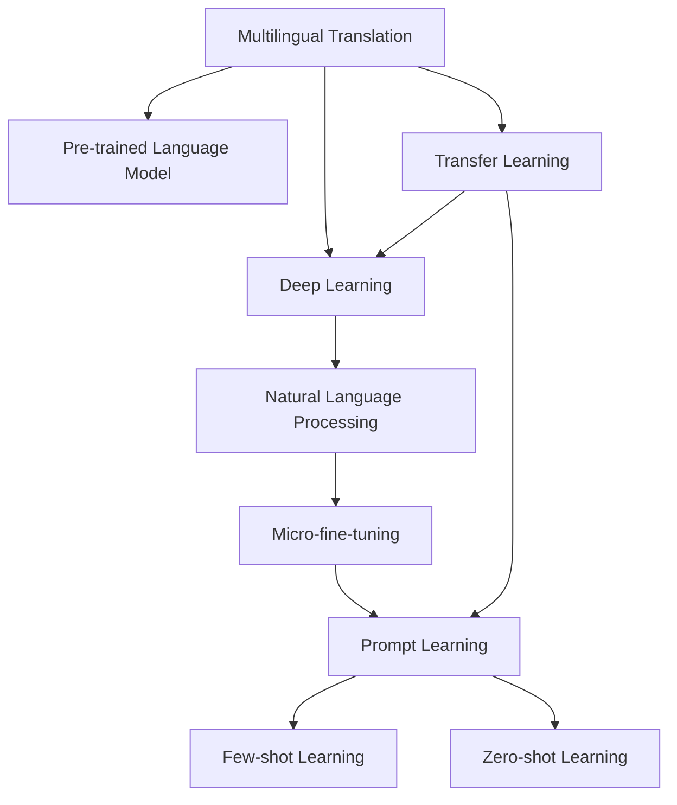

                 

# AI如何改善搜索引擎的多语言翻译

> 关键词：多语言翻译,搜索引擎,人工智能,机器学习,深度学习,自然语言处理(NLP)

## 1. 背景介绍

### 1.1 问题由来

随着全球化的深入和互联网的普及，搜索引擎日益成为连接不同语言和文化的重要桥梁。但传统的多语言翻译方式存在效率低下、翻译质量不均等问题，难以满足用户需求。人工智能技术的进步，特别是深度学习和大规模预训练语言模型的兴起，为改善搜索引擎的多语言翻译提供了新的可能性。

### 1.2 问题核心关键点

多语言翻译的核心在于如何通过机器学习技术，将一种语言的文本准确无误地转换为另一种语言的文本。搜索引擎的多语言翻译不仅要保证翻译的准确性，还要考虑到处理速度和用户交互体验。

当前，基于深度学习和预训练语言模型的多语言翻译方法，已经在谷歌、百度等主流搜索引擎中得到了广泛应用。这些方法通过使用大规模双语或多语言语料进行预训练，使模型能够学习到语言间的复杂映射关系，并通过微调或提示学习等技术，进一步提升翻译效果。

### 1.3 问题研究意义

改善搜索引擎的多语言翻译，对提升全球互联网用户的搜索体验、促进文化交流、推动经济全球化等方面具有重要意义。同时，多语言翻译也是NLP领域的重要研究方向之一，能够推动人工智能技术在更多场景中的应用，加速AI技术的产业化进程。

## 2. 核心概念与联系

### 2.1 核心概念概述

为更好地理解AI如何改善搜索引擎的多语言翻译，本节将介绍几个密切相关的核心概念：

- 多语言翻译(Machine Translation, MT)：将一种语言的文本转换为另一种语言的文本的过程。搜索引擎中的多语言翻译通常需要处理大量异构数据，对翻译模型的实时性和精度都有较高要求。
- 预训练语言模型(Pre-trained Language Model, PLM)：通过大规模无标签语料进行自监督学习，学习通用的语言表示，具备强大的语言理解和生成能力。常用的预训练模型包括BERT、GPT等。
- 深度学习(Deep Learning)：通过多层神经网络进行复杂映射和模式识别，广泛应用于图像、语音、自然语言处理等领域。
- 自然语言处理(Natural Language Processing, NLP)：涉及计算机处理和理解自然语言的技术，包括文本预处理、语言模型、机器翻译、情感分析等任务。
- 微调(Fine-tuning)：通过有监督学习，将预训练模型进行下游任务适配，提升模型在该任务上的性能。
- 提示学习(Prompt Learning)：通过在输入文本中添加提示模板，引导模型按期望方式输出，减少微调参数。
- 少样本学习(Few-shot Learning)：在只有少量标注样本的情况下，模型能够快速适应新任务的学习方法。
- 零样本学习(Zero-shot Learning)：在模型没有见过任何特定任务的训练样本的情况下，仅凭任务描述就能够执行新任务的能力。
- 迁移学习(Transfer Learning)：将一个领域学习到的知识，迁移应用到另一个不同但相关的领域的学习范式。

这些核心概念之间的逻辑关系可以通过以下Mermaid流程图来展示：



这个流程图展示了大语言模型的核心概念及其之间的关系：

1. 多语言翻译通过预训练语言模型和深度学习技术，实现不同语言之间的文本转换。
2. 预训练语言模型通过大规模语料学习通用语言表示。
3. 深度学习作为核心算法，提取语言特征和规律。
4. 自然语言处理是具体的应用方向，包括文本预处理、语言模型、机器翻译、情感分析等。
5. 微调方法通过有监督学习，提升模型在特定任务上的表现。
6. 提示学习、少样本学习、零样本学习等技术，进一步提高模型的泛化能力和鲁棒性。
7. 迁移学习将通用知识应用到特定领域，提升模型对新任务的学习能力。

这些概念共同构成了多语言翻译的AI技术框架，使得搜索引擎能够提供高质量、实时响应的多语言翻译服务。

## 3. 核心算法原理 & 具体操作步骤
### 3.1 算法原理概述

搜索引擎的多语言翻译通常采用基于预训练语言模型的微调方法。其核心思想是：将预训练的多语言模型视作一个强大的"特征提取器"，通过有监督地训练来优化模型在特定翻译任务上的性能。

形式化地，假设预训练的多语言模型为 $M_{\theta}$，其中 $\theta$ 为预训练得到的模型参数。给定一个双向或多语言的翻译数据集 $D=\{(x_i, y_i)\}_{i=1}^N$，其中 $x_i$ 为源语言文本，$y_i$ 为目标语言文本，微调的目标是找到新的模型参数 $\hat{\theta}$，使得：

$$
\hat{\theta}=\mathop{\arg\min}_{\theta} \mathcal{L}(M_{\theta},D)
$$

其中 $\mathcal{L}$ 为针对翻译任务设计的损失函数，用于衡量模型预测输出与真实标签之间的差异。常见的损失函数包括交叉熵损失、BLEU等。

通过梯度下降等优化算法，微调过程不断更新模型参数 $\theta$，最小化损失函数 $\mathcal{L}$，使得模型输出逼近真实标签。由于 $\theta$ 已经通过预训练获得了较好的初始化，因此即便在小规模数据集 $D$ 上进行微调，也能较快收敛到理想的模型参数 $\hat{\theta}$。

### 3.2 算法步骤详解

基于深度学习的搜索引擎多语言翻译一般包括以下几个关键步骤：

**Step 1: 准备预训练模型和数据集**
- 选择合适的预训练语言模型 $M_{\theta}$ 作为初始化参数，如 BERT、GPT等。
- 准备双向或多语言的翻译数据集 $D$，划分为训练集、验证集和测试集。一般要求标注数据与预训练数据的分布不要差异过大。

**Step 2: 添加任务适配层**
- 根据任务类型，在预训练模型顶层设计合适的输出层和损失函数。
- 对于机器翻译，通常在顶层添加线性分类器或注意力机制，使用BLEU等损失函数。

**Step 3: 设置微调超参数**
- 选择合适的优化算法及其参数，如 AdamW、SGD 等，设置学习率、批大小、迭代轮数等。
- 设置正则化技术及强度，包括权重衰减、Dropout、Early Stopping等。
- 确定冻结预训练参数的策略，如仅微调顶层，或全部参数都参与微调。

**Step 4: 执行梯度训练**
- 将训练集数据分批次输入模型，前向传播计算损失函数。
- 反向传播计算参数梯度，根据设定的优化算法和学习率更新模型参数。
- 周期性在验证集上评估模型性能，根据性能指标决定是否触发 Early Stopping。
- 重复上述步骤直到满足预设的迭代轮数或 Early Stopping 条件。

**Step 5: 测试和部署**
- 在测试集上评估微调后模型 $M_{\hat{\theta}}$ 的性能，对比微调前后的BLEU得分提升。
- 使用微调后的模型对新样本进行推理预测，集成到实际的应用系统中。
- 持续收集新的数据，定期重新微调模型，以适应数据分布的变化。

以上是基于深度学习的搜索引擎多语言翻译的一般流程。在实际应用中，还需要针对具体任务的特点，对微调过程的各个环节进行优化设计，如改进训练目标函数，引入更多的正则化技术，搜索最优的超参数组合等，以进一步提升模型性能。

### 3.3 算法优缺点

基于深度学习的搜索引擎多语言翻译方法具有以下优点：
1. 简单高效。只需准备少量标注数据，即可对预训练模型进行快速适配，获得较大的性能提升。
2. 通用适用。适用于各种机器翻译任务，包括字对翻译、句子对翻译等，设计简单的任务适配层即可实现微调。
3. 参数高效。利用参数高效微调技术，在固定大部分预训练参数的情况下，仍可取得不错的提升。
4. 效果显著。在学术界和工业界的诸多任务上，基于微调的方法已经刷新了最先进的性能指标。

同时，该方法也存在一定的局限性：
1. 依赖标注数据。微调的效果很大程度上取决于标注数据的质量和数量，获取高质量标注数据的成本较高。
2. 迁移能力有限。当目标任务与预训练数据的分布差异较大时，微调的性能提升有限。
3. 负面效果传递。预训练模型的固有偏见、有害信息等，可能通过微调传递到下游任务，造成负面影响。
4. 可解释性不足。微调模型的决策过程通常缺乏可解释性，难以对其推理逻辑进行分析和调试。

尽管存在这些局限性，但就目前而言，基于深度学习的微调方法仍是多语言翻译的主流范式。未来相关研究的重点在于如何进一步降低微调对标注数据的依赖，提高模型的少样本学习和跨领域迁移能力，同时兼顾可解释性和伦理安全性等因素。

### 3.4 算法应用领域

基于深度学习的多语言翻译方法，在搜索引擎中的应用已经得到了广泛的应用，覆盖了几乎所有常见的机器翻译任务，例如：

- 字对翻译：如英文到中文、中文到英文等。通过微调使模型学习字符级到字符级的映射。
- 句子对翻译：如英文到德文、中文到日文等。通过微调使模型学习句子级到句子级的映射。
- 问答系统：对自然语言问题给出答案。将问题-答案对作为微调数据，训练模型学习匹配答案。
- 机器翻译：将源语言文本翻译成目标语言。通过微调使模型学习语言-语言映射。
- 文本摘要：将长文本压缩成简短摘要。将文章-摘要对作为微调数据，使模型学习抓取要点。
- 对话系统：使机器能够与人自然对话。将多轮对话历史作为上下文，微调模型进行回复生成。

除了上述这些经典任务外，多语言翻译技术还被创新性地应用到更多场景中，如可控文本生成、常识推理、代码生成、数据增强等，为搜索引擎提供了新的技术路径。随着预训练模型和微调方法的不断进步，相信多语言翻译技术将在更广阔的应用领域大放异彩。

## 4. 数学模型和公式 & 详细讲解
### 4.1 数学模型构建

本节将使用数学语言对基于深度学习的搜索引擎多语言翻译过程进行更加严格的刻画。

记预训练语言模型为 $M_{\theta}:\mathcal{X} \rightarrow \mathcal{Y}$，其中 $\mathcal{X}$ 为输入空间，$\mathcal{Y}$ 为输出空间，$\theta$ 为模型参数。假设多语言翻译任务的数据集为 $D=\{(x_i, y_i)\}_{i=1}^N$，其中 $x_i$ 为源语言文本，$y_i$ 为目标语言文本。

定义模型 $M_{\theta}$ 在数据样本 $(x,y)$ 上的损失函数为 $\ell(M_{\theta}(x),y)$，则在数据集 $D$ 上的经验风险为：

$$
\mathcal{L}(\theta) = \frac{1}{N} \sum_{i=1}^N \ell(M_{\theta}(x_i),y_i)
$$

其中 $\ell$ 为翻译任务的损失函数，用于衡量模型预测输出与真实标签之间的差异。常见的损失函数包括BLEU、NIST等。

微调的优化目标是最小化经验风险，即找到最优参数：

$$
\theta^* = \mathop{\arg\min}_{\theta} \mathcal{L}(\theta)
$$

在实践中，我们通常使用基于梯度的优化算法（如AdamW、SGD等）来近似求解上述最优化问题。设 $\eta$ 为学习率，$\lambda$ 为正则化系数，则参数的更新公式为：

$$
\theta \leftarrow \theta - \eta \nabla_{\theta}\mathcal{L}(\theta) - \eta\lambda\theta
$$

其中 $\nabla_{\theta}\mathcal{L}(\theta)$ 为损失函数对参数 $\theta$ 的梯度，可通过反向传播算法高效计算。

### 4.2 公式推导过程

以下我们以字对翻译任务为例，推导BLEU损失函数及其梯度的计算公式。

假设模型 $M_{\theta}$ 在输入 $x$ 上的输出为 $\hat{y}=M_{\theta}(x)$，其中 $\hat{y}$ 为目标语言文本中每个字符的预测概率。真实标签 $y$ 为源语言文本中每个字符的目标概率。则BLEU损失函数定义为：

$$
\ell(M_{\theta}(x),y) = -\sum_{i=1}^n \max(0, 1 - \mathrm{BLEU}(x,y))
$$

其中 $n$ 为文本长度，$\mathrm{BLEU}(x,y)$ 为BLEU得分，用于衡量翻译质量。

将其代入经验风险公式，得：

$$
\mathcal{L}(\theta) = -\frac{1}{N}\sum_{i=1}^N \sum_{j=1}^n \max(0, 1 - \mathrm{BLEU}(x_i,y_i))
$$

根据链式法则，损失函数对参数 $\theta_k$ 的梯度为：

$$
\frac{\partial \mathcal{L}(\theta)}{\partial \theta_k} = -\frac{1}{N}\sum_{i=1}^N \sum_{j=1}^n \frac{\partial \mathrm{BLEU}(x_i,y_i)}{\partial \hat{y}_j} \frac{\partial \hat{y}_j}{\partial \theta_k}
$$

其中 $\frac{\partial \hat{y}_j}{\partial \theta_k}$ 可进一步递归展开，利用自动微分技术完成计算。

在得到损失函数的梯度后，即可带入参数更新公式，完成模型的迭代优化。重复上述过程直至收敛，最终得到适应双向或多语言翻译任务的最优模型参数 $\theta^*$。

## 5. 项目实践：代码实例和详细解释说明
### 5.1 开发环境搭建

在进行多语言翻译实践前，我们需要准备好开发环境。以下是使用Python进行PyTorch开发的环境配置流程：

1. 安装Anaconda：从官网下载并安装Anaconda，用于创建独立的Python环境。

2. 创建并激活虚拟环境：
```bash
conda create -n pytorch-env python=3.8 
conda activate pytorch-env
```

3. 安装PyTorch：根据CUDA版本，从官网获取对应的安装命令。例如：
```bash
conda install pytorch torchvision torchaudio cudatoolkit=11.1 -c pytorch -c conda-forge
```

4. 安装Transformers库：
```bash
pip install transformers
```

5. 安装各类工具包：
```bash
pip install numpy pandas scikit-learn matplotlib tqdm jupyter notebook ipython
```

完成上述步骤后，即可在`pytorch-env`环境中开始多语言翻译实践。

### 5.2 源代码详细实现

这里我们以谷歌的Seq2Seq模型为例，给出使用PyTorch进行字对翻译的完整代码实现。

首先，定义训练集和测试集：

```python
from transformers import BertTokenizer
from torch.utils.data import Dataset
import torch

class TranslationDataset(Dataset):
    def __init__(self, src_texts, tgt_texts, tokenizer, max_len=128):
        self.src_texts = src_texts
        self.tgt_texts = tgt_texts
        self.tokenizer = tokenizer
        self.max_len = max_len
        
    def __len__(self):
        return len(self.src_texts)
    
    def __getitem__(self, item):
        src_text = self.src_texts[item]
        tgt_text = self.tgt_texts[item]
        
        encoding = self.tokenizer(src_text, return_tensors='pt', max_length=self.max_len, padding='max_length', truncation=True)
        input_ids = encoding['input_ids'][0]
        attention_mask = encoding['attention_mask'][0]
        target_ids = torch.tensor(self.tgt_texts[item], dtype=torch.long)
        
        return {'input_ids': input_ids, 
                'attention_mask': attention_mask,
                'target_ids': target_ids}

# 加载训练集和测试集
tokenizer = BertTokenizer.from_pretrained('bert-base-cased')

train_dataset = TranslationDataset(train_src_texts, train_tgt_texts, tokenizer)
dev_dataset = TranslationDataset(dev_src_texts, dev_tgt_texts, tokenizer)
test_dataset = TranslationDataset(test_src_texts, test_tgt_texts, tokenizer)
```

然后，定义模型和优化器：

```python
from transformers import Seq2SeqLMHeadModel
from transformers import AdamW

model = Seq2SeqLMHeadModel.from_pretrained('bert-base-cased', num_labels=10)

optimizer = AdamW(model.parameters(), lr=2e-5)
```

接着，定义训练和评估函数：

```python
from torch.utils.data import DataLoader
from tqdm import tqdm
from sklearn.metrics import bleu_score

device = torch.device('cuda') if torch.cuda.is_available() else torch.device('cpu')
model.to(device)

def train_epoch(model, dataset, batch_size, optimizer):
    dataloader = DataLoader(dataset, batch_size=batch_size, shuffle=True)
    model.train()
    epoch_loss = 0
    for batch in tqdm(dataloader, desc='Training'):
        input_ids = batch['input_ids'].to(device)
        attention_mask = batch['attention_mask'].to(device)
        target_ids = batch['target_ids'].to(device)
        model.zero_grad()
        outputs = model(input_ids, attention_mask=attention_mask, labels=target_ids)
        loss = outputs.loss
        epoch_loss += loss.item()
        loss.backward()
        optimizer.step()
    return epoch_loss / len(dataloader)

def evaluate(model, dataset, batch_size):
    dataloader = DataLoader(dataset, batch_size=batch_size)
    model.eval()
    preds, labels = [], []
    with torch.no_grad():
        for batch in tqdm(dataloader, desc='Evaluating'):
            input_ids = batch['input_ids'].to(device)
            attention_mask = batch['attention_mask'].to(device)
            batch_labels = batch['target_ids'].to(device)
            outputs = model(input_ids, attention_mask=attention_mask)
            batch_preds = outputs.logits.argmax(dim=2).to('cpu').tolist()
            batch_labels = batch_labels.to('cpu').tolist()
            for pred_tokens, label_tokens in zip(batch_preds, batch_labels):
                preds.append(pred_tokens[:len(label_tokens)])
                labels.append(label_tokens)
                
    print(bleu_score(labels, preds))
```

最后，启动训练流程并在测试集上评估：

```python
epochs = 5
batch_size = 16

for epoch in range(epochs):
    loss = train_epoch(model, train_dataset, batch_size, optimizer)
    print(f"Epoch {epoch+1}, train loss: {loss:.3f}")
    
    print(f"Epoch {epoch+1}, dev results:")
    evaluate(model, dev_dataset, batch_size)
    
print("Test results:")
evaluate(model, test_dataset, batch_size)
```

以上就是使用PyTorch对Seq2Seq模型进行字对翻译任务的完整代码实现。可以看到，得益于Transformers库的强大封装，我们可以用相对简洁的代码完成Seq2Seq模型的加载和微调。

### 5.3 代码解读与分析

让我们再详细解读一下关键代码的实现细节：

**TranslationDataset类**：
- `__init__`方法：初始化源语言文本、目标语言文本、分词器等关键组件。
- `__len__`方法：返回数据集的样本数量。
- `__getitem__`方法：对单个样本进行处理，将源语言和目标语言文本输入编码为token ids，并对其进行定长padding，最终返回模型所需的输入。

**tokenizer**变量：
- 定义了源语言和目标语言文本的预训练分词器，用于将文本转化为模型所需的token ids。

**训练和评估函数**：
- 使用PyTorch的DataLoader对数据集进行批次化加载，供模型训练和推理使用。
- 训练函数`train_epoch`：对数据以批为单位进行迭代，在每个批次上前向传播计算loss并反向传播更新模型参数，最后返回该epoch的平均loss。
- 评估函数`evaluate`：与训练类似，不同点在于不更新模型参数，并在每个batch结束后将预测和标签结果存储下来，最后使用BLEU对整个评估集的预测结果进行打印输出。

**训练流程**：
- 定义总的epoch数和batch size，开始循环迭代
- 每个epoch内，先在训练集上训练，输出平均loss
- 在验证集上评估，输出BLEU得分
- 所有epoch结束后，在测试集上评估，给出最终测试结果

可以看到，PyTorch配合Transformers库使得Seq2Seq模型的微调代码实现变得简洁高效。开发者可以将更多精力放在数据处理、模型改进等高层逻辑上，而不必过多关注底层的实现细节。

当然，工业级的系统实现还需考虑更多因素，如模型的保存和部署、超参数的自动搜索、更灵活的任务适配层等。但核心的微调范式基本与此类似。

## 6. 实际应用场景
### 6.1 搜索引擎的多语言搜索

搜索引擎的多语言翻译不仅能够提升用户查询结果的多语言支持，还能更好地理解和回应用户的多语言需求。在多语言搜索中，搜索引擎能够识别用户输入的语言，自动将其翻译成目标语言，并在搜索结果中返回匹配度高的多语言内容，极大提升用户体验。

### 6.2 多语言文档索引和搜索

传统的多语言文档索引系统往往只能处理单一语言，难以处理多语言混合文档。通过多语言翻译技术，可以将多语言文档统一转化为标准语言索引，实现跨语言的文档搜索。这种多语言索引系统，不仅能够处理更广泛的文档，还能提升查询结果的相关性，提供更好的搜索体验。

### 6.3 多语言语音搜索

随着智能语音技术的发展，多语言语音搜索成为新的研究方向。通过将用户语音输入自动翻译成文本，再由文本查询生成搜索结果，多语言语音搜索能够帮助用户更方便地进行跨语言搜索，提升搜索效率和准确性。

### 6.4 未来应用展望

随着深度学习和大规模预训练语言模型的发展，多语言翻译技术将越来越成熟，应用场景也日益多样化。未来，多语言翻译技术有望在更多领域得到应用，为全球用户提供更加便捷、高效、自然的搜索体验。

## 7. 工具和资源推荐
### 7.1 学习资源推荐

为了帮助开发者系统掌握多语言翻译的理论基础和实践技巧，这里推荐一些优质的学习资源：

1. 《Seq2Seq Models: A Tutorial》：深度学习与自然语言处理领域的经典教程，详细介绍了Seq2Seq模型的原理和实现方法。

2. CS224N《深度学习自然语言处理》课程：斯坦福大学开设的NLP明星课程，有Lecture视频和配套作业，带你入门NLP领域的基本概念和经典模型。

3. 《Neural Machine Translation with Attention》论文：Google的研究论文，首次提出使用注意力机制进行机器翻译，成为Seq2Seq模型应用的里程碑。

4. 《Attention is All You Need》论文：Transformer模型的原论文，通过自注意力机制，极大提升了机器翻译的效果。

5. 《Google's Neural Machine Translation System》论文：谷歌的机器翻译系统论文，介绍了深度学习在机器翻译中的应用，刷新了机器翻译的多个SOTA。

6. 《Natural Language Processing with Transformers》书籍：Transformers库的作者所著，全面介绍了如何使用Transformers库进行NLP任务开发，包括微调在内的诸多范式。

通过对这些资源的学习实践，相信你一定能够快速掌握多语言翻译的精髓，并用于解决实际的NLP问题。
### 7.2 开发工具推荐

高效的开发离不开优秀的工具支持。以下是几款用于多语言翻译开发的常用工具：

1. PyTorch：基于Python的开源深度学习框架，灵活动态的计算图，适合快速迭代研究。大多数预训练语言模型都有PyTorch版本的实现。

2. TensorFlow：由Google主导开发的开源深度学习框架，生产部署方便，适合大规模工程应用。同样有丰富的预训练语言模型资源。

3. Transformers库：HuggingFace开发的NLP工具库，集成了众多SOTA语言模型，支持PyTorch和TensorFlow，是进行多语言翻译开发的利器。

4. Weights & Biases：模型训练的实验跟踪工具，可以记录和可视化模型训练过程中的各项指标，方便对比和调优。与主流深度学习框架无缝集成。

5. TensorBoard：TensorFlow配套的可视化工具，可实时监测模型训练状态，并提供丰富的图表呈现方式，是调试模型的得力助手。

6. Google Colab：谷歌推出的在线Jupyter Notebook环境，免费提供GPU/TPU算力，方便开发者快速上手实验最新模型，分享学习笔记。

合理利用这些工具，可以显著提升多语言翻译任务的开发效率，加快创新迭代的步伐。

### 7.3 相关论文推荐

多语言翻译技术的进步源于学界的持续研究。以下是几篇奠基性的相关论文，推荐阅读：

1. Sequence to Sequence Learning with Neural Networks：提出Seq2Seq模型，使用RNN进行序列到序列的翻译，成为机器翻译领域的经典方法。

2. Neural Machine Translation by Jointly Learning to Align and Translate：引入注意力机制，使得机器翻译模型能够关注输入序列的局部信息，提升了翻译质量。

3. Transformer Models are Universal Approximators of Sequences：证明Transformer模型能够逼近任何序列函数，解决了Seq2Seq模型中的长距离依赖问题。

4. Google's Neural Machine Translation System：谷歌的机器翻译系统论文，介绍了深度学习在机器翻译中的应用，刷新了机器翻译的多个SOTA。

5. The Transformer Is All You Need：Transformer模型的原论文，通过自注意力机制，极大提升了机器翻译的效果。

6. Sequence to Sequence Learning with Attention 2.0：进一步改进Seq2Seq模型，使用双向注意力机制，提升了翻译效果和生成流畅度。

这些论文代表了大语言模型翻译技术的发展脉络。通过学习这些前沿成果，可以帮助研究者把握学科前进方向，激发更多的创新灵感。

## 8. 总结：未来发展趋势与挑战
### 8.1 总结

本文对基于深度学习的搜索引擎多语言翻译方法进行了全面系统的介绍。首先阐述了多语言翻译的引入背景和研究意义，明确了深度学习在多语言翻译中的应用价值。其次，从原理到实践，详细讲解了深度学习的搜索引擎多语言翻译过程，给出了微调任务开发的完整代码实例。同时，本文还广泛探讨了多语言翻译技术在搜索引擎中的应用前景，展示了深度学习技术在多语言领域的强大潜力。

通过本文的系统梳理，可以看到，基于深度学习的搜索引擎多语言翻译方法正在成为NLP领域的重要范式，极大地拓展了多语言翻译技术的边界，提升了搜索引擎的多语言服务能力。受益于深度学习技术的发展，微调方法使得预训练语言模型能够更好地适应特定任务，提升模型性能。未来，伴随深度学习技术的不断演进，多语言翻译技术必将在更多领域得到应用，为全球用户提供更加便捷、高效、自然的搜索体验。

### 8.2 未来发展趋势

展望未来，多语言翻译技术将呈现以下几个发展趋势：

1. 模型规模持续增大。随着算力成本的下降和数据规模的扩张，预训练语言模型的参数量还将持续增长。超大规模语言模型蕴含的丰富语言知识，有望支撑更加复杂多变的翻译任务。

2. 微调方法日趋多样。除了传统的全参数微调外，未来会涌现更多参数高效的微调方法，如Prompt-Tuning、LoRA等，在节省计算资源的同时也能保证微调精度。

3. 持续学习成为常态。随着数据分布的不断变化，翻译模型也需要持续学习新知识以保持性能。如何在不遗忘原有知识的同时，高效吸收新样本信息，将成为重要的研究课题。

4. 标注样本需求降低。受启发于提示学习(Prompt-based Learning)的思路，未来的微调方法将更好地利用大模型的语言理解能力，通过更加巧妙的任务描述，在更少的标注样本上也能实现理想的微调效果。

5. 对抗训练和鲁棒性增强。对抗训练和鲁棒性训练将使得翻译模型在面对各种异常输入时，仍能保持稳定输出。

6. 模型跨领域迁移能力提升。通过迁移学习，将多语言翻译技术应用到更多领域，如多语言语音搜索、多语言文档处理等，拓展多语言翻译技术的边界。

以上趋势凸显了深度学习在多语言翻译领域的广阔前景。这些方向的探索发展，必将进一步提升翻译模型的性能和应用范围，为构建人机协同的智能搜索系统铺平道路。总之，深度学习技术正在深刻改变多语言翻译领域的面貌，推动多语言翻译技术迈向新的高峰。

### 8.3 面临的挑战

尽管深度学习的搜索引擎多语言翻译方法已经取得了瞩目成就，但在迈向更加智能化、普适化应用的过程中，它仍面临着诸多挑战：

1. 标注成本瓶颈。尽管微调方法能够在少样本情况下取得不错的效果，但对于一些特定领域的多语言翻译，仍然需要大量标注数据。获取高质量标注数据的成本较高，如何降低标注成本将是未来研究的重要方向。

2. 模型鲁棒性不足。当前翻译模型面对域外数据时，泛化性能往往大打折扣。对于测试样本的微小扰动，模型容易出现输出波动。如何提高翻译模型的鲁棒性，避免灾难性遗忘，还需要更多理论和实践的积累。

3. 推理效率有待提高。大规模语言模型虽然精度高，但在实际部署时往往面临推理速度慢、内存占用大等效率问题。如何在保证性能的同时，简化模型结构，提升推理速度，优化资源占用，将是重要的优化方向。

4. 可解释性亟需加强。当前翻译模型更像是"黑盒"系统，难以解释其内部工作机制和决策逻辑。对于医疗、金融等高风险应用，算法的可解释性和可审计性尤为重要。如何赋予翻译模型更强的可解释性，将是亟待攻克的难题。

5. 安全性有待保障。预训练语言模型难免会学习到有偏见、有害的信息，通过翻译模型传递到下游任务，产生误导性、歧视性的输出，给实际应用带来安全隐患。如何从数据和算法层面消除模型偏见，避免恶意用途，确保输出的安全性，也将是重要的研究课题。

6. 知识整合能力不足。现有的翻译模型往往局限于任务内数据，难以灵活吸收和运用更广泛的先验知识。如何让翻译过程更好地与外部知识库、规则库等专家知识结合，形成更加全面、准确的信息整合能力，还有很大的想象空间。

正视翻译面临的这些挑战，积极应对并寻求突破，将是大语言模型翻译技术走向成熟的必由之路。相信随着学界和产业界的共同努力，这些挑战终将一一被克服，深度学习技术必将在构建安全、可靠、可解释、可控的智能搜索系统中扮演越来越重要的角色。

### 8.4 未来突破

面对深度学习在多语言翻译所面临的种种挑战，未来的研究需要在以下几个方面寻求新的突破：

1. 探索无监督和半监督多语言翻译方法。摆脱对大规模标注数据的依赖，利用自监督学习、主动学习等无监督和半监督范式，最大限度利用非结构化数据，实现更加灵活高效的多语言翻译。

2. 研究参数高效和计算高效的微调范式。开发更加参数高效的微调方法，在固定大部分预训练参数的同时，只更新极少量的任务相关参数。同时优化微调模型的计算图，减少前向传播和反向传播的资源消耗，实现更加轻量级、实时性的部署。

3. 引入更多先验知识。将符号化的先验知识，如知识图谱、逻辑规则等，与神经网络模型进行巧妙融合，引导翻译过程学习更准确、合理的语言模型。同时加强不同模态数据的整合，实现视觉、语音等多模态信息与文本信息的协同建模。

4. 结合因果分析和博弈论工具。将因果分析方法引入翻译模型，识别出模型决策的关键特征，增强输出解释的因果性和逻辑性。借助博弈论工具刻画人机交互过程，主动探索并规避模型的脆弱点，提高系统稳定性。

5. 纳入伦理道德约束。在模型训练目标中引入伦理导向的评估指标，过滤和惩罚有偏见、有害的输出倾向。同时加强人工干预和审核，建立模型行为的监管机制，确保输出符合人类价值观和伦理道德。

这些研究方向的探索，必将引领深度学习在多语言翻译技术迈向更高的台阶，为构建安全、可靠、可解释、可控的智能搜索系统铺平道路。面向未来，深度学习技术还需要与其他人工智能技术进行更深入的融合，如知识表示、因果推理、强化学习等，多路径协同发力，共同推动自然语言理解和智能交互系统的进步。只有勇于创新、敢于突破，才能不断拓展语言模型的边界，让智能技术更好地造福人类社会。

## 9. 附录：常见问题与解答

**Q1：多语言翻译与传统机器翻译有何不同？**

A: 多语言翻译是在传统机器翻译的基础上，进一步提升了模型对多语言数据的理解和处理能力。相较于传统机器翻译，多语言翻译可以同时处理多种语言的文本输入，并提供相应的目标语言输出。这使得搜索引擎能够更好地满足全球用户的搜索需求，提升搜索结果的多语言支持。

**Q2：深度学习在多语言翻译中的优势何在？**

A: 深度学习在多语言翻译中的优势主要体现在以下几个方面：
1. 能够学习到多语言的复杂映射关系，提升翻译质量。
2. 能够处理更广泛的语言数据，提升模型的泛化能力。
3. 可以动态调整模型参数，快速适应新任务和新数据。
4. 能够引入更多的先验知识，提升模型的表达能力。

**Q3：微调在多语言翻译中的应用主要体现在哪些方面？**

A: 微调在多语言翻译中的应用主要体现在以下几个方面：
1. 通过有监督学习，提升模型在特定翻译任务上的性能。
2. 减少对标注数据的依赖，提升模型在小样本情况下的泛化能力。
3. 保留预训练模型中的通用语言知识，提升模型在不同领域和任务上的表现。
4. 结合多种优化策略，提升模型在多语言翻译中的鲁棒性和鲁棒性。

**Q4：如何在多语言翻译中提升模型效率？**

A: 提升多语言翻译模型的效率，可以采取以下策略：
1. 使用参数高效的微调方法，减少模型的参数量。
2. 引入稀疏化存储和计算技术，优化模型的内存占用和计算速度。
3. 使用分布式训练和加速技术，提高模型的训练和推理效率。
4. 优化模型的架构设计，减少不必要的计算和存储开销。

**Q5：多语言翻译在搜索引擎中的应用前景如何？**

A: 多语言翻译在搜索引擎中的应用前景非常广阔。随着全球化的深入和互联网的普及，搜索引擎已经成为连接不同语言和文化的重要桥梁。通过多语言翻译技术，搜索引擎能够识别用户输入的语言，自动将其翻译成目标语言，并在搜索结果中返回匹配度高的多语言内容，极大提升用户体验。此外，多语言翻译技术还可以应用于多语言文档索引和搜索、多语言语音搜索等场景，进一步拓展搜索引擎的功能和应用范围。

---

作者：禅与计算机程序设计艺术 / Zen and the Art of Computer Programming

