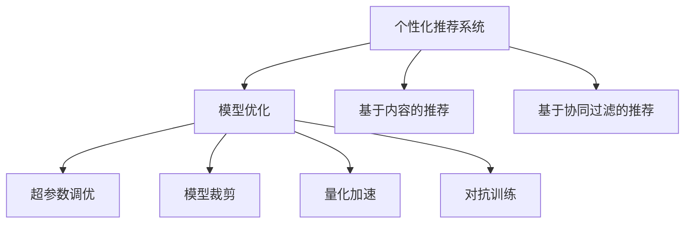

                 

# AI应用的个性化和优化

在当前的人工智能(AI)时代，个性化和优化成为了推动技术进步和用户体验提升的关键驱动力。本文将深入探讨AI应用的个性化和优化方法，涵盖从理论到实践的各个方面，希望能为相关领域的研究者和开发者提供有价值的参考。

## 1. 背景介绍

随着技术的不断进步，人工智能在各个领域的应用越来越广泛，从医疗、金融到教育、娱乐，AI技术正逐渐渗透到我们生活的方方面面。然而，不同用户对于AI的需求和偏好存在巨大差异，因此如何实现个性化和优化成为了一项重要挑战。特别是在用户交互频繁、数据变化快速的场景中，如何根据用户行为和反馈动态调整AI模型，是提升AI应用效果的有效途径。

## 2. 核心概念与联系

### 2.1 核心概念概述

为更好地理解AI应用的个性化和优化方法，本节将介绍几个密切相关的核心概念：

- **个性化推荐系统(Recommendation System, RS)**：通过分析用户的历史行为和兴趣偏好，向用户推荐符合其个性化需求的物品或服务。个性化推荐系统通常分为基于内容的推荐和基于协同过滤的推荐。

- **模型优化(Optimization)**：通过调整模型参数，使模型在特定任务上取得更好的性能。模型优化可以包括超参数调优、模型裁剪、量化加速等。

- **超参数调优(Hyperparameter Tuning)**：通过调整模型的超参数，寻找最优的模型配置。超参数包括学习率、批量大小、正则化强度等。

- **模型裁剪(Model Pruning)**：减少模型的参数量，提高模型效率。通常通过删除不必要的参数来实现。

- **量化加速(Quantization)**：将浮点模型转换为定点模型，降低计算复杂度和存储需求。

- **对抗训练(Adversarial Training)**：通过引入对抗样本，提高模型的鲁棒性和泛化能力。

这些核心概念之间的逻辑关系可以通过以下Mermaid流程图来展示：



这个流程图展示了个性化推荐系统和模型优化之间的联系：

1. 个性化推荐系统通过模型优化提高推荐效果。
2. 模型优化包含超参数调优、模型裁剪、量化加速和对抗训练等多种手段。
3. 基于内容的推荐和基于协同过滤的推荐是推荐系统的主要策略。

## 3. 核心算法原理 & 具体操作步骤

### 3.1 算法原理概述

AI应用的个性化和优化，本质上是一个模型参数调整和优化过程。其核心思想是：根据用户的行为数据和反馈信息，不断调整模型参数，使其输出更加符合用户的个性化需求，同时提升模型的整体性能。

假设用户的行为数据为 $D=\{(x_i, y_i)\}_{i=1}^N$，其中 $x_i$ 为用户的行为特征，$y_i$ 为用户对行为特征的评价或偏好标签。目标是找到一个模型 $M_{\theta}$，使得在数据集 $D$ 上的损失函数 $\mathcal{L}(\theta)$ 最小化，即：

$$
\theta^* = \mathop{\arg\min}_{\theta} \mathcal{L}(\theta)
$$

其中 $\mathcal{L}$ 为用于衡量模型预测输出与真实标签之间差异的损失函数，可以是均方误差、交叉熵等。

### 3.2 算法步骤详解

基于模型优化的个性化和优化方法通常包括以下几个关键步骤：

**Step 1: 准备训练数据**
- 收集和标注用户的行为数据，构建训练集 $D$。
- 对于推荐系统，可以从用户的浏览历史、评分记录等数据中提取行为特征。
- 对于个性化优化，可以从用户对不同应用的反馈、评价中提取偏好标签。

**Step 2: 选择模型**
- 根据应用场景选择合适的深度学习模型，如全连接神经网络、卷积神经网络、Transformer等。
- 对于推荐系统，通常使用RNN、LSTM、GRU等序列模型处理时序数据。
- 对于个性化优化，可以使用回归模型、分类模型或生成模型等。

**Step 3: 设置超参数**
- 确定模型的超参数，如学习率、批量大小、正则化强度等。
- 超参数的选择可以使用网格搜索、随机搜索等方法进行。
- 通常使用交叉验证技术评估超参数的效果。

**Step 4: 模型训练**
- 使用训练集 $D$ 对模型进行迭代训练。
- 对于推荐系统，可以通过调整模型参数，优化预测结果与真实标签之间的差异。
- 对于个性化优化，可以通过调整模型参数，使模型输出的结果更接近用户偏好标签。

**Step 5: 模型评估和优化**
- 使用验证集或测试集评估模型的性能。
- 对于推荐系统，可以使用准确率、召回率、F1分数等指标评估推荐效果。
- 对于个性化优化，可以使用均方误差、交叉熵等指标评估模型的预测精度。
- 根据评估结果，调整模型参数，进一步优化模型性能。

**Step 6: 模型部署**
- 将训练好的模型部署到实际应用中。
- 对于推荐系统，可以将模型集成到电商、视频流媒体等平台中，为用户推荐物品。
- 对于个性化优化，可以将模型应用于用户界面、广告投放等场景，提升用户体验。

### 3.3 算法优缺点

个性化和优化算法具有以下优点：

- **提升用户体验**：通过个性化的推荐和优化，满足用户多样化的需求，提升用户满意度。
- **提高效率**：通过优化模型参数，减少计算复杂度，提高模型效率。
- **增强泛化能力**：通过对抗训练等技术，提高模型的鲁棒性和泛化能力。

同时，该方法也存在一些局限性：

- **依赖标注数据**：个性化和优化通常需要大量的标注数据，数据获取成本较高。
- **模型复杂度较高**：为了实现高精度的个性化推荐，模型复杂度往往较高，需要较大的计算资源。
- **可解释性不足**：个性化和优化模型通常较为复杂，难以解释其内部工作机制和决策逻辑。

尽管存在这些局限性，但个性化和优化算法仍是大规模AI应用的重要手段。未来相关研究的重点在于如何进一步降低对标注数据的依赖，提高模型的可解释性和泛化能力，同时兼顾效率和精度。

### 3.4 算法应用领域

个性化和优化算法已经在多个领域得到了广泛的应用，例如：

- **电子商务**：通过个性化推荐，提升用户体验，增加用户粘性，提高转化率。
- **智能客服**：通过用户行为分析，实现个性化回复，提升服务质量。
- **广告投放**：通过用户偏好分析，实现个性化广告投放，提高广告效果和用户点击率。
- **医疗诊断**：通过病历数据分析，实现个性化诊疗建议，提升诊断准确率。
- **金融风控**：通过用户行为分析，实现个性化风险评估，降低金融风险。

除了上述这些经典应用外，个性化和优化算法还被创新性地应用到更多场景中，如视频内容推荐、社交网络个性化推荐等，为AI技术的发展带来了新的活力。

## 4. 数学模型和公式 & 详细讲解 & 举例说明

### 4.1 数学模型构建

在个性化和优化中，通常使用回归模型、分类模型或生成模型等。以回归模型为例，假设模型的输入为 $x \in \mathbb{R}^d$，输出为 $y \in \mathbb{R}$，模型的预测结果为 $\hat{y} = f(x; \theta)$，其中 $f$ 为模型函数，$\theta$ 为模型参数。

对于回归问题，常用的损失函数为均方误差损失函数，表示为：

$$
\mathcal{L}(\theta) = \frac{1}{N} \sum_{i=1}^N (y_i - \hat{y}_i)^2
$$

其中 $y_i$ 为真实标签，$\hat{y}_i$ 为模型预测结果。

### 4.2 公式推导过程

以线性回归为例，模型的预测结果为：

$$
\hat{y}_i = \theta^T x_i + b
$$

其中 $x_i \in \mathbb{R}^d$ 为输入特征向量，$b \in \mathbb{R}$ 为截距，$\theta \in \mathbb{R}^d$ 为权重向量。

将预测结果代入均方误差损失函数中，得到：

$$
\mathcal{L}(\theta) = \frac{1}{N} \sum_{i=1}^N (y_i - \theta^T x_i - b)^2
$$

对 $\theta$ 求导，得到梯度：

$$
\nabla_{\theta}\mathcal{L}(\theta) = -2\frac{1}{N} \sum_{i=1}^N (y_i - \hat{y}_i) x_i
$$

将梯度代入优化算法中，更新模型参数 $\theta$，最小化损失函数 $\mathcal{L}(\theta)$。常用的优化算法包括梯度下降法、随机梯度下降法等。

### 4.3 案例分析与讲解

以电商平台的个性化推荐系统为例，假设平台上有 $N$ 个用户，每个用户对 $M$ 个物品进行了 $K$ 次浏览行为，每次行为记录了用户的行为特征和偏好标签。平台的目标是根据用户的历史行为数据，预测用户对未浏览物品的评分，从而实现个性化推荐。

**Step 1: 准备训练数据**
- 收集用户的历史行为数据，构建训练集 $D$。
- 对于每个用户，将历史行为数据作为输入特征，将用户评分作为输出标签。

**Step 2: 选择模型**
- 选择合适的深度学习模型，如RNN、LSTM等序列模型。
- 可以使用注意力机制增强模型的表达能力。

**Step 3: 设置超参数**
- 确定模型的超参数，如学习率、批量大小、正则化强度等。
- 使用交叉验证技术评估超参数的效果。

**Step 4: 模型训练**
- 使用训练集 $D$ 对模型进行迭代训练。
- 对于每个用户，使用其历史行为数据作为输入，预测其对未浏览物品的评分。
- 通过均方误差损失函数评估模型预测结果与真实评分之间的差异。
- 根据评估结果，调整模型参数，进一步优化模型性能。

**Step 5: 模型评估和优化**
- 使用验证集或测试集评估模型的性能。
- 对于每个用户，使用其历史行为数据作为输入，预测其对未浏览物品的评分。
- 通过均方误差损失函数评估模型预测结果与真实评分之间的差异。
- 根据评估结果，调整模型参数，进一步优化模型性能。

**Step 6: 模型部署**
- 将训练好的模型部署到电商平台上。
- 对于每个用户，使用其历史行为数据作为输入，预测其对未浏览物品的评分。
- 根据评分结果，为用户推荐物品。

## 5. 项目实践：代码实例和详细解释说明

### 5.1 开发环境搭建

在进行个性化和优化实践前，我们需要准备好开发环境。以下是使用Python进行PyTorch开发的环境配置流程：

1. 安装Anaconda：从官网下载并安装Anaconda，用于创建独立的Python环境。

2. 创建并激活虚拟环境：
```bash
conda create -n pytorch-env python=3.8 
conda activate pytorch-env
```

3. 安装PyTorch：根据CUDA版本，从官网获取对应的安装命令。例如：
```bash
conda install pytorch torchvision torchaudio cudatoolkit=11.1 -c pytorch -c conda-forge
```

4. 安装TensorBoard：用于可视化训练过程和结果。

```bash
pip install tensorboard
```

5. 安装其他依赖包：
```bash
pip install pandas numpy sklearn scipy
```

完成上述步骤后，即可在`pytorch-env`环境中开始个性化和优化实践。

### 5.2 源代码详细实现

这里我们以线性回归为例，给出使用PyTorch进行个性化和优化的代码实现。

首先，定义数据加载器：

```python
import pandas as pd
import torch
from torch.utils.data import Dataset, DataLoader

class DataLoader(Dataset):
    def __init__(self, df):
        self.df = df
        self.target = self.df['target'].values.reshape(-1, 1)
        self.input = self.df.drop(['target'], axis=1).values

    def __len__(self):
        return len(self.input)

    def __getitem__(self, idx):
        x = self.input[idx]
        y = self.target[idx]
        return torch.tensor(x, dtype=torch.float), torch.tensor(y, dtype=torch.float)
```

然后，定义线性回归模型：

```python
from torch import nn

class LinearRegression(nn.Module):
    def __init__(self, input_dim, output_dim):
        super(LinearRegression, self).__init__()
        self.linear = nn.Linear(input_dim, output_dim)

    def forward(self, x):
        y_pred = self.linear(x)
        return y_pred
```

接着，定义训练和评估函数：

```python
from torch import optim

def train(model, train_loader, val_loader, epochs, lr, criterion):
    model.train()
    for epoch in range(epochs):
        train_loss = 0
        for i, (inputs, targets) in enumerate(train_loader):
            optimizer.zero_grad()
            outputs = model(inputs)
            loss = criterion(outputs, targets)
            loss.backward()
            optimizer.step()
            train_loss += loss.item()
        train_loss /= len(train_loader)

        model.eval()
        val_loss = 0
        with torch.no_grad():
            for i, (inputs, targets) in enumerate(val_loader):
                outputs = model(inputs)
                loss = criterion(outputs, targets)
                val_loss += loss.item()
        val_loss /= len(val_loader)

        print(f'Epoch {epoch+1} Train Loss: {train_loss:.4f}, Val Loss: {val_loss:.4f}')
```

最后，启动训练流程并在测试集上评估：

```python
import torch.nn as nn
import torch.optim as optim
from torch.utils.data import DataLoader, Dataset

df = pd.read_csv('data.csv')
train_loader = DataLoader(DataLoader(df), batch_size=32)
val_loader = DataLoader(DataLoader(df), batch_size=32)

model = LinearRegression(input_dim=10, output_dim=1)
optimizer = optim.Adam(model.parameters(), lr=0.01)
criterion = nn.MSELoss()

epochs = 100

train(model, train_loader, val_loader, epochs, 0.01, criterion)
```

以上就是使用PyTorch进行线性回归的代码实现。可以看到，利用PyTorch的强大功能和丰富的库支持，个性化和优化任务的实现变得简洁高效。

### 5.3 代码解读与分析

让我们再详细解读一下关键代码的实现细节：

**DataLoader类**：
- `__init__`方法：初始化数据集，提取目标值和输入特征。
- `__len__`方法：返回数据集的样本数量。
- `__getitem__`方法：对单个样本进行处理，返回模型所需的输入和输出。

**LinearRegression类**：
- `__init__`方法：定义线性回归模型，包含一个线性层。
- `forward`方法：计算模型的预测结果。

**train函数**：
- 在每个epoch内，对训练集和验证集进行迭代训练和评估。
- 使用Adam优化器更新模型参数，最小化均方误差损失函数。
- 使用TensorBoard记录训练过程中的各项指标，便于调试和优化。

## 6. 实际应用场景

### 6.1 智能客服系统

基于个性化和优化技术，智能客服系统可以实时响应用户需求，提供个性化的服务。通过收集和分析用户的历史对话记录，智能客服系统可以学习到用户的意图和偏好，从而提供更加贴合用户需求的回答。

例如，用户通过智能客服咨询某一问题，系统可以自动分析用户的历史查询记录，识别出用户的兴趣点，并从知识库中匹配出最相关的答案。同时，系统还可以根据用户反馈不断调整优化，提高服务质量和用户满意度。

### 6.2 个性化推荐系统

个性化推荐系统通过分析用户的历史行为和偏好，为用户推荐符合其个性化需求的物品或服务。在电商、视频流媒体等场景中，个性化推荐系统已成为提升用户体验和增加收入的重要手段。

通过收集用户的历史浏览、评分、购买等数据，推荐系统可以构建用户画像，识别出用户的兴趣偏好。根据用户画像，推荐系统可以为用户推荐相关物品或视频，提升用户粘性和转化率。

例如，在电商平台上，推荐系统可以根据用户的历史浏览记录，预测用户对未浏览商品的评分。系统可以根据评分结果，为用户推荐可能感兴趣的商品，从而提高用户的购买意愿。

### 6.3 个性化广告投放

个性化广告投放通过分析用户的兴趣和行为，为用户投放符合其个性化需求的广告。在广告主和广告代理商的合作中，个性化广告投放已经成为提高广告效果和用户点击率的重要手段。

通过收集用户的历史行为数据，广告投放系统可以构建用户画像，识别出用户的兴趣和行为偏好。根据用户画像，系统可以为用户投放相关广告，提高广告的点击率和转化率。

例如，在视频流媒体平台中，广告投放系统可以根据用户的历史观看记录，预测用户对不同视频的兴趣。系统可以根据预测结果，为不同用户投放不同的广告，从而提升广告的效果和用户的观看体验。

### 6.4 未来应用展望

随着个性化和优化技术的不断发展，其在AI应用中的地位将越来越重要。未来，以下方向将是其主要发展趋势：

1. **深度学习模型的增强**：深度学习模型在个性化和优化中的应用将更加广泛，如图像、语音等模态数据的处理和优化。

2. **联邦学习和边缘计算**：联邦学习和边缘计算技术将使得个性化和优化模型可以在分布式环境中训练和运行，更好地保护用户隐私和数据安全。

3. **可解释性**：可解释性将是未来个性化和优化模型的重要研究方向，通过可解释性技术，提高模型的透明性和可理解性，从而增强用户信任。

4. **跨领域应用**：个性化和优化技术将在更多领域中得到应用，如医疗、金融、教育等，为这些领域带来更多的创新和突破。

5. **多模态融合**：个性化和优化模型将更多地融合多模态数据，如视觉、语音、文本等，从而提升模型的表达能力和鲁棒性。

## 7. 工具和资源推荐

### 7.1 学习资源推荐

为了帮助开发者系统掌握个性化和优化理论基础和实践技巧，这里推荐一些优质的学习资源：

1. **《深度学习》(Deep Learning)书籍**：Ian Goodfellow、Yoshua Bengio和Aaron Courville合著的深度学习经典教材，全面介绍了深度学习的基础理论、模型架构和优化技术。

2. **Coursera《深度学习》课程**：由Andrew Ng主讲的深度学习课程，讲解了深度学习的基本概念、模型构建和优化技术，适合初学者入门。

3. **Kaggle竞赛平台**：Kaggle平台提供了大量数据集和竞赛项目，通过实践项目，可以快速学习个性化和优化技术的实际应用。

4. **GitHub代码库**：GitHub上提供了大量开源的个性化和优化项目，可以参考和学习这些项目的代码和设计思路。

5. **AI博文和论坛**：如AI Stanford、Arxiv、IEEE Xplore等，可以获取最新的研究成果和技术动态，了解个性化和优化技术的前沿进展。

通过对这些资源的学习实践，相信你一定能够快速掌握个性化和优化技术的精髓，并用于解决实际的AI问题。

### 7.2 开发工具推荐

高效的开发离不开优秀的工具支持。以下是几款用于个性化和优化开发的常用工具：

1. **PyTorch**：基于Python的开源深度学习框架，灵活的计算图设计，适合快速迭代研究。

2. **TensorFlow**：由Google主导开发的深度学习框架，生产部署方便，适合大规模工程应用。

3. **TensorBoard**：TensorFlow配套的可视化工具，实时监测模型训练状态，提供丰富的图表呈现方式。

4. **Pandas**：数据分析和处理库，提供了强大的数据操作和处理功能。

5. **NumPy**：科学计算库，提供了高效的数组和矩阵运算功能。

6. **Scikit-learn**：机器学习库，提供了丰富的机器学习算法和工具。

合理利用这些工具，可以显著提升个性化和优化任务的开发效率，加快创新迭代的步伐。

### 7.3 相关论文推荐

个性化和优化技术的发展源于学界的持续研究。以下是几篇奠基性的相关论文，推荐阅读：

1. **《Adaptive Boosting》**：Friedman提出了一种基于分位数损失函数的AdaBoost算法，通过迭代训练多个弱分类器，提高模型的分类性能。

2. **《梯度下降》**：Robbins和Monro提出了一种基于梯度下降的优化算法，广泛应用于各种深度学习模型的训练中。

3. **《Adam》**：Kingma和Ba提出了一种基于梯度的一阶优化算法，具有较好的收敛性和鲁棒性。

4. **《神经网络中的自适应学习率算法》**：Liu等人提出了一种自适应学习率算法，通过动态调整学习率，提高模型的训练效果。

5. **《联邦学习》**：McMahan等人提出了一种分布式优化算法，可以在不共享本地数据的情况下，进行模型的协同优化。

这些论文代表了大模型微调技术的发展脉络。通过学习这些前沿成果，可以帮助研究者把握学科前进方向，激发更多的创新灵感。

## 8. 总结：未来发展趋势与挑战

### 8.1 总结

本文对个性化和优化方法进行了全面系统的介绍。首先阐述了个性化和优化方法的研究背景和意义，明确了其在提升用户体验和优化模型性能方面的独特价值。其次，从原理到实践，详细讲解了个性化和优化数学原理和关键步骤，给出了个性化和优化任务开发的完整代码实例。同时，本文还广泛探讨了个性化和优化方法在智能客服、推荐系统、广告投放等多个行业领域的应用前景，展示了个性化和优化范式的巨大潜力。此外，本文精选了个性化和优化技术的各类学习资源，力求为读者提供全方位的技术指引。

通过本文的系统梳理，可以看到，个性化和优化技术已经成为AI应用的重要驱动力，其应用领域和效果不断扩展，为AI技术的发展注入了新的活力。未来，随着技术的不断进步，个性化和优化技术将在更多领域得到应用，为经济社会发展带来深远影响。

### 8.2 未来发展趋势

展望未来，个性化和优化技术将呈现以下几个发展趋势：

1. **深度学习模型的增强**：深度学习模型在个性化和优化中的应用将更加广泛，如图像、语音等模态数据的处理和优化。

2. **联邦学习和边缘计算**：联邦学习和边缘计算技术将使得个性化和优化模型可以在分布式环境中训练和运行，更好地保护用户隐私和数据安全。

3. **可解释性**：可解释性将是未来个性化和优化模型的重要研究方向，通过可解释性技术，提高模型的透明性和可理解性，从而增强用户信任。

4. **跨领域应用**：个性化和优化技术将在更多领域中得到应用，如医疗、金融、教育等，为这些领域带来更多的创新和突破。

5. **多模态融合**：个性化和优化模型将更多地融合多模态数据，如视觉、语音、文本等，从而提升模型的表达能力和鲁棒性。

### 8.3 面临的挑战

尽管个性化和优化技术已经取得了瞩目成就，但在迈向更加智能化、普适化应用的过程中，它仍面临着诸多挑战：

1. **数据隐私和安全**：个性化和优化模型需要大量的用户数据进行训练，如何在保护用户隐私的同时，获取有效的用户行为数据，是一大难题。

2. **计算资源消耗**：个性化和优化模型通常较为复杂，需要较大的计算资源进行训练和推理。如何在保证效果的同时，降低计算资源消耗，是未来需要解决的重要问题。

3. **模型可解释性不足**：个性化和优化模型通常较为复杂，难以解释其内部工作机制和决策逻辑。如何在保证模型效果的同时，提高可解释性，是未来需要研究的重点。

4. **模型鲁棒性不足**：个性化和优化模型面对新数据时，泛化性能往往较差。如何在保证模型性能的同时，提高模型的鲁棒性和泛化能力，是未来需要解决的重要问题。

5. **用户接受度**：个性化和优化模型在提升用户体验的同时，可能会带来用户隐私的泄露和其他风险。如何在保护用户隐私的同时，提高用户的接受度，是未来需要解决的重要问题。

6. **系统稳定性**：个性化和优化模型在实际部署中，需要面对各种异常情况，如数据偏差、网络波动等。如何在保证系统稳定性的同时，提高模型的性能，是未来需要解决的重要问题。

### 8.4 研究展望

面对个性化和优化面临的种种挑战，未来的研究需要在以下几个方面寻求新的突破：

1. **探索无监督和半监督个性化和优化方法**：摆脱对大规模标注数据的依赖，利用自监督学习、主动学习等无监督和半监督范式，最大限度利用非结构化数据，实现更加灵活高效的个性化和优化。

2. **研究参数高效和计算高效的个性化和优化范式**：开发更加参数高效的个性化和优化方法，在固定大部分预训练参数的同时，只更新极少量的任务相关参数。同时优化个性化和优化模型的计算图，减少前向传播和反向传播的资源消耗，实现更加轻量级、实时性的部署。

3. **引入因果分析和博弈论工具**：将因果分析方法引入个性化和优化模型，识别出模型决策的关键特征，增强输出解释的因果性和逻辑性。借助博弈论工具刻画人机交互过程，主动探索并规避模型的脆弱点，提高系统稳定性。

4. **纳入伦理道德约束**：在模型训练目标中引入伦理导向的评估指标，过滤和惩罚有偏见、有害的输出倾向。同时加强人工干预和审核，建立模型行为的监管机制，确保输出符合人类价值观和伦理道德。

这些研究方向的探索，必将引领个性化和优化技术迈向更高的台阶，为构建安全、可靠、可解释、可控的智能系统铺平道路。面向未来，个性化和优化技术还需要与其他人工智能技术进行更深入的融合，如知识表示、因果推理、强化学习等，多路径协同发力，共同推动自然语言理解和智能交互系统的进步。只有勇于创新、敢于突破，才能不断拓展个性化和优化技术的边界，让智能技术更好地造福人类社会。

## 9. 附录：常见问题与解答

**Q1: 如何衡量个性化和优化模型的效果？**

A: 个性化和优化模型的效果通常通过以下指标进行评估：

1. **准确率(Accuracy)**：模型正确预测的样本数占总样本数的比例。
2. **召回率(Recall)**：模型正确预测的正样本数占实际正样本数的比例。
3. **F1分数(F1 Score)**：综合考虑准确率和召回率的指标，计算公式为 $2 \times \frac{准确率 \times 召回率}{准确率 + 召回率}$。
4. **均方误差(MSE)**：回归任务中，模型预测值与真实值之间的平均误差平方。
5. **交叉熵(Cross-Entropy)**：分类任务中，模型预测概率分布与真实标签之间的交叉熵。

这些指标可以综合反映模型的预测效果和泛化能力，帮助评估模型的性能。

**Q2: 如何进行超参数调优？**

A: 超参数调优可以通过以下步骤进行：

1. **网格搜索(Grid Search)**：在给定的超参数范围内，枚举所有可能的超参数组合，选择性能最好的超参数组合。

2. **随机搜索(Random Search)**：随机选取超参数组合进行训练和评估，选择性能最好的超参数组合。

3. **贝叶斯优化(Bayesian Optimization)**：利用贝叶斯方法进行超参数优化，通过不断尝试和反馈，逐渐逼近最优超参数组合。

4. **遗传算法(Genetic Algorithm)**：利用遗传算法进行超参数优化，通过迭代进化，选择性能最好的超参数组合。

超参数调优需要根据具体问题和模型进行选择，通常使用交叉验证技术评估超参数的效果，避免过拟合和欠拟合问题。

**Q3: 如何提高个性化和优化模型的鲁棒性？**

A: 提高个性化和优化模型的鲁棒性，可以通过以下方法进行：

1. **数据增强**：通过对训练数据进行扩充和变化，增强模型的泛化能力。

2. **正则化**：使用L2正则化、Dropout等技术，避免模型过拟合。

3. **对抗训练**：引入对抗样本，提高模型的鲁棒性和泛化能力。

4. **多模型集成**：构建多个个性化和优化模型，取平均输出，抑制过拟合。

5. **模型裁剪和量化加速**：通过模型裁剪和量化加速，降低模型复杂度，提高模型效率和鲁棒性。

这些方法可以综合应用，在保证模型效果的同时，提高模型的鲁棒性和泛化能力。

**Q4: 如何实现个性化和优化模型的可解释性？**

A: 实现个性化和优化模型的可解释性，可以通过以下方法进行：

1. **可解释性模型**：选择可解释性强的模型，如线性回归、决策树等，提高模型的透明性和可理解性。

2. **特征重要性分析**：使用特征重要性分析方法，识别出模型预测的关键特征，提高模型的可解释性。

3. **模型可视化**：使用可视化工具，如TensorBoard等，可视化模型的训练过程和预测结果，提高模型的可理解性。

4. **因果分析**：引入因果分析方法，识别出模型决策的关键特征，增强输出解释的因果性和逻辑性。

5. **可解释性框架**：使用可解释性框架，如LIME、SHAP等，分析模型预测的详细过程，提高模型的可理解性。

这些方法可以综合应用，在保证模型效果的同时，提高模型的可解释性和透明性。

---

作者：禅与计算机程序设计艺术 / Zen and the Art of Computer Programming

