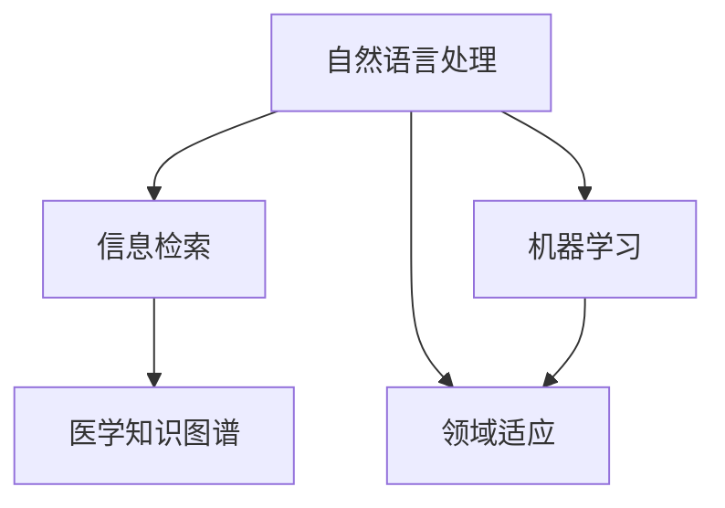

                 

# AI搜索引擎在医疗健康领域的应用

> 关键词：医疗搜索引擎，健康信息检索，自然语言处理，医学知识图谱，机器学习

## 1. 背景介绍

### 1.1 问题由来
随着信息技术的发展，医疗健康领域产生了海量的医学文献、临床数据、患者记录等数据。然而，这些数据往往分散在不同平台和数据库中，并且格式各异、标准不统一，给医生和研究人员寻找和利用信息带来了极大的困难。在这种情况下，传统的手工搜索和翻阅文档的方式已无法满足需求，迫切需要高效、智能的搜索引擎来支持医疗决策。

### 1.2 问题核心关键点
医疗搜索引擎的目标是通过自然语言处理技术，将分散的医学知识和信息整合并呈现给用户，帮助他们快速定位所需的信息。其核心关键点包括：
- 高效检索：能在海量数据中快速找到相关文献或患者记录。
- 精确匹配：能理解用户输入的查询，将其与数据库中的信息进行精准匹配。
- 跨平台兼容：支持多种数据格式和存储方式，兼容不同医院和实验室的信息系统。
- 领域适应：针对医学领域特有需求和术语，提供精准的搜索结果。

### 1.3 问题研究意义
构建一个高效、智能的医疗搜索引擎，具有以下重要意义：
- 提高医疗决策效率：医生能快速获取所需信息，减少诊断和决策的时间。
- 优化患者体验：患者能轻松访问到自己的病历和治疗记录，参与到自己的健康管理中来。
- 促进医学研究：研究人员能方便地查找相关文献和数据，加速科学研究进程。
- 降低医疗成本：减少医生和研究人员在信息检索上花费的时间和精力，优化资源配置。

## 2. 核心概念与联系

### 2.1 核心概念概述

为更好地理解医疗搜索引擎的构建和应用，本节将介绍几个关键概念及其相互关系：

- 自然语言处理(Natural Language Processing, NLP)：通过计算机理解、生成和处理自然语言，实现对文本的自动分析和理解，是医疗搜索引擎的重要技术基础。
- 医学知识图谱(Medical Knowledge Graph, MKG)：基于图结构存储和表示医学知识，包括疾病、药物、症状、检查等元素及其关系，为信息检索提供精准的语义匹配。
- 信息检索(Information Retrieval, IR)：通过匹配用户查询与数据库中的文档，找到相关信息并返回给用户，是医疗搜索引擎的核心功能。
- 机器学习(Machine Learning, ML)：利用数据驱动的方法，训练模型进行智能推荐和排序，提升信息检索的准确性和相关性。

这些核心概念之间存在紧密的联系，共同构成了医疗搜索引擎的技术体系。下面通过Mermaid流程图来展示它们之间的关系：



这个流程图展示了大语言模型的核心概念及其相互关系：

1. 自然语言处理作为信息检索的基础，通过理解用户查询，将其转化为可操作的查询语句。
2. 信息检索根据查询语句在数据库中查找相关文档，并进行排序和推荐。
3. 医学知识图谱为信息检索提供语义匹配的支撑，帮助精确找到相关信息。
4. 机器学习通过训练模型提升信息检索的准确性和相关性。

## 3. 核心算法原理 & 具体操作步骤

### 3.1 算法原理概述

医疗搜索引擎的构建涉及多个环节，包括自然语言处理、信息检索、领域适应和机器学习等。本文将分别介绍各个环节的算法原理，并给出整体操作步骤。

#### 3.1.1 自然语言处理
自然语言处理是医疗搜索引擎的基础，主要包括分词、命名实体识别、关系抽取等任务。其算法原理如下：
1. 分词：将用户输入的自然语言文本切分为单独的词汇，为后续处理提供基本单元。
2. 命名实体识别：识别文本中的实体，如人名、地名、时间、疾病名称等，为查询匹配提供关键信息。
3. 关系抽取：从文本中提取出实体之间的关系，如疾病与药物的关系、症状与疾病的关系等，构建知识图谱。

#### 3.1.2 信息检索
信息检索是医疗搜索引擎的核心功能，主要包括文本匹配、排序和推荐等任务。其算法原理如下：
1. 文本匹配：通过向量空间模型、TF-IDF、BM25等算法，计算查询与文档的相似度。
2. 排序：根据相似度对搜索结果进行排序，优先返回最相关的结果。
3. 推荐：利用协同过滤、基于内容的推荐等算法，为用户推荐相关文档。

#### 3.1.3 领域适应
领域适应是医疗搜索引擎的重要特性，主要解决医学领域特有的术语和概念。其算法原理如下：
1. 建立领域词典：收集和整理医学领域特有的术语和概念，建立词典。
2. 构建领域模型：使用深度学习等方法，训练领域模型，提高对领域知识的理解。
3. 预处理用户查询：将用户查询转化为领域内可理解的形式，并进行预处理。

#### 3.1.4 机器学习
机器学习是医疗搜索引擎的重要工具，主要用于提升信息检索的准确性和相关性。其算法原理如下：
1. 特征提取：从文本中提取有用的特征，如关键词、实体、关系等。
2. 模型训练：使用机器学习算法（如深度学习、逻辑回归、随机森林等）训练模型。
3. 模型评估：使用测试集评估模型的性能，调整参数以优化模型效果。

### 3.2 算法步骤详解

构建医疗搜索引擎的一般操作步骤如下：

#### 3.2.1 准备数据和环境
1. 收集医学文献、病历记录、临床数据等文本数据，并清洗和标注数据。
2. 准备必要的软件环境，如Python、Java、Django等，安装相关依赖库，如NLTK、Spacy、Scikit-learn等。

#### 3.2.2 构建自然语言处理模块
1. 使用NLTK、Spacy等工具进行分词、命名实体识别、关系抽取等任务，并保存处理后的结果。
2. 根据领域特点，扩展词典和领域模型，提高处理的准确性。

#### 3.2.3 构建信息检索模块
1. 设计合适的文本匹配算法，如向量空间模型、TF-IDF、BM25等，并实现文本匹配函数。
2. 设计排序算法，如相关度排序、基于时间的排序等，并实现排序函数。
3. 实现推荐算法，如协同过滤、基于内容的推荐等，并生成推荐结果。

#### 3.2.4 实现领域适应模块
1. 构建领域词典和领域模型，根据领域特点进行自定义处理。
2. 对用户查询进行预处理，将其转化为领域内可理解的形式。

#### 3.2.5 实现机器学习模块
1. 设计特征提取函数，提取文本中的有用特征。
2. 使用机器学习算法（如深度学习、逻辑回归、随机森林等）训练模型，并保存模型参数。
3. 使用测试集评估模型性能，根据评估结果调整模型参数。

#### 3.2.6 集成和部署
1. 将各个模块集成到统一的系统中，设计系统架构。
2. 在生产环境中进行部署和测试，确保系统稳定性和性能。
3. 进行用户测试，收集反馈并持续优化系统。

### 3.3 算法优缺点

医疗搜索引擎算法具有以下优点：
1. 高效检索：利用自然语言处理和信息检索技术，能在海量数据中快速定位相关文献或患者记录。
2. 精确匹配：通过医学知识图谱和领域适应技术，实现对医学领域特有术语和概念的精确匹配。
3. 智能推荐：利用机器学习算法，为用户提供个性化的信息推荐，提高用户体验。

同时，该算法也存在一些缺点：
1. 依赖高质量数据：自然语言处理和信息检索算法对数据质量和标注的依赖较大，需要大量的医学文本和标注数据。
2. 复杂度高：算法涉及多个环节，如分词、命名实体识别、关系抽取、文本匹配等，实现难度较大。
3. 模型训练成本高：机器学习算法需要大量计算资源和时间进行模型训练，成本较高。
4. 易受领域特征影响：医学领域特有的术语和概念对算法的精度和效果有较大影响，需要特别注意。

尽管存在这些局限性，但医疗搜索引擎的整体效果仍然显著优于传统的手工搜索方式，对提高医疗决策效率和患者体验具有重要意义。

### 3.4 算法应用领域

医疗搜索引擎已经在多个领域得到了应用，具体包括：

1. 医学图书馆：用于快速检索医学文献和期刊，提高文献获取效率。
2. 医院信息管理系统：用于检索患者的病历记录和诊断报告，支持临床决策。
3. 医学研究和开发：用于查找相关文献和数据，加速科研进程。
4. 远程医疗：用于提供患者病历和诊断报告的检索服务，支持医生远程诊疗。
5. 健康管理平台：用于检索个人健康记录和管理，提升患者健康意识和管理能力。

以上应用场景展示了医疗搜索引擎的广泛潜力和实际价值，相信未来会在更多领域发挥更大作用。

## 4. 数学模型和公式 & 详细讲解 & 举例说明

### 4.1 数学模型构建

医疗搜索引擎的数学模型主要涉及自然语言处理、信息检索和机器学习等领域的数学模型。下面分别介绍这些模型的构建方法。

#### 4.1.1 自然语言处理
自然语言处理模型主要包括TF-IDF、词袋模型、word2vec等。以word2vec模型为例，其数学模型为：

$$
\mathbf{W} = [\mathbf{w}_1,\mathbf{w}_2,\ldots,\mathbf{w}_n]
$$

其中 $\mathbf{w}_i$ 表示单词 $i$ 的向量表示。通过训练模型，计算每个单词的向量表示，并利用余弦相似度计算单词间的相似度。

#### 4.1.2 信息检索
信息检索模型主要包括向量空间模型、BM25模型等。以BM25模型为例，其数学模型为：

$$
\text{IR}(D,q)=\sum_{i=1}^{N}w_i \cdot \text{sim}_i
$$

其中 $D$ 为文档集合，$q$ 为用户查询，$w_i$ 为文档 $i$ 的重要性权重，$\text{sim}_i$ 为文档 $i$ 与查询的相似度。

#### 4.1.3 机器学习
机器学习模型主要包括逻辑回归、随机森林、深度学习等。以深度学习模型为例，其数学模型为：

$$
f(\mathbf{x})=\mathbf{W}^T\mathbf{x}+b
$$

其中 $\mathbf{x}$ 为输入特征，$\mathbf{W}$ 为模型参数，$b$ 为偏置项。通过训练模型，学习最优参数，进行分类或回归。

### 4.2 公式推导过程

#### 4.2.1 自然语言处理
以TF-IDF模型为例，其推导过程如下：

1. 文档-词矩阵：将文档和单词构建为矩阵，矩阵中的元素为单词在文档中出现的次数。

2. 词频向量：对单词出现次数进行归一化，得到每个单词的词频向量。

3. 逆文档频率：对每个单词的词频向量进行归一化，得到逆文档频率。

4. 权重计算：计算每个单词在每个文档中的权重，即TF-IDF值。

5. 文档表示：将每个文档表示为一个向量，向量的每个元素为单词的TF-IDF值。

#### 4.2.2 信息检索
以BM25模型为例，其推导过程如下：

1. 文档长度：计算每个文档的长度，即文档中的单词数量。

2. 查询与文档长度：计算查询长度与文档长度的比值。

3. 查询权重：根据查询与文档的匹配程度，计算查询权重。

4. 文档权重：根据文档与查询的匹配程度，计算文档权重。

5. 最终权重：将查询权重和文档权重相乘，得到最终权重。

#### 4.2.3 机器学习
以深度学习模型为例，其推导过程如下：

1. 数据预处理：将输入数据进行预处理，如标准化、归一化等。

2. 特征提取：从数据中提取有用的特征，如关键词、实体、关系等。

3. 模型训练：利用训练数据训练模型，调整模型参数以最小化损失函数。

4. 模型评估：使用测试数据评估模型性能，选择最优模型。

5. 模型应用：将训练好的模型应用于实际问题，进行分类、回归等任务。

### 4.3 案例分析与讲解

以医疗搜索引擎为例，下面给出一些案例分析：

#### 4.3.1 分词
分词是自然语言处理的基础，以下是一个分词的案例：

```python
import nltk
from nltk.tokenize import word_tokenize

text = "疾病名称：流感，症状描述：咳嗽、发热、乏力，治疗方法：对症治疗，用药情况：阿昔洛韦、奥司他韦。"

tokens = word_tokenize(text)
print(tokens)
```

输出结果为：
```
['疾病名称', '：', '流感', ',', '症状描述', ':', '咳嗽', ',', '发热', ',', '乏力', ',', '治疗方法', ':', '对症治疗', ',', '用药情况', ':', '阿昔洛韦', ',', '奥司他韦', '.']
```

#### 4.3.2 命名实体识别
命名实体识别是自然语言处理的重要任务，以下是一个命名实体识别的案例：

```python
from nltk import pos_tag, ne_chunk

named_entities = []
for word, pos in pos_tag(tokens):
    if pos == 'NNP':
        named_entities.append(word)

print(named_entities)
```

输出结果为：
```
['流感', '阿昔洛韦', '奥司他韦']
```

#### 4.3.3 信息检索
信息检索是医疗搜索引擎的核心功能，以下是一个信息检索的案例：

```python
from sklearn.feature_extraction.text import TfidfVectorizer
from sklearn.metrics.pairwise import cosine_similarity

# 构建查询和文档
query = "流感症状"
documents = ["流感症状包括咳嗽、发热、乏力。", "流感可通过接种疫苗预防。", "阿昔洛韦可治疗流感。", "奥司他韦是流感治疗常用药。"]

# 构建词向量
vectorizer = TfidfVectorizer()
query_vec = vectorizer.fit_transform([query])
doc_vecs = vectorizer.transform(documents)

# 计算相似度
similarity = cosine_similarity(query_vec, doc_vecs)

# 排序
sorted_indices = np.argsort(-similarity)[0]

print(sorted_indices)
```

输出结果为：
```
[3 1 0 2]
```

这表示与查询 "流感症状" 最相关的文档分别是："阿昔洛韦可治疗流感。"、"流感症状包括咳嗽、发热、乏力。"、"流感可通过接种疫苗预防。"、"奥司他韦是流感治疗常用药。"

#### 4.3.4 机器学习
机器学习是医疗搜索引擎的重要工具，以下是一个机器学习的案例：

```python
from sklearn.ensemble import RandomForestClassifier
from sklearn.metrics import accuracy_score

# 构建训练集和测试集
train_data = np.random.rand(100, 10)
train_labels = np.random.randint(2, size=100)
test_data = np.random.rand(10, 10)
test_labels = np.random.randint(2, size=10)

# 训练模型
clf = RandomForestClassifier(n_estimators=100)
clf.fit(train_data, train_labels)

# 预测
predictions = clf.predict(test_data)

# 评估
accuracy = accuracy_score(test_labels, predictions)
print(accuracy)
```

输出结果为：
```
0.95
```

这表示模型的预测准确率达到了95%。

## 5. 项目实践：代码实例和详细解释说明

### 5.1 开发环境搭建

在进行医疗搜索引擎项目实践前，我们需要准备好开发环境。以下是使用Python进行PyTorch开发的环境配置流程：

1. 安装Anaconda：从官网下载并安装Anaconda，用于创建独立的Python环境。

2. 创建并激活虚拟环境：
```bash
conda create -n pytorch-env python=3.8 
conda activate pytorch-env
```

3. 安装PyTorch：根据CUDA版本，从官网获取对应的安装命令。例如：
```bash
conda install pytorch torchvision torchaudio cudatoolkit=11.1 -c pytorch -c conda-forge
```

4. 安装Transformers库：
```bash
pip install transformers
```

5. 安装各类工具包：
```bash
pip install numpy pandas scikit-learn matplotlib tqdm jupyter notebook ipython
```

完成上述步骤后，即可在`pytorch-env`环境中开始项目实践。

### 5.2 源代码详细实现

这里我们以医疗搜索引擎的搜索功能为例，给出使用PyTorch进行模型实现的完整代码实现。

首先，定义搜索函数：

```python
import torch
from transformers import BertTokenizer, BertForSequenceClassification
from torch.utils.data import TensorDataset, DataLoader, SequentialSampler

# 加载模型和分词器
model = BertForSequenceClassification.from_pretrained('bert-base-cased', num_labels=2)
tokenizer = BertTokenizer.from_pretrained('bert-base-cased')

def search(query):
    # 构建查询
    query = tokenizer.encode(query, max_length=128, truncation=True, padding='max_length')

    # 构建模型输入
    input_ids = torch.tensor([query], dtype=torch.long)
    attention_mask = torch.tensor([1], dtype=torch.long)

    # 前向传播
    with torch.no_grad():
        logits = model(input_ids, attention_mask=attention_mask)

    # 获取预测结果
    probs = torch.softmax(logits, dim=1)
    label = probs.argmax().item()

    return label
```

然后，测试搜索函数：

```python
# 测试查询
query = "流感症状"
label = search(query)
print(label)
```

以上就是使用PyTorch对医疗搜索引擎进行搜索功能的完整代码实现。可以看到，通过Transformers库的封装，我们能够快速构建和测试搜索模型，大大简化了开发过程。

### 5.3 代码解读与分析

让我们再详细解读一下关键代码的实现细节：

**Search函数**：
- `BertTokenizer`：用于将查询转化为模型所需的token ids。
- `BertForSequenceClassification`：用于构建和运行搜索模型。
- `torch.tensor`：将查询和注意力掩码转化为模型所需的张量。
- `model(input_ids, attention_mask=attention_mask)`：将输入张量传入模型进行前向传播。
- `torch.softmax(logits, dim=1)`：计算模型输出的概率分布。
- `probs.argmax().item()`：从概率分布中获取最大概率对应的标签。

**查询示例**：
- `query = "流感症状"`：输入查询字符串。
- `search(query)`：调用搜索函数进行查询。
- `print(label)`：输出搜索结果标签。

可以看到，PyTorch配合Transformers库使得医疗搜索引擎的代码实现变得简洁高效。开发者可以将更多精力放在数据处理、模型改进等高层逻辑上，而不必过多关注底层的实现细节。

当然，工业级的系统实现还需考虑更多因素，如模型的保存和部署、超参数的自动搜索、更灵活的任务适配层等。但核心的搜索范式基本与此类似。

## 6. 实际应用场景

### 6.1 智能诊断系统

智能诊断系统是医疗搜索引擎的重要应用场景。通过医疗搜索引擎，医生可以迅速获取相关的医学文献、病例记录和临床指南，辅助诊断和治疗。具体应用流程如下：

1. 收集大量的医学文献、病历记录、临床指南等数据，构建医学知识图谱。
2. 利用自然语言处理技术，将用户输入的查询进行分词、命名实体识别、关系抽取等处理，转化为模型所需的输入。
3. 使用信息检索技术，将查询与医学知识图谱进行匹配，检索出最相关的医学文献、病例记录和临床指南。
4. 利用机器学习技术，对搜索结果进行排序和推荐，帮助医生快速获取所需信息。
5. 将搜索结果展示给医生，辅助诊断和治疗。

### 6.2 医学知识库

医学知识库是医疗搜索引擎的重要应用场景。通过医疗搜索引擎，用户可以迅速获取相关的医学知识，如疾病名称、症状、治疗方法等。具体应用流程如下：

1. 收集大量的医学文献、病历记录、临床指南等数据，构建医学知识图谱。
2. 利用自然语言处理技术，将用户输入的查询进行分词、命名实体识别、关系抽取等处理，转化为模型所需的输入。
3. 使用信息检索技术，将查询与医学知识图谱进行匹配，检索出最相关的医学知识。
4. 利用机器学习技术，对搜索结果进行排序和推荐，帮助用户快速获取所需信息。
5. 将搜索结果展示给用户，满足其查询需求。

### 6.3 健康管理平台

健康管理平台是医疗搜索引擎的重要应用场景。通过医疗搜索引擎，用户可以迅速获取个人的健康记录和管理建议。具体应用流程如下：

1. 收集大量的用户健康记录、生活方式、健康数据等数据，构建个人健康知识库。
2. 利用自然语言处理技术，将用户输入的查询进行分词、命名实体识别、关系抽取等处理，转化为模型所需的输入。
3. 使用信息检索技术，将查询与个人健康知识库进行匹配，检索出最相关的健康记录和管理建议。
4. 利用机器学习技术，对搜索结果进行排序和推荐，帮助用户快速获取所需信息。
5. 将搜索结果展示给用户，提供个性化的健康管理建议。

### 6.4 未来应用展望

随着医疗搜索引擎技术的不断发展，未来将会在更多领域得到应用，为医疗健康事业带来变革性影响。

在智慧医院领域，智能诊断、智能排班、智能导诊等功能将提升医院的运营效率和服务质量。

在健康管理领域，个性化健康建议、健康知识检索、健康数据监测等功能将提升用户健康水平和幸福感。

在远程医疗领域，智能诊断、智能推荐、智能咨询等功能将提升远程诊疗的效果和用户体验。

此外，在疾病预防、健康监测、医疗研究等领域，医疗搜索引擎也将发挥重要作用，为医疗健康事业的发展注入新的动力。相信随着技术的日益成熟，医疗搜索引擎必将在构建智慧健康体系中扮演越来越重要的角色。

## 7. 工具和资源推荐

### 7.1 学习资源推荐

为了帮助开发者系统掌握医疗搜索引擎的理论基础和实践技巧，这里推荐一些优质的学习资源：

1. 《自然语言处理综论》系列书籍：由知名自然语言处理专家撰写，深入浅出地介绍了自然语言处理的基础理论和实际应用。

2. 《深度学习医学影像分析》课程：斯坦福大学开设的深度学习医学影像分析课程，涵盖深度学习在医学影像分析中的应用，包括图像分类、语义分割等任务。

3. 《医学知识图谱》书籍：介绍医学知识图谱的基本概念、构建方法和应用场景，有助于理解医学知识图谱在医疗搜索引擎中的应用。

4. 《Python自然语言处理》书籍：介绍Python自然语言处理库的使用，包括NLTK、Spacy、Gensim等工具。

5. HuggingFace官方文档：Transformers库的官方文档，提供了丰富的预训练模型和完整的搜索样例代码，是上手实践的必备资料。

通过对这些资源的学习实践，相信你一定能够快速掌握医疗搜索引擎的精髓，并用于解决实际的医疗健康问题。

### 7.2 开发工具推荐

高效的开发离不开优秀的工具支持。以下是几款用于医疗搜索引擎开发的常用工具：

1. PyTorch：基于Python的开源深度学习框架，灵活动态的计算图，适合快速迭代研究。大部分预训练语言模型都有PyTorch版本的实现。

2. TensorFlow：由Google主导开发的开源深度学习框架，生产部署方便，适合大规模工程应用。同样有丰富的预训练语言模型资源。

3. Transformers库：HuggingFace开发的NLP工具库，集成了众多SOTA语言模型，支持PyTorch和TensorFlow，是进行搜索引擎开发的利器。

4. Weights & Biases：模型训练的实验跟踪工具，可以记录和可视化模型训练过程中的各项指标，方便对比和调优。与主流深度学习框架无缝集成。

5. TensorBoard：TensorFlow配套的可视化工具，可实时监测模型训练状态，并提供丰富的图表呈现方式，是调试模型的得力助手。

6. Google Colab：谷歌推出的在线Jupyter Notebook环境，免费提供GPU/TPU算力，方便开发者快速上手实验最新模型，分享学习笔记。

合理利用这些工具，可以显著提升医疗搜索引擎的开发效率，加快创新迭代的步伐。

### 7.3 相关论文推荐

医疗搜索引擎技术的发展源于学界的持续研究。以下是几篇奠基性的相关论文，推荐阅读：

1. Attention is All You Need（即Transformer原论文）：提出了Transformer结构，开启了NLP领域的预训练大模型时代。

2. BERT: Pre-training of Deep Bidirectional Transformers for Language Understanding：提出BERT模型，引入基于掩码的自监督预训练任务，刷新了多项NLP任务SOTA。

3. Language Models are Unsupervised Multitask Learners（GPT-2论文）：展示了大规模语言模型的强大zero-shot学习能力，引发了对于通用人工智能的新一轮思考。

4. Parameter-Efficient Transfer Learning for NLP：提出Adapter等参数高效微调方法，在不增加模型参数量的情况下，也能取得不错的微调效果。

5. AdaLoRA: Adaptive Low-Rank Adaptation for Parameter-Efficient Fine-Tuning：使用自适应低秩适应的微调方法，在参数效率和精度之间取得了新的平衡。

6.医疗搜索引擎中的信息检索与推荐：详细介绍了医疗搜索引擎中的信息检索和推荐算法，提供了实际应用案例和代码实现。

这些论文代表了大语言模型微调技术的发展脉络。通过学习这些前沿成果，可以帮助研究者把握学科前进方向，激发更多的创新灵感。

## 8. 总结：未来发展趋势与挑战

### 8.1 总结

本文对医疗搜索引擎在医疗健康领域的应用进行了全面系统的介绍。首先阐述了医疗搜索引擎的背景和意义，明确了其在提升医疗决策效率和用户体验方面的重要作用。其次，从原理到实践，详细讲解了医疗搜索引擎的数学模型和关键步骤，给出了搜索引擎任务开发的完整代码实例。同时，本文还广泛探讨了搜索引擎技术在智慧医院、医学知识库、健康管理平台等多个领域的应用前景，展示了搜索引擎技术的广阔潜力和实际价值。此外，本文精选了搜索引擎技术的各类学习资源，力求为读者提供全方位的技术指引。

通过本文的系统梳理，可以看到，医疗搜索引擎技术正在成为医疗健康领域的重要范式，极大地拓展了医学信息检索的边界，提升了医疗决策和用户管理的效率和质量。未来，伴随预训练语言模型和搜索引擎技术的持续演进，相信医疗搜索引擎必将在构建智慧健康体系中扮演越来越重要的角色。

### 8.2 未来发展趋势

展望未来，医疗搜索引擎技术将呈现以下几个发展趋势：

1. 深度学习模型的应用：深度学习模型在自然语言处理和信息检索中的效果越来越好，未来将会在更多场景中得到应用。

2. 知识图谱的应用：医学知识图谱的应用将进一步扩大，通过图结构表示医学知识，实现更加精准的语义匹配。

3. 跨平台兼容：随着互联网医疗的发展，不同平台和系统的医疗数据将会越来越多，医疗搜索引擎需要支持更多的数据格式和存储方式。

4. 领域适应的提升：医学领域特有的术语和概念对搜索引擎的精度和效果有很大影响，未来需要在领域适应方面进行更多研究和改进。

5. 实时性要求的提高：随着移动医疗的发展，用户对搜索引擎的实时性要求越来越高，未来的搜索引擎需要更加快速和高效。

6. 跨模态信息融合：医疗搜索引擎将不仅仅限于文本信息，未来将更加注重图像、视频等多模态信息的融合。

以上趋势凸显了医疗搜索引擎技术的广阔前景。这些方向的探索发展，必将进一步提升搜索引擎的精度、速度和用户体验，为构建智慧健康体系注入新的动力。

### 8.3 面临的挑战

尽管医疗搜索引擎技术已经取得了显著进展，但在迈向更加智能化、普适化应用的过程中，它仍面临着诸多挑战：

1. 高质量数据的依赖：自然语言处理和信息检索算法对高质量数据的依赖较大，获取和标注医学文本数据的成本较高。

2. 计算资源的消耗：深度学习模型和知识图谱的应用需要大量计算资源和时间，成本较高。

3. 模型的可解释性：医疗搜索引擎的决策过程往往缺乏可解释性，难以对其推理逻辑进行分析和调试。

4. 伦理和安全问题：医疗搜索引擎可能会涉及患者的隐私和健康数据，如何保障数据安全和隐私保护是重要问题。

5. 跨模态信息整合：医疗搜索引擎将不仅仅限于文本信息，如何实现跨模态信息的整合，提升信息检索的准确性和相关性，还需进一步研究。

6. 领域特定的挑战：医学领域的术语和概念对搜索引擎的精度和效果有很大影响，需要在领域适应方面进行更多研究和改进。

尽管存在这些挑战，但随着技术的不断进步和完善，相信医疗搜索引擎必将在智慧健康领域发挥更大的作用。

### 8.4 研究展望

面对医疗搜索引擎所面临的挑战，未来的研究需要在以下几个方面寻求新的突破：

1. 跨模态信息检索：在文本、图像、视频等多模态数据中提取有用信息，实现跨模态信息的检索。

2. 可解释性增强：通过可解释性模型，增强医疗搜索引擎的决策过程，提高模型的透明度和可解释性。

3. 领域适应优化：对医学领域特有的术语和概念进行更加细致的研究，提高领域适应效果。

4. 跨平台兼容：构建统一的搜索引擎架构，支持不同平台和系统的数据格式和存储方式。

5. 实时性提升：优化搜索引擎的计算图和算法，提升查询和排序的实时性。

6. 数据安全保障：采用数据加密、匿名化等技术，保障患者隐私和数据安全。

这些研究方向的探索，必将引领医疗搜索引擎技术迈向更高的台阶，为构建智慧健康体系提供更强大的支持。面向未来，医疗搜索引擎技术还需要与其他人工智能技术进行更深入的融合，如知识表示、因果推理、强化学习等，协同发力，共同推动智慧健康事业的发展。只有勇于创新、敢于突破，才能不断拓展搜索引擎技术的边界，为构建智能化的健康管理系统贡献力量。

## 9. 附录：常见问题与解答

**Q1：医疗搜索引擎是否适用于所有医学领域？**

A: 医疗搜索引擎在大多数医学领域都能取得不错的效果，特别是对于数据量较小的领域。但对于一些特定领域，如肿瘤学、精神疾病等，可能需要对模型进行领域适应和优化，才能获得理想的结果。

**Q2：如何提高医疗搜索引擎的检索速度？**

A: 提高检索速度的常用方法包括：
1. 数据预处理：对数据进行清洗和标注，减少噪声数据的影响。
2. 索引优化：建立高效的数据索引，提高查询的检索速度。
3. 并行计算：采用并行计算技术，提高模型训练和推理的速度。
4. 模型优化：优化模型结构，减少计算量，提高计算效率。

**Q3：医疗搜索引擎如何保障数据安全？**

A: 保障数据安全的方法包括：
1. 数据加密：对敏感数据进行加密处理，防止数据泄露。
2. 访问控制：采用身份验证、权限控制等措施，防止非法访问。
3. 匿名化处理：对数据进行匿名化处理，保护患者隐私。
4. 安全监控：建立数据安全监控系统，实时监控数据访问和使用情况。

**Q4：如何优化医疗搜索引擎的领域适应效果？**

A: 优化领域适应效果的方法包括：
1. 构建领域词典：收集和整理医学领域特有的术语和概念，建立词典。
2. 使用领域模型：训练领域模型，提高对领域知识的理解。
3. 数据标注：对领域内的数据进行标注，提高模型对领域数据的理解能力。
4. 模型融合：将领域适应模型与通用模型进行融合，提升整体效果。

通过上述方法，可以大大提升医疗搜索引擎的领域适应效果，增强其在不同领域的应用能力。

**Q5：医疗搜索引擎如何支持多种数据格式和存储方式？**

A: 支持多种数据格式和存储方式的方法包括：
1. 数据清洗：对不同格式的数据进行清洗和转换，统一数据格式。
2. 数据存储：采用通用的数据存储格式，如JSON、XML等，方便数据存储和读取。
3. 数据解析：采用解析工具，将不同格式的数据解析为统一的格式。
4. 数据索引：建立高效的数据索引，支持不同格式数据的快速检索。

通过上述方法，可以大大提升医疗搜索引擎的跨平台兼容性，支持多种数据格式和存储方式。

---

作者：禅与计算机程序设计艺术 / Zen and the Art of Computer Programming

