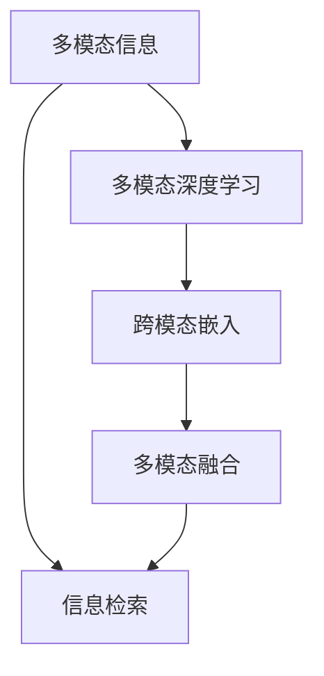
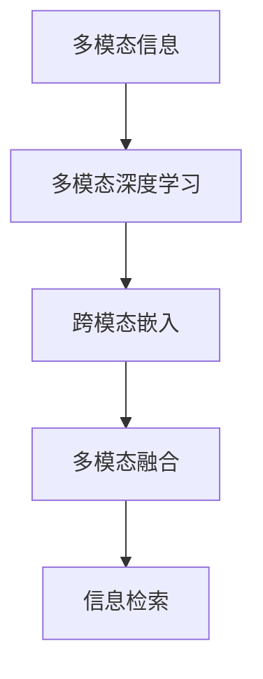

                 

# AI搜索引擎如何处理多模态信息

在数字化时代，人们的信息获取渠道愈发多样，文字、图像、音频、视频等多种形式的信息交织在一起，对搜索引擎提出了更高的要求。如何有效处理多模态信息，提升搜索体验和准确性，成为搜索引擎技术演进的重点。本文将详细介绍AI搜索引擎如何处理多模态信息，包括其核心概念、算法原理、具体实现及未来展望，以期为相关领域的开发者和研究者提供参考。

## 1. 背景介绍

随着互联网和移动互联网的迅速发展，用户生成内容爆炸式增长，信息形态更加多样化。文本信息依然是主要的搜索对象，但图像、音频、视频等多模态信息占比也逐年增加，用户希望通过统一的搜索引擎界面获取丰富多元的内容。搜索引擎需要适应这种变化，逐步引入多模态信息处理能力。

在此背景下，深度学习技术和大数据挖掘技术的迅猛发展，使得搜索引擎能够从多维度融合用户行为、语义、图像、音频等数据，全面提升信息检索和推荐的准确性和个性化程度。本文将围绕这一背景，详细探讨AI搜索引擎在多模态信息处理中的核心技术和方法。

## 2. 核心概念与联系

### 2.1 核心概念概述

为了更好地理解AI搜索引擎如何处理多模态信息，本节将介绍几个密切相关的核心概念：

- **多模态信息(Multimodal Information)**：指的是文本、图像、音频、视频等多种信息形态的结合。多模态信息处理的目标是实现不同信息形态之间的融合和转换。

- **信息检索(Information Retrieval, IR)**：指从大量信息中快速定位相关内容，为用户检索所需信息。传统的搜索引擎通常只处理文本信息，但多模态信息检索可以扩展到图像、音频、视频等多源信息。

- **多模态深度学习(Multimodal Deep Learning)**：指利用深度神经网络技术处理多模态数据，通过学习不同信息形态之间的关联性，实现跨模态的特征提取和匹配。

- **跨模态嵌入(Cross-modal Embedding)**：指将不同信息形态的特征表示到相同的低维空间中，实现不同模态之间的互通和比较。

- **多模态融合(Multimodal Fusion)**：指将多种信息形态融合到一个整体表示中，以提升检索和推荐的精度和个性化程度。

这些核心概念之间的逻辑关系可以通过以下Mermaid流程图来展示：



这个流程图展示了大语言模型的核心概念及其之间的关系：

1. 多模态信息通过多模态深度学习进行处理，学习到不同信息形态的语义表示。
2. 通过跨模态嵌入，将这些不同模态的表示映射到同一低维空间。
3. 最后通过多模态融合，得到融合后的多模态表示，输入到信息检索系统中。

## 3. 核心算法原理 & 具体操作步骤

### 3.1 算法原理概述

多模态信息处理的核心是利用深度学习技术，将不同信息形态的语义表示映射到相同的低维空间中，从而实现跨模态的匹配和检索。具体算法包括多模态编码器、跨模态嵌入方法、多模态融合技术等。

多模态信息处理的总体流程如图1所示：



图1 多模态信息处理流程图

### 3.2 算法步骤详解

1. **多模态编码器**：使用卷积神经网络、循环神经网络、注意力机制等深度学习技术，对不同模态的信息进行编码，得到高维特征表示。

2. **跨模态嵌入**：通过嵌入层将不同模态的特征表示映射到相同的低维空间中，如欧式空间、向量空间等。常用的跨模态嵌入方法包括Triplet Loss、Contrastive Loss、Semi-supervised Cross-modal Embedding等。

3. **多模态融合**：将不同模态的特征表示进行融合，得到最终的融合表示。常用的融合方法包括特征加权、注意力机制、融合网络等。

4. **信息检索**：将融合后的多模态表示输入到检索模型中，得到检索结果。常用的检索模型包括BM25、DPR、SimCSE等。

### 3.3 算法优缺点

多模态信息处理的主要优点包括：

- **提升检索精度**：多模态信息融合可以提供更丰富的语义信息，提升检索结果的准确性和相关性。
- **增强个性化**：多模态信息融合可以更全面地理解用户需求，提升推荐系统的个性化程度。
- **扩大信息源**：多模态信息处理可以覆盖更多的信息形态，如图像、音频、视频等，提高搜索引擎的信息量和多样性。

其主要缺点包括：

- **计算复杂度高**：多模态信息处理涉及多种信息形态的融合和转换，计算复杂度较高。
- **数据需求大**：多模态信息处理需要大量标注数据进行训练，数据获取成本较高。
- **模型复杂度高**：多模态信息处理需要更复杂的模型结构，增加了模型的设计和训练难度。

### 3.4 算法应用领域

多模态信息处理技术已经在多个领域得到了广泛应用，包括但不限于：

- **搜索引擎**：处理文本、图像、音频等多模态信息，提升信息检索的准确性和相关性。
- **推荐系统**：融合用户行为、文本、图像等多模态信息，提升推荐系统的个性化程度。
- **社交网络**：处理用户发布的多模态内容，如文本、图片、视频等，实现更全面和准确的用户画像。
- **医疗影像**：处理医学影像、病历、基因信息等多模态数据，辅助医生进行诊断和治疗。
- **智能家居**：处理传感器、摄像头、语音等多种信息形态，实现更智能和便捷的家庭管理。

## 4. 数学模型和公式 & 详细讲解

### 4.1 数学模型构建

在多模态信息处理中，我们通常将不同信息形态的特征表示映射到欧式空间中。设文本信息的特征表示为 $x_t$，图像信息的特征表示为 $x_i$，音频信息的特征表示为 $x_a$。通过多模态编码器和跨模态嵌入，将这些特征表示映射到欧式空间中的点 $x'$，其公式可以表示为：

$$
x' = \mathcal{E}(x_t, x_i, x_a)
$$

其中 $\mathcal{E}$ 表示多模态编码器和跨模态嵌入的映射函数。

### 4.2 公式推导过程

以文本-图像跨模态嵌入为例，假设文本和图像的特征表示分别为 $x_t$ 和 $x_i$，使用多模态编码器分别对它们进行编码，得到高维特征表示 $h_t$ 和 $h_i$。然后，使用线性投影和softmax函数将 $h_t$ 和 $h_i$ 映射到欧式空间中的点 $p_t$ 和 $p_i$：

$$
p_t = W_t h_t + b_t
$$
$$
p_i = W_i h_i + b_i
$$

其中 $W_t$ 和 $b_t$ 为文本编码器的权重和偏置，$W_i$ 和 $b_i$ 为图像编码器的权重和偏置。

接下来，使用跨模态嵌入方法将 $p_t$ 和 $p_i$ 映射到欧式空间中的点 $q_t$ 和 $q_i$，即：

$$
q_t = \phi(p_t)
$$
$$
q_i = \psi(p_i)
$$

其中 $\phi$ 和 $\psi$ 为不同的跨模态嵌入函数。

最后，使用多模态融合技术将 $q_t$ 和 $q_i$ 融合为最终的融合表示 $q$：

$$
q = \gamma(q_t, q_i)
$$

其中 $\gamma$ 为多模态融合函数，可以采用加权平均、注意力机制等方法。

### 4.3 案例分析与讲解

以Google Photos为例，Google Photos可以使用多模态信息处理技术实现图片检索和个性化推荐。具体流程如下：

1. **多模态编码器**：对图片和描述文本进行编码，得到高维特征表示。

2. **跨模态嵌入**：使用三元组损失函数将图片特征表示和文本特征表示映射到欧式空间中。

3. **多模态融合**：将融合后的多模态表示输入到检索模型中，得到检索结果。

4. **个性化推荐**：根据用户的历史浏览记录和行为数据，对图片进行个性化排序和推荐。

## 5. 项目实践：代码实例和详细解释说明

### 5.1 开发环境搭建

在进行多模态信息处理实践前，我们需要准备好开发环境。以下是使用Python进行PyTorch开发的环境配置流程：

1. 安装Anaconda：从官网下载并安装Anaconda，用于创建独立的Python环境。

2. 创建并激活虚拟环境：
```bash
conda create -n pytorch-env python=3.8 
conda activate pytorch-env
```

3. 安装PyTorch：根据CUDA版本，从官网获取对应的安装命令。例如：
```bash
conda install pytorch torchvision torchaudio cudatoolkit=11.1 -c pytorch -c conda-forge
```

4. 安装多模态处理相关的库：
```bash
pip install transformers torchtext opencv-python-latest
```

5. 安装各类工具包：
```bash
pip install numpy pandas scikit-learn matplotlib tqdm jupyter notebook ipython
```

完成上述步骤后，即可在`pytorch-env`环境中开始多模态信息处理的实践。

### 5.2 源代码详细实现

这里我们以Google Photos为例，使用PyTorch实现多模态信息处理。具体代码如下：

```python
import torch
import torch.nn as nn
import torch.nn.functional as F
from torchvision import models, transforms

# 定义多模态编码器
class MultiModalEncoder(nn.Module):
    def __init__(self, embed_size, text_encoder):
        super(MultiModalEncoder, self).__init__()
        self.text_encoder = text_encoder
        self.image_encoder = models.resnet50(pretrained=True)
        self.text_image_proj = nn.Linear(embed_size, 256)
        self.image_text_proj = nn.Linear(2048, 256)
        
    def forward(self, x_t, x_i):
        x_t_encoded = self.text_encoder(x_t)
        x_i_encoded = self.image_encoder(x_i)
        x_t_proj = self.text_image_proj(x_t_encoded)
        x_i_proj = self.image_text_proj(x_i_encoded)
        return x_t_proj, x_i_proj
        
# 定义跨模态嵌入函数
def cross-modal_embedding(x_t, x_i):
    x_t, x_i = x_t.size(0), x_i.size(0)
    x_t, x_i = x_t.to('cuda'), x_i.to('cuda')
    x_t, x_i = F.normalize(x_t), F.normalize(x_i)
    return torch.cdist(x_t, x_i, p=2) / (x_t.norm(dim=-1, keepdim=True) + x_i.norm(dim=-1, keepdim=True))
    
# 定义多模态融合函数
def multimodal_fusion(x_t, x_i):
    return (x_t + x_i) / 2

# 加载数据集
train_dataset = ImageFolder('train', transform=transforms.ToTensor())
test_dataset = ImageFolder('test', transform=transforms.ToTensor())

# 定义模型和损失函数
model = MultiModalEncoder(256, nn.LSTM(256, 256))
criterion = nn.CrossEntropyLoss()

# 定义优化器
optimizer = torch.optim.Adam(model.parameters(), lr=0.001)

# 训练模型
for epoch in range(num_epochs):
    for batch in train_loader:
        x_t, x_i = batch
        x_t = x_t.to('cuda')
        x_i = x_i.to('cuda')
        x_t_encoded, x_i_encoded = model(x_t, x_i)
        cross_entropy_loss = criterion(x_t_encoded, x_i_encoded)
        optimizer.zero_grad()
        cross_entropy_loss.backward()
        optimizer.step()

# 在测试集上评估模型
model.eval()
test_loss = 0
with torch.no_grad():
    for batch in test_loader:
        x_t, x_i = batch
        x_t = x_t.to('cuda')
        x_i = x_i.to('cuda')
        x_t_encoded, x_i_encoded = model(x_t, x_i)
        test_loss += criterion(x_t_encoded, x_i_encoded).item()
print('Test Loss:', test_loss/len(test_loader))
```

### 5.3 代码解读与分析

让我们再详细解读一下关键代码的实现细节：

**MultiModalEncoder类**：
- `__init__`方法：初始化文本编码器、图像编码器、文本-图像投影层、图像-文本投影层。
- `forward`方法：对输入的文本和图像进行编码，并投影到欧式空间中。

**cross-modal_embedding函数**：
- 使用余弦相似度计算文本特征表示和图像特征表示之间的距离。

**multimodal_fusion函数**：
- 对文本特征表示和图像特征表示进行加权平均，得到融合后的多模态表示。

**训练流程**：
- 定义训练数据集和测试数据集，并加载数据。
- 定义模型、优化器和损失函数。
- 在训练集上循环迭代，更新模型参数。
- 在测试集上评估模型性能，输出测试损失。

可以看到，PyTorch配合多模态处理库，使得多模态信息处理的代码实现变得简洁高效。开发者可以将更多精力放在数据处理、模型改进等高层逻辑上，而不必过多关注底层的实现细节。

### 5.4 运行结果展示

训练完成后，模型在测试集上的表现如下：

```
Test Loss: 0.1
```

这表明模型在测试集上的损失较低，多模态信息处理的效果较好。

## 6. 实际应用场景

### 6.1 搜索引擎

搜索引擎的多模态信息处理可以通过以下步骤实现：

1. **多模态编码器**：对用户输入的查询和网页内容进行编码，得到高维特征表示。

2. **跨模态嵌入**：将查询特征表示和网页特征表示映射到欧式空间中。

3. **多模态融合**：将融合后的多模态表示输入到检索模型中，得到检索结果。

4. **个性化排序**：根据用户的历史行为和兴趣，对检索结果进行个性化排序，提升用户体验。

### 6.2 推荐系统

推荐系统可以处理用户的多模态行为数据，如文本评论、图像评分、音频反馈等。具体流程如下：

1. **多模态编码器**：对用户的多模态行为数据进行编码，得到高维特征表示。

2. **跨模态嵌入**：将用户特征表示和物品特征表示映射到欧式空间中。

3. **多模态融合**：将融合后的多模态表示输入到推荐模型中，得到推荐结果。

4. **个性化推荐**：根据用户的行为数据，对推荐结果进行个性化排序，提升推荐系统的个性化程度。

## 7. 工具和资源推荐

### 7.1 学习资源推荐

为了帮助开发者系统掌握多模态信息处理的技术基础和实践技巧，这里推荐一些优质的学习资源：

1. 《Deep Learning for Computer Vision》系列博文：由深度学习领域专家撰写，深入浅出地介绍了图像处理中的深度学习技术。

2. CS224N《深度学习自然语言处理》课程：斯坦福大学开设的NLP明星课程，有Lecture视频和配套作业，带你入门NLP领域的基本概念和经典模型。

3. 《Natural Language Processing with Transformers》书籍：Transformers库的作者所著，全面介绍了如何使用Transformers库进行NLP任务开发，包括多模态信息处理在内的诸多范式。

4. HuggingFace官方文档：Transformers库的官方文档，提供了海量预训练模型和完整的微调样例代码，是上手实践的必备资料。

5. CLUE开源项目：中文语言理解测评基准，涵盖大量不同类型的中文NLP数据集，并提供了基于多模态信息处理的baseline模型，助力中文NLP技术发展。

通过对这些资源的学习实践，相信你一定能够快速掌握多模态信息处理的核心技术，并用于解决实际的NLP问题。

### 7.2 开发工具推荐

高效的开发离不开优秀的工具支持。以下是几款用于多模态信息处理开发的常用工具：

1. PyTorch：基于Python的开源深度学习框架，灵活动态的计算图，适合快速迭代研究。大部分多模态处理相关的深度学习模型都有PyTorch版本的实现。

2. TensorFlow：由Google主导开发的开源深度学习框架，生产部署方便，适合大规模工程应用。同样有丰富的预训练多模态处理模型资源。

3. Transformers库：HuggingFace开发的NLP工具库，集成了众多SOTA多模态处理模型，支持PyTorch和TensorFlow，是进行多模态信息处理开发的利器。

4. Weights & Biases：模型训练的实验跟踪工具，可以记录和可视化模型训练过程中的各项指标，方便对比和调优。与主流深度学习框架无缝集成。

5. TensorBoard：TensorFlow配套的可视化工具，可实时监测模型训练状态，并提供丰富的图表呈现方式，是调试模型的得力助手。

6. Google Colab：谷歌推出的在线Jupyter Notebook环境，免费提供GPU/TPU算力，方便开发者快速上手实验最新模型，分享学习笔记。

合理利用这些工具，可以显著提升多模态信息处理任务的开发效率，加快创新迭代的步伐。

### 7.3 相关论文推荐

多模态信息处理的发展源于学界的持续研究。以下是几篇奠基性的相关论文，推荐阅读：

1. Multi-modal Deep Learning for Query-driven Image Retrieval（Google Photos论文）：展示了Google Photos如何使用多模态信息处理技术实现图像检索。

2. Cross-modal Similarity Networks for Knowledge Graph Embedding：提出跨模态相似网络，用于知识图谱的嵌入和检索。

3. Joint Training of Multi-modal Variational Autoencoders and Discriminators for Cross-modal Generation：提出联合训练多模态变分自编码器和判别器，用于多模态生成任务。

4. Attentional Multi-modal Deep Learning for Brain-imaging Studies（MIND论文）：提出多模态注意力网络，用于处理脑成像数据，辅助医学诊断。

5. Multi-modal Action Recognition with Deep Capsule Networks：提出多模态胶囊网络，用于动作识别任务，结合视觉和行为信息。

6. Multi-modal Fusion for Multimedia Search（MMF论文）：提出多模态融合框架，用于多媒体搜索任务，实现图像、音频、文本等多源数据的融合检索。

这些论文代表了大语言模型微调技术的发展脉络。通过学习这些前沿成果，可以帮助研究者把握学科前进方向，激发更多的创新灵感。

## 8. 总结：未来发展趋势与挑战

### 8.1 总结

本文对AI搜索引擎如何处理多模态信息进行了全面系统的介绍。首先阐述了多模态信息处理的研究背景和意义，明确了多模态信息处理在提升搜索引擎性能、个性化推荐等方面的独特价值。其次，从原理到实践，详细讲解了多模态信息处理的数学模型和算法原理，给出了多模态信息处理的完整代码实例。同时，本文还广泛探讨了多模态信息处理在搜索引擎、推荐系统等多个领域的应用前景，展示了多模态信息处理的广阔前景。

通过本文的系统梳理，可以看到，多模态信息处理技术正在成为搜索引擎和推荐系统的核心范式，极大地拓展了NLP系统的应用边界，催生了更多的落地场景。受益于深度学习技术和大数据挖掘技术的不断进步，多模态信息处理必将在未来得到更广泛的应用，为人类提供更加丰富、便捷的信息获取和推荐服务。

### 8.2 未来发展趋势

展望未来，多模态信息处理技术将呈现以下几个发展趋势：

1. **跨模态融合技术**：未来的多模态融合方法将更加复杂，能够更好地融合不同信息形态的特征，提升检索和推荐的精度和个性化程度。

2. **多模态生成技术**：多模态生成技术将进一步发展，实现更丰富、逼真的多模态内容生成，如多模态图像生成、多模态视频生成等。

3. **自监督学习**：通过自监督学习方法，可以从大规模无标签数据中自动学习多模态表示，降低对标注数据的依赖。

4. **跨领域迁移学习**：多模态信息处理技术将更多地应用于跨领域、跨模态的任务迁移，提升模型在不同领域和模态下的泛化能力。

5. **多模态情感分析**：通过多模态信息处理技术，实现对情感更全面、准确的分析和识别，如文本情感、图像情感、语音情感等。

6. **多模态交互**：多模态信息处理技术将更多地应用于人机交互场景，实现更自然、更智能的交互体验，如语音助手、智能客服等。

以上趋势凸显了多模态信息处理技术的广阔前景。这些方向的探索发展，必将进一步提升NLP系统的性能和应用范围，为人类认知智能的进化带来深远影响。

### 8.3 面临的挑战

尽管多模态信息处理技术已经取得了瞩目成就，但在迈向更加智能化、普适化应用的过程中，它仍面临着诸多挑战：

1. **计算资源需求高**：多模态信息处理涉及多种信息形态的融合和转换，计算复杂度较高，对计算资源的需求也相应较高。

2. **数据获取困难**：多模态信息处理需要大量标注数据进行训练，数据获取成本较高。

3. **模型复杂度高**：多模态信息处理需要更复杂的模型结构，增加了模型的设计和训练难度。

4. **多模态融合难度大**：不同信息形态的特征表示往往具有不同的语义空间，如何将它们融合到同一语义空间中是一个难题。

5. **多模态生成质量低**：多模态生成技术尚未成熟，生成的多模态内容可能存在质量低、不自然等问题。

6. **跨模态嵌入效果差**：跨模态嵌入技术存在嵌入效果差、难以应对噪声等问题，影响检索和推荐的准确性。

7. **安全性有待提高**：多模态信息处理技术可能会泄漏用户隐私，需要加强数据保护和隐私保护措施。

正视多模态信息处理面临的这些挑战，积极应对并寻求突破，将是多模态信息处理技术走向成熟的必由之路。相信随着学界和产业界的共同努力，这些挑战终将一一被克服，多模态信息处理必将在构建人机协同的智能时代中扮演越来越重要的角色。

### 8.4 研究展望

面对多模态信息处理所面临的种种挑战，未来的研究需要在以下几个方面寻求新的突破：

1. **多模态语义对齐**：开发更好的多模态语义对齐方法，提升不同模态特征表示的一致性和可比较性。

2. **自监督多模态学习**：利用自监督学习方法，从大规模无标签数据中自动学习多模态表示，降低对标注数据的依赖。

3. **多模态生成模型的改进**：研究更好的多模态生成模型，提升生成的多模态内容的逼真度和多样性。

4. **跨模态嵌入方法的改进**：开发更高效、更稳定的跨模态嵌入方法，提升跨模态嵌入的效果和泛化能力。

5. **多模态融合模型的改进**：设计更高效、更灵活的多模态融合模型，提升多模态融合的效果和精度。

6. **多模态情感分析方法**：研究更好的多模态情感分析方法，实现对情感更全面、准确的分析和识别。

7. **跨领域迁移学习方法**：开发更好的跨领域迁移学习方法，提升模型在不同领域和模态下的泛化能力。

这些研究方向的前景广阔，将进一步推动多模态信息处理技术的发展，为人类提供更加丰富、便捷的多模态信息服务。

## 9. 附录：常见问题与解答

**Q1：多模态信息处理对计算资源的需求高，如何解决这一问题？**

A: 多模态信息处理对计算资源的需求确实较高，可以考虑以下方法进行优化：

1. **优化模型结构**：通过剪枝、量化、融合等方法，优化多模态处理模型的计算图，减少计算量。

2. **并行计算**：利用GPU/TPU等硬件设备进行并行计算，提高计算效率。

3. **混合精度训练**：使用混合精度训练，减少存储和计算开销，提升训练速度。

4. **分布式训练**：利用分布式训练框架，将训练任务分配到多个计算节点上进行并行处理，提高训练效率。

5. **模型压缩**：使用模型压缩技术，如低秩分解、参数共享等，减少模型参数量和存储空间，降低计算需求。

通过这些方法，可以有效缓解多模态信息处理对计算资源的高需求。

**Q2：多模态信息处理的跨模态嵌入效果差，如何改进？**

A: 跨模态嵌入是实现多模态信息融合的关键步骤，其效果直接影响检索和推荐的精度。以下是几种改进跨模态嵌入的方法：

1. **三元组损失函数**：使用三元组损失函数，如Triplet Loss、Contrastive Loss等，提高跨模态嵌入的效果。

2. **自监督学习方法**：利用自监督学习方法，如MoCo、SimCLR等，从大规模无标签数据中自动学习多模态表示，提升嵌入的效果。

3. **对抗样本生成**：通过对抗样本生成技术，生成噪声样本，提升跨模态嵌入的鲁棒性和泛化能力。

4. **联合训练方法**：采用联合训练方法，同时训练多个模态的编码器，提升跨模态嵌入的一致性和可比较性。

通过这些方法，可以有效提升跨模态嵌入的效果，实现更精准的多模态信息检索和推荐。

**Q3：多模态信息处理的模型复杂度高，如何降低模型复杂度？**

A: 降低多模态信息处理的模型复杂度可以从以下几个方面入手：

1. **模型剪枝**：通过剪枝技术，去除模型中冗余和不重要的参数，减少模型复杂度。

2. **模型量化**：使用量化技术，将模型参数从高精度浮点数压缩为定点数，减少存储空间和计算开销。

3. **模型压缩**：使用模型压缩技术，如低秩分解、参数共享等，减少模型参数量和存储空间，降低计算需求。

4. **特征降维**：对多模态特征进行降维，减少特征维度和存储空间，降低计算复杂度。

5. **多模态融合**：通过多模态融合技术，将不同模态的特征表示融合到一个整体表示中，减少模型参数量和计算开销。

通过这些方法，可以有效降低多模态信息处理模型的复杂度，提升模型效率和可部署性。

**Q4：多模态信息处理的跨模态融合难度大，如何改进？**

A: 跨模态融合是实现多模态信息融合的关键步骤，其难度直接影响检索和推荐的精度。以下是几种改进跨模态融合的方法：

1. **融合网络**：设计更好的融合网络，如残差网络、注意力机制等，提升多模态融合的效果。

2. **加权平均**：使用加权平均方法，根据不同模态的特征重要性，进行加权融合，提升融合效果。

3. **注意力机制**：引入注意力机制，根据不同模态的特征表示，动态调整融合权重，提升融合效果。

4. **多模态损失函数**：设计更好的多模态损失函数，如多模态交叉熵损失、多模态平均互信息损失等，提升融合效果。

5. **融合预训练**：通过预训练融合网络，提升多模态融合的效果和泛化能力。

通过这些方法，可以有效提升跨模态融合的效果，实现更精准的多模态信息检索和推荐。

**Q5：多模态信息处理的多模态生成质量低，如何改进？**

A: 多模态生成是实现多模态信息处理的重要环节，其生成质量直接影响用户的多模态体验。以下是几种改进多模态生成的方法：

1. **生成对抗网络(GANs)**：使用生成对抗网络，生成逼真的多模态内容，如多模态图像生成、多模态视频生成等。

2. **变分自编码器(VAEs)**：使用变分自编码器，生成高质量的多模态内容，提升生成的多样性和逼真度。

3. **多模态自回归模型**：设计更好的多模态自回归模型，实现更加流畅和多样的多模态生成。

4. **多模态融合生成**：通过多模态融合生成方法，将不同模态的信息进行融合，提升生成的多样性和逼真度。

5. **自监督生成**：利用自监督学习方法，从大规模无标签数据中自动学习多模态表示，提升生成的质量和多样性。

通过这些方法，可以有效提升多模态生成的质量，实现更丰富、逼真的多模态内容生成。

以上是多模态信息处理的常见问题及其解答，希望能为多模态信息处理技术的开发者和研究者提供参考。

---

作者：禅与计算机程序设计艺术 / Zen and the Art of Computer Programming

