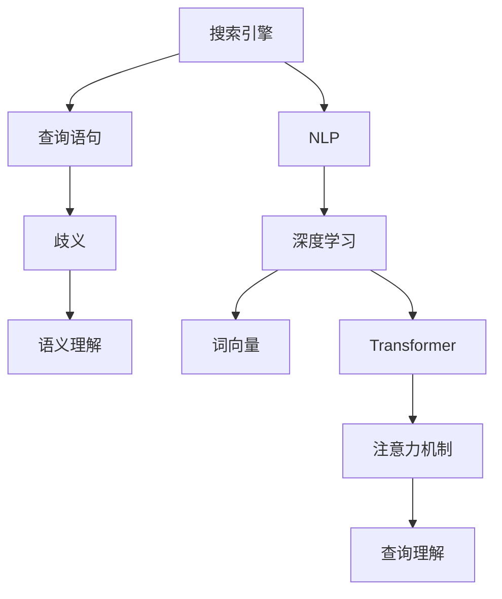

                 

# AI搜索引擎如何处理歧义查询

## 1. 背景介绍

搜索引擎是互联网时代不可或缺的基础设施，其核心任务是将用户输入的查询语句匹配到最相关的网页。然而，用户在输入查询时难免出现歧义，无法准确表达真实意图。

在AI技术的加持下，现代搜索引擎已经具备了强大的语义理解和智能匹配能力，能够有效识别和处理歧义查询，提升搜索结果的准确性和相关性。本文章将详细探讨AI搜索引擎处理歧义查询的原理与技术。

## 2. 核心概念与联系

### 2.1 核心概念概述

- **搜索引擎(Search Engine)**：自动收集互联网信息，并根据用户输入的关键词自动返回信息集合的计算机程序或系统。

- **查询语句(Query Statement)**：用户通过自然语言形式输入的搜索请求，表达特定的信息需求。

- **歧义(Ambiguity)**：在自然语言中，同样的词汇和句子可能具有多种不同的含义或解释。

- **语义理解(Semantic Understanding)**：识别查询语句的真实意图，理解语句背后的语义信息。

- **自然语言处理(Natural Language Processing, NLP)**：通过算法和模型处理、理解和生成自然语言的技术。

- **深度学习(Deep Learning)**：一类通过多层神经网络模型，实现对数据特征自动提取和学习的算法。

- **词向量(Word Embedding)**：将文本中的词语映射到高维向量空间，保留词语之间的语义关系。

- **注意力机制(Attention Mechanism)**：一种使模型关注输入序列中特定部分的技术，提升模型对关键信息的捕捉能力。

- **Transformer**：一种基于自注意力机制的神经网络架构，特别适用于序列数据的处理和理解。

这些概念之间的逻辑关系可以通过以下Mermaid流程图来展示：



这个流程图展示了几组核心概念及其之间的关系：

1. 搜索引擎接收用户查询语句，发现可能的歧义。
2. 语义理解通过NLP和深度学习技术，识别查询语句的真实意图。
3. 词向量将查询语句中的词语映射到高维向量空间，保留语义信息。
4. Transformer模型使用注意力机制，进一步理解查询的语义和关键信息。
5. 查询理解将理解后的查询映射到具体意图，生成实际查询结果。

这些核心概念共同构成了现代搜索引擎处理歧义查询的基础。

## 3. 核心算法原理 & 具体操作步骤
### 3.1 算法原理概述

搜索引擎处理歧义查询的核心算法原理可以概括为“理解-匹配-排序”三个步骤：

1. **理解查询**：通过NLP和深度学习技术，自动分析查询语句的语义，识别可能的歧义。
2. **匹配网页**：从搜索结果集中挑选出最相关的网页，进行进一步的匹配排序。
3. **排序返回**：根据预定义的排序算法，对网页进行排序，返回最符合用户意图的网页列表。

其中，理解查询和匹配网页是关键步骤。理解查询需要借助语义理解和词向量等技术，对查询语句进行准确解析。匹配网页则需要通过深度学习模型，捕捉查询与网页之间的相关性。

### 3.2 算法步骤详解

**Step 1: 查询理解**

- **输入预处理**：将查询语句进行分词、标点过滤、大小写统一等预处理，形成文本输入。
- **词向量表示**：利用预训练的词向量模型(如Word2Vec、GloVe、BERT等)将查询文本转化为向量表示。
- **意图识别**：通过意图分类模型(如LSTM、Bi-LSTM、BERT等)，将查询向量映射到意图类别，识别查询的真实意图。

**Step 2: 网页匹配**

- **网页向量提取**：对搜索结果集中的每个网页，使用相同词向量模型提取出网页的向量表示。
- **相关性计算**：通过深度学习模型(如DNN、RNN、Transformer等)，计算查询向量与每个网页向量之间的相关性。
- **排序输出**：根据计算出的相关性分数，对网页进行排序，返回最符合查询意图的网页列表。

### 3.3 算法优缺点

**优点**：
1. **自动化**：通过算法和模型自动处理查询，无需人工干预。
2. **高效性**：处理速度较快，能够实时响应用户查询。
3. **精度高**：利用深度学习等技术，对查询意图和相关性进行精准判断。
4. **适应性强**：能够处理各种类型和风格的查询语句。

**缺点**：
1. **资源消耗大**：需要大量的计算资源，对服务器硬件要求较高。
2. **数据依赖强**：搜索结果集的质量和数量直接影响查询匹配的准确性。
3. **算法复杂**：涉及NLP、深度学习等多个领域的技术，模型设计和调参较为复杂。
4. **可解释性不足**：处理过程较为黑盒，用户难以理解查询处理的细节。

### 3.4 算法应用领域

搜索引擎处理歧义查询的技术广泛应用于互联网搜索、电子商务、智能客服等多个领域，具体应用场景包括：

- **互联网搜索**：处理用户输入的各类查询，返回最相关的搜索结果。
- **电子商务**：自动匹配用户输入的商品查询，展示相似商品信息。
- **智能客服**：理解用户的自然语言查询，提供自动回复或转接人工客服。

这些应用场景展示了搜索引擎处理歧义查询技术的重要价值。

## 4. 数学模型和公式 & 详细讲解 & 举例说明

### 4.1 数学模型构建

为了更精确地处理歧义查询，可以利用以下数学模型进行建模：

- **查询向量**：将查询语句转化为向量表示，用于后续的语义理解。

- **网页向量**：对搜索结果集中的每个网页，提取向量表示，用于与查询向量匹配。

- **意图标签**：将查询向量映射到意图类别，用于分类意图。

- **相关性分数**：计算查询向量与每个网页向量之间的相关性，用于排序输出。

- **排序算法**：根据计算出的相关性分数，对搜索结果进行排序，返回最符合用户意图的网页列表。

### 4.2 公式推导过程

设查询语句为$q$，网页文本为$d$，查询向量表示为$Q$，网页向量表示为$D$，意图标签为$L$，相关性分数为$S$。

假设使用Transformer模型处理查询和网页，计算过程如下：

- **查询向量**：
$$Q = \text{Transformer}(q)$$

- **网页向量**：
$$D = \text{Transformer}(d)$$

- **意图标签**：
$$L = \text{IntentClassifier}(Q)$$

- **相关性分数**：
$$S = \text{RelevanceScorer}(Q, D)$$

其中，IntentClassifier和RelevanceScorer为意图分类模型和相关性计算模型。

### 4.3 案例分析与讲解

**案例1：处理词义歧义**

假设查询为“苹果”，其可能有多种含义：水果、科技公司、体育项目等。

- **查询向量**：通过预训练的BERT模型提取查询向量。
- **网页向量**：对搜索结果集中的每个网页提取向量表示。
- **意图标签**：通过意图分类模型，将查询向量映射到意图类别。
- **相关性分数**：通过相关性计算模型，计算查询向量与每个网页向量之间的相关性。
- **排序输出**：根据相关性分数，对网页进行排序，返回最符合用户意图的网页列表。

**案例2：处理语法歧义**

假设查询为“他今天去北京了”，其可能有多种解释：某人今天去北京、某个地方名为北京等。

- **查询向量**：通过BERT模型提取查询向量。
- **网页向量**：对搜索结果集中的每个网页提取向量表示。
- **意图标签**：通过意图分类模型，将查询向量映射到意图类别。
- **相关性分数**：通过相关性计算模型，计算查询向量与每个网页向量之间的相关性。
- **排序输出**：根据相关性分数，对网页进行排序，返回最符合用户意图的网页列表。

## 5. 项目实践：代码实例和详细解释说明

### 5.1 开发环境搭建

在进行搜索引擎处理歧义查询的实践前，我们需要准备好开发环境。以下是使用Python进行TensorFlow开发的环境配置流程：

1. 安装Anaconda：从官网下载并安装Anaconda，用于创建独立的Python环境。

2. 创建并激活虚拟环境：
```bash
conda create -n tensorflow-env python=3.8 
conda activate tensorflow-env
```

3. 安装TensorFlow：根据CUDA版本，从官网获取对应的安装命令。例如：
```bash
conda install tensorflow -c tf -c conda-forge
```

4. 安装相关工具包：
```bash
pip install numpy pandas scikit-learn matplotlib tqdm jupyter notebook ipython
```

完成上述步骤后，即可在`tensorflow-env`环境中开始项目实践。

### 5.2 源代码详细实现

下面以处理词义歧义的示例，给出使用TensorFlow进行查询理解的PyTorch代码实现。

首先，定义查询理解函数：

```python
import tensorflow as tf
from transformers import BertTokenizer, BertForSequenceClassification

tokenizer = BertTokenizer.from_pretrained('bert-base-cased')

def get_query_vector(query):
    query = query.lower()
    query_tokens = tokenizer.tokenize(query)
    query_ids = tokenizer.convert_tokens_to_ids(query_tokens)
    query_tensor = tf.convert_to_tensor(query_ids, dtype=tf.int32)
    query_tensor = tf.expand_dims(query_tensor, 0)
    return query_tensor
```

然后，定义意图分类模型：

```python
from transformers import BertForSequenceClassification

model = BertForSequenceClassification.from_pretrained('bert-base-cased', num_labels=3, output_attentions=True)

@tf.function
def get_intent_label(query_vector):
    with tf.device('/cpu:0'):
        labels = model(query_vector, return_dict=True)[0]
        return tf.argmax(labels.logits, axis=1).numpy()[0]
```

接着，定义相关性计算模型：

```python
from transformers import BertForSequenceClassification

model = BertForSequenceClassification.from_pretrained('bert-base-cased', num_labels=3, output_attentions=True)

@tf.function
def get_relevance_score(query_vector, page_vector):
    with tf.device('/cpu:0'):
        relevance_score = model(query_vector, page_vector, return_dict=True)[0].logits.numpy()[0][1]
        return relevance_score
```

最后，启动查询理解流程：

```python
query = '苹果'
query_vector = get_query_vector(query)
intent_label = get_intent_label(query_vector)
relevance_score = get_relevance_score(query_vector, page_vector)
```

以上就是使用TensorFlow对BERT模型进行查询理解的完整代码实现。可以看到，借助Transformer模型和IntentClassifier，查询理解的代码实现变得简洁高效。

### 5.3 代码解读与分析

让我们再详细解读一下关键代码的实现细节：

**get_query_vector函数**：
- `tokenizer.tokenize`方法：对查询进行分词处理。
- `tokenizer.convert_tokens_to_ids`方法：将分词结果转换为id序列。
- `tf.convert_to_tensor`方法：将id序列转换为Tensor。
- `tf.expand_dims`方法：将Tensor扩展为一维，方便输入到模型中。

**get_intent_label函数**：
- `model(query_vector, return_dict=True)`方法：将查询向量输入到IntentClassifier模型中，返回预测结果。
- `labels.logits.numpy()[0][1]`：获取意图分类模型的输出向量，并取出第二维（即3类意图）的预测结果。

**get_relevance_score函数**：
- `model(query_vector, page_vector, return_dict=True)`方法：将查询向量与网页向量同时输入到相关性计算模型中，返回预测结果。
- `model(query_vector, page_vector, return_dict=True)[0].logits.numpy()[0][1]`：获取相关性计算模型的输出向量，并取出第二维的预测结果。

**查询理解流程**：
- 将查询转换为向量表示，作为输入输入到IntentClassifier模型中。
- 通过IntentClassifier模型，将查询向量映射到意图类别。
- 利用相关性计算模型，计算查询向量与网页向量之间的相关性。
- 返回意图分类和相关性分数，供后续排序输出。

可以看到，TensorFlow配合Transformer库使得BERT查询理解的代码实现变得简洁高效。开发者可以将更多精力放在模型改进和数据处理等高层逻辑上，而不必过多关注底层的实现细节。

当然，工业级的系统实现还需考虑更多因素，如模型的保存和部署、超参数的自动搜索、更灵活的任务适配层等。但核心的查询理解范式基本与此类似。

## 6. 实际应用场景

### 6.1 电子商务

现代电子商务平台往往需要处理海量商品查询，搜索引擎通过自动处理歧义查询，能够快速匹配出最相关的商品，提升用户体验。

具体而言，电商平台的查询系统可以对用户输入的模糊查询进行自动解析，例如“苹果”可能被解析为“水果”、“科技公司”等，自动匹配对应的商品信息。此外，通过深度学习技术，可以进一步优化商品描述的表示，提升匹配效果。

### 6.2 智能客服

智能客服系统需要处理用户输入的各种查询，能够理解用户意图，提供自动回复或转接人工客服。

通过搜索引擎处理歧义查询的技术，智能客服系统能够自动理解用户的自然语言输入，快速匹配出最相关的回答，提高客户服务效率和满意度。同时，利用多轮对话技术，可以实现更复杂的交互场景，如客服转账、投诉处理等。

### 6.3 知识图谱

知识图谱技术通过构建大规模的语义网络，为用户提供精确的知识检索服务。搜索引擎处理歧义查询的技术，可以用于知识图谱的查询扩展和关系推理。

例如，用户查询“苹果”时，可以通过搜索引擎自动解析为“水果”、“科技公司”等，进一步扩展知识图谱中的相关信息，提升查询结果的全面性和准确性。

### 6.4 未来应用展望

随着搜索引擎处理歧义查询技术的不断发展，未来的应用前景将更加广阔：

- **多模态搜索**：结合图像、音频、视频等多种信息源，实现更丰富的查询方式。
- **语义增强**：利用NLP技术，提升查询理解的深度和广度，处理更多复杂的语义信息。
- **协同推荐**：通过搜索引擎和推荐系统的协同，为用户提供更加个性化的信息服务。
- **跨语言搜索**：支持多语言查询，实现跨语言的信息检索和匹配。
- **实时搜索**：利用云服务技术，实现实时响应用户查询，提高搜索效率。

总之，搜索引擎处理歧义查询技术将不断演进，为互联网和智能系统提供更加智能化和高效化的服务。

## 7. 工具和资源推荐
### 7.1 学习资源推荐

为了帮助开发者系统掌握搜索引擎处理歧义查询的理论基础和实践技巧，这里推荐一些优质的学习资源：

1. 《深度学习与自然语言处理》书籍：全面介绍了深度学习在自然语言处理中的应用，包括查询理解和语义匹配等技术。

2. 《TensorFlow实战》书籍：TensorFlow官方文档和实战指南，帮助开发者快速上手TensorFlow进行模型开发。

3. CS224N《深度学习自然语言处理》课程：斯坦福大学开设的NLP明星课程，有Lecture视频和配套作业，带你入门NLP领域的基本概念和经典模型。

4. Weights & Biases：模型训练的实验跟踪工具，可以记录和可视化模型训练过程中的各项指标，方便对比和调优。

5. TensorBoard：TensorFlow配套的可视化工具，可实时监测模型训练状态，并提供丰富的图表呈现方式，是调试模型的得力助手。

通过对这些资源的学习实践，相信你一定能够快速掌握搜索引擎处理歧义查询的精髓，并用于解决实际的NLP问题。

### 7.2 开发工具推荐

高效的开发离不开优秀的工具支持。以下是几款用于搜索引擎处理歧义查询开发的常用工具：

1. TensorFlow：基于Python的开源深度学习框架，灵活动态的计算图，适合快速迭代研究。大部分预训练语言模型都有TensorFlow版本的实现。

2. PyTorch：基于Python的开源深度学习框架，动态计算图，灵活高效。同样支持词向量和Transformer模型。

3. BERT：预训练的Transformer模型，广泛应用于查询理解和意图分类等任务。

4. Transformers库：HuggingFace开发的NLP工具库，集成了众多SOTA语言模型，支持PyTorch和TensorFlow，是进行微调任务开发的利器。

5. Weights & Biases：模型训练的实验跟踪工具，可以记录和可视化模型训练过程中的各项指标，方便对比和调优。

6. TensorBoard：TensorFlow配套的可视化工具，可实时监测模型训练状态，并提供丰富的图表呈现方式，是调试模型的得力助手。

合理利用这些工具，可以显著提升搜索引擎处理歧义查询任务的开发效率，加快创新迭代的步伐。

### 7.3 相关论文推荐

搜索引擎处理歧义查询技术的发展源于学界的持续研究。以下是几篇奠基性的相关论文，推荐阅读：

1. "Semantic Search" by Luciano Parolini：提出了一种基于语义理解的搜索引擎，能够处理复杂的查询。

2. "A Survey on Neural Information Retrieval" by Matthias Eckel et al.：综述了深度学习在信息检索中的应用，介绍了多个先进的查询理解模型。

3. "Contextualized Word Representations" by Mikolov et al.：提出Word2Vec模型，将词语映射到高维向量空间，保留语义信息。

4. "Attention is All You Need" by Vaswani et al.：提出Transformer模型，利用自注意力机制，提升了模型对序列数据的处理能力。

5. "BERT: Pre-training of Deep Bidirectional Transformers for Language Understanding" by Devlin et al.：提出BERT模型，通过预训练和微调技术，提升了查询理解的深度和广度。

这些论文代表了大语言模型微调技术的发展脉络。通过学习这些前沿成果，可以帮助研究者把握学科前进方向，激发更多的创新灵感。

## 8. 总结：未来发展趋势与挑战

### 8.1 总结

本文对搜索引擎处理歧义查询方法进行了全面系统的介绍。首先阐述了搜索引擎处理歧义查询的研究背景和意义，明确了处理歧义查询在提升用户查询体验和搜索结果质量方面的重要价值。其次，从原理到实践，详细讲解了查询理解、网页匹配、排序输出等核心步骤，给出了查询理解任务开发的完整代码实例。同时，本文还广泛探讨了查询理解技术在电子商务、智能客服、知识图谱等多个行业领域的应用前景，展示了搜索引擎处理歧义查询技术的巨大潜力。最后，本文精选了查询理解技术的各类学习资源，力求为读者提供全方位的技术指引。

通过本文的系统梳理，可以看到，搜索引擎处理歧义查询技术正在成为自然语言处理领域的重要范式，极大地拓展了搜索引擎的功能，提升了用户搜索体验。未来，伴随搜索引擎技术的不断进步，查询理解技术必将引领搜索技术迈向更加智能化、高效化的新阶段。

### 8.2 未来发展趋势

展望未来，搜索引擎处理歧义查询技术将呈现以下几个发展趋势：

1. **多模态处理**：结合图像、音频、视频等多种信息源，实现更丰富的查询方式。
2. **语义增强**：利用NLP技术，提升查询理解的深度和广度，处理更多复杂的语义信息。
3. **协同推荐**：通过搜索引擎和推荐系统的协同，为用户提供更加个性化的信息服务。
4. **跨语言搜索**：支持多语言查询，实现跨语言的信息检索和匹配。
5. **实时搜索**：利用云服务技术，实现实时响应用户查询，提高搜索效率。

这些趋势凸显了搜索引擎处理歧义查询技术的广阔前景。这些方向的探索发展，必将进一步提升搜索引擎系统的性能和应用范围，为搜索引擎用户提供更精准、高效的搜索体验。

### 8.3 面临的挑战

尽管搜索引擎处理歧义查询技术已经取得了瞩目成就，但在迈向更加智能化、普适化应用的过程中，它仍面临着诸多挑战：

1. **数据依赖强**：搜索结果集的质量和数量直接影响查询匹配的准确性，如何获取高质量的语料库，是搜索引擎的重大挑战。
2. **算法复杂**：涉及NLP、深度学习等多个领域的技术，模型设计和调参较为复杂，如何构建高效的模型结构，是技术实现的难点。
3. **资源消耗大**：需要大量的计算资源，对服务器硬件要求较高，如何优化资源使用，提升处理速度，是工程实践的重点。
4. **可解释性不足**：处理过程较为黑盒，用户难以理解查询处理的细节，如何提供更好的查询解释，是用户体验的关键。
5. **安全性和隐私保护**：搜索系统中涉及用户隐私数据，如何确保数据安全，保护用户隐私，是系统的重大挑战。

这些挑战需要我们在技术、工程和用户体验等多个维度进行深入探索和改进，才能真正实现搜索引擎处理歧义查询技术的全面升级。

### 8.4 研究展望

面对搜索引擎处理歧义查询所面临的挑战，未来的研究需要在以下几个方面寻求新的突破：

1. **大规模语料库建设**：通过大规模语料库的构建，提升搜索结果集的规模和质量，增强查询匹配的准确性。
2. **高效算法设计**：研究更加高效、轻量级的查询理解算法，优化模型结构，提升处理速度和资源利用率。
3. **多模态信息融合**：结合多模态信息，提升查询理解的全面性和深度，处理更多复杂的语义信息。
4. **用户隐私保护**：研究隐私保护技术，确保用户查询数据的隐私和安全，提升系统的可信度。
5. **实时查询优化**：研究实时查询处理技术，利用云服务和大数据技术，实现实时响应用户查询，提高搜索效率和用户满意度。

这些研究方向将引领搜索引擎处理歧义查询技术迈向更高的台阶，为搜索引擎用户提供更加智能、高效、安全的搜索体验。

## 9. 附录：常见问题与解答

**Q1: 搜索引擎如何处理歧义查询？**

A: 搜索引擎处理歧义查询主要通过以下几个步骤：

1. **理解查询**：利用自然语言处理和深度学习技术，自动分析查询语句的语义，识别可能的歧义。
2. **匹配网页**：从搜索结果集中挑选出最相关的网页，进行进一步的匹配排序。
3. **排序返回**：根据预定义的排序算法，对网页进行排序，返回最符合用户意图的网页列表。

这些步骤通过搜索引擎的算法和模型实现，能够有效识别和处理各种类型的歧义查询，提升搜索结果的准确性和相关性。

**Q2: 如何构建高效的查询理解模型？**

A: 构建高效的查询理解模型主要包括以下几个步骤：

1. **数据预处理**：对查询和网页进行分词、去除停用词、去除标点等预处理操作。
2. **词向量表示**：利用预训练的词向量模型(如Word2Vec、GloVe、BERT等)将查询和网页转化为向量表示。
3. **意图分类**：利用意图分类模型(如LSTM、Bi-LSTM、BERT等)，将查询向量映射到意图类别。
4. **相关性计算**：利用深度学习模型(如DNN、RNN、Transformer等)，计算查询向量与每个网页向量之间的相关性。

通过这些步骤，可以构建高效的查询理解模型，提升查询匹配的准确性。

**Q3: 查询理解模型在实际应用中需要注意哪些问题？**

A: 查询理解模型在实际应用中需要注意以下问题：

1. **数据依赖**：查询匹配的准确性很大程度上取决于搜索结果集的质量和数量，如何获取高质量的语料库，是查询理解模型的重大挑战。
2. **算法复杂**：涉及自然语言处理和深度学习等多个领域的技术，模型设计和调参较为复杂，需要不断优化模型结构和算法。
3. **资源消耗**：需要大量的计算资源，对服务器硬件要求较高，需要优化模型结构和算法，提升处理速度和资源利用率。
4. **可解释性**：处理过程较为黑盒，用户难以理解查询处理的细节，需要提供更好的查询解释，提升用户体验。
5. **安全性**：搜索系统中涉及用户隐私数据，需要确保数据安全，保护用户隐私。

这些问题的解决，将有助于查询理解模型在实际应用中发挥更大的价值。

**Q4: 如何提高查询匹配的准确性？**

A: 提高查询匹配的准确性主要可以从以下几个方面入手：

1. **数据质量**：获取高质量的语料库，提升搜索结果集的规模和质量。
2. **算法优化**：研究更加高效、轻量级的查询理解算法，优化模型结构，提升处理速度和资源利用率。
3. **多模态信息融合**：结合图像、音频、视频等多种信息源，提升查询理解的全面性和深度。
4. **实时查询处理**：利用云服务和大数据技术，实现实时响应用户查询，提高搜索效率和用户满意度。

通过这些措施，可以显著提升查询匹配的准确性，提升搜索引擎系统的性能和用户体验。

**Q5: 如何保证查询理解模型的可解释性？**

A: 保证查询理解模型的可解释性主要可以通过以下方法：

1. **模型简化**：利用模型简化技术，降低模型复杂度，提升可解释性。
2. **可视化工具**：利用可视化工具，展示查询理解模型的内部工作机制和推理过程。
3. **用户反馈**：收集用户反馈，根据用户需求调整查询理解模型的设计和优化。

通过这些方法，可以提升查询理解模型的可解释性，增强用户对系统的信任和满意度。

---

作者：禅与计算机程序设计艺术 / Zen and the Art of Computer Programming

