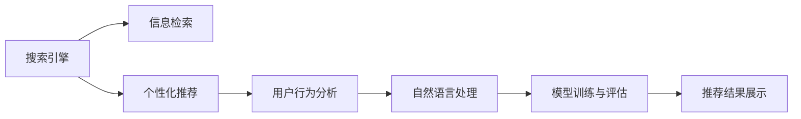

                 

# AI搜索引擎的个性化挑战

> 关键词：人工智能, 搜索引擎, 个性化推荐, 用户行为分析, 信息检索, 自然语言处理

## 1. 背景介绍

随着互联网的普及，搜索引擎已成为日常工作与生活中不可或缺的工具。如何让用户在海量信息中快速找到所需内容，成为搜索引擎算法优化的核心目标。尽管当前主流搜索引擎的召回和排序算法已非常成熟，但个性化推荐的缺失仍是一大短板。

搜索引擎在处理查询时，往往只能返回最相关的搜索结果，而忽略用户的具体需求和偏好。这种泛化的检索方式，难以满足用户的个性化需求。随着人工智能和大数据技术的发展，个性化推荐已成为搜索引擎迭代升级的重要方向。

个性化推荐可以大幅提升用户体验和满意度，帮助用户在有限的时间内找到最符合其兴趣和需求的信息，从而更高效地完成任务。本篇博客将深入探讨搜索引擎个性化推荐的技术挑战和实践方案，以期为未来的搜索引擎优化提供更多有益的参考。

## 2. 核心概念与联系

### 2.1 核心概念概述

- 搜索引擎：基于计算机技术和信息检索算法，从互联网海量信息中检索并展示相关网页的在线服务。
- 个性化推荐：利用机器学习、自然语言处理等技术，根据用户的历史行为、兴趣偏好，推荐最匹配的内容。
- 信息检索：在搜索结果中过滤和排序，提高搜索结果的相关性和满意度。
- 用户行为分析：通过跟踪和分析用户搜索行为、点击行为等，挖掘用户的兴趣模式和行为习惯。
- 自然语言处理：利用NLP技术，处理和理解用户查询的自然语言，提取关键字和语义信息。
- 模型训练与评估：采用监督学习、半监督学习等方法，基于标注数据训练推荐模型，并通过AUC、点击率等指标进行模型评估。

### 2.2 核心概念原理和架构的 Mermaid 流程图



这个流程图展示了搜索引擎的核心组件及其相互关系：

- 搜索引擎通过信息检索算法对用户查询进行处理，返回相关搜索结果。
- 个性化推荐系统基于用户行为分析和自然语言处理，通过模型训练与评估，对搜索结果进行二次筛选和排序。
- 最终推荐结果通过搜索引擎展示给用户，完成个性化推荐流程。

## 3. 核心算法原理 & 具体操作步骤
### 3.1 算法原理概述

个性化推荐算法可以分为两种：基于内容的推荐和基于协同过滤的推荐。

- **基于内容的推荐**：根据用户的历史行为和已喜欢的项目，利用内容特征相似性进行推荐。常见的方法包括TF-IDF、矩阵分解等。
- **基于协同过滤的推荐**：通过分析用户行为和项目特征，推测用户的潜在兴趣，推荐用户未交互但相似的项目。常见的方法包括用户-物品协同过滤、物品-物品协同过滤等。

无论基于哪种方法，个性化推荐的核心目标均是最大化用户满意度。推荐模型通过学习用户行为和兴趣，构建用户画像，从而在搜索结果中进行个性化排序和筛选。

### 3.2 算法步骤详解

**Step 1: 数据准备**

- 收集用户历史查询、点击、浏览行为等数据，构建用户行为数据集。
- 根据用户行为数据，构建用户兴趣模型和物品特征向量。

**Step 2: 模型训练**

- 采用监督学习、半监督学习等方法，训练个性化推荐模型。
- 根据用户兴趣模型和物品特征向量，计算相似度矩阵，进行推荐排序。

**Step 3: 推荐展示**

- 将排序后的推荐结果返回搜索引擎，展示给用户。
- 持续收集用户反馈，对模型进行迭代优化。

### 3.3 算法优缺点

**优点**：
- 个性化推荐可以大幅提升用户满意度，提高搜索引擎的使用率。
- 利用大规模数据进行模型训练，推荐结果更具普适性和代表性。
- 可以动态调整推荐策略，满足不同用户的个性化需求。

**缺点**：
- 模型训练和评估需要大量的标注数据，成本较高。
- 存在过拟合风险，尤其是当数据分布不均衡时。
- 推荐结果难以解释，用户难以理解推荐依据。

### 3.4 算法应用领域

个性化推荐算法在搜索引擎中主要应用于以下场景：

- 搜索结果排序：根据用户兴趣对搜索结果进行排序，提高点击率。
- 内容推荐系统：推荐与用户历史行为匹配的内容，如新闻、视频、商品等。
- 广告投放：推荐用户可能感兴趣的商品和广告，提升广告点击率和转化率。
- 搜索预测：在用户输入查询时，根据用户历史搜索记录，预测可能感兴趣的内容，提前展示。

## 4. 数学模型和公式 & 详细讲解

### 4.1 数学模型构建

个性化推荐模型的数学模型可以表示为：

$$
P(Y|X, \theta) = \frac{e^{\theta^T \phi(X) \cdot Y}}{\sum_{y \in Y} e^{\theta^T \phi(X) \cdot y}}
$$

其中：
- $X$ 为用户的查询、浏览、点击等行为数据。
- $Y$ 为推荐系统的输出，即推荐物品的标签或特征向量。
- $\theta$ 为模型参数，包括用户兴趣模型和物品特征向量。
- $\phi(X)$ 为特征映射函数，将用户行为数据映射为特征向量。

目标是最小化预测值与实际标签之间的损失函数，如交叉熵损失：

$$
\mathcal{L}(\theta) = -\frac{1}{N} \sum_{i=1}^N \sum_{y \in Y} y_i \log P(Y=y_i|X=x_i, \theta)
$$

### 4.2 公式推导过程

推导基于内容推荐模型的损失函数，假设用户行为数据为$X$，物品特征向量为$Y$，用户兴趣模型为$\theta$，特征映射函数为$\phi(X)$。

目标是最小化预测值与实际标签之间的交叉熵损失：

$$
\mathcal{L}(\theta) = -\frac{1}{N} \sum_{i=1}^N \sum_{y \in Y} y_i \log \frac{e^{\theta^T \phi(X) \cdot y}}{\sum_{y' \in Y} e^{\theta^T \phi(X) \cdot y'}}
$$

其中，$y_i$为第$i$个用户的实际点击行为，$\phi(X)$将用户行为数据映射为特征向量，$\theta$为模型参数。

将分子分母分离，并引入指数函数：

$$
\mathcal{L}(\theta) = -\frac{1}{N} \sum_{i=1}^N \log \sum_{y' \in Y} e^{(\theta^T \phi(X) - \log \sum_{y' \in Y} e^{\theta^T \phi(X)}) \cdot y'}
$$

化简得：

$$
\mathcal{L}(\theta) = -\frac{1}{N} \sum_{i=1}^N \log \hat{P}(Y=y_i|X=x_i, \theta)
$$

其中$\hat{P}$为模型预测的概率分布。

### 4.3 案例分析与讲解

以协同过滤算法为例，分析用户行为和物品特征如何构建相似度矩阵。

假设用户$u$和物品$i$的特征向量分别为$\vec{u}$和$\vec{v}$，则用户和物品之间的相似度可以表示为：

$$
sim(u, v) = \frac{\vec{u}^T \vec{v}}{\|\vec{u}\| \|\vec{v}\|}
$$

根据相似度计算推荐结果。对于用户$u$，根据其历史行为和相似用户的行为，推荐与其最相似的物品。具体步骤包括：

1. 构建用户-物品矩阵$R$，表示用户对物品的评分。
2. 使用奇异值分解(SVD)等方法，计算用户$u$和物品$i$的特征向量$\vec{u}$和$\vec{v}$。
3. 计算用户$u$和物品$i$之间的相似度$sim(u, v)$。
4. 根据相似度排序，推荐物品$i$给用户$u$。

## 5. 项目实践：代码实例和详细解释说明

### 5.1 开发环境搭建

为进行个性化推荐模型的开发，需要以下工具和环境：

- Python 3.7 及以上版本。
- Jupyter Notebook 或 PyCharm。
- Scikit-learn 用于机器学习模型训练和评估。
- Pandas 用于数据处理和分析。
- TensorFlow 或 PyTorch 用于模型实现。

在Python环境中，安装以上工具包：

```bash
pip install scikit-learn pandas tensorflow torch
```

### 5.2 源代码详细实现

以基于协同过滤的推荐算法为例，展示模型训练和推荐过程的代码实现。

首先，导入必要的库和数据集：

```python
import pandas as pd
import numpy as np
from sklearn.model_selection import train_test_split
import tensorflow as tf
from tensorflow.keras.layers import Input, Embedding, Dense, Dot
from tensorflow.keras.models import Model
from sklearn.metrics import mean_absolute_error

# 加载数据集
data = pd.read_csv('user_item_matrix.csv')
```

数据集包含用户ID、物品ID、用户评分等字段。使用Pandas对数据进行清洗和预处理：

```python
# 数据清洗和预处理
data['user_id'] = data['user_id'].astype(int)
data['item_id'] = data['item_id'].astype(int)
data['score'] = data['score'].astype(float)

# 划分训练集和测试集
train_data, test_data = train_test_split(data, test_size=0.2, random_state=42)

# 构建用户ID和物品ID的字典
user_dict = dict(data['user_id'].unique())
item_dict = dict(data['item_id'].unique())

# 构建训练数据和标签矩阵
train_user_ids = train_data['user_id'].unique()
train_item_ids = train_data['item_id'].unique()
train_labels = train_data['score'].values.reshape(-1, 1)

# 将用户ID和物品ID映射为独热编码
train_user_ids_encoded = np.zeros((len(train_user_ids), len(user_dict)))
train_user_ids_encoded[np.arange(len(train_user_ids)), train_user_ids] = 1
train_item_ids_encoded = np.zeros((len(train_item_ids), len(item_dict)))
train_item_ids_encoded[np.arange(len(train_item_ids)), train_item_ids] = 1
```

然后，构建协同过滤模型的编码器部分：

```python
# 构建用户ID和物品ID的嵌入层
user_embeddings = Embedding(len(user_dict), 100, input_length=1)(train_user_ids_encoded)
item_embeddings = Embedding(len(item_dict), 100, input_length=1)(train_item_ids_encoded)

# 构建点积层
dot_product = Dot(axes=2)([user_embeddings, item_embeddings])

# 构建解码器部分
dense_layer = Dense(1, activation='sigmoid')
predictions = dense_layer(dot_product)

# 构建完整模型
model = Model(inputs=[train_user_ids_encoded, train_item_ids_encoded], outputs=predictions)

# 编译模型
model.compile(optimizer='adam', loss='binary_crossentropy', metrics=['accuracy'])

# 训练模型
history = model.fit([train_user_ids_encoded, train_item_ids_encoded], train_labels, epochs=10, batch_size=128, validation_split=0.2)
```

最后，进行模型评估和推荐：

```python
# 评估模型
test_user_ids_encoded = test_data['user_id'].unique().reshape(-1, 1)
test_item_ids_encoded = test_data['item_id'].unique().reshape(-1, 1)
test_labels = test_data['score'].values.reshape(-1, 1)
mse = model.evaluate([test_user_ids_encoded, test_item_ids_encoded], test_labels, batch_size=128)
mae = mean_absolute_error(test_labels, model.predict([test_user_ids_encoded, test_item_ids_encoded]))

print(f'Mean Absolute Error: {mae:.3f}')

# 推荐
test_user_ids_encoded = test_data['user_id'].unique().reshape(-1, 1)
test_item_ids_encoded = test_data['item_id'].unique().reshape(-1, 1)
recommendations = model.predict([test_user_ids_encoded, test_item_ids_encoded])
```

### 5.3 代码解读与分析

代码实现了基于协同过滤的推荐算法，分为数据预处理、模型训练和推荐预测三个步骤：

1. 数据预处理：将用户ID和物品ID映射为独热编码，构建用户ID和物品ID的嵌入层，计算点积层，并构建解码器。
2. 模型训练：使用Adam优化器编译模型，进行训练和验证，生成训练误差和验证误差的历史记录。
3. 推荐预测：使用模型对测试集进行预测，并根据预测结果进行推荐。

代码中使用的TensorFlow库提供了高效的模型构建和训练工具，可以方便地进行神经网络模型的实现。

## 6. 实际应用场景

### 6.1 电商推荐系统

电商推荐系统是搜索引擎个性化推荐的重要应用场景之一。电商平台通过用户浏览、点击、购买等行为，构建用户画像，推荐相关商品，提升用户转化率和复购率。

在电商推荐系统中，用户行为数据可以包括浏览记录、购物车记录、评价记录等。通过协同过滤算法和基于内容的推荐算法，系统可以实时推送用户可能感兴趣的商品，优化用户体验，提升销售额。

### 6.2 内容推荐平台

内容推荐平台如Netflix、YouTube等，利用个性化推荐提升用户粘性和满意度。这些平台通过用户观看历史、评分记录等数据，推荐可能感兴趣的内容，如电影、电视剧、综艺节目等。

在内容推荐平台中，利用协同过滤算法和协同过滤推荐算法，系统可以实时推送用户可能感兴趣的内容，增强平台的粘性和用户满意度。

### 6.3 广告投放系统

广告投放系统利用个性化推荐，提升广告点击率和转化率。通过用户行为数据，系统可以推荐可能感兴趣的商品广告，优化广告投放效果。

在广告投放系统中，利用协同过滤算法和基于内容的推荐算法，系统可以精准推荐广告给用户，提升广告投放的转化率，优化广告主投放效果。

## 7. 工具和资源推荐

### 7.1 学习资源推荐

1. 《推荐系统实践》书籍：详细介绍了推荐系统的原理、算法和应用，涵盖了基于内容推荐和协同过滤推荐等多种方法。
2. 《Python 推荐系统实战》在线课程：介绍推荐系统的构建和优化，结合真实案例，深入讲解推荐算法的实现。
3. 《深度学习推荐系统》论文：介绍了深度学习在推荐系统中的应用，包括模型训练、模型评估和推荐优化等内容。
4. Kaggle推荐系统竞赛：通过实际比赛，学习推荐系统的构建和优化，提升推荐算法实践能力。
5. Google AI论文：深度学习推荐系统的最新进展和研究，涵盖推荐系统的新算法和新模型。

### 7.2 开发工具推荐

1. Jupyter Notebook：简单易用的Python环境，支持实时交互和代码执行。
2. PyCharm：功能强大的Python开发工具，支持多种框架和库，提供代码调试和测试功能。
3. TensorFlow：由Google开发的深度学习框架，支持大规模模型训练和分布式计算。
4. Scikit-learn：Python数据科学库，提供多种机器学习算法和模型评估工具。
5. Pandas：Python数据分析库，支持数据清洗和预处理，方便数据科学工作。

### 7.3 相关论文推荐

1. "Collaborative Filtering for Implicit Feedback Datasets"（Wang & Zhang, 2006）：详细介绍了协同过滤算法的原理和应用。
2. "A Survey on Learning to Rank"（Jiang et al., 2016）：综述了推荐系统的排序算法和评估指标。
3. "Improved User-Item Similarity Measures"（Chen et al., 2016）：讨论了用户-物品相似性计算的多种方法。
4. "Hybrid Recommendation Approaches"（Zhao et al., 2010）：讨论了混合推荐算法的设计和优化。
5. "On the Existence of Soft-Thresholded Matrix Factorization Solutions"（Koren et al., 2009）：分析了矩阵分解在推荐系统中的应用。

## 8. 总结：未来发展趋势与挑战

### 8.1 研究成果总结

近年来，基于协同过滤和基于内容的推荐算法在搜索引擎中得到了广泛应用，取得了显著的效果。推荐系统已经成为搜索引擎的核心功能之一，提升了用户体验和满意度。

### 8.2 未来发展趋势

未来的推荐系统将继续向着智能化、个性化、实时的方向发展：

1. 深度学习的应用：深度学习技术能够更好地处理复杂的数据结构和模式，提升推荐系统的精度和效果。
2. 个性化推荐：利用用户画像和兴趣模型，实现更加精准的推荐。
3. 实时推荐：利用流式数据处理技术，实现实时推荐，提升用户体验。
4. 多模态数据融合：利用用户的多模态数据（如语音、图像、位置等），提升推荐系统的准确性和灵活性。
5. 社会化推荐：利用社交网络数据，引入社会化推荐，提升推荐系统的多样性和普及性。

### 8.3 面临的挑战

尽管推荐系统取得了不少进展，但在实际应用中仍面临诸多挑战：

1. 数据稀疏性：用户数据往往非常稀疏，难以构建精确的推荐模型。
2. 冷启动问题：新用户或新物品缺乏足够的数据，无法有效进行推荐。
3. 算力需求高：深度学习推荐系统需要大量的计算资源，对硬件要求较高。
4. 隐私保护：在推荐系统中，用户行为数据涉及隐私问题，需要妥善处理和保护。
5. 安全风险：推荐系统可能被攻击者利用，进行恶意推荐，需要加强安全防护。

### 8.4 研究展望

未来的研究应在以下几个方向上继续深入：

1. 多模态推荐算法：利用用户的多模态数据，提升推荐系统的综合效果。
2. 稀疏数据处理：利用深度学习等技术，处理和优化稀疏数据，提升推荐精度。
3. 冷启动优化：开发冷启动推荐算法，提升新用户和新物品的推荐效果。
4. 隐私保护：设计隐私友好的推荐算法，保护用户隐私和数据安全。
5. 安全防护：加强推荐系统的安全性，防止恶意攻击和恶意推荐。

## 9. 附录：常见问题与解答

### Q1: 什么是协同过滤推荐算法？

A: 协同过滤推荐算法是一种基于用户行为数据的推荐方法，通过分析用户之间的相似性，推荐与用户最相似的物品。该算法可以分为用户-物品协同过滤和物品-物品协同过滤两种。

### Q2: 协同过滤算法和基于内容的推荐算法有何区别？

A: 协同过滤算法和基于内容的推荐算法是两种常用的推荐算法，主要区别在于数据来源和推荐方式：

- 协同过滤算法：利用用户之间的相似性，推荐用户可能感兴趣的物品。数据来源于用户行为数据（如点击、评分等）。
- 基于内容的推荐算法：利用物品的特征信息，推荐用户可能感兴趣的物品。数据来源于物品特征（如标签、属性等）。

### Q3: 如何处理冷启动问题？

A: 冷启动问题是指新用户或新物品缺乏足够数据，无法进行有效推荐。解决方法包括：

- 利用用户历史数据进行扩展，增加新用户的数据量。
- 利用用户相似性进行推荐，将新用户推荐给与新用户相似的用户。
- 利用物品相似性进行推荐，将新物品推荐给与新物品相似的物品。
- 利用多模态数据，利用图像、语音等数据提升推荐效果。

### Q4: 推荐系统的实时推荐和批量推荐有何区别？

A: 实时推荐和批量推荐是推荐系统的两种主要方式，主要区别在于数据处理和响应速度：

- 实时推荐：利用流式数据处理技术，对实时数据进行推荐，快速响应用户需求。需要高效的算法和硬件支持。
- 批量推荐：对历史数据进行批量处理，生成推荐结果，间隔较长时间再推送给用户。算法复杂度较低，硬件需求较低。

### Q5: 推荐系统在实际应用中需要注意哪些安全问题？

A: 推荐系统在实际应用中，需要注意以下安全问题：

- 数据隐私保护：避免泄露用户隐私数据，合理处理和存储用户数据。
- 模型安全性：防止恶意攻击者通过推荐系统进行恶意推荐，损害用户利益。
- 数据真实性：确保推荐系统获取的数据真实可信，避免虚假数据的干扰。

---

作者：禅与计算机程序设计艺术 / Zen and the Art of Computer Programming

