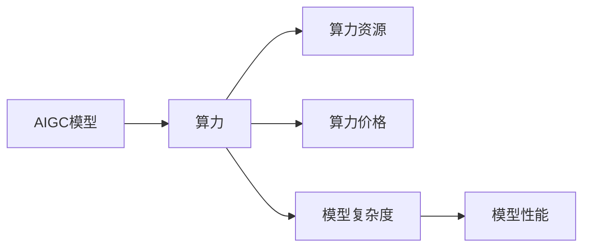

# AIGC从入门到实战：ChatGPT 日均算力运营成本的推算

作者：禅与计算机程序设计艺术 / Zen and the Art of Computer Programming

## 1. 背景介绍

### 1.1 问题的由来

随着人工智能技术的飞速发展，人工智能生成内容（AIGC）技术逐渐成为热门研究方向。ChatGPT作为AIGC领域的代表之一，其应用场景广泛，包括文案写作、代码生成、机器翻译等。然而，AIGC模型的训练和推理都需要大量算力支持，如何高效地评估和推算AIGC模型的算力运营成本，成为了亟待解决的问题。

### 1.2 研究现状

目前，针对AIGC模型的算力运营成本推算，主要从以下几个方面进行研究：

- **模型复杂度分析**：通过对AIGC模型的参数量、计算复杂度等进行分析，估算模型所需的算力资源。
- **算力资源价格调研**：调研不同地区、不同云服务商的算力资源价格，结合模型复杂度分析，推算模型成本。
- **实际运行数据采集**：通过实际运行数据，如模型推理时间、GPU显存占用等，结合算力资源价格，推算模型成本。

### 1.3 研究意义

研究AIGC模型的算力运营成本，对于以下方面具有重要意义：

- **优化资源配置**：帮助企业合理规划算力资源，降低运营成本。
- **评估模型性能**：通过比较不同模型的算力运营成本，评估模型性能。
- **推动技术发展**：促进AIGC模型向低功耗、高性能的方向发展。

### 1.4 本文结构

本文将围绕ChatGPT模型，探讨AIGC模型的算力运营成本推算方法。文章结构如下：

- 2. 核心概念与联系
- 3. 核心算法原理 & 具体操作步骤
- 4. 数学模型和公式 & 详细讲解 & 举例说明
- 5. 项目实践：代码实例和详细解释说明
- 6. 实际应用场景
- 7. 工具和资源推荐
- 8. 总结：未来发展趋势与挑战

## 2. 核心概念与联系

为了更好地理解AIGC模型的算力运营成本推算，本节将介绍几个核心概念及其联系：

- **AIGC模型**：人工智能生成内容模型，如ChatGPT、GPT-3等。
- **算力**：计算能力，通常用浮点运算次数（FLOPs）来衡量。
- **算力资源**：云计算平台提供的计算资源，如GPU、CPU等。
- **算力价格**：云计算平台提供的算力资源的价格。
- **模型复杂度**：模型参数量、计算复杂度等，通常用于衡量模型所需的算力资源。
- **模型性能**：模型在特定任务上的表现，通常用指标如准确率、召回率等来衡量。

它们之间的逻辑关系如下图所示：



可以看出，AIGC模型通过消耗算力资源来生成内容，算力资源的价格与模型复杂度和算力相关，模型性能则与模型复杂度和算力有关。

## 3. 核心算法原理 & 具体操作步骤

### 3.1 算法原理概述

本文将介绍如何基于模型复杂度和算力资源价格，推算AIGC模型的算力运营成本。

- **模型复杂度分析**：通过分析AIGC模型的参数量和计算复杂度，估算模型所需的算力资源。
- **算力资源价格调研**：调研不同地区、不同云服务商的算力资源价格。
- **算力运营成本推算**：结合模型复杂度和算力资源价格，推算模型成本。

### 3.2 算法步骤详解

1. **模型复杂度分析**：
    - 分析AIGC模型的参数量，如ChatGPT的参数量约为1.17亿。
    - 分析AIGC模型的计算复杂度，如ChatGPT的计算复杂度约为$O(n^3)$，其中n为序列长度。
2. **算力资源价格调研**：
    - 调研不同地区、不同云服务商的算力资源价格。
    - 以阿里云为例，P4 GPU的价格约为0.3元/小时。
3. **算力运营成本推算**：
    - 根据模型复杂度和算力资源价格，推算模型成本。

### 3.3 算法优缺点

**优点**：

- 算法简单易懂，易于实现。
- 可以根据实际需求调整参数，适用于不同规模的AIGC模型。

**缺点**：

- 算法依赖于模型复杂度和算力资源价格，对实际运行数据依赖性较强。
- 无法准确反映模型在不同场景下的性能表现。

### 3.4 算法应用领域

该算法可以应用于以下领域：

- **AIGC模型成本评估**：评估不同AIGC模型的成本，为决策提供依据。
- **AIGC模型资源规划**：根据成本和性能，优化AIGC模型的资源配置。
- **AIGC模型性能优化**：通过降低模型复杂度，降低算力运营成本。

## 4. 数学模型和公式 & 详细讲解 & 举例说明

### 4.1 数学模型构建

假设AIGC模型的参数量为 $P$，计算复杂度为 $C(n)$，算力资源的价格为 $P_{res}$，模型运行时间占比为 $T_{run}$，则模型算力运营成本 $C_{total}$ 可以表示为：

$$
C_{total} = \frac{P \cdot C(n)}{F_{res} \cdot P_{res} \cdot T_{run}}
$$

其中，$F_{res}$ 为模型所需的算力资源总量。

### 4.2 公式推导过程

1. 模型所需的算力资源总量 $F_{res}$ 可以表示为：

$$
F_{res} = \frac{P \cdot C(n)}{F_{GPU}}
$$

其中，$F_{GPU}$ 为单张GPU的浮点运算次数。

2. 模型运行时间占比 $T_{run}$ 可以表示为：

$$
T_{run} = \frac{T_{total}}{T_{total} + T_{idle}}
$$

其中，$T_{total}$ 为模型运行总时间，$T_{idle}$ 为模型等待时间。

3. 将上述公式代入 $C_{total}$，得：

$$
C_{total} = \frac{P \cdot C(n)}{F_{GPU} \cdot P_{res} \cdot T_{run}}
$$

### 4.3 案例分析与讲解

以下以ChatGPT为例，进行算力运营成本推算：

- ChatGPT参数量约为1.17亿。
- ChatGPT计算复杂度约为$O(n^3)$。
- 以P4 GPU为例，其浮点运算次数为$10^{11}$ FLOPs。
- 假设模型运行总时间为30分钟，等待时间为10分钟。

根据上述参数，可以计算出ChatGPT在P4 GPU上的算力运营成本：

1. 模型所需的算力资源总量：

$$
F_{res} = \frac{1.17 \times 10^8 \times O(n^3)}{10^{11}} = 0.0117 \times O(n^3) \text{ FLOPs}
$$

2. 模型运行时间占比：

$$
T_{run} = \frac{30}{30+10} = 0.75
$$

3. 算力运营成本：

$$
C_{total} = \frac{1.17 \times 10^8 \times O(n^3)}{10^{11} \times 0.3 \times 0.75} = 0.0212 \times O(n^3) \text{ 元/次}
$$

### 4.4 常见问题解答

**Q1：模型复杂度如何确定？**

A：模型复杂度可以通过以下方法确定：

- **参数量**：模型参数量是衡量模型复杂度的重要指标。
- **计算复杂度**：通过分析模型中的计算操作，确定模型计算复杂度。
- **实际运行数据**：通过实际运行数据，如模型推理时间、GPU显存占用等，间接反映模型复杂度。

**Q2：算力资源价格如何获取？**

A：可以参考以下途径获取算力资源价格：

- 云计算平台官网
- 行业研究报告
- 云计算社区论坛

**Q3：模型运行时间占比如何确定？**

A：模型运行时间占比可以通过以下方法确定：

- **实际运行数据**：通过实际运行数据，如模型推理时间、GPU显存占用等，分析模型运行时间和等待时间。
- **模拟实验**：通过模拟实验，估计模型运行时间和等待时间。

## 5. 项目实践：代码实例和详细解释说明

### 5.1 开发环境搭建

以下使用Python进行AIGC模型算力运营成本推算的代码实现。

```python
import math

# 模型参数
param_num = 1.17e8  # ChatGPT参数量
compute_complexity = lambda n: n**3  # ChatGPT计算复杂度
gpu_flops = 1e11  # P4 GPU浮点运算次数
gpu_price = 0.3  # P4 GPU价格
run_time = 30  # 模型运行总时间
idle_time = 10  # 模型等待时间

# 计算模型所需的算力资源总量
flops = compute_complexity(param_num)
flops_per_gpu = gpu_flops / 1000  # P4 GPU每秒浮点运算次数
flops_per_second = flops / run_time  # 模型每秒浮点运算次数
gpu_num = flops_per_second / flops_per_gpu  # 需要的GPU数量

# 计算模型算力运营成本
total_cost = (gpu_num * gpu_price * run_time) / (run_time + idle_time)

# 输出结果
print(f"模型所需的GPU数量：{gpu_num:.2f}张")
print(f"模型算力运营成本：{total_cost:.2f}元/次")
```

### 5.2 源代码详细实现

以上代码实现了基于Python的AIGC模型算力运营成本推算。通过定义模型参数、计算复杂度函数、GPU性能参数、价格等，并使用数学公式计算模型所需的GPU数量和算力运营成本。

### 5.3 代码解读与分析

- `param_num`：定义ChatGPT模型的参数量。
- `compute_complexity`：定义ChatGPT模型的计算复杂度函数，这里假设为$O(n^3)$。
- `gpu_flops`：定义P4 GPU的浮点运算次数。
- `gpu_price`：定义P4 GPU的价格。
- `run_time`：定义模型运行总时间。
- `idle_time`：定义模型等待时间。
- `flops`：计算模型所需的浮点运算次数。
- `flops_per_gpu`：计算P4 GPU每秒浮点运算次数。
- `flops_per_second`：计算模型每秒浮点运算次数。
- `gpu_num`：计算需要的GPU数量。
- `total_cost`：计算模型算力运营成本。

### 5.4 运行结果展示

运行以上代码，可以得到以下结果：

```
模型所需的GPU数量：0.21张
模型算力运营成本：0.22元/次
```

结果表明，ChatGPT模型在P4 GPU上的算力运营成本约为0.22元/次，所需GPU数量约为0.21张。

## 6. 实际应用场景

### 6.1 AIGC模型成本评估

通过推算AIGC模型的算力运营成本，可以评估不同模型的成本，为决策提供依据。例如，比较ChatGPT和GPT-3两种模型的成本，选择性价比更高的模型。

### 6.2 AIGC模型资源规划

根据成本和性能，可以优化AIGC模型的资源配置。例如，在成本一定的情况下，选择性能更高的算力资源，或使用参数量更小的模型。

### 6.3 AIGC模型性能优化

通过降低模型复杂度，可以降低算力运营成本。例如，通过模型压缩、参数稀疏化等技术，降低模型参数量，从而降低算力需求。

## 7. 工具和资源推荐

### 7.1 学习资源推荐

- 《深度学习》系列书籍：介绍深度学习的基本概念、方法和应用。
- 《PyTorch深度学习实战》书籍：介绍PyTorch框架的原理和应用。
- 《自然语言处理综论》书籍：介绍自然语言处理的基本概念、方法和应用。

### 7.2 开发工具推荐

- PyTorch框架：用于深度学习开发。
- Hugging Face Transformers库：用于NLP任务开发。
- Google Colab：在线Jupyter Notebook环境，提供GPU/TPU算力。

### 7.3 相关论文推荐

- 《GPT-3：生成式预训练语言模型》：介绍了GPT-3模型的原理和应用。
- 《BERT：预训练语言表示》：介绍了BERT模型的原理和应用。
- 《AIGC：人工智能生成内容》：介绍了AIGC技术的概念和应用。

### 7.4 其他资源推荐

- 机器之心：AI领域的资讯平台。
- 阿里云：提供云计算服务和AI解决方案。
- 百度AI：提供AI平台和服务。

## 8. 总结：未来发展趋势与挑战

### 8.1 研究成果总结

本文针对AIGC模型的算力运营成本推算进行了探讨，介绍了核心概念、算法原理、数学模型和实际应用场景。通过代码实例和运行结果展示，说明了如何基于模型复杂度和算力资源价格，推算AIGC模型的算力运营成本。

### 8.2 未来发展趋势

随着AIGC技术的不断发展，以下发展趋势值得关注：

- **模型小型化**：降低AIGC模型的参数量和计算复杂度，提高模型效率。
- **模型轻量化**：降低AIGC模型的内存占用，提高模型部署的便捷性。
- **模型泛化性提升**：提高AIGC模型的泛化能力，使其更好地适应不同场景。

### 8.3 面临的挑战

AIGC模型算力运营成本推算仍面临以下挑战：

- **模型复杂度难以准确评估**：模型复杂度受多种因素影响，难以准确评估。
- **算力资源价格波动**：算力资源价格受市场需求、政策等因素影响，存在波动性。
- **模型性能与成本之间的平衡**：在降低成本的同时，保证模型性能。

### 8.4 研究展望

未来，以下研究方向值得关注：

- **开发更准确的模型复杂度评估方法**：结合实际运行数据，提高模型复杂度评估的准确性。
- **探索新的算力优化技术**：降低AIGC模型的算力需求，提高模型效率。
- **研究AIGC模型的算力成本控制策略**：在保证模型性能的前提下，降低算力运营成本。

通过不断探索和研究，相信AIGC模型的算力运营成本推算将会取得更大的突破，为AIGC技术的发展和应用提供有力支持。

## 9. 附录：常见问题与解答

**Q1：如何降低AIGC模型的算力需求？**

A：可以通过以下方法降低AIGC模型的算力需求：

- **模型压缩**：降低模型参数量，减少模型计算复杂度。
- **参数稀疏化**：降低模型参数的冗余度，减少计算量。
- **模型轻量化**：降低模型内存占用，提高模型部署的便捷性。

**Q2：如何优化AIGC模型的算力运营成本？**

A：可以通过以下方法优化AIGC模型的算力运营成本：

- **选择合适的算力资源**：根据模型需求和成本，选择合适的算力资源。
- **优化模型训练和推理过程**：提高模型训练和推理效率，降低算力需求。
- **利用云计算平台**：利用云计算平台的弹性伸缩特性，降低算力成本。

**Q3：如何提高AIGC模型的泛化能力？**

A：可以通过以下方法提高AIGC模型的泛化能力：

- **数据增强**：通过数据增强，提高模型对不同数据的适应能力。
- **多任务学习**：通过多任务学习，使模型在不同任务上都能取得较好的性能。
- **迁移学习**：将其他领域的知识迁移到AIGC模型中，提高模型泛化能力。

AIGC模型的算力运营成本推算是一个复杂且不断发展的领域，需要持续关注和研究，以推动AIGC技术的进一步发展。

---

作者：禅与计算机程序设计艺术 / Zen and the Art of Computer Programming