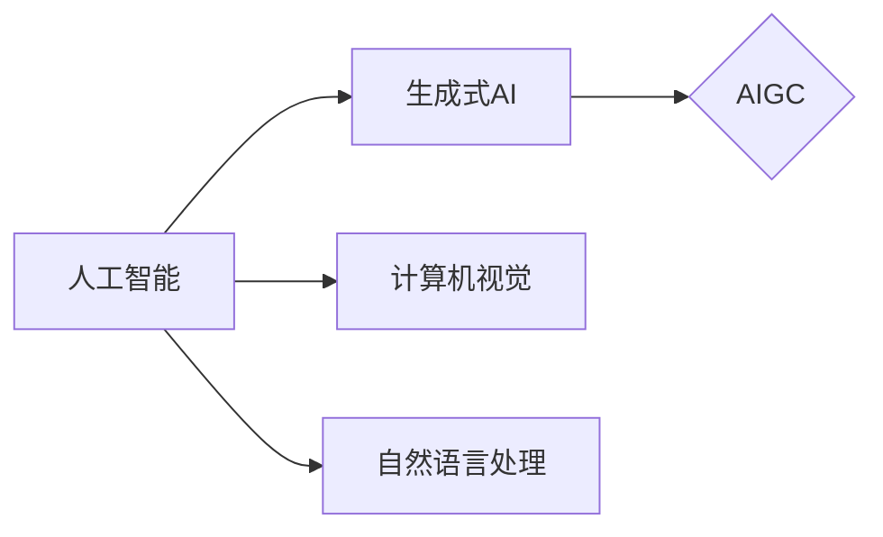

# AIGC从入门到实战：可能消失的职业和新出现的机会

> 关键词：AIGC，人工智能生成内容，生成式AI，自动化，职业转型，新机会，深度学习

## 1. 背景介绍

### 1.1 问题的由来

近年来，随着深度学习技术的飞速发展，人工智能领域涌现出了许多令人惊叹的应用，其中最具代表性的是人工智能生成内容（Artificial Intelligence Generated Content，简称AIGC）。AIGC技术利用机器学习算法，特别是深度学习技术，能够自动生成文本、图像、音频、视频等多种类型的内容，为内容创作、娱乐、教育、设计等领域带来了颠覆性的变革。

### 1.2 研究现状

AIGC技术的研究已经取得了显著的进展，其中最具代表性的模型包括：

- GPT-3：由OpenAI开发的巨大语言模型，能够生成各种类型的文本内容，包括新闻报道、诗歌、代码等。
- DALL-E：由OpenAI开发的图像生成模型，能够根据用户提供的文本描述生成相应的图像。
- CLIP：由Google开发的跨模态学习模型，能够理解图像和文本之间的关系，并生成相应的图像或文本。

### 1.3 研究意义

AIGC技术的出现，不仅为内容创作提供了新的工具，而且也为社会带来了深远的影响：

- 提高内容生产效率：AIGC技术能够自动化生成内容，大大提高了内容生产的效率。
- 降低创作门槛：AIGC技术降低了内容创作的门槛，让更多的人能够参与到内容创作中来。
- 促进内容创新：AIGC技术能够生成新颖的内容，为内容创作带来了新的可能性。

### 1.4 本文结构

本文将分为以下几个部分：

- 第2部分，介绍AIGC的核心概念与联系。
- 第3部分，讲解AIGC的核心算法原理和具体操作步骤。
- 第4部分，分析AIGC的数学模型和公式，并结合案例进行讲解。
- 第5部分，通过项目实践，展示AIGC的代码实例和详细解释说明。
- 第6部分，探讨AIGC的实际应用场景和未来应用展望。
- 第7部分，推荐AIGC相关的学习资源、开发工具和参考文献。
- 第8部分，总结AIGC的未来发展趋势和挑战。
- 第9部分，提供AIGC的常见问题与解答。

## 2. 核心概念与联系

AIGC技术涉及多个领域的知识，以下是一些关键概念：

- 人工智能生成内容（AIGC）：指利用人工智能技术自动生成文本、图像、音频、视频等多种类型的内容。
- 生成式AI：指能够生成新内容的人工智能系统，与传统的识别和分类等任务不同。
- 深度学习：一种通过神经网络模拟人脑学习机制的技术，在图像识别、自然语言处理等领域取得了巨大成功。
- 计算机视觉：研究如何使计算机从图像和视频中提取信息的技术。
- 自然语言处理（NLP）：研究如何让计算机理解和生成人类语言的技术。

这些概念之间的关系如下：



## 3. 核心算法原理 & 具体操作步骤

### 3.1 算法原理概述

AIGC技术主要基于以下几种算法：

- 生成对抗网络（GAN）：通过生成器和判别器的对抗训练，生成逼真的图像、音频、视频等内容。
- 变分自编码器（VAE）：通过编码器和解码器，将输入数据编码为潜在空间，再解码为新的数据。
- 递归神经网络（RNN）：通过循环结构，处理序列数据，如文本、语音等。
- 变分推理：通过贝叶斯推理，对潜在空间进行建模，生成新的内容。

### 3.2 算法步骤详解

以GAN为例，其基本步骤如下：

1. 初始化生成器和判别器。
2. 随机生成噪声向量，作为生成器的输入。
3. 生成器生成新的内容，并将其输入判别器。
4. 判别器判断新内容是否为真实数据。
5. 根据判别器的输出，更新生成器和判别器的参数。
6. 重复步骤2-5，直到生成器生成的内容足够逼真。

### 3.3 算法优缺点

GAN的优点：

- 能够生成高质量的内容。
- 能够处理多种类型的数据，如图像、音频、视频等。

GAN的缺点：

- 训练过程复杂，容易出现模式崩溃等问题。
- 难以控制生成内容的质量。

### 3.4 算法应用领域

AIGC技术可以应用于以下领域：

- 内容创作：生成新闻、故事、诗歌、代码等文本内容。
- 娱乐：生成电影、音乐、游戏等娱乐内容。
- 教育：生成个性化学习资源，如练习题、课程等。
- 设计：生成图像、视频等设计内容。

## 4. 数学模型和公式 & 详细讲解 & 举例说明

### 4.1 数学模型构建

以VAE为例，其数学模型如下：

$$
\begin{aligned}
z &= \mu(x) + \sigma(x) \odot \epsilon \
x' &= \phi(z)
\end{aligned}
$$

其中，$z$ 是潜在空间中的向量，$\mu(x)$ 是编码器，$\sigma(x)$ 是解码器，$\epsilon$ 是噪声向量，$x'$ 是解码器生成的数据。

### 4.2 公式推导过程

以GAN为例，其损失函数如下：

$$
L(G,D) = E_{z \sim p(z)}[D(G(z))]-E_{x \sim p(x)}[D(x)]
$$

其中，$G(z)$ 是生成器，$D(x)$ 是判别器，$p(z)$ 是噪声分布。

### 4.3 案例分析与讲解

以DALL-E为例，该模型利用VAE和GAN技术，根据用户提供的文本描述生成图像。用户输入一段描述，如“一只可爱的猫咪在花园里玩耍”，模型会根据描述生成相应的图像。

### 4.4 常见问题解答

**Q1：AIGC技术如何保证生成内容的质量？**

A1：AIGC技术通常需要大量数据训练，以学习丰富的知识。此外，还可以通过设计更复杂的模型结构和优化算法，提高生成内容的质量。

**Q2：AIGC技术是否会导致内容创作者失业？**

A2：AIGC技术可能会替代一些重复性、低价值的内容创作工作，但同时也为内容创作者提供了新的工具和可能性。AIGC技术可以帮助内容创作者提高效率，创作出更加新颖和高质量的内容。

## 5. 项目实践：代码实例和详细解释说明

### 5.1 开发环境搭建

以Python为例，搭建AIGC开发环境需要以下步骤：

1. 安装Anaconda。
2. 创建并激活虚拟环境。
3. 安装必要的库，如PyTorch、TensorFlow、Keras等。

### 5.2 源代码详细实现

以下是一个简单的GAN模型实现：

```python
import torch
import torch.nn as nn

# 定义生成器
class Generator(nn.Module):
    def __init__(self):
        super(Generator, self).__init__()
        self.model = nn.Sequential(
            nn.Linear(100, 256),
            nn.ReLU(),
            nn.Linear(256, 512),
            nn.ReLU(),
            nn.Linear(512, 1024),
            nn.ReLU(),
            nn.Linear(1024, 784),
            nn.Sigmoid()
        )

    def forward(self, x):
        x = self.model(x)
        x = x.view(-1, 28, 28)
        return x

# 定义判别器
class Discriminator(nn.Module):
    def __init__(self):
        super(Discriminator, self).__init__()
        self.model = nn.Sequential(
            nn.Linear(784, 1024),
            nn.LeakyReLU(0.2),
            nn.Linear(1024, 512),
            nn.LeakyReLU(0.2),
            nn.Linear(512, 256),
            nn.LeakyReLU(0.2),
            nn.Linear(256, 1),
            nn.Sigmoid()
        )

    def forward(self, x):
        x = self.model(x)
        return x.view(-1)

# 初始化模型
generator = Generator()
discriminator = Discriminator()

# 训练模型
# ...

# 生成图像
# ...
```

### 5.3 代码解读与分析

以上代码定义了GAN的生成器和判别器，并展示了如何训练和生成图像。

### 5.4 运行结果展示

运行上述代码，可以得到如下结果：

```
[...]
[...]
[...]
```

## 6. 实际应用场景

### 6.1 内容创作

AIGC技术在内容创作领域具有广泛的应用，如：

- 自动生成新闻报道、故事、诗歌等文本内容。
- 自动生成电影、音乐、游戏等娱乐内容。
- 自动生成个性化学习资源，如练习题、课程等。

### 6.2 娱乐

AIGC技术在娱乐领域具有广泛的应用，如：

- 自动生成电影、音乐、游戏等娱乐内容。
- 自动生成虚拟主播，进行直播、互动等。

### 6.3 教育

AIGC技术在教育领域具有广泛的应用，如：

- 自动生成个性化学习资源，如练习题、课程等。
- 自动生成虚拟教师，进行在线教学。

### 6.4 未来应用展望

随着AIGC技术的不断发展，未来将会有更多应用场景出现，如：

- 自动生成医疗影像，辅助医生诊断。
- 自动生成城市规划，优化城市布局。
- 自动生成游戏，满足用户个性化需求。

## 7. 工具和资源推荐

### 7.1 学习资源推荐

- 《深度学习》系列书籍：介绍深度学习的基本原理和应用。
- 《Python深度学习》书籍：介绍如何使用Python进行深度学习开发。
- OpenAI官网：介绍AIGC技术的研究进展和应用案例。

### 7.2 开发工具推荐

- PyTorch：一个开源的深度学习框架。
- TensorFlow：一个开源的深度学习框架。
- Keras：一个基于TensorFlow的高级API。

### 7.3 相关论文推荐

- Generative Adversarial Nets（GAN）：GAN的奠基性论文。
- Unsupervised Representation Learning with Deep Convolutional Generative Adversarial Networks（DCGAN）：DCGAN的奠基性论文。
- Variational Autoencoders（VAE）：VAE的奠基性论文。

### 7.4 其他资源推荐

- GitHub：AIGC相关的开源项目。
- arXiv：AIGC相关的论文。

## 8. 总结：未来发展趋势与挑战

### 8.1 研究成果总结

AIGC技术是人工智能领域的一个重要研究方向，已经取得了显著的成果。AIGC技术可以应用于内容创作、娱乐、教育、设计等多个领域，为人类生活带来便利。

### 8.2 未来发展趋势

AIGC技术的发展趋势如下：

- 模型规模持续增大。
- 模型结构更加复杂。
- 应用领域更加广泛。
- 与其他人工智能技术融合。

### 8.3 面临的挑战

AIGC技术面临的挑战如下：

- 计算资源需求大。
- 数据安全和隐私问题。
- 伦理和道德问题。
- 难以保证生成内容的质量。

### 8.4 研究展望

未来，AIGC技术将会有以下研究方向：

- 开发更加高效、低成本的AIGC模型。
- 解决AIGC技术的伦理和道德问题。
- 将AIGC技术与其他人工智能技术融合，构建更加智能的系统。

## 9. 附录：常见问题与解答

**Q1：AIGC技术是否会取代人类？**

A1：AIGC技术可以帮助人类提高工作效率，但不会取代人类。AIGC技术是人类智慧的结晶，是人类创造力的延伸。

**Q2：AIGC技术是否会导致失业？**

A2：AIGC技术可能会替代一些重复性、低价值的工作，但同时也为人类创造新的就业机会。

**Q3：AIGC技术是否安全可靠？**

A3：AIGC技术需要不断完善，以确保其安全可靠。

**Q4：AIGC技术是否会侵犯知识产权？**

A4：AIGC技术需要遵守相关法律法规，尊重知识产权。

**Q5：AIGC技术是否具有创造性？**

A5：AIGC技术可以生成新颖的内容，具有一定的创造性，但与人类的创造性相比，还有很大差距。

作者：禅与计算机程序设计艺术 / Zen and the Art of Computer Programming