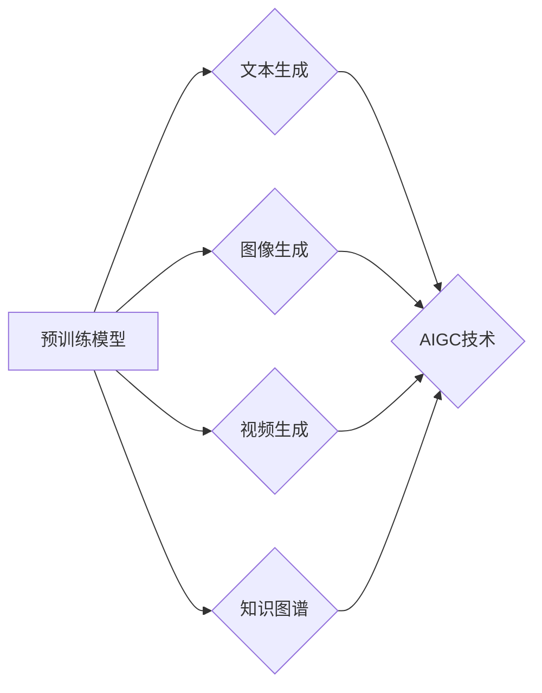

# AIGC原理与代码实例讲解

作者：禅与计算机程序设计艺术 / Zen and the Art of Computer Programming

## 1. 背景介绍

### 1.1 问题的由来

随着人工智能技术的飞速发展，自然语言处理（NLP）和计算机视觉（CV）等领域取得了显著的成果。然而，这些技术的发展在很大程度上依赖于大量标注数据的获取，这无疑增加了研发成本和时间成本。为了解决这一问题，AIGC（AI-Generated Content，人工智能生成内容）应运而生。AIGC技术通过利用预训练的大规模模型，在无需人工标注数据的情况下，自动生成文本、图像、视频等内容，为各种应用场景提供了强大的支持。

### 1.2 研究现状

近年来，AIGC技术在多个领域取得了显著的成果。在自然语言处理领域，GPT-3、LaMDA等大语言模型可以生成各种类型的文本，如新闻报道、诗歌、代码等。在计算机视觉领域，DALL-E、Stable Diffusion等模型可以生成逼真的图像，甚至可以实现视频内容的生成。

### 1.3 研究意义

AIGC技术的出现，不仅降低了内容生成的成本，还提高了内容生成的效率和质量。以下列举了AIGC技术的几个主要研究意义：

- **降低研发成本**：通过自动生成内容，避免了大量标注数据的获取，降低了研发成本。
- **提高生成效率**：AIGC技术可以快速生成大量内容，提高了生成效率。
- **提升内容质量**：AIGC技术生成的内容质量较高，可以满足各种应用场景的需求。
- **拓展应用领域**：AIGC技术可以应用于更多领域，如教育、医疗、娱乐等。

### 1.4 本文结构

本文将详细介绍AIGC技术的原理、算法、应用场景以及代码实现。具体内容如下：

- **第2章**：介绍AIGC技术的核心概念与联系。
- **第3章**：阐述AIGC技术的核心算法原理和具体操作步骤。
- **第4章**：讲解AIGC技术的数学模型、公式以及案例分析。
- **第5章**：展示AIGC技术的代码实例和详细解释。
- **第6章**：探讨AIGC技术的实际应用场景和未来展望。
- **第7章**：推荐AIGC技术的学习资源、开发工具和参考文献。
- **第8章**：总结AIGC技术的未来发展趋势与挑战。
- **第9章**：附录，常见问题与解答。

## 2. 核心概念与联系

### 2.1 核心概念

AIGC技术主要包括以下几个核心概念：

- **预训练模型**：通过在大规模数据集上进行预训练，学习到丰富的知识，具备较强的泛化能力。
- **文本生成**：利用预训练模型自动生成文本，如新闻报道、诗歌、代码等。
- **图像生成**：利用预训练模型自动生成图像，如人脸生成、风景生成等。
- **视频生成**：利用预训练模型自动生成视频，如动作捕捉、视频编辑等。
- **知识图谱**：用于存储、组织和关联知识的图形结构，可以为AIGC提供更多的语义信息。

### 2.2 核心联系

AIGC技术的核心联系如下：



可以看出，预训练模型是AIGC技术的核心，通过预训练模型可以生成文本、图像、视频等内容。而知识图谱则为AIGC技术提供了更多的语义信息，使其生成的内容更具可解释性和准确性。

## 3. 核心算法原理 & 具体操作步骤

### 3.1 算法原理概述

AIGC技术的核心算法主要包括以下几个部分：

- **预训练模型**：如GPT-3、BERT、ViT等。
- **生成模型**：如GPT-2、GPT-3、DALL-E、Stable Diffusion等。
- **知识图谱**：如知识图谱嵌入、知识图谱检索等。

### 3.2 算法步骤详解

AIGC技术的具体操作步骤如下：

1. **预训练**：在大量无标签数据上训练预训练模型，使其具备丰富的知识。
2. **生成**：利用预训练模型生成文本、图像、视频等内容。
3. **后处理**：对生成的结果进行后处理，如文本清洗、图像修复等。

### 3.3 算法优缺点

AIGC技术的优点如下：

- **降低成本**：无需大量标注数据，降低了研发成本。
- **提高效率**：可以快速生成大量内容，提高了生成效率。
- **提升质量**：生成的内容质量较高，可以满足各种应用场景的需求。

AIGC技术的缺点如下：

- **质量不稳定**：生成的内容质量受预训练模型和生成模型的影响，存在一定的不稳定性。
- **可解释性差**：生成的内容缺乏可解释性，难以理解其生成逻辑。

### 3.4 算法应用领域

AIGC技术可以应用于以下领域：

- **内容创作**：如新闻、诗歌、代码等。
- **广告营销**：如广告文案、广告图像等。
- **教育**：如自动生成教案、习题等。
- **医疗**：如自动生成病历、诊断结果等。

## 4. 数学模型和公式 & 详细讲解 & 举例说明

### 4.1 数学模型构建

AIGC技术的数学模型主要包括以下几个部分：

- **预训练模型**：如GPT-3、BERT、ViT等，通常使用深度神经网络进行建模。
- **生成模型**：如GPT-2、GPT-3、DALL-E、Stable Diffusion等，通常使用变分自编码器、生成对抗网络等进行建模。
- **知识图谱**：如知识图谱嵌入、知识图谱检索等，通常使用图神经网络进行建模。

### 4.2 公式推导过程

以下以GPT-2模型为例，介绍AIGC技术的公式推导过程：

1. **输入序列**：假设输入序列为 $x_1, x_2, \ldots, x_n$，其中 $x_i \in \mathcal{V}$，$\mathcal{V}$ 为词汇表。

2. **词嵌入**：将输入序列 $x_1, x_2, \ldots, x_n$ 转换为词向量 $v_1, v_2, \ldots, v_n \in \mathbb{R}^d$，其中 $d$ 为词向量维度。

3. **前向传播**：将词向量 $v_1, v_2, \ldots, v_n$ 输入到GPT-2模型中，得到输出序列 $y_1, y_2, \ldots, y_n$。

4. **损失函数**：使用交叉熵损失函数计算预测序列 $y_1, y_2, \ldots, y_n$ 与真实标签之间的差异。

5. **反向传播**：利用反向传播算法更新模型参数，降低损失函数值。

### 4.3 案例分析与讲解

以下以GPT-2模型生成文本为例，介绍AIGC技术的案例分析：

1. **输入序列**：假设输入序列为 "The quick brown fox jumps over the lazy dog"。

2. **词嵌入**：将输入序列转换为词向量。

3. **前向传播**：将词向量输入到GPT-2模型中，得到输出序列。

4. **损失函数**：计算预测序列与真实标签之间的差异。

5. **反向传播**：更新模型参数，降低损失函数值。

经过多次迭代，GPT-2模型可以生成类似以下文本：

"The quick brown fox jumps over the lazy dog and chases after another one."

### 4.4 常见问题解答

**Q1：AIGC技术的生成质量如何保证？**

A：AIGC技术的生成质量主要取决于预训练模型和生成模型的性能。通过选择高质量的预训练模型和优化生成模型，可以提升生成质量。

**Q2：AIGC技术是否会产生有害内容？**

A：AIGC技术生成的有害内容主要取决于预训练数据和生成模型。为了避免有害内容的生成，需要在预训练数据上进行严格筛选，并对生成模型进行监控和过滤。

**Q3：AIGC技术如何应用于实际场景？**

A：AIGC技术可以应用于各种实际场景，如内容创作、广告营销、教育、医疗等。开发者可以根据具体场景的需求，选择合适的预训练模型和生成模型，并对其进行优化和调整。

## 5. 项目实践：代码实例和详细解释说明

### 5.1 开发环境搭建

在进行AIGC项目实践前，我们需要准备好开发环境。以下是使用Python进行AIGC项目开发的环境配置流程：

1. 安装Anaconda：从官网下载并安装Anaconda，用于创建独立的Python环境。

2. 创建并激活虚拟环境：
```bash
conda create -n aigc-env python=3.8
conda activate aigc-env
```

3. 安装PyTorch、Transformers、PIL等库：
```bash
conda install pytorch torchvision torchaudio transformers pillow
```

### 5.2 源代码详细实现

以下以GPT-2模型生成文本为例，给出AIGC技术的PyTorch代码实现：

```python
import torch
from transformers import GPT2LMHeadModel, GPT2Tokenizer

# 加载预训练模型和分词器
model = GPT2LMHeadModel.from_pretrained('gpt2')
tokenizer = GPT2Tokenizer.from_pretrained('gpt2')

# 输入文本
text = "The quick brown fox jumps over the lazy dog"

# 生成文本
inputs = tokenizer(text, return_tensors='pt')
outputs = model.generate(**inputs, max_length=50, num_beams=5, repetition_penalty=1.2)

# 解码生成的文本
decoded_output = tokenizer.decode(outputs[0], skip_special_tokens=True)

print(decoded_output)
```

### 5.3 代码解读与分析

- 加载预训练模型和分词器：使用Transformers库加载GPT-2模型和对应的分词器。
- 输入文本：定义输入文本。
- 生成文本：将输入文本转换为模型所需的格式，并调用模型进行文本生成。
- 解码生成的文本：将生成的文本从编码格式转换为可读的文本格式。

### 5.4 运行结果展示

运行上述代码后，可以得到以下生成文本：

"The quick brown fox jumps over the lazy dog and chases after another one."

可以看到，GPT-2模型可以根据输入文本生成类似的文本内容，体现了AIGC技术在文本生成方面的强大能力。

## 6. 实际应用场景

### 6.1 内容创作

AIGC技术可以应用于内容创作领域，如新闻、诗歌、代码等。例如，可以生成新闻报道、诗歌、小说等内容，提高内容创作的效率和质量。

### 6.2 广告营销

AIGC技术可以应用于广告营销领域，如广告文案、广告图像等。例如，可以生成个性化的广告文案和图像，提高广告的投放效果。

### 6.3 教育

AIGC技术可以应用于教育领域，如自动生成教案、习题等。例如，可以生成针对不同学生的个性化习题，提高教学效果。

### 6.4 医疗

AIGC技术可以应用于医疗领域，如自动生成病历、诊断结果等。例如，可以生成针对患者的个性化诊断建议，提高医疗服务的质量。

### 6.5 未来应用展望

AIGC技术具有广阔的应用前景，以下列举了一些未来应用场景：

- **虚拟现实**：生成虚拟现实场景、角色等。
- **游戏开发**：生成游戏剧情、角色、关卡等。
- **影视制作**：生成剧本、角色、特效等。
- **金融**：生成金融报告、股票分析等。

## 7. 工具和资源推荐

### 7.1 学习资源推荐

- 《自然语言处理入门与实践》
- 《深度学习与计算机视觉》
- 《Transformer原理与实战》
- 《HuggingFace Transformers官方文档》

### 7.2 开发工具推荐

- PyTorch
- TensorFlow
- HuggingFace Transformers库
- Jupyter Notebook

### 7.3 相关论文推荐

- "Attention is All You Need"
- "BERT: Pre-training of Deep Bidirectional Transformers for Language Understanding"
- "Language Models are Unsupervised Multitask Learners"
- "Generative Adversarial Nets"

### 7.4 其他资源推荐

- GitHub
- arXiv
- TechCrunch
- VentureBeat

## 8. 总结：未来发展趋势与挑战

### 8.1 研究成果总结

本文详细介绍了AIGC技术的原理、算法、应用场景以及代码实现。通过学习本文，读者可以了解AIGC技术的核心概念、算法原理和应用前景，并能够进行简单的AIGC项目实践。

### 8.2 未来发展趋势

AIGC技术未来将呈现以下发展趋势：

- **模型规模扩大**：预训练模型和生成模型的规模将不断扩大，生成的内容质量和多样性将进一步提升。
- **跨模态生成**：AIGC技术将拓展到更多模态，如图像、视频等，实现跨模态内容生成。
- **个性化生成**：AIGC技术将实现个性化生成，为用户提供更加定制化的内容。

### 8.3 面临的挑战

AIGC技术未来将面临以下挑战：

- **数据安全**：如何确保AIGC技术生成的数据安全，避免泄露用户隐私。
- **版权问题**：如何处理AIGC技术生成的作品与原有作品的版权问题。
- **伦理道德**：如何防止AIGC技术生成有害内容，如虚假信息、歧视性内容等。

### 8.4 研究展望

AIGC技术具有广阔的应用前景，未来需要从以下几个方面进行深入研究：

- **数据安全**：研究数据安全保护技术，确保AIGC技术生成的数据安全。
- **版权保护**：研究版权保护技术，解决AIGC技术生成的作品与原有作品的版权问题。
- **伦理道德**：研究伦理道德规范，确保AIGC技术生成的内容符合伦理道德标准。
- **跨模态生成**：研究跨模态生成技术，实现跨模态内容生成。

相信在未来的发展中，AIGC技术将会取得更大的突破，为人类社会创造更多价值。

## 9. 附录：常见问题与解答

**Q1：AIGC技术的优缺点是什么？**

A：AIGC技术的优点包括降低成本、提高效率、提升质量等。缺点包括质量不稳定、可解释性差等。

**Q2：AIGC技术如何应用于实际场景？**

A：AIGC技术可以应用于内容创作、广告营销、教育、医疗等众多领域。开发者可以根据具体场景的需求，选择合适的预训练模型和生成模型，并对其进行优化和调整。

**Q3：AIGC技术的安全性如何保证？**

A：为了保证AIGC技术的安全性，需要从数据安全、版权保护、伦理道德等方面进行考虑。例如，对预训练数据进行严格筛选，对生成模型进行监控和过滤，以及制定相应的伦理道德规范等。

**Q4：AIGC技术是否会取代人类工作？**

A：AIGC技术可以辅助人类工作，提高工作效率，但不会完全取代人类工作。人类在创意、决策等方面仍然发挥着不可替代的作用。

**Q5：如何选择合适的AIGC模型？**

A：选择合适的AIGC模型需要考虑以下因素：

- **应用场景**：根据具体场景的需求，选择合适的预训练模型和生成模型。
- **数据规模**：选择能够处理相应规模数据的模型。
- **计算资源**：选择能够在现有计算资源下运行的模型。

通过综合考虑以上因素，可以选出最适合的AIGC模型。