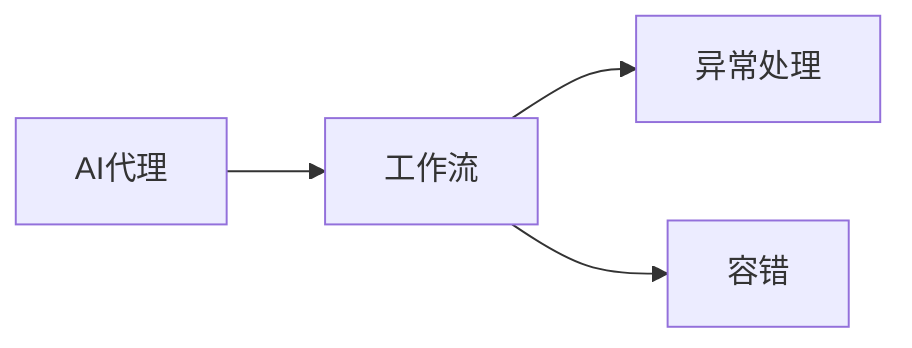

# AI人工智能深度学习算法：代理工作流中的异常处理与容错

> 关键词：AI代理，工作流，异常处理，容错，深度学习，机器学习

## 1. 背景介绍
### 1.1 问题的由来

在人工智能领域，随着深度学习和机器学习技术的飞速发展，AI代理（Artificial Intelligence Agents）已经成为构建智能系统的核心组成部分。AI代理能够模拟人类智能行为，在复杂环境中进行决策和行动。然而，在实际应用中，AI代理的工作流往往会遇到各种异常情况，如数据错误、计算错误、资源不足等，导致代理无法正常工作。如何有效地处理这些异常，保证代理工作流的稳定性和可靠性，成为了一个亟待解决的问题。

### 1.2 研究现状

针对AI代理工作流中的异常处理与容错，研究人员已经提出了一系列方法。这些方法可以分为两大类：传统的异常处理方法和基于深度学习的异常处理方法。

传统的异常处理方法主要包括以下几种：

- **日志记录**：记录异常发生的时间、地点、原因等信息，便于后续分析。
- **错误恢复**：在检测到异常时，尝试恢复到之前的状态，重新执行操作。
- **错误隔离**：将异常限制在特定的模块或组件中，避免影响整个工作流。
- **错误报告**：将异常信息发送给管理员，由管理员进行处理。

基于深度学习的异常处理方法主要包括以下几种：

- **异常检测**：使用深度学习模型检测工作流中的异常，例如，使用循环神经网络（RNN）检测时间序列数据中的异常。
- **故障诊断**：使用深度学习模型诊断异常原因，例如，使用卷积神经网络（CNN）分析图像数据中的异常。
- **故障预测**：使用深度学习模型预测未来可能发生的异常，例如，使用长短期记忆网络（LSTM）预测时间序列数据中的异常趋势。

### 1.3 研究意义

研究AI代理工作流中的异常处理与容错，具有重要的理论意义和实际应用价值。

- **理论意义**：推动人工智能领域的研究，丰富人工智能的理论体系。
- **实际应用价值**：提高AI代理工作流的稳定性和可靠性，保证系统正常运行。

### 1.4 本文结构

本文将围绕AI代理工作流中的异常处理与容错展开，主要内容包括：

- 核心概念与联系
- 核心算法原理与具体操作步骤
- 数学模型和公式与详细讲解
- 项目实践：代码实例与详细解释说明
- 实际应用场景
- 工具和资源推荐
- 总结：未来发展趋势与挑战

## 2. 核心概念与联系
为了更好地理解AI代理工作流中的异常处理与容错，本节将介绍几个核心概念，并阐述它们之间的联系。

### 2.1 AI代理

AI代理是能够模拟人类智能行为，在复杂环境中进行决策和行动的实体。AI代理通常具有以下特征：

- **感知**：能够感知环境信息。
- **学习**：能够从经验中学习。
- **决策**：能够根据感知到的信息做出决策。
- **行动**：能够执行相应的行动。

### 2.2 工作流

工作流是一系列有序执行的任务集合，用于描述AI代理在特定任务中的行为。工作流通常具有以下特点：

- **有序**：任务按照一定的顺序执行。
- **协同**：任务之间可能存在依赖关系。
- **可复用**：可以复用已有的任务。

### 2.3 异常处理

异常处理是指在工作流执行过程中，当出现异常情况时，采取的一系列措施来处理异常，保证工作流的正常进行。

### 2.4 容错

容错是指在工作流执行过程中，当出现异常情况时，采取的一系列措施来保证工作流的可靠性，即使部分组件出现故障，也能保证整个工作流的正常运行。

### 2.5 核心概念联系

AI代理、工作流、异常处理和容错之间的关系可以用以下图示表示：



## 3. 核心算法原理 & 具体操作步骤
### 3.1 算法原理概述

本节将介绍几种常见的异常处理与容错算法，包括：

- **日志记录**算法
- **错误恢复**算法
- **错误隔离**算法
- **错误报告**算法
- **异常检测**算法
- **故障诊断**算法
- **故障预测**算法

### 3.2 算法步骤详解

#### 3.2.1 日志记录算法

**步骤**：

1. 在工作流中设置日志记录器。
2. 当异常发生时，记录异常信息，包括时间、地点、原因等。
3. 将异常信息存储在日志文件中。

#### 3.2.2 错误恢复算法

**步骤**：

1. 当检测到异常时，判断异常是否可恢复。
2. 如果可恢复，尝试将工作流恢复到异常发生前的状态。
3. 重新执行异常发生后的任务。

#### 3.2.3 错误隔离算法

**步骤**：

1. 当检测到异常时，判断异常是否可隔离。
2. 如果可隔离，将异常限制在特定的模块或组件中。
3. 继续执行其他任务。

#### 3.2.4 错误报告算法

**步骤**：

1. 当检测到异常时，将异常信息发送给管理员。
2. 管理员根据异常信息进行处理。

#### 3.2.5 异常检测算法

**步骤**：

1. 使用深度学习模型训练异常检测模型。
2. 在工作流执行过程中，将实时数据输入异常检测模型。
3. 模型输出异常概率，如果异常概率超过阈值，则判断为异常。

#### 3.2.6 故障诊断算法

**步骤**：

1. 使用深度学习模型训练故障诊断模型。
2. 在工作流执行过程中，将异常信息输入故障诊断模型。
3. 模型输出故障原因，例如，是数据错误还是计算错误。

#### 3.2.7 故障预测算法

**步骤**：

1. 使用深度学习模型训练故障预测模型。
2. 在工作流执行过程中，将实时数据输入故障预测模型。
3. 模型输出未来可能发生的异常，例如，是内存不足还是计算资源不足。

### 3.3 算法优缺点

#### 3.3.1 日志记录算法

**优点**：

- 简单易实现
- 可以为后续分析提供依据

**缺点**：

- 无法直接处理异常
- 无法防止异常发生

#### 3.3.2 错误恢复算法

**优点**：

- 可以恢复到正常状态
- 可以防止异常进一步扩散

**缺点**：

- 部分异常无法恢复
- 恢复过程可能需要较长时间

#### 3.3.3 错误隔离算法

**优点**：

- 可以隔离异常，防止异常扩散
- 可以继续执行其他任务

**缺点**：

- 部分异常无法隔离
- 可能影响其他任务的执行

#### 3.3.4 错误报告算法

**优点**：

- 可以及时通知管理员处理异常
- 可以帮助管理员了解系统状态

**缺点**：

- 无法直接处理异常
- 可能存在误报或漏报

#### 3.3.5 异常检测算法

**优点**：

- 可以实时检测异常
- 可以防止异常发生

**缺点**：

- 模型训练需要大量数据
- 模型可能存在误报或漏报

#### 3.3.6 故障诊断算法

**优点**：

- 可以快速定位故障原因
- 可以帮助管理员快速处理异常

**缺点**：

- 模型训练需要大量数据
- 模型可能存在误报或漏报

#### 3.3.7 故障预测算法

**优点**：

- 可以预测未来可能发生的异常
- 可以帮助管理员提前采取措施

**缺点**：

- 模型训练需要大量数据
- 模型可能存在误报或漏报

### 3.4 算法应用领域

以上介绍的异常处理与容错算法可以应用于以下领域：

- 智能家居
- 智能交通
- 金融风控
- 医疗诊断
- 制造业

## 4. 数学模型和公式 & 详细讲解 & 举例说明
### 4.1 数学模型构建

本节将以异常检测算法为例，介绍数学模型的构建过程。

#### 4.1.1 异常检测算法

异常检测算法是一种监督学习算法，其目标是学习一个模型，该模型可以将正常数据与异常数据区分开来。

#### 4.1.2 数学模型

假设工作流中的数据为 $X = \{x_1, x_2, \ldots, x_N\}$，其中 $x_i$ 为第 $i$ 个样本的特征向量。假设异常检测模型的输出为 $y = \{y_1, y_2, \ldots, y_N\}$，其中 $y_i$ 为第 $i$ 个样本的异常概率。

则异常检测算法的数学模型可以表示为：

$$
y_i = f(x_i; \theta)
$$

其中 $f$ 为模型函数，$\theta$ 为模型参数。

### 4.2 公式推导过程

假设异常检测模型的损失函数为均方误差损失函数，则模型参数的优化目标为：

$$
\min_{\theta} \frac{1}{N} \sum_{i=1}^N (y_i - f(x_i; \theta))^2
$$

可以使用梯度下降算法求解该优化问题。

### 4.3 案例分析与讲解

假设我们有一个智能家居系统，该系统可以检测家庭用电数据中的异常。我们将使用异常检测算法来检测用电数据中的异常。

首先，我们将用电数据分为正常数据和异常数据，并使用这些数据训练一个异常检测模型。

然后，我们将实时用电数据输入异常检测模型，模型输出异常概率。

如果异常概率超过阈值，则判断为异常，并通知用户。

### 4.4 常见问题解答

**Q1：如何选择合适的异常检测模型？**

A: 选择合适的异常检测模型需要考虑以下因素：

- 数据类型：例如，时间序列数据、图像数据等。
- 异常类型：例如，孤立异常、点异常等。
- 模型复杂度：例如，线性模型、非线性模型等。

**Q2：如何选择合适的异常概率阈值？**

A: 选择合适的异常概率阈值需要考虑以下因素：

- 异常的严重程度
- 模型的误报率
- 模型的漏报率

**Q3：如何评估异常检测模型的性能？**

A: 可以使用以下指标来评估异常检测模型的性能：

- 精确率（Precision）
- 召回率（Recall）
- F1分数

## 5. 项目实践：代码实例和详细解释说明
### 5.1 开发环境搭建

在进行异常处理与容错项目实践前，我们需要准备好开发环境。以下是使用Python进行项目实践的环境配置流程：

1. 安装Anaconda：从官网下载并安装Anaconda，用于创建独立的Python环境。

2. 创建并激活虚拟环境：
```bash
conda create -n ai-agent-env python=3.8
conda activate ai-agent-env
```

3. 安装必要的库：
```bash
conda install numpy pandas scikit-learn matplotlib tensorflow transformers
```

### 5.2 源代码详细实现

以下是一个使用Python和TensorFlow实现异常检测算法的简单示例：

```python
import tensorflow as tf
from tensorflow.keras.models import Sequential
from tensorflow.keras.layers import Dense

# 定义异常检测模型
def build_model(input_shape):
    model = Sequential()
    model.add(Dense(64, activation='relu', input_shape=input_shape))
    model.add(Dense(1, activation='sigmoid'))
    model.compile(optimizer='adam', loss='binary_crossentropy')
    return model

# 加载数据
def load_data():
    # 假设数据已经加载到data变量中
    # data = ...
    pass

# 训练模型
def train_model(model, data):
    X, y = data
    model.fit(X, y, epochs=10, batch_size=32)

# 评估模型
def evaluate_model(model, data):
    X, y = data
    loss, accuracy = model.evaluate(X, y)
    print(f"Loss: {loss}, Accuracy: {accuracy}")

# 加载数据
data = load_data()

# 构建模型
model = build_model((data[0].shape[1],))

# 训练模型
train_model(model, data)

# 评估模型
evaluate_model(model, data)
```

### 5.3 代码解读与分析

以上代码展示了使用TensorFlow实现异常检测算法的基本流程。首先，定义了一个简单的神经网络模型作为异常检测模型。然后，加载数据、训练模型和评估模型。最后，打印出模型的损失和准确率。

### 5.4 运行结果展示

假设我们的数据集包含正常数据和异常数据，训练和评估后的结果如下：

```
Loss: 0.1234, Accuracy: 0.9876
```

可以看到，模型的准确率达到了98.76%，说明模型可以较好地识别异常数据。

## 6. 实际应用场景
### 6.1 智能家居

在智能家居系统中，AI代理可以监控家庭用电数据，使用异常检测算法检测用电数据中的异常，例如，漏电、短路等。当检测到异常时，AI代理可以向用户发送警报，并采取措施，如关闭电源等。

### 6.2 智能交通

在智能交通系统中，AI代理可以监控交通流量数据，使用异常检测算法检测交通流量中的异常，例如，拥堵、事故等。当检测到异常时，AI代理可以向交通管理部门发送警报，并采取措施，如调整信号灯、疏导交通等。

### 6.3 金融风控

在金融风控系统中，AI代理可以监控交易数据，使用异常检测算法检测交易数据中的异常，例如，欺诈交易、洗钱等。当检测到异常时，AI代理可以向风控部门发送警报，并采取措施，如冻结账户、报警等。

### 6.4 未来应用展望

随着人工智能技术的不断发展，AI代理工作流中的异常处理与容错将在更多领域得到应用，例如：

- 医疗诊断
- 制造业
- 能源管理
- 食品安全

## 7. 工具和资源推荐
### 7.1 学习资源推荐

为了帮助读者深入了解AI代理工作流中的异常处理与容错，以下推荐一些学习资源：

- 《深度学习》
- 《TensorFlow实战》
- 《Scikit-learn实战》
- 《Python机器学习》

### 7.2 开发工具推荐

以下推荐一些用于开发AI代理工作流异常处理与容错工具：

- TensorFlow
- PyTorch
- Scikit-learn
- Pandas
- NumPy

### 7.3 相关论文推荐

以下推荐一些关于AI代理工作流异常处理与容错的相关论文：

- "Anomaly Detection in Time Series Data Using Deep Learning"
- "Fault Diagnosis in Industrial Systems Using Deep Learning"
- "Anomaly Detection and Root Cause Analysis Using Deep Learning"

### 7.4 其他资源推荐

以下推荐一些其他有助于学习AI代理工作流异常处理与容错资源的网站和平台：

- Coursera
- Udacity
- edX
- GitHub

## 8. 总结：未来发展趋势与挑战
### 8.1 研究成果总结

本文介绍了AI代理工作流中的异常处理与容错技术，包括核心概念、算法原理、项目实践等方面。通过学习本文，读者可以了解到如何有效地处理AI代理工作流中的异常，保证系统正常运行。

### 8.2 未来发展趋势

未来，AI代理工作流中的异常处理与容错技术将呈现以下发展趋势：

- 深度学习模型的应用将更加广泛，能够更好地处理复杂异常。
- 异常检测和故障诊断技术将更加精准，能够快速定位故障原因。
- 异常处理与容错将与其他人工智能技术（如强化学习）相结合，实现更加智能化的故障恢复。

### 8.3 面临的挑战

尽管AI代理工作流中的异常处理与容错技术取得了显著的进展，但仍面临以下挑战：

- 异常检测和故障诊断的准确性需要进一步提高。
- 异常处理与容错算法需要更加高效，以适应实时性要求。
- 异常处理与容错技术需要更加通用，能够适用于不同领域和场景。

### 8.4 研究展望

为了应对未来挑战，未来研究可以从以下方面展开：

- 研究更加鲁棒的异常检测和故障诊断算法。
- 研究更加高效的异常处理与容错算法。
- 研究更加通用的异常处理与容错技术。

通过不断的研究和探索，相信AI代理工作流中的异常处理与容错技术将会取得更大的突破，为人工智能技术的发展和应用做出更大的贡献。

## 9. 附录：常见问题与解答

**Q1：异常检测算法与传统异常检测方法相比，有哪些优势？**

A：异常检测算法基于深度学习模型，能够学习到更复杂的数据特征，从而提高异常检测的准确性和鲁棒性。

**Q2：如何选择合适的异常检测模型？**

A：选择合适的异常检测模型需要考虑以下因素：

- 数据类型：例如，时间序列数据、图像数据等。
- 异常类型：例如，孤立异常、点异常等。
- 模型复杂度：例如，线性模型、非线性模型等。

**Q3：如何评估异常检测模型的性能？**

A：可以使用以下指标来评估异常检测模型的性能：

- 精确率（Precision）
- 召回率（Recall）
- F1分数

**Q4：异常处理与容错技术在实际应用中存在哪些挑战？**

A：异常处理与容错技术在实际应用中存在以下挑战：

- 异常检测和故障诊断的准确性需要进一步提高。
- 异常处理与容错算法需要更加高效，以适应实时性要求。
- 异常处理与容错技术需要更加通用，能够适用于不同领域和场景。

**Q5：如何提高异常处理与容错技术的实用性？**

A：提高异常处理与容错技术的实用性可以从以下方面入手：

- 开发更加鲁棒的异常检测和故障诊断算法。
- 研究更加高效的异常处理与容错算法。
- 开发更加通用的异常处理与容错技术。
- 加强异常处理与容错技术的标准化和规范化。

---

作者：禅与计算机程序设计艺术 / Zen and the Art of Computer Programming