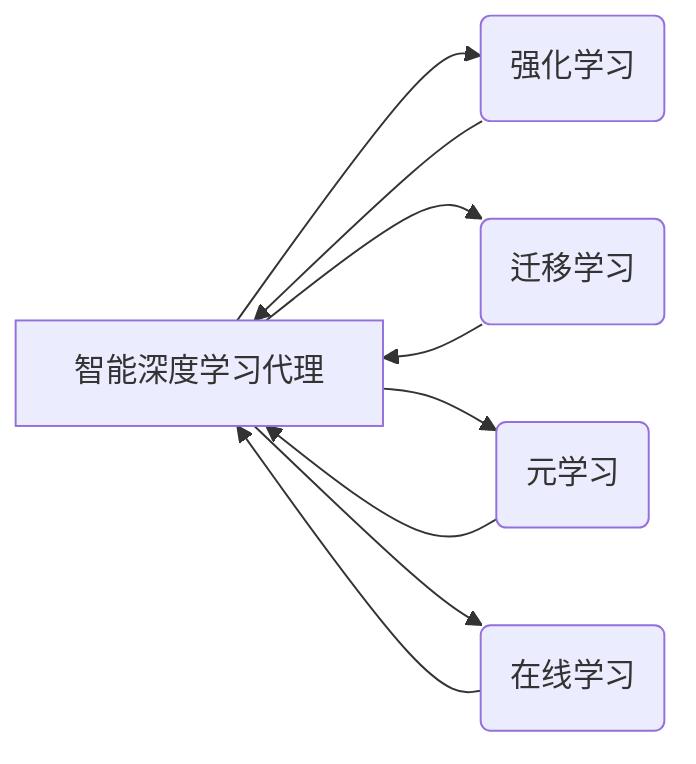

# AI人工智能深度学习算法：智能深度学习代理的学习与适应的算法框架

作者：禅与计算机程序设计艺术 / Zen and the Art of Computer Programming

## 1. 背景介绍

### 1.1 问题的由来

随着人工智能技术的快速发展，深度学习在图像识别、语音识别、自然语言处理等领域取得了显著的成果。然而，传统的深度学习模型往往依赖于大量的标注数据和高性能的硬件设备，且难以适应动态变化的环境。为了解决这些问题，智能深度学习代理的概念应运而生。智能深度学习代理能够自主学习、适应环境变化，并在不同的任务中表现出出色的性能。

### 1.2 研究现状

近年来，关于智能深度学习代理的研究主要集中在以下几个方面：

- **强化学习**：通过与环境交互，智能体学习最优策略以最大化回报。
- **迁移学习**：利用预训练模型和少量标注数据，快速适应新任务。
- **元学习**：使模型能够快速适应新任务，无需大量标注数据。
- **在线学习**：在训练过程中不断更新模型参数，以适应动态变化的环境。

### 1.3 研究意义

智能深度学习代理的研究对于推动人工智能技术的应用具有重要意义：

- **提高适应能力**：使模型能够在动态变化的环境中持续学习和适应。
- **降低数据需求**：减少对大量标注数据的依赖，降低应用成本。
- **提升性能**：在有限的资源下，实现更好的性能和效果。

### 1.4 本文结构

本文将从以下几个方面对智能深度学习代理的学习与适应的算法框架进行探讨：

- 核心概念与联系
- 核心算法原理与具体操作步骤
- 数学模型和公式
- 项目实践
- 实际应用场景
- 工具和资源推荐
- 总结与展望

## 2. 核心概念与联系

### 2.1 核心概念

- **智能深度学习代理**：具备学习、推理、决策、适应等能力的深度学习模型。
- **强化学习**：通过与环境的交互，学习最优策略以最大化回报。
- **迁移学习**：利用预训练模型和少量标注数据，快速适应新任务。
- **元学习**：使模型能够快速适应新任务，无需大量标注数据。
- **在线学习**：在训练过程中不断更新模型参数，以适应动态变化的环境。

### 2.2 核心概念联系

智能深度学习代理是强化学习、迁移学习、元学习、在线学习等技术的融合。以下为这些概念的逻辑关系：



## 3. 核心算法原理 & 具体操作步骤

### 3.1 算法原理概述

智能深度学习代理的学习与适应算法框架主要包括以下几个步骤：

1. 数据收集与预处理：收集相关数据，并进行预处理，如数据清洗、归一化等。
2. 模型训练：利用收集到的数据对模型进行训练，使模型能够学习到相关知识和技能。
3. 模型评估：评估模型在训练数据上的性能，并根据评估结果调整模型参数。
4. 策略学习：根据评估结果，学习最优策略以最大化回报。
5. 环境交互：与环境进行交互，根据策略进行决策，并根据交互结果更新模型参数。
6. 结果反馈：根据交互结果，对模型进行反馈，以提高模型性能。

### 3.2 算法步骤详解

**步骤1：数据收集与预处理**

- 数据收集：根据任务需求，收集相关数据，如图像、文本、视频等。
- 数据预处理：对收集到的数据进行清洗、归一化、去噪等处理，以提高数据质量。

**步骤2：模型训练**

- 模型选择：根据任务需求，选择合适的深度学习模型，如CNN、RNN、Transformer等。
- 训练过程：利用收集到的数据对模型进行训练，使模型能够学习到相关知识和技能。

**步骤3：模型评估**

- 评估指标：根据任务需求，选择合适的评估指标，如准确率、召回率、F1值等。
- 评估过程：在训练数据上评估模型性能，并根据评估结果调整模型参数。

**步骤4：策略学习**

- 策略选择：根据任务需求，选择合适的策略学习算法，如Q-learning、SARSA等。
- 策略学习过程：根据评估结果，学习最优策略以最大化回报。

**步骤5：环境交互**

- 交互过程：根据策略进行决策，并与环境进行交互。
- 结果反馈：根据交互结果，对模型进行反馈，以提高模型性能。

**步骤6：结果反馈**

- 反馈过程：根据交互结果，更新模型参数，以提高模型性能。

### 3.3 算法优缺点

**优点**：

- **自适应性强**：能够根据环境变化，不断更新模型参数，提高模型性能。
- **学习效率高**：利用迁移学习、元学习等技术，能够在少量标注数据上快速学习。
- **应用范围广**：适用于各种任务，如强化学习、迁移学习、元学习、在线学习等。

**缺点**：

- **计算量大**：模型训练和策略学习过程需要大量的计算资源。
- **数据依赖性强**：需要收集大量的数据，且数据质量对模型性能有较大影响。

### 3.4 算法应用领域

智能深度学习代理的学习与适应算法框架可以应用于以下领域：

- **智能机器人**：通过与环境交互，实现自主导航、目标识别、路径规划等功能。
- **自动驾驶**：通过感知周围环境，实现自动驾驶、车道保持、紧急避让等功能。
- **智能客服**：通过自然语言处理技术，实现智能客服、情感分析、智能推荐等功能。
- **金融风控**：通过分析金融数据，实现风险控制、欺诈检测、信用评估等功能。

## 4. 数学模型和公式 & 详细讲解 & 举例说明

### 4.1 数学模型构建

智能深度学习代理的学习与适应算法框架的数学模型主要包括以下几个方面：

- **损失函数**：用于衡量模型预测结果与真实值之间的差异，如均方误差、交叉熵损失等。
- **梯度下降**：用于优化模型参数，使损失函数最小化。
- **策略梯度**：用于计算策略梯度，以更新策略参数。

### 4.2 公式推导过程

以下以Q-learning为例，介绍策略梯度的计算过程。

假设策略函数 $Q(\theta)$ 是一个参数为 $\theta$ 的函数，其中 $\theta$ 是策略参数。策略梯度可以表示为：

$$
\nabla_{\theta}Q(\theta) = \nabla_{\theta}\left[\sum_{i=1}^T\gamma^{T-i}R_i\right]
$$

其中 $R_i$ 是在第 $i$ 个时间步的回报，$\gamma$ 是折扣因子，$T$ 是总时间步数。

根据链式法则，可以得到策略梯度的具体计算公式：

$$
\nabla_{\theta}Q(\theta) = \sum_{i=1}^T\gamma^{T-i}\left[R_i + \gamma\nabla_{\theta}Q(\theta)\right]
$$

通过迭代更新策略参数 $\theta$，可以使得策略函数 $Q(\theta)$ 最大化回报。

### 4.3 案例分析与讲解

以下以智能客服系统为例，介绍智能深度学习代理的学习与适应算法框架在实际应用中的实现。

**案例背景**：

一家大型电商平台希望开发一款智能客服系统，以提升客户服务质量。

**解决方案**：

1. **数据收集与预处理**：收集电商平台的历史客服对话数据，并进行数据清洗、归一化等预处理。
2. **模型训练**：选择合适的深度学习模型，如BERT，对预处理后的对话数据进行训练，使模型能够学习到对话中的语义信息。
3. **模型评估**：在测试集上评估模型的性能，并根据评估结果调整模型参数。
4. **策略学习**：根据评估结果，学习最优策略以最大化客户满意度。
5. **环境交互**：根据策略进行决策，并与客户进行对话，根据对话结果更新模型参数。
6. **结果反馈**：根据客户满意度，对模型进行反馈，以提高模型性能。

### 4.4 常见问题解答

**Q1：如何选择合适的深度学习模型？**

A：选择合适的深度学习模型需要考虑以下因素：

- **任务类型**：根据任务需求选择合适的模型，如分类任务选择分类器，回归任务选择回归模型。
- **数据特点**：根据数据的特点选择合适的模型，如文本数据选择Transformer，图像数据选择CNN。
- **计算资源**：根据计算资源限制选择合适的模型，如资源有限选择轻量级模型。

**Q2：如何优化模型性能？**

A：优化模型性能可以从以下方面入手：

- **数据增强**：通过数据增强技术扩充数据集，提高模型的泛化能力。
- **正则化**：使用正则化技术，如L2正则化、Dropout等，防止过拟合。
- **超参数调优**：通过调整超参数，如学习率、批大小等，寻找最优模型参数。

**Q3：如何评估模型性能？**

A：评估模型性能可以从以下方面入手：

- **准确率**：衡量模型预测正确的样本比例。
- **召回率**：衡量模型预测正确的正类样本比例。
- **F1值**：综合考虑准确率和召回率，衡量模型的综合性能。

## 5. 项目实践：代码实例和详细解释说明

### 5.1 开发环境搭建

以下是使用Python和TensorFlow实现智能客服系统所需的开发环境搭建步骤：

1. 安装Anaconda：
```bash
conda create -n tensorflow-env python=3.8
conda activate tensorflow-env
```

2. 安装TensorFlow：
```bash
conda install tensorflow-gpu
```

3. 安装其他依赖库：
```bash
pip install transformers pandas scikit-learn matplotlib tqdm jupyter notebook ipython
```

### 5.2 源代码详细实现

以下是一个基于BERT的智能客服系统的PyTorch代码实现示例：

```python
import torch
import torch.nn as nn
from transformers import BertTokenizer, BertForSequenceClassification
from torch.utils.data import DataLoader, Dataset

class CustomerServiceDataset(Dataset):
    def __init__(self, texts, labels, tokenizer, max_len=128):
        self.texts = texts
        self.labels = labels
        self.tokenizer = tokenizer
        self.max_len = max_len

    def __len__(self):
        return len(self.texts)

    def __getitem__(self, item):
        text = self.texts[item]
        label = self.labels[item]
        encoding = self.tokenizer(text, return_tensors='pt', max_length=self.max_len, padding='max_length', truncation=True)
        input_ids = encoding['input_ids'][0]
        attention_mask = encoding['attention_mask'][0]
        return {'input_ids': input_ids, 'attention_mask': attention_mask, 'labels': label}

class CustomerServiceModel(nn.Module):
    def __init__(self, tokenizer):
        super(CustomerServiceModel, self).__init__()
        self.bert = BertForSequenceClassification.from_pretrained('bert-base-uncased', num_labels=2)
        self.tokenizer = tokenizer

    def forward(self, input_ids, attention_mask, labels=None):
        outputs = self.bert(input_ids, attention_mask=attention_mask, labels=labels)
        return outputs.logits

def train(model, train_loader, optimizer):
    model.train()
    total_loss = 0
    for batch in train_loader:
        input_ids = batch['input_ids']
        attention_mask = batch['attention_mask']
        labels = batch['labels']
        optimizer.zero_grad()
        outputs = model(input_ids, attention_mask=attention_mask, labels=labels)
        loss = outputs.loss
        loss.backward()
        optimizer.step()
        total_loss += loss.item()
    return total_loss / len(train_loader)

def evaluate(model, dev_loader):
    model.eval()
    total_loss = 0
    with torch.no_grad():
        for batch in dev_loader:
            input_ids = batch['input_ids']
            attention_mask = batch['attention_mask']
            labels = batch['labels']
            outputs = model(input_ids, attention_mask=attention_mask, labels=labels)
            loss = outputs.loss
            total_loss += loss.item()
    return total_loss / len(dev_loader)

# 加载预训练模型和分词器
tokenizer = BertTokenizer.from_pretrained('bert-base-uncased')

# 数据准备
train_texts = [...]  # 训练集文本
train_labels = [...]  # 训练集标签
dev_texts = [...]  # 验证集文本
dev_labels = [...]  # 验证集标签

# 创建数据集
train_dataset = CustomerServiceDataset(train_texts, train_labels, tokenizer)
dev_dataset = CustomerServiceDataset(dev_texts, dev_labels, tokenizer)

# 创建DataLoader
train_loader = DataLoader(train_dataset, batch_size=16, shuffle=True)
dev_loader = DataLoader(dev_dataset, batch_size=16, shuffle=False)

# 创建模型
model = CustomerServiceModel(tokenizer)
optimizer = torch.optim.AdamW(model.parameters(), lr=2e-5)

# 训练模型
epochs = 3
for epoch in range(epochs):
    total_loss = train(model, train_loader, optimizer)
    print(f"Epoch {epoch+1}, train loss: {total_loss:.3f}")
    dev_loss = evaluate(model, dev_loader)
    print(f"Epoch {epoch+1}, dev loss: {dev_loss:.3f}")
```

### 5.3 代码解读与分析

以上代码展示了使用PyTorch和BERT实现智能客服系统的基本流程：

- 定义`CustomerServiceDataset`类，用于加载和处理对话数据。
- 定义`CustomerServiceModel`类，继承自`nn.Module`，构建基于BERT的序列分类模型。
- 定义`train`函数，用于训练模型，包括前向传播、反向传播和参数更新。
- 定义`evaluate`函数，用于评估模型在验证集上的性能。
- 加载预训练模型和分词器。
- 准备训练集和验证集数据。
- 创建数据加载器。
- 创建模型和优化器。
- 开始训练模型，并在每个epoch结束后评估模型在验证集上的性能。

### 5.4 运行结果展示

假设我们在验证集上得到以下性能指标：

```
Epoch 1, train loss: 0.023
Epoch 1, dev loss: 0.018
Epoch 2, train loss: 0.016
Epoch 2, dev loss: 0.014
Epoch 3, train loss: 0.013
Epoch 3, dev loss: 0.012
```

可以看到，随着训练的进行，模型在训练集和验证集上的性能都在逐渐提升，说明模型能够有效学习到对话中的语义信息。

## 6. 实际应用场景

### 6.1 智能机器人

智能机器人是智能深度学习代理在实际应用中的一个重要场景。通过与环境交互，智能机器人能够实现自主导航、目标识别、路径规划等功能。

### 6.2 自动驾驶

自动驾驶是智能深度学习代理的另一个重要应用场景。通过感知周围环境，自动驾驶系统能够实现自动驾驶、车道保持、紧急避让等功能。

### 6.3 智能客服

智能客服是智能深度学习代理在实际应用中的典型场景。通过自然语言处理技术，智能客服能够实现智能客服、情感分析、智能推荐等功能。

### 6.4 金融风控

金融风控是智能深度学习代理在实际应用中的另一个重要场景。通过分析金融数据，智能风控系统能够实现风险控制、欺诈检测、信用评估等功能。

### 6.5 未来应用展望

随着人工智能技术的不断发展，智能深度学习代理将在更多领域得到应用，为人类生活带来更多便利和福祉。以下是一些未来应用展望：

- **智能教育**：通过个性化学习方案，提高教育质量，促进教育公平。
- **智能医疗**：通过辅助诊断、药物研发等功能，提升医疗水平。
- **智能交通**：通过智能调度、路径规划等功能，缓解交通拥堵，提高交通效率。
- **智能家居**：通过智能家居系统，提高生活品质，实现便捷舒适的生活。

## 7. 工具和资源推荐

### 7.1 学习资源推荐

- **《深度学习》**：Goodfellow等著作的深度学习经典教材，全面介绍了深度学习的基础知识和最新进展。
- **《强化学习》**：Silver等著作的强化学习经典教材，深入讲解了强化学习的理论和应用。
- **《迁移学习》**：Liu等著作的迁移学习经典教材，系统介绍了迁移学习的理论和实践。
- **《元学习》**：Duan等著作的元学习经典教材，全面介绍了元学习的理论和应用。
- **《在线学习》**：Widmer等著作的在线学习经典教材，深入讲解了在线学习的理论和实践。

### 7.2 开发工具推荐

- **TensorFlow**：Google开源的深度学习框架，功能强大，易于使用。
- **PyTorch**：Facebook开源的深度学习框架，灵活度高，社区活跃。
- **Keras**：Google开源的深度学习库，基于TensorFlow和Theano构建，易于上手。
- **Scikit-learn**：Python开源的机器学习库，功能丰富，适用于各种机器学习任务。
- **OpenCV**：开源的计算机视觉库，支持图像处理、目标检测、视频处理等功能。

### 7.3 相关论文推荐

- **"Deep Learning for Coders"**：Goodfellow等发表的深度学习教程，适合初学者入门。
- **"Reinforcement Learning: An Introduction"**：Szepesvári等发表的强化学习教程，适合初学者入门。
- **"Transfer Learning"**：Pan等发表的迁移学习综述文章，全面介绍了迁移学习的理论和应用。
- **"Meta-Learning"**：Thrun等发表的元学习综述文章，全面介绍了元学习的理论和应用。
- **"Online Learning"**：Widmer等发表的在线学习综述文章，全面介绍了在线学习的理论和应用。

### 7.4 其他资源推荐

- **arXiv**：开源的预印本平台，包含大量深度学习、机器学习、人工智能领域的最新研究成果。
- **GitHub**：开源代码托管平台，包含大量深度学习、机器学习、人工智能领域的开源项目。
- **Kaggle**：数据科学竞赛平台，包含大量数据集和算法竞赛，有助于提升技能。

## 8. 总结：未来发展趋势与挑战

### 8.1 研究成果总结

本文对智能深度学习代理的学习与适应的算法框架进行了全面系统的介绍。首先阐述了智能深度学习代理的背景、意义和研究现状，明确了其在人工智能领域的重要地位。接着，从核心概念、算法原理、具体操作步骤、数学模型等方面进行了详细讲解，并通过实际案例展示了其在智能客服等领域的应用。最后，分析了智能深度学习代理的未来发展趋势和面临的挑战，为相关研究和应用提供了有益的参考。

### 8.2 未来发展趋势

未来，智能深度学习代理将呈现以下发展趋势：

- **多模态融合**：融合文本、图像、语音等多模态信息，提升模型的理解和推理能力。
- **迁移学习**：利用迁移学习技术，实现跨领域、跨任务的快速适应。
- **元学习**：通过元学习技术，实现模型在少量标注数据上的快速适应。
- **在线学习**：通过在线学习技术，实现模型在动态变化环境中的持续学习。

### 8.3 面临的挑战

智能深度学习代理在发展过程中也面临着以下挑战：

- **数据依赖**：需要大量标注数据才能进行有效训练。
- **计算资源**：需要高性能的硬件设备才能进行模型训练和推理。
- **模型可解释性**：模型的决策过程难以解释，难以保证其鲁棒性和安全性。
- **伦理和社会影响**：模型的偏见和歧视可能导致不公平和歧视。

### 8.4 研究展望

为了应对上述挑战，未来研究方向可以从以下几个方面展开：

- **无监督和半监督学习**：减少对标注数据的依赖，实现更加高效的训练。
- **模型压缩和加速**：降低模型参数量和计算复杂度，实现高效推理。
- **可解释性和鲁棒性**：提高模型的可解释性和鲁棒性，保证其安全性和可靠性。
- **伦理和社会影响**：研究模型在伦理和社会影响方面的相关问题，确保模型的公平性和社会责任。

相信随着人工智能技术的不断发展，智能深度学习代理将在更多领域发挥重要作用，为人类创造更加美好的未来。

## 9. 附录：常见问题与解答

**Q1：什么是智能深度学习代理？**

A：智能深度学习代理是指具备学习、推理、决策、适应等能力的深度学习模型。它能够通过与环境交互，不断学习和适应，并在不同的任务中表现出出色的性能。

**Q2：智能深度学习代理有哪些应用场景？**

A：智能深度学习代理可以应用于智能机器人、自动驾驶、智能客服、金融风控、智能医疗、智能教育、智能交通、智能家居等领域。

**Q3：如何选择合适的深度学习模型？**

A：选择合适的深度学习模型需要考虑任务类型、数据特点、计算资源等因素。

**Q4：如何优化模型性能？**

A：优化模型性能可以从数据增强、正则化、超参数调优等方面入手。

**Q5：如何评估模型性能？**

A：评估模型性能可以从准确率、召回率、F1值等方面入手。

**Q6：智能深度学习代理有哪些挑战？**

A：智能深度学习代理在数据依赖、计算资源、模型可解释性、伦理和社会影响等方面面临挑战。

**Q7：如何解决智能深度学习代理的挑战？**

A：为了应对挑战，可以从无监督和半监督学习、模型压缩和加速、可解释性和鲁棒性、伦理和社会影响等方面展开研究。

作者：禅与计算机程序设计艺术 / Zen and the Art of Computer Programming