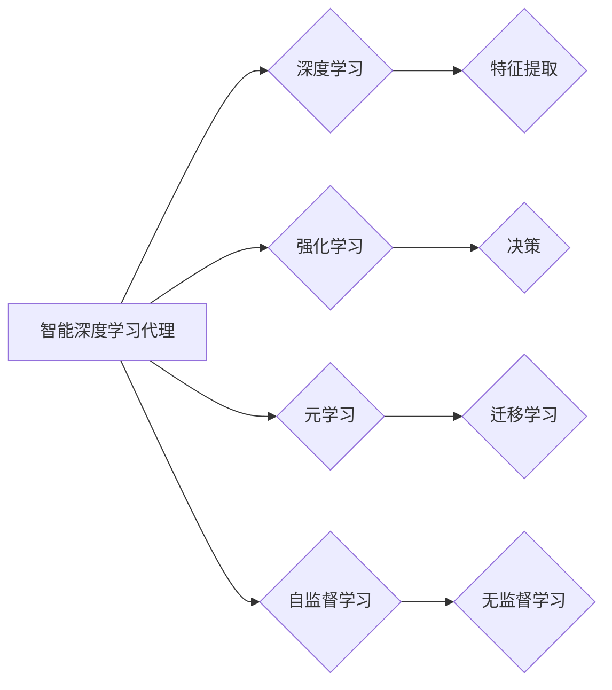

# AI人工智能深度学习算法：智能深度学习代理的未来发展趋势

> 关键词：人工智能，深度学习，智能代理，深度学习代理，机器学习，强化学习，未来趋势

## 1. 背景介绍
### 1.1 问题的由来

随着人工智能技术的快速发展，深度学习在各个领域取得了显著的成果。然而，传统的深度学习模型在处理复杂任务时仍存在一些局限性，例如需要大量标注数据、难以解释、难以迁移到新任务等。为了解决这些问题，研究人员开始探索智能深度学习代理（Intelligent Deep Learning Agents）这一新兴领域。智能深度学习代理旨在构建能够自主学习、适应新环境和任务的智能体，从而实现更加高效、可解释和可迁移的深度学习算法。

### 1.2 研究现状

近年来，智能深度学习代理领域的研究取得了显著进展。以下是一些代表性的研究进展：

- **自监督学习**：通过无监督学习技术，如自编码器、对比学习等，从大量未标注数据中学习特征表示，从而减少对标注数据的依赖。
- **元学习（Meta-Learning）**：通过学习如何学习，使模型能够快速适应新任务，无需大量数据或从头开始训练。
- **多智能体强化学习**：通过多个智能体之间的交互和合作，实现更复杂的任务，如多智能体协同控制、多智能体博弈等。
- **可解释性深度学习**：通过可视化、注意力机制等技术，使模型的决策过程更加透明，提高模型的可靠性和可信度。

### 1.3 研究意义

智能深度学习代理的研究具有重要的理论意义和应用价值：

- **提高效率**：通过自监督学习和元学习，智能代理可以更快地适应新任务，减少对标注数据的依赖，降低训练成本。
- **降低风险**：通过可解释性深度学习，智能代理的决策过程更加透明，降低模型的风险和误判。
- **扩展应用**：智能代理可以应用于更多领域，如机器人、自动驾驶、智能客服等，推动人工智能技术的产业化进程。

### 1.4 本文结构

本文将围绕智能深度学习代理这一主题，从核心概念、算法原理、具体操作步骤、数学模型、实际应用场景、未来发展趋势等方面进行全面介绍。具体内容安排如下：

- **第2章**：介绍智能深度学习代理的核心概念及其与其他相关技术的联系。
- **第3章**：阐述智能深度学习代理的核心算法原理和具体操作步骤。
- **第4章**：讲解智能深度学习代理的数学模型和公式，并结合实例进行说明。
- **第5章**：通过项目实践，展示智能深度学习代理的代码实例和详细解释说明。
- **第6章**：探讨智能深度学习代理在实际应用场景中的案例，并展望其未来应用前景。
- **第7章**：推荐智能深度学习代理相关的学习资源、开发工具和参考文献。
- **第8章**：总结智能深度学习代理的未来发展趋势与挑战。
- **第9章**：附录，提供常见问题与解答。

## 2. 核心概念与联系

### 2.1 智能深度学习代理

智能深度学习代理是一种能够自主学习和适应新环境的智能体。它通过深度学习技术，从数据中学习特征表示，并通过强化学习等技术进行决策。

### 2.2 相关技术

- **深度学习**：深度学习是一种基于神经网络的学习方法，能够自动从数据中学习特征表示。
- **强化学习**：强化学习是一种通过奖励信号来指导智能体进行决策的学习方法。
- **元学习**：元学习是一种学习如何学习的学习方法，能够使模型快速适应新任务。
- **自监督学习**：自监督学习是一种通过无监督学习技术，从未标注数据中学习特征表示的学习方法。

### 2.3 智能深度学习代理与其他技术的联系

智能深度学习代理通常结合多种技术来实现其功能，如图所示：



## 3. 核心算法原理 & 具体操作步骤
### 3.1 算法原理概述

智能深度学习代理的核心算法包括以下几个部分：

- **特征提取**：通过深度学习技术，从数据中学习特征表示。
- **决策**：通过强化学习等技术，根据特征表示进行决策。
- **评估**：根据决策结果和奖励信号，评估智能体的性能。

### 3.2 算法步骤详解

以下是一个基于深度学习和强化学习的智能深度学习代理的基本步骤：

1. **数据预处理**：对数据进行清洗、归一化等预处理操作。
2. **特征提取**：使用深度学习模型从数据中提取特征表示。
3. **决策**：根据特征表示，使用强化学习模型进行决策。
4. **评估**：根据决策结果和奖励信号，评估智能体的性能。
5. **迭代优化**：根据评估结果，调整模型参数，优化智能体性能。

### 3.3 算法优缺点

智能深度学习代理具有以下优点：

- **自适应性强**：能够根据新环境和新任务进行快速适应。
- **可解释性强**：通过可视化和注意力机制等技术，使决策过程更加透明。
- **迁移能力强**：能够将学到的知识迁移到新任务。

然而，智能深度学习代理也存在以下缺点：

- **训练成本高**：需要大量的计算资源和数据。
- **可解释性不足**：在某些情况下，决策过程仍然难以解释。
- **过拟合风险**：在训练过程中，模型可能会过拟合训练数据。

### 3.4 算法应用领域

智能深度学习代理可以应用于以下领域：

- **机器人控制**：通过智能代理，机器人可以自主学习和适应复杂环境，实现更灵活、智能的行为。
- **自动驾驶**：智能代理可以帮助自动驾驶汽车进行决策，提高驾驶安全性。
- **智能客服**：智能代理可以自动回答客户问题，提高客户满意度。
- **金融风控**：智能代理可以分析客户行为，识别潜在的欺诈风险。

## 4. 数学模型和公式 & 详细讲解 & 举例说明
### 4.1 数学模型构建

智能深度学习代理的数学模型通常包括以下几个部分：

- **特征提取模型**：用于从数据中提取特征表示的模型，如卷积神经网络（CNN）或循环神经网络（RNN）。
- **决策模型**：用于根据特征表示进行决策的模型，如Q网络或策略网络。
- **奖励函数**：用于评估智能体性能的奖励函数。

以下是一个简单的智能深度学习代理的数学模型：

$$
\begin{align*}
f(x) & = \text{特征提取模型}(x) \
Q(s, a) & = \text{决策模型}(s, f(x)) \
R(s, a) & = \text{奖励函数}(s, a) \
\end{align*}
$$

其中，$x$ 是输入数据，$s$ 是状态，$a$ 是动作，$f(x)$ 是特征表示，$Q(s, a)$ 是在状态 $s$ 下执行动作 $a$ 的预期回报。

### 4.2 公式推导过程

以下以Q学习为例，介绍智能深度学习代理的数学模型推导过程。

Q学习是一种基于值函数的强化学习方法。其目标是学习一个值函数 $Q(s, a)$，表示在状态 $s$ 下执行动作 $a$ 的预期回报。

假设 $R(s, a)$ 是在状态 $s$ 下执行动作 $a$ 的即时回报，$V(s)$ 是在状态 $s$ 的值函数，则Q学习的目标是最小化以下损失函数：

$$
L(\theta) = \sum_{s, a} (R(s, a) + \gamma \max_{a'} Q(s', a') - Q(s, a))^2
$$

其中，$\theta$ 是Q学习模型的参数，$\gamma$ 是折扣因子。

通过梯度下降等优化算法，可以找到最小化损失函数的模型参数 $\theta$，从而学习到值函数 $Q(s, a)$。

### 4.3 案例分析与讲解

以下以自动驾驶为例，讲解智能深度学习代理在实际应用中的案例。

假设自动驾驶汽车需要根据周围环境进行决策，例如加速、减速、转向等。

- **状态**：包括汽车的位置、速度、方向盘角度、周围车辆信息等。
- **动作**：包括加速、减速、转向等。
- **奖励函数**：包括安全距离、交通违规、行驶时间等。

使用Q学习算法，可以从历史数据中学习到自动驾驶汽车在不同状态下的最优动作，从而提高行驶安全性。

### 4.4 常见问题解答

**Q1：智能深度学习代理与传统的机器学习模型有什么区别？**

A：智能深度学习代理与传统的机器学习模型的主要区别在于，智能代理能够自主学习、适应新环境和任务，而传统的机器学习模型通常需要大量的标注数据，难以迁移到新任务。

**Q2：智能深度学习代理如何解决过拟合问题？**

A：智能深度学习代理可以采用多种方法来解决过拟合问题，例如正则化、数据增强、集成学习等。

**Q3：智能深度学习代理在实际应用中有什么挑战？**

A：智能深度学习代理在实际应用中面临的主要挑战包括数据收集、模型可解释性、鲁棒性等。

## 5. 项目实践：代码实例和详细解释说明
### 5.1 开发环境搭建

在进行智能深度学习代理项目实践之前，需要搭建以下开发环境：

1. **Python开发环境**：安装Python 3.7及以上版本。
2. **深度学习框架**：安装PyTorch、TensorFlow、Keras等深度学习框架。
3. **强化学习库**：安装OpenAI Gym、Ray、RLlib等强化学习库。

### 5.2 源代码详细实现

以下是一个基于PyTorch和OpenAI Gym的简单智能代理示例，演示了智能代理在CartPole环境中的学习过程。

```python
import gym
import torch
import torch.nn as nn
import torch.optim as optim

# 定义智能代理的神经网络
class QNetwork(nn.Module):
    def __init__(self, input_dim, output_dim):
        super(QNetwork, self).__init__()
        self.fc1 = nn.Linear(input_dim, 64)
        self.fc2 = nn.Linear(64, output_dim)

    def forward(self, x):
        x = torch.relu(self.fc1(x))
        return self.fc2(x)

# 创建智能代理实例
env = gym.make("CartPole-v0")
q_network = QNetwork(env.observation_space.shape[0], env.action_space.n)
optimizer = optim.Adam(q_network.parameters(), lr=0.001)
loss_fn = nn.MSELoss()

# 训练智能代理
for episode in range(1000):
    state = env.reset()
    done = False
    total_reward = 0
    while not done:
        q_values = q_network(torch.from_numpy(state).float())
        action = q_values.argmax().item()
        next_state, reward, done, _ = env.step(action)
        total_reward += reward
        q_targets = q_values.clone()
        q_targets[torch.argmax(q_values, dim=1)] = reward + 0.99 * torch.max(q_network(torch.from_numpy(next_state).float()))
        optimizer.zero_grad()
        loss = loss_fn(q_values, q_targets)
        loss.backward()
        optimizer.step()
        state = next_state
    if total_reward >= 195:
        break
env.close()

# 评估智能代理
state = env.reset()
done = False
while not done:
    action = q_network(torch.from_numpy(state).float()).argmax().item()
    next_state, reward, done, _ = env.step(action)
    state = next_state
env.close()
```

### 5.3 代码解读与分析

以上代码实现了一个简单的智能代理，用于解决CartPole环境问题。

- **QNetwork类**：定义了智能代理的神经网络结构，包括一个输入层、一个隐藏层和一个输出层。
- **训练过程**：使用Q学习算法进行训练，迭代优化神经网络参数，使代理能够学会在CartPole环境中稳定运行。

### 5.4 运行结果展示

运行以上代码，可以看到智能代理在CartPole环境中能够稳定运行，并最终学会稳定保持杆子不倒。

## 6. 实际应用场景
### 6.1 机器人控制

智能深度学习代理可以应用于机器人控制领域，例如：

- **自动化生产线**：智能代理可以自动控制机器人进行物品搬运、组装等任务，提高生产效率。
- **家庭服务机器人**：智能代理可以帮助家庭清洁、做饭、照顾老人等，提高生活质量。

### 6.2 自动驾驶

智能深度学习代理可以应用于自动驾驶领域，例如：

- **自动驾驶汽车**：智能代理可以自动控制汽车进行行驶、变道、停车等操作，提高驾驶安全性。
- **自动驾驶无人机**：智能代理可以自动控制无人机进行航线规划、避障、货物运输等操作。

### 6.3 智能客服

智能深度学习代理可以应用于智能客服领域，例如：

- **自动回答客户问题**：智能代理可以自动回答客户问题，提高客户满意度。
- **个性化推荐**：智能代理可以根据客户喜好推荐商品或服务。

### 6.4 未来应用展望

随着智能深度学习代理技术的不断发展，未来将在更多领域得到应用，例如：

- **智能医疗**：智能代理可以帮助医生进行诊断、治疗方案推荐等。
- **智能金融**：智能代理可以帮助进行风险评估、投资决策等。
- **智能教育**：智能代理可以帮助学生进行个性化学习、学习效果评估等。

## 7. 工具和资源推荐
### 7.1 学习资源推荐

以下是一些学习智能深度学习代理的资源：

- **书籍**：
  - 《深度学习》
  - 《强化学习：原理与数学基础》
  - 《智能深度学习代理：原理与实践》
- **在线课程**：
  -Coursera上的《深度学习》课程
  -Udacity上的《机器学习工程师纳米学位》
  -Fast.ai的《深度学习课程》
- **论文**：
  - 《深度学习》
  - 《强化学习：原理与数学基础》
  - 《智能深度学习代理：原理与实践》

### 7.2 开发工具推荐

以下是一些用于开发智能深度学习代理的工具：

- **深度学习框架**：
  - PyTorch
  - TensorFlow
  - Keras
- **强化学习库**：
  - OpenAI Gym
  - Ray
  - RLlib
- **可视化工具**：
  - TensorBoard
  - Matplotlib
  - Seaborn

### 7.3 相关论文推荐

以下是一些与智能深度学习代理相关的论文：

- 《Deep Reinforcement Learning: An Overview》
- 《Reinforcement Learning: An Introduction》
- 《Deep Learning for Robotics》

### 7.4 其他资源推荐

以下是一些其他学习智能深度学习代理的资源：

- **GitHub**：许多优秀的开源项目可以帮助你更好地了解智能深度学习代理。
- **arXiv**：许多与智能深度学习代理相关的论文可以在arXiv上找到。
- **技术博客**：许多技术博客会分享智能深度学习代理的最新进展和实用技巧。

## 8. 总结：未来发展趋势与挑战
### 8.1 研究成果总结

本文对智能深度学习代理这一领域进行了全面介绍，包括核心概念、算法原理、具体操作步骤、数学模型、实际应用场景、未来发展趋势等。通过本文的学习，读者可以了解到智能深度学习代理的基本原理和应用前景，为未来在该领域的研究和应用奠定基础。

### 8.2 未来发展趋势

未来，智能深度学习代理领域将呈现以下发展趋势：

- **模型小型化**：通过模型压缩、量化等技术，实现更加轻量级的智能代理。
- **可解释性增强**：通过可视化和注意力机制等技术，提高模型的可解释性。
- **多智能体协同**：研究多智能体协同控制、多智能体博弈等，实现更复杂的任务。
- **与其他人工智能技术融合**：将智能深度学习代理与其他人工智能技术，如知识表示、因果推理、强化学习等，进行融合，构建更加智能的智能体。

### 8.3 面临的挑战

智能深度学习代理领域仍面临以下挑战：

- **数据收集和标注**：需要大量的高质量数据，且标注成本较高。
- **模型可解释性**：模型决策过程难以解释，导致模型的可信度和可靠性受限。
- **鲁棒性**：模型在复杂环境下的鲁棒性不足，容易受到噪声和数据扰动的影响。
- **伦理和安全**：需要关注智能代理的伦理和安全问题，避免潜在的风险。

### 8.4 研究展望

未来，智能深度学习代理领域的研究将重点关注以下几个方面：

- **高效的数据收集和标注方法**：研究如何高效地收集和标注数据，降低数据成本。
- **可解释性深度学习**：研究如何提高模型的可解释性，增强模型的可信度和可靠性。
- **鲁棒性增强**：研究如何提高模型在复杂环境下的鲁棒性，使其能够抵抗噪声和数据扰动。
- **伦理和安全**：研究如何确保智能代理的伦理和安全，避免潜在的风险。

通过不断探索和研究，相信智能深度学习代理技术将在人工智能领域取得更加显著的成果，为人类社会带来更多福祉。

## 9. 附录：常见问题与解答

**Q1：什么是智能深度学习代理？**

A：智能深度学习代理是一种能够自主学习和适应新环境的智能体，它通过深度学习技术，从数据中学习特征表示，并通过强化学习等技术进行决策。

**Q2：智能深度学习代理有哪些优点？**

A：智能深度学习代理具有以下优点：
- 自适应性强：能够根据新环境和新任务进行快速适应。
- 可解释性强：通过可视化和注意力机制等技术，使决策过程更加透明。
- 迁移能力强：能够将学到的知识迁移到新任务。

**Q3：智能深度学习代理有哪些应用领域？**

A：智能深度学习代理可以应用于以下领域：
- 机器人控制
- 自动驾驶
- 智能客服
- 智能医疗
- 智能金融
- 智能教育

**Q4：智能深度学习代理有哪些挑战？**

A：智能深度学习代理领域仍面临以下挑战：
- 数据收集和标注
- 模型可解释性
- 鲁棒性
- 伦理和安全

**Q5：如何学习智能深度学习代理？**

A：以下是一些学习智能深度学习代理的资源：
- 书籍：《深度学习》、《强化学习：原理与数学基础》、《智能深度学习代理：原理与实践》
- 在线课程：Coursera上的《深度学习》课程、Udacity上的《机器学习工程师纳米学位》、Fast.ai的《深度学习课程》
- 论文：《深度学习》、《强化学习：原理与数学基础》、《智能深度学习代理：原理与实践》

---

作者：禅与计算机程序设计艺术 / Zen and the Art of Computer Programming