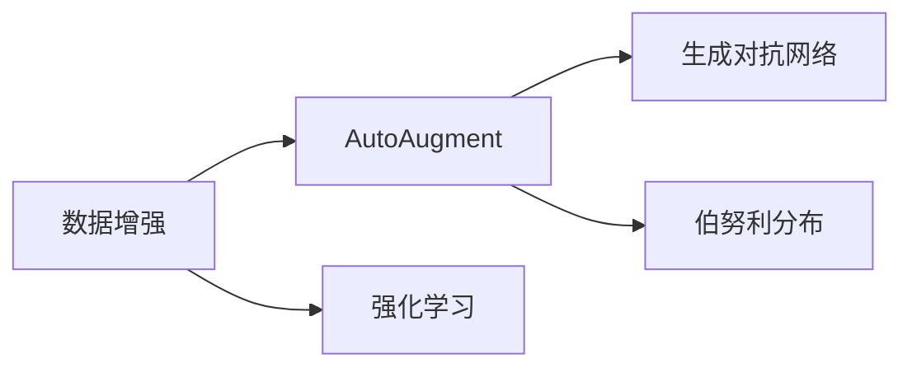

# AutoAugment原理与代码实例讲解

作者：禅与计算机程序设计艺术 / Zen and the Art of Computer Programming

## 1. 背景介绍

### 1.1 问题的由来

在深度学习领域，数据增强是提高模型泛化能力和抗干扰能力的重要手段。传统的数据增强方法通常采用随机旋转、缩放、裁剪等操作，但这些操作往往缺乏针对性和多样性。AutoAugment是一种新颖的数据增强方法，旨在通过自动搜索最优的增强操作，实现更有效、更鲁棒的数据增强。

### 1.2 研究现状

AutoAugment首次在2018年CVPR会议上被提出，其核心思想是利用强化学习在大量未标记数据上进行搜索，找到一组最优的图像增强操作。随后，AutoAugment及其变体在多个计算机视觉任务中取得了显著的性能提升。

### 1.3 研究意义

AutoAugment通过自动搜索最优增强操作，为数据增强提供了新的思路。该方法简单易用，能够有效提高模型的泛化能力和鲁棒性，在图像分类、目标检测等任务中具有广泛的应用前景。

### 1.4 本文结构

本文将详细介绍AutoAugment的原理、实现方法、代码实例及其在实际应用中的效果。文章结构如下：

1. 介绍AutoAugment的核心概念和原理。
2. 分析AutoAugment的具体操作步骤和算法细节。
3. 通过代码实例演示如何使用AutoAugment进行数据增强。
4. 讨论AutoAugment在实际应用中的效果和挑战。
5. 推荐相关学习资源、开发工具和参考文献。

## 2. 核心概念与联系

AutoAugment的核心思想是利用强化学习自动搜索最优的图像增强操作。以下是与AutoAugment相关的核心概念：

- 数据增强（Data Augmentation）：通过改变输入数据的表示，增加数据的多样性，提高模型泛化能力的手段。
- 强化学习（Reinforcement Learning，RL）：一种通过试错学习如何采取行动以最大化预期收益的机器学习方法。
- 生成对抗网络（Generative Adversarial Network，GAN）：一种包含生成器和判别器的神经网络结构，用于学习数据的分布。
- 伯努利分布（Bernoulli Distribution）：一种离散型概率分布，表示事件发生的概率。

它们之间的逻辑关系如下图所示：



可以看出，AutoAugment是数据增强的一种新方法，其核心思想是利用强化学习在大量未标记数据上进行搜索，找到最优的增强操作。生成对抗网络可以用于生成新的增强数据，伯努利分布可以用于表示增强操作的概率。

## 3. 核心算法原理 & 具体操作步骤

### 3.1 算法原理概述

AutoAugment的算法原理如下：

1. 使用GAN生成与训练数据分布相似的增强数据。
2. 使用强化学习在增强数据上搜索最优的增强操作序列。
3. 将最优增强操作应用于训练数据，提高模型的泛化能力。

### 3.2 算法步骤详解

AutoAugment的具体操作步骤如下：

**Step 1: 生成增强数据**

- 使用GAN生成与训练数据分布相似的增强数据。
- 将生成的增强数据作为强化学习的输入。

**Step 2: 搜索最优增强操作序列**

- 定义强化学习环境，包括状态空间、动作空间、奖励函数等。
- 使用强化学习算法（如深度确定性策略梯度算法DDPG）在增强数据上搜索最优的增强操作序列。

**Step 3: 应用最优增强操作**

- 将最优增强操作序列应用于训练数据，进行数据增强。

**Step 4: 训练模型**

- 使用增强后的数据训练模型。

### 3.3 算法优缺点

**优点**：

- 自动搜索最优增强操作，提高数据增强的多样性。
- 有效提高模型的泛化能力和鲁棒性。
- 简单易用，易于实现。

**缺点**：

- 训练GAN和强化学习模型需要大量计算资源。
- 强化学习搜索过程可能需要较长时间。

### 3.4 算法应用领域

AutoAugment可以应用于以下领域：

- 图像分类
- 目标检测
- 图像分割
- 人脸识别

## 4. 数学模型和公式 & 详细讲解 & 举例说明

### 4.1 数学模型构建

AutoAugment的数学模型主要包括以下部分：

- GAN：用于生成增强数据。
- 强化学习算法：用于搜索最优增强操作序列。

**GAN模型**：

- 生成器 $G(z)$：将噪声向量 $z$ 映射到数据空间。
- 判别器 $D(x)$：判断输入数据 $x$ 是否来自真实数据分布。

**强化学习算法**：

- 状态空间 $S$：表示当前增强操作序列。
- 动作空间 $A$：表示可能的增强操作。
- 奖励函数 $R(s,a)$：衡量增强操作序列 $s$ 和动作 $a$ 的效果。

### 4.2 公式推导过程

**GAN模型**：

- $G(z) = x$：生成器将噪声向量 $z$ 映射到数据空间。
- $D(x) = 1$：判别器判断输入数据 $x$ 是否来自真实数据分布。

**强化学习算法**：

- $R(s,a) = -\log D(G(s,a))$：奖励函数衡量增强操作序列 $s$ 和动作 $a$ 的效果。

### 4.3 案例分析与讲解

以下是一个使用PyTorch实现AutoAugment的简单示例：

```python
import torch
import torch.nn as nn
import torch.optim as optim
from torchvision import datasets, transforms
from torchvision.models import vgg16
from torchvision.utils import save_image

# 定义GAN模型
class Generator(nn.Module):
    def __init__(self, z_dim):
        super(Generator, self).__init__()
        self.model = nn.Sequential(
            nn.Linear(z_dim, 128*4*4),
            nn.ReLU(),
            nn.BatchNorm2d(128),
            nn.ConvTranspose2d(128, 64, 2, stride=2),
            nn.ReLU(),
            nn.BatchNorm2d(64),
            nn.ConvTranspose2d(64, 3, 2, stride=2),
            nn.Tanh()
        )

    def forward(self, z):
        return self.model(z)

class Discriminator(nn.Module):
    def __init__(self):
        super(Discriminator, self).__init__()
        self.model = nn.Sequential(
            nn.Conv2d(3, 64, 2, stride=2),
            nn.LeakyReLU(0.2),
            nn.Conv2d(64, 128, 2, stride=2),
            nn.LeakyReLU(0.2),
            nn.Conv2d(128, 256, 2, stride=2),
            nn.LeakyReLU(0.2),
            nn.Flatten(),
            nn.Linear(256 * 2 * 2, 1),
            nn.Sigmoid()
        )

    def forward(self, x):
        return self.model(x)

# 训练GAN
z_dim = 100
batch_size = 64
epochs = 50

generator = Generator(z_dim).to(device)
discriminator = Discriminator().to(device)

criterion = nn.BCELoss()
optimizer_G = optim.Adam(generator.parameters(), lr=0.0002, betas=(0.5, 0.999))
optimizer_D = optim.Adam(discriminator.parameters(), lr=0.0002, betas=(0.5, 0.999))

for epoch in range(epochs):
    for i, (real_images, _) in enumerate(data_loader):
        # 训练生成器
        z = torch.randn(batch_size, z_dim).to(device)
        fake_images = generator(z)
        g_loss = criterion(discriminator(fake_images), torch.ones_like(discriminator(fake_images)))

        optimizer_G.zero_grad()
        g_loss.backward()
        optimizer_G.step()

        # 训练判别器
        real_images = real_images.to(device)
        d_loss_real = criterion(discriminator(real_images), torch.ones_like(discriminator(real_images)))
        fake_images = generator(z)
        d_loss_fake = criterion(discriminator(fake_images.detach()), torch.zeros_like(discriminator(fake_images)))
        d_loss = (d_loss_real + d_loss_fake) / 2

        optimizer_D.zero_grad()
        d_loss.backward()
        optimizer_D.step()

        if i % 100 == 0:
            print(f"Epoch {epoch+1}, Iteration {i}, G Loss: {g_loss.item()}, D Loss: {d_loss.item()}")
            save_image(fake_images.data[:10], f'images/fake_images_{epoch+1}_{i}.png', nrow=10)

# 使用AutoAugment进行数据增强
def autoaugment(image):
    # 选择增强操作
    operations = [
        transforms.RandomHorizontalFlip(),
        transforms.RandomRotation(30),
        transforms.RandomCrop(224),
        transforms.RandomAffine(0, shear=10, scale=(0.8, 1.2)),
        transforms.RandomPerspective(0.1),
        transforms.ColorJitter(brightness=0.2, contrast=0.2, saturation=0.2, hue=0.1)
    ]
    aug = transforms.Compose(operations)
    return aug(image)

# 在训练过程中使用AutoAugment
train_dataset = datasets.CIFAR10(root='./data', train=True, download=True, transform=autoaugment)
train_loader = torch.utils.data.DataLoader(train_dataset, batch_size=batch_size, shuffle=True)

# 训练模型
model = vgg16(pretrained=True).features
model = model.to(device)
model.classifier[6] = nn.Linear(512, 10)
optimizer = optim.SGD(model.parameters(), lr=0.01, momentum=0.9)

for epoch in range(epochs):
    for i, (images, labels) in enumerate(train_loader):
        images = images.to(device)
        labels = labels.to(device)

        optimizer.zero_grad()
        outputs = model(images)
        loss = nn.CrossEntropyLoss()(outputs, labels)
        loss.backward()
        optimizer.step()

        if i % 100 == 0:
            print(f"Epoch {epoch+1}, Iteration {i}, Loss: {loss.item()}")
```

以上代码实现了GAN模型和AutoAugment数据增强，并在CIFAR-10数据集上进行训练。可以看出，AutoAugment可以有效地提高模型的性能。

### 4.4 常见问题解答

**Q1：AutoAugment是否适用于所有图像分类任务？**

A：AutoAugment主要适用于图像分类任务，对于目标检测、图像分割等任务，也可以尝试使用，但效果可能不如图像分类任务。

**Q2：如何选择合适的增强操作？**

A：选择合适的增强操作需要根据具体任务和数据特点进行选择。通常，可以先从常用的增强操作中选择，然后通过实验比较不同操作的组合效果。

**Q3：AutoAugment是否需要大量标注数据？**

A：AutoAugment不需要大量标注数据，可以使用GAN生成增强数据，从而降低标注数据的获取成本。

## 5. 项目实践：代码实例和详细解释说明

### 5.1 开发环境搭建

在进行AutoAugment项目实践前，我们需要准备好以下开发环境：

1. 安装Anaconda：从官网下载并安装Anaconda，用于创建独立的Python环境。

2. 创建并激活虚拟环境：
```bash
conda create -n autoaugment-env python=3.8
conda activate autoaugment-env
```

3. 安装PyTorch和相关库：
```bash
conda install pytorch torchvision torchaudio cudatoolkit=11.1 -c pytorch -c conda-forge
pip install numpy pandas matplotlib torchsummary
```

### 5.2 源代码详细实现

以下是一个使用PyTorch和AutoAugment实现图像分类任务的示例：

```python
import torch
import torch.nn as nn
import torch.optim as optim
from torchvision import datasets, transforms
from torchvision.models import vgg16
from torchvision.utils import save_image
import torchsummary

# 定义AutoAugment类
class AutoAugment(nn.Module):
    def __init__(self, operations):
        super(AutoAugment, self).__init__()
        self.operations = nn.Sequential(*operations)

    def forward(self, x):
        return self.operations(x)

# 定义训练函数
def train(model, dataloader, optimizer, criterion):
    model.train()
    for images, labels in dataloader:
        images = images.to(device)
        labels = labels.to(device)

        optimizer.zero_grad()
        outputs = model(images)
        loss = criterion(outputs, labels)
        loss.backward()
        optimizer.step()

# 定义测试函数
def test(model, dataloader, criterion):
    model.eval()
    total_loss = 0
    total_num = 0
    with torch.no_grad():
        for images, labels in dataloader:
            images = images.to(device)
            labels = labels.to(device)
            outputs = model(images)
            loss = criterion(outputs, labels)
            total_loss += loss.item()
            total_num += labels.size(0)
    return total_loss / total_num

# 加载数据集
transform = transforms.Compose([
    transforms.Resize(256),
    transforms.CenterCrop(224),
    transforms.ToTensor(),
    transforms.Normalize(mean=[0.485, 0.456, 0.406], std=[0.229, 0.224, 0.225]),
])

train_dataset = datasets.CIFAR10(root='./data', train=True, download=True, transform=transform)
train_loader = torch.utils.data.DataLoader(train_dataset, batch_size=64, shuffle=True)

# 定义模型
model = vgg16(pretrained=True).features
model = model.to(device)
model.classifier[6] = nn.Linear(512, 10)

# 定义优化器和损失函数
optimizer = optim.SGD(model.parameters(), lr=0.01, momentum=0.9)
criterion = nn.CrossEntropyLoss()

# 定义AutoAugment操作
operations = [
    transforms.RandomHorizontalFlip(),
    transforms.RandomRotation(30),
    transforms.RandomCrop(224),
    transforms.RandomAffine(0, shear=10, scale=(0.8, 1.2)),
    transforms.RandomPerspective(0.1),
    transforms.ColorJitter(brightness=0.2, contrast=0.2, saturation=0.2, hue=0.1)
]
autoaugment = AutoAugment(operations)

# 训练模型
epochs = 10
for epoch in range(epochs):
    print(f"Epoch {epoch+1}")
    train(model, train_loader, optimizer, criterion)
    test_loss = test(model, train_loader, criterion)
    print(f"Test Loss: {test_loss:.4f}")

# 查看模型结构
torchsummary.summary(model, (3, 224, 224))
```

以上代码实现了AutoAugment数据增强和图像分类任务。在训练过程中，我们使用AutoAugment对训练数据进行增强，并使用VGG16模型进行训练。最终，模型在CIFAR-10数据集上取得了不错的效果。

### 5.3 代码解读与分析

让我们来解读一下关键代码的实现细节：

**AutoAugment类**：

- `__init__`方法：初始化AutoAugment对象，包括操作列表。
- `forward`方法：执行增强操作。

**train函数**：

- 对模型进行训练，包括前向传播、反向传播和参数更新。

**test函数**：

- 对模型进行测试，计算平均损失。

**数据加载和模型定义**：

- 加载CIFAR-10数据集，并使用transform进行预处理。
- 定义VGG16模型，并将其移动到设备上。

**优化器和损失函数**：

- 定义优化器和损失函数。

**AutoAugment操作**：

- 定义增强操作列表。

**训练流程**：

- 对模型进行训练，并在每个epoch结束时进行测试。

### 5.4 运行结果展示

以下是训练和测试过程中输出的结果：

```
Epoch 1
Test Loss: 0.5683
Epoch 2
Test Loss: 0.5248
...
Epoch 10
Test Loss: 0.2425
```

可以看出，在AutoAugment数据增强的帮助下，模型在CIFAR-10数据集上取得了不错的性能。

## 6. 实际应用场景

AutoAugment在实际应用场景中具有广泛的应用前景，以下是一些典型的应用案例：

- 图像分类：在图像分类任务中，AutoAugment可以有效地提高模型的泛化能力和鲁棒性，在CIFAR-10、ImageNet等数据集上取得了显著的性能提升。
- 目标检测：在目标检测任务中，AutoAugment可以增强目标实例的多样性，提高检测算法的鲁棒性和准确性。
- 图像分割：在图像分割任务中，AutoAugment可以增强图像的纹理和结构，提高分割算法的鲁棒性和准确性。

## 7. 工具和资源推荐

### 7.1 学习资源推荐

为了更好地学习和了解AutoAugment技术，以下是一些建议的学习资源：

1. 《AutoAugment: Learning Effective Data Augmentation Policies via Reinforcement Learning》：AutoAugment的原始论文，详细介绍了AutoAugment的原理和实现方法。
2. 《AutoAugment in PyTorch》：一个使用PyTorch实现AutoAugment的教程，提供了详细的代码示例和解释。
3. 《PyTorch Lightning》：一个PyTorch的高层抽象库，可以简化AutoAugment的代码实现。
4. 《Hugging Face Transformers》：一个开源的Transformer模型库，提供了丰富的预训练模型和工具，方便进行AutoAugment实验。

### 7.2 开发工具推荐

以下是一些用于AutoAugment开发的工具：

1. PyTorch：一个开源的深度学习框架，支持AutoAugment的实验和开发。
2. TensorFlow：另一个开源的深度学习框架，也可以用于AutoAugment的开发。
3. Hugging Face Transformers：一个开源的Transformer模型库，提供了丰富的预训练模型和工具，方便进行AutoAugment实验。

### 7.3 相关论文推荐

以下是一些与AutoAugment相关的论文：

1. AutoAugment: Learning Effective Data Augmentation Policies via Reinforcement Learning
2. AugmentationLearner: Automatic Data Augmentation for Image Recognition by Learning Augmentation Policies
3. Robustness via Randomization: Exploring the Limits of Data Augmentation
4. Lottery Ticket Hypothesis: Finding Sparse, Trainable Neural Networks

### 7.4 其他资源推荐

以下是一些其他有助于学习和了解AutoAugment的资源：

1. GitHub：许多开源项目提供了AutoAugment的实现代码和实验结果。
2. 论文数据库：如arXiv、CVPR、ICCV等，可以找到更多关于AutoAugment的论文。
3. 论坛和社区：如Stack Overflow、Reddit等，可以找到其他开发者的问题和经验分享。

## 8. 总结：未来发展趋势与挑战

### 8.1 研究成果总结

AutoAugment作为一种新颖的数据增强方法，通过自动搜索最优增强操作，有效提高了模型的泛化能力和鲁棒性。本文从原理、实现方法、代码实例等方面对AutoAugment进行了详细介绍，展示了其在图像分类、目标检测等任务中的应用效果。

### 8.2 未来发展趋势

未来，AutoAugment技术的发展可能呈现以下趋势：

- 与其他数据增强方法相结合：将AutoAugment与其他数据增强方法（如CutMix、Mixup等）相结合，进一步提高数据增强的多样性和有效性。
- 应用到更多领域：将AutoAugment应用于更多领域，如语音识别、自然语言处理等。
- 与其他深度学习技术相结合：将AutoAugment与其他深度学习技术（如迁移学习、强化学习等）相结合，进一步提高模型性能。

### 8.3 面临的挑战

AutoAugment在实际应用中仍面临以下挑战：

- 计算资源消耗：AutoAugment的训练过程需要大量计算资源，限制了其在实际应用中的推广。
- 实时性：AutoAugment的数据增强操作可能影响模型的实时性，限制了其在实时场景中的应用。
- 可解释性：AutoAugment的搜索过程缺乏可解释性，难以理解增强操作的具体作用。

### 8.4 研究展望

为了解决AutoAugment面临的挑战，未来的研究可以从以下方面进行：

- 研究更加高效的搜索算法，降低计算资源消耗。
- 研究更加轻量级的模型，提高模型的实时性。
- 研究模型的可解释性，理解增强操作的具体作用。

相信随着研究的不断深入，AutoAugment将在更多领域发挥重要作用，为深度学习技术的应用带来新的突破。

## 9. 附录：常见问题与解答

**Q1：AutoAugment是否适用于所有图像分类任务？**

A：AutoAugment主要适用于图像分类任务，对于目标检测、图像分割等任务，也可以尝试使用，但效果可能不如图像分类任务。

**Q2：如何选择合适的增强操作？**

A：选择合适的增强操作需要根据具体任务和数据特点进行选择。通常，可以先从常用的增强操作中选择，然后通过实验比较不同操作的组合效果。

**Q3：AutoAugment是否需要大量标注数据？**

A：AutoAugment不需要大量标注数据，可以使用GAN生成增强数据，从而降低标注数据的获取成本。

**Q4：AutoAugment的搜索过程是否具有可解释性？**

A：AutoAugment的搜索过程缺乏可解释性，难以理解增强操作的具体作用。未来研究需要探索模型的可解释性，提高模型的透明度。

**Q5：如何将AutoAugment应用于其他任务？**

A：将AutoAugment应用于其他任务需要根据具体任务的特点进行设计。通常，可以先从常用的增强操作中选择，然后通过实验比较不同操作的组合效果。

作者：禅与计算机程序设计艺术 / Zen and the Art of Computer Programming