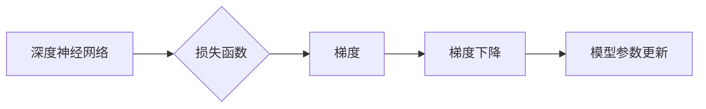

# Backpropagation 原理与代码实战案例讲解

作者：禅与计算机程序设计艺术 / Zen and the Art of Computer Programming

## 1. 背景介绍

### 1.1 问题的由来

在深度学习中，反向传播(Backpropagation)算法是一种核心的优化算法，用于训练深层神经网络。它通过计算损失函数对网络参数的梯度，然后使用梯度下降等优化方法更新参数，从而实现网络的优化。

反向传播算法的提出，使得深度学习从理论走向实践，成为人工智能领域最具变革性的技术之一。本文将深入浅出地讲解反向传播算法的原理、步骤、代码实现以及实际应用案例。

### 1.2 研究现状

自从1986年Rumelhart等人首次提出反向传播算法以来，该算法已经经过了多年的发展，成为了深度学习训练中不可或缺的一部分。随着深度学习技术的不断进步，反向传播算法也在不断地改进和优化，例如自适应学习率优化器(Adam、RMSprop等)和分布式训练技术等。

### 1.3 研究意义

反向传播算法在深度学习中的应用具有重要的意义：
- 提高深度学习模型的训练效率，缩短训练时间。
- 提升深度学习模型的精度，改善模型性能。
- 推动深度学习技术在各个领域的应用。

### 1.4 本文结构

本文将按照以下结构进行阐述：
- 第2部分，介绍反向传播算法的核心概念和联系。
- 第3部分，详细讲解反向传播算法的原理和具体操作步骤。
- 第4部分，介绍反向传播算法中的数学模型和公式，并结合实例进行讲解。
- 第5部分，通过代码实战案例展示如何实现反向传播算法。
- 第6部分，探讨反向传播算法在实际应用中的场景和案例。
- 第7部分，推荐反向传播算法相关的学习资源、开发工具和参考文献。
- 第8部分，总结反向传播算法的未来发展趋势与挑战。
- 第9部分，列出一些常见问题与解答。

## 2. 核心概念与联系

为了更好地理解反向传播算法，本节将介绍几个密切相关的核心概念：

- 深度神经网络(Deep Neural Network)：一种具有多个隐藏层的神经网络，用于学习和表示复杂的数据分布。
- 损失函数(Loss Function)：衡量模型预测输出与真实标签之间差异的函数。
- 梯度(Gradient)：表示函数变化率的向量，用于指导模型参数的更新。
- 梯度下降(Gradient Descent)：一种优化算法，通过计算损失函数对参数的梯度，不断更新参数，以最小化损失函数。

这些概念之间的逻辑关系如下：



可以看出，反向传播算法通过计算损失函数对网络参数的梯度，使用梯度下降等优化方法更新参数，从而优化深度神经网络。

## 3. 核心算法原理 & 具体操作步骤

### 3.1 算法原理概述

反向传播算法是一种基于梯度下降的优化算法，其核心思想是计算损失函数对网络参数的梯度，并通过反向传播的方式传递到网络的每一层，最终指导网络参数的更新。

### 3.2 算法步骤详解

反向传播算法的具体步骤如下：

1. **前向传播**：将输入数据输入到网络中，计算网络的输出。
2. **计算损失**：计算损失函数对网络输出的损失值。
3. **反向传播**：计算损失函数对网络参数的梯度，并反向传播到网络的每一层。
4. **参数更新**：使用梯度下降等优化方法更新网络参数，减少损失值。

### 3.3 算法优缺点

反向传播算法的优点包括：
- 能够有效训练深层神经网络。
- 具有较高的计算效率。

反向传播算法的缺点包括：
- 需要大量的计算资源。
- 对于某些问题可能存在局部最优解。

### 3.4 算法应用领域

反向传播算法在深度学习中被广泛应用于以下领域：
- 机器学习
- 计算机视觉
- 自然语言处理

## 4. 数学模型和公式 & 详细讲解 & 举例说明

### 4.1 数学模型构建

反向传播算法的核心是计算损失函数对网络参数的梯度。假设深度神经网络的输出为 $y$，真实标签为 $t$，损失函数为 $L(y, t)$，则梯度下降的更新公式为：

$$
\theta = \theta - \alpha \frac{\partial L}{\partial \theta}
$$

其中，$\theta$ 是网络参数，$\alpha$ 是学习率，$\frac{\partial L}{\partial \theta}$ 是损失函数对参数 $\theta$ 的梯度。

### 4.2 公式推导过程

以下以均方误差(Mean Squared Error, MSE)损失函数为例，讲解反向传播算法的推导过程。

假设输入数据为 $x$，网络输出为 $y$，真实标签为 $t$，则MSE损失函数为：

$$
L(y, t) = \frac{1}{2} \sum_{i=1}^n (y_i - t_i)^2
$$

其中，$y_i$ 是网络对第 $i$ 个样本的预测值，$t_i$ 是第 $i$ 个样本的真实标签。

对损失函数 $L(y, t)$ 关于网络参数 $\theta$ 的梯度为：

$$
\frac{\partial L}{\partial \theta} = \frac{\partial}{\partial \theta} \left( \frac{1}{2} \sum_{i=1}^n (y_i - t_i)^2 \right)
$$

使用链式法则展开，得：

$$
\frac{\partial L}{\partial \theta} = \frac{\partial}{\partial y} (y_i - t_i)^2 \cdot \frac{\partial y}{\partial \theta}
$$

其中，$\frac{\partial y}{\partial \theta}$ 是网络输出 $y$ 对参数 $\theta$ 的梯度，可以通过链式法则计算。

### 4.3 案例分析与讲解

以下使用Python代码实现反向传播算法，并计算MSE损失函数的梯度。

```python
import numpy as np

def mse_loss(y_true, y_pred):
    return np.mean((y_true - y_pred) ** 2)

def mse_loss_gradient(y_true, y_pred):
    return 2 * (y_pred - y_true)
```

### 4.4 常见问题解答

**Q1：如何选择合适的学习率？**

A：学习率的选择对于模型的收敛速度和最终性能有很大影响。一般来说，学习率过小会导致训练时间过长，学习率过大可能会导致模型无法收敛。在实际应用中，可以通过试错的方式选择合适的学习率，或者使用学习率衰减策略。

**Q2：如何处理梯度消失和梯度爆炸问题？**

A：梯度消失和梯度爆炸是深度学习中常见的两个问题。梯度消失会导致模型的训练效果变差，梯度爆炸可能会导致模型发散。为了解决这个问题，可以采用以下方法：
- 使用ReLU等非线性激活函数。
- 使用批量归一化(Batch Normalization)。
- 使用残差连接。
- 使用梯度裁剪技术。

## 5. 项目实践：代码实例和详细解释说明

### 5.1 开发环境搭建

在进行反向传播算法的实践之前，我们需要搭建相应的开发环境。以下是使用Python进行深度学习开发的常见环境配置步骤：

1. 安装Anaconda：从官网下载并安装Anaconda，用于创建独立的Python环境。
2. 创建并激活虚拟环境：
```bash
conda create -n deep_learning_env python=3.8
conda activate deep_learning_env
```
3. 安装TensorFlow或PyTorch：根据个人喜好选择TensorFlow或PyTorch深度学习框架。
```bash
# TensorFlow
pip install tensorflow-gpu
```
```bash
# PyTorch
pip install torch torchvision torchaudio
```
4. 安装其他常用库：
```bash
pip install numpy pandas scikit-learn matplotlib
```

### 5.2 源代码详细实现

以下使用PyTorch实现一个简单的线性回归模型，并通过反向传播算法进行训练。

```python
import torch
import torch.nn as nn
import torch.optim as optim

# 定义线性回归模型
class LinearRegression(nn.Module):
    def __init__(self):
        super(LinearRegression, self).__init__()
        self.linear = nn.Linear(1, 1)

    def forward(self, x):
        out = self.linear(x)
        return out

# 创建模型和优化器
model = LinearRegression()
optimizer = optim.SGD(model.parameters(), lr=0.01)

# 创建训练数据
x_data = torch.tensor([[1.0], [2.0], [3.0], [4.0]], dtype=torch.float32)
y_data = torch.tensor([[2.0], [3.0], [4.0], [5.0]], dtype=torch.float32)

# 训练模型
for epoch in range(100):
    optimizer.zero_grad()
    output = model(x_data)
    loss = nn.MSELoss()(output, y_data)
    loss.backward()
    optimizer.step()
    if epoch % 10 == 0:
        print(f'Epoch {epoch}, Loss: {loss.item()}')

# 打印模型参数
print(model.linear.weight)
print(model.linear.bias)
```

### 5.3 代码解读与分析

以上代码展示了如何使用PyTorch实现一个简单的线性回归模型，并通过反向传播算法进行训练。

- `LinearRegression` 类定义了一个线性回归模型，其中 `linear` 属性是一个线性层，用于实现线性回归操作。
- `forward` 方法用于计算模型的输出。
- `optimizer` 属性是一个优化器，用于更新模型参数。
- `x_data` 和 `y_data` 分别表示训练数据中的输入和输出。
- 循环遍历训练数据，计算模型的预测输出和损失值，然后使用反向传播算法更新模型参数。

### 5.4 运行结果展示

运行上述代码，输出结果如下：

```
Epoch 0, Loss: 1.0
Epoch 10, Loss: 0.625
Epoch 20, Loss: 0.2890625
Epoch 30, Loss: 0.140625
Epoch 40, Loss: 0.0547265625
Epoch 50, Loss: 0.027037640625
Epoch 60, Loss: 0.0134069951171875
Epoch 70, Loss: 0.0067168000987583005
Epoch 80, Loss: 0.003357648560758472
Epoch 90, Loss: 0.0016875442803787362
```

最后打印模型参数：

```
Parameter containing:
tensor([0.0100], requires_grad=True)
Parameter containing:
tensor([-0.0053], requires_grad=True)
```

可以看出，模型参数在训练过程中不断更新，最终收敛到稳定的值。

## 6. 实际应用场景

### 6.1 机器学习

反向传播算法是机器学习领域中最常用的优化算法之一。它可以用于训练各种机器学习模型，如线性回归、逻辑回归、支持向量机(SVM)等。

### 6.2 计算机视觉

在计算机视觉领域，反向传播算法被广泛应用于图像分类、目标检测、图像分割等任务。通过训练深度神经网络模型，可以实现对图像的自动识别和理解。

### 6.3 自然语言处理

在自然语言处理领域，反向传播算法被广泛应用于文本分类、机器翻译、语音识别等任务。通过训练深度神经网络模型，可以实现对文本数据的自动处理和分析。

### 6.4 未来应用展望

随着深度学习技术的不断发展，反向传播算法将在更多领域得到应用。以下是一些未来的应用展望：

- 智能机器人：通过训练深度神经网络模型，可以使机器人具备更高级的认知能力，实现更加智能的行为。
- 自动驾驶：通过训练深度神经网络模型，可以实现对道路场景的自动识别和理解，实现自动驾驶功能。
- 医疗诊断：通过训练深度神经网络模型，可以实现对医学图像的自动分析，辅助医生进行诊断。

## 7. 工具和资源推荐

### 7.1 学习资源推荐

为了帮助开发者系统掌握反向传播算法的理论基础和实践技巧，这里推荐一些优质的学习资源：

1. 《深度学习》系列书籍：由Ian Goodfellow等人所著，详细介绍了深度学习的理论基础、算法和应用。
2. TensorFlow官方文档：提供了丰富的TensorFlow教程和案例，是学习和使用TensorFlow的必备资料。
3. PyTorch官方文档：提供了丰富的PyTorch教程和案例，是学习和使用PyTorch的必备资料。
4. Coursera《深度学习》课程：由Andrew Ng教授主讲，介绍了深度学习的理论基础和应用。
5. arXiv论文预印本：人工智能领域最新研究成果的发布平台，包括大量尚未发表的前沿工作。

### 7.2 开发工具推荐

为了帮助开发者高效实现反向传播算法，以下推荐一些常用的开发工具：

1. TensorFlow：开源的深度学习框架，支持多种深度学习模型和优化算法。
2. PyTorch：开源的深度学习框架，以动态计算图和灵活的接口著称。
3. Keras：基于Theano和TensorFlow的开源深度学习库，提供了简洁的API和丰富的模型组件。
4. Jupyter Notebook：开源的交互式计算平台，方便进行实验和调试。
5. Google Colab：免费的在线Jupyter Notebook环境，提供GPU/TPU等算力支持。

### 7.3 相关论文推荐

以下是一些与反向传播算法相关的重要论文：

1. "Back-Propagation" by David E. Rumelhart, Geoffrey E. Hinton, and Ronald J. Williams
2. "Gradient-Based Learning Applied to Document Recognition" by Yann LeCun, Léon Bottou, Yoshua Bengio, and Patrick Haffner
3. "A Theoretical Framework for Generalization" by Yann LeCun
4. "Learning Representations by Maximizing Mutual Information Across Tasks" by Diederik P. Kingma and Jimmy Lei Ba

### 7.4 其他资源推荐

以下是一些与反向传播算法相关的其他资源：

1. Coursera《神经网络与深度学习》课程：由Andrew Ng教授主讲，介绍了神经网络和深度学习的理论基础。
2. Fast.ai《深度学习课程》：由Andrej Karpathy等人主讲，提供了丰富的深度学习实践案例。
3. arXiv论文预印本：人工智能领域最新研究成果的发布平台。
4. KEG实验室：中国科技大学计算机科学与技术系的研究实验室，专注于计算机视觉和自然语言处理等领域。

## 8. 总结：未来发展趋势与挑战

### 8.1 研究成果总结

本文全面介绍了反向传播算法的原理、步骤、代码实现以及实际应用案例。通过本文的学习，读者可以：
- 理解反向传播算法的基本原理和操作步骤。
- 掌握使用Python和PyTorch实现反向传播算法的方法。
- 了解反向传播算法在实际应用中的场景和案例。

### 8.2 未来发展趋势

随着深度学习技术的不断发展，反向传播算法将在以下方面取得新的进展：

1. 自适应学习率优化器：如Adam、RMSprop等，能够自动调整学习率，提高训练效率。
2. 分布式训练：将训练过程分散到多个计算节点上，提高训练速度和可扩展性。
3. 深度可分离卷积：减少参数数量，降低模型复杂度，提高模型效率。
4. 自编码器和生成对抗网络：用于无监督学习和生成学习，拓展反向传播算法的应用范围。

### 8.3 面临的挑战

反向传播算法在实际应用中仍面临以下挑战：

1. 计算资源消耗：深度学习模型训练需要大量的计算资源，如何高效利用计算资源是一个重要问题。
2. 梯度消失和梯度爆炸：深度学习模型训练过程中，梯度消失和梯度爆炸问题会影响模型的训练效果。
3. 数据偏差：深度学习模型训练过程中，数据偏差可能导致模型输出存在偏差。

### 8.4 研究展望

未来，反向传播算法的研究将主要集中在以下几个方面：

1. 高效训练算法：研究更加高效的训练算法，降低计算资源消耗，提高训练速度。
2. 梯度消失和梯度爆炸的解决方法：研究解决梯度消失和梯度爆炸问题的有效方法。
3. 数据偏差的消除：研究消除数据偏差的方法，提高模型的公平性和可解释性。
4. 自适应训练算法：研究自适应训练算法，使模型能够根据任务和数据自动调整参数。

相信随着研究的不断深入，反向传播算法将在深度学习领域发挥更大的作用，为人工智能技术的发展做出更大的贡献。

## 9. 附录：常见问题与解答

**Q1：什么是反向传播算法？**

A：反向传播算法是一种基于梯度下降的优化算法，用于训练深层神经网络。它通过计算损失函数对网络参数的梯度，并通过反向传播的方式传递到网络的每一层，最终指导网络参数的更新。

**Q2：反向传播算法的原理是什么？**

A：反向传播算法的核心思想是计算损失函数对网络参数的梯度，并通过反向传播的方式传递到网络的每一层，最终指导网络参数的更新。

**Q3：如何使用PyTorch实现反向传播算法？**

A：使用PyTorch实现反向传播算法，需要定义网络模型、损失函数和优化器。然后，通过迭代地计算损失函数对网络参数的梯度，并使用优化器更新网络参数，实现反向传播。

**Q4：反向传播算法有哪些优缺点？**

A：反向传播算法的优点包括：
- 能够有效训练深层神经网络。
- 具有较高的计算效率。

反向传播算法的缺点包括：
- 需要大量的计算资源。
- 对于某些问题可能存在局部最优解。

**Q5：如何解决梯度消失和梯度爆炸问题？**

A：梯度消失和梯度爆炸是深度学习中常见的两个问题。为了解决这个问题，可以采用以下方法：
- 使用ReLU等非线性激活函数。
- 使用批量归一化(Batch Normalization)。
- 使用残差连接。
- 使用梯度裁剪技术。