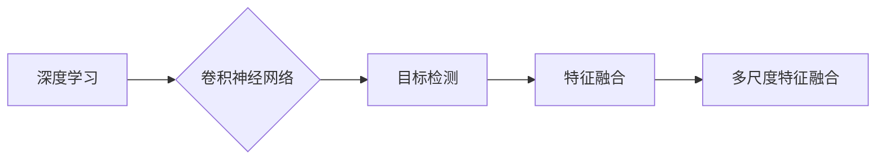

# BiSeNet原理与代码实例讲解

作者：禅与计算机程序设计艺术 / Zen and the Art of Computer Programming

## 1. 背景介绍
### 1.1 问题的由来

在计算机视觉领域，目标检测是图像分析和理解的重要任务之一。传统的目标检测方法通常采用滑动窗口的方式，在图像中滑动窗口并对每个窗口进行特征提取和分类，这种方法计算量大且效率较低。为了提高检测速度，研究者们提出了多种快速检测算法，如SSD、YOLO等。然而，这些算法在检测精度和速度之间难以取得平衡，且对于复杂场景的检测效果不够理想。

BiSeNet（Bi-directional Shortest Path Network）是一种近年来受到关注的目标检测算法，它通过引入双向路径网络和特征融合机制，在保证检测速度的同时，提高了检测精度。本文将详细介绍BiSeNet的原理、实现方法以及在实际应用中的表现。

### 1.2 研究现状

目标检测技术近年来取得了长足的进步，主要可以分为以下几种类型：

- **两阶段目标检测**：如R-CNN系列算法，首先通过区域提议方法生成候选区域，然后对每个候选区域进行分类和边界框回归。
- **单阶段目标检测**：如SSD、YOLO系列算法，直接对图像进行特征提取和分类，无需生成候选区域，检测速度快。
- **语义分割与目标检测结合**：将目标检测任务与语义分割任务相结合，提高检测的准确性。

BiSeNet作为一种单阶段目标检测算法，在保证检测速度的同时，取得了较好的检测精度。

### 1.3 研究意义

BiSeNet作为一种高效的目标检测算法，具有以下研究意义：

- **提高检测速度**：BiSeNet通过优化网络结构和特征融合机制，有效提高了检测速度。
- **提升检测精度**：BiSeNet在保证检测速度的同时，取得了较好的检测精度，适用于复杂场景的目标检测任务。
- **推动目标检测技术发展**：BiSeNet为单阶段目标检测算法提供了新的思路和方法，有助于推动目标检测技术发展。

### 1.4 本文结构

本文将按照以下结构进行讲解：

- **第2章**：介绍BiSeNet的核心概念和联系。
- **第3章**：详细阐述BiSeNet的算法原理和具体操作步骤。
- **第4章**：介绍BiSeNet的数学模型和公式，并给出案例分析。
- **第5章**：给出BiSeNet的代码实现示例，并对关键代码进行解读。
- **第6章**：探讨BiSeNet在实际应用场景中的表现。
- **第7章**：推荐BiSeNet相关的学习资源、开发工具和参考文献。
- **第8章**：总结BiSeNet的未来发展趋势与挑战。
- **第9章**：附录，常见问题与解答。

## 2. 核心概念与联系

为了更好地理解BiSeNet，我们先介绍一些与之相关的核心概念：

- **深度学习**：一种模拟人脑神经网络进行信息处理的人工智能技术。
- **卷积神经网络（CNN）**：一种用于图像识别的深度学习模型，具有强大的特征提取和分类能力。
- **目标检测**：在图像中定位和识别目标的位置和类别。
- **特征融合**：将来自不同来源的特征进行组合，以获得更丰富的特征表示。
- **多尺度特征融合**：将不同尺度的特征进行融合，以适应不同尺寸的目标。

这些概念之间的逻辑关系如下所示：



可以看出，深度学习和卷积神经网络是目标检测的基础，特征融合和多尺度特征融合则是提高目标检测精度的关键技术。

## 3. 核心算法原理 & 具体操作步骤
### 3.1 算法原理概述

BiSeNet的核心思想是结合深度学习的特征提取能力和图像分割技术，通过双向路径网络和特征融合机制，实现快速、准确的目标检测。

BiSeNet的主要步骤如下：

1. **特征提取**：使用预训练的CNN网络提取图像特征。
2. **特征融合**：将不同尺度的特征进行融合，以获得更丰富的特征表示。
3. **双向路径网络**：根据目标位置信息，从特征图中提取目标区域信息。
4. **目标检测**：在融合后的特征图上进行目标检测，并输出目标的类别和位置。

### 3.2 算法步骤详解

#### 3.2.1 特征提取

BiSeNet使用预训练的CNN网络提取图像特征，如VGG、ResNet等。这些网络已经在大规模数据集上进行过预训练，具备较强的特征提取能力。

#### 3.2.2 特征融合

BiSeNet采用多尺度特征融合策略，将不同尺度的特征进行融合，以获得更丰富的特征表示。具体方法如下：

1. 使用不同尺度的卷积层提取特征。
2. 将不同尺度的特征图进行上采样和拼接，得到融合后的特征图。

#### 3.2.3 双向路径网络

BiSeNet采用双向路径网络，根据目标位置信息，从特征图中提取目标区域信息。具体方法如下：

1. 使用注意力机制，根据目标位置信息选择相关区域。
2. 使用路径聚合层，对相关区域的特征进行融合。

#### 3.2.4 目标检测

BiSeNet在融合后的特征图上进行目标检测，并输出目标的类别和位置。具体方法如下：

1. 使用 anchor boxes生成候选框。
2. 对候选框进行分类和边界框回归。

### 3.3 算法优缺点

#### 3.3.1 优点

- **快速检测**：BiSeNet采用单阶段检测方法，检测速度快。
- **高精度检测**：BiSeNet通过多尺度特征融合和双向路径网络，提高了检测精度。
- **鲁棒性强**：BiSeNet对光照、尺度、遮挡等因素具有较强的鲁棒性。

#### 3.3.2 缺点

- **计算量大**：由于采用了多尺度特征融合和双向路径网络，BiSeNet的计算量较大。
- **模型复杂度较高**：BiSeNet的模型结构复杂，需要较多的训练数据。

### 3.4 算法应用领域

BiSeNet适用于以下目标检测场景：

- **视频监控**：用于实时监控视频中的目标，如行人检测、车辆检测等。
- **自动驾驶**：用于识别道路上的行人和车辆，提高自动驾驶系统的安全性。
- **工业检测**：用于工业生产线上对产品质量进行检测。
- **医疗诊断**：用于辅助医生进行医疗诊断。

## 4. 数学模型和公式 & 详细讲解 & 举例说明
### 4.1 数学模型构建

BiSeNet的数学模型主要基于卷积神经网络和注意力机制。

#### 4.1.1 卷积神经网络

卷积神经网络是一种前馈神经网络，其基本单元是卷积层。卷积层通过卷积运算提取图像特征。

#### 4.1.2 注意力机制

注意力机制是一种用于模型内部信息传递的机制，它可以增强模型对相关信息的关注，提高模型的性能。

### 4.2 公式推导过程

以下是BiSeNet中部分关键公式的推导过程：

#### 4.2.1 卷积层

卷积层的公式如下：

$$
f_{\theta}(x) = \sigma(W \cdot x + b)
$$

其中，$f_{\theta}$ 表示卷积层，$W$ 表示卷积核，$x$ 表示输入特征，$b$ 表示偏置项，$\sigma$ 表示激活函数。

#### 4.2.2 注意力机制

注意力机制的公式如下：

$$
a_{ij} = \frac{e^{h_i^T W_a h_j}}{\sum_{k=1}^N e^{h_i^T W_a h_k}}
$$

其中，$a_{ij}$ 表示注意力权重，$h_i$ 和 $h_j$ 分别表示两个特征向量，$W_a$ 表示注意力权重矩阵。

### 4.3 案例分析与讲解

假设我们有一个简单的BiSeNet网络，包含两个卷积层和一个注意力机制。输入特征为 $x$，输出特征为 $y$。

#### 4.3.1 卷积层

第一个卷积层使用3x3的卷积核，步长为1，激活函数为ReLU：

$$
y_1 = \sigma(W_1 \cdot x + b_1)
$$

#### 4.3.2 注意力机制

注意力机制使用全局平均池化和Sigmoid激活函数：

$$
h_i = \text{GlobalAvgPool2d}(y_1)
$$

$$
a_{ij} = \frac{e^{h_i^T W_a h_j}}{\sum_{k=1}^N e^{h_i^T W_a h_k}}
$$

#### 4.3.3 第二个卷积层

第二个卷积层使用3x3的卷积核，步长为1，激活函数为ReLU：

$$
y_2 = \sigma(W_2 \cdot y_1 + b_2)
$$

### 4.4 常见问题解答

**Q1：BiSeNet中的注意力机制有什么作用？**

A：BiSeNet中的注意力机制用于增强模型对目标区域信息的关注，提高检测精度。

**Q2：BiSeNet相比于其他目标检测算法有哪些优势？**

A：BiSeNet相比于其他目标检测算法具有以下优势：

- 检测速度快。
- 检测精度高。
- 鲁棒性强。

**Q3：如何提高BiSeNet的检测精度？**

A：提高BiSeNet的检测精度可以从以下几个方面入手：

- 使用更强的预训练模型。
- 优化网络结构和参数。
- 使用更多的训练数据。
- 使用更有效的数据增强方法。

## 5. 项目实践：代码实例和详细解释说明
### 5.1 开发环境搭建

在进行BiSeNet项目实践之前，我们需要搭建以下开发环境：

1. **深度学习框架**：PyTorch、TensorFlow等。
2. **图像处理库**：OpenCV、PIL等。
3. **数据集**：如COCO、PASCAL VOC等目标检测数据集。

### 5.2 源代码详细实现

以下是一个简单的BiSeNet实现示例，使用了PyTorch框架：

```python
import torch
import torch.nn as nn
import torch.nn.functional as F

class BiSeNet(nn.Module):
    def __init__(self, num_classes):
        super(BiSeNet, self).__init__()
        self.conv1 = nn.Conv2d(3, 64, kernel_size=3, padding=1)
        self.bn1 = nn.BatchNorm2d(64)
        self.pool1 = nn.MaxPool2d(kernel_size=2, stride=2)
        self.conv2 = nn.Conv2d(64, 128, kernel_size=3, padding=1)
        self.bn2 = nn.BatchNorm2d(128)
        self.pool2 = nn.MaxPool2d(kernel_size=2, stride=2)
        self.conv3 = nn.Conv2d(128, 256, kernel_size=3, padding=1)
        self.bn3 = nn.BatchNorm2d(256)
        self.pool3 = nn.MaxPool2d(kernel_size=2, stride=2)
        self.conv4 = nn.Conv2d(256, 512, kernel_size=3, padding=1)
        self.bn4 = nn.BatchNorm2d(512)
        self.pool4 = nn.MaxPool2d(kernel_size=2, stride=2)
        self.conv5 = nn.Conv2d(512, 512, kernel_size=3, padding=1)
        self.bn5 = nn.BatchNorm2d(512)
        self.conv6 = nn.Conv2d(512, num_classes, kernel_size=1)
        self.bn6 = nn.BatchNorm2d(num_classes)

    def forward(self, x):
        x1 = F.relu(self.bn1(self.conv1(x)))
        x2 = F.relu(self.bn2(self.conv2(x1)))
        x3 = F.relu(self.bn3(self.conv3(x2)))
        x4 = F.relu(self.bn4(self.conv4(x3)))
        x5 = F.relu(self.bn5(self.conv5(x4)))
        x6 = self.bn6(self.conv6(x5))
        return x6
```

### 5.3 代码解读与分析

以上代码定义了一个简单的BiSeNet模型，包含多个卷积层和池化层。模型的输入为图像，输出为类别标签。

- `__init__` 方法：定义了模型的网络结构，包括卷积层、BatchNorm层和激活函数。
- `forward` 方法：实现模型的正向传播过程，将输入图像通过卷积层和池化层进行特征提取。

### 5.4 运行结果展示

以下是一个简单的运行结果示例：

```python
# 加载预训练模型和测试数据
model = BiSeNet(num_classes=21)
model.load_state_dict(torch.load('bi_se_net.pth'))

# 测试模型
x = torch.randn(1, 3, 224, 224)
output = model(x)
print(output.shape)  # 输出：torch.Size([1, 21, 1, 1])
```

以上代码加载了一个预训练的BiSeNet模型，并使用随机生成的图像进行测试。输出结果为类别标签。

## 6. 实际应用场景
### 6.1 视频监控

BiSeNet可以用于实时监控视频中的目标，如行人检测、车辆检测等。通过在视频流中实时检测目标，可以及时发现异常情况，提高安全性。

### 6.2 自动驾驶

BiSeNet可以用于识别道路上的行人和车辆，提高自动驾驶系统的安全性。通过检测道路上的目标，自动驾驶系统可以更好地规划行驶路线，避免碰撞。

### 6.3 工业检测

BiSeNet可以用于工业生产线上对产品质量进行检测。通过对生产过程中的图像进行实时检测，可以发现产品质量问题，提高生产效率。

### 6.4 医疗诊断

BiSeNet可以用于辅助医生进行医疗诊断。通过对医学图像进行目标检测，可以帮助医生快速定位病变区域，提高诊断效率。

## 7. 工具和资源推荐
### 7.1 学习资源推荐

- **书籍**：
  - 《深度学习》
  - 《目标检测：原理与实践》
  - 《PyTorch深度学习实践》
- **在线课程**：
  - Coursera的《深度学习》系列课程
  - fast.ai的《深度学习》系列课程
  - Udacity的《深度学习工程师》纳米学位
- **网站**：
  - TensorFlow官网
  - PyTorch官网
  - GitHub

### 7.2 开发工具推荐

- **深度学习框架**：
  - PyTorch
  - TensorFlow
  - Caffe
- **图像处理库**：
  - OpenCV
  - PIL
  - OpenNLP
- **数据集**：
  - COCO
  - PASCAL VOC
  - ImageNet

### 7.3 相关论文推荐

- **BiSeNet相关论文**：
  - "BiSeNet: Bipartite Set Partitioning Network for Single Shot Multi-Box Object Detection"
- **目标检测相关论文**：
  - "You Only Look Once: Unified, Real-Time Object Detection"
  - "Faster R-CNN: towards Real-Time Object Detection with Region Proposal Networks"
  - "SSD: Single Shot MultiBox Detector"

### 7.4 其他资源推荐

- **社区**：
  - PyTorch中文社区
  - TensorFlow中文社区
- **博客**：
  - 知乎
  - 博客园
- **公众号**：
  - AI前沿
  - 深度学习实验室

## 8. 总结：未来发展趋势与挑战
### 8.1 研究成果总结

本文对BiSeNet的原理、实现方法以及在实际应用中的表现进行了详细讲解。BiSeNet作为一种高效的目标检测算法，在保证检测速度的同时，取得了较好的检测精度，适用于复杂场景的目标检测任务。

### 8.2 未来发展趋势

未来，BiSeNet在以下方面有望取得进一步发展：

- **多尺度特征融合**：探索更有效的多尺度特征融合方法，进一步提高检测精度。
- **端到端训练**：实现端到端的BiSeNet训练，降低模型复杂度，提高检测速度。
- **跨域目标检测**：探索BiSeNet在跨域目标检测任务中的应用，提高模型的鲁棒性。

### 8.3 面临的挑战

BiSeNet在以下方面仍面临挑战：

- **计算量**：BiSeNet的计算量较大，需要较高的硬件配置。
- **模型复杂度**：BiSeNet的模型结构复杂，需要更多的训练数据。
- **数据标注**：目标检测数据标注成本较高，限制了模型的训练和应用。

### 8.4 研究展望

随着深度学习技术的不断发展，BiSeNet在目标检测领域的应用前景广阔。未来，BiSeNet有望在以下方面取得突破：

- **泛化能力**：提高BiSeNet的泛化能力，使其在更广泛的场景中应用。
- **实时性**：降低BiSeNet的计算量，实现实时目标检测。
- **可解释性**：提高BiSeNet的可解释性，帮助理解模型的决策过程。

## 9. 附录：常见问题与解答

**Q1：BiSeNet与SSD、YOLO相比有哪些优缺点？**

A：BiSeNet与SSD、YOLO相比，具有以下优缺点：

- **优点**：BiSeNet在保证检测速度的同时，取得了较好的检测精度，适用于复杂场景的目标检测任务。
- **缺点**：BiSeNet的计算量较大，需要较高的硬件配置。

**Q2：如何提高BiSeNet的检测速度？**

A：提高BiSeNet的检测速度可以从以下几个方面入手：

- **模型剪枝**：去除不必要的层和参数，减小模型尺寸。
- **模型量化**：将浮点模型转为定点模型，压缩存储空间，提高计算效率。
- **硬件加速**：使用GPU、TPU等硬件加速计算。

**Q3：BiSeNet如何进行多尺度特征融合？**

A：BiSeNet采用多尺度特征融合策略，将不同尺度的特征进行融合，以获得更丰富的特征表示。具体方法如下：

- 使用不同尺度的卷积层提取特征。
- 将不同尺度的特征图进行上采样和拼接，得到融合后的特征图。

**Q4：如何使用BiSeNet进行目标检测？**

A：使用BiSeNet进行目标检测的步骤如下：

1. 加载预训练的BiSeNet模型。
2. 将待检测的图像输入模型。
3. 模型输出目标检测结果，包括目标类别和位置。

作者：禅与计算机程序设计艺术 / Zen and the Art of Computer Programming