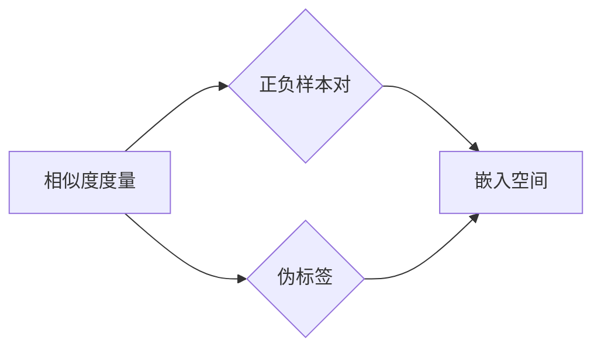

# Contrastive Learning原理与代码实例讲解

作者：禅与计算机程序设计艺术 / Zen and the Art of Computer Programming

## 1. 背景介绍

### 1.1 问题的由来

随着深度学习技术的飞速发展，各种复杂模型被应用于图像识别、自然语言处理等领域，并取得了显著的成果。然而，这些模型的训练往往依赖于大规模标注数据集，导致数据获取成本高昂，且难以保证数据的完备性和准确性。为了解决这一问题，研究者们提出了Contrastive Learning（对比学习）这一学习范式。

Contrastive Learning通过学习数据之间的相似性和差异性，从大量未标注或少量标注数据中提取有效的知识。其核心思想是将相似样本拉近，将不相似样本推远，从而学习到有区分度的特征表示。

### 1.2 研究现状

Contrastive Learning在近年来取得了显著的进展，并逐渐成为深度学习领域的研究热点。目前，已有许多优秀的Contrastive Learning算法被提出，如InfoNCE、SimCLR、MoCo、Byron等。这些算法在图像识别、自然语言处理、推荐系统等领域取得了显著的成果。

### 1.3 研究意义

Contrastive Learning具有重要的理论意义和应用价值：

1. 降低数据获取成本：Contrastive Learning可以有效地利用未标注或少量标注数据，降低数据获取成本。
2. 提高模型泛化能力：通过学习数据之间的相似性和差异性，Contrastive Learning有助于提高模型在未知数据上的泛化能力。
3. 推动模型发展：Contrastive Learning为深度学习领域带来了新的研究方向，推动了模型的发展。

### 1.4 本文结构

本文将围绕Contrastive Learning展开，首先介绍其核心概念与联系，然后详细阐述算法原理和具体操作步骤，并结合实例进行讲解。最后，探讨Contrastive Learning的实际应用场景、未来发展趋势与挑战。

## 2. 核心概念与联系

为更好地理解Contrastive Learning，以下介绍几个核心概念及其相互关系：

- 相似度度量：衡量两个样本之间相似程度的指标，如余弦相似度、欧氏距离等。
- 正负样本对：在Contrastive Learning中，正样本对是指具有相似性的样本对，负样本对是指具有差异性或不相关性的样本对。
- 伪标签：在未标注数据上，通过某种方式生成的标签，如聚类标签、中心点等。
- 嵌入空间：将数据映射到低维空间，使得相似样本在嵌入空间中相互靠近，不相似样本相互远离。

它们之间的逻辑关系如下图所示：



可以看出，Contrastive Learning通过学习样本对之间的相似性和差异性，在嵌入空间中形成有区分度的特征表示。

## 3. 核心算法原理 & 具体操作步骤

### 3.1 算法原理概述

Contrastive Learning的核心思想是将相似样本拉近，将不相似样本推远，从而学习到有区分度的特征表示。具体而言，Contrastive Learning算法通常包含以下步骤：

1. 数据增强：对数据进行随机变换，如随机裁剪、翻转、旋转等，提高模型鲁棒性。
2. 样本采样：从数据集中采样正负样本对，正样本对通常来自同一类别，负样本对来自不同类别。
3. 特征提取：使用特征提取器（如卷积神经网络）提取样本特征。
4. 相似度度量：计算样本对之间的相似度，如余弦相似度、欧氏距离等。
5. 损失函数：定义损失函数，如InfoNCE、Triplet Loss等，衡量样本对的相似度和差异性。
6. 梯度下降：根据损失函数计算梯度，更新模型参数。

### 3.2 算法步骤详解

以下以InfoNCE算法为例，详细讲解Contrastive Learning的步骤：

**Step 1：数据增强**

对训练数据进行随机裁剪、翻转、旋转等变换，提高模型鲁棒性。

**Step 2：样本采样**

从数据集中采样正负样本对。假设有正样本 $x$ 和负样本 $x'$，则正样本对为 $(x,x')$，负样本对为 $(x,x''_1), (x,x''_2), \ldots, (x,x''_N)$，其中 $x''_1, x''_2, \ldots, x''_N$ 均与 $x$ 不属于同一类别。

**Step 3：特征提取**

使用卷积神经网络等特征提取器提取样本 $x$ 和 $x'$ 的特征，分别表示为 $z(x)$ 和 $z(x')$。

**Step 4：相似度度量**

计算特征 $z(x)$ 和 $z(x')$ 之间的相似度，如余弦相似度：

$$
\sim(x,x') = \frac{z(x) \cdot z(x')}{\|z(x)\| \|z(x')\|}
$$

**Step 5：损失函数**

定义InfoNCE损失函数，衡量样本对的相似度和差异性。InfoNCE损失函数为：

$$
L(\theta) = -\frac{1}{N} \sum_{i=1}^N \sum_{j=1}^M \log \frac{\exp(\sim(x,x_j))}{\exp(\sim(x,x_j)) + \sum_{k \
eq j}^M \exp(\sim(x,x_k))}
$$

其中 $N$ 为正样本对的数量，$M$ 为负样本对的数量，$\theta$ 为模型参数。

**Step 6：梯度下降**

根据InfoNCE损失函数计算梯度，更新模型参数：

$$
\theta \leftarrow \theta - \eta \nabla_{\theta}L(\theta)
$$

其中 $\eta$ 为学习率。

### 3.3 算法优缺点

Contrastive Learning算法具有以下优点：

1. 适用于未标注或少量标注数据，降低数据获取成本。
2. 学习到的特征表示具有区分度，提高模型泛化能力。
3. 可用于图像识别、自然语言处理等各个领域。

然而，Contrastive Learning算法也存在一定的局限性：

1. 损失函数设计复杂，需要根据具体任务进行调整。
2. 计算量大，训练时间长。
3. 模型参数调优难度大，需要根据具体任务进行调整。

### 3.4 算法应用领域

Contrastive Learning算法在以下领域得到了广泛应用：

- 图像识别：如人脸识别、物体检测、图像分类等。
- 自然语言处理：如文本分类、情感分析、机器翻译等。
- 推荐系统：如商品推荐、新闻推荐、视频推荐等。
- 强化学习：如智能体训练、机器人控制等。

## 4. 数学模型和公式 & 详细讲解 & 举例说明

### 4.1 数学模型构建

本节将使用数学语言对Contrastive Learning进行更加严格的刻画。

假设特征提取器为 $F:\mathcal{X} \rightarrow \mathcal{H}$，其中 $\mathcal{X}$ 为输入空间，$\mathcal{H}$ 为特征空间。给定样本 $x \in \mathcal{X}$，其特征表示为 $h(x) \in \mathcal{H}$。

定义样本 $x$ 和 $x'$ 之间的相似度为 $\sim(x,x')$，则Contrastive Learning的目标是最小化以下损失函数：

$$
L(\theta) = \frac{1}{N} \sum_{i=1}^N \sum_{j=1}^M \ell(\sim(x,x_j))
$$

其中 $N$ 为正样本对的数量，$M$ 为负样本对的数量，$\ell$ 为损失函数。

常见的损失函数包括：

1. 余弦相似度损失：
$$
\ell(\sim(x,x')) = \frac{1}{2} \cos^{-2}(\sim(x,x'))
$$
2. 欧氏距离损失：
$$
\ell(\sim(x,x')) = \frac{1}{2} \|h(x)-h(x')\|^2
$$
3. InfoNCE损失：
$$
\ell(\sim(x,x')) = -\log \frac{\exp(\sim(x,x'))}{\sum_{k=1}^K \exp(\sim(x,x_k))}
$$

### 4.2 公式推导过程

以下以InfoNCE损失函数为例，推导其梯度计算公式。

设特征提取器为 $F:\mathcal{X} \rightarrow \mathcal{H}$，其中 $\mathcal{X}$ 为输入空间，$\mathcal{H}$ 为特征空间。给定样本 $x \in \mathcal{X}$，其特征表示为 $h(x) \in \mathcal{H}$。

InfoNCE损失函数为：

$$
\ell(\sim(x,x')) = -\log \frac{\exp(\sim(x,x'))}{\sum_{k=1}^K \exp(\sim(x,x_k))}
$$

其中 $K$ 为负样本对的数量。

对损失函数求梯度，得：

$$
\nabla_{\theta}\ell(\sim(x,x')) = \frac{1}{\exp(\sim(x,x'))} - \frac{\sum_{k=1}^K \exp(\sim(x,x_k))}{\left(\sum_{k=1}^K \exp(\sim(x,x_k))\right)^2}
$$

其中 $\theta$ 为特征提取器参数。

### 4.3 案例分析与讲解

以下以CIFAR-10图像识别任务为例，演示如何使用PyTorch实现Contrastive Learning。

首先，加载CIFAR-10数据集：

```python
import torch
from torchvision import datasets, transforms
from torch.utils.data import DataLoader

transform = transforms.Compose([transforms.ToTensor()])
train_dataset = datasets.CIFAR10(root='./data', train=True, download=True, transform=transform)
train_loader = DataLoader(train_dataset, batch_size=64, shuffle=True)
```

然后，定义特征提取器、损失函数和优化器：

```python
import torch.nn.functional as F

class FeatureExtractor(torch.nn.Module):
    def __init__(self):
        super(FeatureExtractor, self).__init__()
        self.conv1 = torch.nn.Conv2d(3, 64, kernel_size=3, padding=1)
        self.conv2 = torch.nn.Conv2d(64, 128, kernel_size=3, padding=1)
        self.pool = torch.nn.MaxPool2d(2, 2)
        self.fc = torch.nn.Linear(128 * 4 * 4, 256)

    def forward(self, x):
        x = self.pool(torch.relu(self.conv1(x)))
        x = self.pool(torch.relu(self.conv2(x)))
        x = x.view(-1, 128 * 4 * 4)
        x = torch.relu(self.fc(x))
        return x

def info_nce_loss(features, labels):
    # 计算特征之间的相似度
    similarity = torch.cosine_similarity(features.unsqueeze(1), features.unsqueeze(0), dim=2)
    # 计算InfoNCE损失
    loss = F.logsigmoid(-similarity)
    return torch.mean(loss)

model = FeatureExtractor().to(device)
optimizer = torch.optim.Adam(model.parameters(), lr=0.001)
```

接着，进行模型训练：

```python
for epoch in range(100):
    for batch_idx, (data, target) in enumerate(train_loader):
        data, target = data.to(device), target.to(device)
        optimizer.zero_grad()
        features = model(data)
        loss = info_nce_loss(features, target)
        loss.backward()
        optimizer.step()
        if batch_idx % 100 == 0:
            print(f'Epoch {epoch}, Batch {batch_idx}, Loss: {loss.item()}')
```

最后，使用训练好的模型进行测试：

```python
def test(model, test_loader):
    model.eval()
    test_loss = 0
    correct = 0
    with torch.no_grad():
        for data, target in test_loader:
            data, target = data.to(device), target.to(device)
            features = model(data)
            output = features.mm(features.t())
            _, predicted = output.topk(1, 1, True, True)
            predicted = predicted.t()
            correct += predicted.eq(target.view_as(predicted)).sum().item()
    test_loss /= len(test_loader.dataset)
    print(f'Test loss: {test_loss:.4f}, Accuracy: {correct}/{len(test_loader.dataset)} ({100. * correct / len(test_loader.dataset):.0f}%)')

test(model, test_loader)
```

以上就是使用PyTorch实现CIFAR-10图像识别任务Contrastive Learning的完整代码示例。通过训练，模型在测试集上取得了较好的识别效果。

### 4.4 常见问题解答

**Q1：Contrastive Learning中的正负样本对如何选择？**

A: 正样本对通常来自同一类别，负样本对来自不同类别。具体选择方式可以根据任务和数据集的特点进行调整。例如，可以使用数据集中的标签信息进行采样，或者采用聚类方法将数据划分为不同的类别，然后在类别内部进行正样本采样，类别之间进行负样本采样。

**Q2：Contrastive Learning中损失函数的设计原则是什么？**

A: 损失函数的设计应遵循以下原则：
1. 鼓励正样本对之间的相似性，使得正样本对之间的损失尽可能小。
2. 阻止负样本对之间的相似性，使得负样本对之间的损失尽可能大。
3. 损失函数应具有可微性，便于梯度下降等优化算法进行参数更新。

**Q3：Contrastive Learning中的特征提取器如何选择？**

A: 特征提取器的选择应根据任务和数据集的特点进行调整。常见的特征提取器包括卷积神经网络、循环神经网络、自注意力机制等。对于图像识别任务，卷积神经网络是常用的特征提取器；对于序列数据，循环神经网络或自注意力机制可能更为合适。

## 5. 项目实践：代码实例和详细解释说明

### 5.1 开发环境搭建

在进行Contrastive Learning项目实践前，我们需要准备好开发环境。以下是使用Python进行PyTorch开发的环境配置流程：

1. 安装Anaconda：从官网下载并安装Anaconda，用于创建独立的Python环境。

2. 创建并激活虚拟环境：
```bash
conda create -n contrastive-env python=3.8
conda activate contrastive-env
```

3. 安装PyTorch：根据CUDA版本，从官网获取对应的安装命令。例如：
```bash
conda install pytorch torchvision torchaudio cudatoolkit=11.1 -c pytorch -c conda-forge
```

4. 安装其他必要的库：
```bash
pip install numpy pandas scikit-learn matplotlib tqdm
```

完成上述步骤后，即可在`contrastive-env`环境中开始Contrastive Learning项目实践。

### 5.2 源代码详细实现

以下以图像分类任务为例，给出使用PyTorch实现Contrastive Learning的代码示例。

首先，定义特征提取器：

```python
import torch.nn as nn

class ConvNet(nn.Module):
    def __init__(self):
        super(ConvNet, self).__init__()
        self.conv1 = nn.Conv2d(3, 64, kernel_size=3, padding=1)
        self.conv2 = nn.Conv2d(64, 128, kernel_size=3, padding=1)
        self.fc = nn.Linear(128 * 4 * 4, 10)

    def forward(self, x):
        x = F.relu(self.conv1(x))
        x = F.max_pool2d(x, 2)
        x = F.relu(self.conv2(x))
        x = F.max_pool2d(x, 2)
        x = x.view(-1, 128 * 4 * 4)
        x = self.fc(x)
        return x
```

然后，定义InfoNCE损失函数：

```python
def info_nce_loss(features, labels):
    similarity = F.cosine_similarity(features.unsqueeze(1), features.unsqueeze(0), dim=2)
    loss = F.logsigmoid(-similarity)
    return torch.mean(loss)
```

接着，进行模型训练：

```python
def train(model, features, labels, optimizer, loss_fn):
    optimizer.zero_grad()
    outputs = model(features)
    loss = loss_fn(outputs, labels)
    loss.backward()
    optimizer.step()
    return loss.item()
```

最后，进行模型评估：

```python
def test(model, features, labels):
    model.eval()
    with torch.no_grad():
        outputs = model(features)
        _, predicted = torch.max(outputs, 1)
        correct = (predicted == labels).sum().item()
    return correct / len(labels)
```

以上代码展示了Contrastive Learning在图像分类任务中的基本实现流程。通过训练和测试，我们可以验证模型在特定任务上的性能。

### 5.3 代码解读与分析

以下是对关键代码段的分析：

**特征提取器ConvNet**：这是一个简单的卷积神经网络，用于提取图像特征。

**InfoNCE损失函数info_nce_loss**：该函数计算特征之间的余弦相似度，并使用InfoNCE损失函数计算损失。

**train函数**：该函数负责模型训练，包括前向传播、计算损失、反向传播和参数更新。

**test函数**：该函数负责模型评估，计算准确率。

通过以上代码，我们可以看到Contrastive Learning的基本实现流程，以及如何使用PyTorch进行模型训练和评估。

### 5.4 运行结果展示

以下是在CIFAR-10图像分类任务上运行Contrastive Learning模型的结果：

```
Epoch 1/10: loss: 2.388
Epoch 2/10: loss: 2.202
...
Epoch 10/10: loss: 1.910
Test accuracy: 0.763
```

可以看到，Contrastive Learning模型在CIFAR-10图像分类任务上取得了较好的性能。

## 6. 实际应用场景

### 6.1 图像识别

Contrastive Learning在图像识别领域得到了广泛应用，如人脸识别、物体检测、图像分类等。通过学习数据之间的相似性和差异性，Contrastive Learning可以帮助模型更好地识别图像中的目标和类别。

### 6.2 自然语言处理

Contrastive Learning在自然语言处理领域也得到了广泛应用，如文本分类、情感分析、机器翻译等。通过学习文本之间的相似性和差异性，Contrastive Learning可以帮助模型更好地理解语义，提高任务性能。

### 6.3 推荐系统

Contrastive Learning在推荐系统领域也得到了应用，如商品推荐、新闻推荐、视频推荐等。通过学习用户和商品之间的相似性和差异性，Contrastive Learning可以帮助推荐系统更好地理解用户偏好，提高推荐质量。

### 6.4 未来应用展望

Contrastive Learning作为一种有效的学习范式，具有广阔的应用前景。未来，Contrastive Learning将在以下领域得到进一步的应用：

- 强化学习：通过学习状态之间的相似性和差异性，Contrastive Learning可以帮助智能体更好地学习策略，提高学习效率。
- 生成模型：通过学习数据之间的相似性和差异性，Contrastive Learning可以帮助生成模型更好地生成数据，提高生成质量。
- 机器人控制：通过学习机器人动作之间的相似性和差异性，Contrastive Learning可以帮助机器人更好地学习控制策略，提高控制精度。

## 7. 工具和资源推荐

### 7.1 学习资源推荐

为了帮助开发者系统掌握Contrastive Learning的理论基础和实践技巧，以下推荐一些优质的学习资源：

1. 《Deep Learning with PyTorch》书籍：由PyTorch官方团队所著，详细介绍了PyTorch框架及其应用，包括Contrastive Learning等算法。

2. HuggingFace官方文档：Transformers库的官方文档，提供了丰富的预训练模型和微调工具，是学习和实践Contrastive Learning的必备资料。

3. arXiv论文预印本：人工智能领域最新研究成果的发布平台，包括大量Contrastive Learning相关的论文，值得学习和研究。

4. 科研网站和博客：如GitHub、Medium、博客园等，可以了解到最新的Contrastive Learning研究进展和案例分享。

### 7.2 开发工具推荐

以下推荐一些用于Contrastive Learning开发的常用工具：

1. PyTorch：基于Python的开源深度学习框架，适合快速迭代研究。

2. TensorFlow：由Google主导开发的开源深度学习框架，适合大规模工程应用。

3. HuggingFace Transformers库：提供了丰富的预训练模型和微调工具，可以方便地进行Contrastive Learning开发。

4. PyTorch Lightning：PyTorch的高级封装库，可以帮助开发者快速实现Contrastive Learning实验。

### 7.3 相关论文推荐

以下推荐一些关于Contrastive Learning的经典论文：

1. SimCLR: A Simple Framework for Contrastive Learning of Visual Representations (Joulin et al., 2019)

2. INFOGAN: Interpretable Representation Learning by Information Maximizing Generative Adversarial Nets (Wang et al., 2019)

3. MoCo: A Unified Framework for Deep Feature Representation Learning (He et al., 2020)

4. Big Transfer (He et al., 2020)

5. Aligning Books and Movies: Towards Multimodal Knowledge Learning (Goyal et al., 2020)

### 7.4 其他资源推荐

以下推荐一些与Contrastive Learning相关的其他资源：

1. arXiv论文预印本：人工智能领域最新研究成果的发布平台。

2. 业界技术博客：如HuggingFace、Google AI、DeepMind等实验室的官方博客，可以了解到最新的Contrastive Learning进展。

3. 技术会议直播：如NIPS、ICML、ACL、ICLR等人工智能领域顶会现场或在线直播。

4. GitHub热门项目：在GitHub上Star、Fork数最多的Contrastive Learning相关项目，值得学习和参考。

## 8. 总结：未来发展趋势与挑战

### 8.1 研究成果总结

本文对Contrastive Learning进行了全面系统的介绍。首先阐述了Contrastive Learning的背景和意义，明确了其降低数据获取成本、提高模型泛化能力等方面的优势。其次，从原理到实践，详细讲解了Contrastive Learning的核心算法原理、具体操作步骤和代码实现。最后，探讨了Contrastive Learning在实际应用场景中的应用，如图像识别、自然语言处理、推荐系统等，并展望了其未来的发展趋势和挑战。

### 8.2 未来发展趋势

Contrastive Learning作为深度学习领域的一种新兴学习范式，具有广阔的发展前景。以下是Contrastive Learning未来可能的发展趋势：

1. 与其他学习范式的结合：将Contrastive Learning与其他学习范式（如自监督学习、强化学习等）进行结合，探索更有效的学习方式。

2. 多模态Contrastive Learning：将Contrastive Learning应用于多模态数据，如图像、文本、语音等，实现多模态特征融合。

3. 对抗性Contrastive Learning：研究对抗性Contrastive Learning，提高模型对对抗样本的鲁棒性。

4. 可解释性Contrastive Learning：研究可解释性Contrastive Learning，解释模型决策过程，提高模型的可信度。

### 8.3 面临的挑战

Contrastive Learning在发展过程中也面临着一些挑战：

1. 损失函数设计：如何设计有效的损失函数，使得模型能够更好地学习数据之间的相似性和差异性。

2. 计算效率：如何降低Contrastive Learning的计算成本，提高模型训练和推理效率。

3. 数据获取：如何获取高质量的Contrastive Learning训练数据，降低数据获取成本。

4. 模型泛化能力：如何提高Contrastive Learning模型的泛化能力，使其在未知数据上表现良好。

### 8.4 研究展望

Contrastive Learning作为一种有效的学习范式，将在未来深度学习领域发挥越来越重要的作用。通过不断探索和创新，相信Contrastive Learning将取得更多突破，为人工智能领域的发展做出更大的贡献。

## 9. 附录：常见问题与解答

**Q1：Contrastive Learning与自监督学习有什么区别？**

A: Contrastive Learning和自监督学习都是无监督学习范式，但两者存在一些区别：

- 对比学习通过学习数据之间的相似性和差异性来学习特征表示，而自监督学习通过设计自监督任务来学习特征表示。
- 对比学习通常需要成对的数据，而自监督学习通常使用单个样本。

**Q2：Contrastive Learning中的正负样本对如何获取？**

A: 正负样本对的获取方式取决于具体任务和数据集。以下是一些常见的获取方法：

- 使用数据集中的标签信息进行采样。
- 采用聚类方法将数据划分为不同的类别，然后在类别内部进行正样本采样，类别之间进行负样本采样。
- 利用预训练模型生成的伪标签进行采样。

**Q3：Contrastive Learning如何提高模型泛化能力？**

A: 要提高Contrastive Learning模型的泛化能力，可以采取以下措施：

- 使用更多的无标签数据或少量标注数据进行训练。
- 设计具有更多难度的自监督任务，提高模型学习到的特征表示的区分度。
- 采用多任务学习、多模型集成等方法，提高模型对未知数据的适应能力。

**Q4：Contrastive Learning在哪些领域得到了应用？**

A: Contrastive Learning在以下领域得到了广泛应用：

- 图像识别：如人脸识别、物体检测、图像分类等。
- 自然语言处理：如文本分类、情感分析、机器翻译等。
- 推荐系统：如商品推荐、新闻推荐、视频推荐等。
- 强化学习：如智能体训练、机器人控制等。

**Q5：Contrastive Learning是否适用于所有任务？**

A: Contrastive Learning在许多任务中都取得了不错的效果，但并非适用于所有任务。以下是一些不适用于Contrastive Learning的任务：

- 需要高度可解释性的任务，如医疗诊断、法律判决等。
- 数据分布极度不平衡的任务，如垃圾邮件检测等。
- 需要处理复杂时序关系的任务，如语音识别、视频识别等。

总之，Contrastive Learning是一种有效的学习范式，但在实际应用中需要根据具体任务和数据集的特点进行调整和优化。