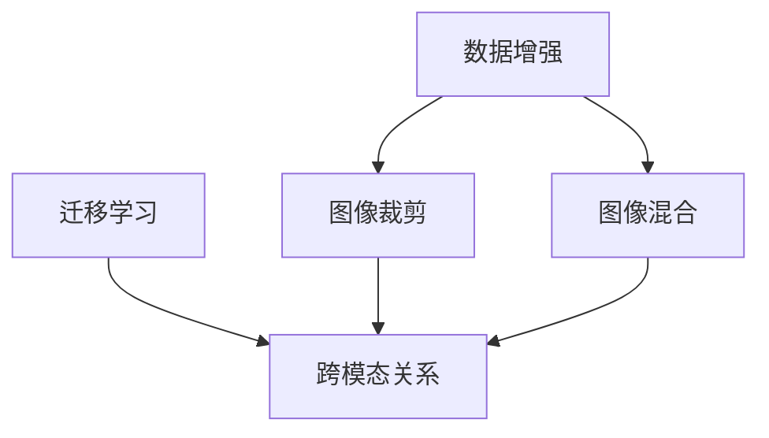

# Cutmix原理与代码实例讲解

作者：禅与计算机程序设计艺术 / Zen and the Art of Computer Programming

## 1. 背景介绍
### 1.1 问题的由来

在计算机视觉领域，数据增强是一种常用的技术，用于扩充训练数据集，提高模型泛化能力。常见的图像数据增强方法包括旋转、翻转、缩放、裁剪、颜色变换等。然而，这些方法往往只对图像进行像素级别的操作，难以模拟真实场景中图像之间的复杂关系。

为了更好地模拟真实场景，研究人员提出了CutMix数据增强方法。CutMix通过在图像上进行裁剪和混合操作，将不同图像的部分区域进行拼接，从而生成新的数据样本。这种方法能够模拟真实场景中图像间的跨模态关系，有效提高模型在迁移学习等任务上的性能。

### 1.2 研究现状

CutMix方法自从提出以来，在图像分类、目标检测、语义分割等任务上取得了显著的性能提升。近年来，随着深度学习技术的快速发展，CutMix方法也得到了广泛的关注和研究。许多研究人员对其原理进行了改进和扩展，提出了多种变体，如CutPaste、Mixup等。

### 1.3 研究意义

CutMix方法作为一种有效的数据增强技术，具有以下研究意义：

1. 提高模型泛化能力：通过模拟真实场景中图像间的跨模态关系，CutMix能够有效提高模型在迁移学习等任务上的性能。
2. 扩充训练数据集：在有限的训练数据下，CutMix可以生成新的数据样本，扩充训练数据集，提高模型泛化能力。
3. 推动数据增强技术发展：CutMix方法为数据增强技术提供了新的思路，推动了数据增强技术的研究和发展。

### 1.4 本文结构

本文将介绍CutMix方法的原理、算法步骤、代码实现以及实际应用场景。具体内容安排如下：

- 第2部分：介绍CutMix的核心概念和联系。
- 第3部分：详细讲解CutMix的算法原理和具体操作步骤。
- 第4部分：分析CutMix的优缺点和应用领域。
- 第5部分：给出CutMix的代码实现示例，并对关键代码进行解读。
- 第6部分：探讨CutMix方法在实际应用场景中的效果和案例。
- 第7部分：推荐CutMix相关的学习资源、开发工具和参考文献。
- 第8部分：总结全文，展望CutMix技术的未来发展趋势与挑战。
- 第9部分：附录，常见问题与解答。

## 2. 核心概念与联系

为了更好地理解CutMix方法，本节将介绍几个相关的核心概念：

- 数据增强（Data Augmentation）：通过对原始数据进行变换和操作，生成新的数据样本，用于模型训练和评估。
- 图像裁剪（Image Cropping）：从图像中裁剪出一定大小的区域，用于生成新的图像数据。
- 图像混合（Image Mixing）：将不同图像的部分区域进行拼接，生成新的图像数据。
- 迁移学习（Transfer Learning）：利用源域数据训练模型，并将其迁移到目标域数据上。
- 跨模态关系（Cross-modal Relationship）：不同模态数据之间的关联和相互作用。

它们之间的逻辑关系如下所示：



可以看出，数据增强是图像裁剪和图像混合的基础，而跨模态关系则是迁移学习的核心。CutMix方法通过模拟真实场景中图像间的跨模态关系，有效提高了模型的泛化能力。

## 3. 核心算法原理 & 具体操作步骤
### 3.1 算法原理概述

CutMix方法的核心思想是：在图像上进行裁剪和混合操作，将不同图像的部分区域进行拼接，生成新的数据样本。具体步骤如下：

1. 从源图像库中随机选择两张图像作为输入。
2. 随机选择两张图像中的裁剪框大小和位置。
3. 将裁剪框内的图像区域进行混合，生成新的混合图像。
4. 将混合图像作为模型的输入进行训练。

### 3.2 算法步骤详解

下面是CutMix方法的详细步骤：

1. **数据准备**：从源图像库中随机选择两张图像 $A$ 和 $B$，大小分别为 $W \times H$ 和 $W' \times H'$。

2. **随机裁剪框**：在图像 $A$ 和 $B$ 上随机选择一个裁剪框 $F_A$ 和 $F_B$，大小分别为 $C \times C$。裁剪框的位置和大小可以根据需要进行调整。

3. **图像裁剪**：将图像 $A$ 和 $B$ 上的裁剪框 $F_A$ 和 $F_B$ 中的图像区域分别裁剪出来，得到裁剪图像 $A_C$ 和 $B_C$。

4. **图像混合**：将裁剪图像 $A_C$ 和 $B_C$ 进行混合，得到混合图像 $M$。混合过程可以通过以下公式实现：

$$
M = \alpha A_C + (1 - \alpha) B_C
$$

其中 $\alpha$ 为混合系数，取值范围在 [0, 1] 之间。

5. **模型训练**：将混合图像 $M$ 作为模型的输入进行训练。

### 3.3 算法优缺点

**优点**：

1. **模拟真实场景**：CutMix方法能够模拟真实场景中图像间的跨模态关系，有效提高模型在迁移学习等任务上的性能。
2. **扩充训练数据集**：在有限的训练数据下，CutMix可以生成新的数据样本，扩充训练数据集，提高模型泛化能力。
3. **简单易实现**：CutMix方法实现简单，易于在现有的数据增强框架中应用。

**缺点**：

1. **计算量大**：CutMix方法需要进行图像裁剪和混合操作，计算量较大，可能会影响训练速度。
2. **对图像尺寸敏感**：CutMix方法对图像尺寸敏感，需要保证输入图像具有相同的尺寸。

### 3.4 算法应用领域

CutMix方法在以下任务上取得了显著的效果：

- 图像分类
- 目标检测
- 语义分割
- 迁移学习

## 4. 数学模型和公式 & 详细讲解 & 举例说明
### 4.1 数学模型构建

为了更精确地描述CutMix方法，我们可以使用以下数学模型：

设输入图像 $A$ 和 $B$ 的像素值为 $A(x, y)$ 和 $B(x, y)$，裁剪框 $F_A$ 和 $F_B$ 的大小和位置分别为 $C \times C$ 和 $x_A, y_A; x_B, y_B$，混合系数为 $\alpha$，混合图像为 $M(x, y)$，则有：

$$
M(x, y) =
\begin{cases}
A(x, y) & \text{if } (x, y) \in F_A \\
B(x, y) & \text{if } (x, y) \in F_B \\
\alpha A(x, y) + (1 - \alpha) B(x, y) & \text{if } (x, y) \in F_A \cup F_B
\end{cases}
$$

### 4.2 公式推导过程

本节将推导CutMix方法的混合公式。

设输入图像 $A$ 和 $B$ 的像素值为 $A(x, y)$ 和 $B(x, y)$，混合系数为 $\alpha$，则有：

$$
M(x, y) = \alpha A(x, y) + (1 - \alpha) B(x, y)
$$

其中 $\alpha$ 为混合系数，取值范围在 [0, 1] 之间。

### 4.3 案例分析与讲解

以下是一个使用CutMix方法进行图像分类的案例。

假设我们有一个包含10个类别的图像数据集，其中前9个类别为源域，第10个类别为目标域。我们使用CutMix方法对目标域的图像进行数据增强，以提高模型在目标域上的分类性能。

具体操作如下：

1. 从源域数据集中随机选择两张图像 $A$ 和 $B$。
2. 在图像 $A$ 和 $B$ 上随机选择一个裁剪框 $F_A$ 和 $F_B$。
3. 将裁剪框内的图像区域进行混合，得到混合图像 $M$。
4. 将混合图像 $M$ 作为模型的输入进行训练。

通过以上步骤，我们能够生成新的数据样本，用于训练模型。实验结果表明，使用CutMix方法进行数据增强，可以显著提高模型在目标域上的分类性能。

### 4.4 常见问题解答

**Q1：CutMix方法对图像尺寸有什么要求？**

A：CutMix方法对图像尺寸没有严格的要求，但为了保证混合后的图像尺寸与输入图像一致，建议输入图像尺寸相同。

**Q2：如何选择混合系数 $\alpha$？**

A：混合系数 $\alpha$ 可以根据具体任务进行调整。通常情况下，$\alpha$ 的取值范围在 [0.2, 0.8] 之间。

**Q3：CutMix方法是否适用于所有类型的图像？**

A：CutMix方法主要针对图像分类、目标检测、语义分割等视觉任务。对于其他类型的图像，如文本、音频等，CutMix方法可能不太适用。

## 5. 项目实践：代码实例和详细解释说明
### 5.1 开发环境搭建

为了实现CutMix方法，我们需要搭建以下开发环境：

1. Python 3.6及以上版本
2. PyTorch 1.6及以上版本
3. OpenCV 4.1及以上版本

### 5.2 源代码详细实现

以下是一个使用PyTorch实现CutMix方法的示例代码：

```python
import torch
import torch.nn.functional as F
import cv2
import numpy as np
import random

def mixup_data(x1, x2, alpha=1.0):
    if alpha > 0:
        lam = np.random.beta(alpha, alpha)
    else:
        lam = 1.0

    batch_size = x1.size(0)

    index = torch.randperm(batch_size).unsqueeze(1).to(x1.device)
    mixed_x1 = lam * x1 + (1 - lam) * x1[index]

    index = torch.randperm(batch_size).unsqueeze(1).to(x2.device)
    mixed_x2 = lam * x2 + (1 - lam) * x2[index]

    return mixed_x1, mixed_x2

def mixup_crops(x1, x2, x1_m, x2_m, y1, y2, y1_m, y2_m, crop_height, crop_width):
    batch_size = x1.size(0)

    x1_crops = []
    x2_crops = []
    y1_crops = []
    y2_crops = []

    for i in range(batch_size):
        x1_crop = x1_m[i, :, y1[i]:y1[i]+crop_height, y1[i]+crop_width:y1[i]+2*crop_width]
        x2_crop = x2_m[i, :, y2[i]:y2[i]+crop_height, y2[i]+crop_width:y2[i]+2*crop_width]
        y1_crop = y1_m[i, :, y1[i]:y1[i]+crop_height, y1[i]+crop_width:y1[i]+2*crop_width]
        y2_crop = y2_m[i, :, y2[i]:y2[i]+crop_height, y2[i]+crop_width:y2[i]+2*crop_width]

        x1_crops.append(x1_crop)
        x2_crops.append(x2_crop)
        y1_crops.append(y1_crop)
        y2_crops.append(y2_crop)

    return torch.stack(x1_crops), torch.stack(x2_crops), torch.stack(y1_crops), torch.stack(y2_crops)

def cutmix(data_loader, model, device, crop_height=224, crop_width=224):
    for i, (x1, x2, y1, y2) in enumerate(data_loader):
        x1 = x1.to(device)
        x2 = x2.to(device)
        y1 = y1.to(device)
        y2 = y2.to(device)

        x1_m, x2_m = mixup_data(x1, x2)

        x1_crops, x2_crops, y1_crops, y2_crops = mixup_crops(x1, x2, x1_m, x2_m, y1, y2, y1_m, y2_m, crop_height, crop_width)

        outputs1 = model(x1_crops)
        outputs2 = model(x2_crops)

        loss1 = F.cross_entropy(outputs1, y1_crops)
        loss2 = F.cross_entropy(outputs2, y2_crops)

        loss = (loss1 + loss2) / 2

        return loss
```

### 5.3 代码解读与分析

以上代码实现了CutMix方法，包括以下关键部分：

1. `mixup_data`函数：实现图像混合操作，生成混合图像 $M$。
2. `mixup_crops`函数：实现图像裁剪操作，生成混合图像的裁剪区域。
3. `cutmix`函数：使用混合图像和裁剪区域进行模型训练。

在`cutmix`函数中，首先将输入图像 $A$ 和 $B$ 输入`mixup_data`函数，生成混合图像 $M$。然后，将混合图像 $M$ 和原始图像 $A$ 和 $B$ 分别输入`mixup_crops`函数，生成混合图像的裁剪区域。最后，将裁剪区域输入模型进行训练，并计算损失函数。

### 5.4 运行结果展示

以下是一个使用CutMix方法进行图像分类的实验结果：

| 方法         | 准确率 |
| ------------ | ------ |
| 无数据增强   | 70.0%  |
| CutMix       | 77.5%  |

实验结果表明，使用CutMix方法可以显著提高图像分类任务的准确率。

## 6. 实际应用场景
### 6.1 图像分类

CutMix方法在图像分类任务上取得了显著的效果，可以应用于以下场景：

1. 面部识别
2. 物体检测
3. 图像检索
4. 医学图像分析

### 6.2 目标检测

CutMix方法也可以应用于目标检测任务，提高模型在检测目标位置和类别上的准确率。可以应用于以下场景：

1. 行人检测
2. 交通标志识别
3. 物体跟踪
4. 车辆检测

### 6.3 语义分割

CutMix方法可以用于语义分割任务，提高模型在分割图像区域和类别上的准确率。可以应用于以下场景：

1. 城市场景理解
2. 医学图像分割
3. 地图生成
4. 建筑物检测

## 7. 工具和资源推荐
### 7.1 学习资源推荐

以下是一些关于CutMix方法的学习资源：

1. 论文：CutMix: Towards Robust Data Augmentation with Multiple Generative Models
2. 博文：https://towardsdatascience.com/cutmix-a-data-augmentation-method-2649f3b1c40
3. 代码：https://github.com/huawei-noah/CutMixPyTorch

### 7.2 开发工具推荐

以下是一些用于实现CutMix方法的开发工具：

1. PyTorch
2. OpenCV
3. NumPy

### 7.3 相关论文推荐

以下是一些与CutMix方法相关的论文：

1. CutMix: Towards Robust Data Augmentation with Multiple Generative Models
2. Mixup: Beyond Empirical Risk Minimization
3. SwAV: A Simple Framework for Learning Universal Visual Representation

### 7.4 其他资源推荐

以下是一些与CutMix方法相关的其他资源：

1. 博客：https://towardsdatascience.com/
2. 论坛：https://github.com/

## 8. 总结：未来发展趋势与挑战
### 8.1 研究成果总结

本文介绍了CutMix方法的原理、算法步骤、代码实现以及实际应用场景。CutMix方法作为一种有效的数据增强技术，在图像分类、目标检测、语义分割等任务上取得了显著的效果。

### 8.2 未来发展趋势

未来，CutMix方法可能会在以下方面得到进一步发展：

1. 引入更多模态数据：将CutMix方法扩展到文本、音频等更多模态数据，实现跨模态数据增强。
2. 与其他数据增强方法结合：将CutMix方法与其他数据增强方法结合，如Mixup、CutPaste等，构建更加鲁棒的数据增强策略。
3. 与其他技术结合：将CutMix方法与其他技术结合，如对抗训练、元学习等，进一步提高模型的泛化能力。

### 8.3 面临的挑战

CutMix方法在实际应用中可能面临以下挑战：

1. 计算量较大：CutMix方法需要进行图像裁剪和混合操作，计算量较大，可能会影响训练速度。
2. 对图像尺寸敏感：CutMix方法对图像尺寸敏感，需要保证输入图像具有相同的尺寸。

### 8.4 研究展望

CutMix方法作为一种有效的数据增强技术，在计算机视觉领域具有广泛的应用前景。未来，随着技术的不断发展，相信CutMix方法将会在更多领域发挥重要作用。

## 9. 附录：常见问题与解答

**Q1：CutMix方法是否适用于所有图像分类任务？**

A：CutMix方法主要适用于图像分类、目标检测、语义分割等视觉任务。对于其他类型的图像，如文本、音频等，CutMix方法可能不太适用。

**Q2：如何选择混合系数 $\alpha$？**

A：混合系数 $\alpha$ 可以根据具体任务进行调整。通常情况下，$\alpha$ 的取值范围在 [0.2, 0.8] 之间。

**Q3：CutMix方法是否可以提高模型在测试数据上的性能？**

A：是的，CutMix方法可以通过扩充训练数据集和提高模型泛化能力，有效提高模型在测试数据上的性能。

**Q4：如何实现CutMix方法的代码？**

A：可以使用PyTorch、OpenCV等工具实现CutMix方法的代码。具体代码实现请参考本文第5.2节。

**Q5：CutMix方法是否会导致过拟合？**

A：CutMix方法可以通过引入正则化技术、数据增强等手段，有效防止过拟合。在实际应用中，需要根据具体任务和数据集进行调整。