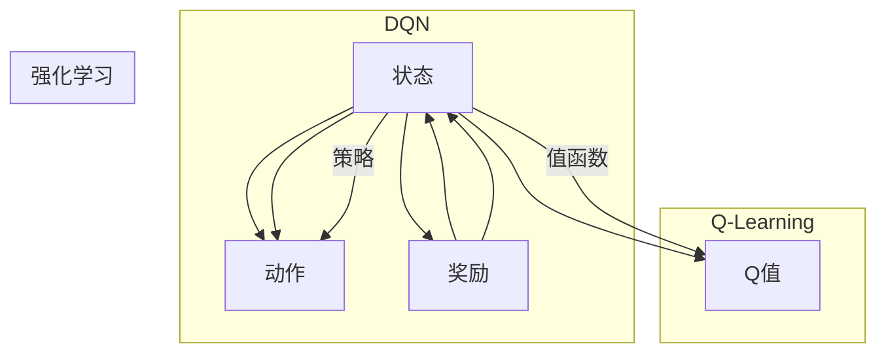

# Deep Q-Learning原理与代码实例讲解

作者：禅与计算机程序设计艺术 / Zen and the Art of Computer Programming

## 1. 背景介绍

### 1.1 问题的由来

随着深度学习技术的快速发展，强化学习成为人工智能领域的一个重要分支。深度Q学习（Deep Q-Learning，DQN）作为强化学习的一种，因其强大的学习能力和良好的效果，在游戏、机器人控制、推荐系统等多个领域得到了广泛应用。本文将深入浅出地介绍DQN的原理、实现方法以及代码实例，帮助读者全面掌握DQN技术。

### 1.2 研究现状

近年来，DQN及其变体在学术界和工业界都取得了显著的成果。随着深度学习技术的不断进步，DQN及其变体在性能和效率方面都有了很大提升。同时，研究者们也在探索如何将DQN应用于更复杂的任务和场景，例如多智能体系统、强化学习与深度学习的结合等。

### 1.3 研究意义

DQN作为一种基于深度学习的强化学习算法，具有以下研究意义：

1. 提高学习效率和精度：DQN将深度学习与Q-Learning相结合，利用深度神经网络提取状态特征，从而提高学习效率和精度。
2. 扩展强化学习应用：DQN可以应用于更多领域，如游戏、机器人控制、推荐系统等，推动强化学习技术的应用拓展。
3. 促进人工智能发展：DQN的研究成果有助于推动人工智能技术的发展，为构建更加智能、高效的智能系统提供技术支持。

### 1.4 本文结构

本文将分为以下章节：

- 第2章：核心概念与联系
- 第3章：核心算法原理与具体操作步骤
- 第4章：数学模型和公式与详细讲解与举例说明
- 第5章：项目实践：代码实例和详细解释说明
- 第6章：实际应用场景
- 第7章：工具和资源推荐
- 第8章：总结：未来发展趋势与挑战
- 第9章：附录：常见问题与解答

## 2. 核心概念与联系

为更好地理解DQN，本节将介绍与DQN密切相关的核心概念：

- 强化学习（Reinforcement Learning）：一种机器学习范式，通过学习最大化奖励信号来指导智能体在环境中做出决策。
- Q-Learning：强化学习的一种算法，通过学习Q值（状态-动作值）来指导智能体选择最优动作。
- 状态（State）：描述智能体所处环境的特征。
- 动作（Action）：智能体可以采取的行动。
- 奖励（Reward）：智能体采取动作后获得的奖励，用于指导智能体学习。
- 策略（Policy）：智能体在给定状态下采取动作的决策规则。
- 值函数（Value Function）：描述智能体在给定状态下采取动作的期望奖励。
- Q值（Q-Value）：描述在给定状态下采取某个动作的期望奖励。

它们之间的逻辑关系如下：



可以看出，DQN是强化学习的一种，它将Q-Learning与深度学习相结合，通过深度神经网络提取状态特征，学习状态-动作值函数，从而指导智能体选择最优动作。

## 3. 核心算法原理与具体操作步骤

### 3.1 算法原理概述

DQN是一种基于深度学习的Q-Learning算法，其核心思想是利用深度神经网络来近似Q值函数。DQN的主要步骤如下：

1. 初始化：初始化深度神经网络模型、经验回放缓冲区、目标网络、探索策略等。
2. 迭代：根据探索策略选择动作，与环境交互，获取奖励和下一个状态。
3. 更新：将经验存储到经验回放缓冲区，并从缓冲区中随机抽取一批经验，用于更新目标网络。
4. 更新目标网络：根据Q值函数更新目标网络参数。
5. 评估：评估智能体性能，并调整探索策略。

### 3.2 算法步骤详解

1. **初始化**：

   - 初始化深度神经网络模型：选择合适的深度神经网络结构，如卷积神经网络（CNN）、循环神经网络（RNN）或深度神经网络（DNN）等。
   - 初始化经验回放缓冲区：用于存储经验样本，提高样本的随机性和多样性。
   - 初始化目标网络：用于存储目标Q值函数，并与主网络保持一定时间间隔。
   - 初始化探索策略：用于控制智能体采取动作的随机性，如ε-greedy策略、ε-decay策略等。

2. **迭代**：

   - 根据探索策略选择动作：智能体根据当前状态和探索策略选择动作。
   - 与环境交互：智能体执行选择的动作，与环境交互，获取奖励和下一个状态。
   - 存储经验：将当前状态、动作、奖励和下一个状态存储到经验回放缓冲区。

3. **更新**：

   - 从经验回放缓冲区中随机抽取一批经验：从经验回放缓冲区中随机抽取一批经验样本，用于更新目标网络。
   - 更新目标网络：根据Q值函数更新目标网络参数，使其接近真实Q值函数。

4. **评估**：

   - 评估智能体性能：根据智能体的累计奖励或平均奖励等指标评估其性能。
   - 调整探索策略：根据智能体性能调整探索策略，如增加或减少探索概率。

### 3.3 算法优缺点

DQN具有以下优点：

1. 高度自动化：DQN将强化学习和深度学习相结合，高度自动化，无需人工设计特征和状态空间。
2. 强大的学习能力：DQN利用深度神经网络学习状态特征，能够处理复杂的状态空间和动作空间。
3. 广泛的应用场景：DQN可以应用于游戏、机器人控制、推荐系统等多个领域。

DQN也具有一定的缺点：

1. 计算量较大：DQN需要进行大量的迭代和参数更新，计算量较大。
2. 对超参数敏感：DQN的性能对超参数（如学习率、探索策略等）比较敏感。
3. 难以收敛：在某些任务上，DQN可能难以收敛到最优解。

### 3.4 算法应用领域

DQN及其变体在以下领域得到了广泛应用：

1. 游戏：如《Dojo One》游戏、Pong游戏等。
2. 机器人控制：如无人车控制、无人机控制等。
3. 推荐系统：如电影推荐、商品推荐等。
4. 其他领域：如自然语言处理、图像识别等。

## 4. 数学模型和公式与详细讲解与举例说明

### 4.1 数学模型构建

DQN的数学模型主要包括以下几个部分：

1. **状态空间S**：描述智能体所处环境的特征，通常使用向量表示。

2. **动作空间A**：智能体可以采取的动作集合，通常使用离散集合表示。

3. **奖励函数R**：描述智能体采取动作后获得的奖励，通常使用实数表示。

4. **Q值函数Q(s,a)**：描述在状态s下采取动作a的期望奖励，使用向量表示。

5. **策略π**：描述智能体在给定状态下采取动作的决策规则，使用概率分布表示。

6. **目标网络Q(s',a')**：用于存储目标Q值函数，与主网络保持一定时间间隔。

### 4.2 公式推导过程

DQN的目标是学习Q值函数Q(s,a)，即在每个状态s下，采取动作a的期望奖励。公式如下：

$$
Q(s,a) = \sum_{a' \in A} \pi(a'|s) \cdot Q(s',a')
$$

其中，$\pi(a'|s)$表示在状态s下采取动作a'的概率。

### 4.3 案例分析与讲解

以下以Pong游戏为例，讲解DQN在游戏中的应用。

1. **状态空间S**：Pong游戏的当前状态包括球的位置、速度、台球的位置、速度、分数等。

2. **动作空间A**：Pong游戏的动作空间包括左移动、右移动、不移动等。

3. **奖励函数R**：Pong游戏的奖励函数可以根据球的得分进行设计，例如每次得分获得+1奖励，球出界获得-1奖励。

4. **Q值函数Q(s,a)**：Q值函数描述了在给定状态下采取动作a的期望奖励。

5. **策略π**：策略π可以根据Q值函数进行设计，例如ε-greedy策略。

6. **目标网络Q(s',a')**：目标网络用于存储目标Q值函数，与主网络保持一定时间间隔。

### 4.4 常见问题解答

**Q1：如何设计合适的深度神经网络结构？**

A：选择合适的深度神经网络结构需要根据具体任务的特点和需求进行。例如，对于图像识别任务，可以选择卷积神经网络；对于时间序列预测任务，可以选择循环神经网络。

**Q2：如何选择合适的探索策略？**

A：选择合适的探索策略需要根据具体任务的特点和需求进行。例如，对于复杂环境，可以选择ε-greedy策略；对于简单环境，可以选择ε-decay策略。

**Q3：如何解决DQN的样本偏差问题？**

A：可以使用经验回放缓冲区来缓解样本偏差问题。经验回放缓冲区可以存储大量的经验样本，提高样本的随机性和多样性。

## 5. 项目实践：代码实例和详细解释说明

### 5.1 开发环境搭建

在进行DQN实践前，我们需要准备好开发环境。以下是使用Python和TensorFlow进行DQN开发的步骤：

1. 安装TensorFlow：
```bash
pip install tensorflow
```

2. 安装其他依赖：
```bash
pip install numpy gym
```

### 5.2 源代码详细实现

以下是一个使用TensorFlow实现的DQN代码实例：

```python
import tensorflow as tf
import numpy as np
import gym
from collections import deque

# 定义DQN网络
class DQN:
    def __init__(self, state_dim, action_dim, learning_rate=0.001, memory_size=2000, batch_size=32):
        self.state_dim = state_dim
        self.action_dim = action_dim
        self.memory = deque(maxlen=memory_size)
        self.learning_rate = learning_rate
        self.gamma = 0.99
        self.epsilon = 1.0
        self.epsilon_min = 0.01
        self.epsilon_decay = 0.995
        self.batch_size = batch_size
        self.model = self._build_model()

    def _build_model(self):
        model = tf.keras.Sequential([
            tf.keras.layers.Dense(24, input_dim=self.state_dim, activation='relu'),
            tf.keras.layers.Dense(24, activation='relu'),
            tf.keras.layers.Dense(self.action_dim, activation='linear')
        ])
        model.compile(loss='mse', optimizer=tf.keras.optimizers.Adam(lr=self.learning_rate))
        return model

    def remember(self, state, action, reward, next_state, done):
        self.memory.append((state, action, reward, next_state, done))

    def act(self, state):
        if np.random.rand() <= self.epsilon:
            return np.random.randint(self.action_dim)
        act_values = self.model.predict(state)
        return np.argmax(act_values[0])

    def replay(self):
        minibatch = random.sample(self.memory, self.batch_size)
        for state, action, reward, next_state, done in minibatch:
            target = reward
            if not done:
                target = (reward + self.gamma * np.amax(self.model.predict(next_state)[0]))
            target_f = self.model.predict(state)
            target_f[0][action] = target
            self.model.fit(state, target_f, epochs=1, verbose=0)
        if self.epsilon > self.epsilon_min:
            self.epsilon *= self.epsilon_decay

# 创建环境
env = gym.make('CartPole-v1')
state_dim = env.observation_space.shape[0]
action_dim = env.action_space.n
dqn = DQN(state_dim, action_dim)

# 训练DQN
episodes = 1000
for e in range(episodes):
    state = env.reset()
    state = np.reshape(state, [1, state_dim])
    for time in range(500):
        action = dqn.act(state)
        next_state, reward, done, _ = env.step(action)
        next_state = np.reshape(next_state, [1, state_dim])
        dqn.remember(state, action, reward, next_state, done)
        state = next_state
        if done:
            print("Episode: {} Finish".format(e))
            break
    dqn.replay()
```

### 5.3 代码解读与分析

以上代码实现了DQN算法的核心功能，包括网络结构设计、经验回放缓冲区、探索策略、训练和回放等。

1. **DQN类**：
   - `__init__`方法：初始化DQN网络、经验回放缓冲区、学习率、奖励衰减等参数。
   - `_build_model`方法：定义DQN网络结构，包括输入层、隐藏层和输出层。
   - `remember`方法：将状态、动作、奖励、下一个状态和是否结束存储到经验回放缓冲区。
   - `act`方法：根据探索策略选择动作。
   - `replay`方法：从经验回放缓冲区中随机抽取一批经验，用于更新目标网络。

2. **创建环境**：
   - 使用gym库创建CartPole-v1环境。

3. **训练DQN**：
   - 设置训练轮数episodes。
   - 在每个轮次中，从环境获取初始状态，并迭代执行动作。
   - 将每个状态、动作、奖励、下一个状态和是否结束存储到经验回放缓冲区。
   - 当达到最大时间步或环境结束，执行经验回放，更新目标网络。

### 5.4 运行结果展示

运行以上代码，DQN会在CartPole-v1环境中进行训练。经过一定轮次的训练后，DQN能够较好地完成任务。

## 6. 实际应用场景

DQN及其变体在以下领域得到了广泛应用：

1. 游戏：如《Dojo One》游戏、Pong游戏等。
2. 机器人控制：如无人车控制、无人机控制等。
3. 推荐系统：如电影推荐、商品推荐等。
4. 其他领域：如自然语言处理、图像识别等。

## 7. 工具和资源推荐

### 7.1 学习资源推荐

1. 《Deep Reinforcement Learning with Python》书籍：详细介绍了深度强化学习的基本概念、算法和代码实现。
2. OpenAI Gym：一个开源的强化学习环境库，提供了丰富的游戏和机器人控制环境。
3. TensorFlow Reinforcement Learning教程：TensorFlow官方提供的强化学习教程，介绍了如何使用TensorFlow进行强化学习开发。

### 7.2 开发工具推荐

1. TensorFlow：一个开源的深度学习框架，支持强化学习算法的开发和训练。
2. OpenAI Gym：一个开源的强化学习环境库，提供了丰富的游戏和机器人控制环境。
3. stable_baselines3：一个基于TensorFlow和PyTorch的强化学习库，提供了丰富的算法和训练工具。

### 7.3 相关论文推荐

1. Deep Q-Networks（DQN）：提出DQN算法的经典论文。
2. Deep Deterministic Policy Gradient（DDPG）：一种基于深度学习的强化学习算法。
3. Asynchronous Advantage Actor-Critic（A3C）：一种异步的优势演员-评论家算法。

### 7.4 其他资源推荐

1. arXiv：一个开源的学术预印本论文库，提供了大量最新的强化学习论文。
2. 斯坦福大学CS234强化学习课程：介绍了强化学习的基本概念、算法和代码实现。

## 8. 总结：未来发展趋势与挑战

### 8.1 研究成果总结

本文对DQN的原理、实现方法以及代码实例进行了详细讲解，帮助读者全面掌握DQN技术。通过本文的学习，读者可以了解到DQN在强化学习中的应用前景，并能够在实际项目中应用DQN技术。

### 8.2 未来发展趋势

1. 深度强化学习与其他技术的结合：将深度强化学习与其他技术（如强化学习、深度学习、迁移学习等）相结合，开发更加高效、鲁棒的算法。
2. 算法效率和可扩展性提升：提高DQN的算法效率和可扩展性，使其能够在更复杂的场景下应用。
3. 鲁棒性和稳定性增强：提高DQN的鲁棒性和稳定性，使其在面对噪声数据和复杂环境时仍能保持良好的性能。

### 8.3 面临的挑战

1. 算法效率：DQN的算法效率相对较低，需要进一步优化算法，提高训练和推理速度。
2. 可扩展性：DQN的可扩展性有限，需要开发更加通用的算法，使其能够在更复杂的场景下应用。
3. 鲁棒性和稳定性：DQN在面对噪声数据和复杂环境时，鲁棒性和稳定性有待提高。

### 8.4 研究展望

未来，深度强化学习将继续在以下方面进行研究和探索：

1. 开发更加高效、鲁棒的算法，提高DQN的性能。
2. 将深度强化学习与其他技术相结合，开发更加通用的算法。
3. 提高DQN的可扩展性，使其能够在更复杂的场景下应用。
4. 探索DQN在更多领域的应用，如智能交通、医疗健康、工业制造等。

通过不断的研究和探索，深度强化学习必将为人工智能领域带来更多创新和突破。

## 9. 附录：常见问题与解答

**Q1：如何选择合适的深度神经网络结构？**

A：选择合适的深度神经网络结构需要根据具体任务的特点和需求进行。例如，对于图像识别任务，可以选择卷积神经网络；对于时间序列预测任务，可以选择循环神经网络。

**Q2：如何选择合适的探索策略？**

A：选择合适的探索策略需要根据具体任务的特点和需求进行。例如，对于复杂环境，可以选择ε-greedy策略；对于简单环境，可以选择ε-decay策略。

**Q3：如何解决DQN的样本偏差问题？**

A：可以使用经验回放缓冲区来缓解样本偏差问题。经验回放缓冲区可以存储大量的经验样本，提高样本的随机性和多样性。

**Q4：如何提高DQN的收敛速度？**

A：提高DQN的收敛速度可以从以下几个方面进行：

1. 使用更有效的优化算法，如Adam、RMSprop等。
2. 优化网络结构，减小网络复杂度。
3. 增加样本量，提高样本的多样性。
4. 调整学习率，使其在合适的范围内。

**Q5：如何将DQN应用于实际问题？**

A：将DQN应用于实际问题需要以下步骤：

1. 分析问题，确定任务类型和场景。
2. 选择合适的深度神经网络结构和探索策略。
3. 搭建环境，并获取经验样本。
4. 训练DQN模型，并在测试集上评估性能。
5. 根据测试结果调整模型和策略，优化性能。

通过以上步骤，可以将DQN应用于实际问题，并取得良好的效果。