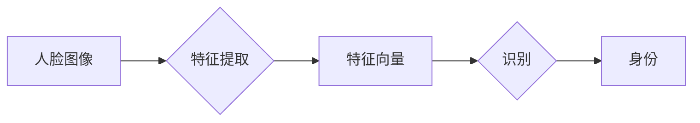

# Facial Recognition 原理与代码实战案例讲解

作者：禅与计算机程序设计艺术 / Zen and the Art of Computer Programming

## 1. 背景介绍
### 1.1 问题的由来

人脸识别技术作为一种生物识别技术，近年来在安防、金融、智能监控等领域得到了广泛的应用。它通过捕捉人脸图像，分析面部特征，实现对个人的身份识别。随着深度学习技术的快速发展，人脸识别技术的准确率和效率都有了显著的提升。

### 1.2 研究现状

目前，人脸识别技术主要分为以下几个方向：

- 基于特征提取的方法：通过提取人脸图像的特征向量进行身份识别，如Eigenfaces、Fisherfaces等。
- 基于深度学习的方法：利用深度神经网络从原始图像中学习到更高层次的特征表示，如卷积神经网络（CNN）、循环神经网络（RNN）等。
- 基于模式识别的方法：通过构建人脸图像的模型，对输入的人脸图像进行分类识别，如神经网络、支持向量机（SVM）等。

### 1.3 研究意义

人脸识别技术在许多领域具有广泛的应用前景，如：

- 安防监控：实现对公共场所的实时监控，预防犯罪行为。
- 金融支付：提供便捷的生物识别支付方式，提高支付安全性。
- 人工智能：为人脸识别技术提供更丰富的应用场景，推动人工智能技术的发展。

### 1.4 本文结构

本文将首先介绍人脸识别的核心概念与联系，然后详细介绍基于深度学习的人脸识别算法原理和具体操作步骤，接着通过实际案例讲解人脸识别的代码实现，最后探讨人脸识别的实际应用场景和未来发展趋势。

## 2. 核心概念与联系

本节将介绍人脸识别中的一些关键概念，包括：

- 人脸图像：指通过摄像头等设备捕捉到的包含人脸的图像。
- 面部特征：指人脸图像中的关键信息，如眼睛、鼻子、嘴巴等五官位置、人脸形状、纹理等。
- 特征提取：指从人脸图像中提取出具有区分性的特征向量。
- 识别：指根据提取到的特征向量，对输入的人脸图像进行分类，识别其身份。

这些概念之间的关系可以用以下流程图表示：



## 3. 核心算法原理 & 具体操作步骤
### 3.1 算法原理概述

基于深度学习的人脸识别算法主要包括以下几个步骤：

1. 数据采集：收集大量的人脸图像数据，并进行预处理。
2. 训练：利用深度学习算法，从人脸图像中学习到特征表示。
3. 识别：将待识别的人脸图像输入模型，通过模型输出的特征向量进行身份识别。

### 3.2 算法步骤详解

1. **数据采集与预处理**：

   - 收集大量的人脸图像数据，包括正面、侧面、不同光照条件下的图像。
   - 对采集到的人脸图像进行预处理，如灰度化、缩放、旋转、裁剪等。

2. **特征提取**：

   - 使用深度学习算法，如卷积神经网络（CNN）或循环神经网络（RNN），从人脸图像中提取特征向量。
   - 特征向量应具有较好的区分性，能够有效地区分不同个体。

3. **模型训练**：

   - 利用标注好的人脸图像数据，对特征提取模型进行训练。
   - 通过优化算法，如梯度下降法，使模型能够根据输入的人脸图像准确提取特征向量。

4. **身份识别**：

   - 将待识别的人脸图像输入训练好的特征提取模型，得到特征向量。
   - 将特征向量与数据库中存储的特征向量进行比对，根据相似度判断身份。

### 3.3 算法优缺点

1. **优点**：

   - 准确率高：深度学习算法能够从原始图像中学习到更丰富的特征，提高识别准确率。
   - 泛化能力强：深度学习模型具有较强的泛化能力，能够适应不同光照、姿态、表情等变化。
   - 自动化程度高：深度学习模型可以自动提取特征，无需人工设计特征提取方法。

2. **缺点**：

   - 计算量大：深度学习模型需要大量的计算资源，训练和推理过程耗时较长。
   - 对样本数量和多样性要求高：模型训练需要大量的标注数据，且样本应具有多样性。
   - 对光照、姿态等条件敏感：在复杂的环境下，模型的识别准确率会受到影响。

### 3.4 算法应用领域

基于深度学习的人脸识别算法在以下领域得到广泛应用：

- 安防监控：实现对公共场所的实时监控，预防犯罪行为。
- 金融支付：提供便捷的生物识别支付方式，提高支付安全性。
- 人工智能：为人脸识别技术提供更丰富的应用场景，推动人工智能技术的发展。

## 4. 数学模型和公式 & 详细讲解 & 举例说明
### 4.1 数学模型构建

基于深度学习的人脸识别模型通常采用以下数学模型：

1. **卷积神经网络（CNN）**：

   - 卷积层：用于提取图像特征。
   - 池化层：用于降低特征维度，减少计算量。
   - 全连接层：用于进行分类。

2. **循环神经网络（RNN）**：

   - 循环层：用于处理序列数据。
   - 全连接层：用于进行分类。

### 4.2 公式推导过程

以CNN为例，其基本公式如下：

$$
\hat{y} = \sigma(W_l \cdot \phi(W_{l-1} \cdot \phi(...W_1 \cdot \phi(x) + b_1)... + b_l))
$$

其中，$W_l$ 为第 $l$ 层的权重矩阵，$\phi$ 为激活函数，$b_l$ 为第 $l$ 层的偏置项，$\sigma$ 为输出层激活函数，$\hat{y}$ 为模型输出。

### 4.3 案例分析与讲解

以下是一个使用TensorFlow和Keras实现的人脸识别模型案例：

```python
import tensorflow as tf
from tensorflow.keras.layers import Input, Conv2D, MaxPooling2D, Flatten, Dense, Dropout, BatchNormalization
from tensorflow.keras.models import Model

# 构建模型
input_layer = Input(shape=(64, 64, 3))
x = Conv2D(32, (3, 3), activation='relu')(input_layer)
x = MaxPooling2D((2, 2))(x)
x = BatchNormalization()(x)
x = Conv2D(64, (3, 3), activation='relu')(x)
x = MaxPooling2D((2, 2))(x)
x = BatchNormalization()(x)
x = Flatten()(x)
x = Dense(128, activation='relu')(x)
x = Dropout(0.5)(x)
output_layer = Dense(10, activation='softmax')(x)

model = Model(input_layer, output_layer)

# 编译模型
model.compile(optimizer='adam', loss='categorical_crossentropy', metrics=['accuracy'])

# 训练模型
model.fit(train_images, train_labels, epochs=10, validation_data=(test_images, test_labels))
```

### 4.4 常见问题解答

**Q1：如何提高人脸识别模型的准确率？**

A：提高人脸识别模型的准确率可以从以下几个方面入手：

1. 收集更多高质量的人脸图像数据，提高模型训练数据的多样性。
2. 使用更先进的深度学习模型，如ResNet、VGG等。
3. 调整模型参数，如学习率、批大小、迭代轮数等。
4. 对输入的人脸图像进行预处理，如数据增强等。
5. 使用数据增强技术，如旋转、缩放、裁剪等。

**Q2：如何处理人脸图像的噪声和光照变化？**

A：为了提高模型对噪声和光照变化的鲁棒性，可以采取以下措施：

1. 使用具有鲁棒性的特征提取方法，如基于深度学习的方法。
2. 对输入的人脸图像进行预处理，如去噪、光照校正等。
3. 使用数据增强技术，如旋转、缩放、裁剪等，使模型能够适应各种变化。

**Q3：如何解决人脸识别模型训练过程中的过拟合问题？**

A：为了解决过拟合问题，可以采取以下措施：

1. 采集更多高质量的人脸图像数据，提高模型训练数据的多样性。
2. 使用正则化技术，如L1正则化、L2正则化等。
3. 使用数据增强技术，如旋转、缩放、裁剪等，使模型能够适应各种变化。
4. 使用早停法（Early Stopping），当验证集上的性能不再提升时停止训练。

## 5. 项目实践：代码实例和详细解释说明
### 5.1 开发环境搭建

在进行人脸识别项目开发之前，需要搭建以下开发环境：

1. Python 3.5及以上版本
2. TensorFlow 2.x版本
3. OpenCV库
4. NumPy库

### 5.2 源代码详细实现

以下是一个使用TensorFlow和Keras实现的人脸识别项目案例：

```python
import cv2
import os
import numpy as np
import tensorflow as tf
from tensorflow.keras.preprocessing.image import ImageDataGenerator

# 加载预训练模型
model = tf.keras.models.load_model('face_recognition_model.h5')

# 加载摄像头
cap = cv2.VideoCapture(0)

while True:
    ret, frame = cap.read()
    if not ret:
        break

    # 预处理图像
    face_cascade = cv2.CascadeClassifier('haarcascade_frontalface_default.xml')
    faces = face_cascade.detectMultiScale(frame, 1.1, 4)

    for (x, y, w, h) in faces:
        face = frame[y:y+h, x:x+w]
        face = cv2.resize(face, (64, 64))
        face = np.expand_dims(face, axis=0)
        face = face.astype('float32') / 255.0

        # 进行人脸识别
        pred = model.predict(face)
        label = np.argmax(pred)

        # 显示识别结果
        cv2.rectangle(frame, (x, y), (x+w, y+h), (0, 255, 0), 2)
        cv2.putText(frame, f'Person {label}', (x, y-10), cv2.FONT_HERSHEY_SIMPLEX, 0.9, (0, 255, 0), 2)

    cv2.imshow('Frame', frame)
    if cv2.waitKey(1) & 0xFF == ord('q'):
        break

cap.release()
cv2.destroyAllWindows()
```

### 5.3 代码解读与分析

- `import`语句导入所需的库。
- `load_model`函数加载预训练模型。
- `cv2.VideoCapture`创建摄像头对象。
- `face_cascade`为Haar特征分类器，用于检测人脸。
- `detectMultiScale`函数检测图像中的人脸。
- `cv2.resize`将人脸图像缩放到64x64像素。
- `np.expand_dims`将人脸图像添加一个维度。
- `astype`将人脸图像数据类型转换为`float32`。
- `predict`函数进行人脸识别。
- `argmax`函数获取识别结果的最大值。
- `rectangle`函数绘制人脸识别框。
- `putText`函数在人脸识别框上显示识别结果。
- `imshow`函数显示图像。
- `waitKey`函数等待按键。

### 5.4 运行结果展示

运行上述代码，即可实现实时的人脸识别。摄像头捕捉到的人脸图像会被自动识别，并在图像上显示识别结果。

## 6. 实际应用场景
### 6.1 安防监控

人脸识别技术在安防监控领域的应用主要体现在以下方面：

- 实时监控：通过对公共场所的实时监控，及时发现异常情况，预防犯罪行为。
- 人员管理：实现对出入人员的身份识别，提高人员管理效率。
- 案件调查：协助警方追踪犯罪嫌疑人，提高破案效率。

### 6.2 金融支付

人脸识别技术在金融支付领域的应用主要体现在以下方面：

- 生物识别支付：通过人脸识别技术实现便捷的生物识别支付方式，提高支付安全性。
- 身份验证：在办理银行业务、购买理财产品等场景中，通过人脸识别技术验证用户身份。
- 风险控制：通过对用户的人脸识别，识别出异常交易行为，降低金融风险。

### 6.3 人工智能

人脸识别技术在人工智能领域的应用主要体现在以下方面：

- 语音助手：结合人脸识别技术，实现人脸识别唤醒功能。
- 智能家居：结合人脸识别技术，实现对家居设备的智能控制。
- 智能客服：结合人脸识别技术，实现人脸识别身份认证，提高客服效率。

### 6.4 未来应用展望

随着人脸识别技术的不断发展，其在未来将会有以下应用场景：

- 智能驾驶：通过人脸识别技术识别驾驶员身份，实现自动驾驶功能。
- 无人机监控：利用人脸识别技术实现无人机对特定目标的实时监控。
- 身份认证：人脸识别技术将成为未来身份认证的重要手段。

## 7. 工具和资源推荐
### 7.1 学习资源推荐

1. 《深度学习入门：基于Python的理论与实现》
2. 《深度学习实战》
3. TensorFlow官方文档
4. Keras官方文档
5. OpenCV官方文档

### 7.2 开发工具推荐

1. TensorFlow
2. Keras
3. OpenCV
4. PyTorch
5. Jupyter Notebook

### 7.3 相关论文推荐

1. FaceNet: A Unified Embedding for Face Recognition and Clustering
2. DeepFace: Closing the Gap to Human-Level Performance in Face Verification
3. FaceNet: A Unified Embedding for Face Recognition and Clustering

### 7.4 其他资源推荐

1. FaceNet开源项目
2. DeepFace开源项目
3. OpenCV人脸识别教程
4. TensorFlow人脸识别教程

## 8. 总结：未来发展趋势与挑战
### 8.1 研究成果总结

本文对人脸识别技术进行了全面的介绍，包括其背景、原理、算法、应用场景等。通过实际案例讲解了人脸识别的代码实现，并展望了未来发展趋势。

### 8.2 未来发展趋势

1. 模型小型化：为了满足移动端和嵌入式设备的应用需求，人脸识别模型将不断小型化。
2. 模型轻量化：为了降低计算成本，人脸识别模型将不断轻量化。
3. 模型泛化性：为了提高模型在不同场景下的适应性，人脸识别模型的泛化性将得到提升。
4. 模型安全性：随着人脸识别技术的广泛应用，其安全性也将成为关注的焦点。

### 8.3 面临的挑战

1. 计算资源消耗：人脸识别模型需要大量的计算资源，如何降低计算成本是当前的一大挑战。
2. 数据隐私保护：人脸识别技术涉及个人隐私，如何保护用户数据安全是另一个挑战。
3. 模型公平性：为了防止模型歧视，需要提高模型的公平性。

### 8.4 研究展望

随着人工智能技术的不断发展，人脸识别技术将会有以下研究方向：

1. 深度学习模型的创新：研究更高效、更鲁棒的深度学习模型。
2. 小型化模型的开发：研究适用于移动端和嵌入式设备的小型化模型。
3. 数据隐私保护技术的研发：研究数据隐私保护技术，保护用户数据安全。
4. 模型公平性的提升：研究模型公平性技术，防止模型歧视。

相信在未来的发展中，人脸识别技术将会取得更大的突破，为人类生活带来更多便利。