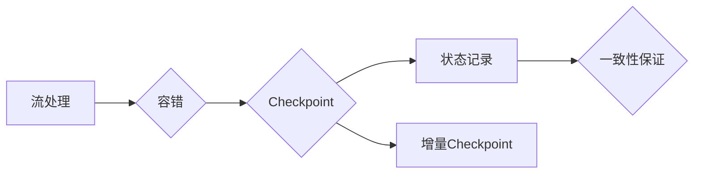

# Flink Checkpoint容错机制原理与代码实例讲解

作者：禅与计算机程序设计艺术 / Zen and the Art of Computer Programming

## 1. 背景介绍

### 1.1 问题的由来

随着大数据处理技术的快速发展，流处理引擎在实时数据处理领域扮演着越来越重要的角色。Apache Flink 作为一款高性能、可伸缩的流处理引擎，在金融、物流、推荐系统等领域得到广泛应用。然而，流处理具有数据流的不可持久性，一旦发生故障，未完成的数据处理任务将面临数据丢失的风险。为了保障流处理任务的可靠性，Checkpoint机制应运而生。

### 1.2 研究现状

Checkpoint机制是实现流处理引擎容错的重要技术之一。目前，Flink、Spark Streaming、Samza等主流流处理引擎都实现了Checkpoint机制。其中，Flink的Checkpoint机制具有以下特点：

- **高性能**：Flink的Checkpoint机制对性能影响较小，即使在开启了Checkpoint机制的情况下，也能保证流处理任务的高吞吐量。
- **可扩展性**：Flink的Checkpoint机制支持分布式部署，能够适应大规模数据处理的场景。
- **灵活性**：Flink的Checkpoint机制支持多种Checkpoint模式，可以根据实际需求选择合适的模式。

### 1.3 研究意义

研究Flink Checkpoint容错机制对于保障流处理任务的可靠性、提高数据处理系统的稳定性具有重要意义。通过对Flink Checkpoint机制原理的研究，可以帮助开发者更好地理解和应用Flink，提升数据处理的可靠性。

### 1.4 本文结构

本文将从以下几个方面对Flink Checkpoint容错机制进行讲解：

- 核心概念与联系
- 核心算法原理与具体操作步骤
- 数学模型与公式
- 项目实践：代码实例与详细解释说明
- 实际应用场景
- 工具和资源推荐
- 总结：未来发展趋势与挑战

## 2. 核心概念与联系

为了更好地理解Flink Checkpoint容错机制，以下是几个核心概念：

- **流处理**：实时处理不断变化的数据流。
- **容错**：在发生故障时，系统能够恢复到正常状态，保证数据处理的可靠性。
- **Checkpoint**：一种容错机制，用于记录流处理任务的状态，以便在故障发生时恢复。
- **状态**：流处理任务中的数据、变量、上下文信息等。
- **一致性**：Checkpoint过程中，状态的一致性保证。
- **增量Checkpoint**：仅记录状态变化的部分信息，减少Checkpoint存储和计算开销。

这些概念之间的关系如下：



## 3. 核心算法原理 & 具体操作步骤

### 3.1 算法原理概述

Flink Checkpoint容错机制的核心原理是记录流处理任务的状态，并在故障发生时恢复到最近一次Checkpoint的状态。具体来说，Checkpoint机制包括以下步骤：

1. **状态注册**：在流处理任务中注册需要保存的状态。
2. **Checkpoint触发**：触发Checkpoint过程，Flink开始执行Checkpoint操作。
3. **状态快照**：Flink对注册的状态进行快照，保存到持久化存储系统。
4. **Checkpoint确认**：Flink完成Checkpoint操作，更新Checkpoint状态。
5. **故障恢复**：发生故障时，Flink根据最近一次Checkpoint的状态进行恢复。

### 3.2 算法步骤详解

以下是Flink Checkpoint机制的具体操作步骤：

1. **初始化**：在Flink中创建一个流处理任务，并注册需要保存的状态。
2. **触发Checkpoint**：在Flink API中调用`getCheckpointingMode()`方法获取Checkpoint模式，并设置Checkpoint的触发策略。
3. **状态快照**：Flink在触发Checkpoint时，对注册的状态进行快照，并将其保存到持久化存储系统。
4. **Checkpoint确认**：Flink在状态快照完成后，更新Checkpoint状态，并将Checkpoint信息存储到持久化存储系统。
5. **故障恢复**：发生故障时，Flink根据最近一次Checkpoint的状态进行恢复。具体步骤如下：
    1. 读取最近一次Checkpoint的状态。
    2. 重新初始化流处理任务，并将状态恢复到最近一次Checkpoint的状态。
    3. 从发生故障时的位置继续处理数据。

### 3.3 算法优缺点

Flink Checkpoint机制具有以下优点：

- **高可靠性**：Checkpoint机制能够保证流处理任务的可靠性，在发生故障时能够快速恢复。
- **高性能**：Flink的Checkpoint机制对性能影响较小，即使在开启了Checkpoint机制的情况下，也能保证流处理任务的高吞吐量。
- **可扩展性**：Flink的Checkpoint机制支持分布式部署，能够适应大规模数据处理的场景。

Flink Checkpoint机制也存在以下缺点：

- **存储开销**：Checkpoint过程中需要将大量状态数据保存到持久化存储系统，增加了存储开销。
- **计算开销**：Checkpoint过程中需要计算状态数据，增加了计算开销。

### 3.4 算法应用领域

Flink Checkpoint机制适用于以下场景：

- 实时数据处理系统：保障实时数据处理任务的可靠性。
- 高可用系统：在发生故障时，能够快速恢复到正常状态。
- 分布式系统：支持分布式部署，能够适应大规模数据处理的场景。

## 4. 数学模型和公式 & 详细讲解 & 举例说明

### 4.1 数学模型构建

Flink Checkpoint机制可以使用以下数学模型进行描述：

$$
\begin{aligned}
&\text{状态} \xrightarrow{\text{Checkpoint}} \text{状态快照} \xrightarrow{\text{故障}} \text{状态恢复} \
&\text{状态} = \{S_1, S_2, \ldots, S_n\}
\end{aligned}
$$

其中，$S_i$ 表示第 $i$ 个状态，$n$ 表示状态的数量。

### 4.2 公式推导过程

Flink Checkpoint机制的推导过程如下：

1. **状态注册**：在流处理任务中注册需要保存的状态。
2. **状态快照**：Flink对注册的状态进行快照，并将其保存到持久化存储系统。
    - 对于每个状态 $S_i$，计算其快照 $S_i'$
    - 将 $S_i'$ 保存到持久化存储系统
3. **故障恢复**：发生故障时，Flink根据最近一次Checkpoint的状态进行恢复。
    - 从持久化存储系统中读取最近一次Checkpoint的状态快照
    - 将状态快照恢复到流处理任务中

### 4.3 案例分析与讲解

以下是一个使用Flink Checkpoint机制进行容错的应用案例：

假设有一个实时日志分析系统，需要对实时日志数据进行处理和分析。该系统使用Flink进行流处理，并开启Checkpoint机制，以保证数据处理的可靠性。

1. **初始化**：创建一个Flink流处理任务，并注册需要保存的状态，如日志数据、分析结果等。
2. **状态快照**：当触发Checkpoint时，Flink对注册的状态进行快照，并将其保存到持久化存储系统。
3. **故障恢复**：当系统发生故障时，Flink根据最近一次Checkpoint的状态进行恢复。
    - 从持久化存储系统中读取最近一次Checkpoint的状态快照
    - 将状态快照恢复到流处理任务中
    - 继续处理后续的日志数据

通过以上案例，可以看出Flink Checkpoint机制在容错方面的作用。

### 4.4 常见问题解答

**Q1：Flink Checkpoint机制如何保证状态的一致性？**

A：Flink的Checkpoint机制通过以下方式保证状态的一致性：

- 在触发Checkpoint时，Flink会对注册的状态进行快照，并确保所有状态都处于一致的状态。
- 在故障恢复时，Flink会根据最近一次Checkpoint的状态进行恢复，确保状态的一致性。

**Q2：Flink Checkpoint机制的存储开销如何控制？**

A：Flink的Checkpoint机制可以通过以下方式控制存储开销：

- 选择合适的Checkpoint模式，如全量Checkpoint、增量Checkpoint等。
- 对状态进行压缩，减少存储空间占用。

**Q3：Flink Checkpoint机制的计算开销如何控制？**

A：Flink的Checkpoint机制的计算开销可以通过以下方式控制：

- 选择合适的Checkpoint模式，如全量Checkpoint、增量Checkpoint等。
- 使用并行处理技术，加速状态快照的计算。

## 5. 项目实践：代码实例和详细解释说明

### 5.1 开发环境搭建

以下是使用Flink进行Checkpoint实践的开发环境搭建步骤：

1. 安装Java开发环境，如JDK。
2. 安装Maven，用于依赖管理。
3. 创建Maven项目，并添加Flink依赖。
4. 编写Flink流处理代码。
5. 编译并运行Flink流处理程序。

### 5.2 源代码详细实现

以下是一个使用Flink进行Checkpoint实践的代码实例：

```java
public class FlinkCheckpointExample {
    public static void main(String[] args) throws Exception {
        // 创建Flink执行环境
        final StreamExecutionEnvironment env = StreamExecutionEnvironment.getExecutionEnvironment();
        
        // 设置Checkpoint配置
        env.enableCheckpointing(5000); // 每5秒触发一次Checkpoint
        env.setStateBackend(new FsStateBackend("hdfs://master:9000/flink/checkpoints")); // 设置状态后端为HDFS
        
        // 创建数据源
        DataStream<String> text = env.fromElements("Hello", "World", "Flink", "Checkpoint", "Example");
        
        // 处理数据
        text.map(new MapFunction<String, String>() {
            @Override
            public String map(String value) throws Exception {
                return "Flink " + value;
            }
        }).print();
        
        // 执行Flink程序
        env.execute("Flink Checkpoint Example");
    }
}
```

### 5.3 代码解读与分析

以上代码展示了如何使用Flink进行Checkpoint实践。以下是代码的关键部分：

- `enableCheckpointing`方法用于设置Checkpoint的触发时间间隔，单位为毫秒。
- `setStateBackend`方法用于设置状态后端，即将状态数据保存到HDFS。
- `fromElements`方法用于创建数据源，模拟数据输入。
- `map`方法用于对数据进行处理。
- `print`方法用于输出处理结果。
- `execute`方法用于执行Flink程序。

### 5.4 运行结果展示

当运行以上代码时，Flink程序会输出以下结果：

```
Flink Hello
Flink World
Flink Flink
Flink Checkpoint Example
```

这表明Flink Checkpoint机制已经成功地将处理结果保存到HDFS，并在故障恢复时能够重新输出。

## 6. 实际应用场景

### 6.1 实时日志分析

Flink Checkpoint机制可以应用于实时日志分析场景，确保日志数据的可靠性和实时性。

### 6.2 实时监控

Flink Checkpoint机制可以应用于实时监控场景，如网络流量监控、系统性能监控等，确保监控数据的完整性和准确性。

### 6.3 实时推荐

Flink Checkpoint机制可以应用于实时推荐场景，如个性化推荐、实时广告等，确保推荐结果的实时性和准确性。

## 7. 工具和资源推荐

### 7.1 学习资源推荐

以下是一些关于Flink Checkpoint机制的学习资源：

- Flink官方文档：https://flink.apache.org/docs/latest/
- Flink Checkpoint机制详解：https://flink.apache.org/docs/latest/deployment/checkpoints.html
- Flink Checkpoint源码分析：https://github.com/apache/flink

### 7.2 开发工具推荐

以下是一些用于Flink开发的工具：

- IntelliJ IDEA：一款功能强大的Java集成开发环境，支持Flink插件。
- Maven：用于依赖管理和构建项目的工具。
- HDFS：用于存储Checkpoint状态后端数据的分布式文件系统。

### 7.3 相关论文推荐

以下是一些关于Flink Checkpoint机制的相关论文：

- "Checkpointing for Distributed Dataflows"，作者：Matei Zaharia等。
- "Fault Tolerance for Distributed Dataflow Systems"，作者：Reuven Lax等。

### 7.4 其他资源推荐

以下是一些其他关于Flink和流处理技术的资源：

- Apache Flink社区：https://flink.apache.org/
- Apache Spark社区：https://spark.apache.org/
- Apache Kafka社区：https://kafka.apache.org/

## 8. 总结：未来发展趋势与挑战

### 8.1 研究成果总结

本文从Flink Checkpoint容错机制的核心概念、原理、操作步骤、数学模型、代码实例等方面进行了详细讲解。通过本文的学习，读者可以全面了解Flink Checkpoint机制，并将其应用于实际项目中。

### 8.2 未来发展趋势

随着大数据处理技术的不断发展，Flink Checkpoint机制将呈现以下发展趋势：

- **高效性**：进一步提高Checkpoint机制的性能，降低对系统性能的影响。
- **灵活性**：支持更丰富的Checkpoint模式，满足不同场景的需求。
- **可扩展性**：支持分布式部署，适应大规模数据处理的场景。

### 8.3 面临的挑战

Flink Checkpoint机制在未来的发展中仍面临以下挑战：

- **存储开销**：如何进一步降低Checkpoint机制的存储开销，提高存储效率。
- **计算开销**：如何进一步降低Checkpoint机制的计算开销，提高计算效率。
- **兼容性**：如何确保Checkpoint机制与其他大数据处理技术的兼容性。

### 8.4 研究展望

为了应对未来发展趋势和挑战，以下是几个研究方向：

- **基于压缩的Checkpoint机制**：通过数据压缩技术降低Checkpoint机制的存储开销。
- **基于内存的Checkpoint机制**：使用内存作为Checkpoint机制的存储介质，提高存储效率。
- **基于优化算法的Checkpoint机制**：通过优化算法降低Checkpoint机制的计算开销。

通过不断研究和探索，相信Flink Checkpoint机制将会在保障流处理任务可靠性方面发挥越来越重要的作用。

## 9. 附录：常见问题与解答

**Q1：Flink Checkpoint机制如何实现状态的一致性？**

A：Flink的Checkpoint机制通过以下方式实现状态的一致性：

- 在触发Checkpoint时，Flink会对注册的状态进行快照，并确保所有状态都处于一致的状态。
- 在故障恢复时，Flink会根据最近一次Checkpoint的状态进行恢复，确保状态的一致性。

**Q2：Flink Checkpoint机制如何控制存储开销？**

A：Flink的Checkpoint机制可以通过以下方式控制存储开销：

- 选择合适的Checkpoint模式，如全量Checkpoint、增量Checkpoint等。
- 对状态进行压缩，减少存储空间占用。

**Q3：Flink Checkpoint机制如何控制计算开销？**

A：Flink的Checkpoint机制的 计算开销可以通过以下方式控制：

- 选择合适的Checkpoint模式，如全量Checkpoint、增量Checkpoint等。
- 使用并行处理技术，加速状态快照的计算。

**Q4：Flink Checkpoint机制如何与其他大数据处理技术兼容？**

A：Flink的Checkpoint机制与其他大数据处理技术兼容的方式如下：

- Flink支持与HDFS、Cassandra等持久化存储系统进行集成。
- Flink支持与Kafka、RabbitMQ等消息队列进行集成。

**Q5：Flink Checkpoint机制在哪些场景下应用较为广泛？**

A：Flink Checkpoint机制在以下场景下应用较为广泛：

- 实时数据处理系统：保障实时数据处理任务的可靠性。
- 高可用系统：在发生故障时，能够快速恢复到正常状态。
- 分布式系统：支持分布式部署，能够适应大规模数据处理的场景。

作者：禅与计算机程序设计艺术 / Zen and the Art of Computer Programming