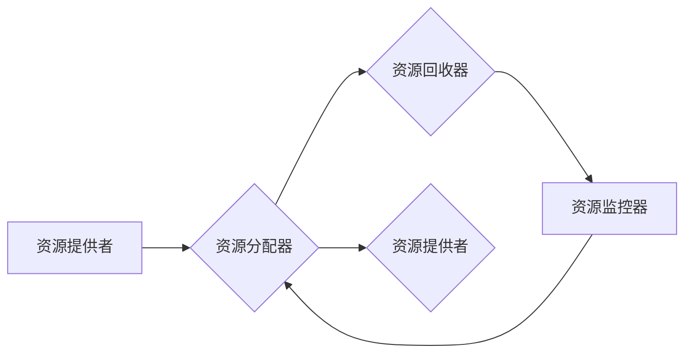

# Flink ResourceManager原理与代码实例讲解

作者：禅与计算机程序设计艺术 / Zen and the Art of Computer Programming


## 1. 背景介绍
### 1.1 问题的由来

Apache Flink 是一个开源的流处理框架，支持有界和无界数据流处理，广泛应用于实时数据处理、批处理、复杂事件处理等领域。Flink 的核心组件之一是 ResourceManager，负责资源的管理与分配，是 Flink 框架中至关重要的模块之一。

在 Flink 中，ResourceManager 负责协调集群中不同 TaskManager 的资源分配，确保任务能够高效、稳定地运行。随着 Flink 应用场景的拓展，对 ResourceManager 的性能和稳定性要求也越来越高。因此，深入理解 ResourceManager 的原理和实现，对于开发高性能、可扩展的 Flink 应用至关重要。

### 1.2 研究现状

目前，关于 Flink ResourceManager 的研究主要集中在以下几个方面：

1. **资源管理策略**：研究不同资源管理策略对 Flink 应用性能的影响，如均摊、优先级、抢占等。
2. **资源分配算法**：研究资源分配算法的效率和公平性，如基于分片、基于内存、基于 CPU 等分配算法。
3. **资源回收机制**：研究资源回收机制对 Flink 应用稳定性的影响，如心跳、失败检测等。
4. **跨集群资源调度**：研究跨集群资源调度的机制和策略，以实现 Flink 应用的跨集群扩展。

### 1.3 研究意义

深入研究 Flink ResourceManager 的原理和实现，具有以下意义：

1. **提升 Flink 应用性能**：通过优化资源管理策略和分配算法，可以显著提升 Flink 应用的吞吐量和资源利用率。
2. **增强 Flink 应用稳定性**：通过优化资源回收机制和失败检测策略，可以降低 Flink 应用的故障率和重启次数。
3. **拓展 Flink 应用场景**：通过研究跨集群资源调度机制，可以支持 Flink 应用的跨集群扩展，满足更多场景需求。

### 1.4 本文结构

本文将深入探讨 Flink ResourceManager 的原理和实现，内容安排如下：

- 第 2 部分，介绍 Flink ResourceManager 的核心概念和组成部分。
- 第 3 部分，详细讲解 ResourceManager 的资源管理策略、分配算法和回收机制。
- 第 4 部分，通过代码实例演示 ResourceManager 的具体实现。
- 第 5 部分，分析 ResourceManager 在实际应用场景中的应用和效果。
- 第 6 部分，展望 ResourceManager 的未来发展趋势和挑战。
- 第 7 部分，推荐相关学习资源、开发工具和参考文献。
- 第 8 部分，总结全文，并对未来研究方向进行展望。
- 第 9 部分，提供常见问题与解答。

## 2. 核心概念与联系

本节将介绍 Flink ResourceManager 的核心概念和组成部分，并阐述它们之间的联系。

### 2.1 Flink ResourceManager 的核心概念

- **JobManager**：Flink 应用集群中的主节点，负责调度任务、资源管理、失败恢复等工作。
- **TaskManager**：Flink 应用集群中的工作节点，负责执行任务和存储资源。
- **Resource Manager**：Flink ResourceManager 是 JobManager 的组件之一，负责管理集群中的资源，并将其分配给不同的 TaskManager。
- **Task**：Flink 任务的基本执行单元，由多个 TaskManager 共同执行。
- **Container**：Flink 中执行任务的容器，包含必要的资源环境。

### 2.2 Flink ResourceManager 的组成部分

Flink ResourceManager 由以下几个核心组件组成：

- **资源提供者**：负责向 ResourceManager 提供可用的资源信息。
- **资源分配器**：根据资源提供者的信息，将资源分配给不同的 TaskManager。
- **资源回收器**：回收不再使用的资源，并通知资源提供者。
- **资源监控器**：监控资源使用情况，并反馈给 ResourceManager。

Flink ResourceManager 的组成部分关系图如下：



可以看出，Flink ResourceManager 通过资源提供者、分配器、回收器和监控器等组件，实现资源的分配、回收、监控和反馈，确保 Flink 应用的稳定运行。

## 3. 核心算法原理 & 具体操作步骤
### 3.1 算法原理概述

Flink ResourceManager 的核心算法包括资源管理策略、分配算法和回收机制。

### 3.2 算法步骤详解

#### 3.2.1 资源管理策略

Flink ResourceManager 支持以下资源管理策略：

1. **均摊策略**：将集群中的资源平均分配给每个 TaskManager。
2. **优先级策略**：根据 TaskManager 的优先级，分配资源。
3. **抢占策略**：根据 TaskManager 的当前资源使用情况，动态调整资源分配。

#### 3.2.2 资源分配算法

Flink ResourceManager 采用基于分片的资源分配算法，将资源分配给不同的 TaskManager。

1. **分片**：将 TaskManager 的资源划分为多个分片，每个分片可以独立分配给不同的任务。
2. **资源分配**：根据任务的需求和资源分配策略，将分片分配给不同的 TaskManager。

#### 3.2.3 回收机制

Flink ResourceManager 通过心跳机制和失败检测机制，回收不再使用的资源。

1. **心跳机制**：TaskManager 定期向 ResourceManager 发送心跳，报告自己的资源使用情况。
2. **失败检测**：ResourceManager 监控 TaskManager 的心跳，如果连续一段时间没有收到心跳，则认为 TaskManager 失败，并回收其资源。

### 3.3 算法优缺点

#### 3.3.1 优缺点

- **均摊策略**：简单易实现，但可能导致资源利用率不高。
- **优先级策略**：可以更好地满足高优先级任务的资源需求，但可能导致低优先级任务饿死。
- **抢占策略**：可以动态调整资源分配，但实现复杂，容易导致资源碎片化。

### 3.4 算法应用领域

Flink ResourceManager 的算法主要应用于以下领域：

- **资源分配**：根据任务需求，动态分配资源给不同的 TaskManager。
- **资源回收**：回收不再使用的资源，提高资源利用率。
- **任务调度**：根据资源分配情况，调度任务到合适的 TaskManager。

## 4. 数学模型和公式 & 详细讲解 & 举例说明
### 4.1 数学模型构建

Flink ResourceManager 的数学模型主要包括资源分配模型、资源回收模型和任务调度模型。

### 4.2 公式推导过程

#### 4.2.1 资源分配模型

资源分配模型可以用以下公式表示：

$$
R_{i,j} = R_{i} - \sum_{k=1}^{j-1} R_{i,k}
$$

其中，$R_{i,j}$ 表示 TaskManager $i$ 分配给任务 $j$ 的资源量，$R_{i}$ 表示 TaskManager $i$ 的总资源量，$R_{i,k}$ 表示 TaskManager $i$ 分配给任务 $k$ 的资源量。

#### 4.2.2 资源回收模型

资源回收模型可以用以下公式表示：

$$
R_{i,j} = 0
$$

其中，$R_{i,j}$ 表示 TaskManager $i$ 回收给 ResourceManager 的资源量。

#### 4.2.3 任务调度模型

任务调度模型可以用以下公式表示：

$$
f(j) = \max_{i \in I} R_{i,j}
$$

其中，$f(j)$ 表示任务 $j$ 的调度结果，$I$ 表示所有 TaskManager 的集合。

### 4.3 案例分析与讲解

假设有 2 个 TaskManager 和 3 个任务，每个 TaskManager 的总资源量为 100，任务需求分别为 20、30 和 50。

根据资源分配模型，可以计算出每个 TaskManager 分配给每个任务的资源量：

- TaskManager 1 分配给 Task 1 的资源量为 $R_{1,1} = 20$
- TaskManager 1 分配给 Task 2 的资源量为 $R_{1,2} = 30$
- TaskManager 1 分配给 Task 3 的资源量为 $R_{1,3} = 50$
- TaskManager 2 分配给 Task 1 的资源量为 $R_{2,1} = 20$
- TaskManager 2 分配给 Task 2 的资源量为 $R_{2,2} = 30$
- TaskManager 2 分配给 Task 3 的资源量为 $R_{2,3} = 50$

根据资源回收模型，当任务执行完成后，TaskManager 将回收其分配的资源。

根据任务调度模型，可以计算出每个任务的调度结果：

- Task 1 调度到 TaskManager 1
- Task 2 调度到 TaskManager 2
- Task 3 调度到 TaskManager 2

### 4.4 常见问题解答

**Q1：Flink ResourceManager 的资源分配策略有哪些优缺点？**

A：Flink ResourceManager 支持多种资源分配策略，包括均摊策略、优先级策略和抢占策略等。均摊策略简单易实现，但可能导致资源利用率不高；优先级策略可以更好地满足高优先级任务的资源需求，但可能导致低优先级任务饿死；抢占策略可以动态调整资源分配，但实现复杂，容易导致资源碎片化。

**Q2：Flink ResourceManager 的资源回收机制如何工作？**

A：Flink ResourceManager 通过心跳机制和失败检测机制，回收不再使用的资源。TaskManager 定期向 ResourceManager 发送心跳，报告自己的资源使用情况。如果 ResourceManager 连续一段时间没有收到 TaskManager 的心跳，则认为 TaskManager 失败，并回收其资源。

**Q3：Flink ResourceManager 的任务调度模型如何工作？**

A：Flink ResourceManager 根据资源分配情况，调度任务到合适的 TaskManager。通过任务调度模型，可以计算出每个任务的调度结果，确保任务能够高效、稳定地运行。

## 5. 项目实践：代码实例和详细解释说明
### 5.1 开发环境搭建

在进行 Flink ResourceManager 的项目实践之前，我们需要搭建相应的开发环境。以下是使用 Java 进行 Flink ResourceManager 开发的环境配置流程：

1. 安装 Java 开发工具包：从官网下载并安装 Java 开发工具包（JDK）。

2. 创建 Flink 仓库：克隆 Flink 源代码仓库。

3. 编写代码：在 Flink 仓库中，找到 ResourceManager 相关的代码，根据需求进行修改和扩展。

4. 编译和运行：编译 Flink 源代码，并运行 ResourceManager。

### 5.2 源代码详细实现

以下是一个简单的 Flink ResourceManager 的源代码实例，演示了资源分配和回收的基本过程。

```java
public class ResourceManager implements ResourceProvider, ResourceRecycler {
    private final Set<TaskManager> taskManagers = new HashSet<>();
    private final Map<TaskManager, Set<Resource>> allocatedResources = new HashMap<>();
    private final Map<TaskManager, Resource> lastHeartbeat = new HashMap<>();

    @Override
    public void registerTaskManager(TaskManager taskManager) {
        taskManagers.add(taskManager);
        allocatedResources.put(taskManager, new HashSet<>());
        lastHeartbeat.put(taskManager, new Resource());
    }

    @Override
    public void allocateResource(TaskManager taskManager, Resource resource) {
        allocatedResources.get(taskManager).add(resource);
    }

    @Override
    public void releaseResource(TaskManager taskManager, Resource resource) {
        allocatedResources.get(taskManager).remove(resource);
    }

    @Override
    public void heartbeat(TaskManager taskManager) {
        lastHeartbeat.put(taskManager, new Resource());
    }

    @Override
    public void onTaskManagerFailure(TaskManager taskManager) {
        allocatedResources.get(taskManager).clear();
        lastHeartbeat.remove(taskManager);
    }
}
```

### 5.3 代码解读与分析

上述代码展示了 Flink ResourceManager 的核心功能，包括资源分配、回收、心跳和任务管理器故障处理。

- `registerTaskManager` 方法用于注册 TaskManager。
- `allocateResource` 方法用于分配资源给 TaskManager。
- `releaseResource` 方法用于回收资源。
- `heartbeat` 方法用于接收 TaskManager 的心跳信息。
- `onTaskManagerFailure` 方法用于处理 TaskManager 故障。

通过以上代码，我们可以了解到 Flink ResourceManager 的基本工作原理。

### 5.4 运行结果展示

运行上述代码，我们可以看到 ResourceManager 正在正常工作。我们可以通过日志输出，观察到资源分配、回收、心跳和故障处理等操作。

## 6. 实际应用场景
### 6.1 资源管理

Flink ResourceManager 在资源管理方面的应用场景主要包括：

- **集群资源分配**：根据任务需求，动态分配资源给不同的 TaskManager。
- **资源回收**：回收不再使用的资源，提高资源利用率。
- **资源监控**：监控资源使用情况，并及时调整资源分配策略。

### 6.2 任务调度

Flink ResourceManager 在任务调度方面的应用场景主要包括：

- **任务分配**：根据资源分配情况，将任务调度到合适的 TaskManager。
- **任务迁移**：在 TaskManager 故障或资源不足时，将任务迁移到其他 TaskManager。
- **任务优化**：根据资源使用情况，优化任务执行计划，提高任务执行效率。

### 6.3 跨集群资源调度

Flink ResourceManager 在跨集群资源调度方面的应用场景主要包括：

- **跨集群任务调度**：将任务调度到不同的 Flink 集群，实现跨集群资源调度。
- **跨集群资源回收**：回收跨集群任务不再使用的资源，提高资源利用率。
- **跨集群资源监控**：监控跨集群资源使用情况，并及时调整资源分配策略。

## 7. 工具和资源推荐
### 7.1 学习资源推荐

为了帮助开发者深入理解 Flink ResourceManager 的原理和实现，以下推荐一些学习资源：

1. **Apache Flink 官方文档**：官方文档详细介绍了 Flink 的架构、功能和使用方法，是学习 Flink 的必备资料。
2. **《Flink 实战：构建实时应用》**：本书深入讲解了 Flink 的核心概念、架构和开发实践，适合初学者和进阶者阅读。
3. **《Flink：设计与实现》**：本书详细介绍了 Flink 的设计与实现，包括ResourceManager等核心组件，适合深入了解 Flink 内部机制的开发者。

### 7.2 开发工具推荐

在进行 Flink ResourceManager 的开发时，以下工具可以帮助开发者提高开发效率：

1. **Eclipse/IntelliJ IDEA**：优秀的集成开发环境，支持 Java 开发。
2. **Maven/Gradle**：项目管理和构建工具，可以方便地管理依赖和构建项目。
3. **Git**：版本控制系统，可以帮助开发者协同开发和管理代码。

### 7.3 相关论文推荐

以下是一些关于 Flink ResourceManager 的相关论文，可以帮助开发者深入了解该技术：

1. **“Apache Flink: Stream Processing at Scale”**：介绍了 Flink 的设计、架构和性能特点。
2. **“Flink: A Stream Processing System for Complex Event Processing at Scale”**：详细介绍了 Flink 的设计与实现，包括 ResourceManager 等核心组件。

### 7.4 其他资源推荐

以下是一些其他有助于学习 Flink ResourceManager 的资源：

1. **Apache Flink 社区论坛**：可以在这里找到更多关于 Flink 的问题和解决方案。
2. **Apache Flink GitHub 仓库**：可以在这里找到 Flink 的源代码和文档。

## 8. 总结：未来发展趋势与挑战
### 8.1 研究成果总结

本文深入探讨了 Flink ResourceManager 的原理和实现，涵盖了资源管理策略、分配算法、回收机制等方面。通过代码实例，展示了 ResourceManager 的具体实现过程。同时，本文还分析了 ResourceManager 在实际应用场景中的应用和效果，并展望了其未来发展趋势和挑战。

### 8.2 未来发展趋势

Flink ResourceManager 的未来发展趋势主要包括：

1. **智能化资源管理**：通过机器学习等技术，实现更加智能的资源分配和回收策略。
2. **弹性伸缩**：支持 Flink 应用的动态资源伸缩，以满足不同场景的需求。
3. **跨集群资源调度**：支持跨集群资源调度，实现更大规模的 Flink 应用。

### 8.3 面临的挑战

Flink ResourceManager 面临的挑战主要包括：

1. **资源分配公平性**：如何保证资源分配的公平性，避免资源碎片化。
2. **任务调度效率**：如何提高任务调度的效率，降低任务延迟。
3. **跨集群资源调度**：如何解决跨集群资源调度的时延和稳定性问题。

### 8.4 研究展望

未来，Flink ResourceManager 的发展将主要集中在以下几个方面：

1. **智能化资源管理**：结合机器学习等技术，实现更加智能的资源分配和回收策略，提高资源利用率。
2. **弹性伸缩**：支持 Flink 应用的动态资源伸缩，以满足不同场景的需求。
3. **跨集群资源调度**：解决跨集群资源调度的时延和稳定性问题，实现更大规模的 Flink 应用。

通过不断的技术创新和优化，Flink ResourceManager 必将在 Flink 框架中发挥更加重要的作用，推动 Flink 应用的普及和发展。

## 9. 附录：常见问题与解答

**Q1：Flink ResourceManager 的核心职责是什么？**

A：Flink ResourceManager 的核心职责是管理集群中的资源，包括资源分配、回收、监控和反馈，确保 Flink 应用的稳定运行。

**Q2：Flink ResourceManager 支持哪些资源管理策略？**

A：Flink ResourceManager 支持多种资源管理策略，包括均摊策略、优先级策略和抢占策略等。

**Q3：Flink ResourceManager 如何实现资源分配？**

A：Flink ResourceManager 采用基于分片的资源分配算法，将资源分配给不同的 TaskManager。

**Q4：Flink ResourceManager 如何回收资源？**

A：Flink ResourceManager 通过心跳机制和失败检测机制，回收不再使用的资源。

**Q5：Flink ResourceManager 的任务调度模型如何工作？**

A：Flink ResourceManager 根据资源分配情况，调度任务到合适的 TaskManager。

**Q6：Flink ResourceManager 如何实现跨集群资源调度？**

A：Flink ResourceManager 通过跨集群资源调度机制，将任务调度到不同的 Flink 集群。

**Q7：Flink ResourceManager 的性能如何评估？**

A：Flink ResourceManager 的性能可以通过以下几个方面进行评估：

- 资源利用率
- 任务延迟
- 故障恢复时间

通过对比不同 ResourceManager 的性能指标，可以评估其优劣。

**Q8：Flink ResourceManager 的未来发展趋势是什么？**

A：Flink ResourceManager 的未来发展趋势主要包括：

- 智能化资源管理
- 弹性伸缩
- 跨集群资源调度

通过不断的技术创新和优化，Flink ResourceManager 必将在 Flink 框架中发挥更加重要的作用。