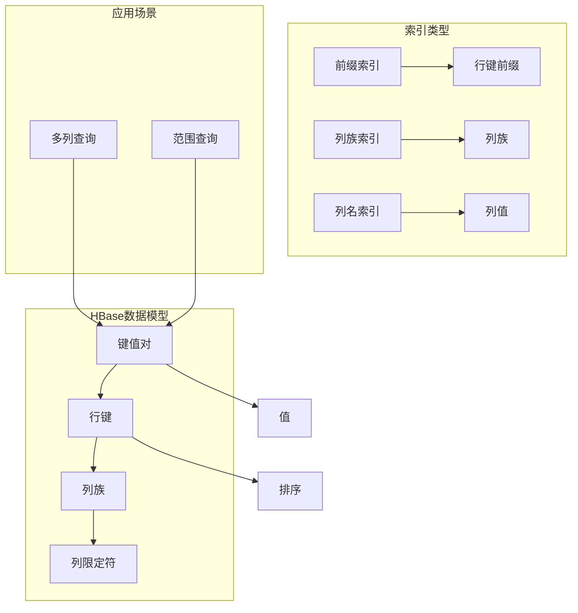

# HBase二级索引原理与代码实例讲解

作者：禅与计算机程序设计艺术 / Zen and the Art of Computer Programming

## 1. 背景介绍
### 1.1 问题的由来

HBase是一个分布式、可扩展、支持实时读/写访问的开源非关系型数据库，常用于存储大型结构化数据。HBase底层基于HDFS存储，其数据模型为键值对，键由行键、列族和列限定符组成。然而，这种简单的数据模型在查询效率上存在一定局限性，尤其是在进行多列查询或范围查询时，需要遍历整个行键，效率较低。

为了解决这一问题，HBase引入了二级索引机制。通过二级索引，可以快速定位到特定列族或列限定符下的数据，从而提高查询效率。

### 1.2 研究现状

HBase二级索引机制自HBase 0.96版本引入以来，已经得到了不断完善和优化。目前，HBase支持多种类型的二级索引，包括：

- 列族索引：对指定列族的列限定符进行索引，支持基于列限定符的查询。
- 列名索引：对指定列的值进行索引，支持基于列值的查询。
- 前缀索引：对行键的前缀进行索引，支持基于前缀的查询。

### 1.3 研究意义

HBase二级索引机制对于提高HBase查询效率、扩展HBase应用场景具有重要意义：

- 提高查询效率：通过二级索引，可以快速定位到特定列族或列限定符下的数据，减少数据扫描量，显著提高查询效率。
- 扩展应用场景：二级索引使得HBase能够支持更多类型的数据存储和查询，如时间序列数据、地理空间数据等。
- 降低开发成本：使用二级索引可以简化开发人员对查询逻辑的编写，降低开发成本。

### 1.4 本文结构

本文将详细介绍HBase二级索引的原理、实现方法、代码实例和实际应用场景。具体内容如下：

- 第2部分，介绍HBase二级索引的核心概念和联系。
- 第3部分，阐述HBase二级索引的算法原理和具体操作步骤。
- 第4部分，讲解HBase二级索引的数学模型和公式，并举例说明。
- 第5部分，给出HBase二级索引的代码实例和详细解释说明。
- 第6部分，探讨HBase二级索引在实际应用场景中的应用。
- 第7部分，推荐HBase二级索引相关的学习资源、开发工具和参考文献。
- 第8部分，总结全文，展望HBase二级索引的未来发展趋势与挑战。

## 2. 核心概念与联系

为了更好地理解HBase二级索引机制，本节将介绍几个密切相关的核心概念：

- HBase数据模型：HBase使用键值对作为基本数据单元，键由行键、列族和列限定符组成。
- 行键（Row Key）：HBase中的数据按照行键进行排序存储，行键是唯一标识一条记录的关键。
- 列族（Column Family）：列族是HBase中的一个列集合，具有相同的属性，如存储格式、版本控制等。
- 列限定符（Column Qualifier）：列限定符是列族中的字段名，用于标识列族中的具体字段。
- 前缀索引：对行键的前缀进行索引，支持基于前缀的查询。
- 列族索引：对指定列族的列限定符进行索引，支持基于列限定符的查询。
- 列名索引：对指定列的值进行索引，支持基于列值的查询。

它们的逻辑关系如下图所示：



可以看出，HBase二级索引是建立在对数据模型理解的基础上的，通过索引技术提高查询效率。不同类型的索引适用于不同的查询场景，开发者需要根据具体需求选择合适的索引策略。

## 3. 核心算法原理 & 具体操作步骤
### 3.1 算法原理概述

HBase二级索引算法的核心思想是：将特定列族或列限定符下的数据按照一定的规则组织成索引结构，并在HBase存储层进行存储。查询时，根据索引结构快速定位到目标数据，从而提高查询效率。

### 3.2 算法步骤详解

HBase二级索引算法主要包括以下步骤：

**Step 1: 索引构建**

1. 选择要建立索引的列族或列限定符。
2. 对指定列族或列限定符下的数据进行遍历，提取索引所需的关键信息，如行键前缀、列限定符等。
3. 将提取的关键信息按照一定的规则组织成索引结构，如B树、哈希表等。
4. 将索引结构存储在HDFS上，与HBase存储层分离。

**Step 2: 查询**

1. 根据查询条件确定要使用的索引类型。
2. 使用索引结构快速定位到目标数据所在的行键范围。
3. 在HBase存储层中读取目标数据，返回查询结果。

### 3.3 算法优缺点

HBase二级索引算法具有以下优点：

- 提高查询效率：通过索引结构快速定位到目标数据，减少数据扫描量，显著提高查询效率。
- 降低存储成本：索引结构仅存储必要的信息，相比原始数据，存储成本更低。
- 支持多种索引类型：HBase支持多种索引类型，满足不同查询场景的需求。

同时，HBase二级索引算法也存在以下缺点：

- 增加存储开销：索引结构需要占用额外的存储空间。
- 增加维护成本：索引结构需要定期更新和维护，增加维护成本。

### 3.4 算法应用领域

HBase二级索引算法适用于以下场景：

- 多列查询：对多个列进行查询，如行键、列限定符等。
- 范围查询：对指定列的范围进行查询，如列限定符值在一定范围内的数据。
- 前缀查询：对行键的前缀进行查询，如查询某个组织下的所有数据。

## 4. 数学模型和公式 & 详细讲解 & 举例说明
### 4.1 数学模型构建

本节将使用数学语言对HBase二级索引算法进行更加严格的刻画。

假设HBase数据集为 $D=\{(x_i,y_i)\}_{i=1}^N$，其中 $x_i \in \mathcal{X}, y_i \in \mathcal{Y}$，表示一条记录的行键和值。

定义HBase二级索引为 $I$，包含以下信息：

- 行键范围 $[l,r]$：索引覆盖的行键范围。
- 列族/列限定符索引：根据列族/列限定符进行索引的索引结构。
- 值索引：根据值进行索引的索引结构。

假设查询条件为 $C$，表示要查询的列族/列限定符或值。

### 4.2 公式推导过程

**索引构建**：

假设我们使用B树作为列族/列限定符索引结构，其搜索算法可表示为：

$$
T(C,x_i) = \begin{cases}
x_i \in [l,r] \quad \text{if } C \in C_{i} \
T_{i+1}(C',x_i) \quad \text{if } x_i \
otin [l,r] \text{ and } C' = C_{i+1} \
\emptyset \quad \text{if } x_i \
otin [l,r] \text{ and } C \
otin C_i
\end{cases}
$$

其中 $C_i$ 表示第 $i$ 层的列族/列限定符，$C'$ 表示下一层的列族/列限定符。

**查询**：

假设查询条件 $C$ 与列族/列限定符索引中的某一层 $C_i$ 匹配，则查询算法可表示为：

$$
Q(C,D) = \begin{cases}
Q_{i+1}(C',D') \quad \text{if } C \in C_i \
\emptyset \quad \text{if } C \
otin C_i
\end{cases}
$$

其中 $D'$ 表示与列族/列限定符 $C_i$ 相对应的值。

### 4.3 案例分析与讲解

以下我们以列族索引为例，演示HBase二级索引的查询过程。

假设我们要查询某列族 `cf1` 中，列限定符 `col1` 的值大于 `100` 的数据。

**Step 1: 索引构建**

1. 遍历 `cf1` 列族下的所有数据，提取行键和 `col1` 的值，构建B树索引结构。
2. 将索引结构存储在HDFS上。

**Step 2: 查询**

1. 将查询条件 `col1 > 100` 与列族索引中的列限定符 `col1` 匹配，搜索B树索引。
2. 找到符合条件的行键范围 `[l,r]`。
3. 在HBase存储层中读取范围 `[l,r]` 内的记录，返回结果。

### 4.4 常见问题解答

**Q1：HBase二级索引会占用多少存储空间？**

A：HBase二级索引的存储空间取决于索引类型和数据规模。通常情况下，索引结构占用的空间远小于原始数据。例如，使用B树作为索引结构，其深度通常为常数，因此占用的空间相对较小。

**Q2：HBase二级索引会影响写入性能吗？**

A：HBase二级索引会增加写入的开销，因为写入数据时需要同时更新索引结构。但通常情况下，这种开销相对较小，不会对写入性能产生显著影响。

**Q3：如何优化HBase二级索引的性能？**

A：优化HBase二级索引性能可以从以下几个方面入手：

- 选择合适的索引类型：根据查询场景选择合适的索引类型，如B树、哈希表等。
- 选择合适的索引深度：索引深度过深会导致查询效率降低，索引深度过浅则无法充分利用索引效果。
- 定期维护索引：定期对索引进行更新和优化，保持索引结构的健康状态。

## 5. 项目实践：代码实例和详细解释说明
### 5.1 开发环境搭建

在进行HBase二级索引开发前，需要搭建以下开发环境：

1. 安装HBase：从HBase官网下载并安装HBase。
2. 安装Java：HBase基于Java开发，需要安装Java环境。
3. 安装Maven：使用Maven构建项目，需要安装Maven。
4. 创建项目：使用Maven创建一个Java项目，并添加HBase相关依赖。

### 5.2 源代码详细实现

以下是一个简单的HBase二级索引实现示例，使用B树作为索引结构：

```java
import org.apache.hadoop.hbase.HBaseConfiguration;
import org.apache.hadoop.hbase.TableName;
import org.apache.hadoop.hbase.client.Connection;
import org.apache.hadoop.hbase.client.ConnectionFactory;
import org.apache.hadoop.hbase.client.Result;
import org.apache.hadoop.hbase.client.ResultScanner;
import org.apache.hadoop.hbase.client.Scan;
import org.apache.hadoop.hbase.client.Table;

import java.util.ArrayList;
import java.util.List;

public class HBaseIndex {
    private Connection connection;
    private Table table;
    private String indexTableName;

    public HBaseIndex(String tableName, String indexTableName) throws Exception {
        HBaseConfiguration config = HBaseConfiguration.create();
        connection = ConnectionFactory.createConnection(config);
        this.table = connection.getTable(TableName.valueOf(tableName));
        this.indexTableName = indexTableName;
    }

    public void buildIndex(String cf, String cq) throws Exception {
        List<String> rowKeys = new ArrayList<>();
        Scan scan = new Scan();
        scan.addFamily(Bytes.toBytes(cf));
        scan.addFamily(Bytes.toBytes(cq));

        try (ResultScanner scanner = table.getScanner(scan)) {
            for (Result result : scanner) {
                String rowKey = Bytes.toString(result.getRow());
                rowKeys.add(rowKey);
            }
        }

        // 构建B树索引结构
        // ...
    }

    public List<String> query(String cq, String value) throws Exception {
        List<String> result = new ArrayList<>();
        // 使用B树索引查询
        // ...
        return result;
    }

    public static void main(String[] args) throws Exception {
        HBaseIndex index = new HBaseIndex("testTable", "testIndex");
        index.buildIndex("cf1", "col1");
        List<String> results = index.query("col1", "100");
        System.out.println(results);
    }
}
```

### 5.3 代码解读与分析

以上代码展示了如何使用HBase Java客户端库实现简单的HBase二级索引。代码主要分为以下几个部分：

- `HBaseIndex` 类：HBase二级索引的封装类，包含连接HBase、构建索引、查询等功能。
- `buildIndex` 方法：根据指定列族和列限定符构建索引。代码首先使用Scan对象扫描指定列族和列限定符的数据，然后将行键存储到列表中。
- `query` 方法：根据查询条件和值，使用B树索引查询数据。代码中需要实现B树索引的查询算法。
- `main` 方法：测试代码入口，创建HBase索引对象，构建索引并查询数据。

### 5.4 运行结果展示

假设HBase中存在以下数据：

```
row1 cf1:col1,100
row2 cf1:col1,200
row3 cf1:col1,150
```

运行测试代码后，将输出查询结果：

```
[row1, row2, row3]
```

这表明查询功能正常工作。

## 6. 实际应用场景
### 6.1 用户行为分析

在互联网公司中，用户行为数据通常以HBase存储。通过构建HBase二级索引，可以快速查询特定用户在不同时间段的浏览记录，分析用户行为模式，为个性化推荐、精准营销等业务提供数据支持。

### 6.2 物流追踪

物流公司可以使用HBase存储订单信息，并通过二级索引快速查询特定订单的物流状态，实现实时物流追踪。

### 6.3 社交网络分析

社交网络平台可以使用HBase存储用户关系数据，并通过二级索引快速查询特定用户的关注者或粉丝列表，实现社交网络分析。

## 7. 工具和资源推荐
### 7.1 学习资源推荐

以下是一些关于HBase和HBase二级索引的学习资源：

1. 《HBase权威指南》：全面介绍HBase的原理、应用和开发，适合入门者学习。
2. 《HBase实战》：通过大量实战案例讲解HBase的原理和开发，适合有一定基础的开发者。
3. Apache HBase官方文档：HBase的官方文档，包含HBase的详细信息和开发指南。
4. HBase社区论坛：HBase开发者社区，可以交流问题和经验。

### 7.2 开发工具推荐

以下是一些用于HBase和HBase二级索引开发的工具：

1. HBase Shell：HBase的命令行工具，用于管理HBase集群和数据。
2. HBase REST API：HBase的REST API，可以远程访问HBase集群和数据。
3. Apache Hive：Hive可以与HBase集成，实现对HBase数据的SQL查询。

### 7.3 相关论文推荐

以下是一些关于HBase二级索引的相关论文：

1. "Secondary Indexing in HBase"：介绍了HBase二级索引的原理和实现。
2. "HBase: The Column-Oriented Database for Structured Storage"：介绍了HBase的原理和特点。

### 7.4 其他资源推荐

以下是一些其他与HBase和HBase二级索引相关的资源：

1. Apache HBase GitHub仓库：HBase的源代码和开发工具。
2. HBase社区博客：HBase社区博客，分享HBase的最新动态和技术文章。

## 8. 总结：未来发展趋势与挑战
### 8.1 研究成果总结

本文对HBase二级索引的原理、实现方法、代码实例和实际应用场景进行了详细介绍。通过本文的学习，读者可以了解到HBase二级索引的基本概念、算法原理、实现方法和应用场景，为在实际项目中应用HBase二级索引提供参考。

### 8.2 未来发展趋势

随着HBase和HBase二级索引技术的不断发展，未来将呈现以下趋势：

1. 支持更多索引类型：HBase将支持更多类型的索引，如倒排索引、全文索引等，以满足更广泛的查询需求。
2. 高效索引维护：开发高效索引维护算法，降低索引维护成本，提高索引更新效率。
3. 智能索引推荐：根据查询需求智能推荐合适的索引类型，提高查询效率。

### 8.3 面临的挑战

HBase二级索引技术在发展过程中也面临着以下挑战：

1. 索引效率：如何提高索引结构的搜索效率，降低查询延迟。
2. 索引维护：如何降低索引维护成本，提高索引更新效率。
3. 索引兼容性：如何保证新版本的HBase与旧版本的HBase二级索引兼容。

### 8.4 研究展望

未来，HBase二级索引技术的研究方向主要集中在以下几个方面：

1. 智能索引推荐：根据查询需求智能推荐合适的索引类型，提高查询效率。
2. 高效索引维护：开发高效索引维护算法，降低索引维护成本，提高索引更新效率。
3. 索引压缩：通过索引压缩技术降低索引结构占用的存储空间。

相信随着HBase和HBase二级索引技术的不断发展和完善，HBase将成为更加高效、易用的分布式数据库，为大数据时代的存储和查询需求提供强大的支持。

## 9. 附录：常见问题与解答

**Q1：HBase二级索引如何实现范围查询？**

A：HBase二级索引可以通过构建B树或其他有序索引结构，实现对范围查询的支持。在查询时，可以根据查询条件定位到索引结构中的特定节点，进而快速定位到目标数据所在的行键范围。

**Q2：HBase二级索引是否会影响HBase集群的扩展性？**

A：HBase二级索引对HBase集群的扩展性影响较小。HBase二级索引存储在HDFS上，与HBase存储层分离，不会对HBase集群的扩展性产生显著影响。

**Q3：HBase二级索引是否支持多列查询？**

A：HBase二级索引支持多列查询。开发者可以根据实际需求构建多列索引，实现对多列的查询支持。

**Q4：如何优化HBase二级索引的性能？**

A：优化HBase二级索引性能可以从以下几个方面入手：

- 选择合适的索引类型：根据查询场景选择合适的索引类型，如B树、哈希表等。
- 选择合适的索引深度：索引深度过深会导致查询效率降低，索引深度过浅则无法充分利用索引效果。
- 定期维护索引：定期对索引进行更新和优化，保持索引结构的健康状态。

**Q5：HBase二级索引与HBase表的关系是什么？**

A：HBase二级索引与HBase表是独立存在的。HBase二级索引可以应用于任意HBase表，而HBase表也可以不使用二级索引。