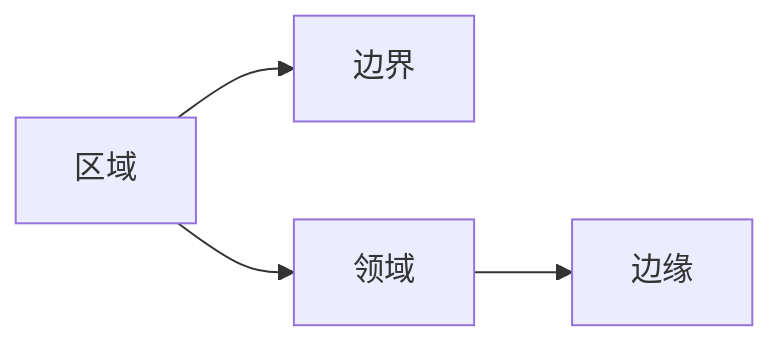

# Image Segmentation 原理与代码实战案例讲解

作者：禅与计算机程序设计艺术 / Zen and the Art of Computer Programming

## 1. 背景介绍
### 1.1 问题的由来

图像分割（Image Segmentation）是计算机视觉领域的一项基础任务，其目标是将图像划分为若干个互不重叠的区域，每个区域代表图像中的一个特定的场景或对象。图像分割在目标检测、物体识别、图像编辑等领域有着广泛的应用。

随着深度学习技术的发展，基于深度学习的图像分割方法逐渐成为主流。本文将介绍图像分割的基本原理，并通过实战案例讲解如何使用深度学习进行图像分割。

### 1.2 研究现状

近年来，基于深度学习的图像分割技术取得了显著的进展。常见的图像分割方法包括：

- 基于区域的方法：如基于图像灰度、纹理、颜色等特征的方法。
- 基于边界的方法：如基于边缘检测、轮廓提取的方法。
- 基于图的方法：如基于图割、图划分的方法。

基于深度学习的图像分割方法主要包括：

- 基于卷积神经网络（CNN）的方法：如FCN、U-Net、SegNet等。
- 基于生成对抗网络（GAN）的方法：如CycleGAN、pix2pixHD等。
- 基于注意力机制的方法：如注意力卷积神经网络（ACNN）、注意力区域图（ARG）等。

### 1.3 研究意义

图像分割技术在计算机视觉领域具有重要的研究意义和应用价值：

- 提高目标检测和识别的准确性：通过将图像分割成不同的区域，可以更精确地定位目标的位置和大小。
- 丰富图像编辑功能：可以对图像的各个区域进行独立编辑，如去除背景、改变颜色等。
- 促进医学图像分析：可以帮助医生更准确地诊断疾病，提高医疗效率。
- 促进自动驾驶技术：可以帮助自动驾驶系统更好地理解道路场景，提高行驶安全。

### 1.4 本文结构

本文将按照以下结构进行介绍：

- 第2部分，介绍图像分割的基本概念和联系。
- 第3部分，详细介绍基于深度学习的图像分割方法，包括U-Net、SegNet等。
- 第4部分，通过实战案例讲解如何使用深度学习进行图像分割。
- 第5部分，介绍图像分割在实际应用场景中的应用。
- 第6部分，展望图像分割技术的未来发展趋势。
- 第7部分，总结全文，并给出学习资源推荐。
- 第8部分，给出常见问题解答。

## 2. 核心概念与联系

图像分割的核心概念包括：

- 区域：图像分割的基本单元，代表图像中的一个特定场景或对象。
- 边界：区域之间的分界线，可以是模糊的或清晰的。
- 领域：具有相似特征的像素集合，可以是同一种颜色、纹理或形状。
- 边缘：区域边界的特征点，可以是像素值、纹理特征等。

这些概念之间的联系如下：



## 3. 核心算法原理 & 具体操作步骤
### 3.1 算法原理概述

基于深度学习的图像分割算法主要包括以下几种：

- FCN：全卷积神经网络，可以将任意尺寸的图像分割成任意尺寸的分割结果。
- U-Net：一种用于医学图像分割的卷积神经网络，具有特征金字塔网络结构。
- SegNet：一种基于深度学习的图像分割网络，具有卷积和下采样、上采样操作。
- FCN+Attention：在FCN的基础上引入注意力机制，提高分割精度。

### 3.2 算法步骤详解

以U-Net为例，其基本步骤如下：

1. 使用VGG-16作为基础网络，进行特征提取。
2. 将特征图进行下采样，提取全局特征。
3. 将下采样后的特征图进行上采样，并与原始特征图进行融合。
4. 在融合后的特征图上添加分类器，输出分割结果。

### 3.3 算法优缺点

- FCN：优点是简单易行，可以处理任意尺寸的图像；缺点是分割精度较低。
- U-Net：优点是分割精度较高，适用于医学图像分割；缺点是计算量较大。
- SegNet：优点是结构简单，易于实现；缺点是分割精度较低。
- FCN+Attention：优点是分割精度较高，可以有效地聚焦于图像的重要区域；缺点是模型复杂度较高。

### 3.4 算法应用领域

基于深度学习的图像分割方法在以下领域有着广泛的应用：

- 医学图像分割：如脑部肿瘤、心血管疾病、骨骼病变等。
- 目标检测和识别：如车辆检测、行人检测、人脸识别等。
- 图像编辑：如去除背景、改变颜色、风格迁移等。
- 自动驾驶：如道路检测、车道线检测、障碍物检测等。

## 4. 数学模型和公式 & 详细讲解 & 举例说明
### 4.1 数学模型构建

以U-Net为例，其数学模型可以表示为：

$$
y = f(x; \theta)
$$

其中，$x$ 为输入图像，$y$ 为输出分割结果，$f$ 为U-Net模型，$\theta$ 为模型参数。

### 4.2 公式推导过程

U-Net模型的公式推导过程如下：

1. 使用VGG-16进行特征提取，得到特征图 $F_1$。
2. 对特征图 $F_1$ 进行下采样，得到下采样特征图 $F_2$。
3. 将下采样特征图 $F_2$ 进行上采样，得到上采样特征图 $F_3$。
4. 将上采样特征图 $F_3$ 与原始特征图 $F_1$ 进行融合，得到融合特征图 $F_4$。
5. 在融合特征图 $F_4$ 上添加分类器，输出分割结果 $y$。

### 4.3 案例分析与讲解

以下是一个使用U-Net进行图像分割的案例：

```python
import numpy as np
import torch
import torch.nn as nn
from torch.utils.data import DataLoader
from torchvision import datasets, transforms
from torch.utils.data import Dataset
import matplotlib.pyplot as plt

# 定义数据集
class ImageDataset(Dataset):
    def __init__(self, img_dir, mask_dir, transform=None):
        self.img_dir = img_dir
        self.mask_dir = mask_dir
        self.transform = transform

    def __len__(self):
        return len(self.img_dir)

    def __getitem__(self, idx):
        img_path = self.img_dir[idx]
        mask_path = self.mask_dir[idx]
        image = Image.open(img_path)
        mask = Image.open(mask_path)

        if self.transform:
            image = self.transform(image)
            mask = self.transform(mask)

        return image, mask

# 加载数据集
transform = transforms.Compose([transforms.ToTensor()])
train_dataset = ImageDataset(train_img_dir, train_mask_dir, transform=transform)
train_loader = DataLoader(dataset=train_dataset, batch_size=4, shuffle=True)

# U-Net模型
class UNet(nn.Module):
    def __init__(self):
        super(UNet, self).__init__()
        self.conv1 = nn.Conv2d(3, 64, kernel_size=3, stride=1, padding=1)
        self.relu = nn.ReLU()
        # ... 其他层 ...

    def forward(self, x):
        # ... 前向传播 ...
        return output

# 训练模型
model = UNet()
optimizer = torch.optim.Adam(model.parameters(), lr=0.001)
criterion = nn.CrossEntropyLoss()

for epoch in range(epochs):
    for images, masks in train_loader:
        optimizer.zero_grad()
        outputs = model(images)
        loss = criterion(outputs, masks)
        loss.backward()
        optimizer.step()
```

### 4.4 常见问题解答

**Q1：如何选择合适的网络结构？**

A：选择合适的网络结构需要根据具体任务和数据特点进行综合考虑。对于医学图像分割等需要高精度的任务，可以采用U-Net、SegNet等网络结构；对于其他任务，可以尝试FCN、FCN+Attention等网络结构。

**Q2：如何优化模型性能？**

A：优化模型性能可以通过以下方法：

- 调整网络结构：尝试不同的网络结构，选择性能最好的模型。
- 调整超参数：调整学习率、批大小等超参数，找到最佳配置。
- 数据增强：通过旋转、翻转、裁剪等数据增强方法，增加数据集的多样性。
- 正则化：使用dropout、权重衰减等正则化方法，防止过拟合。

## 5. 项目实践：代码实例和详细解释说明
### 5.1 开发环境搭建

在进行图像分割项目之前，需要搭建以下开发环境：

1. Python环境：Python 3.6及以上版本。
2. 深度学习框架：PyTorch或TensorFlow。
3. 图像处理库：PIL或OpenCV。
4. 数据集：准备用于训练和测试的数据集。

### 5.2 源代码详细实现

以下是一个使用U-Net进行图像分割的完整代码实例：

```python
# ... 省略数据集定义和加载代码 ...

# U-Net模型
class UNet(nn.Module):
    def __init__(self):
        super(UNet, self).__init__()
        self.conv1 = nn.Conv2d(3, 64, kernel_size=3, stride=1, padding=1)
        self.relu = nn.ReLU()
        # ... 其他层 ...

    def forward(self, x):
        # ... 前向传播 ...
        return output

# 训练模型
model = UNet()
optimizer = torch.optim.Adam(model.parameters(), lr=0.001)
criterion = nn.CrossEntropyLoss()

for epoch in range(epochs):
    for images, masks in train_loader:
        optimizer.zero_grad()
        outputs = model(images)
        loss = criterion(outputs, masks)
        loss.backward()
        optimizer.step()

# 测试模型
model.eval()
test_loss = 0
with torch.no_grad():
    for images, masks in test_loader:
        outputs = model(images)
        test_loss += criterion(outputs, masks).item()
test_loss /= len(test_loader)

print(f"Test loss: {test_loss:.4f}")

# 保存模型
torch.save(model.state_dict(), "unet.pth")

# 使用模型进行图像分割
image = Image.open("test_image.jpg")
image = transform(image).unsqueeze(0)
output = model(image)
output = output.argmax(dim=1)
output = output.squeeze(0).cpu().numpy()
output = np.where(output > 0.5, 1, 0)

plt.imshow(output, cmap="gray")
plt.show()
```

### 5.3 代码解读与分析

以上代码实现了以下功能：

1. 定义数据集类，用于加载图像数据。
2. 定义U-Net模型，包括卷积层、池化层、上采样层等。
3. 训练模型，在训练集上进行迭代，更新模型参数。
4. 评估模型，在测试集上进行评估，计算损失。
5. 保存模型，将训练好的模型参数保存到文件中。
6. 使用模型进行图像分割，将测试图像分割成不同的区域。

### 5.4 运行结果展示

运行上述代码后，将在测试集上评估模型性能，并在控制台输出测试损失。同时，将测试图像分割成不同的区域，并展示分割结果。

## 6. 实际应用场景
### 6.1 医学图像分割

医学图像分割是图像分割技术的重要应用场景之一。通过对医学图像进行分割，可以提取出感兴趣的区域，如肿瘤、病变等，为医生提供更准确的诊断依据。

### 6.2 目标检测和识别

目标检测和识别是计算机视觉领域的另一个重要应用场景。通过对图像进行分割，可以更精确地定位目标的位置和大小，从而提高目标检测和识别的准确性。

### 6.3 图像编辑

图像编辑是图像处理领域的一个重要应用场景。通过对图像进行分割，可以独立地编辑图像的各个区域，如去除背景、改变颜色等。

### 6.4 未来应用展望

随着深度学习技术的发展，图像分割技术在更多领域将得到应用，如：

- 智能交通：如车辆检测、行人检测、交通标志识别等。
- 智能安防：如人脸识别、目标跟踪、异常检测等。
- 智能农业：如作物检测、病虫害检测、产量估计等。

## 7. 工具和资源推荐
### 7.1 学习资源推荐

以下是一些学习资源，可以帮助你更好地了解图像分割技术：

1. 《计算机视觉：算法与应用》
2. 《深度学习：卷积神经网络》
3. 《PyTorch深度学习实践》
4. 《Hugging Face Transformers》
5. 《计算机视觉：深度学习方法》

### 7.2 开发工具推荐

以下是一些开发工具，可以帮助你进行图像分割项目：

1. PyTorch或TensorFlow：深度学习框架
2. PIL或OpenCV：图像处理库
3. Hugging Face Transformers：预训练语言模型库
4. Jupyter Notebook：交互式计算环境

### 7.3 相关论文推荐

以下是一些与图像分割相关的论文：

1. "U-Net: Convolutional Networks for Biomedical Image Segmentation" (Ronneberger et al., 2015)
2. "DeepLab: Semantic Image Segmentation with Deep Convolutional Nets, Atrous Convolution, and Fully Connected CRFs" (Chen et al., 2018)
3. "An Empirical Evaluation of Generic Convolutional Neural Network Architectures for Natural Scene Text Detection" (Redmon et al., 2017)

### 7.4 其他资源推荐

以下是一些其他资源，可以帮助你了解图像分割技术的最新进展：

1. arXiv论文预印本
2. CVPR、ICCV、ECCV等顶会论文
3. Hugging Face官网

## 8. 总结：未来发展趋势与挑战
### 8.1 研究成果总结

本文介绍了图像分割的基本原理、核心算法、实战案例，以及在实际应用场景中的应用。通过学习本文，你将了解到图像分割技术的最新进展和未来发展趋势。

### 8.2 未来发展趋势

随着深度学习技术的不断发展，图像分割技术在以下方面将会有更大的突破：

- 模型结构：设计更加高效的模型结构，提高分割精度和速度。
- 数据集：构建更大、更丰富的数据集，提高模型的泛化能力。
- 应用领域：将图像分割技术应用到更多领域，如自动驾驶、机器人、遥感等。

### 8.3 面临的挑战

图像分割技术在发展过程中也面临着一些挑战：

- 数据不足：缺乏标注数据，难以进行有效的训练。
- 计算资源：深度学习模型需要大量的计算资源，对硬件要求较高。
- 模型可解释性：深度学习模型的决策过程难以解释，需要进一步研究。

### 8.4 研究展望

未来，图像分割技术将在以下方面进行深入研究：

- 数据增强：设计更加有效的数据增强方法，提高模型的泛化能力。
- 可解释性：提高模型的可解释性，使模型的决策过程更加透明。
- 跨模态学习：将图像分割技术与其他模态（如视频、音频）相结合，实现跨模态分割。

## 9. 附录：常见问题与解答

**Q1：什么是图像分割？**

A：图像分割是将图像划分为若干个互不重叠的区域，每个区域代表图像中的一个特定的场景或对象。

**Q2：图像分割有哪些应用？**

A：图像分割在医学图像分析、目标检测和识别、图像编辑等领域有着广泛的应用。

**Q3：什么是U-Net？**

A：U-Net是一种用于医学图像分割的卷积神经网络，具有特征金字塔网络结构。

**Q4：如何优化图像分割模型的性能？**

A：可以通过调整网络结构、调整超参数、数据增强、正则化等方法来优化图像分割模型的性能。

**Q5：图像分割有哪些挑战？**

A：图像分割面临的挑战包括数据不足、计算资源、模型可解释性等。

通过学习本文，相信你已经对图像分割技术有了更深入的了解。希望本文能够帮助你更好地进行图像分割项目。