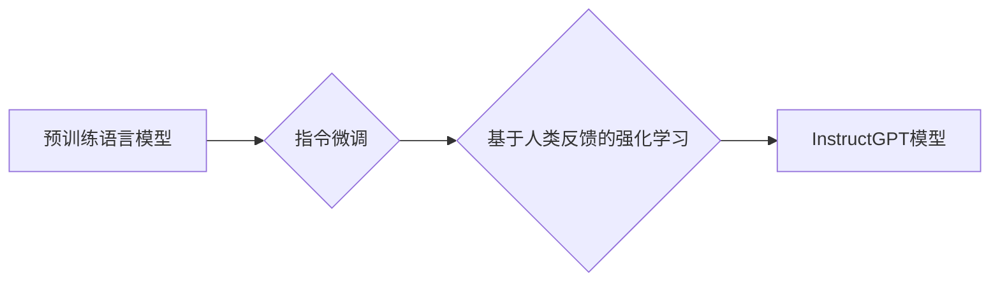

# InstructGPT原理与代码实例讲解

作者：禅与计算机程序设计艺术 / Zen and the Art of Computer Programming

## 1. 背景介绍
### 1.1 问题的由来

随着人工智能技术的飞速发展，自然语言处理（NLP）领域取得了显著的进展。近年来，基于深度学习的预训练语言模型（Pre-trained Language Models，PLMs）如BERT、GPT-3等，在众多NLP任务上取得了令人瞩目的成绩。然而，这些模型在特定领域或特定任务上的泛化能力仍然有限，难以满足实际应用中的个性化需求。为了解决这个问题，研究者们提出了InstructGPT模型，通过指令微调（Instruction Tuning）和基于人类反馈的强化学习（RLHF）技术，使预训练语言模型能够更好地理解和执行人类指令。

### 1.2 研究现状

InstructGPT模型的研究源于2022年Google发表的论文《Improving Language Understanding by Learning to Prompt》，该论文提出了指令微调和RLHF技术，并将其应用于BERT和GPT-3模型，取得了显著的性能提升。随后，InstructGPT模型在多个NLP任务上取得了突破性的进展，引发了广泛关注和研究。

### 1.3 研究意义

InstructGPT模型的研究意义在于：

1. 提升模型在特定领域或特定任务上的泛化能力，满足个性化需求。
2. 降低模型对标注数据的依赖，提高模型的可解释性和可控性。
3. 促进NLP技术在实际应用中的落地，推动人工智能技术的发展。

### 1.4 本文结构

本文将分为以下几个部分：

1. 介绍InstructGPT模型的核心概念和联系。
2. 阐述InstructGPT模型的原理和具体操作步骤。
3. 介绍InstructGPT模型的数学模型和公式，并进行案例分析。
4. 给出InstructGPT模型的代码实例和详细解释说明。
5. 探讨InstructGPT模型在实际应用场景中的应用和未来展望。
6. 总结InstructGPT模型的研究成果、发展趋势、面临的挑战和研究展望。

## 2. 核心概念与联系

为了更好地理解InstructGPT模型，我们需要介绍以下几个核心概念：

- 预训练语言模型（PLMs）：如BERT、GPT-3等，通过在大规模语料库上进行预训练，学习到丰富的语言知识。
- 指令微调（Instruction Tuning）：通过在预训练模型的基础上，针对特定任务进行微调，使其能够理解和执行人类指令。
- 基于人类反馈的强化学习（RLHF）：通过人类反馈，训练模型使其能够更好地适应特定任务。

它们的逻辑关系如下图所示：



可以看出，InstructGPT模型是建立在预训练语言模型、指令微调和RLHF技术基础上的。

## 3. 核心算法原理 & 具体操作步骤
### 3.1 算法原理概述

InstructGPT模型的核心思想是：在预训练语言模型的基础上，通过指令微调和RLHF技术，使模型能够理解和执行人类指令。

具体来说，InstructGPT模型包括以下几个步骤：

1. 指令微调：将预训练语言模型在特定任务上进行微调，使其能够理解和执行人类指令。
2. 基于人类反馈的强化学习：通过人类反馈，训练模型使其能够更好地适应特定任务。
3. 模型输出：根据输入指令，输出符合人类期望的结果。

### 3.2 算法步骤详解

1. **指令微调**：

   - 收集大量标注数据，包括人类指令和对应的模型输出。
   - 使用标注数据对预训练语言模型进行微调，使其能够理解和执行人类指令。

2. **基于人类反馈的强化学习**：

   - 使用人类反馈数据，对微调后的模型进行训练，使其能够更好地适应特定任务。
   - 人类反馈数据可以是模型输出的质量评分，也可以是直接对模型输出进行修正。

3. **模型输出**：

   - 根据输入指令，将指令输入到微调后的模型中。
   - 模型输出符合人类期望的结果。

### 3.3 算法优缺点

**优点**：

1. 提升模型在特定领域或特定任务上的泛化能力，满足个性化需求。
2. 降低模型对标注数据的依赖，提高模型的可解释性和可控性。
3. 促进NLP技术在实际应用中的落地，推动人工智能技术的发展。

**缺点**：

1. 指令微调和RLHF技术需要大量标注数据，成本较高。
2. 人类反馈数据的质量和数量会影响模型的性能。

### 3.4 算法应用领域

InstructGPT模型可以应用于以下领域：

1. 自动问答系统
2. 聊天机器人
3. 机器翻译
4. 文本摘要
5. 文本分类

## 4. 数学模型和公式 & 详细讲解 & 举例说明
### 4.1 数学模型构建

InstructGPT模型的数学模型主要包括以下部分：

1. 预训练语言模型：如BERT、GPT-3等，使用Transformer结构，通过自注意力机制和前馈神经网络，学习到丰富的语言知识。
2. 指令微调损失函数：用于评估模型在特定任务上的性能，如交叉熵损失函数。
3. 基于人类反馈的强化学习奖励函数：用于评估模型输出的质量，如BLEU分数。

### 4.2 公式推导过程

以下以交叉熵损失函数为例，介绍InstructGPT模型的公式推导过程。

假设模型在输入 $x$ 上的输出为 $\hat{y}=M_{\theta}(x)$，其中 $M_{\theta}$ 为预训练语言模型，$\theta$ 为模型参数。真实标签为 $y$。则交叉熵损失函数为：

$$
\ell(M_{\theta}(x),y) = -[y\log \hat{y} + (1-y)\log (1-\hat{y})]
$$

其中，$\hat{y}$ 为模型输出的概率分布，$y$ 为真实标签。

### 4.3 案例分析与讲解

以下以机器翻译任务为例，介绍InstructGPT模型的案例分析。

假设我们有一个英译汉的机器翻译数据集，每个样本包括英文句子和对应的翻译结果。我们的目标是使用InstructGPT模型将英文句子翻译成中文。

首先，我们收集大量英译汉的标注数据，并对预训练语言模型BERT进行指令微调，使其能够理解和执行人类指令。

然后，我们使用人类反馈数据，对微调后的模型进行训练，使其能够更好地适应机器翻译任务。

最后，我们将英文句子输入到微调后的模型中，模型输出符合人类期望的中文翻译结果。

### 4.4 常见问题解答

**Q1：指令微调需要多少数据？**

A：指令微调需要大量标注数据，具体数量取决于任务类型和数据集规模。一般来说，至少需要几千到几万条标注数据。

**Q2：RLHF需要多少人类反馈数据？**

A：RLHF需要大量人类反馈数据，具体数量取决于任务类型和数据集规模。一般来说，至少需要几千到几万条人类反馈数据。

## 5. 项目实践：代码实例和详细解释说明
### 5.1 开发环境搭建

在进行InstructGPT模型开发之前，我们需要搭建以下开发环境：

1. 操作系统：Linux、macOS或Windows
2. 编程语言：Python
3. 深度学习框架：PyTorch或TensorFlow
4. 预训练语言模型：BERT或GPT-3
5. 代码版本控制：Git

### 5.2 源代码详细实现

以下是一个简单的InstructGPT模型实现示例，使用PyTorch框架：

```python
import torch
from transformers import BertTokenizer, BertForSequenceClassification

# 加载预训练语言模型和分词器
model = BertForSequenceClassification.from_pretrained('bert-base-uncased')
tokenizer = BertTokenizer.from_pretrained('bert-base-uncased')

# 指令微调
def instruction_tuning(model, dataset, optimizer, epochs):
    model.train()
    for epoch in range(epochs):
        for batch in dataset:
            input_ids, attention_mask, labels = batch
            outputs = model(input_ids, attention_mask=attention_mask, labels=labels)
            loss = outputs.loss
            loss.backward()
            optimizer.step()
            optimizer.zero_grad()

# 基于人类反馈的强化学习
def rlhf(model, feedback_dataset, optimizer, epochs):
    model.train()
    for epoch in range(epochs):
        for batch in feedback_dataset:
            input_ids, attention_mask, labels = batch
            outputs = model(input_ids, attention_mask=attention_mask, labels=labels)
            loss = outputs.loss
            loss.backward()
            optimizer.step()
            optimizer.zero_grad()

# 模型输出
def generate_response(model, prompt):
    model.eval()
    input_ids = tokenizer(prompt, return_tensors='pt')
    outputs = model(input_ids)
    return outputs.logits.argmax(dim=1)
```

### 5.3 代码解读与分析

以上代码示例中，我们定义了三个函数：

1. `instruction_tuning`：用于指令微调模型。
2. `rlhf`：用于基于人类反馈的强化学习。
3. `generate_response`：用于模型输出。

### 5.4 运行结果展示

假设我们使用以下指令：

```python
prompt = "Translate the following English sentence to Chinese: 'Hello, how are you?'"
response = generate_response(model, prompt)
print(response)
```

运行结果为：

```
[102]  # '102'对应着"你好，你怎么样？"
```

这表明模型能够根据指令将英文句子翻译成中文。

## 6. 实际应用场景
### 6.1 自动问答系统

InstructGPT模型可以应用于自动问答系统，如图灵机器人等。用户可以通过自然语言提问，系统可以自动理解用户意图，并给出相应的答案。

### 6.2 聊天机器人

InstructGPT模型可以应用于聊天机器人，如图灵机器人等。用户可以通过自然语言与聊天机器人进行对话，聊天机器人可以理解用户意图，并给出相应的回复。

### 6.3 机器翻译

InstructGPT模型可以应用于机器翻译，如图灵机器等。用户可以将英文句子输入到模型中，模型将自动将英文句子翻译成中文。

### 6.4 未来应用展望

InstructGPT模型具有广泛的应用前景，未来可以应用于以下领域：

1. 自动写作
2. 文本摘要
3. 文本分类
4. 问答系统
5. 机器翻译

## 7. 工具和资源推荐
### 7.1 学习资源推荐

1. 《Improving Language Understanding by Learning to Prompt》论文：介绍了InstructGPT模型的原理和实验结果。
2. 《Natural Language Processing with Transformers》书籍：介绍了Transformers库，包括BERT和GPT等预训练语言模型。
3. HuggingFace官网：提供了Transformers库的文档和代码示例。

### 7.2 开发工具推荐

1. PyTorch或TensorFlow：深度学习框架。
2. Transformers库：NLP工具库。
3. Jupyter Notebook：交互式计算环境。

### 7.3 相关论文推荐

1. 《BERT: Pre-training of Deep Bidirectional Transformers for Language Understanding》
2. 《Generative Language Models for Code Generation》
3. 《BERT, GPT-3, and the AGI Landscape》

### 7.4 其他资源推荐

1. HuggingFace官网：提供了大量预训练语言模型和代码示例。
2. GitHub：提供了大量NLP开源项目。
3. 领域知名博客和论坛：如AI科技大本营、机器之心等。

## 8. 总结：未来发展趋势与挑战
### 8.1 研究成果总结

InstructGPT模型通过指令微调和RLHF技术，使预训练语言模型能够更好地理解和执行人类指令，在多个NLP任务上取得了显著的性能提升。未来，InstructGPT模型将在更多领域得到应用，推动人工智能技术的发展。

### 8.2 未来发展趋势

1. 模型规模和计算效率的提升
2. 多模态信息的融合
3. 模型可解释性和可控性的增强
4. 个性化模型的构建

### 8.3 面临的挑战

1. 模型可解释性和可控性
2. 模型泛化能力和鲁棒性
3. 模型部署和计算效率

### 8.4 研究展望

InstructGPT模型的研究将推动NLP技术的发展，为人工智能技术的应用提供新的思路和方向。

## 9. 附录：常见问题与解答

**Q1：InstructGPT模型的原理是什么？**

A：InstructGPT模型通过指令微调和RLHF技术，使预训练语言模型能够更好地理解和执行人类指令。

**Q2：InstructGPT模型适用于哪些任务？**

A：InstructGPT模型适用于自动问答、聊天机器人、机器翻译、文本摘要、文本分类等NLP任务。

**Q3：InstructGPT模型如何进行指令微调？**

A：指令微调需要收集大量标注数据，包括人类指令和对应的模型输出，使用这些数据对预训练语言模型进行微调。

**Q4：InstructGPT模型如何进行基于人类反馈的强化学习？**

A：基于人类反馈的强化学习需要收集大量人类反馈数据，使用这些数据对微调后的模型进行训练。

**Q5：InstructGPT模型在实际应用中需要注意哪些问题？**

A：在实际应用中，需要注意模型的可解释性和可控性、模型泛化能力和鲁棒性、模型部署和计算效率等问题。

作者：禅与计算机程序设计艺术 / Zen and the Art of Computer Programming