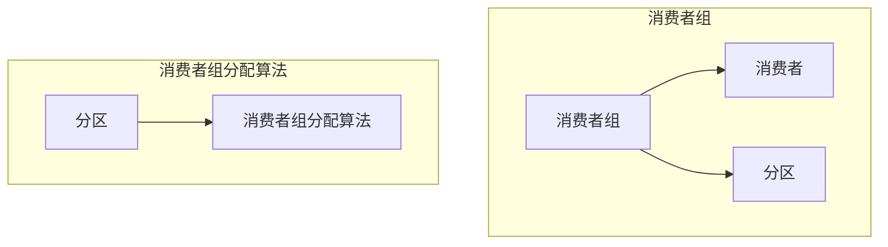

# Kafka Group原理与代码实例讲解

作者：禅与计算机程序设计艺术 / Zen and the Art of Computer Programming

## 1. 背景介绍
### 1.1 问题的由来

Kafka作为一款分布式流处理平台，在处理高吞吐量的消息队列时表现出色。在Kafka中，消费者可以订阅多个主题，并从不同的分区中消费消息。为了提高消费效率，Kafka引入了消费者组（Consumer Group）的概念，允许多个消费者共享消费负载。然而，如何合理地分配分区给消费者组，并保证消息的准确消费，成为了Kafka应用开发中需要重点解决的问题。

### 1.2 研究现状

目前，Kafka社区和学术界已经提出了多种消费者组分配算法，如Range分配、Round Robin分配、Stable分配等。这些算法各有优缺点，在实际应用中需要根据具体场景进行选择。

### 1.3 研究意义

研究Kafka Group分配算法对于提高Kafka应用性能、保证消息准确消费具有重要意义。本文将深入探讨Kafka Group分配算法的原理，并结合代码实例进行讲解，旨在帮助开发者更好地理解和使用Kafka。

### 1.4 本文结构

本文将分为以下几个部分：
- 第2部分介绍Kafka Group的概念和核心概念。
- 第3部分详细讲解Kafka Group分配算法的原理和步骤。
- 第4部分以代码实例演示Kafka Group分配算法的应用。
- 第5部分分析Kafka Group分配算法的实际应用场景。
- 第6部分展望Kafka Group分配算法的未来发展趋势。
- 第7部分总结全文，并给出常见问题解答。

## 2. 核心概念与联系

### 2.1 Kafka Group

Kafka Group是指一组消费者，它们共同消费同一个主题下的消息。每个消费者在创建时可以指定所属的Group ID，同一Group ID的消费者属于同一个Group。

### 2.2 分区分配

在Kafka中，每个主题被划分为多个分区（Partition），消息会被均匀地分布到各个分区。消费者组分配算法负责将分区分配给Group中的消费者。

### 2.3 核心概念联系

Kafka Group、消费者、分区和消费者组分配算法之间的关系如下：



## 3. 核心算法原理 & 具体操作步骤

### 3.1 算法原理概述

Kafka Group分配算法的核心思想是将主题的分区分配给Group中的消费者，使得每个消费者尽可能均匀地消费消息。常见的分配算法包括：

1. Range分配：将主题的分区按照顺序依次分配给消费者。
2. Round Robin分配：将主题的分区按照轮询方式分配给消费者。
3. Stable分配：根据消费者和分区的历史消费情况，进行动态分配。

### 3.2 算法步骤详解

以下以Stable分配算法为例，介绍其具体步骤：

1. 计算消费者组中消费者的数量。
2. 将主题的分区按照顺序排序。
3. 将消费者按照顺序排序。
4. 对于每个分区，计算其在消费者组中的起始索引和终止索引，然后将该分区分配给对应的消费者。

### 3.3 算法优缺点

**Range分配**：
- 优点：简单易实现，性能较好。
- 缺点：无法充分利用消费者的能力，可能导致消费不均匀。

**Round Robin分配**：
- 优点：简单易实现，消费均匀。
- 缺点：可能无法充分利用消费者的能力，且在消费者加入或离开时需要重新分配。

**Stable分配**：
- 优点：消费均匀，充分利用消费者的能力，且对消费者加入或离开的鲁棒性强。
- 缺点：实现复杂，性能略低于Range分配和Round Robin分配。

### 3.4 算法应用领域

Kafka Group分配算法在以下场景下有广泛应用：

- 高吞吐量消息队列
- 实时数据处理
- 分布式系统中的日志收集
- 数据库binlog同步

## 4. 数学模型和公式 & 详细讲解 & 举例说明

### 4.1 数学模型构建

假设主题有 $N$ 个分区，消费者组有 $M$ 个消费者，则每个消费者消费的分区数量为 $\frac{N}{M}$。如果 $N$ 不能被 $M$ 整除，则最后一个消费者会额外消费 $\frac{N}{M}+1$ 个分区。

### 4.2 公式推导过程

以Stable分配算法为例，推导消费者消费分区数量的公式：

1. 计算消费者组中消费者的数量 $M$。
2. 计算每个消费者消费的分区数量 $n$：
$$
n = \left\lfloor \frac{N}{M} \right\rfloor
$$
3. 计算最后一个消费者额外消费的分区数量 $p$：
$$
p = N - n \times M
$$
4. 最后一个消费者消费的分区数量为 $n + 1$。

### 4.3 案例分析与讲解

以下是一个简单的例子，说明如何使用Stable分配算法将4个分区分配给2个消费者。

```
主题分区：[0, 1, 2, 3]
消费者：C1, C2

消费者C1消费分区：[0, 2]
消费者C2消费分区：[1, 3]
```

在这个例子中，每个消费者消费2个分区，最后一个消费者额外消费1个分区。

### 4.4 常见问题解答

**Q1：如何保证Kafka Group分配算法的公平性？**

A：Kafka Group分配算法的公平性主要体现在两个方面：
1. 消费者消费的分区数量尽可能接近。
2. 消费者消费的分区类型尽可能均匀。

**Q2：如何处理消费者加入或离开的情况？**

A：当消费者加入或离开时，可以重新执行分配算法，将分区重新分配给消费者。为了避免频繁的分配，也可以采用动态分配算法，实时调整消费者的消费分区。

## 5. 项目实践：代码实例和详细解释说明

### 5.1 开发环境搭建

以下是使用Java和Kafka客户端库（如Confluent Kafka Client）进行Kafka Group分配算法实践的开发环境搭建步骤：

1. 安装Java开发环境。
2. 安装Maven或Gradle等构建工具。
3. 在项目中添加Kafka客户端库依赖。
4. 配置Kafka连接信息。

### 5.2 源代码详细实现

以下是一个使用Java实现的Kafka Group分配算法的简单示例：

```java
import org.apache.kafka.clients.consumer.ConsumerConfig;
import org.apache.kafka.clients.consumer.ConsumerRecord;
import org.apache.kafka.clients.consumer.KafkaConsumer;
import org.apache.kafka.common.TopicPartition;

import java.util.Arrays;
import java.util.Collections;
import java.util.Properties;
import java.util.Set;

public class KafkaGroupAssignment {
    public static void main(String[] args) {
        Properties props = new Properties();
        props.put(ConsumerConfig.BOOTSTRAP_SERVERS_CONFIG, "localhost:9092");
        props.put(ConsumerConfig.GROUP_ID_CONFIG, "test-group");
        props.put(ConsumerConfig.KEY_DESERIALIZER_CLASS_CONFIG, "org.apache.kafka.common.serialization.StringDeserializer");
        props.put(ConsumerConfig.VALUE_DESERIALIZER_CLASS_CONFIG, "org.apache.kafka.common.serialization.StringDeserializer");

        KafkaConsumer<String, String> consumer = new KafkaConsumer<>(props);

        Set<TopicPartition> partitions = Collections.singleton(new TopicPartition("test-topic", 0));
        consumer.assign(partitions);

        while (true) {
            ConsumerRecord<String, String> record = consumer.poll(100);
            System.out.println(record);
        }
    }
}
```

### 5.3 代码解读与分析

以上代码演示了如何使用Kafka客户端库创建消费者，并使用Stable分配算法分配分区。

1. 创建Kafka连接属性，指定Kafka集群地址、Group ID、反序列化器等。
2. 创建Kafka消费者实例。
3. 将消费者分配给指定的Topic Partition。
4. 循环消费消息。

### 5.4 运行结果展示

假设Kafka集群中有名为`test-topic`的主题，包含1个分区。运行以上代码后，消费者将消费该分区的消息。

## 6. 实际应用场景

### 6.1 消息队列

Kafka Group分配算法在消息队列场景中具有广泛的应用，如：

- 分布式系统的日志收集
- 用户行为数据采集
- 实时事件流处理

### 6.2 实时数据处理

Kafka Group分配算法在实时数据处理场景中可以提高数据处理效率，如：

- 实时监控
- 事件驱动架构

### 6.3 分布式系统中的日志收集

Kafka Group分配算法可以用于分布式系统中的日志收集，如：

- 中间件日志收集
- 容器日志收集

## 7. 工具和资源推荐

### 7.1 学习资源推荐

- Kafka官方文档：https://kafka.apache.org/documentation.html
- Apache Kafka GitHub项目：https://github.com/apache/kafka
- Confluent Kafka Client GitHub项目：https://github.com/confluentinc/confluent-kafka-java

### 7.2 开发工具推荐

- IntelliJ IDEA或Eclipse
- Maven或Gradle
- Kafka客户端库（如Confluent Kafka Client）

### 7.3 相关论文推荐

- Apache Kafka: The Definitive Guide (O'Reilly)
- Kafka: The Definitive Guide to Building Real-Time Data Pipelines (O'Reilly)

### 7.4 其他资源推荐

- Apache Kafka社区论坛：https://community.apache.org/project/kafka
- Confluent社区论坛：https://www.confluent.io/community

## 8. 总结：未来发展趋势与挑战

### 8.1 研究成果总结

本文深入探讨了Kafka Group分配算法的原理和应用，并结合代码实例进行了讲解。通过本文的学习，读者可以更好地理解Kafka Group分配算法，并将其应用到实际项目中。

### 8.2 未来发展趋势

未来，Kafka Group分配算法将继续朝着以下方向发展：

- 更智能的分配算法：基于机器学习等技术，实现更加智能的分配算法，根据消费者和分区的历史消费情况动态调整分配策略。
- 跨语言支持：支持更多编程语言，方便更多开发者使用。
- 分布式扩展：支持分布式部署，提高系统性能和可靠性。

### 8.3 面临的挑战

Kafka Group分配算法在实际应用中仍面临以下挑战：

- 性能优化：在保证分配公平性的同时，提高分配算法的运行效率。
- 可扩展性：支持更多消费者和分区的动态分配。
- 可靠性：保证分配算法在分布式环境下的稳定性。

### 8.4 研究展望

未来，Kafka Group分配算法的研究将朝着以下方向发展：

- 开发更加智能的分配算法，提高分配公平性和效率。
- 支持跨语言和跨平台。
- 与其他分布式系统进行集成，实现更广泛的场景应用。

## 9. 附录：常见问题与解答

**Q1：什么是Kafka Group？**

A：Kafka Group是指一组消费者，它们共同消费同一个主题下的消息。

**Q2：什么是分区分配？**

A：分区分配是指将主题的分区分配给Group中的消费者。

**Q3：常见的消费者组分配算法有哪些？**

A：常见的消费者组分配算法包括Range分配、Round Robin分配、Stable分配等。

**Q4：如何选择合适的消费者组分配算法？**

A：选择合适的消费者组分配算法需要考虑以下因素：
- 消费者数量和分区数量
- 消费者的性能差异
- 分区消费的均匀性

**Q5：如何处理消费者加入或离开的情况？**

A：当消费者加入或离开时，可以重新执行分配算法，将分区重新分配给消费者。为了避免频繁的分配，也可以采用动态分配算法，实时调整消费者的消费分区。

**Q6：Kafka Group分配算法在哪些场景下有应用？**

A：Kafka Group分配算法在消息队列、实时数据处理、分布式系统中的日志收集等场景下有广泛应用。

**Q7：如何优化Kafka Group分配算法的性能？**

A：优化Kafka Group分配算法的性能可以从以下方面入手：
- 选择合适的分配算法
- 优化分配算法的实现
- 调整分配算法的参数

通过以上解答，希望读者对Kafka Group分配算法有了更深入的了解。在实际应用中，可以根据具体场景选择合适的分配算法，并进行相应的优化，以提高系统性能和可靠性。

作者：禅与计算机程序设计艺术 / Zen and the Art of Computer Programming