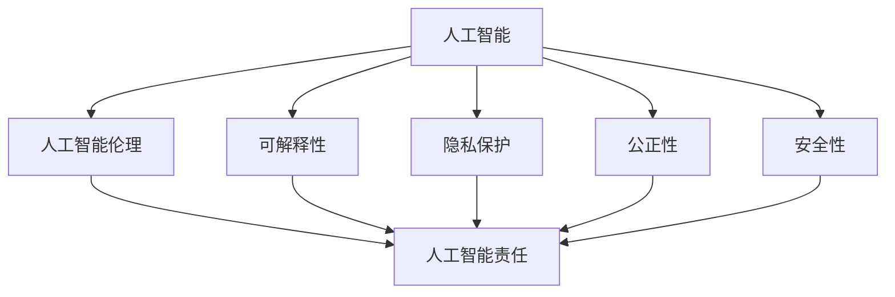
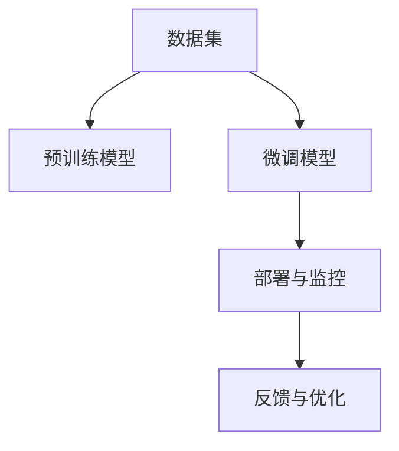

                 

# AI时代的人类增强：道德与责任

## 1. 背景介绍

### 1.1 问题由来

随着人工智能(AI)技术的迅猛发展，AI已悄然渗透到人类生活的方方面面。从智能家居、自动驾驶到医疗诊断、金融分析，AI正在重塑我们的世界。然而，AI技术在带来便利的同时，也引发了一系列伦理道德问题和责任挑战。诸如AI决策的透明性、公正性、安全性、隐私保护等问题，已成为社会各界关注的焦点。

### 1.2 问题核心关键点

AI时代的技术进步，既为人类社会发展提供了巨大的推动力，也带来了新的道德责任挑战：

- **透明性与公正性**：AI决策的"黑箱"问题，使得人们难以理解AI的决策依据。这可能导致决策过程的不透明性和公正性的缺失，从而引发公平性问题。
- **安全性与可靠性**：AI系统在面对极端情况或异常输入时，可能出现不可预料的错误，影响系统的安全性与可靠性。
- **隐私保护与数据安全**：AI系统在处理大量数据时，如何保障个人隐私不被侵犯，数据不被滥用，是一个重要的隐私问题。
- **伦理决策与人类福祉**：AI系统在应用中如何做出符合人类伦理道德的决策，确保其行为对人类的福祉有积极影响，是一个复杂的伦理问题。

这些问题不仅仅是技术问题，更是伦理道德层面的重大考量。如何平衡技术进步与伦理责任，确保AI技术服务于人类福祉，成为了当前亟待解决的重要课题。

## 2. 核心概念与联系

### 2.1 核心概念概述

为了更深入理解AI伦理与责任问题，本节将介绍几个核心概念及其内在联系：

- **人工智能**：利用算法和计算资源模拟人类智能行为的技术，包括机器学习、深度学习等。
- **人工智能伦理**：研究如何设计和应用人工智能技术，使其符合伦理道德标准，保障人类的福祉。
- **人工智能责任**：探讨AI系统在决策和行为中应承担的责任，确保其行为可解释、可追溯，并符合伦理规范。
- **可解释性**：AI模型的决策过程和结果可被人类理解的程度，是确保AI伦理和责任的前提。
- **隐私保护**：AI系统在处理数据时，如何保护个人隐私不受侵犯，避免数据滥用。
- **公正性**：AI系统的决策结果应尽可能公平公正，不因种族、性别、年龄等因素产生歧视。
- **安全性**：AI系统在各种异常情况下的鲁棒性，避免造成安全事故。

这些概念之间通过以下Mermaid流程图展示了它们之间的联系：



### 2.2 核心概念原理和架构的 Mermaid 流程图



该图展示了AI技术从数据收集、模型训练、部署到反馈优化的全流程。通过预训练和微调，AI模型学习任务相关的知识，并通过部署监控和反馈优化不断提升性能。

## 3. 核心算法原理 & 具体操作步骤

### 3.1 算法原理概述

AI时代的人类增强，主要依赖于两大算法范式：

1. **监督学习**：通过大量标注数据，训练AI模型以执行特定任务，如分类、回归、生成等。模型在训练过程中学习到任务相关的特征表示，从而能够在新数据上泛化。
2. **无监督学习**：利用未标注数据，通过聚类、降维等方法挖掘数据的内在结构。模型通过自我组织学习，发现数据中隐含的模式和规律。

这两种算法分别从有标签和无标签数据中学习，具有不同的应用场景和优势。

### 3.2 算法步骤详解

以监督学习为例，AI模型训练和增强的基本步骤如下：

1. **数据收集与预处理**：收集标注数据集，并进行清洗、归一化、特征提取等预处理步骤。
2. **模型选择与构建**：选择合适的模型架构，如深度神经网络，并进行初始化。
3. **模型训练**：通过反向传播算法，最小化损失函数，更新模型参数。
4. **模型验证与调优**：在验证集上评估模型性能，调整超参数，避免过拟合。
5. **模型部署与监控**：将模型部署到实际应用场景中，并设置监控机制，实时评估模型表现。
6. **反馈与优化**：根据实际应用反馈，不断优化模型，提升其性能和鲁棒性。

### 3.3 算法优缺点

监督学习的优点包括：

- **效果显著**：通过大量标注数据，监督学习能够获得较高的模型准确性和泛化能力。
- **可解释性强**：模型参数和决策过程可解释，便于理解和调试。

然而，监督学习也有如下缺点：

- **数据依赖性高**：需要大量标注数据，数据获取成本高，且标注质量直接影响模型性能。
- **泛化能力有限**：当标注数据分布与实际应用场景差异较大时，模型泛化能力受限。
- **过拟合风险**：模型容易过拟合训练集，导致在新数据上表现不佳。

### 3.4 算法应用领域

监督学习广泛应用于各种领域，例如：

- **自然语言处理**：文本分类、情感分析、机器翻译、语音识别等任务。
- **计算机视觉**：图像识别、目标检测、人脸识别、视频分析等任务。
- **医疗健康**：疾病诊断、病理分析、药物设计等任务。
- **金融分析**：信用评分、股票预测、欺诈检测等任务。
- **智能交通**：自动驾驶、交通流量分析、交通异常检测等任务。

## 4. 数学模型和公式 & 详细讲解 & 举例说明

### 4.1 数学模型构建

在监督学习中，常见的数学模型包括线性回归模型、决策树、支持向量机(SVM)、神经网络等。以神经网络为例，其数学模型可以表示为：

$$ y = \sum_{i=1}^m w_i f(x_i) $$

其中，$w$ 为模型权重，$m$ 为输入特征数，$f$ 为激活函数，$x$ 为输入数据，$y$ 为输出结果。

### 4.2 公式推导过程

以线性回归为例，最小二乘法的目标函数为：

$$ J(w) = \frac{1}{2N} \sum_{i=1}^N (y_i - \hat{y}_i)^2 $$

其中，$N$ 为样本数，$y_i$ 为真实标签，$\hat{y}_i$ 为模型预测结果。

通过最小化目标函数$J(w)$，求解得到模型参数$w$：

$$ \frac{\partial J(w)}{\partial w} = -\frac{1}{N} \sum_{i=1}^N (y_i - \hat{y}_i) \cdot f'(x_i) = 0 $$

求解得：

$$ w = (X^T X)^{-1} X^T y $$

其中，$X$ 为输入数据的特征矩阵，$f'(x_i)$ 为激活函数的导数。

### 4.3 案例分析与讲解

以图像识别为例，模型输入为经过预处理的图片像素矩阵，输出为图像分类结果。通过反向传播算法，模型不断更新权重$w$，最小化分类误差。具体步骤如下：

1. **数据预处理**：将图像像素转化为向量形式，并进行归一化处理。
2. **模型构建**：选择卷积神经网络(CNN)作为模型架构，进行参数初始化。
3. **前向传播**：输入图像数据，通过卷积层、池化层、全连接层等进行处理，输出分类结果。
4. **损失计算**：计算输出结果与真实标签之间的交叉熵损失。
5. **反向传播**：通过链式法则，计算梯度，更新模型参数。
6. **模型验证**：在验证集上评估模型性能，调整超参数，避免过拟合。
7. **模型部署**：将训练好的模型部署到实际应用场景中，进行推理预测。
8. **反馈优化**：根据实际应用反馈，不断优化模型，提升其性能和鲁棒性。

## 5. 项目实践：代码实例和详细解释说明

### 5.1 开发环境搭建

在进行AI项目实践前，需要准备开发环境。以下是使用Python进行TensorFlow开发的环境配置流程：

1. 安装Anaconda：从官网下载并安装Anaconda，用于创建独立的Python环境。
2. 创建并激活虚拟环境：
```bash
conda create -n tf-env python=3.7 
conda activate tf-env
```

3. 安装TensorFlow：根据CUDA版本，从官网获取对应的安装命令。例如：
```bash
conda install tensorflow=2.5.0
```

4. 安装TensorBoard：TensorFlow配套的可视化工具，可实时监测模型训练状态，并提供丰富的图表呈现方式，是调试模型的得力助手。

5. 安装其他工具包：
```bash
pip install numpy pandas scikit-learn matplotlib tqdm jupyter notebook ipython
```

完成上述步骤后，即可在`tf-env`环境中开始AI项目实践。

### 5.2 源代码详细实现

这里我们以图像识别项目为例，给出使用TensorFlow进行模型训练和评估的代码实现。

首先，定义模型和损失函数：

```python
import tensorflow as tf

model = tf.keras.Sequential([
    tf.keras.layers.Conv2D(32, (3,3), activation='relu', input_shape=(32,32,3)),
    tf.keras.layers.MaxPooling2D((2,2)),
    tf.keras.layers.Conv2D(64, (3,3), activation='relu'),
    tf.keras.layers.MaxPooling2D((2,2)),
    tf.keras.layers.Conv2D(64, (3,3), activation='relu'),
    tf.keras.layers.Flatten(),
    tf.keras.layers.Dense(64, activation='relu'),
    tf.keras.layers.Dense(10)
])

loss_fn = tf.keras.losses.SparseCategoricalCrossentropy()

model.compile(optimizer=tf.keras.optimizers.Adam(learning_rate=0.001),
              loss=loss_fn, metrics=['accuracy'])
```

然后，定义训练和评估函数：

```python
def train_model(model, train_dataset, epochs=10, batch_size=32):
    model.fit(train_dataset, epochs=epochs, batch_size=batch_size)

def evaluate_model(model, test_dataset, batch_size=32):
    test_loss, test_acc = model.evaluate(test_dataset, batch_size=batch_size)
    print('Test accuracy:', test_acc)
```

最后，启动模型训练流程并在测试集上评估：

```python
# 加载数据集
train_dataset = tf.keras.datasets.mnist.load_data()
test_dataset = tf.keras.datasets.mnist.load_data()

# 数据预处理
train_images = train_dataset[0] / 255.0
test_images = test_dataset[0] / 255.0

# 定义模型输入
train_images = tf.expand_dims(train_images, axis=-1)
test_images = tf.expand_dims(test_images, axis=-1)

# 定义标签
train_labels = train_dataset[1]
test_labels = test_dataset[1]

# 构建数据集
train_dataset = tf.data.Dataset.from_tensor_slices((train_images, train_labels))
test_dataset = tf.data.Dataset.from_tensor_slices((test_images, test_labels))

# 模型训练与评估
train_model(model, train_dataset)
evaluate_model(model, test_dataset)
```

以上就是使用TensorFlow进行图像识别项目微调的完整代码实现。可以看到，TensorFlow提供了强大的计算图和自动微分功能，使得模型构建、训练和评估变得相对简单。

### 5.3 代码解读与分析

让我们再详细解读一下关键代码的实现细节：

**模型构建**：
- 定义了一个包含卷积层、池化层和全连接层的神经网络模型。
- 输入图片大小为32x32，输出维度为10，对应10个类别的分类任务。

**损失函数与优化器**：
- 使用交叉熵损失函数，结合Adam优化器进行模型训练。

**数据预处理**：
- 将像素值归一化到[0,1]范围内。
- 将输入数据转换为张量形式，并进行维度扩展。

**数据集定义与加载**：
- 使用TensorFlow内置的MNIST数据集，定义训练集和测试集。

**模型训练与评估**：
- 使用`fit`方法进行模型训练，指定训练轮数和批次大小。
- 使用`evaluate`方法在测试集上评估模型性能。

**代码优化**：
- 使用`from_tensor_slices`方法定义数据集，高效地处理大量数据。
- 使用`expand_dims`方法扩展数据维度，满足模型输入要求。

通过以上代码，我们可以看到TensorFlow框架的强大功能和灵活性。开发者可以通过简单几行代码，快速构建、训练和评估深度学习模型。

## 6. 实际应用场景

### 6.1 医疗健康

在医疗健康领域，AI技术已广泛应用于疾病诊断、病理分析、药物设计等任务。AI系统通过分析海量医疗数据，辅助医生进行决策，提升诊疗效率和准确性。然而，AI系统在实际应用中如何确保其决策的可解释性和公正性，是一个重要的伦理问题。

### 6.2 金融分析

金融分析领域中，AI系统通过分析交易数据、市场趋势等，辅助分析师进行股票预测、风险评估、欺诈检测等任务。然而，AI系统的决策过程往往不透明，难以理解其内部逻辑。如何提高AI系统的可解释性，确保其决策符合伦理规范，是金融行业亟需解决的问题。

### 6.3 智能交通

智能交通领域中，AI系统通过分析交通流量、天气状况等数据，辅助交通管理部门进行路况预测、事故预防、交通管制等任务。然而，AI系统的决策结果可能受到数据偏见的影响，导致不公正的决策。如何消除数据偏见，确保AI系统公正、公平地服务社会，是交通行业需要重点考虑的问题。

### 6.4 未来应用展望

随着AI技术的不断进步，未来AI系统将在更多领域得到应用，为社会带来深远影响：

1. **自动驾驶**：AI系统通过分析摄像头、雷达等传感器数据，辅助车辆进行自主驾驶，提升交通安全和效率。
2. **智能家居**：AI系统通过分析用户行为数据，辅助家居设备进行智能控制，提升生活品质。
3. **教育培训**：AI系统通过分析学习数据，辅助教师进行个性化教学，提升教育效果。
4. **城市管理**：AI系统通过分析城市数据，辅助城市管理部门进行智慧治理，提升城市运行效率。

未来，AI技术将更加普及，为人类带来更多便利和福祉。然而，如何确保AI系统的伦理责任，避免潜在的风险和挑战，将是AI技术应用过程中需要持续关注的重要课题。

## 7. 工具和资源推荐

### 7.1 学习资源推荐

为了帮助开发者系统掌握AI技术的伦理与责任问题，这里推荐一些优质的学习资源：

1. 《人工智能伦理》系列博文：由知名AI专家撰写，深入浅出地介绍了AI伦理的基本概念和关键问题。
2. 《机器学习基石》课程：由斯坦福大学开设的机器学习课程，涵盖机器学习的基础理论和算法，适合初学者学习。
3. 《深度学习》书籍：由深度学习领域的知名专家编写，全面介绍了深度学习的基本概念和经典算法。
4. TensorFlow官方文档：TensorFlow的官方文档，提供了完整的API和教程，适合深度学习和AI开发者的学习。
5. AI伦理与责任领域的研究论文，了解当前前沿研究方向和技术进展。

通过对这些资源的学习实践，相信你一定能够系统掌握AI伦理与责任的理论基础和实践技巧，从而更好地应用AI技术。

### 7.2 开发工具推荐

高效的开发离不开优秀的工具支持。以下是几款用于AI项目开发的常用工具：

1. TensorFlow：由Google主导开发的深度学习框架，提供了强大的计算图和自动微分功能，适合大规模工程应用。
2. PyTorch：基于Python的开源深度学习框架，灵活动态的计算图，适合快速迭代研究。
3. Jupyter Notebook：免费的在线编程环境，支持Python、R等语言，适合数据处理、模型训练和结果展示。
4. Weights & Biases：模型训练的实验跟踪工具，可以记录和可视化模型训练过程中的各项指标，方便对比和调优。
5. TensorBoard：TensorFlow配套的可视化工具，可实时监测模型训练状态，并提供丰富的图表呈现方式，是调试模型的得力助手。

合理利用这些工具，可以显著提升AI项目开发的效率，加快创新迭代的步伐。

### 7.3 相关论文推荐

AI伦理与责任领域的研究已经取得了丰富的成果，以下是几篇奠基性的相关论文，推荐阅读：

1. "Fairness in Machine Learning" by Dwork et al.：探讨如何在机器学习中实现公平性，避免偏见和歧视。
2. "AI Ethics: Issues and Interpretations" by Borenstein et al.：分析AI伦理的核心问题，提出伦理设计的原则和策略。
3. "Explaining AI" by Darroch et al.：研究AI系统的可解释性问题，提出多种可解释方法。
4. "Privacy-Preserving Machine Learning" by Wang et al.：探讨如何在机器学习中保护用户隐私，避免数据滥用。

这些论文代表了大数据、AI伦理与责任领域的研究脉络。通过学习这些前沿成果，可以帮助研究者把握学科前进方向，激发更多的创新灵感。

## 8. 总结：未来发展趋势与挑战

### 8.1 研究成果总结

本文对AI时代的人类增强问题进行了全面系统的介绍。首先阐述了AI技术对人类社会的积极影响和面临的伦理责任问题，明确了AI技术的发展需要兼顾伦理道德和责任。其次，从原理到实践，详细讲解了监督学习和无监督学习的基本算法，并给出了AI项目开发的代码实例。同时，本文还广泛探讨了AI伦理与责任在医疗、金融、交通等领域的应用前景，展示了AI技术在多领域带来的变革性影响。此外，本文精选了AI伦理与责任领域的学习资源和开发工具，力求为开发者提供全方位的技术指引。

通过本文的系统梳理，可以看到，AI技术在社会各个领域的应用已初见成效，但如何在技术进步与伦理责任之间取得平衡，确保AI技术服务于人类福祉，还需要更多的研究和实践。

### 8.2 未来发展趋势

展望未来，AI伦理与责任领域的发展趋势如下：

1. **可解释性增强**：随着AI系统复杂度的提高，可解释性将成为其应用的重要前提。未来将有更多研究致力于提高AI系统的透明度和可解释性，使其决策过程易于理解和解释。
2. **公平性保障**：AI系统的公平性问题将受到更多关注，如何通过算法设计和数据处理确保系统公正，避免偏见和歧视，将成为研究热点。
3. **隐私保护强化**：AI系统在处理数据时，如何保护个人隐私不受侵犯，避免数据滥用，将是一个长期需要关注的问题。
4. **安全性和鲁棒性提升**：AI系统在面对异常输入和攻击时，如何保持稳定性和鲁棒性，避免安全事故，是一个重要的研究方向。
5. **伦理框架完善**：未来将有更多伦理框架和指南被制定，引导AI技术的应用，确保其符合伦理道德规范。

以上趋势凸显了AI伦理与责任领域的研究方向和应用前景。这些方向的探索发展，必将推动AI技术向更加智能化、普适化应用迈进，为社会带来更多的福祉。

### 8.3 面临的挑战

尽管AI伦理与责任领域的研究取得了诸多进展，但仍面临诸多挑战：

1. **算法透明性与可解释性**：如何通过算法设计和模型优化，提升AI系统的可解释性，使其决策过程透明、可理解，是AI伦理的核心问题。
2. **数据隐私与安全**：AI系统在处理海量数据时，如何保护用户隐私，防止数据滥用，是一个亟需解决的问题。
3. **公平性与偏见消除**：AI系统在面对不同数据分布时，如何确保其决策结果公平公正，避免偏见和歧视，是伦理研究的重要方向。
4. **安全性与鲁棒性**：AI系统在面对异常输入和攻击时，如何保持稳定性和鲁棒性，避免安全事故，是一个重要的研究方向。
5. **伦理框架与法规**：如何制定和实施AI伦理框架，确保AI技术应用符合伦理道德规范，是一个复杂的社会问题。

这些挑战不仅涉及技术层面，更涉及社会、法律、伦理等多方面因素，需要多方协同努力，共同推动AI技术的健康发展。

### 8.4 研究展望

面向未来，AI伦理与责任领域的研究展望如下：

1. **深度伦理模型**：研究如何通过深度学习技术，提升AI系统的伦理决策能力，使其在复杂场景下做出符合伦理道德的决策。
2. **伦理评估工具**：开发更多伦理评估工具，对AI系统进行全面评估，确保其行为符合伦理道德规范。
3. **跨领域伦理框架**：构建跨领域的AI伦理框架，引导AI技术在各个领域的应用，确保其行为符合伦理道德规范。
4. **伦理AI开源社区**：建立开放、透明的AI伦理研究社区，促进AI伦理技术的普及和应用，推动AI技术的健康发展。

通过这些研究方向的探索发展，AI伦理与责任问题将得到更加深入的理解和解决，为AI技术的应用提供坚实的伦理保障，从而更好地服务于人类福祉。

## 9. 附录：常见问题与解答

**Q1：AI技术在医疗健康领域的应用存在哪些伦理问题？**

A: AI技术在医疗健康领域的应用，主要存在以下伦理问题：

1. **数据隐私**：医疗数据包含大量敏感信息，如何确保数据隐私不被侵犯，防止数据滥用，是一个重要的问题。
2. **算法透明度**：AI系统在医疗决策中往往具有"黑箱"特性，如何确保其决策过程透明、可解释，是一个需要解决的问题。
3. **公平性**：AI系统可能受到训练数据偏见的影响，导致不公平的决策，如何消除数据偏见，确保决策公正，是一个需要关注的问题。
4. **责任归属**：AI系统在医疗决策中的作用和责任归属不明确，如何界定医生和AI系统的责任，是一个需要考虑的问题。

**Q2：如何提高AI系统的公平性？**

A: 提高AI系统的公平性，主要通过以下几种方法：

1. **数据平衡**：确保训练数据集覆盖各类人群，避免数据偏见。
2. **算法设计**：通过公平性算法设计，消除模型偏见。
3. **模型评估**：使用公平性评估指标，如平等机会率、等域误差等，评估模型性能。
4. **用户监督**：引入用户反馈机制，及时调整模型，确保公平性。

**Q3：AI系统在金融领域的应用面临哪些伦理问题？**

A: AI系统在金融领域的应用，主要存在以下伦理问题：

1. **数据隐私**：金融数据涉及大量敏感信息，如何确保数据隐私不被侵犯，防止数据滥用，是一个重要的问题。
2. **算法透明度**：AI系统在金融决策中往往具有"黑箱"特性，如何确保其决策过程透明、可解释，是一个需要解决的问题。
3. **公平性**：AI系统可能受到训练数据偏见的影响，导致不公平的决策，如何消除数据偏见，确保决策公正，是一个需要关注的问题。
4. **风险控制**：AI系统在金融决策中的风险控制机制不完善，如何确保系统稳定、可靠，是一个需要考虑的问题。

**Q4：AI系统的可解释性对伦理与责任有何影响？**

A: AI系统的可解释性对伦理与责任具有重要影响：

1. **决策透明**：可解释性使得AI系统的决策过程透明、可理解，有助于确保系统符合伦理道德规范。
2. **责任明确**：可解释性有助于明确AI系统的责任归属，避免出现"黑箱"问题。
3. **用户信任**：可解释性有助于建立用户对AI系统的信任，促进其在更多场景中的应用。

**Q5：如何确保AI系统的伦理责任？**

A: 确保AI系统的伦理责任，主要通过以下几种方法：

1. **伦理框架**：制定AI伦理框架和指南，确保AI技术应用符合伦理道德规范。
2. **用户监督**：引入用户反馈机制，及时调整系统，确保其行为符合伦理道德规范。
3. **透明性与可解释性**：通过算法设计和模型优化，提升AI系统的透明度和可解释性，确保其决策过程透明、可理解。
4. **责任归属**：明确AI系统在应用中的责任归属，确保其行为符合伦理道德规范。

通过以上措施，可以最大限度地确保AI系统的伦理责任，从而更好地服务于人类福祉。

---

作者：禅与计算机程序设计艺术 / Zen and the Art of Computer Programming

