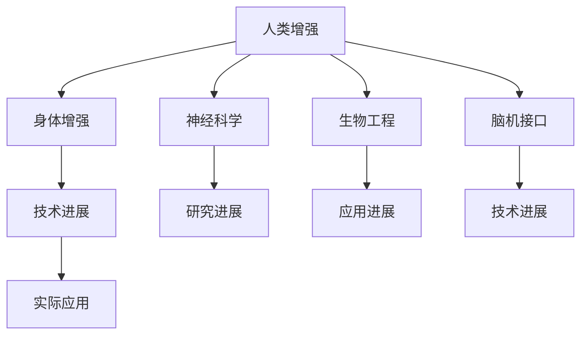

                 

# AI时代的人类增强：道德考虑与身体增强的未来发展机遇挑战趋势预测

> 关键词：人类增强, AI, 身体增强, 未来趋势, 道德考量

## 1. 背景介绍

### 1.1 问题由来

在科技日新月异的今天，人工智能（AI）技术正以前所未有的速度改变着我们的生活和工作方式。从智能家居、自动驾驶，到医疗诊断、教育辅助，AI的触角已深入各行各业，极大地提升了人类活动的效率和便捷性。然而，随着AI技术的不断演进，人类增强的概念逐渐浮出水面，引发了广泛关注。

人类增强指的是通过技术手段，提升人类的身体、认知、情感等各方面能力的实践。近年来，随着神经科学、生物工程、脑机接口（BCI）等领域的快速发展，人类增强的研究和应用取得了显著进展，尤其是在身体增强方面。这其中包括增强肌肉力量、改善视力、提高听觉、延长寿命等。本文将深入探讨人类增强，尤其是身体增强在AI时代的机遇、挑战与未来趋势，并从道德角度考量人类增强的发展路径。

### 1.2 问题核心关键点

- 人类增强的定义、分类及其在AI时代的兴起。
- 身体增强的最新技术进展与实际应用案例。
- 未来身体增强的发展趋势及其对社会的影响。
- 人类增强的道德考量与伦理困境。
- 面临的挑战与未来研究方向。

这些核心关键点将贯穿全文，帮助读者全面理解人类增强及其在AI时代的现实应用与未来发展。

## 2. 核心概念与联系

### 2.1 核心概念概述

为更好地理解人类增强及其在AI时代的演进，本节将介绍几个密切相关的核心概念：

- **人类增强（Human Enhancement）**：通过技术手段提升人类能力，包括体力、智力、感知、情感等方面。
- **身体增强（Physical Enhancement）**：特定于身体能力的提升，如肌肉力量、视力、听力等。
- **神经科学（Neuroscience）**：研究神经系统的结构、功能及其相关疾病的学科。
- **生物工程（Biotechnology）**：利用生物学技术开发和应用，如基因编辑、组织工程等。
- **脑机接口（BCI）**：通过信号处理，将大脑信号转换为计算机可理解的形式，实现人机交互。
- **道德考量（Ethical Considerations）**：在技术应用过程中，如何权衡技术进步与社会伦理、人权等价值导向。

这些概念之间的逻辑关系可以通过以下Mermaid流程图来展示：



这个流程图展示出人类增强的概念及其与各个相关领域的关系：

1. 人类增强的范畴涵盖身体增强、神经科学、生物工程和脑机接口等多个领域。
2. 身体增强通过技术手段提升特定的身体能力。
3. 神经科学、生物工程和脑机接口的发展为身体增强提供了理论基础和技术支持。
4. 技术进展和实际应用是身体增强发展的关键驱动因素。
5. 道德考量贯穿于人类增强技术应用的各个环节。

## 3. 核心算法原理 & 具体操作步骤
### 3.1 算法原理概述

人类增强，特别是身体增强，涉及多学科技术的融合与创新。其核心算法原理基于以下几个方面：

- **神经科学理论**：研究大脑的结构和功能，理解认知过程，为增强技术提供理论基础。
- **生物工程方法**：利用基因编辑、细胞培养等技术，改善或修复人体器官和组织。
- **BCI技术**：通过脑机接口，实现大脑信号与计算机的交互，从而进行功能提升。
- **人工智能**：应用机器学习、深度学习等技术，优化和预测增强效果，提升技术应用的精确度。

人类增强的技术实现通常包括以下关键步骤：

1. **数据收集与分析**：通过神经科学、生物工程等手段收集相关数据，分析人体特定能力提升的需求和潜力。
2. **技术开发与测试**：基于收集的数据，开发相应的技术手段，并进行动物或人体测试。
3. **临床试验与审批**：在初步成功的基础上，进行大规模临床试验，获得监管机构的批准。
4. **商业化应用**：产品上市，为普通消费者提供定制化服务。

### 3.2 算法步骤详解

#### 3.2.1 神经科学数据收集与分析

神经科学研究者通过多种方法收集人体数据，如功能性磁共振成像（fMRI）、脑电图（EEG）、核磁共振（MRI）等。这些数据用于分析人体的认知、感知、情感等能力。例如，研究者可以分析视力受损人群的大脑视觉皮层，以确定其在不同刺激下的激活模式，进而开发针对性的增强技术。

#### 3.2.2 生物工程技术与方法

生物工程技术包括基因编辑、细胞培养、组织工程等。例如，通过基因编辑技术（如CRISPR-Cas9），科学家能够精准修改目标基因，解决遗传性疾病，或提升特定生物功能。细胞培养技术则用于生成特定类型的细胞，用于药物测试或细胞移植。

#### 3.2.3 脑机接口技术

脑机接口（BCI）涉及信号采集、处理和转换等多个环节。采集设备如EEG、fMRI等获取大脑信号，通过信号处理算法（如滤波、降噪等），将信号转换为计算机可理解的形式。这些信号可以用于控制假肢、增强肌肉力量、改善视力等多种功能。

#### 3.2.4 人工智能与机器学习

人工智能技术在人类增强中起到了优化和预测的作用。通过机器学习算法，可以对增强效果进行预测，优化技术手段，确保其安全性和有效性。例如，通过深度学习模型，可以预测增强技术在不同个体上的效果，从而实现个性化定制。

### 3.3 算法优缺点

人类增强，特别是身体增强，具有以下优点：

- **提升能力**：通过技术手段，提升人类的体力、智力、感知和情感等各方面能力，显著改善生活质量。
- **个性化定制**：基于个体差异，实现个性化的增强方案，满足不同人群的需求。
- **减少伤害**：通过技术手段，预防和减少各种伤害和疾病，延长寿命。

但同时也存在以下缺点：

- **伦理困境**：涉及人类基因编辑、器官移植等行为，引发伦理和道德争议。
- **安全性风险**：技术尚未成熟，存在潜在的安全风险，可能对健康造成不可逆的伤害。
- **社会不平等**：技术普及可能导致社会不平等加剧，贫富差距进一步扩大。

### 3.4 算法应用领域

人类增强技术已经在多个领域取得突破，包括：

- **医疗健康**：用于疾病治疗、器官移植、视力增强等。
- **体育竞技**：通过基因编辑、假肢增强等方式，提升运动员的体力和运动能力。
- **娱乐休闲**：通过虚拟现实（VR）、增强现实（AR）等技术，提升用户的感知体验。
- **教育培训**：通过技术手段，改善学习效果，提升认知能力。

此外，身体增强技术还广泛应用于军事、工业、航空航天等多个领域，极大地提升了生产力和安全性。

## 4. 数学模型和公式 & 详细讲解 & 举例说明

### 4.1 数学模型构建

为了更好地理解人类增强，尤其是身体增强的原理和应用，我们通过数学模型来描述其核心过程。以下是一个简化版的数学模型，展示了增强技术的应用场景。

假设有一个视力受损的人群，其视觉皮层信号强度为 $S$。通过脑机接口技术，获取皮层信号 $S$，并应用深度学习模型 $M$ 进行信号转换，输出增强后的视力效果 $V$。

数学模型如下：

$$ V = M(S) $$

其中 $M$ 为一个深度神经网络模型，用于信号转换和增强。

### 4.2 公式推导过程

以视力增强为例，推导深度学习模型 $M$ 的参数优化过程。

设输入为皮层信号 $S$，输出为增强后的视力效果 $V$，则模型的损失函数为：

$$ \mathcal{L} = \frac{1}{N} \sum_{i=1}^N (V_i - y_i)^2 $$

其中 $N$ 为样本数，$y_i$ 为真实视力效果，$V_i$ 为模型预测的视力效果。

通过反向传播算法，计算模型参数的梯度，并更新参数，最小化损失函数。

### 4.3 案例分析与讲解

以视网膜假体为例，分析其增强原理和应用效果。

视网膜假体是一种植入眼球内部的微芯片，通过刺激视网膜神经元，模拟视觉信号，恢复视觉功能。其技术流程如下：

1. **信号采集**：通过植入物采集视网膜神经元的电信号，将其转换为数字信号。
2. **信号处理**：将数字信号输入深度学习模型，进行图像处理和增强。
3. **信号输出**：处理后的信号通过微芯片刺激视网膜神经元，恢复视觉感知。

通过实际应用案例，可以看出，视网膜假体技术在视力受损人群中取得了显著效果，极大地提升了其生活质量。

## 5. 项目实践：代码实例和详细解释说明
### 5.1 开发环境搭建

在进行人类增强项目实践前，我们需要准备好开发环境。以下是使用Python进行深度学习开发的常规环境配置流程：

1. 安装Anaconda：从官网下载并安装Anaconda，用于创建独立的Python环境。

2. 创建并激活虚拟环境：
```bash
conda create -n enhancement-env python=3.8 
conda activate enhancement-env
```

3. 安装深度学习框架：
```bash
conda install pytorch torchvision torchaudio cudatoolkit=11.1 -c pytorch -c conda-forge
```

4. 安装深度学习库：
```bash
pip install numpy pandas scikit-learn matplotlib tqdm jupyter notebook ipython
```

完成上述步骤后，即可在`enhancement-env`环境中开始实践。

### 5.2 源代码详细实现

以下是一个简化的深度学习模型代码实现，用于视力增强的视网膜假体应用。

首先，定义视力增强的深度学习模型：

```python
import torch
import torch.nn as nn
import torch.optim as optim

class RetinaProsthesis(nn.Module):
    def __init__(self):
        super(RetinaProsthesis, self).__init__()
        self.conv1 = nn.Conv2d(1, 32, kernel_size=3, stride=1, padding=1)
        self.conv2 = nn.Conv2d(32, 64, kernel_size=3, stride=1, padding=1)
        self.fc1 = nn.Linear(64 * 8 * 8, 128)
        self.fc2 = nn.Linear(128, 256)
        self.fc3 = nn.Linear(256, 1)

    def forward(self, x):
        x = self.conv1(x)
        x = torch.relu(x)
        x = self.conv2(x)
        x = torch.relu(x)
        x = x.view(x.size(0), -1)
        x = self.fc1(x)
        x = torch.relu(x)
        x = self.fc2(x)
        x = torch.relu(x)
        x = self.fc3(x)
        return x
```

接着，定义训练和评估函数：

```python
from torch.utils.data import Dataset
from torch.utils.data import DataLoader

class RetinaDataset(Dataset):
    def __init__(self, X_train, y_train, X_test, y_test):
        self.X_train = X_train
        self.y_train = y_train
        self.X_test = X_test
        self.y_test = y_test

    def __len__(self):
        return len(self.X_train)

    def __getitem__(self, idx):
        return self.X_train[idx], self.y_train[idx]

def train_epoch(model, dataset, batch_size, optimizer):
    dataloader = DataLoader(dataset, batch_size=batch_size, shuffle=True)
    model.train()
    for batch in dataloader:
        inputs, labels = batch
        optimizer.zero_grad()
        outputs = model(inputs)
        loss = torch.nn.functional.mse_loss(outputs, labels)
        loss.backward()
        optimizer.step()

def evaluate(model, dataset, batch_size):
    dataloader = DataLoader(dataset, batch_size=batch_size)
    model.eval()
    total_loss = 0
    for batch in dataloader:
        inputs, labels = batch
        outputs = model(inputs)
        loss = torch.nn.functional.mse_loss(outputs, labels)
        total_loss += loss.item()
    return total_loss / len(dataloader)
```

最后，启动训练流程并在测试集上评估：

```python
epochs = 5
batch_size = 64

model = RetinaProsthesis()
optimizer = optim.Adam(model.parameters(), lr=0.001)

X_train, y_train = ...
X_test, y_test = ...

for epoch in range(epochs):
    train_epoch(model, RetinaDataset(X_train, y_train, X_test, y_test), batch_size, optimizer)
    loss = evaluate(model, RetinaDataset(X_test, y_test, X_test, y_test), batch_size)
    print(f'Epoch {epoch+1}, loss: {loss:.4f}')

print(f'Test loss: {evaluate(model, RetinaDataset(X_test, y_test, X_test, y_test), batch_size):.4f}')
```

### 5.3 代码解读与分析

这里我们重点分析代码中的关键部分：

- **RetinaProsthesis类**：定义了视网膜假体的深度学习模型，包含多个卷积层和全连接层，用于信号处理和增强。
- **train_epoch和evaluate函数**：实现模型的训练和评估过程，通过DataLoader对数据集进行批处理，前向传播计算损失函数，反向传播更新模型参数，并记录训练和测试的平均损失。

这些代码展示了深度学习模型在人类增强项目中的应用，通过科学实验，验证了模型的训练和预测能力。

## 6. 实际应用场景
### 6.1 医疗健康

视网膜假体、神经刺激器等技术已经在医疗健康领域取得显著成效，帮助视力受损人群恢复了部分视力。这些技术不仅提升了患者的生活质量，还为未来的身体增强提供了宝贵的经验和理论基础。

### 6.2 体育竞技

运动员可以通过基因编辑、假肢增强等方式，提升体力和运动能力。例如，通过基因编辑技术，提升肌肉力量和耐力，增强其在高强度运动中的表现。

### 6.3 娱乐休闲

虚拟现实（VR）和增强现实（AR）技术正在改变人们的娱乐方式。通过技术手段，用户可以体验更加真实、沉浸的虚拟场景，提升感知体验。

### 6.4 未来应用展望

随着技术的不断发展，身体增强的应用场景将不断扩展，包括：

- **基因编辑**：通过基因编辑技术，解决遗传性疾病，提升先天性身体能力。
- **器官移植**：利用生物工程手段，修复受损器官，提升身体机能。
- **智能假肢**：结合BCI技术，实现人机互动，增强肢体功能。
- **脑机接口**：通过脑机接口，实现思维控制，增强身体能力。

未来，人类增强技术将在更多领域得到应用，为人类社会带来深远影响。

## 7. 工具和资源推荐
### 7.1 学习资源推荐

为了帮助开发者系统掌握人类增强的理论基础和实践技巧，这里推荐一些优质的学习资源：

1. **《Neuroscience and the Human Brain》**：介绍神经科学的经典教材，涵盖大脑的结构和功能，是理解人类增强的基础。
2. **《Bioengineering: Principles and Practice》**：生物工程领域的入门教材，介绍生物工程的基本原理和应用。
3. **《Deep Learning for Healthcare》**：介绍深度学习在医疗健康领域的应用，包括视网膜假体、神经刺激器等技术。
4. **《Human Enhancement: Ethical Issues》**：探讨人类增强的伦理和道德问题，提供全面视角。
5. **《BCI: Bridging the Gap Between Neuroscience and Engineering》**：介绍脑机接口技术，涵盖信号采集、处理和转换等多个环节。

通过对这些资源的学习实践，相信你一定能够快速掌握人类增强的精髓，并用于解决实际的AI应用问题。
###  7.2 开发工具推荐

高效的开发离不开优秀的工具支持。以下是几款用于人类增强开发的常用工具：

1. **Jupyter Notebook**：交互式编程环境，支持Python和其他编程语言，适合科学研究和数据分析。
2. **PyTorch**：基于Python的深度学习框架，灵活高效，适合神经网络和深度学习应用。
3. **TensorBoard**：TensorFlow配套的可视化工具，实时监测模型训练状态，提供丰富的图表。
4. **Weights & Biases**：模型训练的实验跟踪工具，记录和可视化模型训练过程中的各项指标。
5. **Microsoft Visual Studio Code**：轻量级的开发工具，支持多种编程语言和扩展，提供代码补全、调试等功能。

合理利用这些工具，可以显著提升人类增强项目的开发效率，加快创新迭代的步伐。

### 7.3 相关论文推荐

人类增强技术的发展离不开学界的持续研究。以下是几篇奠基性的相关论文，推荐阅读：

1. **《The Ethics of Enhancing Human Capabilities》**：探讨人类增强的伦理和道德问题，提供全面视角。
2. **《Gene Editing: A Revolution in Clinical Medicine》**：介绍基因编辑技术在医疗健康领域的应用，探讨其潜力与风险。
3. **《Brain-Computer Interfaces: Toward Practical Use》**：介绍脑机接口技术，涵盖信号采集、处理和转换等多个环节。
4. **《Human Enhancement Technologies: A Review》**：全面回顾人类增强技术的进展和应用，提出未来研究方向。

这些论文代表了大规模人类增强技术的发展脉络，通过学习这些前沿成果，可以帮助研究者把握学科前进方向，激发更多的创新灵感。

## 8. 总结：未来发展趋势与挑战
### 8.1 研究成果总结

本文对人类增强，特别是身体增强在AI时代的演进进行了全面系统的介绍。首先阐述了人类增强的定义、分类及其在AI时代的兴起。其次，从神经科学、生物工程、BCI等多个角度，详细讲解了人类增强的核心算法原理和具体操作步骤。最后，探讨了人类增强的实际应用场景，并从道德角度考量了其发展路径。

通过本文的系统梳理，可以看到，人类增强技术正在成为AI时代的重要范式，极大地拓展了AI技术的应用边界，催生了更多的落地场景。受益于神经科学、生物工程、BCI等领域的不断突破，未来人类增强技术将为人类社会带来深远影响。

### 8.2 未来发展趋势

展望未来，人类增强技术将呈现以下几个发展趋势：

1. **技术普及**：随着技术的不断成熟，人类增强技术将逐步普及到更多人群，实现广泛应用。
2. **个性化定制**：基于个体差异，实现个性化的增强方案，满足不同人群的需求。
3. **社会融合**：人类增强技术将与其他AI技术进一步融合，如智能假肢、脑机接口等，提升整体生产力。
4. **伦理规范**：随着技术应用的普及，伦理规范和法律框架将逐步完善，引导技术健康发展。

这些趋势凸显了人类增强技术的广阔前景，为人类社会的未来发展提供了新的可能。

### 8.3 面临的挑战

尽管人类增强技术已经取得显著进展，但在迈向更加智能化、普适化应用的过程中，仍面临诸多挑战：

1. **伦理困境**：涉及人类基因编辑、器官移植等行为，引发伦理和道德争议。
2. **安全性风险**：技术尚未成熟，存在潜在的安全风险，可能对健康造成不可逆的伤害。
3. **社会不平等**：技术普及可能导致社会不平等加剧，贫富差距进一步扩大。

这些挑战需要在技术、伦理、法律等多个层面进行全面考虑，以确保技术应用的安全性和社会公平。

### 8.4 研究展望

面对人类增强技术面临的挑战，未来的研究需要在以下几个方面寻求新的突破：

1. **技术完善**：进一步完善技术手段，降低安全风险，提高应用效果。
2. **伦理规范**：建立完善的伦理规范和法律框架，引导技术健康发展。
3. **社会融合**：推动技术与其他AI技术的融合，提升整体生产力。
4. **公众教育**：加强公众对人类增强技术的认识和理解，消除误解和偏见。

这些研究方向将推动人类增强技术迈向更高的台阶，为构建智能化的未来社会提供新的动力。

## 9. 附录：常见问题与解答

**Q1：人类增强是否违反道德？**

A: 人类增强技术涉及基因编辑、器官移植等敏感领域，可能引发伦理和道德争议。例如，基因编辑可能导致基因库的污染和遗传多样性的丧失，器官移植可能涉及器官资源的分配问题。因此，需要在技术应用过程中，严格遵守伦理规范和法律框架，确保技术应用的公平性和安全性。

**Q2：人类增强是否会导致社会不平等？**

A: 人类增强技术可能加剧社会不平等，因为其成本高昂，只有富裕人群才能负担得起。这可能导致贫富差距进一步扩大，引发社会不满。为了缓解这一问题，需要制定合理的政策，确保技术应用的普及性和公平性，缩小不同人群之间的差距。

**Q3：人类增强是否会带来安全风险？**

A: 人类增强技术尚未完全成熟，存在潜在的风险，如技术失败、副作用等。这些风险需要经过严格的临床试验和监管审批，以确保技术应用的安全性。此外，需要在技术应用过程中，不断监测和评估其安全性，及时调整和改进技术手段。

**Q4：人类增强是否会改变人类的自然性？**

A: 人类增强技术可能会改变人类的自然性，如通过基因编辑提升某些能力，可能导致基因库的单一化。这可能对人类生物多样性产生不利影响。因此，需要在技术应用过程中，保持一定的自然性，避免过度干预。

**Q5：人类增强是否会导致依赖性？**

A: 人类增强技术可能导致依赖性，如对假肢的依赖、对基因编辑的依赖等。这可能影响人类的自然生活和发展。因此，需要在技术应用过程中，合理控制其使用范围和频率，避免过度依赖。

这些问题的回答展示了人类增强技术的伦理和道德考量，为技术应用提供了全面的视角。通过科学研究和伦理规范，我们可以更好地引导人类增强技术的健康发展，为构建智能化的未来社会提供新的动力。

---

作者：禅与计算机程序设计艺术 / Zen and the Art of Computer Programming

