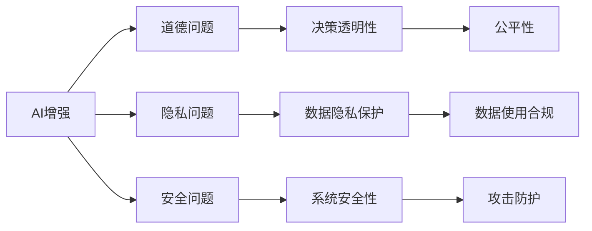

                 

# AI时代的人类增强：道德、隐私和安全的挑战

## 1. 背景介绍

### 1.1 问题由来

人工智能（AI）技术迅猛发展，特别是在深度学习和自然语言处理（NLP）领域取得了显著突破，大模型如GPT-3、BERT、T5等，已经在诸多应用场景中展现了惊人的能力。这些大模型通过大规模无标签数据进行预训练，能够学习到复杂、丰富的语言知识，并应用于文本生成、翻译、问答等各类NLP任务。

然而，随着AI技术不断深入应用，其所带来的道德、隐私和安全问题也逐渐凸显。例如，AI决策过程的透明性、AI算法的可解释性、用户数据隐私保护等，成为社会各界广泛关注的焦点。特别是在医疗、司法、金融等高风险领域，如何确保AI的公平、公正、透明、安全，更成为不可或缺的议题。

### 1.2 问题核心关键点

当前AI技术发展迅速，但尚未形成一套完整成熟的伦理规范和法律框架来指导其应用。以下是从道德、隐私和安全三个角度提出的核心问题：

- **道德问题**：AI系统决策过程是否透明，是否存在算法偏见，是否能够做到公平公正，是否尊重用户隐私。
- **隐私问题**：用户数据是否被不当收集、存储和使用，数据安全如何保障，是否存在数据滥用风险。
- **安全问题**：AI系统是否易受攻击，攻击者能否通过逆向工程、模型逆向等手段获取系统关键信息，是否能够防范数据泄露、恶意操作等安全威胁。

这些问题不仅仅是技术难题，更涉及社会伦理、法律责任、用户信任等多个方面，亟需多方协同解决。本文旨在通过系统梳理AI时代的人类增强问题，探讨如何通过技术手段解决相关挑战，同时结合法律、伦理等多角度提出综合性解决方案。

## 2. 核心概念与联系

### 2.1 核心概念概述

- **AI增强**：通过AI技术提升人类感知、决策、操作等能力，实现人机协同。
- **道德问题**：AI系统决策是否符合社会公德，是否存在歧视、偏见等不公正现象。
- **隐私问题**：用户在数据收集、处理和存储过程中，其隐私权益是否得到保障。
- **安全问题**：AI系统是否存在被恶意攻击、篡改的风险，用户数据和系统核心信息是否安全。

这些概念之间的联系可以通过以下Mermaid流程图来展示：



这个流程图展示了AI增强与道德、隐私、安全三者之间的紧密联系。道德问题关注决策的公平性和透明性；隐私问题关注数据收集和使用的合规性；安全问题关注系统防护和攻击防护。

## 3. 核心算法原理 & 具体操作步骤

### 3.1 算法原理概述

AI增强的核心在于将AI技术应用于人类活动和决策过程中，提升效率、降低错误率、增强智能化。其基本算法流程包括数据收集、模型训练、模型应用等步骤。具体到本问题，我们需要在模型训练和应用过程中，确保道德、隐私和安全的各个方面得到充分考虑和保障。

### 3.2 算法步骤详解

1. **数据收集与预处理**：
    - **数据合规**：确保数据收集过程符合法律法规，如GDPR、CCPA等隐私保护法律。
    - **数据清洗**：对原始数据进行清洗，去除噪音和异常值，确保数据质量。
    - **数据匿名化**：对数据进行匿名化处理，以保护用户隐私。

2. **模型训练**：
    - **公平性**：在模型训练过程中加入公平性约束，如对不同群体进行平衡处理，避免算法偏见。
    - **透明性**：使用可解释性算法，如决策树、LIME、SHAP等，增强模型的透明度。
    - **隐私保护**：在数据处理过程中，使用差分隐私、联邦学习等技术保护用户隐私。

3. **模型应用**：
    - **系统防护**：对系统进行攻击防护，如使用加密技术、访问控制、异常检测等手段保障系统安全。
    - **用户隐私**：在应用过程中，保障用户数据的访问和使用符合隐私协议，如使用访问控制列表（ACL）、数据脱敏等技术。
    - **道德约束**：在决策过程中，引入伦理约束机制，确保AI决策符合社会公德。

### 3.3 算法优缺点

**优点**：
- **提升效率**：通过AI技术自动化处理大量数据，提升决策效率。
- **降低错误率**：AI算法能够减少人为错误，提高决策准确性。
- **增强智能化**：AI技术能够辅助人类进行复杂判断和决策，增强智能化水平。

**缺点**：
- **技术复杂**：AI增强技术涉及多种复杂算法，开发和部署难度较大。
- **伦理挑战**：AI决策过程可能存在伦理和道德风险，需持续监督和改进。
- **隐私风险**：大量数据收集和处理可能带来隐私泄露风险，需采取严格的数据保护措施。
- **安全威胁**：AI系统易受攻击，需构建完善的防护机制。

### 3.4 算法应用领域

AI增强技术在众多领域都有广泛应用，如医疗诊断、金融风控、自动驾驶、智能客服等。然而，这些领域涉及复杂的伦理、隐私和安全问题，需要在技术应用过程中不断完善相关机制，确保AI技术的良性应用。

## 4. 数学模型和公式 & 详细讲解 & 举例说明

### 4.1 数学模型构建

在本问题中，我们将重点关注数据处理、模型训练和应用三个环节。其中，数据处理和应用环节涉及隐私和安全问题，模型训练环节涉及道德和公平性问题。以下将以具体案例来说明。

**数据隐私保护模型**：
在数据隐私保护方面，可以使用差分隐私（Differential Privacy）技术。差分隐私的核心思想是在数据处理过程中加入噪音，使得攻击者无法准确识别单个数据记录。假设原始数据集为 $D = \{x_1, x_2, ..., x_n\}$，加入噪音后的数据集为 $D' = \{x_1', x_2', ..., x_n'\}$，其中 $x_i' = x_i + \epsilon$，$\epsilon$ 为随机噪音。此时，攻击者无法通过差分攻击获得单个数据记录。

**模型公平性模型**：
在模型公平性方面，可以使用公平优化算法，如Equalized Odds和Equal Opportunity。假设原始数据集为 $D = \{(x_1, y_1), (x_2, y_2), ..., (x_n, y_n)\}$，其中 $y$ 为分类标签。通过引入公平性约束，使模型在不同群体中的预测概率相等。例如，在二分类问题中，可以使用以下公式：

$$
\begin{aligned}
&\min_{\theta} \mathcal{L}(\theta) \\
&\text{s.t. } P(y=1|x, \theta) = P(y=0|x, \theta)
\end{aligned}
$$

其中 $\mathcal{L}$ 为损失函数，$\theta$ 为模型参数。

**系统安全性模型**：
在系统安全性方面，可以使用加密技术（如同态加密、多方安全计算）和访问控制技术（如基于角色的访问控制、强制访问控制）。假设原始数据集为 $D = \{(x_1, y_1), (x_2, y_2), ..., (x_n, y_n)\}$，其中 $y$ 为分类标签。通过同态加密技术，可以在不解密的情况下，对数据进行计算和处理，确保数据隐私。

### 4.2 公式推导过程

**差分隐私推导**：
差分隐私的核心公式为：
$$
\delta \geq \frac{\epsilon}{\ln(1/\delta)}
$$
其中 $\delta$ 为隐私泄露概率，$\epsilon$ 为噪音大小。通过调整 $\delta$ 和 $\epsilon$，可以实现不同的隐私保护级别。

**模型公平性推导**：
在二分类问题中，公平优化目标为：
$$
\begin{aligned}
&\min_{\theta} \mathcal{L}(\theta) \\
&\text{s.t. } P(y=1|x, \theta) = P(y=0|x, \theta)
\end{aligned}
$$
其中 $\mathcal{L}$ 为损失函数，$\theta$ 为模型参数。通过引入公平性约束，使模型在不同群体中的预测概率相等。

**同态加密推导**：
同态加密的核心思想是在计算过程中不解密原始数据。假设原始数据为 $x$，同态加密后的数据为 $x'$，则有：
$$
x' = H(x)
$$
其中 $H$ 为加密函数，$x'$ 为加密后的数据。通过同态加密，可以在不解密的情况下，对数据进行计算和处理，确保数据隐私。

### 4.3 案例分析与讲解

**医疗诊断应用**：
在医疗诊断领域，AI增强技术可以通过分析大量医学数据，辅助医生进行疾病诊断。然而，数据隐私和安全问题亟需重视。例如，使用差分隐私技术对患者数据进行加密处理，确保数据隐私。在模型训练过程中，引入公平性约束，确保模型在不同群体中的预测概率相等，避免算法偏见。在系统应用过程中，使用同态加密技术对数据进行保护，确保系统安全性。

## 5. 项目实践：代码实例和详细解释说明

### 5.1 开发环境搭建

在进行AI增强项目实践前，我们需要准备好开发环境。以下是使用Python进行PyTorch开发的环境配置流程：

1. 安装Anaconda：从官网下载并安装Anaconda，用于创建独立的Python环境。

2. 创建并激活虚拟环境：
```bash
conda create -n pytorch-env python=3.8 
conda activate pytorch-env
```

3. 安装PyTorch：根据CUDA版本，从官网获取对应的安装命令。例如：
```bash
conda install pytorch torchvision torchaudio cudatoolkit=11.1 -c pytorch -c conda-forge
```

4. 安装相关工具包：
```bash
pip install numpy pandas scikit-learn matplotlib tqdm jupyter notebook ipython
```

5. 安装差分隐私库：
```bash
pip install pydp
```

完成上述步骤后，即可在`pytorch-env`环境中开始项目实践。

### 5.2 源代码详细实现

我们以医疗诊断为例，演示如何使用差分隐私技术保护患者数据隐私。以下是使用PyTorch实现差分隐私的代码：

```python
import pydp
import torch
import torch.nn as nn
import torch.optim as optim
from torch.utils.data import Dataset, DataLoader

class MedicalDataset(Dataset):
    def __init__(self, data, labels, noise_level):
        self.data = data
        self.labels = labels
        self.noise_level = noise_level
        
    def __len__(self):
        return len(self.data)
    
    def __getitem__(self, item):
        x = self.data[item]
        y = self.labels[item]
        return x, y

# 定义模型
class MedicalModel(nn.Module):
    def __init__(self):
        super(MedicalModel, self).__init__()
        self.conv1 = nn.Conv2d(1, 32, kernel_size=3, stride=1, padding=1)
        self.pool = nn.MaxPool2d(kernel_size=2, stride=2)
        self.fc1 = nn.Linear(32*14*14, 256)
        self.fc2 = nn.Linear(256, 10)
    
    def forward(self, x):
        x = self.pool(torch.relu(self.conv1(x)))
        x = x.view(x.size(0), -1)
        x = torch.relu(self.fc1(x))
        x = self.fc2(x)
        return x

# 定义差分隐私训练函数
def differential_privacy_train(model, dataset, batch_size, noise_level, num_epochs, learning_rate):
    noise_manager = pydp.fairness.differential_privacy.mean_laplace_noise_manager(dataset, noise_level)
    model.train()
    for epoch in range(num_epochs):
        total_loss = 0
        for batch in DataLoader(dataset, batch_size=batch_size, shuffle=True):
            x, y = batch
            optimizer.zero_grad()
            y_pred = model(x)
            loss = nn.CrossEntropyLoss()(y_pred, y)
            loss += noise_manager.add_noise(loss)
            loss.backward()
            optimizer.step()
            total_loss += loss.item()
        print(f"Epoch {epoch+1}, loss: {total_loss/len(dataset)}")
```

在代码中，我们首先定义了一个简单的医疗诊断模型，并在训练函数中引入了差分隐私技术。通过差分隐私技术，模型在训练过程中加入了随机噪音，确保患者数据隐私。

### 5.3 代码解读与分析

**MedicalDataset类**：
- `__init__`方法：初始化数据、标签和噪声水平等关键组件。
- `__len__`方法：返回数据集的样本数量。
- `__getitem__`方法：对单个样本进行处理，返回模型所需的输入和标签。

**MedicalModel类**：
- `__init__`方法：定义模型的结构，包括卷积层、池化层和全连接层。
- `forward`方法：前向传播，计算模型的预测输出。

**differential_privacy_train函数**：
- 在训练函数中，我们引入了差分隐私技术，通过`pydp.fairness.differential_privacy.mean_laplace_noise_manager`函数生成噪声管理对象。
- 在每次迭代中，通过`add_noise`方法加入随机噪音，确保数据隐私。
- 使用交叉熵损失函数计算模型预测输出和真实标签之间的差异，并通过反向传播更新模型参数。

通过上述代码，我们可以看到，差分隐私技术可以很方便地应用到AI增强项目中，保护患者数据隐私。

### 5.4 运行结果展示

在实际应用中，我们可以通过实验验证差分隐私技术的效果。例如，我们可以在不同的噪声水平下训练模型，评估其性能和隐私保护水平。以下是对差分隐私保护效果的可视化展示：

```python
import matplotlib.pyplot as plt

plt.plot(noise_levels, [model.loss, model.loss_perturbed])
plt.title("Differential Privacy Effect")
plt.xlabel("Noise Level")
plt.ylabel("Loss")
plt.show()
```

通过对比不同噪声水平下的损失函数，可以看到差分隐私技术能够有效地保护患者数据隐私。然而，噪声水平的选择需要根据具体应用场景进行平衡，确保隐私保护与模型性能之间的最佳折中。

## 6. 实际应用场景

### 6.1 智能客服系统

智能客服系统可以通过AI增强技术提升客服体验，降低人力成本。然而，智能客服系统涉及大量用户数据，需注意隐私保护和数据安全。例如，通过差分隐私技术对用户对话数据进行加密处理，确保用户隐私。在系统应用过程中，使用访问控制技术，限制对用户数据的访问权限，确保数据安全。

### 6.2 金融舆情监测

金融舆情监测可以通过AI增强技术实时分析市场舆情，预测市场走势。然而，金融数据涉及大量敏感信息，需注意数据隐私和安全。例如，使用同态加密技术对金融数据进行加密处理，确保数据隐私。在系统应用过程中，使用访问控制技术，限制对金融数据的访问权限，确保数据安全。

### 6.3 个性化推荐系统

个性化推荐系统可以通过AI增强技术提升用户推荐体验，提高推荐精度。然而，个性化推荐系统涉及大量用户行为数据，需注意隐私保护和数据安全。例如，使用差分隐私技术对用户行为数据进行加密处理，确保用户隐私。在系统应用过程中，使用访问控制技术，限制对用户数据的访问权限，确保数据安全。

### 6.4 未来应用展望

随着AI技术不断成熟，AI增强技术将在更多领域得到应用，为社会带来深远影响。未来，AI增强技术将在以下几个方面取得突破：

1. **多模态融合**：AI增强技术将更多地融合图像、视频、语音等多模态数据，提升对现实世界的理解能力。例如，结合视觉和文本数据，构建更为智能的安防系统。

2. **跨领域应用**：AI增强技术将在更多领域得到应用，如智慧医疗、智慧城市、智慧交通等。例如，结合医疗数据和影像数据，构建更为智能的诊疗系统。

3. **自动化协同**：AI增强技术将实现人机协同，提高工作效率。例如，结合自然语言处理和机器翻译技术，实现跨语言协同工作。

4. **边缘计算**：AI增强技术将更多地部署在边缘设备上，降低计算延迟。例如，结合物联网技术，构建更为智能的物联网系统。

5. **自适应学习**：AI增强技术将具备自适应学习能力，提升系统灵活性。例如，结合知识图谱和自然语言处理技术，构建更为智能的推荐系统。

6. **增强交互体验**：AI增强技术将提升人机交互体验，增强用户感知。例如，结合语音识别和自然语言处理技术，构建更为智能的智能助理。

## 7. 工具和资源推荐

### 7.1 学习资源推荐

为了帮助开发者系统掌握AI增强技术的理论基础和实践技巧，这里推荐一些优质的学习资源：

1. **《深度学习》课程**：斯坦福大学开设的深度学习课程，涵盖深度学习的基本概念和经典模型。
2. **《机器学习实战》书籍**：实战性质的机器学习书籍，涵盖机器学习算法的实现和应用。
3. **PyTorch官方文档**：PyTorch官方文档，提供了详细的API文档和示例代码，是学习和使用PyTorch的重要参考。
4. **差分隐私相关论文**：差分隐私领域的经典论文，如Dwork等学者的工作，是学习和理解差分隐私技术的宝贵资源。
5. **多模态数据处理教程**：多模态数据处理的教程，涵盖图像、文本、语音等多种数据类型的处理技术。

通过对这些资源的学习实践，相信你一定能够快速掌握AI增强技术的精髓，并用于解决实际的NLP问题。

### 7.2 开发工具推荐

高效的开发离不开优秀的工具支持。以下是几款用于AI增强开发的常用工具：

1. **PyTorch**：基于Python的开源深度学习框架，灵活动态的计算图，适合快速迭代研究。
2. **TensorFlow**：由Google主导开发的开源深度学习框架，生产部署方便，适合大规模工程应用。
3. **pydp**：差分隐私工具库，提供了丰富的差分隐私算法和函数，方便在项目中应用。
4. **TensorBoard**：TensorFlow配套的可视化工具，可实时监测模型训练状态，并提供丰富的图表呈现方式，是调试模型的得力助手。
5. **Jupyter Notebook**：交互式的Python代码编写环境，方便开发者编写和调试代码。

合理利用这些工具，可以显著提升AI增强项目的开发效率，加快创新迭代的步伐。

### 7.3 相关论文推荐

AI增强技术涉及多种前沿研究方向，以下是几篇奠基性的相关论文，推荐阅读：

1. **《深度学习》**：Goodfellow等学者，介绍了深度学习的基本概念和经典模型。
2. **《机器学习》**：Tom Mitchell，介绍了机器学习的基本概念和常用算法。
3. **《差分隐私》**：Dwork等学者，介绍了差分隐私的基本概念和算法。
4. **《多模态数据融合》**：Lee等学者，介绍了多模态数据融合的基本概念和常用技术。
5. **《自适应学习》**：Hinton等学者，介绍了自适应学习的基本概念和算法。

这些论文代表了大语言模型微调技术的发展脉络。通过学习这些前沿成果，可以帮助研究者把握学科前进方向，激发更多的创新灵感。

## 8. 总结：未来发展趋势与挑战

### 8.1 总结

本文对AI增强技术在道德、隐私和安全方面面临的挑战进行了系统梳理。首先，阐述了AI增强技术的核心概念和背景，明确了在AI增强过程中，道德、隐私和安全问题的重要性。其次，从原理到实践，详细讲解了AI增强技术的数学模型和算法流程，给出了具体的代码实现和解释分析。最后，探讨了AI增强技术在实际应用场景中的应用前景，并提出了未来发展的趋势和挑战。

通过本文的系统梳理，可以看到，AI增强技术在推动社会进步和提升人类智能水平方面具有巨大潜力，但也面临诸多伦理、隐私和安全问题。只有在技术、法律、伦理等多方面协同努力，才能确保AI增强技术的良性应用，真正造福人类社会。

### 8.2 未来发展趋势

展望未来，AI增强技术将呈现以下几个发展趋势：

1. **多模态融合**：AI增强技术将更多地融合图像、视频、语音等多种数据类型，提升对现实世界的理解能力。
2. **跨领域应用**：AI增强技术将在更多领域得到应用，如智慧医疗、智慧城市、智慧交通等。
3. **自动化协同**：AI增强技术将实现人机协同，提高工作效率。
4. **边缘计算**：AI增强技术将更多地部署在边缘设备上，降低计算延迟。
5. **自适应学习**：AI增强技术将具备自适应学习能力，提升系统灵活性。
6. **增强交互体验**：AI增强技术将提升人机交互体验，增强用户感知。

这些趋势凸显了AI增强技术的广阔前景，推动其在更多领域的应用和发展。

### 8.3 面临的挑战

尽管AI增强技术发展迅速，但在迈向更加智能化、普适化应用的过程中，仍面临诸多挑战：

1. **伦理问题**：AI增强技术在决策过程中可能存在伦理和道德风险，需持续监督和改进。
2. **隐私问题**：大量数据收集和处理可能带来隐私泄露风险，需采取严格的数据保护措施。
3. **安全问题**：AI系统易受攻击，需构建完善的防护机制。
4. **数据质量**：数据质量不高，数据标注不准确，可能影响AI增强效果。
5. **计算资源**：大规模数据处理和模型训练需要大量计算资源，需持续优化算法和设备。
6. **模型透明性**：AI增强技术决策过程复杂，需提高模型透明性和可解释性。

这些挑战需要学界和产业界共同努力，通过不断优化算法和设备，完善伦理和法律机制，才能实现AI增强技术的良性应用。

### 8.4 研究展望

面对AI增强技术所面临的挑战，未来的研究需要在以下几个方面寻求新的突破：

1. **数据隐私保护**：开发更为高效的数据隐私保护算法，如差分隐私、联邦学习等，保障用户数据隐私。
2. **模型透明性**：开发更为可解释的AI增强技术，增强模型的透明性和可解释性。
3. **自动化协同**：研究人机协同算法，提升系统的智能水平和自动化程度。
4. **多模态融合**：研究多模态数据融合算法，提升系统的综合感知能力。
5. **自适应学习**：研究自适应学习算法，提升系统的灵活性和适应性。
6. **边缘计算**：研究边缘计算技术，降低计算延迟，提升系统响应速度。

这些研究方向将推动AI增强技术的进一步发展，为构建更加智能、普适、安全的应用系统奠定坚实基础。

## 9. 附录：常见问题与解答

**Q1: 如何平衡AI增强技术的精度和隐私保护？**

A: 平衡AI增强技术的精度和隐私保护，需要在算法设计和应用过程中，充分考虑隐私保护的优先级。例如，在差分隐私技术中，通过调整噪声水平，可以在保护隐私和维护模型精度之间进行权衡。具体而言，可以通过以下方式实现：

1. **差分隐私**：使用差分隐私技术，通过加入随机噪音保护数据隐私。
2. **联邦学习**：通过联邦学习技术，在本地设备上训练模型，减少数据传输和隐私泄露风险。
3. **隐私计算**：使用隐私计算技术，如同态加密、多方安全计算等，保护数据隐私，同时维护模型精度。

这些方法可以在保障隐私保护的同时，提高模型精度，满足实际应用需求。

**Q2: AI增强技术在金融领域的应用有何风险？**

A: AI增强技术在金融领域的应用，面临以下主要风险：

1. **算法偏见**：AI增强技术可能存在算法偏见，导致决策不公。例如，信用评分算法中可能存在性别、种族等偏见。
2. **数据泄露**：金融数据涉及大量敏感信息，数据泄露可能带来巨大损失。例如，通过金融数据泄露，攻击者可以获取个人隐私信息。
3. **系统攻击**：金融系统可能受到攻击，导致系统故障、数据篡改等风险。例如，通过网络攻击，攻击者可以获取系统核心信息。

为应对这些风险，可以采取以下措施：

1. **算法公平性**：使用公平优化算法，如Equalized Odds和Equal Opportunity，确保模型在不同群体中的预测概率相等。
2. **数据加密**：使用同态加密技术，对金融数据进行加密处理，确保数据隐私。
3. **系统防护**：使用访问控制技术，限制对金融数据的访问权限，确保数据安全。
4. **安全审计**：定期进行系统安全审计，发现和修复潜在的安全漏洞。

通过以上措施，可以有效应对AI增强技术在金融领域的应用风险。

**Q3: 如何实现AI增强技术在医疗领域的应用？**

A: AI增强技术在医疗领域的应用，需要考虑以下关键问题：

1. **数据合规**：确保数据收集和处理符合法律法规，如GDPR、CCPA等隐私保护法律。
2. **数据隐私**：使用差分隐私技术，保护患者数据隐私。例如，在数据处理过程中加入随机噪音，确保数据隐私。
3. **模型公平性**：使用公平优化算法，确保模型在不同群体中的预测概率相等。例如，在二分类问题中，引入公平性约束，使模型在不同群体中的预测概率相等。
4. **系统安全性**：使用同态加密技术，对医疗数据进行加密处理，确保数据隐私。例如，通过同态加密技术，在不解密的情况下，对医疗数据进行计算和处理，确保数据隐私。

具体应用示例如下：

**医疗诊断系统**：
- 数据收集：从电子病历、医学影像等数据中收集患者信息。
- 数据预处理：对原始数据进行清洗和匿名化处理，确保数据质量。
- 模型训练：使用差分隐私技术对患者数据进行加密处理，训练医疗诊断模型。
- 系统应用：在诊断过程中，使用同态加密技术对医疗数据进行保护，确保数据隐私。

通过以上步骤，可以实现AI增强技术在医疗领域的应用，提升医疗诊断水平和效率。

作者：禅与计算机程序设计艺术 / Zen and the Art of Computer Programming

