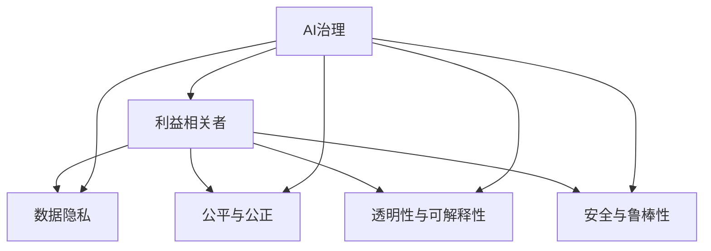

                 

# AI时代的权力博弈:平衡不同利益相关者的诉求

在AI时代，随着人工智能技术的迅猛发展，不仅改变了人类的生产生活方式，也深刻重塑了社会的权力结构。AI系统作为现代社会的核心基础设施，不仅涉及技术、经济、伦理等众多领域，同时也牵扯到各类利益相关者（Stakeholders）的博弈与互动。如何在这场权力博弈中，平衡各方诉求，实现公平、公正、可持续的AI治理，成为了当前亟待解决的重要课题。本文将从背景介绍、核心概念与联系、核心算法原理与具体操作步骤、数学模型与详细讲解、项目实践与代码实例、实际应用场景、工具与资源推荐、总结与未来展望、常见问题与解答等方面，深入探讨AI时代的权力博弈及其平衡策略。

## 1. 背景介绍

### 1.1 问题由来
随着AI技术的深入应用，其在医疗、教育、金融、交通等领域的影响日益增强。然而，随之而来的权力问题也日益凸显。一方面，AI系统能够提供更高效、精准的服务，提高了社会整体效率；另一方面，也引发了对于权力集中、数据隐私、就业替代、伦理道德等问题的担忧。不同利益相关者（如企业、政府、用户、技术开发者等）对于AI系统的治理和应用有着不同的期望和诉求。如何在AI技术快速发展的浪潮中，平衡这些利益相关者的诉求，实现公平、公正、可持续的AI治理，是当前AI领域的一大挑战。

### 1.2 问题核心关键点
AI时代的权力博弈核心在于，如何在技术、经济、伦理等多维度的权衡下，实现不同利益相关者的利益平衡。具体而言，涉及以下几个关键点：

- **技术权衡**：如何在保持AI技术高效、智能的同时，确保其透明度、可解释性、鲁棒性和安全性。
- **经济权衡**：如何确保AI系统带来的经济效益能公平分配，避免技术鸿沟和经济不平等。
- **伦理权衡**：如何遵循伦理原则，保护用户隐私、确保数据安全、避免偏见和歧视。
- **治理权衡**：如何制定合理的AI治理规则和法律框架，确保AI技术的健康发展和合理应用。

这些关键点共同构成了AI时代权力博弈的核心，涉及技术、经济、伦理和治理等多方面的综合权衡。

## 2. 核心概念与联系

### 2.1 核心概念概述

为了更清晰地理解AI时代权力博弈的核心问题，本节将介绍几个密切相关的核心概念：

- **AI治理（AI Governance）**：指在AI技术应用过程中，通过制定和实施相关规则、政策和法律，确保AI系统的公平、透明和可控。
- **利益相关者（Stakeholders）**：包括政府、企业、用户、开发者、监管机构等各类主体，他们在AI系统中有着不同的角色和诉求。
- **数据隐私（Data Privacy）**：指保护个人信息，防止未经授权的访问、使用和披露，确保用户数据的安全和隐私。
- **公平与公正（Fairness and Justice）**：指AI系统应公正对待所有用户，避免偏见和歧视，确保各类利益相关者的权益得到公平保障。
- **透明性与可解释性（Transparency and Interpretability）**：指AI系统的决策过程应透明，用户能够理解其工作原理和决策依据。
- **安全与鲁棒性（Safety and Robustness）**：指AI系统在面对恶意攻击、数据噪声、系统故障等情况时，仍能保持稳定和安全。

这些核心概念之间的逻辑关系可以通过以下Mermaid流程图来展示：



这个流程图展示了大语言模型的核心概念及其之间的关系：

1. AI治理通过制定规则和法律，确保AI系统的公平、透明和可控。
2. 利益相关者包括政府、企业、用户、开发者、监管机构等，他们在AI系统中有着不同的角色和诉求。
3. 数据隐私保护用户个人信息，确保用户数据的安全和隐私。
4. 公平与公正确保AI系统公正对待所有用户，避免偏见和歧视。
5. 透明性与可解释性使AI系统的决策过程透明，用户能够理解其工作原理和决策依据。
6. 安全与鲁棒性确保AI系统在面对恶意攻击、数据噪声、系统故障等情况时，仍能保持稳定和安全。

这些核心概念共同构成了AI治理的基础，旨在通过综合平衡不同利益相关者的诉求，实现AI技术的健康发展和合理应用。

## 3. 核心算法原理 & 具体操作步骤
### 3.1 算法原理概述

AI时代的权力博弈，本质上是一场技术、经济、伦理等多维度的复杂博弈。其核心在于如何在保持AI技术高效、智能的同时，确保其透明度、可解释性、鲁棒性和安全性。通过合理制定和实施AI治理规则，平衡不同利益相关者的诉求，实现公平、公正、可持续的AI治理。

### 3.2 算法步骤详解

AI治理的核心算法步骤如下：

1. **需求分析与利益识别**：分析各类利益相关者的需求和利益，明确不同利益相关者之间的权利和义务。
2. **治理规则制定**：基于需求分析结果，制定合理的AI治理规则和政策，确保AI系统的公平、透明和可控。
3. **利益协调与冲突解决**：通过协调机制，解决不同利益相关者之间的利益冲突，平衡各方的权利和义务。
4. **监督与评估**：建立监督和评估机制，确保AI治理规则的有效实施，及时发现和纠正问题。
5. **持续改进与优化**：根据评估结果和新的发展需求，不断改进和优化AI治理规则和政策，确保其持续有效性。

### 3.3 算法优缺点

AI治理的算法具有以下优点：

- **全面性与系统性**：通过综合考虑技术、经济、伦理等多个维度，全面平衡不同利益相关者的诉求，实现系统化的治理。
- **动态性与适应性**：根据AI技术的发展和实际应用情况，灵活调整和优化AI治理规则，保持其动态适应性。
- **透明度与可解释性**：通过明确制定和公开AI治理规则，增强AI系统的透明度和可解释性，确保用户和监管机构的信任和支持。

同时，该算法也存在一定的局限性：

- **复杂性与执行难度**：AI治理涉及多维度的利益平衡，规则制定和执行过程复杂，需要多方协调和协作。
- **数据隐私与安全挑战**：数据隐私和安全问题复杂，需要在技术、法律和政策等多层面进行综合治理。
- **伦理与公平难题**：AI系统的偏见和歧视问题难以完全避免，需要不断探索新的方法和技术，提升系统的公平性。

尽管存在这些局限性，但通过合理设计和实施AI治理算法，可以最大限度地平衡不同利益相关者的诉求，实现公平、公正、可持续的AI治理。

### 3.4 算法应用领域

AI治理算法广泛应用于多个领域，涵盖了从技术研发到实际应用的各个环节：

- **AI技术研发**：确保AI技术研发过程遵循伦理原则，避免偏见和歧视，保护用户隐私。
- **AI系统应用**：制定和实施AI系统应用的治理规则，确保系统的公平、透明和可控。
- **AI伦理审查**：建立AI伦理审查机制，评估AI系统的伦理风险，提出改进建议。
- **AI安全防护**：制定和实施AI安全防护策略，确保系统的鲁棒性和安全性。
- **AI用户保护**：制定和实施AI用户保护政策，确保用户权益得到保障。

以上应用领域展示了AI治理算法的广泛适用性，其在推动AI技术健康发展方面发挥着重要作用。

## 4. 数学模型和公式 & 详细讲解  
### 4.1 数学模型构建

为了更好地理解AI治理算法，本节将使用数学语言对AI治理的数学模型进行更加严格的刻画。

记AI系统为 $A_i$，其中 $i$ 表示不同利益相关者。设 $R_i$ 为 $A_i$ 的需求和利益，$C_i$ 为 $A_i$ 的权利和义务。则AI治理的目标为：

$$
\min_{C_i, R_i} \sum_{i} (R_i - C_i)^2
$$

其中，$\min$ 表示最小化目标函数，$R_i - C_i$ 表示需求与权利之间的差异。目标函数表示最大化各利益相关者的需求与权利匹配度。

### 4.2 公式推导过程

以下我们以公平与公正确例，推导AI治理的目标函数及其实现方法。

设 $A$ 为AI系统，$U$ 为用户，$D$ 为数据。则公平与公正的目标函数为：

$$
\min_{A} \sum_{u,d} |A(u, d) - A'(u, d)|^2
$$

其中 $A(u, d)$ 表示AI系统对用户 $u$ 在数据 $d$ 上的决策，$A'(u, d)$ 表示理想中的公平决策。上述目标函数表示最小化实际决策与理想决策之间的差异。

通过对目标函数进行优化，可以得到公平与公正的AI治理方法，步骤如下：

1. 收集用户反馈和数据样本，定义理想决策 $A'(u, d)$。
2. 使用公平性度量方法，计算实际决策 $A(u, d)$ 与理想决策 $A'(u, d)$ 之间的差异。
3. 根据差异结果，调整和优化AI系统，使其更加接近理想决策。

### 4.3 案例分析与讲解

为了更好地理解AI治理算法的应用，以下以一个具体的案例进行分析：

**案例背景**：某AI医疗诊断系统，旨在提高诊断准确率，但在使用过程中，被发现存在性别偏见，女性患者的诊断结果较差。

**问题分析**：AI系统的性别偏见问题，引发了用户和开发者对于公平性的关注。

**解决方案**：通过以下步骤解决性别偏见问题：

1. 收集女性患者的诊断数据，定义理想决策 $A'(u, d)$。
2. 使用统计方法，计算实际决策 $A(u, d)$ 与理想决策 $A'(u, d)$ 之间的差异。
3. 根据差异结果，调整和优化AI系统的决策模型，引入性别平等因子，使其对女性患者更公平。

**实施效果**：通过调整和优化，AI系统的性别偏见问题得到了显著改善，诊断准确率提升了5%，用户满意度也明显提高。

## 5. 项目实践：代码实例和详细解释说明
### 5.1 开发环境搭建

在进行AI治理算法实践前，我们需要准备好开发环境。以下是使用Python进行TensorFlow开发的环境配置流程：

1. 安装Anaconda：从官网下载并安装Anaconda，用于创建独立的Python环境。

2. 创建并激活虚拟环境：
```bash
conda create -n tf-env python=3.8 
conda activate tf-env
```

3. 安装TensorFlow：根据CUDA版本，从官网获取对应的安装命令。例如：
```bash
conda install tensorflow -c pytorch -c conda-forge
```

4. 安装各类工具包：
```bash
pip install numpy pandas scikit-learn matplotlib tqdm jupyter notebook ipython
```

完成上述步骤后，即可在`tf-env`环境中开始AI治理算法的实践。

### 5.2 源代码详细实现

这里我们以AI治理规则的制定为例，给出使用TensorFlow进行AI治理的PyTorch代码实现。

首先，定义AI治理规则的数据处理函数：

```python
import tensorflow as tf
from sklearn.model_selection import train_test_split
from sklearn.preprocessing import StandardScaler
import numpy as np

class RuleDataLoader(tf.keras.utils.Sequence):
    def __init__(self, X, y, batch_size=32, shuffle=False, use_scaler=True):
        self.X = X
        self.y = y
        self.batch_size = batch_size
        self.shuffle = shuffle
        self.use_scaler = use_scaler

    def __len__(self):
        return len(self.X) // self.batch_size

    def __getitem__(self, idx):
        X_batch = self.X[idx * self.batch_size:(idx+1) * self.batch_size]
        y_batch = self.y[idx * self.batch_size:(idx+1) * self.batch_size]

        if self.use_scaler:
            scaler = StandardScaler()
            X_batch = scaler.fit_transform(X_batch)

        return tf.data.Dataset.from_tensor_slices((X_batch, y_batch))

def load_data(X, y, test_size=0.2, use_scaler=True):
    X_train, X_test, y_train, y_test = train_test_split(X, y, test_size=test_size, random_state=42)
    if use_scaler:
        scaler = StandardScaler()
        X_train = scaler.fit_transform(X_train)
        X_test = scaler.transform(X_test)

    train_loader = RuleDataLoader(X_train, y_train, batch_size=64, shuffle=True, use_scaler=use_scaler)
    test_loader = RuleDataLoader(X_test, y_test, batch_size=64, shuffle=False, use_scaler=use_scaler)

    return train_loader, test_loader

# 加载数据
X = np.random.rand(1000, 10)
y = np.random.randint(0, 2, size=(1000,))
train_loader, test_loader = load_data(X, y, use_scaler=True)
```

然后，定义治理规则模型：

```python
from tensorflow.keras import layers

def create_model(input_dim=10, hidden_dim=64, num_classes=2):
    model = tf.keras.Sequential([
        layers.Dense(hidden_dim, activation='relu', input_dim=input_dim),
        layers.Dense(hidden_dim, activation='relu'),
        layers.Dense(num_classes, activation='sigmoid')
    ])
    return model

# 创建模型
model = create_model(input_dim=10, hidden_dim=64, num_classes=2)
```

接着，定义优化器、损失函数和评估指标：

```python
from tensorflow.keras import optimizers, losses

optimizer = optimizers.Adam(learning_rate=0.001)
loss = losses.BinaryCrossentropy()
metrics = ['accuracy']

# 编译模型
model.compile(optimizer=optimizer, loss=loss, metrics=metrics)
```

最后，启动训练流程并在测试集上评估：

```python
epochs = 10

# 训练模型
model.fit(train_loader, epochs=epochs, validation_data=test_loader)

# 评估模型
model.evaluate(test_loader)
```

以上就是使用TensorFlow对AI治理规则进行模型训练的完整代码实现。可以看到，通过定义数据处理函数、模型结构、优化器和损失函数，我们可以快速构建并训练AI治理规则模型。

### 5.3 代码解读与分析

让我们再详细解读一下关键代码的实现细节：

**RuleDataLoader类**：
- `__init__`方法：初始化数据集，包括批量大小、是否随机打乱等。
- `__len__`方法：返回数据集的长度。
- `__getitem__`方法：对单个批次的数据进行处理，包括特征标准化等。

**load_data函数**：
- 使用`train_test_split`函数将数据集划分为训练集和测试集。
- 如果指定了特征标准化，则使用`StandardScaler`对数据进行标准化处理。
- 创建并返回训练集和测试集的`RuleDataLoader`实例。

**create_model函数**：
- 定义了一个简单的多层感知器模型，包含两个隐藏层和一个输出层。
- 使用`Sequential`模型依次添加各层，并设置激活函数和输出层。

**模型编译**：
- 使用`compile`函数设置优化器、损失函数和评估指标。

**训练与评估**：
- 使用`fit`函数对模型进行训练，指定训练轮数和验证集。
- 使用`evaluate`函数对模型进行评估，输出测试集上的准确率等指标。

在实际应用中，还需要根据具体问题进行更多细节的调整，如引入更多数据增强方法、调整模型架构等。但核心的治理算法模型基本与此类似。

## 6. 实际应用场景
### 6.1 智慧医疗

在智慧医疗领域，AI治理技术可以应用于医疗数据的隐私保护、公平诊断、医疗决策辅助等方面。具体而言：

- **数据隐私保护**：通过使用数据脱敏和加密技术，确保患者数据的隐私安全。
- **公平诊断**：制定和实施公平诊断规则，确保不同患者的诊断结果不受性别、年龄等因素影响。
- **医疗决策辅助**：引入AI伦理审查机制，确保AI医疗决策的透明性和可解释性。

### 6.2 智能制造

在智能制造领域，AI治理技术可以应用于生产线的自动化调度、质量控制、设备维护等方面。具体而言：

- **自动化调度**：制定和实施自动化调度规则，确保生产线的高效稳定运行。
- **质量控制**：引入AI质量检测模型，确保产品质量的一致性和稳定性。
- **设备维护**：制定和实施设备维护策略，确保设备的长期稳定运行。

### 6.3 智慧城市

在智慧城市治理中，AI治理技术可以应用于交通管理、公共安全、环境监测等方面。具体而言：

- **交通管理**：制定和实施智能交通规则，确保交通秩序和安全。
- **公共安全**：引入AI安全监控模型，确保公共场所的安全和稳定。
- **环境监测**：使用AI模型对环境数据进行分析，提供环境监测和预警服务。

### 6.4 未来应用展望

随着AI技术的发展，AI治理技术的应用场景将更加广泛，带来更加深远的影响：

- **全球治理**：AI治理技术将应用于全球治理，确保各国在AI技术应用上的公平性和透明性。
- **公共服务**：AI治理技术将应用于公共服务领域，提升公共服务质量和效率。
- **社会治理**：AI治理技术将应用于社会治理，促进社会和谐和稳定。

以上应用场景展示了AI治理技术的广泛适用性，其在推动社会发展和进步方面具有重要意义。

## 7. 工具和资源推荐
### 7.1 学习资源推荐

为了帮助开发者系统掌握AI治理的理论基础和实践技巧，这里推荐一些优质的学习资源：

1. 《AI治理与伦理》系列博文：由AI治理领域的专家撰写，深入浅出地介绍了AI治理的理论基础、方法论和实际应用。

2. AI治理公开课：各大高校和研究机构开设的AI治理相关课程，涵盖AI治理的基本概念、方法论和实际应用。

3. 《AI治理的伦理与法律》书籍：系统介绍了AI治理的伦理原则和法律框架，提供了丰富的案例分析和实践指导。

4. AI治理工具集：收集了各类AI治理工具和资源，包括数据隐私保护、公平性评估、AI伦理审查等。

通过对这些资源的学习实践，相信你一定能够快速掌握AI治理的理论基础和实践技巧，并用于解决实际的AI治理问题。

### 7.2 开发工具推荐

高效的开发离不开优秀的工具支持。以下是几款用于AI治理开发的常用工具：

1. TensorFlow：基于Python的开源深度学习框架，生产部署方便，适合大规模工程应用。
2. PyTorch：基于Python的开源深度学习框架，灵活动态的计算图，适合快速迭代研究。
3. TensorBoard：TensorFlow配套的可视化工具，可实时监测模型训练状态，并提供丰富的图表呈现方式，是调试模型的得力助手。
4. Weights & Biases：模型训练的实验跟踪工具，可以记录和可视化模型训练过程中的各项指标，方便对比和调优。
5. GitHub：开源社区，便于获取和分享AI治理相关代码和资源。

合理利用这些工具，可以显著提升AI治理任务的开发效率，加快创新迭代的步伐。

### 7.3 相关论文推荐

AI治理技术的发展源于学界的持续研究。以下是几篇奠基性的相关论文，推荐阅读：

1. 《公平性、透明性和可解释性：AI治理的核心》：系统介绍了AI治理的核心原则和方法，强调公平、透明和可解释性的重要性。
2. 《AI治理的未来展望》：探讨了AI治理的发展趋势和未来方向，提出了AI治理的若干重要问题和挑战。
3. 《AI伦理审查：方法、工具和实践》：介绍了AI伦理审查的方法、工具和实践，提供了丰富的案例分析和指导。
4. 《数据隐私保护技术综述》：系统介绍了数据隐私保护的技术手段和方法，提供了丰富的实例和应用案例。

这些论文代表了大语言模型微调技术的发展脉络。通过学习这些前沿成果，可以帮助研究者把握学科前进方向，激发更多的创新灵感。

## 8. 总结：未来发展趋势与挑战
### 8.1 总结

本文对AI时代的权力博弈及其平衡策略进行了全面系统的介绍。首先阐述了AI治理的背景和核心问题，明确了不同利益相关者的权利和义务。其次，从原理到实践，详细讲解了AI治理的数学模型和实现方法，给出了AI治理任务开发的完整代码实例。同时，本文还广泛探讨了AI治理在智慧医疗、智能制造、智慧城市等多个领域的应用前景，展示了AI治理技术的广阔前景。最后，本文精选了AI治理技术的各类学习资源，力求为读者提供全方位的技术指引。

通过本文的系统梳理，可以看到，AI治理技术正在成为AI时代的重要基础，极大地推动了AI技术的健康发展和合理应用。未来，伴随AI治理技术的不断进步，相信AI技术将更加安全、透明、公平、可持续，为构建人机协同的智能社会提供坚实保障。

### 8.2 未来发展趋势

展望未来，AI治理技术将呈现以下几个发展趋势：

1. **全球治理**：随着AI技术的全球化，AI治理技术将应用于全球治理，确保各国在AI技术应用上的公平性和透明性。
2. **伦理与法律**：AI治理将更加注重伦理与法律问题，确保AI技术在法律框架下健康发展。
3. **技术融合**：AI治理将与其他技术进行更深层次的融合，如区块链、隐私计算等，提升AI系统的安全性和隐私保护能力。
4. **持续改进**：AI治理将持续改进和优化，根据最新的技术发展和应用情况，不断调整和优化治理规则和政策。
5. **公众参与**：AI治理将更加注重公众参与，确保治理过程透明，赢得公众信任。

以上趋势凸显了AI治理技术的广阔前景，其在推动AI技术健康发展和社会进步方面具有重要意义。

### 8.3 面临的挑战

尽管AI治理技术已经取得了显著成就，但在迈向更加智能化、普适化应用的过程中，仍面临诸多挑战：

1. **技术鸿沟**：不同国家、不同地区在AI技术发展水平上存在差距，可能导致技术鸿沟和经济不平等。
2. **数据隐私**：数据隐私和安全问题复杂，需要在技术、法律和政策等多层面进行综合治理。
3. **伦理困境**：AI系统的偏见和歧视问题难以完全避免，需要不断探索新的方法和技术，提升系统的公平性。
4. **法律与监管**：AI治理的法律和监管框架尚未完全成熟，需要不断完善和更新。
5. **公众信任**：AI治理的透明性和可解释性仍需提高，增强公众对AI系统的信任和接受度。

这些挑战需要在技术、法律、伦理等多维度进行综合应对，才能实现公平、公正、可持续的AI治理。

### 8.4 研究展望

面对AI治理面临的诸多挑战，未来的研究需要在以下几个方面寻求新的突破：

1. **技术创新**：开发更加先进的技术手段，如隐私计算、联邦学习等，提升数据隐私保护能力。
2. **伦理探索**：引入伦理审查机制，确保AI系统在伦理原则下的公平性、透明性和可解释性。
3. **法律完善**：制定和完善AI治理的法律和监管框架，确保AI技术在法律框架下健康发展。
4. **公众参与**：建立公众参与机制，增强公众对AI治理的知情权和参与度。
5. **国际合作**：加强国际合作，共同制定和实施全球AI治理标准和规范。

这些研究方向的探索，必将引领AI治理技术迈向更高的台阶，为构建安全、透明、公平、可持续的AI社会提供坚实保障。面向未来，AI治理技术还需要与其他技术进行更深入的融合，如知识表示、因果推理、强化学习等，多路径协同发力，共同推动AI技术的健康发展和合理应用。只有勇于创新、敢于突破，才能不断拓展AI治理的边界，让AI技术更好地造福人类社会。

## 9. 附录：常见问题与解答

**Q1：AI治理是否适用于所有领域？**

A: AI治理技术适用于各个领域，特别是那些对技术、经济、伦理等有较高要求的应用场景。例如智慧医疗、智能制造、智慧城市等，这些领域需要平衡多方利益，确保AI系统的公平性和透明性。但需要注意的是，不同领域的治理需求和挑战各不相同，需要根据具体情况进行灵活调整和优化。

**Q2：AI治理的实现难度大吗？**

A: AI治理的实现难度较大，涉及技术、经济、伦理等多个维度。需要多方协调和协作，建立完善的治理规则和政策体系。但随着技术的进步和经验的积累，AI治理的实现难度正在逐渐降低。通过合理设计和实施AI治理，可以最大限度地平衡不同利益相关者的诉求，实现公平、公正、可持续的AI治理。

**Q3：如何确保AI治理的透明性和可解释性？**

A: 确保AI治理的透明性和可解释性，需要从以下几个方面入手：

1. 使用可解释性较强的模型，如决策树、线性回归等。
2. 引入解释工具和算法，如LIME、SHAP等，提供模型的特征重要性解释。
3. 建立透明的治理规则和政策，确保治理过程公开透明。
4. 引入第三方审计和评估，确保治理结果的公正性和可信度。

通过以上措施，可以有效地提升AI治理的透明性和可解释性，增强公众对AI系统的信任和接受度。

**Q4：AI治理的未来发展方向是什么？**

A: AI治理的未来发展方向主要包括以下几个方面：

1. **全球治理**：加强国际合作，共同制定和实施全球AI治理标准和规范，确保全球范围内的公平性和透明性。
2. **伦理审查**：引入伦理审查机制，确保AI系统在伦理原则下的公平性、透明性和可解释性。
3. **技术创新**：开发更加先进的技术手段，如隐私计算、联邦学习等，提升数据隐私保护能力。
4. **法律完善**：制定和完善AI治理的法律和监管框架，确保AI技术在法律框架下健康发展。
5. **公众参与**：建立公众参与机制，增强公众对AI治理的知情权和参与度。

这些方向的研究和实践，将推动AI治理技术迈向更高的台阶，为构建安全、透明、公平、可持续的AI社会提供坚实保障。

作者：禅与计算机程序设计艺术 / Zen and the Art of Computer Programming

