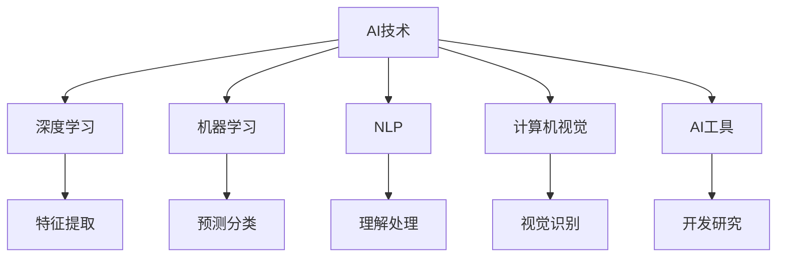

                 

# AI时代程序员的知识变现之路

## 1. 背景介绍

### 1.1 问题由来

随着人工智能（AI）技术的快速发展和普及，越来越多的企业开始利用AI技术来提升自身竞争力。然而，这些技术的实施和应用离不开专业的程序员。程序员是AI技术实现的关键角色，他们在设计和开发AI应用中扮演着重要角色。

在AI时代，程序员的技能需求也在不断变化。传统的软件开发技能已经不能满足当前AI应用的需求。程序员需要掌握新的技能和工具，以便在AI应用中发挥更好的作用。因此，程序员需要通过学习、培训和实践，不断提高自己的AI技能，以实现知识和技能的市场价值。

### 1.2 问题核心关键点

AI时代程序员的知识变现之路，需要关注以下几个核心关键点：

1. **技能提升**：程序员需要不断学习新的AI技术，掌握深度学习、机器学习、自然语言处理等核心技术。
2. **工具使用**：熟练掌握常用的AI开发工具，如TensorFlow、PyTorch、Scikit-learn等，提高开发效率。
3. **项目经验**：参与实际项目，积累丰富的项目经验，提升解决实际问题的能力。
4. **知识分享**：将所学知识和经验分享给社区，提高个人品牌影响力，吸引更多的项目机会。
5. **市场需求**：了解市场需求和趋势，选择有前景的AI应用领域进行深入学习和实践。

### 1.3 问题研究意义

AI时代程序员的知识变现之路，对个人和整个社会都有着重要的意义：

1. **职业发展**：通过不断学习和实践，程序员可以提升自己的技术能力和市场竞争力，实现职业发展和经济收入的提升。
2. **技术创新**：掌握前沿AI技术，推动技术的创新和应用，促进社会的科技进步和产业升级。
3. **人才需求**：AI技术的发展需要大量的AI人才，程序员的知识变现之路可以吸引更多的人才进入AI领域，满足市场需求。
4. **社会效益**：AI技术的应用可以解决诸多社会问题，提高社会的整体效率和福祉。

## 2. 核心概念与联系

### 2.1 核心概念概述

为了更好地理解AI时代程序员的知识变现之路，我们需要了解以下几个核心概念：

1. **AI技术**：人工智能技术，包括深度学习、机器学习、自然语言处理、计算机视觉等。
2. **深度学习**：一种基于神经网络的机器学习技术，通过多层神经网络进行特征提取和模式识别。
3. **机器学习**：通过数据和算法，让机器自动学习和优化，实现预测、分类、聚类等任务。
4. **自然语言处理（NLP）**：使计算机能够理解和处理人类语言的技术。
5. **计算机视觉**：使计算机能够“看”和理解图像和视频等视觉信息的技术。
6. **AI工具**：用于AI开发和研究的工具，如TensorFlow、PyTorch、Scikit-learn等。

这些核心概念之间的关系可以通过以下Mermaid流程图来展示：



这个流程图展示了AI技术及其子领域之间的联系，以及它们与AI开发工具的关系。

## 3. 核心算法原理 & 具体操作步骤

### 3.1 算法原理概述

AI时代程序员的知识变现之路，涉及到多个核心算法和操作步骤。这些算法和操作步骤可以分为以下几个方面：

1. **数据预处理**：数据清洗、归一化、特征提取等，为AI模型提供高质量的输入数据。
2. **模型选择和训练**：选择合适的AI模型，并进行训练和调优，使其适应具体的应用场景。
3. **模型评估和测试**：通过评估和测试，确保模型的性能和可靠性。
4. **模型部署和应用**：将模型部署到实际应用中，进行效果评估和持续优化。
5. **持续学习和更新**：根据实际应用反馈，持续优化模型，提高其性能和适应性。

### 3.2 算法步骤详解

以下是AI时代程序员在知识变现之路上的操作步骤详解：

**Step 1: 数据预处理**

1. **数据清洗**：去除噪声、缺失值和异常值，确保数据的完整性和准确性。
2. **数据归一化**：将数据转换为标准形式，以便于模型训练。
3. **特征提取**：从原始数据中提取有意义的特征，提升模型的性能。

**Step 2: 模型选择和训练**

1. **模型选择**：根据任务需求和数据特点，选择合适的AI模型。
2. **模型训练**：使用训练数据集，进行模型训练和调优。
3. **模型评估**：通过测试数据集，评估模型的性能和效果。

**Step 3: 模型部署和应用**

1. **模型部署**：将训练好的模型部署到实际应用中，进行效果评估。
2. **应用测试**：根据实际应用反馈，进行持续优化和改进。

**Step 4: 持续学习和更新**

1. **反馈收集**：收集模型应用中的反馈信息。
2. **模型优化**：根据反馈信息，优化模型性能。
3. **新数据获取**：不断获取新的数据，进行模型更新和迭代。

### 3.3 算法优缺点

AI时代程序员的知识变现之路中的核心算法和操作步骤，具有以下优缺点：

#### 优点

1. **技术多样性**：涉及多个核心算法和技术，提升程序员的技术水平。
2. **应用广泛性**：应用领域广泛，涵盖金融、医疗、电商等多个行业。
3. **市场需求大**：随着AI技术的发展，市场需求不断增加，程序员的市场竞争力增强。

#### 缺点

1. **学习曲线陡峭**：AI技术的学习难度较大，需要较强的数学和编程基础。
2. **数据质量要求高**：AI模型对数据质量要求较高，需要花费大量时间和精力进行数据处理。
3. **模型调优复杂**：模型调优需要多次迭代，过程较为复杂。

### 3.4 算法应用领域

AI时代程序员的知识变现之路，涉及多个应用领域，包括但不限于以下几个方面：

1. **金融科技**：利用AI技术进行风险评估、信用评分、金融预测等。
2. **医疗健康**：利用AI技术进行疾病诊断、治疗方案推荐、患者管理等。
3. **智能客服**：利用NLP技术进行客户意图识别、自动回复等。
4. **电商推荐**：利用AI技术进行商品推荐、用户行为分析等。
5. **自动驾驶**：利用计算机视觉和AI技术进行车辆控制、路径规划等。

## 4. 数学模型和公式 & 详细讲解 & 举例说明

### 4.1 数学模型构建

在AI时代程序员的知识变现之路中，数学模型和公式起着至关重要的作用。以下是常用的数学模型和公式的构建方法：

**线性回归模型**

线性回归模型是一种最简单的线性预测模型，用于预测连续型变量。其数学表达式为：

$$
y = \beta_0 + \beta_1 x_1 + \beta_2 x_2 + \cdots + \beta_n x_n + \epsilon
$$

其中，$y$为预测目标变量，$x_i$为特征变量，$\beta_i$为回归系数，$\epsilon$为误差项。

**逻辑回归模型**

逻辑回归模型是一种用于分类问题的线性模型。其数学表达式为：

$$
\log(\frac{p(y=1|x)}{1-p(y=1|x)}) = \beta_0 + \beta_1 x_1 + \beta_2 x_2 + \cdots + \beta_n x_n
$$

其中，$p(y=1|x)$为样本属于正类的概率，$\beta_i$为回归系数。

**神经网络模型**

神经网络模型是一种多层非线性模型，用于处理复杂的非线性问题。其数学表达式为：

$$
y^{[l]} = g(z^{[l]})
$$

其中，$z^{[l]} = W^{[l]} x^{[l-1]} + b^{[l]}$，$W^{[l]}$为权重矩阵，$b^{[l]}$为偏置项，$g$为激活函数。

### 4.2 公式推导过程

以下是常用的数学模型和公式的推导过程：

**线性回归模型推导**

假设样本数据集为$(x_i, y_i)$，$i=1,2,\cdots,N$。目标为拟合一个线性回归模型$y = \beta_0 + \beta_1 x_1 + \beta_2 x_2 + \cdots + \beta_n x_n$。通过最小化损失函数$\sum_{i=1}^N (y_i - (\beta_0 + \beta_1 x_{i1} + \beta_2 x_{i2} + \cdots + \beta_n x_{in}))^2$，得到回归系数的估计值$\hat{\beta} = (X^T X)^{-1} X^T y$。

**逻辑回归模型推导**

逻辑回归模型通过最大化似然函数进行模型拟合。目标为拟合一个逻辑回归模型$\log(\frac{p(y=1|x)}{1-p(y=1|x)}) = \beta_0 + \beta_1 x_1 + \beta_2 x_2 + \cdots + \beta_n x_n$。通过最大化$\prod_{i=1}^N p(y_i|x_i)^{y_i} (1-p(y_i|x_i))^{1-y_i}$，得到回归系数的估计值$\hat{\beta} = (X^T X)^{-1} X^T y$。

**神经网络模型推导**

神经网络模型通过反向传播算法进行训练。目标为拟合一个神经网络模型$y^{[l]} = g(z^{[l]})$。通过反向传播算法，得到权重矩阵$W^{[l]}$和偏置项$b^{[l]}$的更新公式$\Delta W^{[l]} = \frac{\partial L}{\partial W^{[l]}}$和$\Delta b^{[l]} = \frac{\partial L}{\partial b^{[l]}}$，其中$L$为损失函数。

### 4.3 案例分析与讲解

以下是利用线性回归模型进行数据预测的案例分析与讲解：

假设有一个房价预测问题，数据集包含房屋面积$x_1$和房价$y$。通过构建线性回归模型$y = \beta_0 + \beta_1 x_1$，利用最小二乘法进行模型训练，得到回归系数$\hat{\beta} = (x_1^T x_1)^{-1} x_1^T y$。然后，将新的房屋面积$x_{new}$代入模型，得到预测房价$\hat{y}_{new} = \hat{\beta} x_{new} + \hat{\beta}_0$。

## 5. 项目实践：代码实例和详细解释说明

### 5.1 开发环境搭建

在进行AI项目实践时，需要搭建一个良好的开发环境。以下是使用Python进行AI项目开发的开发环境配置流程：

1. 安装Anaconda：从官网下载并安装Anaconda，用于创建独立的Python环境。

2. 创建并激活虚拟环境：
```bash
conda create -n pyenv python=3.8 
conda activate pyenv
```

3. 安装必要的Python包：
```bash
pip install numpy pandas scikit-learn matplotlib
```

4. 安装常用的AI开发工具：
```bash
pip install tensorflow keras pytorch torchvision
```

5. 安装常用的AI开发库：
```bash
pip install seaborn jupyter notebook
```

完成上述步骤后，即可在`pyenv`环境中开始AI项目实践。

### 5.2 源代码详细实现

以下是利用TensorFlow进行线性回归模型训练的Python代码实现：

```python
import tensorflow as tf
import numpy as np
import matplotlib.pyplot as plt

# 创建数据集
x = np.array([1, 2, 3, 4, 5])
y = np.array([2.2, 3.4, 4.5, 5.7, 6.8])

# 定义模型
model = tf.keras.Sequential([
    tf.keras.layers.Dense(units=1, input_shape=[1])
])

# 定义损失函数和优化器
loss_fn = tf.keras.losses.MeanSquaredError()
optimizer = tf.keras.optimizers.SGD(learning_rate=0.01)

# 训练模型
model.compile(optimizer=optimizer, loss=loss_fn)
model.fit(x, y, epochs=50, verbose=0)

# 预测新数据
x_new = np.array([6])
y_new = model.predict(x_new).item()

# 可视化结果
plt.scatter(x, y)
plt.plot(x_new, y_new, 'r')
plt.show()
```

### 5.3 代码解读与分析

让我们再详细解读一下关键代码的实现细节：

**创建数据集**：
- `x`和`y`为训练样本，分别表示房屋面积和房价。

**定义模型**：
- 使用`Sequential`模型，添加一个全连接层`Dense`，用于拟合线性回归模型。

**定义损失函数和优化器**：
- 使用均方误差损失函数`MeanSquaredError`，使用随机梯度下降优化器`SGD`。

**训练模型**：
- 使用`compile`方法定义模型，使用`fit`方法进行模型训练。

**预测新数据**：
- 使用`predict`方法对新数据进行预测。

**可视化结果**：
- 使用`matplotlib`库可视化训练结果和预测结果。

## 6. 实际应用场景

### 6.1 智能推荐系统

智能推荐系统是AI时代程序员知识变现的重要应用场景之一。通过推荐系统，用户可以发现更多感兴趣的商品或内容，提高用户满意度和购买率。

在智能推荐系统中，程序员需要掌握推荐算法、数据处理、模型训练等技能。常见的推荐算法包括协同过滤、基于内容的推荐、基于矩阵分解的推荐等。程序员需要根据实际需求，选择合适的算法，并进行数据预处理、模型训练和调优。

### 6.2 金融风险控制

金融风险控制是AI时代程序员知识变现的另一个重要应用场景。通过AI技术，金融机构可以实时监控和预测金融市场的风险，防范金融风险。

在金融风险控制中，程序员需要掌握金融数据分析、风险评估、预测模型等技能。常见的风险评估模型包括信用评分模型、违约预测模型等。程序员需要根据实际需求，选择合适的模型，并进行数据预处理、模型训练和调优。

### 6.3 医疗诊断系统

医疗诊断系统是AI时代程序员知识变现的重要应用场景之一。通过AI技术，医生可以快速准确地诊断疾病，提高诊断效率和准确率。

在医疗诊断系统中，程序员需要掌握医疗数据分析、图像识别、自然语言处理等技能。常见的诊断模型包括影像诊断模型、病历分析模型等。程序员需要根据实际需求，选择合适的模型，并进行数据预处理、模型训练和调优。

## 7. 工具和资源推荐

### 7.1 学习资源推荐

为了帮助程序员提升AI技能，以下是几个优秀的学习资源推荐：

1. **《深度学习》（Ian Goodfellow）**：介绍深度学习的基本概念、算法和应用，适合初学者入门。
2. **《Python机器学习》（Sebastian Raschka）**：介绍机器学习的基本概念、算法和应用，使用Python实现。
3. **《TensorFlow官方文档》**：提供详细的TensorFlow教程和示例，帮助程序员快速上手。
4. **《Keras官方文档》**：提供详细的Keras教程和示例，帮助程序员快速上手。
5. **Coursera AI课程**：提供全面的AI课程，包括深度学习、机器学习、计算机视觉等。

### 7.2 开发工具推荐

为了提高程序员的开发效率，以下是几个优秀的开发工具推荐：

1. **Jupyter Notebook**：免费的交互式编程环境，支持多种编程语言和库。
2. **TensorBoard**：用于可视化模型训练和评估的工具，支持多种模型和库。
3. **Weights & Biases**：用于记录和可视化模型训练过程的工具，支持多种模型和库。
4. **Scikit-learn**：开源的机器学习库，提供丰富的算法和工具。
5. **PyTorch**：开源的深度学习框架，支持动态计算图和GPU加速。

### 7.3 相关论文推荐

为了帮助程序员了解最新的AI研究进展，以下是几个优秀的相关论文推荐：

1. **《ImageNet Classification with Deep Convolutional Neural Networks》（Alex Krizhevsky等）**：介绍深度卷积神经网络在图像分类中的应用，推动计算机视觉的发展。
2. **《Natural Language Processing with Transformers》（Jacob Devlin等）**：介绍Transformer模型在自然语言处理中的应用，推动自然语言处理的发展。
3. **《Attention Is All You Need》（Ashish Vaswani等）**：介绍Transformer模型在自然语言处理中的应用，推动自然语言处理的发展。
4. **《Deep Neural Networks for Large Scale Graph Classification》（Ge et al.）**：介绍深度神经网络在图分类中的应用，推动图神经网络的发展。

## 8. 总结：未来发展趋势与挑战

### 8.1 研究成果总结

AI时代程序员的知识变现之路，在数据预处理、模型训练、模型部署、持续学习等方面取得了显著进展。通过不断的学习和实践，程序员可以提升自身技能，实现知识和技能的市场价值。

### 8.2 未来发展趋势

AI时代程序员的知识变现之路将呈现以下几个发展趋势：

1. **技术多样性**：涉及更多的AI技术和工具，提升程序员的技术水平。
2. **应用广泛性**：应用于更多行业和领域，提高程序员的市场竞争力。
3. **市场需求大**：随着AI技术的发展，市场需求不断增加，程序员的市场竞争力增强。

### 8.3 面临的挑战

AI时代程序员的知识变现之路也面临以下几个挑战：

1. **学习曲线陡峭**：AI技术的学习难度较大，需要较强的数学和编程基础。
2. **数据质量要求高**：AI模型对数据质量要求较高，需要花费大量时间和精力进行数据处理。
3. **模型调优复杂**：模型调优需要多次迭代，过程较为复杂。

### 8.4 研究展望

为了解决上述挑战，未来需要：

1. **提高学习效率**：开发更多易学易用的AI开发工具，降低学习难度。
2. **提升数据质量**：研究更好的数据清洗和处理技术，提高数据质量。
3. **简化模型调优**：开发更多高效的模型调优技术，简化调优过程。

总之，AI时代程序员的知识变现之路充满了机遇和挑战。通过不断学习和实践，程序员可以提升自己的技术水平，实现知识和技能的市场价值。

## 9. 附录：常见问题与解答

**Q1：如何选择合适的AI开发工具？**

A: 选择合适的AI开发工具需要考虑以下几个方面：
1. **功能需求**：根据实际需求选择合适的工具，如深度学习、机器学习、自然语言处理等。
2. **易用性**：选择易学易用的工具，减少学习成本。
3. **社区支持**：选择有活跃社区支持的工具，方便解决问题。

**Q2：如何进行数据预处理？**

A: 数据预处理是AI项目的重要环节，具体步骤如下：
1. **数据清洗**：去除噪声、缺失值和异常值。
2. **数据归一化**：将数据转换为标准形式。
3. **特征提取**：从原始数据中提取有意义的特征。

**Q3：如何进行模型选择和训练？**

A: 模型选择和训练是AI项目的关键环节，具体步骤如下：
1. **模型选择**：根据任务需求和数据特点，选择合适的AI模型。
2. **模型训练**：使用训练数据集，进行模型训练和调优。
3. **模型评估**：通过测试数据集，评估模型的性能和效果。

**Q4：如何进行模型部署和应用？**

A: 模型部署和应用是AI项目的最终环节，具体步骤如下：
1. **模型部署**：将训练好的模型部署到实际应用中。
2. **应用测试**：根据实际应用反馈，进行持续优化和改进。

**Q5：如何进行持续学习和更新？**

A: 持续学习和更新是AI项目的重要环节，具体步骤如下：
1. **反馈收集**：收集模型应用中的反馈信息。
2. **模型优化**：根据反馈信息，优化模型性能。
3. **新数据获取**：不断获取新的数据，进行模型更新和迭代。

---

作者：禅与计算机程序设计艺术 / Zen and the Art of Computer Programming

