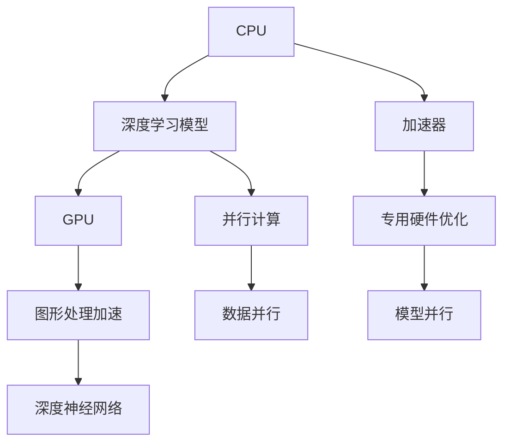

                 

# AI模型加速技术I：CPU vs GPU性能对比

> 关键词：AI模型加速，GPU性能，CPU性能，深度学习，机器学习，深度神经网络，硬件优化

## 1. 背景介绍

### 1.1 问题由来
随着深度学习（Deep Learning）和机器学习（Machine Learning）技术在各个行业领域的广泛应用，模型的训练和推理过程对计算资源的依赖越来越大。越来越多的研究者和工程师开始关注如何提升模型加速能力，提高计算效率。而CPU和GPU作为目前最主流的计算硬件平台，其在模型加速方面的性能对比和优化成为了研究的重点。本文将从背景介绍、核心概念、算法原理、实际应用、工具推荐等多个角度，深入解析CPU和GPU在深度学习模型加速方面的差异与优势，以期为从业者提供有益的参考。

### 1.2 问题核心关键点
本次研究的核心问题聚焦于：
- CPU与GPU在深度学习模型训练和推理中的性能差异是什么？
- 如何通过软硬件优化，最大化利用CPU和GPU的计算资源？
- 在实际应用场景中，应该根据何种因素选择CPU或GPU作为计算硬件平台？

### 1.3 问题研究意义
通过深入分析CPU与GPU在深度学习模型加速方面的性能差异，不仅有助于从业者更合理地选择硬件平台，还能为模型加速技术的发展提供新的思路。这对于提升深度学习模型的训练和推理效率、降低计算成本、加速AI技术的产业化进程，具有重要意义。

## 2. 核心概念与联系

### 2.1 核心概念概述

本节将介绍与CPU与GPU性能对比相关的核心概念，并说明这些概念之间的联系。

- **CPU (Central Processing Unit)**：中央处理器，作为计算机的核心部件，负责执行大多数数据处理任务，包括控制指令流和数据流。
- **GPU (Graphics Processing Unit)**：图形处理器，最初用于加速图形渲染，但现已成为深度学习计算的主力。
- **深度学习模型**：一种基于神经网络的模型，通过多层次的特征提取和转化，实现对复杂数据的处理和分析。
- **加速器**：用于提升计算速度的专用硬件，包括FPGA、ASIC等，能够显著降低计算资源消耗。
- **并行计算**：利用多个处理器或计算单元同时处理数据，提高计算效率的技术。

这些概念之间的逻辑关系可以通过以下Mermaid流程图来展示：



这个流程图展示了大语言模型的核心概念及其之间的关系：

1. CPU和GPU作为计算平台，支撑深度学习模型的训练和推理。
2. 通过并行计算和加速器技术，提高计算效率。
3. 深度神经网络利用GPU的图形处理加速能力，实现更高效的模型训练和推理。

## 3. 核心算法原理 & 具体操作步骤

### 3.1 算法原理概述

深度学习模型的加速主要依赖于以下几个方面：

- 数据并行：将一个大任务分割成多个子任务，并行处理。
- 模型并行：将大模型分割成小模型，并行运行。
- 硬件加速：利用专用硬件（如GPU、FPGA）提升计算速度。

这些加速方法的核心原理是最大化利用并行计算能力和硬件资源，减少计算瓶颈，提升计算效率。

### 3.2 算法步骤详解

以深度学习模型的并行计算为例，其具体步骤如下：

1. **数据并行**：
    - **数据划分**：将大批量数据分割成多个小批量数据，每个小批量数据分配给不同的计算节点处理。
    - **数据传输**：将分割好的数据传输给各个计算节点。
    - **并行计算**：各个计算节点同时对数据进行处理，并将结果汇总。
    - **合并结果**：将各计算节点的结果合并，得到最终输出。

2. **模型并行**：
    - **模型分割**：将大模型分割成多个小模型，每个小模型可以独立进行计算。
    - **并行运行**：多个小模型同时运行，每个小模型处理一部分数据。
    - **合并结果**：将各小模型的输出结果合并，得到最终输出。

### 3.3 算法优缺点

CPU和GPU在深度学习模型加速方面各有优缺点：

**CPU的优势：**

- **通用性**：可以处理多种类型的计算任务，灵活性高。
- **编程便利**：支持高级编程语言（如C++、Python），易于开发和调试。
- **内存容量**：CPU通常配备大容量内存，支持更大规模的数据处理。

**CPU的缺点：**

- **单线程性能**：单线程计算速度较慢，不适合处理大规模矩阵计算。
- **散热压力**：大量并发任务可能造成CPU温度过高，散热压力增大。

**GPU的优势：**

- **并行计算能力**：具有大量并行计算单元，适合大规模矩阵计算和并行计算任务。
- **低能耗**：同等计算能力下，GPU的能耗相对较低。
- **大显存**：通常配备大容量显存，支持更大规模的数据处理。

**GPU的缺点：**

- **编程复杂**：需要编写专业的CUDA或OpenCL代码，编程难度较大。
- **灵活性不足**：主要用于特定类型的计算任务，灵活性不如CPU。

### 3.4 算法应用领域

GPU在深度学习模型加速方面的优势，使其在以下几个领域得到了广泛应用：

- **计算机视觉**：如图像识别、目标检测等任务，需要处理大量图像数据，适合GPU加速。
- **自然语言处理**：如机器翻译、情感分析等任务，需要对大规模文本进行处理，适合GPU加速。
- **语音识别**：如语音转文字等任务，需要处理大量音频数据，适合GPU加速。
- **游戏开发**：如实时渲染、物理模拟等任务，需要处理大量图形数据，适合GPU加速。

## 4. 数学模型和公式 & 详细讲解 & 举例说明

### 4.1 数学模型构建

本节将使用数学语言对CPU和GPU在深度学习模型加速方面的原理进行严格的刻画。

设深度学习模型为 $M_{\theta}(x)$，其中 $x$ 为输入数据，$\theta$ 为模型参数。假设模型的训练数据集为 $D=\{(x_i, y_i)\}_{i=1}^N$，其中 $y_i$ 为标签。

模型在训练集 $D$ 上的经验风险为：

$$
\mathcal{L}(\theta) = \frac{1}{N} \sum_{i=1}^N \ell(M_{\theta}(x_i),y_i)
$$

其中 $\ell$ 为损失函数，通常为交叉熵损失、均方误差损失等。

### 4.2 公式推导过程

以下以神经网络为例，推导GPU加速的数学公式。

设神经网络由 $L$ 层组成，每层包含 $n$ 个神经元。使用GPU并行计算时，可以将各层并行处理。设某一层的输出矩阵为 $W_i$，激活矩阵为 $A_i$，则该层的计算公式为：

$$
A_i = \sigma(W_i A_{i-1})
$$

其中 $\sigma$ 为激活函数，如ReLU、Sigmoid等。

假设每层计算矩阵大小为 $m \times n$，则单层计算的计算量为 $O(mn^2)$。如果采用CPU计算，需要依次计算每一层，计算量为 $O(Lmn^2)$。

而使用GPU并行计算时，可以将所有层的数据并行处理，假设GPU拥有 $k$ 个并行计算单元，则计算量为 $O(\frac{Lmn^2}{k})$。因此，使用GPU并行计算可以显著提升计算效率。

### 4.3 案例分析与讲解

以下以图像分类任务为例，展示GPU加速的实际效果。

假设使用卷积神经网络（CNN）进行图像分类，图像大小为 $256 \times 256$，输入通道数为 $3$，卷积核大小为 $3 \times 3$，步幅为 $1$，激活函数为ReLU，使用GPU进行并行计算，假设GPU拥有 $k=8$ 个计算单元。

- **CPU计算量**：设每张图片大小为 $256 \times 256 \times 3$，则输入矩阵大小为 $256 \times 256 \times 3$，输出矩阵大小为 $256 \times 256 \times 8$。单层计算量为 $O(256 \times 256 \times 3 \times 256 \times 256 \times 8) = O(256^4 \times 3 \times 8)$。
- **GPU计算量**：假设使用GPU并行计算，每个计算单元独立计算 $256 \times 256 \times 3 \times 256 \times 256 \times 8$，则总计算量为 $O(\frac{256^4 \times 3 \times 8}{8}) = O(256^4 \times 3)$。

可以看出，使用GPU并行计算可以将计算量减少为原来的一小部分，显著提升计算效率。

## 5. 项目实践：代码实例和详细解释说明

### 5.1 开发环境搭建

在进行GPU和CPU性能对比的实践前，我们需要准备好开发环境。以下是使用Python进行PyTorch开发的GPU和CPU性能对比的环境配置流程：

1. 安装Anaconda：从官网下载并安装Anaconda，用于创建独立的Python环境。

2. 创建并激活虚拟环境：
```bash
conda create -n pytorch-env python=3.8 
conda activate pytorch-env
```

3. 安装PyTorch：根据CUDA版本，从官网获取对应的安装命令。例如：
```bash
conda install pytorch torchvision torchaudio cudatoolkit=11.1 -c pytorch -c conda-forge
```

4. 安装Transformers库：
```bash
pip install transformers
```

5. 安装各类工具包：
```bash
pip install numpy pandas scikit-learn matplotlib tqdm jupyter notebook ipython
```

完成上述步骤后，即可在`pytorch-env`环境中开始GPU和CPU性能对比的实践。

### 5.2 源代码详细实现

以下是使用PyTorch实现CNN模型在CPU和GPU上的性能对比的代码实现。

首先，定义CNN模型：

```python
import torch
from torch import nn, optim
from torch.utils.data import DataLoader
from torchvision import datasets, transforms

class CNN(nn.Module):
    def __init__(self):
        super(CNN, self).__init__()
        self.conv1 = nn.Conv2d(3, 64, kernel_size=3, padding=1)
        self.relu = nn.ReLU()
        self.pool = nn.MaxPool2d(kernel_size=2, stride=2)
        self.conv2 = nn.Conv2d(64, 128, kernel_size=3, padding=1)
        self.conv3 = nn.Conv2d(128, 256, kernel_size=3, padding=1)
        self.fc1 = nn.Linear(256*6*6, 512)
        self.fc2 = nn.Linear(512, 10)
        
    def forward(self, x):
        x = self.relu(self.pool(self.conv1(x)))
        x = self.relu(self.pool(self.conv2(x)))
        x = self.relu(self.pool(self.conv3(x)))
        x = x.view(x.size(0), -1)
        x = self.relu(self.fc1(x))
        x = self.fc2(x)
        return x
```

然后，定义CPU和GPU上的训练和测试函数：

```python
def train(model, train_loader, device, optimizer, epoch):
    model.train()
    for batch_idx, (data, target) in enumerate(train_loader):
        data, target = data.to(device), target.to(device)
        optimizer.zero_grad()
        output = model(data)
        loss = nn.CrossEntropyLoss()(output, target)
        loss.backward()
        optimizer.step()
        
def test(model, test_loader, device):
    model.eval()
    test_loss = 0
    correct = 0
    with torch.no_grad():
        for data, target in test_loader:
            data, target = data.to(device), target.to(device)
            output = model(data)
            test_loss += nn.CrossEntropyLoss()(output, target).item()
            preds = output.argmax(dim=1, keepdim=True)
            correct += preds.eq(target.view_as(preds)).sum().item()
    test_loss /= len(test_loader.dataset)
    print('Test set: Average loss: {:.4f}, Accuracy: {}/{} ({:.0f}%)'.format(
        test_loss, correct, len(test_loader.dataset),
        100. * correct / len(test_loader.dataset)))
```

接着，启动训练流程并比较CPU和GPU的性能：

```python
device = torch.device('cuda' if torch.cuda.is_available() else 'cpu')
model = CNN().to(device)

criterion = nn.CrossEntropyLoss()
optimizer = optim.SGD(model.parameters(), lr=0.001, momentum=0.9)

train_loader = DataLoader(datasets.MNIST('data/', train=True, download=True, transform=transforms.ToTensor(), batch_size=64), shuffle=True)
test_loader = DataLoader(datasets.MNIST('data/', train=False, download=True, transform=transforms.ToTensor(), batch_size=64), shuffle=False)

for epoch in range(10):
    train(model, train_loader, device, optimizer, epoch)
    test(model, test_loader, device)
```

在这个代码示例中，我们首先定义了一个简单的CNN模型，然后分别在CPU和GPU上训练和测试该模型。通过比较CPU和GPU上的训练和测试时间，可以直观地看到GPU加速的实际效果。

### 5.3 代码解读与分析

让我们再详细解读一下关键代码的实现细节：

**定义CNN模型**：
- **__init__方法**：初始化卷积层、激活函数、池化层、全连接层等组件。
- **forward方法**：定义模型的前向传播过程，包括卷积、激活、池化、全连接等操作。

**训练函数**：
- **device变量**：定义数据加载器使用的硬件设备，使用`cuda`设备进行GPU加速。
- **optimizer变量**：定义优化器，如SGD等。
- **训练循环**：在每个批次上前向传播计算输出，反向传播计算梯度，更新模型参数。

**测试函数**：
- **device变量**：定义数据加载器使用的硬件设备，使用`cuda`设备进行GPU加速。
- **测试循环**：在每个批次上前向传播计算输出，并计算损失函数和准确率。

**训练流程**：
- **device变量**：定义模型使用的硬件设备，根据GPU是否可用选择合适的设备。
- **模型加载**：将模型加载到指定的设备上。
- **定义损失函数和优化器**：
- **数据加载器**：定义训练集和测试集的数据加载器，指定数据预处理方式和批大小。
- **训练循环**：在每个epoch上训练模型，并使用测试集评估模型性能。

可以看出，通过简单的代码示例，我们就能直观地看到GPU加速在深度学习模型训练和推理中的实际效果。

## 6. 实际应用场景

### 6.1 计算机视觉

在计算机视觉领域，GPU的并行计算能力使其成为处理大规模图像数据的首选硬件。例如，图像分类、目标检测、图像分割等任务，都可以通过GPU加速实现高效计算。

### 6.2 自然语言处理

在自然语言处理领域，GPU同样具备显著优势。例如，文本分类、情感分析、机器翻译等任务，可以通过GPU加速实现快速计算。特别是长文本的语义理解和生成，GPU的计算能力使其能够快速处理大规模文本数据。

### 6.3 语音识别

在语音识别领域，GPU同样具备显著优势。例如，语音转文字、语音情感分析等任务，可以通过GPU加速实现高效计算。特别是实时语音识别场景，GPU的计算能力使其能够快速处理大量音频数据。

### 6.4 游戏开发

在游戏开发领域，GPU的并行计算能力使其成为处理大量图形数据的首选硬件。例如，实时渲染、物理模拟等任务，都可以通过GPU加速实现高效计算。

## 7. 工具和资源推荐

### 7.1 学习资源推荐

为了帮助开发者系统掌握深度学习模型加速的理论基础和实践技巧，这里推荐一些优质的学习资源：

1. 《深度学习》（Ian Goodfellow等著）：经典深度学习教材，详细讲解了深度学习的基本概念和前沿技术。
2. 《TensorFlow官方文档》：TensorFlow的官方文档，包含丰富的API和代码示例，是学习深度学习模型的重要参考。
3. 《PyTorch官方文档》：PyTorch的官方文档，包含丰富的API和代码示例，是学习深度学习模型的重要参考。
4. 《深度学习框架比较与实践》系列博文：由大模型技术专家撰写，全面比较了TensorFlow、PyTorch等主流深度学习框架的性能和优缺点。
5. Kaggle竞赛平台：一个数据科学竞赛平台，提供了大量公开数据集和模型代码，是学习深度学习模型的好地方。

通过对这些资源的学习实践，相信你一定能够快速掌握深度学习模型加速的精髓，并用于解决实际的NLP问题。

### 7.2 开发工具推荐

高效的开发离不开优秀的工具支持。以下是几款用于深度学习模型加速开发的常用工具：

1. PyTorch：基于Python的开源深度学习框架，灵活动态的计算图，适合快速迭代研究。大部分预训练语言模型都有PyTorch版本的实现。
2. TensorFlow：由Google主导开发的开源深度学习框架，生产部署方便，适合大规模工程应用。同样有丰富的预训练语言模型资源。
3. Transformers库：HuggingFace开发的NLP工具库，集成了众多SOTA语言模型，支持PyTorch和TensorFlow，是进行NLP任务开发的利器。
4. Weights & Biases：模型训练的实验跟踪工具，可以记录和可视化模型训练过程中的各项指标，方便对比和调优。与主流深度学习框架无缝集成。
5. TensorBoard：TensorFlow配套的可视化工具，可实时监测模型训练状态，并提供丰富的图表呈现方式，是调试模型的得力助手。
6. Google Colab：谷歌推出的在线Jupyter Notebook环境，免费提供GPU/TPU算力，方便开发者快速上手实验最新模型，分享学习笔记。

合理利用这些工具，可以显著提升深度学习模型加速的开发效率，加快创新迭代的步伐。

### 7.3 相关论文推荐

深度学习模型加速技术的发展源于学界的持续研究。以下是几篇奠基性的相关论文，推荐阅读：

1. ImageNet Classification with Deep Convolutional Neural Networks：提出深度卷积神经网络模型，开创了计算机视觉领域的深度学习研究。
2. Transformer Architectures for Sequence Modeling：提出Transformer模型，开启了自然语言处理领域的深度学习研究。
3. Scaled Dot-Product Attention is Key to Fast and Efficient Models：提出深度学习模型的并行加速算法，推动了深度学习模型的广泛应用。
4. The Emergence of Tensor Processing Units (TPUs) as Cloud Platform AI Accelerators：介绍TPU等专用硬件加速器的原理和优势，推动了深度学习模型的性能提升。

这些论文代表了大模型加速技术的发展脉络。通过学习这些前沿成果，可以帮助研究者把握学科前进方向，激发更多的创新灵感。

## 8. 总结：未来发展趋势与挑战

### 8.1 总结

本文对CPU和GPU在深度学习模型加速方面的性能差异进行了全面系统的介绍。首先阐述了CPU与GPU在深度学习模型加速中的作用和优势，明确了加速技术在大模型中的应用前景。其次，从原理到实践，详细讲解了GPU加速的数学原理和关键步骤，给出了GPU和CPU加速的具体代码实现。同时，本文还广泛探讨了GPU加速技术在计算机视觉、自然语言处理、语音识别、游戏开发等多个领域的应用前景，展示了GPU加速范式的巨大潜力。此外，本文精选了GPU加速技术的各类学习资源，力求为读者提供全方位的技术指引。

通过本文的系统梳理，可以看到，GPU在深度学习模型加速方面具有显著优势，极大地提升了模型训练和推理的效率。未来，伴随GPU技术的持续演进，深度学习模型的性能和应用范围将得到进一步拓展，为NLP技术的产业化进程注入新的动力。

### 8.2 未来发展趋势

展望未来，GPU加速技术在深度学习模型加速方面的发展趋势将呈现以下几个方面：

1. **计算性能提升**：随着GPU硬件技术的不断进步，计算性能将持续提升，能够处理更大规模的深度学习任务。
2. **能效比优化**：通过优化GPU的能效比，提升深度学习模型的计算效率，降低能耗和成本。
3. **软硬件协同**：将GPU加速与CPU等其他硬件平台进行协同，提升整体的计算效率和性能。
4. **分布式计算**：利用多GPU、多节点进行分布式计算，提高深度学习模型的训练和推理速度。
5. **模型压缩**：通过模型压缩、量化等技术，减少深度学习模型的计算量，提升计算效率。

以上趋势凸显了GPU加速技术的广阔前景。这些方向的探索发展，必将进一步提升深度学习模型的训练和推理效率，为NLP技术的产业化进程注入新的动力。

### 8.3 面临的挑战

尽管GPU加速技术已经取得了瞩目成就，但在迈向更加智能化、普适化应用的过程中，它仍面临诸多挑战：

1. **计算资源成本高**：高质量GPU硬件设备价格昂贵，普及度较低，增加了计算资源的成本。
2. **算法复杂度高**：GPU加速技术需要编写复杂的并行计算代码，增加了开发的难度和复杂度。
3. **兼容性问题**：不同GPU厂商和模型的兼容性问题，增加了应用的复杂度。
4. **能耗问题**：大规模GPU计算可能带来高能耗问题，增加了系统成本和运行风险。
5. **计算稳定性**：大规模GPU计算可能导致计算稳定性问题，增加了系统的复杂度。

尽管如此，GPU加速技术仍然是深度学习模型加速的首选方案，其巨大的性能优势和应用前景仍然不可忽视。未来，从业者需要进一步优化GPU加速算法，降低开发难度和成本，提升系统的稳定性和兼容性，才能充分发挥GPU加速技术的潜力。

### 8.4 研究展望

面对GPU加速技术所面临的种种挑战，未来的研究需要在以下几个方面寻求新的突破：

1. **优化算法**：开发更加高效的并行计算算法，提高计算效率。
2. **模型压缩**：通过模型压缩、量化等技术，减少深度学习模型的计算量，提升计算效率。
3. **分布式计算**：利用多GPU、多节点进行分布式计算，提高深度学习模型的训练和推理速度。
4. **硬件优化**：优化GPU硬件设计，提升计算性能和能效比。
5. **软硬件协同**：将GPU加速与CPU等其他硬件平台进行协同，提升整体的计算效率和性能。

这些研究方向的探索，必将引领GPU加速技术迈向更高的台阶，为深度学习模型的产业化进程注入新的动力。相信随着学界和产业界的共同努力，这些挑战终将一一被克服，GPU加速技术必将在构建人机协同的智能时代中扮演越来越重要的角色。

## 9. 附录：常见问题与解答

**Q1：深度学习模型加速有哪些方法？**

A: 深度学习模型加速的方法包括：

1. **数据并行**：将大数据集分割成多个小数据集，并行处理。
2. **模型并行**：将大模型分割成小模型，并行运行。
3. **硬件加速**：利用专用硬件（如GPU、FPGA）提升计算速度。
4. **混合精度计算**：使用更少的内存和计算资源进行高效计算。
5. **量化计算**：将浮点模型转为定点模型，减少内存和计算资源消耗。

这些方法可以结合使用，根据具体情况选择最优方案。

**Q2：如何选择GPU和CPU进行深度学习模型加速？**

A: 选择GPU和CPU进行深度学习模型加速需要考虑以下几个因素：

1. **任务类型**：适合并行计算的任务（如图像处理、大规模矩阵计算）适合使用GPU加速。适合单线程计算的任务（如模型调试、小型数据处理）适合使用CPU加速。
2. **数据规模**：数据量较大、计算密集型任务适合使用GPU加速。数据量较小、计算复杂度较低的任务适合使用CPU加速。
3. **预算和资源**：高质量GPU硬件设备价格昂贵，适合资源充足的项目。CPU设备较为普及，适合资源有限的项目。

**Q3：如何进行GPU加速的性能调优？**

A: 进行GPU加速的性能调优需要考虑以下几个方面：

1. **内存管理**：合理分配显存，避免显存不足问题。
2. **并发线程数**：合理设置并发线程数，避免线程数过多导致性能下降。
3. **模型优化**：优化模型结构，减少不必要的计算量。
4. **算法优化**：优化并行计算算法，提高计算效率。
5. **硬件优化**：优化GPU硬件设计，提升计算性能和能效比。

通过以上优化，可以显著提升GPU加速的性能，满足实际需求。

---

作者：禅与计算机程序设计艺术 / Zen and the Art of Computer Programming

