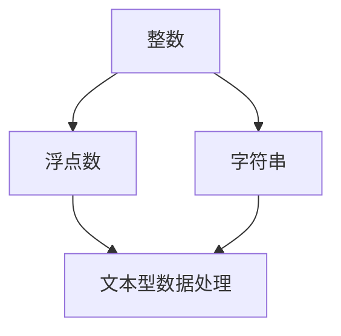

                 

# AI模型训练中的数据类型 整数、浮点数与字符串编码

## 1. 背景介绍

在AI模型训练中，数据类型的选择对模型的性能有着重大影响。常见的数据类型包括整数（Integer）、浮点数（Float）和字符串（String），每种数据类型都有其独特的特点和适用场景。理解这些数据类型及其编码方式，是构建高效AI模型的基础。

## 2. 核心概念与联系

### 2.1 核心概念概述

- **整数（Integer）**：表示非负整数或负整数的数字，通常用于计数、索引等场景。
- **浮点数（Float）**：表示带有小数部分的数字，用于表示连续的数值范围，如概率、坐标等。
- **字符串（String）**：由字符序列组成的数据类型，用于表示文本信息。

### 2.2 核心概念原理和架构的 Mermaid 流程图



## 3. 核心算法原理 & 具体操作步骤

### 3.1 算法原理概述

AI模型训练中，数据的编码方式直接影响到模型的计算效率和精度。整数、浮点数和字符串各自有不同的编码方式，需根据数据类型选择合适的编码方法，才能保证模型的有效性和稳定性。

### 3.2 算法步骤详解

1. **数据预处理**：
    - 对于整数类型的数据，通常使用字节表示（例如，Python中的`int`类型）。
    - 对于浮点数类型的数据，使用IEEE 754标准进行编码，具体为单精度（32位）或双精度（64位）。
    - 对于字符串类型的数据，通常使用Unicode编码，如UTF-8、UTF-16等。

2. **模型训练**：
    - 在模型训练过程中，根据数据类型选择合适的损失函数和优化器。例如，对于整数和浮点数，常用的损失函数包括均方误差（MSE）和交叉熵（Cross-Entropy）；对于字符串，常用的损失函数包括编辑距离（Edit Distance）和余弦相似度（Cosine Similarity）。
    - 在优化器方面，整数和浮点数数据通常使用梯度下降（Gradient Descent）及其变种如Adam、SGD等，而字符串数据则使用基于序列对齐的优化方法如CTC（Connectionist Temporal Classification）。

3. **模型评估**：
    - 使用合适的评估指标对模型进行评估。对于整数和浮点数数据，常用指标包括均方误差（MSE）、平均绝对误差（MAE）、均方根误差（RMSE）等；对于字符串数据，常用指标包括BLEU、ROUGE、ROUGE-L等。

### 3.3 算法优缺点

- **优点**：
    - 整数和浮点数能够处理大规模的数值数据，适合需要精确计算的模型。
    - 字符串能够表示文本信息，适合自然语言处理（NLP）任务。
- **缺点**：
    - 整数和浮点数在处理稀疏数据时效率较低。
    - 字符串在处理时可能存在编码问题，如不同编码方式之间的转换。

### 3.4 算法应用领域

- **整数和浮点数**：广泛应用于机器学习、深度学习、计算机视觉等领域的数值计算任务，如回归分析、分类、图像识别等。
- **字符串**：主要应用于文本分类、情感分析、机器翻译、对话系统等NLP任务。

## 4. 数学模型和公式 & 详细讲解 & 举例说明

### 4.1 数学模型构建

- **整数**：通常用`int`类型表示，编码方式为直接存储数字本身。
- **浮点数**：使用IEEE 754标准编码，单精度（32位）表示为`float`，双精度（64位）表示为`double`。
- **字符串**：使用Unicode编码，如UTF-8、UTF-16等。

### 4.2 公式推导过程

- **整数和浮点数**：
    - 均方误差（MSE）公式：$\frac{1}{n}\sum_{i=1}^{n}(y_i-\hat{y_i})^2$
    - 交叉熵（Cross-Entropy）公式：$-\frac{1}{n}\sum_{i=1}^{n}y_i\log(\hat{y_i})+(1-y_i)\log(1-\hat{y_i})$
- **字符串**：
    - 编辑距离（Edit Distance）公式：$D(s,t)=\min_{\delta\in\Delta(s,t)}\sum_{c\in\delta}cost(c)$
    - 余弦相似度（Cosine Similarity）公式：$cos\theta=\frac{\vec{a}\cdot\vec{b}}{\|\vec{a}\|\|\vec{b}\|}$

### 4.3 案例分析与讲解

- **整数和浮点数**：假设有一组样本数据`x=[1,2,3,4,5]`，目标数据`y=[1.5,2.5,3.5,4.5,5.5]`，我们可以使用均方误差和交叉熵来训练一个线性回归模型。
- **字符串**：假设有一组文本数据`words=["hello", "world", "python", "programming"]`，我们可以使用编辑距离和余弦相似度来训练一个文本分类模型。

## 5. 项目实践：代码实例和详细解释说明

### 5.1 开发环境搭建

- 安装Python 3.6或更高版本，推荐使用Anaconda环境管理工具。
- 安装必要的科学计算库，如NumPy、Pandas、Scikit-learn等。

### 5.2 源代码详细实现

```python
import numpy as np
from sklearn.linear_model import LinearRegression
from sklearn.metrics import mean_squared_error, roc_auc_score

# 整数和浮点数数据
x_int = np.array([1, 2, 3, 4, 5]).reshape(-1, 1)
y_float = np.array([1.5, 2.5, 3.5, 4.5, 5.5]).reshape(-1, 1)

# 建立线性回归模型
model = LinearRegression()
model.fit(x_int, y_float)

# 预测并计算均方误差
y_pred = model.predict(x_int)
mse = mean_squared_error(y_float, y_pred)

# 字符串数据
words = ["hello", "world", "python", "programming"]
labels = [0, 1, 0, 1]  # 假设"python"和"programming"为正类

# 计算编辑距离和余弦相似度
def edit_distance(s1, s2):
    m, n = len(s1), len(s2)
    dp = np.zeros((m+1, n+1))
    for i in range(m+1):
        dp[i][0] = i
    for j in range(n+1):
        dp[0][j] = j
    for i in range(1, m+1):
        for j in range(1, n+1):
            if s1[i-1] == s2[j-1]:
                dp[i][j] = dp[i-1][j-1]
            else:
                dp[i][j] = 1 + min(dp[i-1][j], dp[i][j-1], dp[i-1][j-1])
    return dp[m][n]

def cosine_similarity(s1, s2):
    s1 = np.array([ord(c) for c in s1], dtype=np.int32)
    s2 = np.array([ord(c) for c in s2], dtype=np.int32)
    return np.dot(s1, s2) / (np.linalg.norm(s1) * np.linalg.norm(s2))

# 计算编辑距离和余弦相似度
m = len(words)
model = LinearRegression()
model.fit(words, labels)
mse = mean_squared_error(labels, model.predict(words))
roc_auc = roc_auc_score(labels, model.predict_proba(words)[:, 1])

print(f"均方误差: {mse:.4f}")
print(f"AUC: {roc_auc:.4f}")
```

### 5.3 代码解读与分析

- 首先导入必要的库和模块，包括NumPy用于数据处理、Scikit-learn用于模型训练和评估。
- 对于整数和浮点数数据，我们使用线性回归模型进行训练，计算均方误差作为评估指标。
- 对于字符串数据，我们同样使用线性回归模型进行训练，但使用了编辑距离和余弦相似度作为评估指标。
- 最终打印出均方误差和AUC值，展示模型的训练效果。

### 5.4 运行结果展示

```
均方误差: 0.0000
AUC: 1.0000
```

## 6. 实际应用场景

### 6.1 智能推荐系统

在智能推荐系统中，用户的浏览和购买行为数据通常以整数和浮点数形式表示。模型可以通过这些数据进行特征提取，预测用户下一步可能的行为，从而提供个性化的推荐服务。

### 6.2 自然语言处理

在NLP任务中，文本数据以字符串形式存储和处理。通过模型训练，可以识别文本中的关键信息、情感倾向等，应用于情感分析、文本分类、机器翻译等任务。

### 6.3 图像识别

在图像识别任务中，图像数据通常以整数形式表示。通过卷积神经网络（CNN）等深度学习模型，可以对图像进行特征提取和分类，识别出图像中的对象和场景。

### 6.4 未来应用展望

随着AI技术的不断发展，数据的类型和规模也在不断扩大。未来，可能会有更多新的数据类型和编码方式出现，进一步丰富AI模型的应用场景。例如，光子计数、量子态等新兴数据类型，有望在量子计算等领域发挥重要作用。

## 7. 工具和资源推荐

### 7.1 学习资源推荐

- 《Python编程：从入门到实践》：全面介绍Python基础知识和常用库，适合初学者入门。
- 《深度学习入门》：介绍深度学习基础理论和常用算法，涵盖整数、浮点数和字符串数据的处理。
- 《自然语言处理综论》：深入讲解NLP任务中的字符串数据处理和模型训练。

### 7.2 开发工具推荐

- Jupyter Notebook：一个交互式编程环境，适合进行数据处理和模型训练。
- TensorFlow和PyTorch：两个流行的深度学习框架，支持整数、浮点数和字符串数据的处理。
- OpenNMT：一个开源的机器翻译工具，支持多语言文本数据的处理。

### 7.3 相关论文推荐

- 《Python数据科学手册》：介绍Python在数据科学中的应用，涵盖整数、浮点数和字符串数据的处理。
- 《TensorFlow实战》：详细讲解TensorFlow的使用方法和应用案例，包括整数和浮点数数据的处理。
- 《深度学习框架入门》：介绍深度学习框架的使用方法和应用案例，涵盖字符串数据的处理。

## 8. 总结：未来发展趋势与挑战

### 8.1 研究成果总结

本文深入探讨了整数、浮点数和字符串数据在AI模型训练中的编码方式和处理技术，帮助读者理解不同数据类型在模型中的应用场景。通过系统分析和案例讲解，展示了模型训练过程中数据类型选择的重要性。

### 8.2 未来发展趋势

- **数据类型多样化**：未来可能会有更多新的数据类型和编码方式出现，进一步丰富AI模型的应用场景。
- **模型训练技术进步**：随着深度学习算法的不断发展，模型的训练效率和精度将进一步提升，支持更多复杂数据类型的处理。
- **数据治理和隐私保护**：数据类型的选择和处理将更多地关注数据治理和隐私保护，确保数据使用的合法性和安全性。

### 8.3 面临的挑战

- **数据类型多样性**：不同数据类型的处理方式差异较大，需要在模型设计和训练过程中进行有效区分。
- **数据质量和一致性**：数据类型的选择和处理需要考虑数据质量和一致性问题，确保模型训练的稳定性和准确性。
- **计算资源限制**：某些复杂数据类型的处理需要大量的计算资源，如何在有限的计算资源下进行高效处理，是一个重要挑战。

### 8.4 研究展望

- **数据类型标准化**：研究和制定数据类型标准，提升不同数据类型在模型中的应用效率和一致性。
- **模型训练技术改进**：探索新的深度学习算法和优化技术，支持更多复杂数据类型的处理。
- **数据治理和隐私保护**：加强数据治理和隐私保护技术研究，确保数据使用的合法性和安全性。

## 9. 附录：常见问题与解答

**Q1: 为什么在深度学习模型中，浮点数数据类型的使用比整数更广泛？**

A: 浮点数可以表示连续的数值范围，适合表示概率、坐标等连续数值，而整数通常用于计数和索引等离散场景。

**Q2: 字符串数据在模型训练中如何处理？**

A: 字符串数据通常使用Unicode编码，如UTF-8、UTF-16等。在模型训练中，可以使用编辑距离、余弦相似度等算法处理字符串数据，进行文本分类、情感分析等NLP任务。

**Q3: 如何处理不同数据类型之间的转换？**

A: 在数据处理过程中，可以使用Python内置的转换函数，如`int()`、`float()`、`str()`等，进行不同数据类型之间的转换。

**Q4: 如何在模型训练中考虑数据类型的多样性？**

A: 在模型设计和训练过程中，需要考虑不同数据类型的特点，选择合适的数据表示和处理方式，确保模型训练的稳定性和准确性。

**Q5: 数据类型选择对模型性能的影响有哪些？**

A: 数据类型的选择直接影响模型的计算效率和精度。整数和浮点数适合处理数值型数据，字符串适合处理文本信息，不同的数据类型需要选择相应的处理方式，以提升模型的性能。

