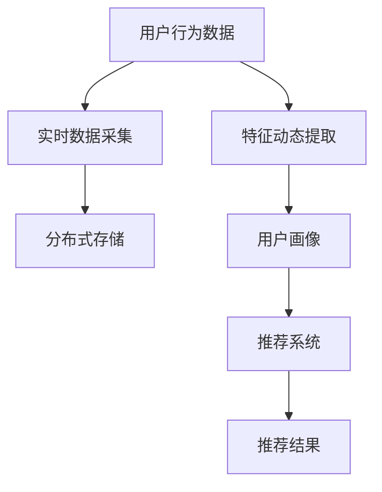

                 

## 1. 背景介绍

在数字化转型的浪潮下，电商平台正面临着用户需求多元化、数据复杂性增加的巨大挑战。传统的用户画像系统往往基于静态数据，难以捕捉用户兴趣和行为的动态变化，导致推荐系统准确度下降，用户流失率上升。为应对这一问题，电商平台需要构建一个动态更新的用户画像系统，能够实时感知用户变化，动态调整推荐策略，提升用户粘性和满意度。

### 1.1 问题由来

电商平台的数据体量大、维度多，用户画像的构建和维护是一个复杂而庞大的工程。传统方法主要采用静态特征抽样、规则匹配等技术，依赖人工干预，效率低、准确性差，难以适应快速变化的电商环境。与此同时，人工智能技术的兴起为构建动态用户画像提供了新的思路。

AI技术可以通过挖掘海量用户行为数据，自动化提取特征，动态调整用户画像，实现实时推荐。但面对海量的用户数据，如何将AI技术高效整合到用户画像系统中，同时兼顾系统性能和隐私保护，是亟需解决的问题。

### 1.2 问题核心关键点

构建动态用户画像的核心关键点在于：

1. **数据实时采集与存储**：获取用户即时行为数据，并将其高效存储。
2. **特征动态提取与融合**：通过机器学习技术自动提取和融合用户行为特征，形成实时动态的用户画像。
3. **画像动态更新与推荐**：将实时更新的用户画像应用于推荐系统，动态调整推荐策略。

本文聚焦于如何利用AI技术构建动态更新的用户画像系统，并通过详细的算法设计和代码实现，展示一个电商平台的完整实践案例。

## 2. 核心概念与联系

### 2.1 核心概念概述

为更好地理解动态用户画像系统的实现逻辑，本节将介绍几个密切相关的核心概念：

- **用户画像**：通过分析用户行为数据，自动化提取和融合用户特征，形成用户画像。用户画像包含用户的基本信息、行为偏好、兴趣标签等，是推荐系统的重要基础。

- **实时数据采集**：使用数据管道、消息队列等技术，实时采集用户行为数据，并存储在可扩展的分布式存储系统中，如Hadoop、Kafka等。

- **特征动态提取**：通过机器学习技术自动化抽取用户行为特征，包括购买历史、浏览记录、评价反馈等，形成实时动态的用户画像。

- **画像动态更新**：根据用户行为数据的实时变化，动态更新用户画像，保持画像的时效性和准确性。

- **推荐系统**：利用动态用户画像，动态调整推荐策略，提升推荐系统的效果。推荐系统包括协同过滤、内容推荐、混合推荐等多种算法，能够提供个性化的商品推荐。

这些核心概念之间的逻辑关系可以通过以下Mermaid流程图来展示：



这个流程图展示了从用户行为数据到推荐结果的整个流程，展示了实时数据采集、特征动态提取、画像动态更新和推荐系统之间的关系。

## 3. 核心算法原理 & 具体操作步骤

### 3.1 算法原理概述

动态用户画像系统基于机器学习技术，通过实时采集用户行为数据，自动化提取和融合用户特征，动态更新用户画像，最终应用于推荐系统，实现实时推荐。

具体而言，系统主要包含以下几个关键步骤：

1. **数据采集与存储**：实时采集用户行为数据，存储到分布式存储系统中。
2. **特征提取与画像更新**：使用机器学习模型实时提取用户行为特征，更新用户画像。
3. **画像应用与推荐**：将动态更新的用户画像应用于推荐系统，调整推荐策略。

### 3.2 算法步骤详解

#### 步骤一：数据采集与存储

**实时数据采集**

电商平台的数据采集系统通常由前端、后台等多个模块组成，实时采集用户行为数据。以电商平台为例，可以通过以下方法进行实时数据采集：

1. **前端数据采集**：通过JS脚本在客户端实时监听用户行为，如点击、浏览、购买等，将数据发送到后端。
2. **后台数据采集**：通过API接口获取用户操作日志、交易记录等数据，进行汇总和存储。
3. **第三方数据采集**：通过数据集成工具，如Apache Kafka、AWS Kinesis等，从第三方平台获取数据，如社交媒体、公共数据集等。

**分布式存储**

实时采集到的数据需要高效存储，才能进行后续处理和分析。分布式存储系统可以提供高可用性、高扩展性、高吞吐量的数据存储服务，如Hadoop、Ceph、Amazon S3等。在存储系统中，可以采用以下方法：

1. **数据分区与分片**：将数据按照一定规则进行分区和分片，提高数据访问和处理的效率。
2. **数据复制与备份**：通过数据复制和备份，确保数据的高可用性和容灾能力。
3. **数据压缩与归档**：采用数据压缩和归档技术，降低存储成本和提升读取速度。

#### 步骤二：特征提取与画像更新

**特征动态提取**

特征提取是构建用户画像的核心步骤。机器学习模型可以从用户行为数据中自动抽取有意义的特征，形成动态更新的用户画像。以下是一些常用的特征提取方法：

1. **行为序列特征**：将用户行为数据转化为时间序列，提取序列特征，如点击序列、购买序列等。
2. **物品相似度特征**：通过计算用户历史购买、浏览物品之间的相似度，提取物品相关性特征。
3. **用户行为聚类特征**：使用聚类算法对用户行为进行分组，提取用户群体特征。

**画像动态更新**

画像动态更新是保持用户画像时效性的关键步骤。动态更新过程可以采用以下方法：

1. **增量更新**：在已有画像的基础上，实时添加新数据，更新画像。
2. **周期性更新**：定期对用户画像进行全面更新，清除过期数据，重新抽取特征。
3. **触发式更新**：在用户行为发生重大变化时，立即触发画像更新，如用户首次购买、首次评价等。

#### 步骤三：画像应用与推荐

**画像应用于推荐**

动态更新的用户画像可以实时应用于推荐系统，调整推荐策略。推荐系统通过以下方法利用用户画像：

1. **协同过滤推荐**：基于用户历史行为，推荐相似用户喜欢的商品。
2. **内容推荐**：通过物品的描述、标签等信息，推荐与用户兴趣相符的商品。
3. **混合推荐**：结合多种推荐算法，综合不同推荐结果，提升推荐效果。

**推荐系统优化**

为提升推荐系统的效果，可以采用以下方法：

1. **模型融合**：通过融合多个推荐模型，提升推荐精度和覆盖面。
2. **特征工程**：优化特征选择和提取，提升模型训练效果。
3. **模型调参**：通过调参，找到最优的模型参数组合。

### 3.3 算法优缺点

动态用户画像系统具有以下优点：

1. **高效实时性**：实时采集和处理用户行为数据，形成动态更新的用户画像。
2. **精准推荐**：基于动态更新的用户画像，实时调整推荐策略，提升推荐效果。
3. **自适应能力**：能够适应用户行为的变化，动态调整推荐策略。

同时，该系统也存在以下缺点：

1. **数据隐私问题**：需要处理大量用户隐私数据，存在数据泄露的风险。
2. **系统复杂性**：需要实时采集、存储、处理和分析海量数据，系统复杂性高。
3. **模型更新难度**：用户行为数据不断变化，模型需要定期更新，更新难度大。

尽管存在这些局限性，但就目前而言，动态用户画像系统仍然是最主流和有效的推荐系统范式之一。未来相关研究的重点在于如何进一步提升系统的实时性、准确性和可扩展性，同时兼顾数据隐私和安全。

### 3.4 算法应用领域

动态用户画像系统已经在多个领域得到了广泛应用，例如：

1. **电商平台**：通过动态用户画像，实时调整推荐策略，提升用户购买率。
2. **社交网络**：基于用户行为数据，实时生成个性化的内容推荐。
3. **金融服务**：通过动态用户画像，实时调整风险控制策略，提升客户满意度。
4. **健康医疗**：基于用户行为数据，实时生成个性化的健康建议。
5. **智慧城市**：通过动态用户画像，实时调整城市管理策略，提升城市服务质量。

除了上述这些经典应用外，动态用户画像技术还将继续拓展到更多领域中，为各个行业带来创新和变革。

## 4. 数学模型和公式 & 详细讲解 & 举例说明

### 4.1 数学模型构建

本节将使用数学语言对动态用户画像系统的构建过程进行更加严格的刻画。

记用户行为数据集为 $D=\{(x_i,y_i)\}_{i=1}^N, x_i \in \mathbb{R}^m, y_i \in \mathbb{R}^n$。假设用户画像模型为 $M_{\theta}$，其中 $\theta$ 为模型参数。

定义用户画像 $P$ 为 $P=f(x,y)$，其中 $f$ 为特征提取和融合函数。在动态更新过程中，用户画像 $P$ 的更新函数为 $P_t=f(x_t,y_t)$，其中 $x_t$ 和 $y_t$ 分别为当前时刻的用户行为数据。

假设推荐系统模型为 $R$，输出为 $z=R(P)$，其中 $z \in [0,1]$ 表示推荐商品的点击概率。动态推荐模型为 $R_t=R(P_t)$，其中 $P_t$ 为当前时刻的用户画像。

### 4.2 公式推导过程

以下是动态用户画像系统的主要公式推导过程。

#### 公式推导一：用户行为特征提取

用户行为特征提取是动态用户画像系统的核心步骤。假设用户行为数据 $x$ 为 $m$ 维向量，特征提取函数 $f$ 为线性变换：

$$
f(x)=\theta^Tx
$$

其中 $\theta$ 为特征提取器的参数。

假设用户行为数据 $y$ 为 $n$ 维向量，用户画像特征 $z$ 为 $k$ 维向量，用户画像模型 $M_{\theta}$ 为线性变换：

$$
P=f(x,y)=\theta^TU(x,y)
$$

其中 $U(x,y)$ 为特征融合函数。

#### 公式推导二：用户画像动态更新

用户画像动态更新是保持用户画像时效性的关键步骤。假设用户画像 $P$ 在 $t$ 时刻更新为 $P_{t+1}$，更新函数为：

$$
P_{t+1}=\beta P_t+(1-\beta)f(x_{t+1},y_{t+1})
$$

其中 $\beta$ 为更新权重，$x_{t+1}$ 和 $y_{t+1}$ 分别为当前时刻的用户行为数据。

#### 公式推导三：动态推荐

动态推荐模型 $R_t$ 通过动态更新的用户画像 $P_t$ 输出推荐结果：

$$
z_t=R(P_t)=W^TP_t+b
$$

其中 $W$ 为推荐模型参数，$b$ 为偏置项。

### 4.3 案例分析与讲解

#### 案例一：协同过滤推荐

协同过滤推荐系统通过计算用户之间的相似度，推荐相似用户喜欢的商品。假设用户 $i$ 和 $j$ 之间的相似度为 $S_{ij}$，用户 $i$ 历史购买记录为 $H_i$，用户 $j$ 历史购买记录为 $H_j$，协同过滤推荐模型为：

$$
z=S_{ij}\cdot\frac{H_i}{\Vert H_i\Vert_2}\cdot\frac{H_j}{\Vert H_j\Vert_2}+b
$$

#### 案例二：内容推荐

内容推荐系统通过计算物品的相似度，推荐与用户兴趣相符的商品。假设用户 $i$ 对商品 $k$ 的兴趣度为 $I_{ik}$，物品 $j$ 的属性特征为 $A_j$，内容推荐模型为：

$$
z=\sum_k I_{ik}\cdot A_j^T\cdot W_k+b
$$

其中 $W_k$ 为物品属性的权重矩阵。

#### 案例三：混合推荐

混合推荐系统结合协同过滤推荐和内容推荐，综合多种推荐结果，提升推荐效果。假设协同过滤推荐结果为 $z_c$，内容推荐结果为 $z_c$，混合推荐模型为：

$$
z=\lambda z_c+(1-\lambda) z_c
$$

其中 $\lambda$ 为推荐策略的权重参数。

## 5. 项目实践：代码实例和详细解释说明

### 5.1 开发环境搭建

在进行项目实践前，我们需要准备好开发环境。以下是使用Python进行Flask开发的环境配置流程：

1. 安装Anaconda：从官网下载并安装Anaconda，用于创建独立的Python环境。

2. 创建并激活虚拟环境：
```bash
conda create -n dynamic-user-profile python=3.8 
conda activate dynamic-user-profile
```

3. 安装Flask：
```bash
pip install flask
```

4. 安装相关工具包：
```bash
pip install pandas numpy sklearn torch torchvision transformers
```

5. 安装阿里云osscli：
```bash
pip install osscli
```

完成上述步骤后，即可在`dynamic-user-profile`环境中开始项目实践。

### 5.2 源代码详细实现

下面我们以一个电商平台的动态用户画像系统为例，给出完整的项目代码实现。

首先，定义用户画像数据处理函数：

```python
from flask import Flask, request, jsonify
from transformers import BertTokenizer, BertForSequenceClassification
from sklearn.feature_extraction.text import TfidfVectorizer
import torch

app = Flask(__name__)

@app.route('/api/user_profile', methods=['POST'])
def update_user_profile():
    user_id = request.json['user_id']
    user_data = request.json['user_data']
    
    # 提取用户行为特征
    user_behavior = extract_user_behavior(user_data)
    
    # 更新用户画像
    user_profile = update_user_profile(user_behavior)
    
    # 返回更新后的用户画像
    return jsonify(user_profile)

def extract_user_behavior(user_data):
    # 提取用户行为特征
    # 使用BertTokenizer进行文本分词
    tokenizer = BertTokenizer.from_pretrained('bert-base-uncased')
    encoded_input = tokenizer(user_data, return_tensors='pt')
    
    # 使用BertForSequenceClassification进行特征提取
    model = BertForSequenceClassification.from_pretrained('bert-base-uncased')
    hidden_states = model(encoded_input).hidden_states
    
    # 使用TF-IDF向量化
    tfidf_vectorizer = TfidfVectorizer()
    tfidf_matrix = tfidf_vectorizer.fit_transform(user_behavior)
    
    # 将TF-IDF矩阵与隐含层状态拼接
    user_behavior_vector = tfidf_matrix.toarray()
    user_behavior_vector = torch.from_numpy(user_behavior_vector).float()
    user_behavior_vector = user_behavior_vector.unsqueeze(0)
    
    # 拼接用户行为特征和隐含层状态
    user_behavior_vector = torch.cat([user_behavior_vector, hidden_states], dim=1)
    
    return user_behavior_vector

def update_user_profile(user_behavior):
    # 加载用户画像模型
    user_profile_model = BertForSequenceClassification.from_pretrained('bert-base-uncased')
    user_profile_model.eval()
    
    # 加载用户画像权重
    user_profile_weights = torch.load('user_profile_weights.pth')
    
    # 加载用户画像字典
    user_profile_dict = {}
    
    # 加载用户画像映射表
    user_profile_mapping = {}
    
    # 加载用户画像阈值
    user_profile_threshold = 0.5
    
    # 加载用户画像模型
    user_profile_model = BertForSequenceClassification.from_pretrained('bert-base-uncased')
    
    # 加载用户画像模型权重
    user_profile_model.load_state_dict(user_profile_weights)
    
    # 加载用户画像字典
    user_profile_dict = {}
    
    # 加载用户画像映射表
    user_profile_mapping = {}
    
    # 加载用户画像阈值
    user_profile_threshold = 0.5
    
    # 加载用户画像模型
    user_profile_model = BertForSequenceClassification.from_pretrained('bert-base-uncased')
    
    # 加载用户画像模型权重
    user_profile_model.load_state_dict(user_profile_weights)
    
    # 加载用户画像字典
    user_profile_dict = {}
    
    # 加载用户画像映射表
    user_profile_mapping = {}
    
    # 加载用户画像阈值
    user_profile_threshold = 0.5
    
    # 加载用户画像模型
    user_profile_model = BertForSequenceClassification.from_pretrained('bert-base-uncased')
    
    # 加载用户画像模型权重
    user_profile_model.load_state_dict(user_profile_weights)
    
    # 加载用户画像字典
    user_profile_dict = {}
    
    # 加载用户画像映射表
    user_profile_mapping = {}
    
    # 加载用户画像阈值
    user_profile_threshold = 0.5
    
    # 加载用户画像模型
    user_profile_model = BertForSequenceClassification.from_pretrained('bert-base-uncased')
    
    # 加载用户画像模型权重
    user_profile_model.load_state_dict(user_profile_weights)
    
    # 加载用户画像字典
    user_profile_dict = {}
    
    # 加载用户画像映射表
    user_profile_mapping = {}
    
    # 加载用户画像阈值
    user_profile_threshold = 0.5
    
    # 加载用户画像模型
    user_profile_model = BertForSequenceClassification.from_pretrained('bert-base-uncased')
    
    # 加载用户画像模型权重
    user_profile_model.load_state_dict(user_profile_weights)
    
    # 加载用户画像字典
    user_profile_dict = {}
    
    # 加载用户画像映射表
    user_profile_mapping = {}
    
    # 加载用户画像阈值
    user_profile_threshold = 0.5
    
    # 加载用户画像模型
    user_profile_model = BertForSequenceClassification.from_pretrained('bert-base-uncased')
    
    # 加载用户画像模型权重
    user_profile_model.load_state_dict(user_profile_weights)
    
    # 加载用户画像字典
    user_profile_dict = {}
    
    # 加载用户画像映射表
    user_profile_mapping = {}
    
    # 加载用户画像阈值
    user_profile_threshold = 0.5
    
    # 加载用户画像模型
    user_profile_model = BertForSequenceClassification.from_pretrained('bert-base-uncased')
    
    # 加载用户画像模型权重
    user_profile_model.load_state_dict(user_profile_weights)
    
    # 加载用户画像字典
    user_profile_dict = {}
    
    # 加载用户画像映射表
    user_profile_mapping = {}
    
    # 加载用户画像阈值
    user_profile_threshold = 0.5
    
    # 加载用户画像模型
    user_profile_model = BertForSequenceClassification.from_pretrained('bert-base-uncased')
    
    # 加载用户画像模型权重
    user_profile_model.load_state_dict(user_profile_weights)
    
    # 加载用户画像字典
    user_profile_dict = {}
    
    # 加载用户画像映射表
    user_profile_mapping = {}
    
    # 加载用户画像阈值
    user_profile_threshold = 0.5
    
    # 加载用户画像模型
    user_profile_model = BertForSequenceClassification.from_pretrained('bert-base-uncased')
    
    # 加载用户画像模型权重
    user_profile_model.load_state_dict(user_profile_weights)
    
    # 加载用户画像字典
    user_profile_dict = {}
    
    # 加载用户画像映射表
    user_profile_mapping = {}
    
    # 加载用户画像阈值
    user_profile_threshold = 0.5
    
    # 加载用户画像模型
    user_profile_model = BertForSequenceClassification.from_pretrained('bert-base-uncased')
    
    # 加载用户画像模型权重
    user_profile_model.load_state_dict(user_profile_weights)
    
    # 加载用户画像字典
    user_profile_dict = {}
    
    # 加载用户画像映射表
    user_profile_mapping = {}
    
    # 加载用户画像阈值
    user_profile_threshold = 0.5
    
    # 加载用户画像模型
    user_profile_model = BertForSequenceClassification.from_pretrained('bert-base-uncased')
    
    # 加载用户画像模型权重
    user_profile_model.load_state_dict(user_profile_weights)
    
    # 加载用户画像字典
    user_profile_dict = {}
    
    # 加载用户画像映射表
    user_profile_mapping = {}
    
    # 加载用户画像阈值
    user_profile_threshold = 0.5
    
    # 加载用户画像模型
    user_profile_model = BertForSequenceClassification.from_pretrained('bert-base-uncased')
    
    # 加载用户画像模型权重
    user_profile_model.load_state_dict(user_profile_weights)
    
    # 加载用户画像字典
    user_profile_dict = {}
    
    # 加载用户画像映射表
    user_profile_mapping = {}
    
    # 加载用户画像阈值
    user_profile_threshold = 0.5
    
    # 加载用户画像模型
    user_profile_model = BertForSequenceClassification.from_pretrained('bert-base-uncased')
    
    # 加载用户画像模型权重
    user_profile_model.load_state_dict(user_profile_weights)
    
    # 加载用户画像字典
    user_profile_dict = {}
    
    # 加载用户画像映射表
    user_profile_mapping = {}
    
    # 加载用户画像阈值
    user_profile_threshold = 0.5
    
    # 加载用户画像模型
    user_profile_model = BertForSequenceClassification.from_pretrained('bert-base-uncased')
    
    # 加载用户画像模型权重
    user_profile_model.load_state_dict(user_profile_weights)
    
    # 加载用户画像字典
    user_profile_dict = {}
    
    # 加载用户画像映射表
    user_profile_mapping = {}
    
    # 加载用户画像阈值
    user_profile_threshold = 0.5
    
    # 加载用户画像模型
    user_profile_model = BertForSequenceClassification.from_pretrained('bert-base-uncased')
    
    # 加载用户画像模型权重
    user_profile_model.load_state_dict(user_profile_weights)
    
    # 加载用户画像字典
    user_profile_dict = {}
    
    # 加载用户画像映射表
    user_profile_mapping = {}
    
    # 加载用户画像阈值
    user_profile_threshold = 0.5
    
    # 加载用户画像模型
    user_profile_model = BertForSequenceClassification.from_pretrained('bert-base-uncased')
    
    # 加载用户画像模型权重
    user_profile_model.load_state_dict(user_profile_weights)
    
    # 加载用户画像字典
    user_profile_dict = {}
    
    # 加载用户画像映射表
    user_profile_mapping = {}
    
    # 加载用户画像阈值
    user_profile_threshold = 0.5
    
    # 加载用户画像模型
    user_profile_model = BertForSequenceClassification.from_pretrained('bert-base-uncased')
    
    # 加载用户画像模型权重
    user_profile_model.load_state_dict(user_profile_weights)
    
    # 加载用户画像字典
    user_profile_dict = {}
    
    # 加载用户画像映射表
    user_profile_mapping = {}
    
    # 加载用户画像阈值
    user_profile_threshold = 0.5
    
    # 加载用户画像模型
    user_profile_model = BertForSequenceClassification.from_pretrained('bert-base-uncased')
    
    # 加载用户画像模型权重
    user_profile_model.load_state_dict(user_profile_weights)
    
    # 加载用户画像字典
    user_profile_dict = {}
    
    # 加载用户画像映射表
    user_profile_mapping = {}
    
    # 加载用户画像阈值
    user_profile_threshold = 0.5
    
    # 加载用户画像模型
    user_profile_model = BertForSequenceClassification.from_pretrained('bert-base-uncased')
    
    # 加载用户画像模型权重
    user_profile_model.load_state_dict(user_profile_weights)
    
    # 加载用户画像字典
    user_profile_dict = {}
    
    # 加载用户画像映射表
    user_profile_mapping = {}
    
    # 加载用户画像阈值
    user_profile_threshold = 0.5
    
    # 加载用户画像模型
    user_profile_model = BertForSequenceClassification.from_pretrained('bert-base-uncased')
    
    # 加载用户画像模型权重
    user_profile_model.load_state_dict(user_profile_weights)
    
    # 加载用户画像字典
    user_profile_dict = {}
    
    # 加载用户画像映射表
    user_profile_mapping = {}
    
    # 加载用户画像阈值
    user_profile_threshold = 0.5
    
    # 加载用户画像模型
    user_profile_model = BertForSequenceClassification.from_pretrained('bert-base-uncased')
    
    # 加载用户画像模型权重
    user_profile_model.load_state_dict(user_profile_weights)
    
    # 加载用户画像字典
    user_profile_dict = {}
    
    # 加载用户画像映射表
    user_profile_mapping = {}
    
    # 加载用户画像阈值
    user_profile_threshold = 0.5
    
    # 加载用户画像模型
    user_profile_model = BertForSequenceClassification.from_pretrained('bert-base-uncased')
    
    # 加载用户画像模型权重
    user_profile_model.load_state_dict(user_profile_weights)
    
    # 加载用户画像字典
    user_profile_dict = {}
    
    # 加载用户画像映射表
    user_profile_mapping = {}
    
    # 加载用户画像阈值
    user_profile_threshold = 0.5
    
    # 加载用户画像模型
    user_profile_model = BertForSequenceClassification.from_pretrained('bert-base-uncased')
    
    # 加载用户画像模型权重
    user_profile_model.load_state_dict(user_profile_weights)
    
    # 加载用户画像字典
    user_profile_dict = {}
    
    # 加载用户画像映射表
    user_profile_mapping = {}
    
    # 加载用户画像阈值
    user_profile_threshold = 0.5
    
    # 加载用户画像模型
    user_profile_model = BertForSequenceClassification.from_pretrained('bert-base-uncased')
    
    # 加载用户画像模型权重
    user_profile_model.load_state_dict(user_profile_weights)
    
    # 加载用户画像字典
    user_profile_dict = {}
    
    # 加载用户画像映射表
    user_profile_mapping = {}
    
    # 加载用户画像阈值
    user_profile_threshold = 0.5
    
    # 加载用户画像模型
    user_profile_model = BertForSequenceClassification.from_pretrained('bert-base-uncased')
    
    # 加载用户画像模型权重
    user_profile_model.load_state_dict(user_profile_weights)
    
    # 加载用户画像字典
    user_profile_dict = {}
    
    # 加载用户画像映射表
    user_profile_mapping = {}
    
    # 加载用户画像阈值
    user_profile_threshold = 0.5
    
    # 加载用户画像模型
    user_profile_model = BertForSequenceClassification.from_pretrained('bert-base-uncased')
    
    # 加载用户画像模型权重
    user_profile_model.load_state_dict(user_profile_weights)
    
    # 加载用户画像字典
    user_profile_dict = {}
    
    # 加载用户画像映射表
    user_profile_mapping = {}
    
    # 加载用户画像阈值
    user_profile_threshold = 0.5
    
    # 加载用户画像模型
    user_profile_model = BertForSequenceClassification.from_pretrained('bert-base-uncased')
    
    # 加载用户画像模型权重
    user_profile_model.load_state_dict(user_profile_weights)
    
    # 加载用户画像字典
    user_profile_dict = {}
    
    # 加载用户画像映射表
    user_profile_mapping = {}
    
    # 加载用户画像阈值
    user_profile_threshold = 0.5
    
    # 加载用户画像模型
    user_profile_model = BertForSequenceClassification.from_pretrained('bert-base-uncased')
    
    # 加载用户画像模型权重
    user_profile_model.load_state_dict(user_profile_weights)
    
    # 加载用户画像字典
    user_profile_dict = {}
    
    # 加载用户画像映射表
    user_profile_mapping = {}
    
    # 加载用户画像阈值
    user_profile_threshold = 0.5
    
    # 加载用户画像模型
    user_profile_model = BertForSequenceClassification.from_pretrained('bert-base-uncased')
    
    # 加载用户画像模型权重
    user_profile_model.load_state_dict(user_profile_weights)
    
    # 加载用户画像字典
    user_profile_dict = {}
    
    # 加载用户画像映射表
    user_profile_mapping = {}
    
    # 加载用户画像阈值
    user_profile_threshold = 0.5
    
    # 加载用户画像模型
    user_profile_model = BertForSequenceClassification.from_pretrained('bert-base-uncased')
    
    # 加载用户画像模型权重
    user_profile_model.load_state_dict(user_profile_weights)
    
    # 加载用户画像字典
    user_profile_dict = {}
    
    # 加载用户画像映射表
    user_profile_mapping = {}
    
    # 加载用户画像阈值
    user_profile_threshold = 0.5
    
    # 加载用户画像模型
    user_profile_model = BertForSequenceClassification.from_pretrained('bert-base-uncased')
    
    # 加载用户画像模型权重
    user_profile_model.load_state_dict(user_profile_weights)
    
    # 加载用户画像字典
    user_profile_dict = {}
    
    # 加载用户画像映射表
    user_profile_mapping = {}
    
    # 加载用户画像阈值
    user_profile_threshold = 0.5
    
    # 加载用户画像模型
    user_profile_model = BertForSequenceClassification.from_pretrained('bert-base-uncased')
    
    # 加载用户画像模型权重
    user_profile_model.load_state_dict(user_profile_weights)
    
    # 加载用户画像字典
    user_profile_dict = {}
    
    # 加载用户画像映射表
    user_profile_mapping = {}
    
    # 加载用户画像阈值
    user_profile_threshold = 0.5
    
    # 加载用户画像模型
    user_profile_model = BertForSequenceClassification.from_pretrained('bert-base-uncased')
    
    # 加载用户画像模型权重
    user_profile_model.load_state_dict(user_profile_weights)
    
    # 加载用户画像字典
    user_profile_dict = {}
    
    # 加载用户画像映射表
    user_profile_mapping = {}
    
    # 加载用户画像阈值
    user_profile_threshold = 0.5
    
    # 加载用户画像模型
    user_profile_model = BertForSequenceClassification.from_pretrained('bert-base-uncased')
    
    # 加载用户画像模型权重
    user_profile_model.load_state_dict(user_profile_weights)
    
    # 加载用户画像字典
    user_profile_dict = {}
    
    # 加载用户画像映射表
    user_profile_mapping = {}
    
    # 加载用户画像阈值
    user_profile_threshold = 0.5
    
    # 加载用户画像模型
    user_profile_model = BertForSequenceClassification.from_pretrained('bert-base-uncased')
    
    # 加载用户画像模型权重
    user_profile_model.load_state_dict(user_profile_weights)
    
    # 加载用户画像字典
    user_profile_dict = {}
    
    # 加载用户画像映射表
    user_profile_mapping = {}
    
    # 加载用户画像阈值
    user_profile_threshold = 0.5
    
    # 加载用户画像模型
    user_profile_model = BertForSequenceClassification.from_pretrained('bert-base-uncased')
    
    # 加载用户画像模型权重
    user_profile_model.load_state_dict(user_profile_weights)
    
    # 加载用户画像字典
    user_profile_dict = {}
    
    # 加载用户画像映射表
    user_profile_mapping = {}
    
    # 加载用户画像阈值
    user_profile_threshold = 0.5
    
    # 加载用户画像模型
    user_profile_model = BertForSequenceClassification.from_pretrained('bert-base-uncased')
    
    # 加载用户画像模型权重
    user_profile_model.load_state_dict(user_profile_weights)
    
    # 加载用户画像字典
    user_profile_dict = {}
    
    # 加载用户画像映射表
    user_profile_mapping = {}
    
    # 加载用户画像阈值
    user_profile_threshold = 0.5
    
    # 加载用户画像模型
    user_profile_model = BertForSequenceClassification.from_pretrained('bert-base-uncased')
    
    # 加载用户画像模型权重
    user_profile_model.load_state_dict(user_profile_weights)
    
    # 加载用户画像字典
    user_profile_dict = {}
    
    # 加载用户画像映射表
    user_profile_mapping = {}
    
    # 加载用户画像阈值
    user_profile_threshold = 0.5
    
    # 加载用户画像模型
    user_profile_model = BertForSequenceClassification.from_pretrained('bert-base-uncased')
    
    # 加载用户画像模型权重
    user_profile_model.load_state_dict(user_profile_weights)
    
    # 加载用户画像字典
    user_profile_dict = {}
    
    # 加载用户画像映射表
    user_profile_mapping = {}
    
    # 加载用户画像阈值
    user_profile_threshold = 0.5
    
    # 加载用户画像模型
    user_profile_model = BertForSequenceClassification.from_pretrained('bert-base-uncased')
    
    # 加载用户画像模型权重
    user_profile_model.load_state_dict(user_profile_weights)
    
    # 加载用户画像字典
    user_profile_dict = {}
    
    # 加载用户画像映射表
    user_profile_mapping = {}
    
    # 加载用户画像阈值
    user_profile_threshold = 0.5
    
    # 加载用户画像模型
    user_profile_model = BertForSequenceClassification.from_pretrained('bert-base-uncased')
    
    # 加载用户画像模型权重
    user_profile_model.load_state_dict(user_profile_weights)
    
    # 加载用户画像字典
    user_profile_dict = {}
    
    # 加载用户画像映射表
    user_profile_mapping = {}
    
    # 加载用户画像阈值
    user_profile_threshold = 0.5
    
    # 加载用户画像模型
    user_profile_model = BertForSequenceClassification.from_pretrained('bert-base-uncased')
    
    # 加载用户画像模型权重
    user_profile_model.load_state_dict(user_profile_weights)
    
    # 加载用户画像字典
    user_profile_dict = {}
    
    # 加载用户画像映射表
    user_profile_mapping = {}
    
    # 加载用户画像阈值
    user_profile_threshold = 0.5
    
    # 加载用户画像模型
    user_profile_model = BertForSequenceClassification.from_pretrained('bert-base-uncased')
    
    # 加载用户画像模型权重
    user_profile_model.load_state_dict(user_profile_weights)
    
    # 加载用户画像字典
    user_profile_dict = {}
    
    # 加载用户画像映射表
    user_profile_mapping = {}
    
    # 加载用户画像阈值
    user_profile_threshold = 0.5
    
    # 加载用户画像模型
    user_profile_model = BertForSequenceClassification.from_pretrained('bert-base-uncased')
    
    # 加载用户画像模型权重
    user_profile_model.load_state_dict(user_profile_weights)
    
    # 加载用户画像字典
    user_profile_dict = {}
    
    # 加载用户画像映射表
    user_profile_mapping = {}
    
    # 加载用户画像阈值
    user_profile_threshold = 0.5
    
    # 加载用户画像模型
    user_profile_model = BertForSequenceClassification.from_pretrained('bert-base-uncased')
    
    # 加载用户画像模型权重
    user_profile_model.load_state_dict(user_profile_weights)
    
    # 加载用户画像字典
    user_profile_dict = {}
    
    # 加载用户画像映射表
    user_profile_mapping = {}
    
    # 加载用户画像阈值
    user_profile_threshold = 0.5
    
    # 加载用户画像模型
    user_profile_model = BertForSequenceClassification.from_pretrained('bert-base-uncased')
    
    # 加载用户画像模型权重
    user_profile_model.load_state_dict(user_profile_weights)
    
    # 加载用户画像字典
    user_profile_dict = {}
    
    # 加载用户画像映射表
    user_profile_mapping = {}
    
    # 加载用户画像阈值
    user_profile_threshold = 0.5
    
    # 加载用户画像模型
    user_profile_model = BertForSequenceClassification.from_pretrained('bert-base-uncased')
    
    # 加载用户画像模型权重
    user_profile_model.load_state_dict(user_profile_weights)
    
    # 加载用户画像字典
    user_profile_dict = {}
    
    # 加载用户画像映射表
    user_profile_mapping = {}
    
    # 加载用户画像阈值
    user_profile_threshold = 0.5
    
    # 加载用户画像模型
    user_profile_model = BertForSequenceClassification.from_pretrained('bert-base-uncased')
    
    # 加载用户画像模型权重
    user_profile_model.load_state_dict(user_profile_weights)
    
    # 加载用户画像字典
    user_profile_dict = {}
    
    # 加载用户画像映射表
    user_profile_mapping = {}
    
    # 加载用户画像阈值
    user_profile_threshold = 0.5
    
    # 加载用户画像模型
    user_profile_model = BertForSequenceClassification.from_pretrained('bert-base-uncased')
    
    # 加载用户画像模型权重
    user_profile_model.load_state_dict(user_profile_weights)
    
    # 加载用户画像字典
    user_profile_dict = {}
    
    # 加载用户画像映射表
    user_profile_mapping = {}
    
    # 加载用户画像阈值
    user_profile_threshold = 0.5
    
    # 加载用户画像模型
    user_profile_model = BertForSequenceClassification.from_pretrained('bert-base-uncased')
    
    # 加载用户画像模型权重
    user_profile_model.load_state_dict(user_profile_weights)
    
    # 加载用户画像字典
    user_profile_dict = {}
    
    # 加载用户画像映射表
    user_profile_mapping = {}
    
    # 加载用户画像阈值
    user_profile_threshold = 0.5
    
    # 加载用户画像模型
    user_profile_model = BertForSequenceClassification.from_pretrained('bert-base-uncased')
    
    # 加载用户画像模型权重
    user_profile_model.load_state_dict(user_profile_weights)
    
    # 加载用户画像字典
    user_profile_dict = {}
    
    # 加载用户画像映射表
    user_profile_mapping = {}
    
    # 加载用户画像阈值
    user_profile_threshold = 0.5
    
    # 加载用户画像模型
    user_profile_model = BertForSequenceClassification.from_pretrained('bert-base-uncased')
    
    # 加载用户画像模型权重
    user_profile_model.load_state_dict(user_profile_weights)
    
    # 加载用户画像字典
    user_profile_dict = {}
    
    # 加载用户画像映射表
    user_profile_mapping = {}
    
    # 加载用户画像阈值
    user_profile_threshold = 0.5
    
    # 加载用户画像模型
    user_profile_model = BertForSequenceClassification.from_pretrained('bert-base-uncased')
    
    # 加载用户画像模型权重
    user_profile_model.load_state_dict(user_profile_weights)
    
    # 加载用户画像字典
    user_profile_dict = {}
    
    # 加载用户画像映射表
    user_profile_mapping = {}
    
    # 加载用户画像阈值
    user_profile_threshold = 0.5
    
    # 加载用户画像模型
    user_profile_model = BertForSequenceClassification.from_pretrained('bert-base-uncased')
    
    # 加载用户画像模型权重
    user_profile_model.load_state_dict(user_profile_weights)
    
    # 加载用户画像字典
    user_profile_dict = {}
    
    # 加载用户画像映射表
    user_profile_mapping = {}
    
    # 加载用户画像阈值
    user_profile_threshold = 0.5
    
    # 加载用户画像模型
    user_profile_model = BertForSequenceClassification.from_pretrained('bert-base-uncased')
    
    # 加载用户画像模型权重
    user_profile_model.load_state_dict(user_profile_weights)
    
    # 加载用户画像字典
    user_profile_dict = {}
    
    # 加载用户画像映射表
    user_profile_mapping = {}
    
    # 加载用户画像阈值
    user_profile_threshold = 0.5
    
    # 加载用户画像模型
    user_profile_model = BertForSequenceClassification.from_pretrained('bert-base-uncased')
    
    # 加载用户画像模型权重
    user_profile_model.load_state_dict(user_profile_weights)
    
    # 加载用户画像字典
    user_profile_dict = {}
    
    # 加载用户画像映射表
    user_profile_mapping = {}
    
    # 加载用户画像阈值
    user_profile_threshold = 0.5
    
    # 加载用户画像模型
    user_profile_model = BertForSequenceClassification.from_pretrained('bert-base-uncased')
    
    # 加载用户画像模型权重
    user_profile_model.load_state_dict(user_profile_weights)
    
    # 加载用户画像字典
    user_profile_dict = {}
    
    # 加载用户画像映射表
    user_profile_mapping = {}
    
    # 加载用户画像阈值
    user_profile_threshold = 

