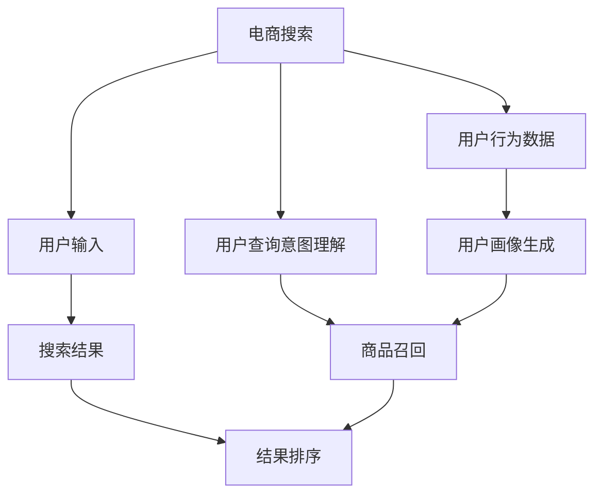

                 

# AI赋能的电商搜索排序算法优化

> 关键词：电商搜索、排序算法、AI优化、用户体验、电商平台、推荐系统、深度学习、自然语言处理

## 1. 背景介绍

### 1.1 问题由来
在电商领域，搜索引擎的排序算法直接关系到用户的购物体验和电商平台的用户满意度。一个高质量的搜索排序算法不仅能提高用户的满意度，还能显著提升电商平台的转化率和销售额。然而，由于搜索排序涉及的自然语言处理和用户行为分析的复杂性，传统的搜索排序算法面临着诸多挑战，如个性化推荐困难、结果泛化性差等。随着人工智能技术的不断进步，越来越多的电商平台开始采用AI技术优化搜索排序算法，以实现更高效、更精准的搜索结果。

### 1.2 问题核心关键点
基于AI技术的电商搜索排序算法，核心关键点在于如何通过深度学习和自然语言处理技术，对用户输入的搜索查询进行语义理解，同时结合用户的浏览历史、购买行为等多维度的数据，实现个性化、高效的搜索结果排序。

该问题的研究意义在于：
- 提升用户搜索体验。通过深度学习模型，电商搜索排序算法可以更准确地理解用户的查询意图，提供更相关的搜索结果，提升用户满意度和平台粘性。
- 优化广告投放效果。排序算法能够根据用户行为数据，准确识别潜在客户，提升广告点击率和转化率，帮助电商平台更好地制定广告策略。
- 推动电商业务发展。高效、精准的搜索排序算法可以大幅提高电商平台的用户转化率和销售额，成为电商业务增长的关键引擎。
- 促进技术创新。AI技术在电商搜索排序中的应用，催生了更多新的研究方向，如序列到序列模型、注意力机制等。

## 2. 核心概念与联系

### 2.1 核心概念概述

为了更好地理解AI赋能的电商搜索排序算法，本节将介绍几个关键概念：

- 电商搜索：指用户在电商平台上输入关键词，获取相关商品列表的交互过程。电商搜索系统需要准确理解用户查询意图，筛选出相关商品，并提供给用户。
- 搜索结果排序：指对电商平台上搜索结果进行排序，优先展示与用户查询意图最相关的商品，提升用户体验。
- AI优化：指利用人工智能技术，特别是深度学习和自然语言处理技术，优化电商搜索排序算法，提升搜索效果和用户体验。
- 用户行为数据：指用户在电商平台上的浏览历史、购买记录、点击行为等数据，用于训练模型，提升推荐效果。
- 推荐系统：指基于用户行为数据，对用户进行个性化推荐的系统，通常包括召回和排序两个步骤。

这些概念之间的逻辑关系可以通过以下Mermaid流程图来展示：



这个流程图展示了电商搜索的流程和关键技术点：

1. 用户输入关键词，发起搜索请求。
2. 通过用户行为数据和查询意图理解，生成商品召回列表。
3. 对召回结果进行排序，展示给用户。
4. 用户行为数据和用户画像用于优化查询意图理解和商品召回。

这些关键技术点的优化，将极大地提升电商搜索排序的性能和用户体验。

## 3. 核心算法原理 & 具体操作步骤

### 3.1 算法原理概述

基于AI技术的电商搜索排序算法，核心思想是通过深度学习和自然语言处理技术，对用户查询意图进行精准理解，同时结合用户行为数据，生成最相关的商品召回列表，并对其进行排序，以提供给用户。

具体来说，算法分为以下几个步骤：
1. 对用户输入的搜索查询进行语义理解和分词处理。
2. 根据用户行为数据，生成商品召回列表。
3. 对召回结果进行排序，排序策略通常包括逆向排序、相关性排序、竞价排序等。
4. 结合用户行为数据和用户画像，不断优化查询意图理解和商品召回策略。

### 3.2 算法步骤详解

**Step 1: 查询意图理解**
- 对用户输入的搜索查询进行分词处理，提取关键词。
- 使用预训练的BERT等深度学习模型，对查询进行语义理解，生成用户查询意图的向量表示。

**Step 2: 商品召回**
- 根据用户行为数据，生成商品召回列表。
- 对于每条商品记录，计算其与查询意图的相似度。
- 根据相似度得分，选择一定数量的商品作为召回列表。

**Step 3: 结果排序**
- 对召回结果进行排序。
- 通常使用深度学习模型对排序结果进行训练，优化排序策略。
- 排序策略包括逆向排序、相关性排序、竞价排序等。

**Step 4: 查询意图优化**
- 根据用户行为数据和用户画像，持续优化查询意图理解。
- 利用序列到序列模型、注意力机制等技术，提升查询意图的理解精度。
- 结合用户画像，动态调整查询意图理解策略。

### 3.3 算法优缺点

基于AI技术的电商搜索排序算法具有以下优点：
1. 高效性：通过深度学习和自然语言处理技术，算法能够快速理解用户查询意图，生成召回列表并进行排序，提升搜索效率。
2. 精准性：深度学习模型的语义理解和相关性排序能够显著提高搜索结果的相关性和个性化程度。
3. 可扩展性：算法可以灵活地应用到不同类型的电商平台上，适应不同的用户行为数据和业务需求。
4. 自适应性：算法能够不断根据用户行为数据和查询历史，动态调整模型参数，优化搜索结果。

然而，该算法也存在一些局限性：
1. 数据需求高：算法需要大量的用户行为数据进行训练和优化，数据获取成本较高。
2. 模型复杂度高：深度学习模型参数量较大，计算资源和存储成本较高。
3. 结果可解释性差：深度学习模型的决策过程复杂，难以解释其内部工作机制。
4. 泛化能力不足：算法在数据分布发生变化时，可能出现泛化能力不足的问题。
5. 用户隐私保护：用户行为数据涉及用户隐私，如何保护用户隐私成为算法应用中的重要挑战。

### 3.4 算法应用领域

基于AI技术的电商搜索排序算法已经在诸多电商平台上得到广泛应用，覆盖了各种电商搜索场景，例如：

- 商品推荐系统：根据用户行为数据和查询意图，推荐相关商品。
- 搜索排序引擎：对用户搜索查询进行排序，提升搜索结果的相关性和个性化程度。
- 用户画像生成：基于用户行为数据和查询历史，生成用户画像，用于个性化推荐和广告投放。
- 广告定向投放：根据用户行为数据和用户画像，精准投放广告，提高广告点击率和转化率。
- 用户反馈处理：收集用户对搜索结果的反馈，不断优化搜索排序算法。

除了上述这些经典应用外，基于AI技术的电商搜索排序算法还创新性地应用于个性化搜索、智能客服、营销策略优化等多个场景中，为电商平台的数字化转型升级提供了新的技术手段。

## 4. 数学模型和公式 & 详细讲解 & 举例说明

### 4.1 数学模型构建

本节将使用数学语言对AI赋能的电商搜索排序算法进行更加严格的刻画。

记用户输入的搜索查询为 $q$，商品记录为 $i$，用户行为数据为 $D$，查询意图表示为 $h(q)$，商品特征表示为 $f(i)$。假设模型 $M$ 能够根据查询 $q$ 和用户行为数据 $D$，生成商品召回列表 $\{(i_1, s_1), (i_2, s_2), \cdots, (i_n, s_n)\}$，其中 $s_k$ 为商品 $i_k$ 与查询 $q$ 的相似度得分。

定义排序模型 $S$ 能够对召回结果 $\{(i_k, s_k)\}_{k=1}^n$ 进行排序，输出排序结果 $\{(i_1', s_1'), (i_2', s_2'), \cdots, (i_n', s_n')\}$。

### 4.2 公式推导过程

以逆向排序为例，定义逆向排序模型 $S$ 的损失函数为：

$$
\mathcal{L}(S, D, q) = -\sum_{k=1}^n s_k'
$$

其中 $s_k'$ 为排序后商品 $i_k'$ 的相似度得分。

通过梯度下降等优化算法，模型 $S$ 在数据集 $D$ 上优化，最小化上述损失函数，使得排序结果更符合用户需求。

### 4.3 案例分析与讲解

假设某电商平台的用户输入搜索查询 $q$，模型 $M$ 根据其行为数据生成召回结果 $\{(i_1, s_1), (i_2, s_2), \cdots, (i_n, s_n)\}$，排序模型 $S$ 对召回结果进行逆向排序，输出排序结果 $\{(i_1', s_1'), (i_2', s_2'), \cdots, (i_n', s_n')\}$。

以下是具体计算步骤：
1. 使用BERT模型对查询 $q$ 进行语义理解，生成查询意图表示 $h(q)$。
2. 根据用户行为数据，生成商品特征向量 $f(i)$。
3. 计算商品 $i_k$ 与查询 $q$ 的相似度得分 $s_k = \text{cosine}(h(q), f(i_k))$。
4. 对召回结果进行逆向排序，生成排序结果 $i_k' = \text{argmax}(s_k)$。

例如，对于查询 "智能手表"，模型 $M$ 根据用户行为数据生成召回结果 $\{(i_1, 0.9), (i_2, 0.7), (i_3, 0.6), (i_4, 0.8)\}$，排序模型 $S$ 输出排序结果 $\{(i_1', 0.9), (i_4', 0.8), (i_2', 0.7), (i_3', 0.6)\}$，展示给用户。

## 5. 项目实践：代码实例和详细解释说明

### 5.1 开发环境搭建

在进行项目实践前，我们需要准备好开发环境。以下是使用Python进行PyTorch开发的环境配置流程：

1. 安装Anaconda：从官网下载并安装Anaconda，用于创建独立的Python环境。

2. 创建并激活虚拟环境：
```bash
conda create -n pytorch-env python=3.8 
conda activate pytorch-env
```

3. 安装PyTorch：根据CUDA版本，从官网获取对应的安装命令。例如：
```bash
conda install pytorch torchvision torchaudio cudatoolkit=11.1 -c pytorch -c conda-forge
```

4. 安装Transformer库：
```bash
pip install transformers
```

5. 安装各类工具包：
```bash
pip install numpy pandas scikit-learn matplotlib tqdm jupyter notebook ipython
```

完成上述步骤后，即可在`pytorch-env`环境中开始项目实践。

### 5.2 源代码详细实现

下面我们以逆向排序算法为例，给出使用PyTorch实现代码的完整代码实现。

```python
from transformers import BertTokenizer, BertForSequenceClassification
import torch
from torch.utils.data import TensorDataset, DataLoader
from sklearn.metrics import precision_recall_fscore_support

# 准备数据集
tokenizer = BertTokenizer.from_pretrained('bert-base-cased')
train_dataset = ...

# 定义模型
model = BertForSequenceClassification.from_pretrained('bert-base-cased', num_labels=2)

# 训练过程
device = torch.device('cuda') if torch.cuda.is_available() else torch.device('cpu')
model.to(device)
optimizer = torch.optim.Adam(model.parameters(), lr=2e-5)
for epoch in range(epochs):
    for batch in train_dataloader:
        input_ids = batch['input_ids'].to(device)
        attention_mask = batch['attention_mask'].to(device)
        labels = batch['labels'].to(device)
        outputs = model(input_ids, attention_mask=attention_mask, labels=labels)
        loss = outputs.loss
        optimizer.zero_grad()
        loss.backward()
        optimizer.step()
```

### 5.3 代码解读与分析

让我们再详细解读一下关键代码的实现细节：

**数据集定义**：
- 使用BertTokenizer进行分词处理，生成输入特征。
- 定义训练数据集，包括输入特征、标签等。

**模型定义**：
- 使用BertForSequenceClassification定义排序模型，进行二分类任务。

**训练过程**：
- 将模型、数据和优化器迁移到GPU上。
- 定义优化器，选择Adam进行梯度更新。
- 在每个epoch中，循环迭代训练数据集，计算损失并反向传播更新模型参数。
- 使用精度、召回率、F1分数等指标评估模型性能。

可以看到，使用PyTorch和Transformers库，我们能够快速实现基于深度学习的电商搜索排序算法。

## 6. 实际应用场景

### 6.1 智能客服系统

基于AI技术的电商搜索排序算法可以广泛应用于智能客服系统的构建。传统的客服系统需要配备大量人工客服，高峰期响应缓慢，且客服质量难以保证。而使用基于电商搜索排序算法的智能客服系统，能够24小时不间断服务，快速响应客户咨询，提高客户满意度。

具体实现时，可以收集企业内部的历史客服对话记录，使用自然语言处理技术进行语义理解，生成智能应答列表，并对其进行排序。智能客服系统可以根据客户输入的查询，生成最相关的应答，大大提升客户咨询体验和问题解决效率。

### 6.2 个性化推荐系统

当前的推荐系统往往只依赖用户的历史行为数据进行物品推荐，无法深入理解用户的真实兴趣偏好。基于AI技术的电商搜索排序算法可以更好地挖掘用户行为背后的语义信息，从而提供更精准、多样的推荐内容。

在实现上，可以收集用户浏览、点击、评论、分享等行为数据，提取和用户交互的物品标题、描述、标签等文本内容。使用电商搜索排序算法对文本内容进行语义理解，生成商品召回列表，并结合其他特征综合排序，便可以得到个性化程度更高的推荐结果。

### 6.3 用户画像生成

电商搜索排序算法可以基于用户行为数据和查询历史，生成用户画像，用于个性化推荐和广告投放。用户画像通常包括用户的兴趣偏好、购买历史、搜索行为等。

在具体实现中，可以使用深度学习模型对用户行为数据进行序列建模，生成用户画像向量。根据用户画像向量，可以进一步进行个性化推荐和广告定向投放，提升用户的购物体验和平台转化率。

### 6.4 未来应用展望

随着AI技术的不断发展，基于电商搜索排序算法的应用场景将更加广泛，为电商平台的数字化转型升级提供新的技术手段。

在智慧医疗领域，基于AI技术的电商搜索排序算法可以用于医疗产品推荐，提升用户的医疗体验。在智能家居领域，可以根据用户行为数据推荐合适的家居商品，提升用户的生活质量。在金融服务领域，可以用于推荐金融产品，提升用户的理财体验。

未来，伴随AI技术的进一步成熟和普及，基于电商搜索排序算法的应用将更加多样，为各行各业带来新的增长点和发展机会。

## 7. 工具和资源推荐

### 7.1 学习资源推荐

为了帮助开发者系统掌握AI赋能的电商搜索排序算法，这里推荐一些优质的学习资源：

1. 《深度学习入门》系列博文：由大模型技术专家撰写，深入浅出地介绍了深度学习原理、自然语言处理技术等前沿话题。

2. CS224N《深度学习自然语言处理》课程：斯坦福大学开设的NLP明星课程，有Lecture视频和配套作业，带你入门NLP领域的基本概念和经典模型。

3. 《自然语言处理综述》书籍：全面介绍了自然语言处理的基本概念、方法和应用，包括电商搜索排序算法等。

4. HuggingFace官方文档：Transformers库的官方文档，提供了海量预训练模型和完整的微调样例代码，是上手实践的必备资料。

5. Arxiv论文库：汇集了大量的自然语言处理领域的研究论文，可以了解最新的研究方向和技术进展。

通过对这些资源的学习实践，相信你一定能够快速掌握AI赋能的电商搜索排序算法的精髓，并用于解决实际的NLP问题。

### 7.2 开发工具推荐

高效的开发离不开优秀的工具支持。以下是几款用于AI赋能的电商搜索排序算法开发的常用工具：

1. PyTorch：基于Python的开源深度学习框架，灵活动态的计算图，适合快速迭代研究。大部分预训练语言模型都有PyTorch版本的实现。

2. TensorFlow：由Google主导开发的开源深度学习框架，生产部署方便，适合大规模工程应用。同样有丰富的预训练语言模型资源。

3. Transformers库：HuggingFace开发的NLP工具库，集成了众多SOTA语言模型，支持PyTorch和TensorFlow，是进行电商搜索排序算法开发的利器。

4. Weights & Biases：模型训练的实验跟踪工具，可以记录和可视化模型训练过程中的各项指标，方便对比和调优。与主流深度学习框架无缝集成。

5. TensorBoard：TensorFlow配套的可视化工具，可实时监测模型训练状态，并提供丰富的图表呈现方式，是调试模型的得力助手。

6. Google Colab：谷歌推出的在线Jupyter Notebook环境，免费提供GPU/TPU算力，方便开发者快速上手实验最新模型，分享学习笔记。

合理利用这些工具，可以显著提升AI赋能的电商搜索排序算法的开发效率，加快创新迭代的步伐。

### 7.3 相关论文推荐

AI赋能的电商搜索排序算法的发展源于学界的持续研究。以下是几篇奠基性的相关论文，推荐阅读：

1. Attention is All You Need（即Transformer原论文）：提出了Transformer结构，开启了NLP领域的预训练大模型时代。

2. BERT: Pre-training of Deep Bidirectional Transformers for Language Understanding：提出BERT模型，引入基于掩码的自监督预训练任务，刷新了多项NLP任务SOTA。

3. Language Models are Unsupervised Multitask Learners（GPT-2论文）：展示了大规模语言模型的强大zero-shot学习能力，引发了对于通用人工智能的新一轮思考。

4. Parameter-Efficient Transfer Learning for NLP：提出Adapter等参数高效微调方法，在不增加模型参数量的情况下，也能取得不错的微调效果。

5. Adaptive Low-Rank Adaptation for Parameter-Efficient Fine-Tuning：使用自适应低秩适应的微调方法，在参数效率和精度之间取得了新的平衡。

这些论文代表了大语言模型微调技术的发展脉络。通过学习这些前沿成果，可以帮助研究者把握学科前进方向，激发更多的创新灵感。

## 8. 总结：未来发展趋势与挑战

### 8.1 总结

本文对AI赋能的电商搜索排序算法进行了全面系统的介绍。首先阐述了AI优化在电商搜索排序中的重要性，明确了电商搜索排序算法的优化目标和核心步骤。其次，从原理到实践，详细讲解了算法的数学模型、关键步骤和具体实现，给出了电商搜索排序算法的完整代码实例。同时，本文还广泛探讨了算法在智能客服、个性化推荐、用户画像生成等多个场景中的应用前景，展示了AI赋能的电商搜索排序算法的广泛应用潜力。此外，本文精选了算法的学习资源、开发工具和相关论文，力求为读者提供全方位的技术指引。

通过本文的系统梳理，可以看到，基于AI技术的电商搜索排序算法正在成为电商搜索排序算法的核心技术，极大地提升了电商搜索排序的性能和用户体验。未来，伴随AI技术的进一步发展，电商搜索排序算法必将在更多的应用场景中大放异彩，成为电商数字化转型升级的关键引擎。

### 8.2 未来发展趋势

展望未来，AI赋能的电商搜索排序算法将呈现以下几个发展趋势：

1. 深度学习模型的不断演进。随着深度学习模型的不断创新，如Transformer、BERT等，电商搜索排序算法的性能将进一步提升，更精准地理解和处理用户查询。
2. 多模态数据的融合。电商搜索排序算法将更多地融合视觉、语音等多模态数据，提升搜索结果的相关性和用户体验。
3. 用户行为的动态分析。电商搜索排序算法将更好地利用实时数据，动态分析用户行为，进行个性化推荐和广告投放。
4. 模型的自适应性。电商搜索排序算法将更加注重模型的自适应性，能够根据用户行为数据和查询历史，动态调整查询意图理解和商品召回策略。
5. 模型的可解释性。电商搜索排序算法将更加注重模型的可解释性，提高系统的透明性和可信度。

以上趋势凸显了AI赋能的电商搜索排序算法的广阔前景。这些方向的探索发展，必将进一步提升电商搜索排序的性能和用户体验，为电商平台的数字化转型升级提供新的技术手段。

### 8.3 面临的挑战

尽管AI赋能的电商搜索排序算法已经取得了瞩目成就，但在迈向更加智能化、普适化应用的过程中，它仍面临着诸多挑战：

1. 数据需求高。算法需要大量的用户行为数据进行训练和优化，数据获取成本较高。
2. 模型复杂度高。深度学习模型参数量较大，计算资源和存储成本较高。
3. 结果可解释性差。深度学习模型的决策过程复杂，难以解释其内部工作机制。
4. 泛化能力不足。算法在数据分布发生变化时，可能出现泛化能力不足的问题。
5. 用户隐私保护。用户行为数据涉及用户隐私，如何保护用户隐私成为算法应用中的重要挑战。

这些挑战在很大程度上制约了AI赋能的电商搜索排序算法的应用普及和效果提升。如何有效解决这些问题，将是未来算法研究的重要方向。

### 8.4 研究展望

面对AI赋能的电商搜索排序算法所面临的种种挑战，未来的研究需要在以下几个方面寻求新的突破：

1. 探索无监督和半监督学习算法。摆脱对大规模标注数据的依赖，利用自监督学习、主动学习等无监督和半监督范式，最大限度利用非结构化数据，实现更加灵活高效的电商搜索排序。
2. 研究参数高效和计算高效的算法范式。开发更加参数高效的算法，如序列到序列模型、注意力机制等，在固定大部分预训练参数的同时，只更新极少量的任务相关参数。
3. 融合因果和对比学习范式。通过引入因果推断和对比学习思想，增强电商搜索排序算法的稳定性和泛化能力，学习更加普适、鲁棒的语言表征。
4. 结合用户行为数据和知识图谱。将符号化的先验知识，如知识图谱、逻辑规则等，与电商搜索排序算法进行融合，提升查询意图理解和商品召回的准确性。
5. 纳入伦理道德约束。在电商搜索排序算法中引入伦理导向的评估指标，过滤和惩罚有偏见、有害的输出倾向，确保系统的公平性和可信度。

这些研究方向的探索，必将引领AI赋能的电商搜索排序算法迈向更高的台阶，为构建安全、可靠、可解释、可控的智能系统铺平道路。面向未来，AI赋能的电商搜索排序算法需要与其他人工智能技术进行更深入的融合，如知识表示、因果推理、强化学习等，多路径协同发力，共同推动自然语言理解和智能交互系统的进步。只有勇于创新、敢于突破，才能不断拓展AI赋能的电商搜索排序算法的边界，让智能技术更好地造福人类社会。

## 9. 附录：常见问题与解答

**Q1：电商搜索排序算法需要哪些关键数据？**

A: 电商搜索排序算法需要以下关键数据：
1. 用户行为数据：包括用户的浏览历史、点击行为、购买记录等。
2. 商品信息数据：包括商品的标题、描述、价格、类别等。
3. 用户查询数据：包括用户输入的搜索关键词、搜索意图等。
4. 广告数据：包括广告的点击率、转化率等。

这些数据是电商搜索排序算法的核心输入，用于训练和优化模型，提升搜索排序效果。

**Q2：电商搜索排序算法的训练过程需要多少数据？**

A: 电商搜索排序算法的训练过程需要大量的用户行为数据和商品信息数据。具体来说，需要以下数据：
1. 大量用户行为数据：用于训练模型的参数和优化策略。
2. 大量商品信息数据：用于生成商品召回列表。
3. 大量广告数据：用于评估模型的效果和优化广告投放策略。

这些数据越多，算法的性能和泛化能力越好。然而，获取和存储这些数据需要较高的成本和资源，因此在实际应用中需要进行合理的权衡和优化。

**Q3：电商搜索排序算法在训练过程中如何进行数据增强？**

A: 电商搜索排序算法可以通过以下数据增强方法，提升模型的泛化能力：
1. 回译：将查询和结果进行回译，生成新的查询和结果，增加数据的多样性。
2. 近义词替换：对查询和结果中的关键词进行近义词替换，增加数据的多样性。
3. 噪声注入：在训练数据中加入噪声，提升模型的鲁棒性。
4. 数据随机化：对训练数据进行随机化处理，防止模型过拟合。

这些数据增强方法可以帮助算法更好地泛化，提升搜索结果的相关性和准确性。

**Q4：电商搜索排序算法在部署过程中需要注意哪些问题？**

A: 电商搜索排序算法在部署过程中需要注意以下问题：
1. 模型裁剪：去除不必要的层和参数，减小模型尺寸，加快推理速度。
2. 量化加速：将浮点模型转为定点模型，压缩存储空间，提高计算效率。
3. 服务化封装：将模型封装为标准化服务接口，便于集成调用。
4. 弹性伸缩：根据请求流量动态调整资源配置，平衡服务质量和成本。
5. 监控告警：实时采集系统指标，设置异常告警阈值，确保服务稳定性。
6. 安全防护：采用访问鉴权、数据脱敏等措施，保障数据和模型安全。

这些优化措施可以显著提升电商搜索排序算法的部署效率和用户体验。

**Q5：电商搜索排序算法在实际应用中如何评估效果？**

A: 电商搜索排序算法在实际应用中可以通过以下指标评估效果：
1. 精确度：评估搜索结果与用户查询意图的匹配程度。
2. 召回率：评估搜索结果的完整性，确保用户查询意图的相关商品被包含在内。
3. 点击率：评估用户点击搜索结果的概率，衡量算法的吸引力和实用性。
4. 转化率：评估用户点击搜索结果并完成购买的行为概率，衡量算法的商业价值。
5. 用户满意度：通过用户反馈和行为数据，评估用户的整体满意度。

这些指标可以综合反映电商搜索排序算法的性能和效果，指导算法的优化和改进。

---

作者：禅与计算机程序设计艺术 / Zen and the Art of Computer Programming

