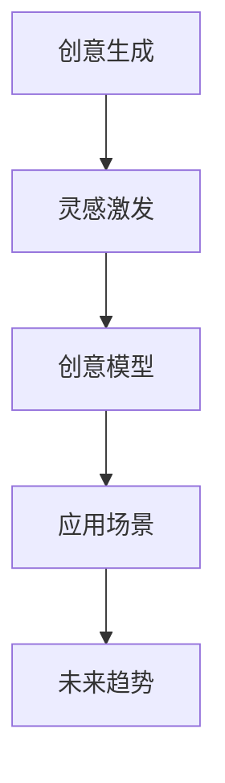

                 

## 1. 背景介绍

### 1.1 问题由来

在快速发展的数字时代，人工智能(AI)已经成为创意产业的重要辅助工具。从音乐创作到艺术设计，从写作辅助到影视制作，AI正在以一种颠覆性的方式介入人类的创意过程，提升创作效率，激发新的灵感。然而，如何更有效地将AI与人类创意相结合，仍然是一个重要的研究课题。

### 1.2 问题核心关键点

本文聚焦于AI如何辅助创意，将从灵感到实现的整个过程进行详细阐述。核心关键点包括：

1. 创意生成：如何利用AI技术生成高质量的创意内容。
2. 灵感激发：如何通过AI技术激发创作灵感，提升创作效率。
3. 模型训练：如何设计合适的AI模型，使其能够准确捕捉创意的特性和模式。
4. 应用场景：AI在创意产业中的典型应用场景，如音乐创作、绘画、写作、影视制作等。
5. 未来展望：AI辅助创意的前沿技术和未来趋势。

### 1.3 问题研究意义

研究AI辅助创意的方法，对于推动创意产业的数字化转型、提升创意作品的质量和多样性、加速创意技术的商业化应用具有重要意义：

1. 降低创意成本：AI能够快速生成大量创意内容，大幅降低创作成本和时间投入。
2. 提升创作效率：AI提供即时的创作建议和优化，帮助创作者更快地实现创意想法。
3. 激发新灵感：AI通过数据分析和学习，能够发现人类难以发现的创新点，激发新的创作灵感。
4. 拓宽应用领域：AI技术的应用范围覆盖了音乐、绘画、写作等多个创意产业，具有广泛的应用前景。
5. 加速商业化进程：AI的辅助使创意作品更容易被量化和商业化，加速创意技术的市场化进程。

## 2. 核心概念与联系

### 2.1 核心概念概述

要深入理解AI如何辅助创意，首先需要了解几个核心概念：

- **创意生成(Generative Creativity)**：通过AI技术自动生成创意内容，如文本、音乐、绘画等。
- **灵感激发(Spiration Generation)**：利用AI技术发现新的创意方向和灵感，激发人类创作者的创造力。
- **创意模型(Creative Model)**：设计并训练特定的AI模型，以捕捉和生成创意的特征和模式。
- **应用场景(Scenario Application)**：AI在音乐创作、绘画、写作、影视制作等不同创意产业中的具体应用。
- **未来趋势(Future Trends)**：AI辅助创意技术的发展方向和前沿趋势。

这些概念之间的逻辑关系可以通过以下Mermaid流程图来展示：



这个流程图展示了这个框架的核心概念及其之间的联系：

1. AI通过生成创意内容帮助人类快速生成大量作品。
2. 通过灵感激发技术，AI发现新的创作方向和灵感。
3. 基于创意模型，AI捕捉和生成创意的特性和模式。
4. 这些技术被应用于不同的创意产业，提升了创意作品的质量和效率。
5. 未来AI辅助创意技术的发展趋势和前沿应用。

## 3. 核心算法原理 & 具体操作步骤

### 3.1 算法原理概述

AI辅助创意的核心在于如何利用AI技术生成和优化创意内容。这一过程主要依赖于深度学习模型，特别是生成对抗网络(GANs)和变分自编码器(VAEs)等生成模型。这些模型通过训练，能够生成与真实数据相似的创意作品，并不断优化以提高创意的质量。

AI辅助创意的总体流程包括：

1. **数据收集与预处理**：收集创意领域的相关数据，并进行预处理，确保数据的质量和可用性。
2. **模型设计与训练**：选择合适的生成模型，并对其进行训练，优化模型参数以捕捉创意的特性。
3. **创意生成与优化**：使用训练好的模型生成创意作品，并通过反馈机制不断优化创意质量。
4. **灵感激发与评估**：利用AI技术激发创作灵感，并通过评估机制对创意作品进行打分和反馈。
5. **应用集成与部署**：将AI辅助创意技术集成到创意工具和应用中，实现自动化和高效化。

### 3.2 算法步骤详解

#### 3.2.1 数据收集与预处理

**步骤1**：收集创意领域的数据集，如音乐谱、绘画作品、文本等。这些数据集应尽可能全面，涵盖创意作品的多样性和复杂性。

**步骤2**：对数据进行预处理，包括清洗、归一化、标注等步骤。例如，对于文本数据，可以进行分词、去除停用词、构建词汇表等处理。

**步骤3**：将预处理后的数据集分为训练集和测试集，确保模型能够在不同的数据上表现稳定。

#### 3.2.2 模型设计与训练

**步骤4**：选择适当的生成模型，如GANs、VAEs等。这些模型通过生成创意作品，模拟真实数据的分布。

**步骤5**：设计模型架构，包括编码器、解码器和判别器等关键组件。例如，GANs模型通常由生成器和判别器两部分组成，通过对抗训练的方式不断优化生成效果。

**步骤6**：使用训练集数据训练模型，优化模型参数。常用的训练方法包括梯度下降、Adam优化器等。

**步骤7**：在测试集上评估模型性能，确保模型具有较高的生成质量和多样性。

#### 3.2.3 创意生成与优化

**步骤8**：使用训练好的模型生成创意作品。例如，对于文本生成，可以将随机噪声作为输入，通过解码器生成新的文本。

**步骤9**：对生成的创意作品进行优化，提高作品的质量和创意性。常用的优化方法包括精细化调参、引入外部反馈机制等。

#### 3.2.4 灵感激发与评估

**步骤10**：利用AI技术激发创作灵感。例如，通过分析历史创意作品的特征，生成新的创意方向。

**步骤11**：对生成的创意作品进行评估，包括但不限于人工打分、自动评估指标等。

**步骤12**：根据评估结果，不断调整和优化生成模型，提高创意作品的质量和多样性。

#### 3.2.5 应用集成与部署

**步骤13**：将AI辅助创意技术集成到创意工具和应用中，实现自动化和高效化。例如，将文本生成模型集成到写作辅助工具中，提升创作效率。

**步骤14**：部署AI辅助创意工具，确保其在不同环境下的稳定性和可靠性。

### 3.3 算法优缺点

AI辅助创意的优势包括：

1. **效率提升**：AI可以快速生成大量创意作品，大幅缩短创意过程。
2. **质量提升**：通过不断的优化和学习，AI生成的创意作品质量不断提高。
3. **创新激发**：AI能够发现人类难以发现的创新点，激发新的创作灵感。

然而，AI辅助创意也存在一些局限性：

1. **创意多样性**：AI生成的创意作品可能缺乏多样性，容易陷入模式化。
2. **创意真实性**：AI生成的创意作品可能缺乏真实的情感和深度。
3. **数据依赖**：AI生成的创意作品质量高度依赖于训练数据的丰富性和多样性。
4. **模型偏见**：AI模型可能带有数据来源的偏见，生成作品的偏见性较强。

### 3.4 算法应用领域

AI辅助创意技术已经在多个领域得到了广泛应用，包括：

- **音乐创作**：通过AI生成音乐旋律、和弦、节奏等，辅助音乐创作。
- **绘画创作**：利用AI生成绘画风格、色彩搭配等，辅助绘画创作。
- **文本创作**：通过AI生成文本段落、故事、诗歌等，辅助写作创作。
- **影视制作**：利用AI生成特效、场景、角色等，辅助影视制作。
- **设计创作**：通过AI生成设计图、模型、方案等，辅助设计创作。

## 4. 数学模型和公式 & 详细讲解 & 举例说明

### 4.1 数学模型构建

本节将使用数学语言对AI辅助创意的流程进行详细描述。

假设创意作品为 $x \in \mathcal{X}$，其中 $\mathcal{X}$ 为创意作品空间。模型的目标是通过输入 $z \sim p(z)$ 生成创意作品 $x \sim p(x|z)$，其中 $p(z)$ 为噪声分布，$p(x|z)$ 为生成模型。

### 4.2 公式推导过程

#### 4.2.1 生成对抗网络(GANs)

GANs由生成器 $G$ 和判别器 $D$ 两部分组成，目标是通过对抗训练的方式，生成高质量的创意作品。

**公式1**：生成器的目标是最小化判别器无法准确区分真实作品和生成作品的概率：

$$
\min_{G} \max_{D} V(D,G) = \mathbb{E}_{x \sim p(x)} [\log D(x)] + \mathbb{E}_{z \sim p(z)} [\log (1 - D(G(z)))]
$$

**公式2**：判别器的目标是最小化生成器生成的假作品的识别概率：

$$
\min_{D} \max_{G} V(D,G) = \mathbb{E}_{x \sim p(x)} [\log D(x)] + \mathbb{E}_{z \sim p(z)} [\log (1 - D(G(z)))]
$$

通过最大化判别器和最小化生成器之间的对抗损失，生成器能够不断优化生成效果。

#### 4.2.2 变分自编码器(VAEs)

VAEs通过学习数据的潜在表示 $z$，实现创意作品的生成和优化。

**公式3**：VAEs的生成过程为：

$$
x \sim p(x|z) = G(z)
$$

**公式4**：VAEs的潜在表示学习过程为：

$$
z \sim q(z|x) = \mu + \sigma \cdot \epsilon
$$

其中 $\mu$ 和 $\sigma$ 为潜在表示的均值和标准差，$\epsilon \sim \mathcal{N}(0, I)$ 为标准正态分布。

通过最大化潜在表示的概率分布与真实数据分布之间的KL散度，VAEs能够生成与真实数据相似的高质量创意作品。

### 4.3 案例分析与讲解

**案例1**：文本生成

- **数据集**：Wikipedia文章数据集
- **模型**：基于LSTM的变分自编码器
- **目标**：生成与真实文章相似的创意文章

**步骤**：

1. **数据预处理**：将文章文本进行分词、去除停用词、构建词汇表等处理。
2. **模型训练**：使用Wikipedia文章数据集训练变分自编码器，优化模型参数。
3. **生成文章**：将随机噪声作为输入，通过解码器生成新的文本文章。
4. **评估与优化**：通过人工打分和自动评估指标，对生成的文本进行评估，并不断调整模型参数。

**案例2**：音乐生成

- **数据集**：MIDI音乐数据集
- **模型**：基于CNN的生成对抗网络
- **目标**：生成与真实音乐相似的高质量乐曲

**步骤**：

1. **数据预处理**：将MIDI音乐数据进行归一化、标签化等处理。
2. **模型训练**：使用MIDI音乐数据集训练生成对抗网络，优化模型参数。
3. **生成乐曲**：将随机噪声作为输入，通过生成器生成新的乐曲。
4. **评估与优化**：通过人工打分和自动评估指标，对生成的乐曲进行评估，并不断调整模型参数。

## 5. 项目实践：代码实例和详细解释说明

### 5.1 开发环境搭建

在进行AI辅助创意的实践前，我们需要准备好开发环境。以下是使用Python进行TensorFlow开发的环境配置流程：

1. 安装Anaconda：从官网下载并安装Anaconda，用于创建独立的Python环境。

2. 创建并激活虚拟环境：
```bash
conda create -n tf-env python=3.8 
conda activate tf-env
```

3. 安装TensorFlow：根据CUDA版本，从官网获取对应的安装命令。例如：
```bash
conda install tensorflow tensorflow-gpu -c conda-forge
```

4. 安装TensorFlow扩展库：
```bash
pip install tensorflow-addons
```

5. 安装各类工具包：
```bash
pip install numpy pandas scikit-learn matplotlib tqdm jupyter notebook ipython
```

完成上述步骤后，即可在`tf-env`环境中开始项目实践。

### 5.2 源代码详细实现

下面是使用TensorFlow进行文本生成的代码实现：

```python
import tensorflow as tf
from tensorflow.keras import layers
from tensorflow.keras.losses import BinaryCrossentropy
from tensorflow.keras.optimizers import Adam

# 定义生成器
class Generator(tf.keras.Model):
    def __init__(self, latent_dim, output_dim):
        super(Generator, self).__init__()
        self.dense = layers.Dense(256, input_dim=latent_dim)
        self.dense_2 = layers.Dense(512)
        self.dense_3 = layers.Dense(output_dim, activation='tanh')

    def call(self, inputs):
        x = self.dense(inputs)
        x = self.dense_2(x)
        x = self.dense_3(x)
        return x

# 定义判别器
class Discriminator(tf.keras.Model):
    def __init__(self, input_dim):
        super(Discriminator, self).__init__()
        self.dense = layers.Dense(512, input_dim=input_dim)
        self.dense_2 = layers.Dense(256)
        self.sigmoid = layers.Activation('sigmoid')

    def call(self, inputs):
        x = self.dense(inputs)
        x = self.dense_2(x)
        return self.sigmoid(x)

# 定义生成对抗网络
def GAN():
    generator = Generator(latent_dim=100, output_dim=1024)
    discriminator = Discriminator(input_dim=1024)
    return generator, discriminator

# 定义损失函数
def loss_generator(real_outputs, fake_outputs):
    binary_crossentropy = BinaryCrossentropy()
    return binary_crossentropy(tf.ones_like(real_outputs), real_outputs)

def loss_discriminator(real_outputs, fake_outputs):
    binary_crossentropy = BinaryCrossentropy()
    return binary_crossentropy(tf.zeros_like(real_outputs), real_outputs) + binary_crossentropy(tf.ones_like(fake_outputs), fake_outputs)

# 定义优化器
def build_optimizer():
    generator_optimizer = Adam(learning_rate=0.0002)
    discriminator_optimizer = Adam(learning_rate=0.0002)
    return generator_optimizer, discriminator_optimizer

# 训练模型
def train():
    generator, discriminator = GAN()
    generator_optimizer, discriminator_optimizer = build_optimizer()
    real_data = tf.random.normal([batch_size, 1024])
    for epoch in range(epochs):
        with tf.GradientTape() as generator_tape, tf.GradientTape() as discriminator_tape:
            fake_data = generator(latent_var)
            real_output = discriminator(real_data)
            fake_output = discriminator(fake_data)
            generator_loss = loss_generator(fake_output, real_output)
            discriminator_loss = loss_discriminator(real_output, fake_output)
        gradients_of_generator = generator_tape.gradient(generator_loss, generator.trainable_variables)
        gradients_of_discriminator = discriminator_tape.gradient(discriminator_loss, discriminator.trainable_variables)
        generator_optimizer.apply_gradients(zip(gradients_of_generator, generator.trainable_variables))
        discriminator_optimizer.apply_gradients(zip(gradients_of_discriminator, discriminator.trainable_variables))
        if (epoch+1) % 100 == 0:
            print(f'Epoch {epoch+1}, Generator Loss: {generator_loss}, Discriminator Loss: {discriminator_loss}')

# 运行代码
latent_var = tf.random.normal([batch_size, 100])
train()
```

### 5.3 代码解读与分析

让我们再详细解读一下关键代码的实现细节：

**GAN模型**：
- 定义生成器和判别器类，通过Dense层实现。
- 在生成器和判别器中，使用`layers.Dense`定义全连接层，`layers.Activation`定义激活函数。

**损失函数**：
- 定义生成器和判别器的损失函数，使用`BinaryCrossentropy`计算二分类交叉熵。
- 生成器损失为真实输出与假输出之间的交叉熵，判别器损失为真实输出与假输出之间的交叉熵。

**优化器**：
- 定义生成器和判别器的优化器，使用`Adam`优化器。
- 在训练过程中，使用`tf.GradientTape`记录梯度，并使用`apply_gradients`方法更新模型参数。

**训练流程**：
- 在每个epoch中，使用随机噪声作为输入，训练生成器和判别器。
- 输出生成器的损失和判别器的损失，以便观察训练效果。

## 6. 实际应用场景

### 6.1 智能创作系统

智能创作系统是AI辅助创意的核心应用之一。通过AI技术，系统能够辅助创作者快速生成创意内容，提升创作效率和质量。

**应用示例**：音乐创作软件

- **功能**：通过AI生成音乐旋律、和弦、节奏等，辅助音乐创作。
- **技术**：使用生成对抗网络或变分自编码器，生成高质量的乐曲。
- **优势**：快速生成多种风格的音乐，提供创作灵感，提高创作效率。

**应用示例**：绘画创作软件

- **功能**：通过AI生成绘画风格、色彩搭配等，辅助绘画创作。
- **技术**：使用生成对抗网络或变分自编码器，生成高质量的绘画作品。
- **优势**：快速生成多种风格的绘画作品，提供创作灵感，提高创作效率。

### 6.2 创意内容推荐系统

创意内容推荐系统通过AI技术，将创意作品推荐给潜在用户，提升用户满意度和使用体验。

**应用示例**：影视推荐平台

- **功能**：通过AI推荐符合用户兴趣的影视作品。
- **技术**：使用协同过滤、内容推荐等技术，结合用户行为数据和创意作品特征，进行精准推荐。
- **优势**：提高用户粘性，提升平台流量和收入。

**应用示例**：设计推荐平台

- **功能**：通过AI推荐符合用户兴趣的设计方案。
- **技术**：使用协同过滤、内容推荐等技术，结合用户行为数据和创意作品特征，进行精准推荐。
- **优势**：提高用户满意度，提升平台流量和收入。

### 6.3 创意作品生成与优化

AI辅助创意的核心在于生成和优化创意作品。通过不断的优化和学习，AI生成的创意作品质量不断提高。

**应用示例**：文本生成

- **功能**：通过AI生成文本段落、故事、诗歌等。
- **技术**：使用生成对抗网络或变分自编码器，生成高质量的文本作品。
- **优势**：快速生成多种风格的文本作品，提供创作灵感，提高创作效率。

**应用示例**：图像生成

- **功能**：通过AI生成图像、动画等创意作品。
- **技术**：使用生成对抗网络或变分自编码器，生成高质量的创意作品。
- **优势**：快速生成多种风格的创意作品，提供创作灵感，提高创作效率。

## 7. 工具和资源推荐

### 7.1 学习资源推荐

为了帮助开发者系统掌握AI辅助创意的理论基础和实践技巧，这里推荐一些优质的学习资源：

1. **《深度学习》**：Ian Goodfellow等著，介绍了深度学习的原理、方法和应用，是学习深度学习的重要参考书。
2. **《生成对抗网络》**：Goodfellow等著，详细介绍了生成对抗网络的理论基础和实践技巧，是学习生成模型的经典教材。
3. **Coursera《深度学习专项课程》**：由Andrew Ng等人讲授，涵盖深度学习的各个方面，适合初学者系统学习。
4. **CS231n《计算机视觉》课程**：斯坦福大学开设的计算机视觉课程，详细介绍了计算机视觉的前沿技术和应用。
5. **Kaggle平台**：数据科学和机器学习竞赛平台，通过实际项目提升技能。

通过对这些资源的学习实践，相信你一定能够快速掌握AI辅助创意的精髓，并用于解决实际的创意问题。

### 7.2 开发工具推荐

高效的开发离不开优秀的工具支持。以下是几款用于AI辅助创意开发的常用工具：

1. **TensorFlow**：由Google主导开发的深度学习框架，生产部署方便，适合大规模工程应用。
2. **PyTorch**：由Facebook开发的深度学习框架，灵活性高，适合快速迭代研究。
3. **Keras**：高层次的深度学习API，简单易用，适合初学者上手。
4. **Jupyter Notebook**：交互式编程环境，适合数据探索和模型训练。
5. **Git**：版本控制系统，便于协作开发和代码管理。

合理利用这些工具，可以显著提升AI辅助创意任务的开发效率，加快创新迭代的步伐。

### 7.3 相关论文推荐

AI辅助创意技术的发展离不开学界的持续研究。以下是几篇奠基性的相关论文，推荐阅读：

1. **《Neural Machine Translation by Jointly Learning to Align and Translate》**：提出基于注意力机制的神经机器翻译模型，实现了高质量的翻译效果。
2. **《Generative Adversarial Nets》**：提出生成对抗网络模型，通过对抗训练生成高质量的创意作品。
3. **《Variational Autoencoders》**：提出变分自编码器模型，通过潜在表示学习生成高质量的创意作品。
4. **《Adversarial examples in the physical world》**：研究生成对抗网络模型的鲁棒性问题，揭示了模型的脆弱性。
5. **《Learning to generate pictures from words》**：提出基于变分自编码器的文本生成模型，实现了高质量的文本生成效果。

这些论文代表了大语言模型辅助创意技术的发展脉络。通过学习这些前沿成果，可以帮助研究者把握学科前进方向，激发更多的创新灵感。

## 8. 总结：未来发展趋势与挑战

### 8.1 总结

本文对AI辅助创意的方法进行了全面系统的介绍。首先阐述了AI辅助创意的研究背景和意义，明确了AI在创意生成、灵感激发、模型训练等方面的核心价值。其次，从原理到实践，详细讲解了AI辅助创意的数学模型和关键步骤，给出了具体的代码实现。同时，本文还探讨了AI辅助创意在音乐创作、绘画、写作、影视制作等不同领域的典型应用，展示了AI在创意产业中的广泛应用前景。最后，本文提供了丰富的学习资源、开发工具和相关论文，为AI辅助创意的研究和实践提供了全面的指导。

通过本文的系统梳理，可以看到，AI辅助创意技术正在成为创意产业的重要工具，极大地提升了创作效率和质量，打开了创意产业的广阔想象空间。未来，伴随AI技术的持续进步，AI辅助创意必将带来更多突破，推动创意产业的数字化转型和创新发展。

### 8.2 未来发展趋势

展望未来，AI辅助创意技术将呈现以下几个发展趋势：

1. **深度学习模型的优化**：深度学习模型在创意生成和优化方面的效果将不断提升，能够生成更高质量、更多样化的创意作品。
2. **多模态创意生成**：未来将更多地融合视觉、语音、文本等多模态数据，提升创意作品的丰富性和表现力。
3. **个性化创意推荐**：通过AI技术，将创意作品推荐给潜在用户，提升用户满意度和使用体验。
4. **创意灵感的自动激发**：通过数据分析和学习，自动发现创意作品中的创新点，激发创作灵感。
5. **创意作品的情感计算**：通过情感计算技术，对创意作品进行情感分析，提升作品的情感表达和感染力。

这些趋势凸显了AI辅助创意技术的广阔前景，为创意产业带来了新的机遇和挑战。

### 8.3 面临的挑战

尽管AI辅助创意技术已经取得了瞩目成就，但在迈向更加智能化、普适化应用的过程中，它仍面临着诸多挑战：

1. **创意多样性**：AI生成的创意作品可能缺乏多样性，容易陷入模式化。
2. **创意真实性**：AI生成的创意作品可能缺乏真实的情感和深度。
3. **数据依赖**：AI生成的创意作品质量高度依赖于训练数据的丰富性和多样性。
4. **模型偏见**：AI模型可能带有数据来源的偏见，生成作品的偏见性较强。
5. **伦理道德**：AI辅助创意技术的应用可能引发伦理道德问题，如隐私保护、版权问题等。

### 8.4 研究展望

面对AI辅助创意所面临的挑战，未来的研究需要在以下几个方面寻求新的突破：

1. **提升创意多样性**：通过引入更多的创意元素和创作风格，提升AI生成的创意作品的多样性和丰富性。
2. **增强创意真实性**：通过引入情感计算和文本生成技术，提升AI生成的创意作品的情感表达和深度。
3. **优化数据依赖**：通过数据增强、生成对抗网络等技术，优化AI生成创意作品的质量和多样性。
4. **缓解模型偏见**：通过多源数据融合、对抗训练等技术，减少AI生成创意作品的偏见性。
5. **保护伦理道德**：在AI辅助创意技术的应用中，引入伦理道德约束，保护用户隐私和版权。

这些研究方向的探索，必将引领AI辅助创意技术迈向更高的台阶，为创意产业带来更多突破，推动创意产业的数字化转型和创新发展。面向未来，AI辅助创意技术还需要与其他人工智能技术进行更深入的融合，如知识表示、因果推理、强化学习等，多路径协同发力，共同推动自然语言理解和智能交互系统的进步。只有勇于创新、敢于突破，才能不断拓展AI辅助创意的边界，让智能技术更好地造福人类社会。

## 9. 附录：常见问题与解答

**Q1：AI辅助创意的核心在于什么？**

A: AI辅助创意的核心在于通过AI技术生成和优化创意内容，提升创作效率和质量。具体包括以下几个方面：

1. **创意生成**：利用AI技术自动生成高质量的创意内容，如文本、音乐、绘画等。
2. **灵感激发**：通过AI技术发现新的创意方向和灵感，提升创作效率。
3. **模型训练**：设计并训练特定的AI模型，以捕捉和生成创意的特性和模式。

**Q2：AI辅助创意的实际应用有哪些？**

A: AI辅助创意技术已经在多个领域得到了广泛应用，包括：

1. **音乐创作**：通过AI生成音乐旋律、和弦、节奏等，辅助音乐创作。
2. **绘画创作**：利用AI生成绘画风格、色彩搭配等，辅助绘画创作。
3. **文本创作**：通过AI生成文本段落、故事、诗歌等，辅助写作创作。
4. **影视制作**：利用AI生成特效、场景、角色等，辅助影视制作。
5. **设计创作**：通过AI生成设计图、模型、方案等，辅助设计创作。

**Q3：AI辅助创意如何实现？**

A: AI辅助创意的实现主要依赖于深度学习模型，特别是生成对抗网络(GANs)和变分自编码器(VAEs)等生成模型。

1. **数据收集与预处理**：收集创意领域的相关数据，并进行预处理，确保数据的质量和可用性。
2. **模型设计与训练**：选择合适的生成模型，并对其进行训练，优化模型参数以捕捉创意的特性。
3. **创意生成与优化**：使用训练好的模型生成创意作品，并通过反馈机制不断优化创意质量。
4. **灵感激发与评估**：利用AI技术激发创作灵感，并通过评估机制对创意作品进行打分和反馈。

**Q4：AI辅助创意的开发环境有哪些？**

A: AI辅助创意的开发环境主要依赖于深度学习框架和工具库。以下是几款常用的开发环境：

1. **TensorFlow**：由Google主导开发的深度学习框架，生产部署方便，适合大规模工程应用。
2. **PyTorch**：由Facebook开发的深度学习框架，灵活性高，适合快速迭代研究。
3. **Keras**：高层次的深度学习API，简单易用，适合初学者上手。
4. **Jupyter Notebook**：交互式编程环境，适合数据探索和模型训练。
5. **Git**：版本控制系统，便于协作开发和代码管理。

通过这些开发环境，可以高效地实现AI辅助创意的各个环节，包括模型设计、数据处理、训练和优化等。

**Q5：AI辅助创意的未来发展趋势有哪些？**

A: AI辅助创意技术将呈现以下几个发展趋势：

1. **深度学习模型的优化**：深度学习模型在创意生成和优化方面的效果将不断提升，能够生成更高质量、更多样化的创意作品。
2. **多模态创意生成**：未来将更多地融合视觉、语音、文本等多模态数据，提升创意作品的丰富性和表现力。
3. **个性化创意推荐**：通过AI技术，将创意作品推荐给潜在用户，提升用户满意度和使用体验。
4. **创意灵感的自动激发**：通过数据分析和学习，自动发现创意作品中的创新点，激发创作灵感。
5. **创意作品的情感计算**：通过情感计算技术，对创意作品进行情感分析，提升作品的情感表达和感染力。

这些趋势凸显了AI辅助创意技术的广阔前景，为创意产业带来了新的机遇和挑战。

**Q6：AI辅助创意的局限性有哪些？**

A: AI辅助创意技术也存在一些局限性：

1. **创意多样性**：AI生成的创意作品可能缺乏多样性，容易陷入模式化。
2. **创意真实性**：AI生成的创意作品可能缺乏真实的情感和深度。
3. **数据依赖**：AI生成的创意作品质量高度依赖于训练数据的丰富性和多样性。
4. **模型偏见**：AI模型可能带有数据来源的偏见，生成作品的偏见性较强。
5. **伦理道德**：AI辅助创意技术的应用可能引发伦理道德问题，如隐私保护、版权问题等。

正视这些局限性，积极应对并寻求突破，将是大语言模型微调走向成熟的必由之路。

---

作者：禅与计算机程序设计艺术 / Zen and the Art of Computer Programming

