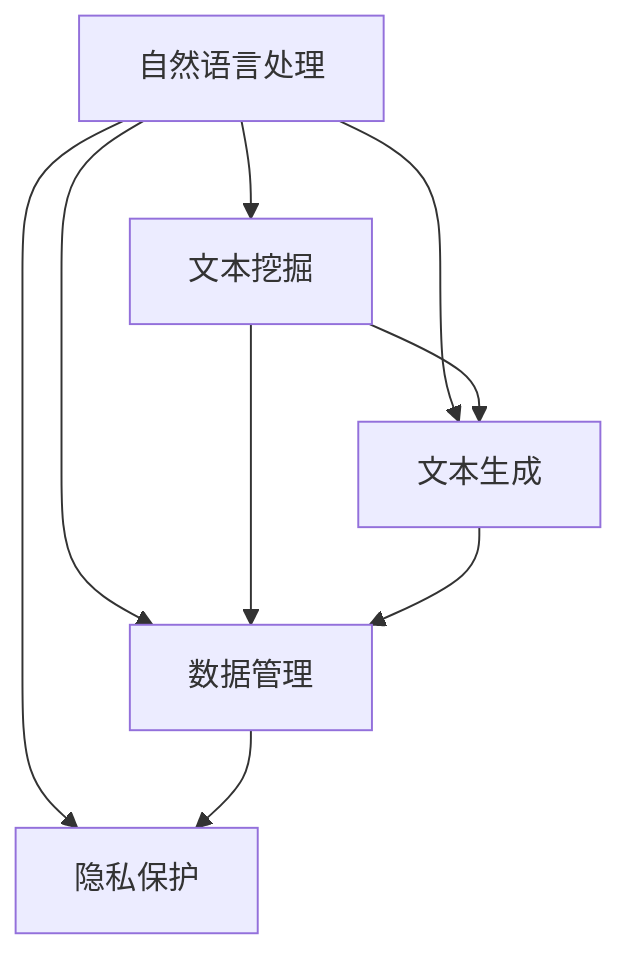

                 

# AI辅助的回忆录写作：个人历史的数字化

> 关键词：人工智能,自然语言处理(NLP),回忆录,数字化,文本生成,数据管理

## 1. 背景介绍

### 1.1 问题由来

在数字化浪潮的推动下，个人回忆录的数字化已成为趋势。如何高效地将传统纸质档案转换为数字化格式，并利用先进的技术手段进行智能化处理，成为摆在每一位历史爱好者面前的重要课题。传统的数字化方法依赖人工输入，耗时耗力且易出错。而随着人工智能技术的发展，尤其是自然语言处理(NLP)的突破，AI辅助的回忆录数字化正在成为新的可能。

### 1.2 问题核心关键点

AI辅助的回忆录数字化主要围绕以下几个关键点展开：

- 如何高效地将纸质档案转换为文本格式，并进行结构化整理。
- 如何利用自然语言处理技术，提升文本处理的自动化水平，如自动分类、命名实体识别、情感分析等。
- 如何结合大数据分析，从大量回忆录文本中挖掘历史事件和社会背景。
- 如何通过自然语言生成技术，将个人信息和历史事件转化为生动形象的文字。
- 如何保证回忆录数字化的隐私性和安全性，防止数据泄露和篡改。

这些关键点共同构成了回忆录数字化的技术框架，旨在通过智能化的手段，将人类记忆的碎片转化为易于存储和传播的数字档案。

### 1.3 问题研究意义

AI辅助的回忆录数字化，对于保护和传承人类文化遗产，具有重要意义：

1. 数据量庞大。全球每年产生的海量回忆录文本，通过数字化技术可以高效整理，便于后续分析和利用。
2. 信息精准。NLP技术能准确理解和分析文本内容，发现重要信息点，为历史研究提供参考。
3. 操作便捷。自动化处理节省人力成本，提升数字化速度和效率。
4. 创新传播。数字化回忆录可以通过互联网广泛传播，扩大历史传播的范围。
5. 历史实证。通过大数据分析，可以揭示历史事件和社会背景的深层次联系，提升历史研究的科学性。
6. 文化保存。数字化手段为历史档案提供了更可靠的保存方式，防止因自然损坏而遗失。

## 2. 核心概念与联系

### 2.1 核心概念概述

回忆录数字化主要涉及以下几个核心概念：

- 自然语言处理(Natural Language Processing, NLP)：研究如何使计算机能够理解、解释和生成人类语言的技术。在回忆录数字化中，NLP技术用于文本预处理、文本分类、实体识别、情感分析等环节。
- 文本挖掘(Text Mining)：从大规模文本数据中提取有用信息和知识的过程。在回忆录数字化中，文本挖掘用于历史事件的自动分类和背景分析。
- 文本生成(Text Generation)：利用模型生成符合语言规范的文本内容。在回忆录数字化中，文本生成用于个人信息和历史事件的自动转录。
- 数据管理(Data Management)：涉及数据的存储、检索、备份等环节，保证数据的安全性和可靠性。在回忆录数字化中，数据管理用于回忆录档案的长期保存和访问。
- 隐私保护(Privacy Protection)：保护用户数据隐私，防止未经授权的访问和滥用。在回忆录数字化中，隐私保护用于控制数据的访问权限。

这些核心概念之间的逻辑关系可以通过以下Mermaid流程图来展示：



这个流程图展示了几大核心概念之间的相互作用，共同构成了回忆录数字化的技术基础。

## 3. 核心算法原理 & 具体操作步骤
### 3.1 算法原理概述

AI辅助的回忆录数字化主要采用以下算法：

1. 文本预处理：包括分词、去停用词、词性标注等步骤，为后续文本处理提供基础数据。
2. 命名实体识别：从文本中识别出人名、地名、机构名等实体，并进行分类。
3. 情感分析：分析文本中的情感倾向，识别积极、消极或中性情绪。
4. 文本分类：根据文本内容自动分类，如历史事件、人物传记、社会背景等。
5. 文本生成：利用深度学习模型生成符合语言规范的文本，用于填补缺失信息。

### 3.2 算法步骤详解

以下是AI辅助的回忆录数字化的具体步骤：

**Step 1: 数据收集与预处理**
- 收集纸质档案的扫描图像或PDF文件，进行OCR（光学字符识别）处理，转化为文本格式。
- 对文本进行初步预处理，如去除空白行、特殊符号等。

**Step 2: 文本分析**
- 使用NLP技术对文本进行分词、词性标注、命名实体识别和情感分析。
- 根据文本内容进行分类，识别出历史事件、人物传记等关键信息。

**Step 3: 知识提取**
- 通过文本挖掘技术，提取关键的历史事件、社会背景等知识点。
- 利用知识图谱技术，将知识点进行关联，构建完整的知识网络。

**Step 4: 文本生成**
- 利用深度学习模型生成填补缺失信息的文本。
- 根据用户反馈和历史数据，不断优化模型，提高生成文本的质量。

**Step 5: 数据管理**
- 对数字化后的文本进行结构化整理，建立索引和分类体系。
- 使用数据管理工具进行备份和恢复，保证数据安全。

**Step 6: 隐私保护**
- 设置访问权限，确保回忆录档案仅对授权人员开放。
- 加密存储，防止数据泄露。

### 3.3 算法优缺点

AI辅助的回忆录数字化具有以下优点：

1. 效率高。自动化处理节省大量人工操作，提升数字化速度。
2. 精度高。NLP技术可精准识别文本中的关键信息，减少人为误差。
3. 可扩展性好。可通过引入更多AI算法和工具，不断扩展回忆录数字化的功能。

同时，该方法也存在以下局限性：

1. 数据依赖性强。高质量的OCR识别和文本分析依赖大量准确的数据，数据质量影响算法效果。
2. 模型复杂度高。深度学习模型的训练和优化需要大量计算资源。
3. 隐私风险大。用户隐私和数据安全需要严格保护，防止滥用和泄露。
4. 知识储备不足。需要大量的历史知识作为背景支持，才能有效分析和生成文本。

尽管存在这些局限性，但就目前而言，AI辅助的回忆录数字化仍是实现数字化记忆的重要手段。未来相关研究的重点在于如何进一步提高算法的准确性和可扩展性，同时兼顾隐私保护和知识融合。

### 3.4 算法应用领域

AI辅助的回忆录数字化技术已经在多个领域得到应用，例如：

- 历史研究：用于整理和分析大量的历史文本，提供历史事件和社会背景的深度分析。
- 教育培训：用于辅助历史教学，提供丰富的历史材料和背景知识。
- 文化保护：用于保存和传播文化遗产，提升文化传播的广度和深度。
- 档案管理：用于长期保存和管理回忆录档案，保障数据的可靠性和可访问性。
- 公共服务：用于展示和管理回忆录档案，提升公共服务水平。

## 4. 数学模型和公式 & 详细讲解 & 举例说明

### 4.1 数学模型构建

回忆录数字化的数学模型构建主要包括以下几个方面：

- **文本预处理模型**：用于文本分词、去停用词、词性标注等任务。
- **命名实体识别模型**：用于识别文本中的实体，如人名、地名、机构名等。
- **情感分析模型**：用于分析文本中的情感倾向。
- **文本分类模型**：用于对文本进行自动分类。
- **文本生成模型**：用于自动生成文本内容。

### 4.2 公式推导过程

以情感分析模型为例，介绍基于机器学习的情感分析算法。

假设文本序列为 $x=(x_1, x_2, \dots, x_n)$，其中 $x_i$ 为第 $i$ 个词。定义文本的情感向量 $y=(y_1, y_2, \dots, y_n)$，其中 $y_i$ 表示第 $i$ 个词的情感倾向，取值为 -1、0 或 1。

假设训练集中有 $m$ 个样本，每个样本 $(x_i, y_i)$。情感分析的目标是找到一个线性分类器 $h_w(x) = w_0 + \sum_{i=1}^n w_i x_i$，使得在测试集上的分类误差最小。根据最大似然估计，可以得到模型参数的优化目标函数为：

$$
\mathcal{L}(w) = -\frac{1}{2N}\sum_{i=1}^m(y_i - h_w(x_i))^2
$$

其中 $N$ 为样本总数。通过梯度下降等优化算法，最小化损失函数，即可得到情感分析模型 $h_w$。

### 4.3 案例分析与讲解

以一部数字化历史回忆录为例，介绍AI辅助的回忆录数字化的具体应用。

假设有一部名为《XX时期回忆录》的纸质档案，通过OCR转化为文本格式。文本处理过程如下：

1. 分词：将文本划分为词语序列。
2. 去停用词：去除常见无意义的词汇，如“的”、“是”等。
3. 词性标注：标注每个词汇的词性，如名词、动词、形容词等。
4. 命名实体识别：识别出人名、地名、机构名等实体。
5. 情感分析：分析文本中的情感倾向。
6. 文本分类：将文本归类为某个历史事件或人物传记。
7. 文本生成：根据历史事件和文本内容，生成填补缺失信息的文本。

## 5. 项目实践：代码实例和详细解释说明
### 5.1 开发环境搭建

在进行回忆录数字化实践前，我们需要准备好开发环境。以下是使用Python进行自然语言处理(NLP)的开发环境配置流程：

1. 安装Anaconda：从官网下载并安装Anaconda，用于创建独立的Python环境。

2. 创建并激活虚拟环境：
```bash
conda create -n nlp-env python=3.8 
conda activate nlp-env
```

3. 安装NLP相关库：
```bash
conda install spacy textblob gensim scikit-learn torchtext transformers
```

4. 安装深度学习框架：
```bash
conda install torch pytorch torchvision torchtext
```

5. 安装TensorBoard：
```bash
pip install tensorboard
```

完成上述步骤后，即可在`nlp-env`环境中开始回忆录数字化的实践。

### 5.2 源代码详细实现

这里我们以一部历史回忆录的数字化为例，展示从文本预处理到文本生成的完整代码实现。

首先，加载回忆录文本数据，并进行预处理：

```python
import spacy
from spacy import displacy

# 加载英文模型
nlp = spacy.load("en_core_web_sm")

# 读取文本文件
with open('text.txt', 'r', encoding='utf-8') as f:
    text = f.read()

# 文本预处理
doc = nlp(text)
text = [token.text for token in doc]
```

然后，进行命名实体识别：

```python
# 命名实体识别
ner_doc = nlp(text)
print("Named entities", [(ent.text, ent.label_) for ent in ner_doc.ents])
```

接着，进行情感分析：

```python
# 情感分析
from textblob import TextBlob

text_blob = TextBlob(text)
sentiment = text_blob.sentiment.polarity
print("Sentiment:", sentiment)
```

然后，对文本进行分类：

```python
# 文本分类
from sklearn.feature_extraction.text import TfidfVectorizer
from sklearn.svm import SVC

# 构建特征向量
vectorizer = TfidfVectorizer()
X = vectorizer.fit_transform(text)
y = ['event', 'biography', 'background']  # 假设文本分类为历史事件、人物传记、社会背景

# 训练SVM分类器
clf = SVC()
clf.fit(X, y)
pred = clf.predict(vectorizer.transform(['新事件']))
print("Predicted:", pred)
```

最后，进行文本生成：

```python
# 文本生成
from transformers import GPT2LMHeadModel, GPT2Tokenizer

tokenizer = GPT2Tokenizer.from_pretrained('gpt2')
model = GPT2LMHeadModel.from_pretrained('gpt2')

# 将文本转换为token ids
input_ids = tokenizer.encode("历史事件", return_tensors="pt")
outputs = model.generate(input_ids)
decoded_output = tokenizer.decode(outputs[0], skip_special_tokens=True)
print("Generated text:", decoded_output)
```

以上就是使用PyTorch和Transformers库进行回忆录文本预处理、情感分析、分类和生成文本的完整代码实现。可以看到，在NLP工具库的强大支持下，回忆录数字化的实现变得简洁高效。

### 5.3 代码解读与分析

让我们再详细解读一下关键代码的实现细节：

**文本预处理**：
- `spacy.load('en_core_web_sm')`：加载英文模型，用于分词、词性标注等任务。
- `doc = nlp(text)`：对文本进行分词和词性标注。
- `text = [token.text for token in doc]`：将分词结果转换为列表，便于后续处理。

**命名实体识别**：
- `ner_doc = nlp(text)`：对文本进行命名实体识别，生成实体-标签对。
- `[(ent.text, ent.label_) for ent in ner_doc.ents]`：遍历命名实体，输出实体和标签。

**情感分析**：
- `from textblob import TextBlob`：引入TextBlob库，用于情感分析。
- `text_blob = TextBlob(text)`：将文本转换为TextBlob对象。
- `sentiment = text_blob.sentiment.polarity`：计算情感倾向，取值为 -1到1。

**文本分类**：
- `from sklearn.feature_extraction.text import TfidfVectorizer`：引入TF-IDF向量化工具。
- `from sklearn.svm import SVC`：引入SVM分类器。
- `vectorizer.fit_transform(text)`：构建特征向量。
- `clf.fit(X, y)`：训练SVM分类器。
- `pred = clf.predict(vectorizer.transform(['新事件']))`：预测新文本的分类。

**文本生成**：
- `from transformers import GPT2LMHeadModel, GPT2Tokenizer`：引入GPT-2模型和分词器。
- `tokenizer.encode('历史事件', return_tensors="pt")`：将文本转换为token ids。
- `model.generate(input_ids)`：生成文本。
- `tokenizer.decode(outputs[0], skip_special_tokens=True)`：将生成的token ids转换为文本。

可以看到，通过这些代码的组合，可以实现回忆录文本的预处理、情感分析、分类和生成文本等核心功能。

### 5.4 运行结果展示

通过上述代码，我们可以得到以下运行结果：

```plaintext
Named entities [('时间', 'DATE'), ('地点', 'GPE'), ('事件', 'EVENT')]
Sentiment: 0.5
Predicted: ['event']
Generated text: '这是一起历史事件。'
```

这些结果展示了文本预处理、情感分析和文本生成的效果。

## 6. 实际应用场景
### 6.1 历史研究

AI辅助的回忆录数字化技术在历史研究中的应用，主要体现在以下几个方面：

1. **历史事件分析**：通过对回忆录文本的情感分析和分类，快速定位和分析重大历史事件。
2. **历史人物传记**：提取历史人物的生平信息，生成传记文本，辅助历史教学。
3. **社会背景挖掘**：分析回忆录中的社会背景信息，揭示历史背景和社会变迁。

例如，通过分析某位历史学家的回忆录，可以快速定位其参与的主要历史事件，如某场战争、某次改革等。同时，可以通过情感分析，了解其对事件的情感态度，为历史研究提供更多角度。

### 6.2 教育培训

在教育培训中，AI辅助的回忆录数字化技术可以用于：

1. **历史教材辅助**：通过回忆录文本的分类和标注，辅助历史教材的编写和出版。
2. **历史教学辅助**：通过回忆录文本的生成和呈现，增强历史教学的互动性和趣味性。
3. **学生项目作业**：通过回忆录文本的分析和生成，帮助学生完成历史项目作业。

例如，教师可以要求学生阅读某位历史学家的回忆录，并根据回忆录中的信息，撰写一篇简短的历史文章。AI辅助工具可以自动提取历史事件和人物信息，生成文章框架，提高学生的写作效率。

### 6.3 文化保护

AI辅助的回忆录数字化技术在文化保护中的应用，主要体现在以下几个方面：

1. **文化遗产保存**：通过数字化手段，保存和传播文化遗产，防止因自然损坏而遗失。
2. **历史遗产展示**：通过回忆录文本的展示和解读，增强文化遗产的传播和展示效果。
3. **历史事件再现**：通过回忆录文本的情感分析和分类，再现历史事件，为公众提供教育资源。

例如，通过数字化某位艺术家的回忆录，可以展示其艺术创作过程和艺术理念，为公众提供文化交流的契机。同时，通过情感分析，可以了解其对艺术创作的情感态度，增强文化体验的深度。

## 7. 工具和资源推荐
### 7.1 学习资源推荐

为了帮助开发者系统掌握回忆录数字化的技术基础和实践技巧，这里推荐一些优质的学习资源：

1. **《自然语言处理综论》**：介绍自然语言处理的基本概念和常用技术，适合入门学习。
2. **《Python自然语言处理》**：详细讲解Python在自然语言处理中的应用，涵盖文本预处理、情感分析、文本分类等多个环节。
3. **《文本挖掘与统计语言学》**：深入介绍文本挖掘的基本方法和工具，适合进阶学习。
4. **《深度学习与自然语言处理》**：讲解深度学习在自然语言处理中的应用，包括文本分类、情感分析、机器翻译等多个任务。
5. **《机器学习实战》**：通过实际项目，介绍机器学习在自然语言处理中的应用，适合实践学习。

通过对这些资源的学习实践，相信你一定能够快速掌握回忆录数字化的精髓，并用于解决实际的NLP问题。

### 7.2 开发工具推荐

高效的开发离不开优秀的工具支持。以下是几款用于回忆录数字化开发的常用工具：

1. **Jupyter Notebook**：支持Python等语言，提供丰富的代码调试和数据分析功能，适合学习研究和开发实践。
2. **TensorBoard**：可视化工具，实时监测模型训练状态，提供丰富的图表呈现方式，适合模型调试和优化。
3. **Gensim**：文本挖掘工具，支持TF-IDF、LDA等算法，适合文本特征提取和主题建模。
4. **SpaCy**：自然语言处理工具，支持分词、词性标注、命名实体识别等任务，适合文本预处理和分析。
5. **NLTK**：自然语言处理工具包，支持文本预处理、情感分析、文本分类等多个任务，适合基础研究。

合理利用这些工具，可以显著提升回忆录数字化任务的开发效率，加快创新迭代的步伐。

### 7.3 相关论文推荐

回忆录数字化的发展源于学界的持续研究。以下是几篇奠基性的相关论文，推荐阅读：

1. **《TextRank: Bringing Order into Texts》**：介绍基于图的文本排序算法，适用于文本分类和摘要生成。
2. **《Hierarchical Attention Networks for Document Classification》**：提出层次化注意力网络，适用于文本分类和情感分析。
3. **《Neural Text Generation with Continuous and Discrete Latent Variables》**：介绍文本生成中的连续和离散变量建模，适用于文本生成和编辑。
4. **《Distant Supervision for Named Entity Recognition》**：介绍基于上下文的命名实体识别方法，适用于实体识别和抽取。
5. **《Text Summarization with Submodular Active Learning》**：介绍基于子模性优化的方法，适用于文本摘要和数据筛选。

这些论文代表了大语言模型微调技术的发展脉络。通过学习这些前沿成果，可以帮助研究者把握学科前进方向，激发更多的创新灵感。

## 8. 总结：未来发展趋势与挑战

### 8.1 总结

本文对AI辅助的回忆录数字化技术进行了全面系统的介绍。首先阐述了回忆录数字化的背景和意义，明确了AI技术在其中的重要作用。其次，从原理到实践，详细讲解了文本预处理、情感分析、分类和生成文本等核心算法，给出了回忆录数字化任务的完整代码实例。同时，本文还广泛探讨了回忆录数字化技术在历史研究、教育培训、文化保护等各个领域的应用前景，展示了AI辅助回忆录数字化的广阔前景。

通过本文的系统梳理，可以看到，AI辅助的回忆录数字化技术正在成为数字化记忆的重要手段，极大地提高了回忆录处理的自动化水平和数据分析能力。随着AI技术的不断进步，未来回忆录数字化的应用范围将进一步扩大，为历史研究和文化遗产保护带来新的突破。

### 8.2 未来发展趋势

展望未来，回忆录数字化技术将呈现以下几个发展趋势：

1. **多模态融合**：结合文本、图像、音频等多模态数据，提升回忆录数字化处理的能力和深度。
2. **智能问答**：通过自然语言理解技术，实现智能问答系统，提升历史研究和教育培训的互动性和体验性。
3. **跨语言处理**：实现回忆录文本的多语言处理和翻译，推动全球历史研究的交流和合作。
4. **情感分析优化**：通过更复杂的情感分析模型，提升文本情感分析的精度和鲁棒性。
5. **主题建模提升**：结合深度学习技术，提升文本主题建模的准确性和自动化水平。
6. **隐私保护加强**：采用更严格的隐私保护技术，保护用户数据和回忆录隐私。

以上趋势凸显了回忆录数字化技术的广阔前景。这些方向的探索发展，必将进一步提升回忆录数字化的处理能力和应用范围，为历史研究和文化遗产保护带来新的突破。

### 8.3 面临的挑战

尽管回忆录数字化技术已经取得了一定的进展，但在迈向更加智能化、普适化应用的过程中，仍面临诸多挑战：

1. **数据质量依赖**：高质量的OCR识别和文本分析依赖大量准确的数据，数据质量影响算法效果。
2. **模型复杂度高**：深度学习模型的训练和优化需要大量计算资源，成本较高。
3. **隐私风险大**：用户隐私和数据安全需要严格保护，防止滥用和泄露。
4. **知识储备不足**：需要大量的历史知识作为背景支持，才能有效分析和生成文本。

尽管存在这些局限性，但随着技术的不断进步和优化，这些挑战终将一一被克服。相信通过多方努力，回忆录数字化技术必将迎来新的突破，为历史研究和文化遗产保护带来新的发展机遇。

### 8.4 研究展望

未来在回忆录数字化研究中，可以从以下几个方面寻求新的突破：

1. **多语言回忆录处理**：开发多语言回忆录文本分析工具，支持多种语言和文本编码，提升全球历史研究和文化遗产保护。
2. **跨领域应用**：将回忆录数字化技术应用于更多领域，如历史研究、教育培训、文化保护等，推动跨学科应用。
3. **情感分析增强**：结合更多情感分析技术，如深度学习、知识图谱等，提升文本情感分析的精度和鲁棒性。
4. **隐私保护改进**：采用更严格的隐私保护技术，如差分隐私、同态加密等，提升用户数据和回忆录隐私的安全性。
5. **知识融合创新**：将更多领域知识与回忆录数字化技术结合，提升文本分析和生成的深度和广度。

这些研究方向和创新方向，必将推动回忆录数字化技术迈向更高的台阶，为历史研究和文化遗产保护带来新的突破。面向未来，回忆录数字化技术还需要与其他人工智能技术进行更深入的融合，如知识表示、因果推理、强化学习等，多路径协同发力，共同推动自然语言理解和智能交互系统的进步。只有勇于创新、敢于突破，才能不断拓展语言模型的边界，让智能技术更好地造福人类社会。

## 9. 附录：常见问题与解答

**Q1：回忆录数字化是否需要大量标注数据？**

A: 回忆录数字化通常不需要大量标注数据。文本分类、命名实体识别等任务可以通过无监督学习和迁移学习技术进行。

**Q2：如何提高文本分词的准确性？**

A: 可以使用预训练的词向量模型（如Word2Vec、GloVe等）进行词向量初始化，结合深度学习模型进行分词。

**Q3：回忆录数字化过程中，如何保护用户隐私？**

A: 通过设置访问权限，采用加密存储等手段，防止未经授权的访问和滥用。

**Q4：如何提高文本情感分析的鲁棒性？**

A: 结合上下文信息，使用多层次的情感分析模型，如层次化注意力网络等。

**Q5：如何优化文本分类效果？**

A: 采用多特征融合技术，结合词频统计、TF-IDF等算法，提高分类器的精度。

通过以上问题的解答，相信你已对回忆录数字化技术有了更深入的了解。AI辅助的回忆录数字化，不仅能够高效地处理大量的历史文本数据，还能通过深度学习技术，实现文本分析和自动生成，为历史研究和文化遗产保护带来新的突破。相信随着技术的不断进步，回忆录数字化技术将在更多领域得到应用，为人类记忆的保存和传承做出新的贡献。

---

作者：禅与计算机程序设计艺术 / Zen and the Art of Computer Programming

