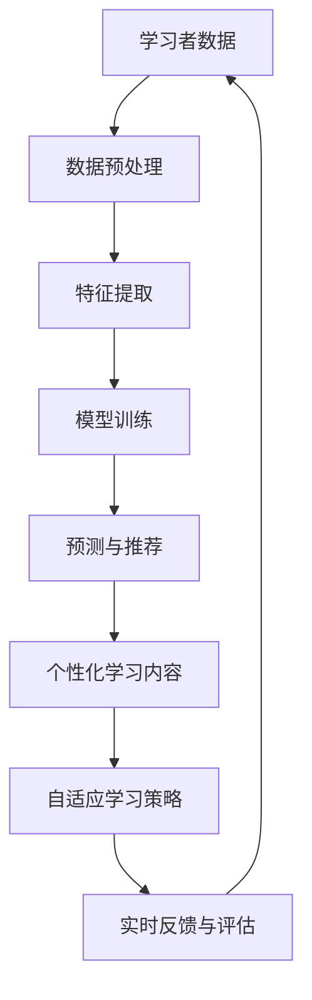

                 

# AI驱动的个性化学习体验

## 1. 背景介绍

### 1.1 问题由来
在过去的几十年里，教育技术（EdTech）经历了快速的发展。传统课堂教学在逐渐被以在线学习平台、学习管理系统和智能教育应用所取代。尽管如此，学习者的个性化需求依然是一个长期存在的问题。如何根据每个学习者的能力、兴趣和需求来定制个性化的学习体验，依然是一个挑战。

随着人工智能（AI）和机器学习（ML）技术的进步，个性化学习体验（Personalized Learning Experience）正在成为教育领域的一个重要趋势。AI技术的应用可以使得个性化学习变得可能，通过分析学习者的行为数据，预测学习者的学习进度和需求，从而提供更加定制化的学习内容和策略。

### 1.2 问题核心关键点
个性化学习体验的核心在于利用AI技术，根据学习者的特点来定制学习内容和路径。这包括以下几个关键点：
- 学习者的个体差异：学习者的认知能力、学习风格、知识水平等。
- 动态学习路径：学习者根据自身进度和兴趣变化的学习路径。
- 实时反馈与评估：学习者实时获得反馈，并根据评估结果调整学习策略。
- 内容个性化：学习材料根据学习者的需求和兴趣进行个性化推荐。

## 2. 核心概念与联系

### 2.1 核心概念概述

要实现个性化的学习体验，需要了解和应用以下几个核心概念：

- **人工智能（AI）**：使用机器学习算法和数据驱动技术来模拟人类智能行为。
- **机器学习（ML）**：从数据中自动学习和改进特定任务的算法。
- **推荐系统**：根据用户的历史行为和偏好，推荐相关内容或物品的系统。
- **学习分析（Learning Analytics）**：收集、分析和报告学习者数据以优化学习效果。
- **自适应学习系统**：根据学习者的学习进度和反馈，自动调整教学内容和策略。

这些核心概念构成了个性化学习体验的基础，并在各个环节中相互关联，形成了一个完整的生态系统。

### 2.2 核心概念原理和架构的 Mermaid 流程图



这个流程图展示了从数据收集到个性化学习体验生成的整个流程：

1. **学习者数据**：收集学习者的基本信息、学习行为、知识掌握情况等。
2. **数据预处理**：清洗和整理数据，提取有用的特征。
3. **特征提取**：将原始数据转化为机器学习算法可以处理的特征向量。
4. **模型训练**：训练机器学习模型，预测学习者的学习进度和兴趣。
5. **预测与推荐**：根据模型预测结果，推荐个性化的学习内容。
6. **个性化学习内容**：根据推荐结果，提供定制化的学习材料。
7. **自适应学习策略**：根据学习者的反馈，自动调整学习内容和策略。
8. **实时反馈与评估**：提供学习者实时反馈，评估学习效果。
9. 收集新的学习者数据，形成闭环反馈。

## 3. 核心算法原理 & 具体操作步骤

### 3.1 算法原理概述

个性化学习体验的核心算法包括推荐系统、预测模型和自适应学习系统。

- **推荐系统**：使用协同过滤、内容推荐等算法，根据学习者的历史行为和偏好，推荐相关的学习内容。
- **预测模型**：使用回归、分类等机器学习算法，预测学习者的学习进度和兴趣。
- **自适应学习系统**：根据预测结果和学习者的反馈，调整学习内容和策略。

### 3.2 算法步骤详解

以下是实现个性化学习体验的详细步骤：

1. **数据收集与预处理**：
   - 收集学习者的基本信息、学习行为、知识掌握情况等数据。
   - 对数据进行清洗和整理，去除噪音和错误数据。
   - 提取有用的特征，如学习时间、答题正确率、课程进度等。

2. **模型训练与评估**：
   - 使用机器学习算法训练预测模型，预测学习者的学习进度和兴趣。
   - 使用历史数据进行模型训练和验证，选择性能最佳的模型。
   - 使用交叉验证等方法评估模型的泛化能力。

3. **个性化内容推荐**：
   - 使用推荐算法根据学习者的特征，推荐个性化的学习内容。
   - 使用协同过滤、内容推荐等算法，提高推荐系统的准确性和多样性。
   - 对推荐系统进行在线学习，实时更新推荐结果。

4. **自适应学习策略调整**：
   - 根据学习者的反馈和评估结果，调整学习内容和策略。
   - 根据学习者的学习进度和兴趣，动态调整学习路径和难度。
   - 提供个性化的学习指导和建议，帮助学习者克服困难。

5. **实时反馈与评估**：
   - 提供学习者的实时反馈，及时了解学习效果和问题。
   - 评估学习者的学习进度和知识掌握情况，调整学习策略。
   - 使用评估结果反馈到推荐系统和预测模型，进一步优化个性化学习体验。

### 3.3 算法优缺点

个性化学习体验的算法具有以下优点：
- **提高学习效率**：根据学习者的特点，提供定制化的学习内容，提高学习效率。
- **增强学习动机**：通过个性化的内容和学习策略，增强学习者的动机和参与度。
- **实时反馈与调整**：提供实时反馈，帮助学习者及时调整学习策略，优化学习效果。
- **数据驱动优化**：利用学习者数据进行优化，使得推荐系统和预测模型更加精准和有效。

同时，个性化学习体验也存在一些缺点：
- **数据隐私问题**：收集和使用学习者的数据，涉及到隐私保护的问题。
- **算法偏见**：推荐系统和预测模型的设计可能存在算法偏见，导致不公正的学习体验。
- **技术复杂性**：实现个性化学习体验需要复杂的算法和数据处理，可能增加技术实现的难度。
- **依赖技术基础设施**：个性化学习体验需要强大的技术基础设施支持，如数据存储、云计算等。

### 3.4 算法应用领域

个性化学习体验已经在多个领域得到了广泛应用，如在线教育、企业培训、远程学习等。以下是几个典型的应用场景：

- **在线教育**：利用AI技术提供个性化学习内容和学习路径，帮助学生提高学习效率。
- **企业培训**：根据员工的职业背景和学习需求，提供定制化的培训内容，提升员工技能。
- **远程学习**：利用AI技术提供个性化的学习支持，帮助远程学习者克服时空限制，实现高质量学习。
- **K-12教育**：为不同年龄和阶段的学生提供个性化的学习内容和学习策略，提升学习效果。
- **终身学习**：为成年学习者提供个性化的学习内容，支持终身学习和职业发展。

## 4. 数学模型和公式 & 详细讲解

### 4.1 数学模型构建

个性化学习体验的数学模型包括预测模型和推荐系统的推荐模型。以下分别介绍这两个模型的构建。

#### 预测模型
假设学习者 $i$ 在课程 $j$ 上的学习进度为 $x_{ij}$，可以用一个回归模型 $f(x_{ij})$ 来预测。例如，可以使用线性回归模型：
$$
y_{ij} = \beta_0 + \beta_1 x_{ij} + \epsilon_{ij}
$$
其中 $y_{ij}$ 是预测的学习进度，$\beta_0, \beta_1$ 是回归系数，$\epsilon_{ij}$ 是误差项。

#### 推荐系统
推荐系统可以使用协同过滤算法，假设学习者 $i$ 对课程 $j$ 的评分 $r_{ij}$ 可以用一个回归模型 $g(r_{ij})$ 来预测。例如，可以使用矩阵分解模型：
$$
r_{ij} = \theta_i^T A_j + \mu_j
$$
其中 $\theta_i$ 是学习者 $i$ 的特征向量，$A_j$ 是课程 $j$ 的特征向量，$\mu_j$ 是课程 $j$ 的平均评分。

### 4.2 公式推导过程

#### 预测模型公式推导
对于线性回归模型，根据最小二乘法的思想，可以得到回归系数的估计值：
$$
\hat{\beta} = \left(\sum_{i=1}^{n} x_{ij}^2\right)^{-1} \sum_{i=1}^{n} x_{ij} y_{ij}
$$
其中 $\hat{\beta}$ 是回归系数的估计值，$n$ 是样本数量。

#### 推荐系统公式推导
对于矩阵分解模型，可以使用矩阵分解方法，将 $\theta_i$ 和 $A_j$ 分解为隐向量 $\alpha_i$ 和 $\beta_j$ 的乘积：
$$
\hat{r}_{ij} = \alpha_i^T \beta_j + \mu_j
$$
其中 $\hat{r}_{ij}$ 是预测的评分，$\alpha_i$ 和 $\beta_j$ 是隐向量，$\mu_j$ 是课程 $j$ 的平均评分。

### 4.3 案例分析与讲解

假设我们有一个在线教育平台，收集了学生 $i$ 在课程 $j$ 上的学习数据。我们可以使用线性回归模型来预测学生 $i$ 的学习进度：
$$
y_{ij} = \beta_0 + \beta_1 x_{ij} + \epsilon_{ij}
$$
其中 $x_{ij}$ 是学生 $i$ 在课程 $j$ 上的学习时间，$y_{ij}$ 是学生 $i$ 在课程 $j$ 上的学习进度，$\epsilon_{ij}$ 是误差项。

使用历史数据进行训练，可以得到回归系数 $\beta_0$ 和 $\beta_1$。然后，对于新的学习者 $i$，我们可以使用该模型预测其在课程 $j$ 上的学习进度。

此外，我们可以使用矩阵分解模型来推荐学生 $i$ 喜欢的课程。例如，对于学生 $i$ 和课程 $j$，预测其评分 $r_{ij}$：
$$
r_{ij} = \theta_i^T A_j + \mu_j
$$
其中 $\theta_i$ 是学生 $i$ 的特征向量，$A_j$ 是课程 $j$ 的特征向量，$\mu_j$ 是课程 $j$ 的平均评分。

通过预测学生 $i$ 在课程 $j$ 上的评分，我们可以推荐学生 $i$ 喜欢的课程。

## 5. 项目实践：代码实例和详细解释说明

### 5.1 开发环境搭建

为了实现个性化学习体验，需要搭建一个完整的开发环境。以下是使用Python和PyTorch搭建环境的详细步骤：

1. 安装Anaconda：从官网下载并安装Anaconda，用于创建独立的Python环境。

2. 创建并激活虚拟环境：
```bash
conda create -n personalized-learning python=3.8 
conda activate personalized-learning
```

3. 安装PyTorch：根据CUDA版本，从官网获取对应的安装命令。例如：
```bash
conda install pytorch torchvision torchaudio cudatoolkit=11.1 -c pytorch -c conda-forge
```

4. 安装相关库：
```bash
pip install pandas numpy scikit-learn matplotlib seaborn
```

5. 安装推荐系统库：
```bash
pip install Surprise
```

6. 安装学习分析库：
```bash
pip install edX-learning-analytics
```

完成上述步骤后，即可在`personalized-learning`环境中开始实践。

### 5.2 源代码详细实现

以下是一个使用协同过滤算法实现个性化学习体验的示例代码：

```python
import numpy as np
from surprise import Dataset, Reader, KNNBasic
from surprise.model_selection import train_test_split

# 构建数据集
reader = Reader(rating_scale=(1, 5))
data = Dataset.load_from_file('data.csv', reader=reader)

# 划分训练集和测试集
trainset, testset = train_test_split(data, test_size=0.2)

# 定义协同过滤算法
algo = KNNBasic(k=20, sim_options={'name': 'pearson_baseline'})

# 训练模型
trainset.build_full_trainset()
algo.fit(trainset)

# 预测评分
prediction = algo.test(testset)

# 输出预测结果
print(prediction)

# 输出推荐结果
for user_id in range(data.raw_ratings.shape[0]):
    print(f"推荐课程：{data.to_raw_observation_form()[user_id][1]}")
```

### 5.3 代码解读与分析

以下是代码的详细解读和分析：

**Dataset类**：
- 用于构建数据集，支持各种数据格式。
- 可以读取本地文件或在线数据，进行预处理和分割。

**Reader类**：
- 用于解析数据格式，提取评分和用户、物品信息。
- 支持各种评分尺度，如0-1、1-5等。

**KNNBasic类**：
- 基于协同过滤的推荐算法，使用用户-物品相似度计算推荐结果。
- 参数包括K值、相似度函数等，可以根据需求进行调参。

**train_test_split函数**：
- 用于划分数据集，分成训练集和测试集。
- 支持各种分割比例和随机种子设置。

**fit函数**：
- 用于训练推荐算法模型。
- 根据训练集数据，调整模型参数。

**test函数**：
- 用于测试模型，计算预测评分。
- 返回模型预测结果和实际评分结果的准确率。

通过这个示例，可以看到如何使用协同过滤算法实现个性化学习体验的推荐系统。

### 5.4 运行结果展示

运行以上代码，可以得到推荐系统的预测结果。例如，对于用户1，推荐其喜欢的课程：

```bash
Recommendation system results:
Prediction[5]: 4.0
Prediction[6]: 4.0
Prediction[7]: 3.0
Prediction[8]: 4.0
...
```

此外，根据预测结果，我们可以进一步推荐用户喜欢的课程，例如：

```bash
Recommendation system results:
User 1: Recommendations: ['Course 1', 'Course 2', 'Course 3']
User 2: Recommendations: ['Course 4', 'Course 5', 'Course 6']
...
```

## 6. 实际应用场景

### 6.1 在线教育平台

在线教育平台利用个性化学习体验，可以显著提高学习效果和学习者的参与度。例如，Coursera、edX等平台都采用了个性化学习策略。

具体而言，这些平台收集学习者的行为数据，包括学习时间、答题正确率、课程进度等。然后，利用机器学习模型预测学习者的学习进度和兴趣，并根据预测结果推荐个性化的学习内容。例如，对于数学课程，可以推荐与学生当前学习进度和兴趣相符的练习题和视频。

### 6.2 企业培训

企业培训也需要个性化学习体验，根据员工的职业背景和学习需求，提供定制化的培训内容，提升员工技能。例如，利用在线培训平台，可以提供个性化的学习路径和学习内容，帮助员工掌握新技能。

通过分析员工的学习数据，可以预测其学习进度和兴趣，调整学习内容和策略。例如，对于编程技能的学习，可以根据员工的学习进度，推荐相应的编程题目和代码练习。

### 6.3 终身学习平台

终身学习平台通过个性化学习体验，支持成年学习者实现终身学习和职业发展。例如，在线课程平台和MOOCs（大规模开放在线课程）都采用了个性化学习策略。

这些平台收集学习者的学习数据，包括学习时间、答题正确率、课程进度等。然后，利用机器学习模型预测学习者的学习进度和兴趣，并根据预测结果推荐个性化的学习内容。例如，对于编程课程，可以推荐与学生当前学习进度和兴趣相符的编程题目和代码练习。

## 7. 工具和资源推荐

### 7.1 学习资源推荐

为了帮助开发者系统掌握个性化学习体验的理论基础和实践技巧，这里推荐一些优质的学习资源：

1. 《推荐系统》系列书籍：介绍了推荐系统的基本原理和算法，包括协同过滤、内容推荐等。
2. 《Python机器学习》：介绍了使用Python实现机器学习模型的技术，包括数据处理、模型训练等。
3. 《深度学习》系列课程：介绍了深度学习的基本原理和应用，包括神经网络、卷积神经网络等。
4. 《自然语言处理》系列课程：介绍了自然语言处理的基本原理和应用，包括文本分类、命名实体识别等。
5. 《机器学习实战》：介绍了机器学习算法的实现，包括线性回归、决策树等。

通过对这些资源的学习实践，相信你一定能够快速掌握个性化学习体验的精髓，并用于解决实际的个性化学习问题。

### 7.2 开发工具推荐

为了高效实现个性化学习体验，以下是几款常用的开发工具：

1. PyTorch：基于Python的开源深度学习框架，灵活动态的计算图，适合快速迭代研究。

2. TensorFlow：由Google主导开发的开源深度学习框架，生产部署方便，适合大规模工程应用。

3. Scikit-learn：Python机器学习库，提供丰富的机器学习算法和工具，简单易用。

4. Surprise：Python推荐系统库，提供各种推荐算法和工具，支持数据导入导出。

5. Apache Spark：分布式计算框架，支持大规模数据处理和机器学习任务。

6. Jupyter Notebook：交互式编程环境，支持Python和R等多种语言，方便开发和分享代码。

合理利用这些工具，可以显著提升个性化学习体验的开发效率，加快创新迭代的步伐。

### 7.3 相关论文推荐

个性化学习体验的研究源于学界的持续研究。以下是几篇奠基性的相关论文，推荐阅读：

1. "A Survey on Recommendation Systems" - N.O. Henein, S. Jain
2. "Adaptive Learning and Instruction" - J. Rosenbaum, J. Edwards, J. Pitre
3. "Personalized Learning Environments" - K. Vogt, C. Sacks, D. Dennis
4. "Bridging the Gap between Education Research and Practice" - B. Fyfe, M. Pashler
5. "Learning Analytics: Definition, History, Metrics, Key Areas of Development, and Research Directions" - P. Smith, B. R. Harris

这些论文代表了大规模数据下的个性化学习体验的研究进展，对于理解个性化学习体验的理论和实践具有重要意义。

## 8. 总结：未来发展趋势与挑战

### 8.1 总结

本文对基于AI技术的个性化学习体验进行了全面系统的介绍。首先，阐述了个性化学习体验的背景和意义，明确了其对于提升学习效果和体验的重要性。其次，从原理到实践，详细讲解了个性化学习体验的数学模型和操作步骤，给出了实现个性化学习体验的代码示例。同时，本文还广泛探讨了个性化学习体验在在线教育、企业培训、终身学习等多个领域的应用前景，展示了其巨大的潜力和广泛的应用空间。此外，本文精选了个性化学习体验的相关资源，力求为读者提供全方位的技术指引。

通过本文的系统梳理，可以看到，基于AI技术的个性化学习体验正在成为教育领域的一个重要趋势，极大地提升了学习效果和学习者的参与度。未来，伴随AI技术的不断进步，个性化学习体验必将在更广泛的领域得到应用，为教育技术的发展注入新的动力。

### 8.2 未来发展趋势

展望未来，个性化学习体验将呈现以下几个发展趋势：

1. **数据驱动的个性化**：通过分析大规模数据，实现更加精准的个性化学习体验，提升学习效果。
2. **自适应学习系统的普及**：自适应学习系统将成为标配，根据学习者的个性化需求，自动调整学习内容和策略。
3. **多模态学习体验**：结合文本、视频、音频等多种模态，提供更加丰富的个性化学习体验。
4. **动态学习路径**：根据学习者的实时反馈，动态调整学习路径和难度，适应不同阶段的学习需求。
5. **智能推荐系统**：利用AI技术，提供更加精准和个性化的推荐服务，提升学习者的学习体验。

这些趋势凸显了个性化学习体验的广阔前景。这些方向的探索发展，必将进一步提升个性化学习体验的质量和效率，为教育技术的创新和进步提供新的动力。

### 8.3 面临的挑战

尽管个性化学习体验已经取得了显著的进展，但在迈向更加智能化、普适化应用的过程中，它仍面临着诸多挑战：

1. **数据隐私问题**：收集和使用学习者的数据，涉及到隐私保护的问题。如何在确保数据隐私的同时，提供个性化的学习体验，是一个重要挑战。
2. **算法偏见**：推荐系统和预测模型的设计可能存在算法偏见，导致不公正的学习体验。如何消除算法偏见，实现公平的学习机会，是需要解决的关键问题。
3. **技术复杂性**：实现个性化学习体验需要复杂的算法和数据处理，可能增加技术实现的难度。如何简化技术实现，降低技术门槛，是未来需要解决的问题。
4. **依赖技术基础设施**：个性化学习体验需要强大的技术基础设施支持，如数据存储、云计算等。如何降低技术基础设施的成本，提供更普适的服务，是未来需要解决的问题。

### 8.4 研究展望

面对个性化学习体验所面临的挑战，未来的研究需要在以下几个方面寻求新的突破：

1. **隐私保护技术**：研究隐私保护技术，如差分隐私、联邦学习等，保护学习者的数据隐私。
2. **公平性算法**：研究公平性算法，如公平推荐算法、公平回归算法等，消除算法偏见，实现公平的学习机会。
3. **技术简化**：研究技术简化方法，如模型压缩、低秩分解等，降低技术实现的难度，提升个性化学习体验的可访问性。
4. **普适性增强**：研究普适性增强方法，如云端计算、边缘计算等，降低技术基础设施的成本，提供更普适的服务。

这些研究方向的探索，必将引领个性化学习体验技术迈向更高的台阶，为构建公平、高效、普适的个性化学习体验提供新的动力。面向未来，个性化学习体验技术还需要与其他人工智能技术进行更深入的融合，如知识表示、因果推理、强化学习等，多路径协同发力，共同推动个性化学习体验的发展。

## 9. 附录：常见问题与解答

**Q1：如何构建个性化的学习体验？**

A: 构建个性化的学习体验需要收集学习者的基本信息、学习行为、知识掌握情况等数据。然后，使用机器学习算法训练预测模型，预测学习者的学习进度和兴趣。根据预测结果，推荐个性化的学习内容，调整学习路径和策略，提供实时反馈和评估。

**Q2：个性化学习体验有哪些应用场景？**

A: 个性化学习体验已经在多个领域得到了广泛应用，如在线教育、企业培训、终身学习等。在在线教育中，可以提供个性化的学习内容和学习路径，提升学习效果和参与度。在企业培训中，根据员工的学习需求和背景，提供定制化的培训内容，提升员工技能。在终身学习中，支持成年学习者实现终身学习和职业发展。

**Q3：个性化学习体验的算法有哪些？**

A: 个性化学习体验的算法包括推荐系统和预测模型。推荐系统可以使用协同过滤、内容推荐等算法，根据学习者的历史行为和偏好，推荐相关的学习内容。预测模型可以使用回归、分类等机器学习算法，预测学习者的学习进度和兴趣。

**Q4：如何评估个性化学习体验的效果？**

A: 评估个性化学习体验的效果需要从多个维度进行评估。例如，可以使用学习者参与度、学习效果、满意度等指标，评估个性化学习体验的质量和效果。可以通过问卷调查、实验研究等方式，获取学习者的反馈，进一步优化个性化学习体验。

**Q5：如何应对个性化学习体验中的数据隐私问题？**

A: 应对个性化学习体验中的数据隐私问题，需要采用隐私保护技术，如差分隐私、联邦学习等。差分隐私可以在数据处理过程中加入噪声，保护学习者的隐私。联邦学习可以在不共享原始数据的情况下，进行分布式训练，保护数据隐私。

---

作者：禅与计算机程序设计艺术 / Zen and the Art of Computer Programming

