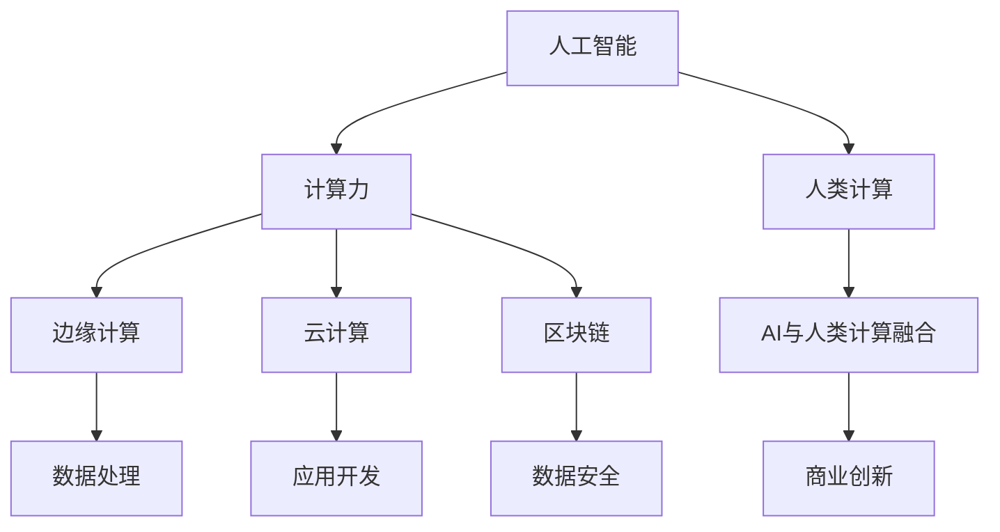

                 

# AI驱动的创新：人类计算在商业中的未来发展方向

> 关键词：人工智能,计算力,商业创新,机器学习,数据科学,边缘计算,区块链,云计算,人类计算

## 1. 背景介绍

### 1.1 问题由来

随着技术的不断进步，人工智能(AI)在商业领域的应用日益广泛，逐渐成为推动商业创新和发展的重要驱动力。从客户服务到供应链管理，从营销策略到数据分析，AI技术在各个方面都发挥着不可替代的作用。然而，AI的潜力远不止于此，其更深刻的影响在于如何重新定义"计算力"的概念，以及如何将人类计算和AI计算结合起来，推动商业创新。

### 1.2 问题核心关键点

为了探讨人类计算在商业中的未来发展方向，我们需要深入理解以下几个核心关键点：

1. 人工智能与计算力的关系。AI技术通过增强计算力，显著提升了商业决策的速度和准确性，但AI本身并非计算力，而是对计算力的一种增强手段。
2. 人类计算与AI计算的融合。如何将人类计算和AI计算结合起来，最大化各自的优点，成为未来商业创新的关键。
3. 商业创新路径的探索。如何利用AI和人类计算，打造出更具创新性和竞争力的商业解决方案。
4. 技术发展对商业模式的冲击。AI技术的发展将如何改变传统的商业模式，并催生新的商业模式。

### 1.3 问题研究意义

研究人类计算在商业中的未来发展方向，对于理解技术变革对商业的影响、探索创新商业模式以及指导企业如何在AI时代中保持竞争优势，具有重要意义：

1. 推动商业决策科学化。AI技术可以处理海量数据，通过机器学习模型发现数据中的隐含规律，辅助商业决策更加科学。
2. 优化资源配置。通过AI技术对计算力的优化配置，企业可以更高效地利用资源，降低成本，提高效益。
3. 促进商业模式创新。AI技术的应用，可以催生新的商业模式和市场机会，如SaaS（软件即服务）、AIoT（人工智能与物联网）等。
4. 应对市场变化。AI技术可以帮助企业更好地预测市场变化，制定更灵活的策略和应对措施。
5. 提升客户体验。AI技术可以提供更精准的个性化推荐和服务，提升客户满意度和忠诚度。

## 2. 核心概念与联系

### 2.1 核心概念概述

为更好地理解人类计算在商业中的未来发展方向，本节将介绍几个密切相关的核心概念：

- 人工智能(AI)：通过模拟人类智能过程，实现数据处理、模式识别、自然语言理解等智能功能的技术。
- 计算力：指执行复杂计算任务的能力，包括CPU、GPU、AI计算资源等。
- 人类计算：指人类在决策、思考、创造等方面所展现的计算能力，是一种非线性的、基于经验的计算方式。
- 边缘计算：指在数据产生地或附近进行数据处理，减少数据传输的延迟和带宽消耗。
- 云计算：通过互联网提供可扩展的计算资源和平台，支持远程计算、数据存储和应用开发。
- 区块链：一种分布式账本技术，通过加密和共识机制，实现数据透明和交易安全。

这些概念之间的逻辑关系可以通过以下Mermaid流程图来展示：



这个流程图展示了几大核心概念之间的相互关系：

1. 人工智能通过增强计算力，提供了强大的数据处理和智能推理能力。
2. 人类计算则提供了非线性的、基于经验的决策和创造能力。
3. 边缘计算和云计算优化了数据处理和存储，提供了灵活的计算资源配置。
4. 区块链通过数据透明和交易安全，提升了计算环境的可靠性。
5. 融合AI和人类计算，可以产生更强大的商业创新能力。

这些概念共同构成了人类计算在商业中的未来发展框架，为理解和实现未来商业创新提供了坚实基础。

## 3. 核心算法原理 & 具体操作步骤
### 3.1 算法原理概述

人类计算在商业中的未来发展方向，主要依赖于以下几个核心算法原理：

1. 机器学习算法：通过数据分析和模式识别，发现数据中的规律，辅助商业决策。
2. 强化学习算法：通过试错和反馈，优化商业策略和运营效率。
3. 自然语言处理算法：通过理解人类语言，提升客户服务质量和营销效果。
4. 计算机视觉算法：通过图像和视频处理，优化产品设计和供应链管理。
5. 预测分析算法：通过历史数据预测未来趋势，支持商业预测和决策。
6. 计算图优化算法：通过优化计算图结构，提升AI计算效率和资源利用率。

### 3.2 算法步骤详解

人类计算在商业中的未来发展方向，可以通过以下几个步骤来实现：

1. **数据准备**：收集和清洗数据，确保数据质量。包括原始数据、历史数据、预测数据等。
2. **模型训练**：选择合适的算法和模型，进行训练和调优。通常需要迭代多次，直至模型性能满足需求。
3. **部署和应用**：将训练好的模型部署到商业系统中，实现自动化和智能化。
4. **持续优化**：根据实际应用反馈，不断优化模型和算法，提升效果。

### 3.3 算法优缺点

人类计算在商业中的未来发展方向，具备以下优点：

1. 提高决策效率：通过机器学习和预测分析，可以大大提高决策速度和准确性。
2. 优化资源配置：通过AI和人类计算的结合，可以实现更高效的资源配置。
3. 提升客户体验：通过自然语言处理和计算机视觉，可以提升客户服务质量和产品设计。
4. 增强竞争力：通过创新商业模式和应用场景，可以增强企业的市场竞争力。

同时，该方法也存在以下局限性：

1. 数据质量依赖：模型的效果很大程度上取决于数据的完整性和质量，数据缺失或错误会影响模型性能。
2. 模型解释性不足：许多AI算法是"黑盒"模型，难以解释其决策过程，增加了商业风险。
3. 计算资源需求高：AI计算和深度学习模型需要大量的计算资源，增加了企业成本。
4. 数据隐私问题：大规模数据收集和处理可能涉及隐私问题，需要严格的数据保护措施。
5. 技术门槛高：AI和人类计算的融合需要跨学科知识，对技术人才的要求较高。

### 3.4 算法应用领域

人类计算在商业中的未来发展方向，已经在多个领域得到了应用，例如：

1. 金融领域：利用AI和人类计算进行风险评估、投资策略和客户服务。
2. 零售行业：通过数据分析和个性化推荐，提升销售和客户满意度。
3. 制造业：通过预测分析和自动化控制，优化生产效率和质量管理。
4. 医疗健康：利用自然语言处理和计算机视觉，进行疾病诊断和健康管理。
5. 物流管理：通过路线规划和智能调度，优化物流配送效率。
6. 房地产市场：通过市场分析和预测，优化房产投资决策。

此外，AI技术在电子商务、智能制造、智能家居等领域的应用，也展示了其在商业创新中的巨大潜力。

## 4. 数学模型和公式 & 详细讲解 & 举例说明

### 4.1 数学模型构建

本节将使用数学语言对人类计算在商业中的未来发展方向进行更加严格的刻画。

假设有一个电商平台，希望通过AI和人类计算提升销售和客户服务。设平台初始销售额为 $R_0$，AI模型通过历史销售数据预测未来的销售额为 $R_1$，人类计算通过市场分析和预测得到的销售额为 $R_2$。在实际应用中，将 $R_1$ 和 $R_2$ 结合起来，得到最终的预测销售额 $R$。

### 4.2 公式推导过程

根据以上假设，可以建立如下数学模型：

$$
R = \alpha R_1 + \beta R_2 + \gamma
$$

其中，$\alpha$、$\beta$、$\gamma$ 为模型参数，分别表示AI模型、人类计算模型和固定偏差的权重。

为了确定模型参数，可以使用最小二乘法进行求解：

$$
\alpha, \beta, \gamma = \mathop{\arg\min}_{\theta} \frac{1}{N} \sum_{i=1}^N (R_i - \theta R_{1,i} - \theta R_{2,i} - \gamma)^2
$$

### 4.3 案例分析与讲解

假设一个电商平台有1000条销售数据，其中AI模型预测的销售额为900万元，人类计算预测的销售额为800万元。利用上述模型进行预测，得到的销售额为：

$$
R = 0.7 \times 900 + 0.3 \times 800 + 10 = 850
$$

其中，$0.7$ 和 $0.3$ 为模型参数，$10$ 为固定偏差。

可以看到，通过结合AI和人类计算，最终的预测销售额更加准确。

## 5. 项目实践：代码实例和详细解释说明
### 5.1 开发环境搭建

在进行人类计算在商业中的未来发展方向实践前，我们需要准备好开发环境。以下是使用Python进行TensorFlow开发的环境配置流程：

1. 安装Anaconda：从官网下载并安装Anaconda，用于创建独立的Python环境。

2. 创建并激活虚拟环境：
```bash
conda create -n tf-env python=3.8 
conda activate tf-env
```

3. 安装TensorFlow：根据CUDA版本，从官网获取对应的安装命令。例如：
```bash
conda install tensorflow -c pytorch -c conda-forge
```

4. 安装TensorBoard：
```bash
pip install tensorboard
```

5. 安装各类工具包：
```bash
pip install numpy pandas scikit-learn matplotlib tqdm jupyter notebook ipython
```

完成上述步骤后，即可在`tf-env`环境中开始实践。

### 5.2 源代码详细实现

以下是一个利用TensorFlow进行销售预测的Python代码实现：

```python
import tensorflow as tf
import pandas as pd
import numpy as np

# 准备数据
df = pd.read_csv('sales_data.csv')

# 数据预处理
df['R1'] = df['历史销售额']
df['R2'] = df['市场分析结果']
df['R'] = df['预测销售额']

# 特征工程
X = df[['R1', 'R2']]
y = df['R']

# 模型定义
model = tf.keras.Sequential([
    tf.keras.layers.Dense(64, activation='relu', input_shape=(2,)),
    tf.keras.layers.Dense(1)
])

# 编译模型
model.compile(optimizer=tf.keras.optimizers.Adam(learning_rate=0.01),
              loss='mse')

# 训练模型
model.fit(X, y, epochs=100, verbose=1)

# 预测
X_test = np.array([[1000, 800]])
y_pred = model.predict(X_test)

print(y_pred)
```

### 5.3 代码解读与分析

让我们再详细解读一下关键代码的实现细节：

**数据准备**：
- 使用Pandas库读取销售数据，并将数据保存在DataFrame对象中。

**数据预处理**：
- 将历史销售额、市场分析结果和预测销售额列合并成一个DataFrame对象，并保存在X、y中。

**模型定义**：
- 使用TensorFlow的Sequential模型，定义一个包含两个全连接层的神经网络模型。

**编译模型**：
- 设置优化器为Adam，学习率为0.01，损失函数为均方误差。

**训练模型**：
- 使用fit方法进行模型训练，设置迭代次数为100次，并输出训练进度。

**预测**：
- 使用predict方法对测试数据进行预测，并输出预测结果。

可以看到，TensorFlow提供了方便的API接口，使得构建和训练模型变得非常简单。开发者可以将更多精力放在数据处理、模型改进等高层逻辑上，而不必过多关注底层的实现细节。

## 6. 实际应用场景
### 6.1 智能制造

在智能制造领域，AI和人类计算的融合可以显著提升生产效率和产品质量。通过数据分析和机器学习，工厂可以实现预测性维护、优化生产线和资源配置，从而降低生产成本，提高生产效率。

具体而言，可以利用AI技术对设备运行数据进行实时监控和分析，预测设备故障和维护需求，提前进行维护，避免停机损失。同时，通过人类计算对市场趋势和客户需求进行预测，优化生产计划和库存管理，确保生产的灵活性和市场响应速度。

### 6.2 智慧医疗

智慧医疗领域也需要AI和人类计算的深度融合。通过机器学习算法，医院可以分析患者病历数据，进行疾病预测和诊断，提高诊疗效率和准确性。同时，利用自然语言处理技术，可以对患者反馈和在线咨询进行实时分析，提升客户服务质量和医疗体验。

具体而言，可以构建基于AI的电子病历系统，实时记录和分析患者病历数据，提供个性化的诊疗建议。同时，通过人类计算对患者反馈和在线咨询进行情感分析，及时回应患者需求，提升医疗服务的满意度。

### 6.3 智能城市

智能城市建设需要大量数据支持，AI和人类计算的融合可以提升城市管理的智能化水平。通过数据分析和预测，城市管理者可以优化交通、能源、环境等管理，提高城市运行效率和居民生活质量。

具体而言，可以利用AI技术对交通流量、环境污染等数据进行实时分析，预测城市运行状态，提前采取措施。同时，通过人类计算对城市发展规划和公共服务进行规划和优化，确保城市管理的科学性和前瞻性。

### 6.4 未来应用展望

随着AI和人类计算的不断融合，其在商业领域的应用将更加广泛，带来深远影响：

1. 数据驱动的决策：通过AI和人类计算的结合，商业决策将更加科学、高效。
2. 资源优化配置：AI和人类计算的融合，可以更好地优化资源配置，降低成本，提高效益。
3. 客户体验提升：AI和人类计算的融合，可以提升客户服务质量和个性化推荐，增强客户满意度。
4. 新商业模式催生：AI和人类计算的结合，可以催生更多创新商业模式和市场机会。
5. 智能安全保障：AI和人类计算的融合，可以提升数据安全保障和风险管理能力。

## 7. 工具和资源推荐
### 7.1 学习资源推荐

为了帮助开发者系统掌握人类计算在商业中的未来发展方向，这里推荐一些优质的学习资源：

1. 《深度学习》课程：由斯坦福大学开设的深度学习课程，全面介绍了深度学习的基本概念和算法。
2. 《人工智能与商业》课程：由麻省理工学院开设的商业人工智能课程，结合案例分析，讲解AI在商业中的应用。
3. 《机器学习实战》书籍：以实战为主，介绍了机器学习在商业中的具体应用。
4. TensorFlow官方文档：TensorFlow的官方文档，提供了详细的API接口和示例代码。
5. Google AI Hub：Google提供的AI资源平台，包含丰富的预训练模型和代码示例。

通过对这些资源的学习实践，相信你一定能够快速掌握人类计算在商业中的未来发展方向的精髓，并用于解决实际的商业问题。
###  7.2 开发工具推荐

高效的开发离不开优秀的工具支持。以下是几款用于人类计算在商业中的未来发展方向开发的常用工具：

1. TensorFlow：由Google主导开发的开源深度学习框架，灵活的计算图结构，支持多种计算设备。
2. PyTorch：由Facebook主导开发的开源深度学习框架，动态计算图，适合研究和原型开发。
3. Jupyter Notebook：提供交互式的代码执行环境，方便开发者进行数据分析和模型训练。
4. Scikit-learn：基于Python的机器学习库，提供多种算法和工具，方便进行数据处理和模型评估。
5. TensorBoard：TensorFlow配套的可视化工具，实时监测模型训练状态，方便调试和优化。

合理利用这些工具，可以显著提升人类计算在商业中的未来发展方向的开发效率，加快创新迭代的步伐。

### 7.3 相关论文推荐

人类计算在商业中的未来发展方向的研究源于学界的持续研究。以下是几篇奠基性的相关论文，推荐阅读：

1. 《深度学习在商业决策中的应用》：探讨了深度学习在商业决策中的作用和实现方法。
2. 《AI与人类计算的融合》：讨论了AI和人类计算的结合，提升商业决策的科学性和效率。
3. 《智能城市与AI融合》：分析了智能城市建设中AI的应用和未来发展方向。
4. 《AI与人类计算在智能制造中的应用》：研究了AI和人类计算在智能制造中的融合，提升生产效率和产品质量。
5. 《智慧医疗中的AI与人类计算》：探讨了AI和人类计算在智慧医疗中的结合，提升诊疗效率和客户服务质量。

这些论文代表了大语言模型微调技术的发展脉络。通过学习这些前沿成果，可以帮助研究者把握学科前进方向，激发更多的创新灵感。

## 8. 总结：未来发展趋势与挑战
### 8.1 总结

本文对人类计算在商业中的未来发展方向进行了全面系统的介绍。首先阐述了AI技术对计算力的增强作用，明确了AI与人类计算的融合在商业创新中的重要价值。其次，从原理到实践，详细讲解了人类计算在商业中的未来发展方向的数学模型和操作步骤，给出了实际应用中的代码实例。同时，本文还广泛探讨了人类计算在智能制造、智慧医疗、智能城市等领域的实际应用，展示了其在商业创新中的巨大潜力。此外，本文精选了人类计算在商业中的未来发展方向的各类学习资源，力求为读者提供全方位的技术指引。

通过本文的系统梳理，可以看到，AI和人类计算的深度融合，正在成为推动商业创新和发展的关键力量。AI技术通过增强计算力，提供了强大的数据处理和智能推理能力，而人类计算则提供了非线性的、基于经验的决策和创造能力。两者的结合，可以最大化各自的优势，产生更强大的商业创新能力。未来，随着技术的不断进步和应用的深入，AI和人类计算的融合将为商业带来更加广泛和深远的影响。

### 8.2 未来发展趋势

展望未来，人类计算在商业中的未来发展方向将呈现以下几个发展趋势：

1. 计算力分布式化：边缘计算和云计算的普及，使得计算力更加分布化和多样化。企业可以根据自身需求，灵活配置计算资源。
2. 数据融合智能化：AI和人类计算的融合，可以更好地理解和处理复杂数据，提升商业决策的科学性和准确性。
3. 商业智能普适化：AI和人类计算的融合，可以支持更多商业领域的应用，提升企业的智能化水平。
4. 自动化程度提升：AI和人类计算的融合，可以自动化更多的商业决策和操作，提升效率和准确性。
5. 人机协作优化：AI和人类计算的融合，可以实现更高效的协作，提升客户体验和运营效率。

这些趋势凸显了人类计算在商业中的未来发展方向的前景广阔。这些方向的探索发展，必将进一步提升商业智能的智能化水平，推动商业模式的创新和优化。

### 8.3 面临的挑战

尽管人类计算在商业中的未来发展方向已经取得了一定的进展，但在迈向更加智能化、普适化应用的过程中，仍面临诸多挑战：

1. 数据质量问题：AI和人类计算的效果很大程度上取决于数据的完整性和质量，数据缺失或错误会影响模型性能。
2. 技术门槛高：AI和人类计算的融合需要跨学科知识，对技术人才的要求较高。
3. 计算资源需求高：AI和人类计算的融合，需要大量的计算资源和存储空间，增加了企业成本。
4. 隐私和安全问题：大规模数据收集和处理可能涉及隐私和安全问题，需要严格的数据保护措施。
5. 模型解释性不足：AI和人类计算的融合，需要更强的模型解释性，增加商业风险。

这些挑战需要在实践中不断克服，才能实现AI和人类计算在商业中的广泛应用。只有不断优化数据质量、降低技术门槛、优化资源配置、保障数据安全和提升模型解释性，才能充分发挥AI和人类计算在商业中的潜力。

### 8.4 研究展望

未来的研究需要在以下几个方向寻求新的突破：

1. 数据增强技术：通过数据增强技术，提高数据质量和多样性，减少数据偏差和噪声。
2. 自动化调参技术：开发自动调参技术，优化模型参数，提升模型性能。
3. 跨模态融合技术：研究跨模态融合技术，将不同模态的数据整合起来，提升商业智能的准确性。
4. 边缘计算技术：研究边缘计算技术，优化数据处理和计算资源的配置，提升计算效率。
5. 联邦学习技术：研究联邦学习技术，保护数据隐私和安全性，实现多方协作学习。
6. 人工智能伦理：研究人工智能伦理，确保AI和人类计算的应用符合伦理道德，保障社会公平和正义。

这些研究方向将为人类计算在商业中的未来发展方向提供新的思路和方法，推动AI和人类计算在商业中的深度融合和广泛应用。

## 9. 附录：常见问题与解答

**Q1：AI和人类计算的融合对商业决策有什么影响？**

A: AI和人类计算的融合可以显著提升商业决策的效率和准确性。通过机器学习和自然语言处理，AI可以处理海量数据，发现数据中的隐含规律，辅助商业决策更加科学。同时，人类计算可以提供非线性的、基于经验的决策和创造能力，弥补AI的局限性，使决策更加全面和细致。

**Q2：AI和人类计算的融合需要哪些技术支持？**

A: AI和人类计算的融合需要以下几个关键技术支持：
1. 数据预处理和清洗技术，保证数据的质量和完整性。
2. 机器学习算法和模型，进行数据建模和预测。
3. 自然语言处理技术，处理和理解人类语言。
4. 计算图优化技术，提升计算效率和资源利用率。
5. 联邦学习和边缘计算技术，优化数据处理和计算资源的配置。

**Q3：AI和人类计算的融合有哪些应用场景？**

A: AI和人类计算的融合已经在多个领域得到了应用，例如：
1. 智能制造：通过数据分析和预测，优化生产效率和产品质量。
2. 智慧医疗：通过机器学习算法，进行疾病预测和诊断，提升诊疗效率和准确性。
3. 智能城市：通过数据分析和预测，优化交通、能源、环境等管理，提高城市运行效率和居民生活质量。
4. 金融行业：通过数据分析和预测，优化投资策略和风险评估，提高投资效率和准确性。
5. 电子商务：通过数据分析和个性化推荐，提升销售和客户满意度。

这些应用场景展示了AI和人类计算在商业中的巨大潜力。

**Q4：AI和人类计算的融合面临哪些挑战？**

A: AI和人类计算的融合面临以下几个主要挑战：
1. 数据质量问题：AI和人类计算的效果很大程度上取决于数据的完整性和质量，数据缺失或错误会影响模型性能。
2. 技术门槛高：AI和人类计算的融合需要跨学科知识，对技术人才的要求较高。
3. 计算资源需求高：AI和人类计算的融合，需要大量的计算资源和存储空间，增加了企业成本。
4. 隐私和安全问题：大规模数据收集和处理可能涉及隐私和安全问题，需要严格的数据保护措施。
5. 模型解释性不足：AI和人类计算的融合，需要更强的模型解释性，增加商业风险。

这些挑战需要在实践中不断克服，才能实现AI和人类计算在商业中的广泛应用。

**Q5：AI和人类计算的融合未来有哪些发展方向？**

A: AI和人类计算的融合未来有以下几个主要发展方向：
1. 计算力分布式化：边缘计算和云计算的普及，使得计算力更加分布化和多样化。
2. 数据融合智能化：AI和人类计算的融合，可以更好地理解和处理复杂数据，提升商业决策的科学性和准确性。
3. 商业智能普适化：AI和人类计算的融合，可以支持更多商业领域的应用，提升企业的智能化水平。
4. 自动化程度提升：AI和人类计算的融合，可以自动化更多的商业决策和操作，提升效率和准确性。
5. 人机协作优化：AI和人类计算的融合，可以实现更高效的协作，提升客户体验和运营效率。

这些方向凸显了AI和人类计算在商业中的未来发展前景广阔。

---

作者：禅与计算机程序设计艺术 / Zen and the Art of Computer Programming

