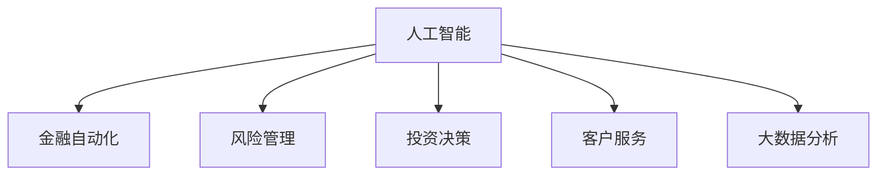

                 

# AI驱动的创新：人类计算在金融中的应用

> 关键词：人工智能, 金融技术, 人类计算, 金融自动化, 大数据, 机器学习

## 1. 背景介绍

### 1.1 问题由来

随着金融行业的数字化转型加速，金融机构面临着前所未有的机遇和挑战。一方面，数字技术带来了客户体验的提升和效率的提升，但另一方面，也带来了新的业务风险和监管压力。在这一背景下，人工智能(AI)技术在金融领域的应用变得尤为重要。

人工智能技术在金融领域的应用不仅有助于提升业务效率、降低运营成本、改善客户体验，还能帮助金融机构识别和防范风险、优化投资决策、提升客户忠诚度。特别是随着人类计算（Human-in-the-loop）理念的兴起，AI与人类专家的协作，在金融应用中变得愈发重要。

### 1.2 问题核心关键点

在金融领域，AI驱动的创新主要集中在以下几个方面：

- 金融自动化：通过自动化流程优化，减少人工操作，提高处理效率。
- 风险管理：利用机器学习算法，进行风险识别和预测，优化风险控制策略。
- 投资决策：借助AI模型，进行更精准的资产配置和投资组合管理。
- 客户服务：通过智能客服和虚拟助理，提升客户服务体验。
- 数据驱动决策：利用大数据分析，进行业务和客户洞察，指导经营决策。

这些应用不仅提高了金融业务的效率和质量，还帮助金融机构在竞争激烈的市场环境中保持领先地位。但同时，也带来了数据隐私、算法偏见、模型解释性等新的挑战。

## 2. 核心概念与联系

### 2.1 核心概念概述

为更好地理解AI在金融中的应用，本节将介绍几个密切相关的核心概念：

- 人工智能(AI)：指使用机器学习和深度学习技术，使计算机系统具备类似人类的认知和决策能力。
- 人类计算(Human-in-the-loop)：指在AI决策过程中，融合人类专家的经验和判断，进行决策和调整，以提升系统的可靠性和公正性。
- 金融自动化：指利用AI技术，自动完成金融业务中的重复性、标准化操作，如会计、风险评估等。
- 风险管理：指利用机器学习模型，分析金融数据，识别风险因素，优化风险控制策略。
- 投资决策：指使用AI模型进行资产评估、投资组合构建、市场预测等，辅助投资决策。
- 客户服务：指通过智能客服、聊天机器人等技术，提供自动化客户服务，提升客户体验。
- 大数据分析：指利用先进的数据处理和分析技术，从海量数据中提取有价值的信息，辅助业务决策。

这些核心概念之间的逻辑关系可以通过以下Mermaid流程图来展示：



这个流程图展示了大数据、AI技术在金融业务中的核心应用场景。通过理解这些核心概念，我们可以更好地把握AI在金融领域的应用框架和优化方向。

## 3. 核心算法原理 & 具体操作步骤
### 3.1 算法原理概述

AI在金融领域的应用，主要是通过构建各种机器学习模型和数据处理流程来实现的。以下是几个核心算法及其原理：

- 线性回归：用于预测连续型数值变量，如股票价格、贷款风险等。
- 决策树和随机森林：用于分类和回归任务，在金融风控和客户分类中应用广泛。
- 支持向量机(SVM)：适用于非线性分类问题，在信用评分和市场预测中表现出色。
- 深度学习模型：如卷积神经网络(CNN)、循环神经网络(RNN)、长短时记忆网络(LSTM)等，在图像识别、文本分析等复杂任务中表现优异。
- 强化学习：用于自动策略优化，如高频交易、算法交易等。

这些算法在大数据和计算资源的支持下，能够高效地处理金融数据，提取有价值的洞察，辅助决策。但同时，也面临着数据隐私、算法偏见、模型解释性等新的挑战。

### 3.2 算法步骤详解

以下是对AI在金融领域典型应用的详细步骤：

**Step 1: 数据准备与预处理**
- 收集金融数据，如交易记录、客户信息、市场数据等。
- 清洗和处理数据，去除噪声、缺失值，进行特征工程。
- 划分训练集和测试集，确保模型评估的公平性。

**Step 2: 模型选择与训练**
- 根据业务需求，选择合适的机器学习算法。
- 设计训练流程，使用交叉验证等方法，避免过拟合。
- 使用GPU/TPU等高性能计算设备，加速模型训练。

**Step 3: 模型评估与优化**
- 在测试集上评估模型性能，如准确率、召回率、F1值等。
- 根据评估结果，调整模型参数，进行超参数调优。
- 使用A/B测试等方法，对比新模型和旧模型性能。

**Step 4: 模型部署与监控**
- 将模型部署到生产环境，进行实时数据处理和预测。
- 设置监控系统，实时跟踪模型性能，发现异常及时调整。
- 定期更新模型，以适应数据分布的变化。

**Step 5: 人类计算与反馈**
- 引入人类专家，对模型输出进行审核和调整。
- 收集人类专家的反馈，优化模型决策。
- 持续迭代，逐步提升模型精度和可靠性。

这些步骤展示了AI在金融领域应用的典型流程，通过合理的数据处理和模型选择，可以有效解决金融问题，提升业务效率和决策质量。

### 3.3 算法优缺点

AI在金融领域的应用具有以下优点：
- 效率提升：自动化流程优化，减少了人工操作，提高了处理效率。
- 风险控制：利用机器学习模型，进行风险识别和预测，优化风险控制策略。
- 决策辅助：借助AI模型，进行更精准的资产配置和投资组合管理。
- 客户服务：通过智能客服、聊天机器人等技术，提升客户服务体验。
- 数据洞察：利用大数据分析，进行业务和客户洞察，指导经营决策。

同时，这些应用也存在一定的局限性：
- 数据隐私：金融数据涉及个人隐私和商业机密，数据收集和处理过程中需严格遵守法规。
- 算法偏见：AI模型可能学习到数据中的偏见，导致决策不公平。
- 模型解释性：AI模型往往是"黑盒"系统，难以解释其内部工作机制和决策逻辑。
- 计算成本：训练和推理AI模型需要大量的计算资源，可能面临成本压力。

尽管存在这些局限性，但AI在金融领域的应用前景广阔，其效率和精度优势不可忽视。未来相关研究的重点在于如何进一步提高模型的透明性和公平性，降低计算成本，确保数据隐私安全。

### 3.4 算法应用领域

AI在金融领域的应用涵盖了金融业务的各个环节，具体包括：

- 风险管理：利用机器学习模型，进行信用评分、违约预测、市场风险评估等。
- 投资决策：使用AI模型进行资产配置、组合优化、市场预测等。
- 金融自动化：自动完成会计、审计、结算等重复性操作，提升运营效率。
- 客户服务：通过智能客服、聊天机器人等技术，提供自动化客户服务。
- 数据驱动决策：利用大数据分析，进行业务和客户洞察，指导经营决策。

除了这些经典应用外，AI在金融领域的应用还在不断拓展，如智能合约、区块链、供应链金融等新兴领域，为金融创新带来新的可能性。

## 4. 数学模型和公式 & 详细讲解 & 举例说明
### 4.1 数学模型构建

本节将使用数学语言对AI在金融中的应用进行更加严格的刻画。

记金融数据集为 $D=\{(x_i,y_i)\}_{i=1}^N$，其中 $x_i$ 为输入数据（如历史交易记录、客户信息等），$y_i$ 为输出变量（如贷款风险、市场价格等）。假设构建的机器学习模型为 $M_{\theta}$，其中 $\theta$ 为模型参数。

定义模型 $M_{\theta}$ 在输入 $x$ 上的预测输出为 $\hat{y}=M_{\theta}(x)$。在实际应用中，我们通常使用以下几种目标函数来评估模型性能：

- 均方误差(MSE)：$\text{MSE} = \frac{1}{N} \sum_{i=1}^N (\hat{y}_i - y_i)^2$
- 平均绝对误差(MAE)：$\text{MAE} = \frac{1}{N} \sum_{i=1}^N |\hat{y}_i - y_i|$
- 对数损失(log-loss)：$\text{log-loss} = \frac{1}{N} \sum_{i=1}^N (-y_i\log\hat{y}_i - (1-y_i)\log(1-\hat{y}_i))$
- 对数损失(log-loss)：$\text{log-loss} = \frac{1}{N} \sum_{i=1}^N (-y_i\log\hat{y}_i - (1-y_i)\log(1-\hat{y}_i))$

这些目标函数可用于不同类型的数据分析和预测任务，帮助模型评估和优化。

### 4.2 公式推导过程

以下我们以线性回归模型为例，推导其训练目标函数和梯度更新公式。

设线性回归模型为：

$$
y_i = \theta_0 + \theta_1 x_{i1} + \theta_2 x_{i2} + \cdots + \theta_n x_{in}
$$

目标函数为均方误差：

$$
\text{MSE} = \frac{1}{N} \sum_{i=1}^N (y_i - \theta_0 - \theta_1 x_{i1} - \theta_2 x_{i2} - \cdots - \theta_n x_{in})^2
$$

将目标函数对模型参数求偏导数，得：

$$
\frac{\partial \text{MSE}}{\partial \theta_k} = \frac{2}{N} \sum_{i=1}^N (y_i - \theta_0 - \theta_1 x_{i1} - \theta_2 x_{i2} - \cdots - \theta_n x_{in})(-x_{ik})
$$

其中，$-x_{ik}$ 表示第 $i$ 个样本的第 $k$ 个特征的负值。

将目标函数和梯度更新公式代入梯度下降法，得到线性回归模型的参数更新公式：

$$
\theta_k \leftarrow \theta_k - \eta \frac{2}{N} \sum_{i=1}^N (y_i - \theta_0 - \theta_1 x_{i1} - \theta_2 x_{i2} - \cdots - \theta_n x_{in})(-x_{ik})
$$

其中，$\eta$ 为学习率，控制每次更新的大小。

通过上述公式，我们得到了线性回归模型的训练目标函数和梯度更新公式，可进一步进行模型训练和优化。

### 4.3 案例分析与讲解

以信用评分模型为例，分析其构建和应用过程。

假设我们有一组历史贷款数据，包含贷款金额、申请人信用评分、历史还款记录等信息，我们的目标是根据这些信息预测贷款违约风险。构建信用评分模型步骤如下：

**Step 1: 数据准备与预处理**
- 收集历史贷款数据，包括贷款金额、申请人信用评分、历史还款记录等。
- 清洗和处理数据，去除噪声、缺失值，进行特征工程。
- 划分训练集和测试集，确保模型评估的公平性。

**Step 2: 模型选择与训练**
- 选择合适的机器学习算法，如逻辑回归、随机森林等。
- 设计训练流程，使用交叉验证等方法，避免过拟合。
- 使用GPU/TPU等高性能计算设备，加速模型训练。

**Step 3: 模型评估与优化**
- 在测试集上评估模型性能，如准确率、召回率、F1值等。
- 根据评估结果，调整模型参数，进行超参数调优。
- 使用A/B测试等方法，对比新模型和旧模型性能。

**Step 4: 模型部署与监控**
- 将模型部署到生产环境，进行实时数据处理和预测。
- 设置监控系统，实时跟踪模型性能，发现异常及时调整。
- 定期更新模型，以适应数据分布的变化。

**Step 5: 人类计算与反馈**
- 引入人类专家，对模型输出进行审核和调整。
- 收集人类专家的反馈，优化模型决策。
- 持续迭代，逐步提升模型精度和可靠性。

## 5. 项目实践：代码实例和详细解释说明
### 5.1 开发环境搭建

在进行AI金融应用实践前，我们需要准备好开发环境。以下是使用Python进行TensorFlow开发的环境配置流程：

1. 安装Anaconda：从官网下载并安装Anaconda，用于创建独立的Python环境。

2. 创建并激活虚拟环境：
```bash
conda create -n tf-env python=3.8 
conda activate tf-env
```

3. 安装TensorFlow：根据CUDA版本，从官网获取对应的安装命令。例如：
```bash
conda install tensorflow -c pytorch -c conda-forge
```

4. 安装TensorFlow Addons库：
```bash
pip install tensorflow-io-gcs-filesystem
```

5. 安装各类工具包：
```bash
pip install numpy pandas scikit-learn matplotlib tqdm jupyter notebook ipython
```

完成上述步骤后，即可在`tf-env`环境中开始AI金融应用的实践。

### 5.2 源代码详细实现

下面我们以信用评分模型为例，给出使用TensorFlow对线性回归模型进行金融应用开发的PyTorch代码实现。

首先，定义模型和数据预处理函数：

```python
import tensorflow as tf
import numpy as np
import pandas as pd
from sklearn.model_selection import train_test_split

# 数据预处理函数
def preprocess_data(df):
    # 数据清洗
    df.dropna(inplace=True)
    # 特征工程
    df['income_ratio'] = df['income'] / df['score']
    df['score_ratio'] = df['score'] / df['income']
    return df

# 加载数据
data = pd.read_csv('loan_data.csv')
data = preprocess_data(data)
X = data[['income_ratio', 'score_ratio']]
y = data['default']
X_train, X_test, y_train, y_test = train_test_split(X, y, test_size=0.2, random_state=42)

# 定义模型
model = tf.keras.Sequential([
    tf.keras.layers.Dense(64, activation='relu', input_shape=(2,)),
    tf.keras.layers.Dense(1, activation='sigmoid')
])
```

然后，定义训练和评估函数：

```python
# 定义损失函数
def binary_crossentropy(y_true, y_pred):
    return tf.reduce_mean(tf.keras.losses.binary_crossentropy(y_true, y_pred))

# 定义优化器
optimizer = tf.keras.optimizers.Adam(learning_rate=0.01)

# 定义训练函数
def train_epoch(model, data, optimizer, loss_fn):
    for batch in data:
        X_batch, y_batch = batch
        with tf.GradientTape() as tape:
            y_pred = model(X_batch)
            loss = loss_fn(y_batch, y_pred)
        grads = tape.gradient(loss, model.trainable_variables)
        optimizer.apply_gradients(zip(grads, model.trainable_variables))

# 定义评估函数
def evaluate(model, data, loss_fn):
    losses = []
    for batch in data:
        X_batch, y_batch = batch
        y_pred = model(X_batch)
        loss = loss_fn(y_batch, y_pred)
        losses.append(loss)
    return tf.reduce_mean(losses)

# 训练模型
epochs = 50
batch_size = 32

for epoch in range(epochs):
    train_epoch(model, X_train, optimizer, binary_crossentropy)
    loss = evaluate(model, X_test, binary_crossentropy)
    print(f"Epoch {epoch+1}, loss: {loss:.3f}")
```

最后，启动训练流程并在测试集上评估：

```python
# 模型评估
print(f"Final loss: {evaluate(model, X_test, binary_crossentropy):.3f}")
```

以上就是使用TensorFlow对线性回归模型进行信用评分任务开发的完整代码实现。可以看到，TensorFlow提供了方便的API，使得模型构建、训练和评估变得简洁高效。

### 5.3 代码解读与分析

让我们再详细解读一下关键代码的实现细节：

**preprocess_data函数**：
- 该函数用于对原始数据进行清洗和特征工程，如去除缺失值、创建新特征等。

**binary_crossentropy函数**：
- 自定义损失函数，用于二分类问题，如贷款违约与不违约的预测。

**train_epoch函数**：
- 该函数定义了模型在每个epoch上的训练流程，通过循环迭代每个批次的数据，计算损失，并更新模型参数。

**evaluate函数**：
- 该函数用于在测试集上评估模型性能，计算平均损失。

**训练流程**：
- 定义总的epoch数和batch size，开始循环迭代
- 每个epoch内，在训练集上进行模型训练，并输出损失
- 在测试集上评估模型，输出最终损失

可以看到，TensorFlow提供了强大的工具支持，使得模型构建和训练过程变得简便快捷。开发者可以专注于模型设计和应用逻辑，而不必过多关注底层的实现细节。

当然，工业级的系统实现还需考虑更多因素，如模型的保存和部署、超参数的自动搜索、更多的优化技巧等，但核心的训练流程和评估方法基本与此类似。

## 6. 实际应用场景
### 6.1 智能投顾

智能投顾系统通过利用AI技术，自动进行市场分析和投资策略优化，为投资者提供个性化、自动化投资建议。智能投顾系统通常包括：

- 数据收集：收集历史交易数据、市场资讯、经济指标等。
- 模型构建：基于机器学习算法，构建预测模型，预测市场走势。
- 投资策略：根据市场预测结果，自动调整投资组合，优化资产配置。
- 风险控制：实时监控市场风险，动态调整投资策略，确保风险可控。

智能投顾系统不仅能够提升投资效率，降低交易成本，还能帮助普通投资者获得专业级的投资建议，实现财富增值。

### 6.2 风险管理

金融机构利用AI技术进行风险管理，能够有效识别和控制金融风险。具体应用包括：

- 信用评分：利用机器学习模型评估贷款申请人的信用风险，优化信贷决策。
- 欺诈检测：通过异常检测算法，识别和预防欺诈行为，保护客户资产安全。
- 市场风险：利用机器学习模型，评估金融产品的风险等级，优化投资策略。

风险管理系统的应用，使得金融机构能够更准确地识别和控制风险，提升客户信任度和业务稳健性。

### 6.3 投资组合优化

投资组合优化系统通过AI技术，自动构建和优化投资组合，提升投资收益和风险控制能力。具体应用包括：

- 资产配置：利用机器学习模型，优化资产配置比例，实现收益最大化。
- 风险分散：通过优化模型，降低投资组合的系统性风险。
- 动态调整：根据市场变化，动态调整投资组合，优化投资效果。

投资组合优化系统的应用，帮助投资者构建更优的资产配置方案，提升投资收益，降低风险。

### 6.4 金融自动化

金融自动化系统通过AI技术，自动完成各种金融业务操作，提升业务效率和客户体验。具体应用包括：

- 财务处理：自动完成账单处理、对账、结账等操作，减少手工操作。
- 客户服务：通过智能客服和聊天机器人，提供自动化客户服务，提升客户满意度。
- 反欺诈：利用AI技术，自动化识别和防范欺诈行为，保护客户资产安全。

金融自动化系统的应用，使得金融机构能够更高效地处理业务，提升客户体验，降低运营成本。

### 6.5 智能合约

智能合约通过AI技术，自动执行和监管金融交易，提升交易效率和安全性。具体应用包括：

- 自动化执行：利用智能合约，自动执行合同条款，减少人为操作。
- 实时监管：通过AI技术，实时监控合同执行情况，及时发现和纠正违规行为。
- 风险控制：利用机器学习模型，评估合同风险，优化合同设计。

智能合约系统的应用，使得金融交易更透明、高效、安全，提升了交易体验和信任度。

## 7. 工具和资源推荐
### 7.1 学习资源推荐

为了帮助开发者系统掌握AI在金融中的应用，这里推荐一些优质的学习资源：

1. TensorFlow官方文档：TensorFlow提供了详尽的官方文档和教程，涵盖各种AI应用场景，适合入门和进阶学习。
2. PyTorch官方文档：PyTorch是另一款流行的深度学习框架，提供了丰富的API和资源，适合研究和实践。
3. Coursera金融AI课程：Coursera与多所知名高校合作，提供金融AI的系列课程，涵盖机器学习、深度学习、金融模型等。
4. Kaggle金融数据集：Kaggle提供了大量的金融数据集，适合进行模型训练和竞赛，适合数据驱动的学习。
5. GitHub金融AI项目：GitHub上有许多开源金融AI项目，适合借鉴和学习。

通过对这些资源的学习实践，相信你一定能够快速掌握AI在金融领域的应用技巧，并用于解决实际的金融问题。
###  7.2 开发工具推荐

高效的开发离不开优秀的工具支持。以下是几款用于AI金融应用开发的常用工具：

1. TensorFlow：由Google主导开发的开源深度学习框架，生产部署方便，适合大规模工程应用。
2. PyTorch：基于Python的开源深度学习框架，灵活动态的计算图，适合研究和实验。
3. Jupyter Notebook：开源的交互式计算环境，适合进行模型训练和可视化。
4. Google Colab：谷歌提供的免费Jupyter Notebook环境，支持GPU/TPU，适合高性能计算。
5. TensorBoard：TensorFlow配套的可视化工具，实时监测模型训练状态，提供丰富的图表呈现方式。

合理利用这些工具，可以显著提升AI金融应用的开发效率，加快创新迭代的步伐。

### 7.3 相关论文推荐

AI在金融领域的应用源于学界的持续研究。以下是几篇奠基性的相关论文，推荐阅读：

1. "Machine Learning in Finance" by Thomas P. Hatzinger：综述了机器学习在金融领域的应用，适合了解金融AI的广泛应用。
2. "Robustness of Machine Learning Models for Financial Risk Management" by Siavash Hussaini et al.：讨论了金融风险管理中机器学习模型的稳健性，适合研究金融风险管理。
3. "Deep Learning for Financial Engineering" by Jennifer McArdle：介绍了深度学习在金融工程中的应用，适合了解金融工程的深度学习技术。
4. "Blockchain and AI for Finance" by Willi D. Fung et al.：讨论了区块链和AI在金融领域的应用，适合了解最新的金融技术趋势。
5. "Optimization of Portfolio Selection Using Machine Learning" by Gregor Adalet基尔：讨论了使用机器学习优化投资组合的问题，适合了解投资组合优化。

这些论文代表了大数据、AI技术在金融领域的应用方向，通过学习这些前沿成果，可以帮助研究者把握学科前进方向，激发更多的创新灵感。

## 8. 总结：未来发展趋势与挑战

### 8.1 总结

本文对AI在金融领域的应用进行了全面系统的介绍。首先阐述了AI在金融行业中的重要性和应用场景，明确了金融自动化、风险管理、投资决策等核心应用。其次，从原理到实践，详细讲解了机器学习模型在金融任务中的构建和训练方法，给出了完整的代码实例。同时，本文还探讨了AI金融应用在实际落地中的挑战和优化方向，包括数据隐私、算法偏见、模型解释性等。

通过本文的系统梳理，可以看到，AI在金融领域的应用前景广阔，其效率和精度优势不可忽视。未来相关研究的重点在于如何进一步提高模型的透明性和公平性，降低计算成本，确保数据隐私安全。

### 8.2 未来发展趋势

展望未来，AI在金融领域的应用将呈现以下几个发展趋势：

1. 自动化和智能化程度提升：AI将进一步深入金融业务流程，实现自动化和智能化的优化，提升业务效率和决策质量。
2. 数据驱动决策的普及：基于大数据和AI技术，金融机构将更依赖于数据驱动的决策，提升业务洞察力和决策准确性。
3. 风险管理能力的提升：AI将在风险识别、评估和控制方面发挥更大作用，帮助金融机构降低风险。
4. 跨领域应用拓展：AI将应用于更多金融领域，如供应链金融、智能合约等，为金融创新带来新的可能性。
5. 人机协同的强化：AI将与人类专家进行更紧密的协同，通过人类计算增强AI的决策能力，提升系统的可靠性和公正性。
6. 多模态信息整合：AI将利用多模态数据，整合文本、图像、音频等多源信息，提升智能交互和决策能力。

这些趋势凸显了AI在金融领域的应用潜力，为金融行业带来了新的增长点和创新点。

### 8.3 面临的挑战

尽管AI在金融领域的应用前景广阔，但在迈向更加智能化、普适化应用的过程中，也面临着诸多挑战：

1. 数据隐私：金融数据涉及个人隐私和商业机密，数据收集和处理过程中需严格遵守法规。
2. 算法偏见：AI模型可能学习到数据中的偏见，导致决策不公平。
3. 模型解释性：AI模型往往是"黑盒"系统，难以解释其内部工作机制和决策逻辑。
4. 计算成本：训练和推理AI模型需要大量的计算资源，可能面临成本压力。
5. 监管合规：AI应用需遵守相关法律法规，确保系统合法合规。
6. 安全防护：AI系统需具备较强的安全防护能力，防止恶意攻击和数据泄露。

尽管存在这些挑战，但AI在金融领域的应用前景广阔，其效率和精度优势不可忽视。未来相关研究的重点在于如何进一步提高模型的透明性和公平性，降低计算成本，确保数据隐私安全。

### 8.4 研究展望

面对AI金融应用所面临的诸多挑战，未来的研究需要在以下几个方面寻求新的突破：

1. 数据隐私保护：研究更高效、更安全的数据处理和保护技术，确保数据隐私安全。
2. 算法公平性：开发更加公平的机器学习算法，避免偏见和歧视，提升决策公正性。
3. 模型透明性：探索更透明、更可解释的AI模型，增强决策可解释性和可信度。
4. 计算效率：研究更高效的模型训练和推理方法，降低计算成本，提升系统效率。
5. 跨领域应用：拓展AI在金融领域的应用范围，应用于更多新兴领域，如供应链金融、智能合约等。
6. 人机协同：研究人机协作的优化方法，提升系统的可靠性和公正性，实现更高效、更智能的金融决策。

这些研究方向的探索，必将引领AI在金融领域的应用走向更高的台阶，为构建安全、可靠、可解释、可控的智能系统铺平道路。面向未来，AI金融应用还需要与其他金融技术进行更深入的融合，如区块链、智能合约、大数据等，多路径协同发力，共同推动金融行业数字化转型。

## 9. 附录：常见问题与解答

**Q1：AI在金融应用中的数据隐私问题如何处理？**

A: 金融数据涉及个人隐私和商业机密，数据收集和处理过程中需严格遵守法规。常见的数据隐私保护措施包括：
1. 数据匿名化：通过数据去标识化，保护用户隐私。
2. 数据加密：对数据进行加密处理，防止数据泄露。
3. 数据访问控制：限制数据访问权限，防止未授权访问。
4. 数据共享协议：与合作伙伴签订数据共享协议，明确数据使用范围。
5. 数据审计：定期审计数据使用情况，确保数据使用合规。

通过这些措施，可以有效保护数据隐私，确保AI在金融应用中的数据安全。

**Q2：AI在金融应用中的算法偏见问题如何解决？**

A: AI模型可能学习到数据中的偏见，导致决策不公平。常见的偏见解决措施包括：
1. 数据清洗：去除数据中的偏见项，确保数据公平性。
2. 算法调整：调整算法参数，降低偏见影响。
3. 多模型集成：通过集成多个模型，降低单一模型的偏见影响。
4. 人工审核：引入人工专家，审核和调整模型输出。
5. 公平性评估：评估模型公平性，发现和纠正偏见问题。

通过这些措施，可以有效减少AI模型中的偏见，提升决策公平性。

**Q3：AI在金融应用中的模型解释性问题如何解决？**

A: AI模型往往是"黑盒"系统，难以解释其内部工作机制和决策逻辑。常见的模型解释性方法包括：
1. 特征重要性分析：通过特征重要性分析，理解模型内部决策机制。
2. 模型可视化：通过可视化工具，展示模型输出结果。
3. 可解释性模型：使用可解释性模型，如决策树、线性模型等，提升模型解释性。
4. 模型调试：通过模型调试，逐步排除模型中的错误。
5. 人工干预：引入人工专家，解释和调整模型输出。

通过这些措施，可以有效提高AI模型的可解释性，增强决策可信度。

**Q4：AI在金融应用中的计算成本问题如何解决？**

A: 训练和推理AI模型需要大量的计算资源，可能面临成本压力。常见的成本优化措施包括：
1. 模型裁剪：去除不必要的层和参数，减小模型尺寸，加快推理速度。
2. 量化加速：将浮点模型转为定点模型，压缩存储空间，提高计算效率。
3. 模型并行：利用多GPU/TPU进行模型并行计算，提升计算速度。
4. 数据增强：通过数据增强，减小模型训练数据量，降低计算资源消耗。
5. 优化算法：使用更高效的优化算法，如AdamW、Adafactor等，提高模型训练效率。

通过这些措施，可以有效降低AI模型在金融应用中的计算成本，提升系统效率。

**Q5：AI在金融应用中的监管合规问题如何解决？**

A: AI应用需遵守相关法律法规，确保系统合法合规。常见的监管合规措施包括：
1. 法律法规学习：深入学习相关法律法规，确保系统合法合规。
2. 合规评估：定期评估系统合规性，发现和纠正违规问题。
3. 合规审计：引入第三方审计机构，进行系统合规审计。
4. 合规培训：对相关人员进行合规培训，确保合规意识。
5. 合规文档：制定合规文档，明确系统合规流程。

通过这些措施，可以有效确保AI系统在金融应用中的合法合规，保护客户权益。

---

作者：禅与计算机程序设计艺术 / Zen and the Art of Computer Programming

