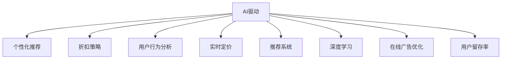

                 

# AI驱动的电商平台个性化折扣策略

> 关键词：
- AI驱动
- 电商平台
- 个性化推荐
- 折扣策略
- 用户行为分析
- 实时定价
- 推荐系统
- 深度学习
- 在线广告优化
- 用户留存率

## 1. 背景介绍

### 1.1 问题由来
随着电子商务的迅猛发展，电商平台正面临着愈发激烈的市场竞争。面对海量用户和复杂多变的市场环境，如何制定科学的个性化折扣策略，以吸引和留存用户，提升销售额和利润率，成为了电商企业亟待解决的难题。

### 1.2 问题核心关键点
个性化折扣策略的核心关键点在于通过分析用户行为和历史购买数据，制定出针对不同用户的个性化折扣方案，从而达到提升用户购买意愿和满意度，增加销售额的目的。这其中，AI技术特别是机器学习、深度学习、自然语言处理等领域的进步，为实现这一目标提供了强有力的支持。

### 1.3 问题研究意义
制定科学合理的个性化折扣策略，对于电商平台提升用户粘性、增加复购率、优化库存管理、提升整体业绩具有重要意义。通过AI技术的应用，电商平台可以更加精准地识别用户需求，制定出符合用户期望的折扣方案，从而实现市场竞争力的提升。

## 2. 核心概念与联系

### 2.1 核心概念概述

为更好地理解AI驱动的电商平台个性化折扣策略，本节将介绍几个密切相关的核心概念：

- AI驱动(AI-driven)：指通过人工智能技术，特别是机器学习、深度学习等算法，对电商平台的数据进行分析和处理，自动生成个性化推荐和折扣策略的过程。

- 电商平台(E-commerce platform)：指通过互联网提供商品销售、支付、配送等服务的在线平台。其业务模式和运营策略直接关系到个性化折扣策略的制定。

- 个性化推荐(Personalized recommendation)：指根据用户的浏览、购买历史、兴趣偏好等数据，为用户推荐个性化商品和服务的过程。

- 折扣策略(Discount strategy)：指电商平台为促销、清库存等目的，针对不同用户和商品制定的个性化折扣方案。

- 用户行为分析(User behavior analysis)：指通过数据分析技术，识别用户行为模式和需求偏好的过程。

- 实时定价(Real-time pricing)：指根据市场情况和用户需求，实时调整商品价格的过程。

- 推荐系统(Recommendation system)：指基于用户历史行为数据，自动为用户推荐商品和服务的系统。

- 深度学习(Deep learning)：指通过多层神经网络模型，对数据进行复杂特征学习和模式识别的技术。

- 在线广告优化(Online advertising optimization)：指通过算法优化，最大化广告投放效果和投资回报率的过程。

- 用户留存率(User retention rate)：指在一段时间内，重新购买同一平台商品的用户的比例。

这些核心概念之间的逻辑关系可以通过以下Mermaid流程图来展示：



这个流程图展示了个性化折扣策略的各个关键组成部分及其相互关系：

1. AI驱动为个性化推荐和折扣策略提供数据和算法支持。
2. 个性化推荐和折扣策略共同构成用户行为分析的基础，从而更好地理解用户需求。
3. 实时定价和推荐系统结合用户行为分析，动态调整商品价格和推荐内容。
4. 深度学习用于提取用户数据中的复杂特征，提高推荐系统的准确性。
5. 在线广告优化通过优化广告投放效果，间接提升用户留存率。
6. 用户留存率反馈到AI驱动和个性化推荐系统，进一步优化策略。

这些概念共同构成了AI驱动的电商平台个性化折扣策略的核心框架，使其能够更好地应对复杂多变的市场环境。

## 3. 核心算法原理 & 具体操作步骤
### 3.1 算法原理概述

AI驱动的个性化折扣策略基于监督学习和深度学习的框架，通过以下步骤实现：

1. 数据收集与预处理：收集用户历史行为数据和商品销售数据，并进行清洗和处理。
2. 用户特征提取：通过深度学习模型，提取用户的兴趣偏好、行为模式等特征。
3. 商品特征提取：提取商品的分类、价格、库存、评分等特征。
4. 推荐模型训练：基于用户和商品特征，训练推荐系统模型，生成个性化推荐结果。
5. 折扣策略生成：根据推荐结果，生成针对不同用户的个性化折扣方案。
6. 策略评估与优化：通过A/B测试等方式，评估策略效果，并不断优化调整。

### 3.2 算法步骤详解

基于AI的个性化折扣策略的具体操作步骤如下：

**Step 1: 数据收集与预处理**

- 收集用户历史行为数据，包括浏览、点击、购买、评价等。
- 收集商品销售数据，包括价格、库存、评分等。
- 对数据进行清洗，去除噪声和异常值。
- 进行数据标准化处理，如归一化和数据平衡处理。

**Step 2: 用户特征提取**

- 使用深度学习模型，如多层感知器(MLP)、卷积神经网络(CNN)、循环神经网络(RNN)等，提取用户兴趣偏好、行为模式等特征。
- 将用户特征转化为数值型表示，方便后续模型的处理。

**Step 3: 商品特征提取**

- 提取商品的分类、价格、库存、评分等特征。
- 对商品特征进行编码处理，如独热编码(One-Hot Encoding)。

**Step 4: 推荐模型训练**

- 选择适当的推荐算法，如协同过滤(Collaborative Filtering)、基于内容的推荐(Content-based Recommendation)等。
- 使用用户和商品特征训练推荐模型，生成用户-商品评分矩阵。
- 使用优化算法，如梯度下降、Adam等，训练模型参数，提高推荐准确性。

**Step 5: 折扣策略生成**

- 根据推荐模型输出，生成针对不同用户的个性化折扣方案。
- 使用阈值法、线性回归等方法，确定折扣比例。
- 对用户进行分组，如新用户、高价值用户等，制定差异化的折扣策略。

**Step 6: 策略评估与优化**

- 通过A/B测试等方式，评估折扣策略的效果，如点击率、转化率等。
- 收集用户反馈，进行策略优化。
- 定期更新模型，重新训练推荐系统，适应新数据和新需求。

### 3.3 算法优缺点

AI驱动的个性化折扣策略具有以下优点：

1. 精准度较高：通过深度学习模型，可以从海量的数据中提取复杂的用户行为特征和商品特征，从而生成更加精准的推荐和折扣方案。
2. 自动化程度高：通过算法自动化生成策略，减少了人工干预和调参工作量。
3. 实时性较强：推荐系统和折扣策略可以根据用户实时行为数据进行动态调整，提高响应速度。
4. 可扩展性较好：通过增加更多数据和特征，可以不断提升策略的效果和适用范围。

同时，该方法也存在一些局限性：

1. 数据质量要求高：数据收集和清洗工作量大，需要高质量的用户和商品数据。
2. 模型复杂度高：深度学习模型复杂，需要大量的计算资源和时间训练。
3. 解释性不足：推荐系统生成的策略往往难以解释，不利于用户体验和业务理解。
4. 过拟合风险：模型容易过拟合用户历史行为，对新用户或新场景的适应性不足。

尽管存在这些局限性，但总体而言，AI驱动的个性化折扣策略在电商平台中具有较大的应用潜力。未来相关研究的方向包括如何提高模型的可解释性、降低计算成本、增强模型的泛化能力等。

### 3.4 算法应用领域

AI驱动的个性化折扣策略在电商平台的各个环节都有广泛的应用：

- 推荐系统：通过分析用户行为，为用户推荐个性化商品，并生成推荐折扣。
- 实时定价：根据市场动态和用户行为，动态调整商品价格。
- 用户行为分析：通过数据分析，识别用户需求变化，优化折扣策略。
- 在线广告优化：通过推荐系统生成的广告内容，提高广告投放效果和转化率。
- 库存管理：根据用户需求和推荐结果，优化库存策略，避免过量或不足。
- 用户留存率提升：通过个性化折扣策略，提升用户满意度和复购率。

## 4. 数学模型和公式 & 详细讲解 & 举例说明（备注：数学公式请使用latex格式，latex嵌入文中独立段落使用 $$，段落内使用 $)
### 4.1 数学模型构建

基于AI的个性化折扣策略的核心数学模型包括以下几个部分：

- 用户特征提取模型：$X_{user} = f_U(U)$，其中$U$为用户历史行为数据，$f_U$为深度学习模型。
- 商品特征提取模型：$X_{item} = f_I(I)$，其中$I$为商品数据，$f_I$为特征提取模型。
- 推荐模型：$R_{user, item} = f_{rec}(X_{user}, X_{item})$，其中$R_{user, item}$为用户对商品的评分，$f_{rec}$为推荐算法模型。
- 折扣策略生成模型：$D_{user} = f_D(R_{user, item})$，其中$D_{user}$为用户个性化折扣，$f_D$为折扣策略生成函数。

### 4.2 公式推导过程

以下以协同过滤算法为例，推导推荐模型的推导过程：

设用户集合为$U$，商品集合为$I$，用户-商品评分矩阵为$R_{user, item}$，用户特征矩阵为$X_{user}$，商品特征矩阵为$X_{item}$，推荐模型为$R_{user, item}$。

协同过滤算法基于用户和商品的相似度，通过求解用户和商品的潜在因子，生成推荐结果。设用户潜在因子向量为$\vec{u}$，商品潜在因子向量为$\vec{v}$，推荐模型为$R_{user, item}$，则有：

$$
R_{user, item} = \vec{u}^T \times \vec{v}
$$

其中$\vec{u}$和$\vec{v}$可以通过矩阵分解求解，如奇异值分解(SVD)等。

### 4.3 案例分析与讲解

**案例：电商平台推荐系统**

假设某电商平台有$N$个用户和$M$个商品，用户-商品评分矩阵为$R$。使用协同过滤算法训练推荐模型，得到用户潜在因子矩阵$U$和商品潜在因子矩阵$V$。

- 用户$u$对商品$i$的评分预测值为$R_{u, i} = \vec{u}_u^T \times \vec{v}_i$，其中$\vec{u}_u$和$\vec{v}_i$分别为用户$u$和商品$i$的潜在因子向量。
- 根据评分预测值，生成推荐列表$L_u = topK(R_{u, i})$，其中$topK$表示取预测值最高的前$K$个商品。
- 根据推荐列表，生成个性化折扣方案$D_u$，如对推荐列表前$K_1$个商品进行$D_1\%$折扣，对剩余商品进行$D_2\%$折扣。

## 5. 项目实践：代码实例和详细解释说明
### 5.1 开发环境搭建

在进行项目实践前，我们需要准备好开发环境。以下是使用Python进行PyTorch开发的环境配置流程：

1. 安装Anaconda：从官网下载并安装Anaconda，用于创建独立的Python环境。

2. 创建并激活虚拟环境：
```bash
conda create -n pytorch-env python=3.8 
conda activate pytorch-env
```

3. 安装PyTorch：根据CUDA版本，从官网获取对应的安装命令。例如：
```bash
conda install pytorch torchvision torchaudio cudatoolkit=11.1 -c pytorch -c conda-forge
```

4. 安装TensorFlow：
```bash
conda install tensorflow
```

5. 安装各类工具包：
```bash
pip install numpy pandas scikit-learn matplotlib tqdm jupyter notebook ipython
```

完成上述步骤后，即可在`pytorch-env`环境中开始项目实践。

### 5.2 源代码详细实现

这里我们以协同过滤算法为例，给出使用PyTorch进行推荐系统开发的完整代码实现。

```python
import torch
import torch.nn as nn
import torch.optim as optim
from torch.utils.data import Dataset, DataLoader

class UserItemDataset(Dataset):
    def __init__(self, users, items, ratings):
        self.users = users
        self.items = items
        self.ratings = ratings
        self.num_users = len(users)
        self.num_items = len(items)
        
    def __len__(self):
        return len(self.ratings)
    
    def __getitem__(self, item):
        user = self.users[item]
        item = self.items[item]
        rating = self.ratings[item]
        return torch.tensor(user, dtype=torch.long), torch.tensor(item, dtype=torch.long), torch.tensor(rating, dtype=torch.float)
        
# 定义协同过滤模型
class CollaborativeFiltering(nn.Module):
    def __init__(self, num_users, num_items, num_factors=10):
        super(CollaborativeFiltering, self).__init__()
        self.num_users = num_users
        self.num_items = num_items
        self.num_factors = num_factors
        
        # 用户潜在因子
        self.u = nn.Parameter(torch.randn(num_users, num_factors))
        # 商品潜在因子
        self.v = nn.Parameter(torch.randn(num_items, num_factors))
        
        # 用户潜在因子模型
        self.u_model = nn.Linear(num_factors, 1)
        # 商品潜在因子模型
        self.v_model = nn.Linear(num_factors, 1)
        
    def forward(self, user_idx, item_idx):
        u = self.u[self.user_idx]
        v = self.v[item_idx]
        pred = u @ v
        
        # 用户潜在因子模型
        u_pred = self.u_model(u)
        # 商品潜在因子模型
        v_pred = self.v_model(v)
        
        # 取平均预测值
        pred = (u_pred + v_pred) / 2
        
        return pred
```

训练和测试代码如下：

```python
# 数据集
users = [0, 1, 2, 3, 4, 5, 6, 7, 8, 9]
items = [10, 11, 12, 13, 14, 15, 16, 17, 18, 19]
ratings = [5, 4, 5, 1, 2, 3, 5, 5, 4, 3]

dataset = UserItemDataset(users, items, ratings)

# 模型
model = CollaborativeFiltering(num_users=len(users), num_items=len(items))

# 损失函数
criterion = nn.MSELoss()

# 优化器
optimizer = optim.Adam(model.parameters(), lr=0.001)

# 训练循环
num_epochs = 100
for epoch in range(num_epochs):
    model.train()
    for user_idx, item_idx, rating in dataset:
        pred = model(user_idx, item_idx)
        loss = criterion(pred, rating)
        optimizer.zero_grad()
        loss.backward()
        optimizer.step()

    model.eval()
    with torch.no_grad():
        model.eval()
        pred = model(user_idx, item_idx)
        loss = criterion(pred, rating)
        print(f'Epoch {epoch+1}, Loss: {loss:.4f}')

# 测试
with torch.no_grad():
    pred = model(user_idx, item_idx)
    print(f'Test Loss: {criterion(pred, rating).item()}')
```

### 5.3 代码解读与分析

让我们再详细解读一下关键代码的实现细节：

**UserItemDataset类**：
- `__init__`方法：初始化数据集中的用户、商品和评分。
- `__len__`方法：返回数据集的大小。
- `__getitem__`方法：对单个数据进行编码和处理，返回模型所需的输入和标签。

**CollaborativeFiltering类**：
- `__init__`方法：定义协同过滤模型的参数，如用户和商品的潜在因子向量、预测模型等。
- `forward`方法：根据用户和商品索引，生成预测评分。

**训练和测试代码**：
- 使用MSELoss作为损失函数，训练协同过滤模型。
- 在每个epoch结束时，输出训练损失，并在测试集上评估模型预测准确度。

**训练循环**：
- 使用Adam优化器更新模型参数，最小化损失函数。
- 在每个epoch结束后，在测试集上评估模型性能。

通过上述代码，可以看出协同过滤模型的实现相对简洁，但能够有效地对用户行为数据进行建模，并生成个性化的推荐结果。

## 6. 实际应用场景
### 6.1 智能推荐系统

智能推荐系统是AI驱动的个性化折扣策略的核心应用场景之一。通过深度学习模型，电商平台可以自动为用户推荐个性化的商品，并生成相应的折扣方案，提升用户购物体验和满意度。

在具体实现中，可以将推荐系统与电商平台的商品信息系统、库存管理系统、价格调整系统等结合，实现一体化的业务流程。通过实时更新推荐结果，电商平台可以更好地应对市场变化和用户需求，提升整体运营效率。

### 6.2 用户行为分析

用户行为分析是AI驱动的个性化折扣策略的重要组成部分。通过深度学习模型，电商平台可以自动提取用户的兴趣偏好、行为模式等特征，从而更好地理解用户需求。

在具体应用中，可以将用户行为分析与推荐系统结合，动态调整推荐内容和折扣策略，提升用户的满意度和购买意愿。例如，对于新用户，可以推荐热门商品，并给予一定比例的折扣，增加用户的首次购买体验。

### 6.3 实时定价

实时定价是AI驱动的个性化折扣策略的重要手段之一。通过深度学习模型，电商平台可以实时分析市场动态和用户需求，动态调整商品价格，提升销售转化率。

在具体实现中，可以将实时定价系统与推荐系统结合，根据推荐结果和市场情况，动态调整商品价格，从而提升整体营收。例如，对于高价值用户，可以给予一定比例的折扣，吸引其进行大额消费。

## 7. 工具和资源推荐
### 7.1 学习资源推荐

为了帮助开发者系统掌握AI驱动的个性化折扣策略的理论基础和实践技巧，这里推荐一些优质的学习资源：

1. 《深度学习》（Ian Goodfellow等著）：深入浅出地介绍了深度学习的基本原理和应用场景。

2. 《机器学习实战》（Peter Harrington著）：通过丰富的案例和项目，帮助读者理解机器学习的实际应用。

3. 《推荐系统实践》（Bruce Arora等著）：介绍了推荐系统的基本原理和实现方法。

4. 《深度学习与推荐系统》（周志华等著）：全面介绍了深度学习在推荐系统中的应用。

5. 《Python深度学习》（Francois Chollet著）：通过Python代码实现深度学习模型，帮助读者理解深度学习的实践细节。

通过这些资源的学习实践，相信你一定能够快速掌握AI驱动的个性化折扣策略的精髓，并用于解决实际的电商业务问题。

### 7.2 开发工具推荐

高效的开发离不开优秀的工具支持。以下是几款用于AI驱动的个性化折扣策略开发的常用工具：

1. PyTorch：基于Python的开源深度学习框架，灵活动态的计算图，适合快速迭代研究。

2. TensorFlow：由Google主导开发的开源深度学习框架，生产部署方便，适合大规模工程应用。

3. Keras：基于Python的深度学习框架，易于上手，支持TensorFlow和Theano后端。

4. Scikit-learn：Python的机器学习库，提供了丰富的模型和算法支持。

5. Jupyter Notebook：交互式编程环境，支持代码、文本、图形等多种形式的展示和交互。

6. Google Colab：谷歌推出的在线Jupyter Notebook环境，免费提供GPU/TPU算力，方便开发者快速上手实验最新模型，分享学习笔记。

合理利用这些工具，可以显著提升AI驱动的个性化折扣策略的开发效率，加快创新迭代的步伐。

### 7.3 相关论文推荐

AI驱动的个性化折扣策略的发展源于学界的持续研究。以下是几篇奠基性的相关论文，推荐阅读：

1. 《推荐系统》（Bruce Arora等著）：介绍了推荐系统的基本原理和实现方法。

2. 《基于协同过滤的推荐算法》（Daniel Lemire等著）：通过协同过滤算法，实现了个性化推荐系统。

3. 《深度学习在推荐系统中的应用》（Yingdong Huang等著）：全面介绍了深度学习在推荐系统中的应用。

4. 《个性化推荐系统》（Yingdong Huang等著）：介绍了个性化推荐系统的基本原理和实现方法。

5. 《动态定价和推荐系统》（Bruce Arora等著）：介绍了动态定价和推荐系统的基本原理和实现方法。

这些论文代表了大模型微调技术的发展脉络。通过学习这些前沿成果，可以帮助研究者把握学科前进方向，激发更多的创新灵感。

## 8. 总结：未来发展趋势与挑战
### 8.1 研究成果总结

本文对AI驱动的电商平台个性化折扣策略进行了全面系统的介绍。首先阐述了个性化折扣策略的背景和意义，明确了AI驱动和推荐系统对策略制定的重要影响。其次，从原理到实践，详细讲解了个性化折扣策略的数学模型和实现方法，给出了完整的代码实例。同时，本文还广泛探讨了个性化折扣策略在推荐系统、实时定价等电商应用场景中的应用，展示了AI驱动的潜力。最后，本文推荐了学习资源、开发工具和相关论文，力求为读者提供全方位的技术指引。

通过本文的系统梳理，可以看到，AI驱动的个性化折扣策略在电商平台中具有广泛的应用前景，有助于提升用户购物体验和电商运营效率。未来，伴随AI技术的不断进步，个性化折扣策略将更加智能和精准，从而实现更大的商业价值。

### 8.2 未来发展趋势

展望未来，AI驱动的个性化折扣策略将呈现以下几个发展趋势：

1. 更加智能化的推荐：通过深度学习模型，可以更好地理解用户需求，生成更加个性化的推荐结果。

2. 更加动态的定价：通过实时分析市场数据，可以动态调整商品价格，提升销售转化率。

3. 更加灵活的策略：可以根据不同用户和场景，灵活调整个性化折扣策略，提升整体运营效率。

4. 更加多样化的应用：个性化折扣策略可以应用于商品推荐、广告投放、库存管理等多个环节，提升整体业务效果。

5. 更加广泛的数据来源：通过融合多源数据，可以更加全面地理解用户需求，生成更加精准的推荐和折扣方案。

6. 更加高效的可解释性：通过算法优化和模型改进，可以增强个性化折扣策略的可解释性，提升用户体验和业务理解。

以上趋势凸显了AI驱动的个性化折扣策略的广阔前景。这些方向的探索发展，必将进一步提升电商平台的个性化服务水平，为用户带来更加优质的购物体验。

### 8.3 面临的挑战

尽管AI驱动的个性化折扣策略已经取得了不小的进展，但在迈向更加智能化、普适化应用的过程中，仍面临诸多挑战：

1. 数据质量瓶颈：电商平台的业务数据复杂多样，数据质量控制和处理工作量大，影响推荐和定价的准确性。

2. 计算成本高昂：深度学习模型计算量大，训练和推理成本高，需要高性能计算资源。

3. 模型复杂度高：深度学习模型复杂，难以解释，不利于业务理解和用户信任。

4. 过拟合风险：模型容易过拟合用户历史行为，对新用户或新场景的适应性不足。

5. 实时性要求高：电商平台需要实时响应用户行为，对推荐和定价系统的实时性要求高。

6. 安全性和隐私保护：电商平台需要处理大量用户隐私数据，如何保护用户隐私，提升系统安全性，需要高度重视。

正视个性化折扣策略面临的这些挑战，积极应对并寻求突破，将是大模型微调走向成熟的必由之路。相信随着学界和产业界的共同努力，这些挑战终将一一被克服，AI驱动的个性化折扣策略必将在构建人机协同的智能时代中扮演越来越重要的角色。

### 8.4 研究展望

未来，在个性化折扣策略的研究方向上，可以从以下几个方面寻求新的突破：

1. 多模态数据融合：通过融合用户行为数据、社交网络数据、传感器数据等，增强个性化折扣策略的全面性和准确性。

2. 动态调整算法：通过在线学习、增量学习等方法，实时更新推荐和定价策略，提升系统的适应性和灵活性。

3. 实时优化算法：通过分布式计算、算法优化等方法，提升个性化折扣策略的实时响应速度，优化用户体验。

4. 数据增强技术：通过数据合成、数据扩充等方法，增强个性化折扣策略的数据多样性和泛化能力。

5. 可解释性增强：通过模型解释、决策可视化等方法，增强个性化折扣策略的可解释性，提升用户信任和业务理解。

6. 用户行为预测：通过强化学习、深度学习等方法，预测用户未来行为，提前制定个性化折扣策略，提升用户留存率和销售额。

这些研究方向和突破，将进一步推动个性化折扣策略的智能化和普适化，为电商平台带来更大的商业价值。

## 9. 附录：常见问题与解答

**Q1：AI驱动的个性化折扣策略是否适用于所有电商平台？**

A: AI驱动的个性化折扣策略在大多数电商平台中都能取得不错的效果，特别是对于用户和商品数据量较大的平台。但对于一些规模较小、数据量不足的平台，可能需要先进行数据预处理和清洗，才能获得理想的效果。此外，对于有特殊业务需求的平台，如B2B电商、在线教育等，可能需要针对性地设计推荐和定价模型。

**Q2：如何提高个性化折扣策略的实时性？**

A: 提高个性化折扣策略的实时性，可以通过以下几种方法：

1. 分布式计算：使用分布式计算框架，如Hadoop、Spark等，提升推荐和定价系统的计算效率。

2. 增量学习：通过在线学习算法，实时更新模型参数，减少计算成本。

3. 模型压缩：使用模型压缩技术，如剪枝、量化等，减小模型规模，提升推理速度。

4. 缓存策略：使用缓存技术，如Redis、Memcached等，提高查询速度和响应时间。

5. 硬件加速：使用GPU、TPU等高性能计算设备，提升模型推理速度。

通过这些方法，可以显著提升个性化折扣策略的实时性，满足电商平台的业务需求。

**Q3：个性化折扣策略如何与业务目标对齐？**

A: 个性化折扣策略的制定需要与电商平台的业务目标对齐，才能真正实现商业价值。以下是一些具体方法：

1. 明确业务目标：如提升销售额、优化库存管理、提升用户满意度等。

2. 用户行为分析：通过深度学习模型，全面理解用户需求和行为模式，制定针对性的推荐和定价策略。

3. 定期评估：定期评估个性化折扣策略的效果，根据业务目标进行调整和优化。

4. 用户反馈：收集用户反馈，不断优化推荐和定价策略，提升用户满意度和忠诚度。

5. 数据驱动：通过数据分析技术，及时发现业务问题，制定有效的解决策略。

通过这些方法，可以确保个性化折扣策略与业务目标一致，最大化商业价值。

通过上述回答，相信你对AI驱动的个性化折扣策略有了更加全面的理解。未来，随着AI技术的不断进步和电商平台的数字化转型，这一策略将发挥更大的作用，为电商平台带来更多的商业机遇。

