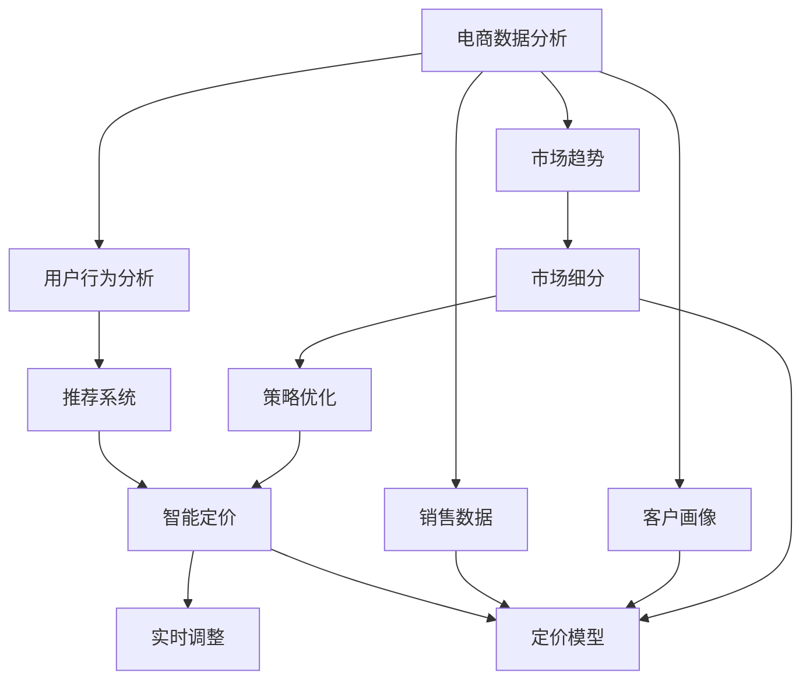

                 

# AI驱动的电商平台智能定价系统

> 关键词：电商平台,智能定价,人工智能,机器学习,深度学习,策略优化

## 1. 背景介绍

在现代电商平台上，定价策略至关重要。良好的定价不仅能提升销售额，还能优化库存管理和利润率。然而，传统的定价策略通常依赖于经验丰富的人员和手动调整，难以兼顾速度和效率。人工智能（AI）技术的引入，为电商平台带来了智能定价的解决方案。

## 2. 核心概念与联系

### 2.1 核心概念概述

为了深入理解AI驱动的智能定价系统，我们将介绍几个核心概念及其联系：

- **智能定价**：通过机器学习和人工智能技术，自动调整商品价格以优化销售策略，提高利润率。
- **机器学习（ML）**：指利用数据和算法，让计算机系统通过学习数据规律，自动提升性能或做出预测。
- **深度学习（DL）**：是机器学习的一个分支，利用深度神经网络处理复杂数据，进行高级模式识别和预测。
- **策略优化**：指通过数学模型和算法，寻找最优的决策方案。
- **电商数据分析**：对电商平台的销售数据、客户行为等进行分析，以支持智能定价。
- **推荐系统**：利用用户行为数据，个性化推荐商品，提升用户体验和销售转化率。

这些概念相互关联，共同构成了智能定价系统的基础。通过机器学习和深度学习技术，可以实时分析大量数据，进行定价策略优化，实现个性化推荐，从而提升电商平台的整体运营效率和盈利能力。

### 2.2 核心概念原理和架构的 Mermaid 流程图



这个流程图展示了智能定价系统的核心架构：
- **电商数据分析**：获取并分析销售数据、客户画像、市场趋势等关键数据。
- **用户行为分析**：通过数据分析，理解用户行为，进行个性化推荐。
- **推荐系统**：基于用户行为和历史数据，个性化推荐商品。
- **智能定价**：基于定价模型和实时数据分析，自动调整商品价格。
- **策略优化**：优化定价策略，实现动态调整和价格监控。
- **实时调整**：根据实时数据，动态调整商品价格。

## 3. 核心算法原理 & 具体操作步骤
### 3.1 算法原理概述

智能定价系统的核心原理是通过机器学习模型预测商品的潜在需求，并基于此进行动态调价。其步骤如下：

1. **数据收集**：收集历史销售数据、客户行为数据、市场趋势数据等。
2. **特征提取**：从收集的数据中提取有意义的特征，如用户购买频率、商品类别、促销活动等。
3. **模型训练**：使用机器学习模型（如线性回归、决策树、随机森林、神经网络等），对历史数据进行训练，生成定价模型。
4. **实时预测**：基于实时数据和定价模型，预测商品的潜在需求。
5. **定价调整**：根据预测结果，动态调整商品价格，优化销售策略。
6. **策略优化**：持续优化定价模型，提高预测准确性和调价效果。

### 3.2 算法步骤详解

以神经网络模型为例，具体步骤如下：

**Step 1: 数据准备**

- **数据集**：收集历史销售数据、客户行为数据、市场趋势数据等。
- **数据预处理**：清洗数据，处理缺失值和异常值，标准化数据格式。

**Step 2: 特征工程**

- **特征选择**：选择有意义的特征，如用户购买频率、商品类别、促销活动等。
- **特征构建**：创建新的特征，如用户消费金额、平均购买价格等。

**Step 3: 模型训练**

- **选择模型**：选择适合的神经网络模型（如多层感知器、卷积神经网络、循环神经网络等）。
- **划分数据集**：将数据集划分为训练集、验证集和测试集。
- **模型训练**：使用训练集训练模型，调整超参数，优化模型性能。

**Step 4: 实时预测**

- **实时数据获取**：获取实时销售数据、用户行为数据等。
- **数据预处理**：对实时数据进行预处理，标准化格式。
- **预测价格**：基于定价模型，预测商品实时价格。

**Step 5: 定价调整**

- **价格调整策略**：根据预测价格，制定价格调整策略，如折扣、促销活动等。
- **价格更新**：根据策略，实时更新商品价格。

**Step 6: 策略优化**

- **模型评估**：在测试集上评估模型性能，识别改进空间。
- **模型优化**：调整模型参数，改进模型性能。
- **持续监控**：持续监控模型性能，实时调整价格策略。

### 3.3 算法优缺点

**优点**：
- **自动化**：自动处理大量数据，提升效率。
- **实时性**：实时调整价格，提升响应速度。
- **个性化**：基于用户行为数据，进行个性化定价。
- **成本优化**：优化库存管理和商品定价，提升利润率。

**缺点**：
- **数据依赖**：需要大量的历史数据进行训练，获取高质量数据成本高。
- **模型复杂**：深度学习模型复杂，需要较高的计算资源。
- **模型解释性**：神经网络模型通常难以解释决策过程，缺乏透明度。
- **动态环境适应**：模型需要持续优化，适应动态的市场环境。

### 3.4 算法应用领域

智能定价系统广泛应用于电商、金融、旅游等多个领域：

- **电商**：提升商品销售量，优化库存管理，提升利润率。
- **金融**：进行股票定价，优化投资组合，提升投资回报率。
- **旅游**：动态调整机票价格，提升销售量，优化预订策略。
- **医疗**：调整药品价格，优化医疗资源分配，提升医院收入。

## 4. 数学模型和公式 & 详细讲解 & 举例说明

### 4.1 数学模型构建

智能定价系统涉及多个数学模型，包括回归模型、分类模型和神经网络模型等。以线性回归模型为例，其数学模型如下：

$$
y = \theta_0 + \theta_1 x_1 + \theta_2 x_2 + ... + \theta_n x_n + \epsilon
$$

其中，$y$ 为预测价格，$\theta_0$ 为截距，$\theta_1, \theta_2, ..., \theta_n$ 为特征系数，$x_1, x_2, ..., x_n$ 为特征变量，$\epsilon$ 为误差项。

### 4.2 公式推导过程

以线性回归模型为例，推导其参数求解公式：

1. **最小二乘法**：求解最小化误差平方和的目标函数：

$$
\sum_{i=1}^n (y_i - \hat{y}_i)^2
$$

其中，$\hat{y}_i = \theta_0 + \theta_1 x_{i1} + \theta_2 x_{i2} + ... + \theta_n x_{in}$。

2. **正规方程**：求解目标函数的最小值，得到参数估计公式：

$$
\theta = (X^T X)^{-1} X^T y
$$

其中，$X$ 为特征矩阵，$y$ 为目标向量。

### 4.3 案例分析与讲解

假设某电商平台收集了历史销售数据，包括商品类别、促销活动、销售数量、销售价格等。使用线性回归模型，训练一个智能定价系统，预测新商品的定价。

- **数据准备**：收集历史销售数据，标准化数据格式。
- **特征工程**：选择商品类别、促销活动、销售数量等特征。
- **模型训练**：使用历史数据训练线性回归模型，求解参数 $\theta_0, \theta_1, \theta_2$。
- **实时预测**：获取新商品的类别和促销活动，输入模型进行价格预测。
- **定价调整**：根据预测价格，制定定价策略，实时调整价格。

## 5. 项目实践：代码实例和详细解释说明

### 5.1 开发环境搭建

为了实现智能定价系统，我们需要搭建Python开发环境，并安装必要的库和工具。

1. **环境安装**：
   - 安装Anaconda：从官网下载并安装Anaconda，用于创建独立的Python环境。
   - 创建虚拟环境：
     ```bash
     conda create -n ai_env python=3.8
     conda activate ai_env
     ```
   - 安装相关库：
     ```bash
     pip install pandas numpy scikit-learn tensorflow keras
     ```

2. **数据准备**：
   - 收集历史销售数据，标准化数据格式。
   - 将数据划分为训练集、验证集和测试集。

### 5.2 源代码详细实现

以下是基于TensorFlow的智能定价系统代码实现：

```python
import tensorflow as tf
from tensorflow.keras.layers import Dense
from tensorflow.keras.models import Sequential
from tensorflow.keras.optimizers import Adam

# 准备数据
# 假设 X 为特征矩阵，y 为目标向量

# 构建模型
model = Sequential()
model.add(Dense(units=32, activation='relu', input_dim=X.shape[1]))
model.add(Dense(units=1))

# 编译模型
model.compile(loss='mean_squared_error', optimizer=Adam(lr=0.001), metrics=['mse'])

# 训练模型
model.fit(X_train, y_train, epochs=100, batch_size=32, validation_data=(X_val, y_val))

# 预测价格
y_pred = model.predict(X_test)
```

### 5.3 代码解读与分析

**数据准备**：
- **数据收集**：收集历史销售数据、客户行为数据、市场趋势数据等。
- **数据清洗**：处理缺失值和异常值，标准化数据格式。
- **数据划分**：将数据划分为训练集、验证集和测试集。

**模型构建**：
- **选择模型**：选择适合的神经网络模型（如多层感知器、卷积神经网络、循环神经网络等）。
- **模型搭建**：搭建神经网络模型，添加层和激活函数。
- **模型编译**：选择损失函数和优化器，编译模型。

**模型训练**：
- **模型训练**：使用训练集训练模型，调整超参数，优化模型性能。
- **模型评估**：在验证集上评估模型性能，识别改进空间。

**实时预测**：
- **实时数据获取**：获取实时销售数据、用户行为数据等。
- **数据预处理**：对实时数据进行预处理，标准化格式。
- **预测价格**：基于定价模型，预测商品实时价格。

**定价调整**：
- **价格调整策略**：根据预测价格，制定价格调整策略，如折扣、促销活动等。
- **价格更新**：根据策略，实时更新商品价格。

**策略优化**：
- **模型评估**：在测试集上评估模型性能，识别改进空间。
- **模型优化**：调整模型参数，改进模型性能。
- **持续监控**：持续监控模型性能，实时调整价格策略。

### 5.4 运行结果展示

运行代码后，可以得到模型在测试集上的预测结果和性能指标，如MSE（均方误差）等。根据这些结果，可以进一步优化模型和定价策略，提升智能定价系统的性能。

## 6. 实际应用场景

### 6.1 电商场景

在电商平台上，智能定价系统可以实时调整商品价格，提升销售量和利润率。例如，对于热销商品，可以通过提高价格和促销活动，最大化收入。对于滞销商品，可以通过降价和推广活动，加速销售。

**案例**：某电商平台发现一款新上市的商品销量不佳，通过智能定价系统分析用户购买行为和市场趋势，识别出用户对该商品的兴趣和购买意愿不足。系统自动调整价格，并推荐相关商品进行搭配销售，最终成功提升了该商品的销售量。

### 6.2 金融场景

在金融领域，智能定价系统可以用于股票定价和投资组合优化。例如，根据市场趋势和用户行为，实时调整股票价格和投资组合，优化投资回报率。

**案例**：某投资公司使用智能定价系统分析市场数据和用户交易行为，自动调整投资组合中的股票权重和价格，实现了更高的投资回报率。

### 6.3 旅游场景

在旅游领域，智能定价系统可以用于机票和酒店定价。例如，根据季节和用户预订行为，动态调整机票和酒店价格，提升销售量。

**案例**：某旅游平台使用智能定价系统分析用户预订数据和市场趋势，实时调整机票和酒店价格，成功提升了平台的销售量和用户满意度。

## 7. 工具和资源推荐

### 7.1 学习资源推荐

为了快速掌握智能定价系统的开发和应用，推荐以下学习资源：

1. **《Python数据科学手册》**：该书详细介绍了Python在数据科学中的应用，包括数据处理、机器学习、深度学习等。
2. **《深度学习》课程**：斯坦福大学开设的深度学习课程，涵盖深度学习的基本概念和常用算法。
3. **TensorFlow官方文档**：提供了TensorFlow的详细文档和样例代码，是学习TensorFlow的重要资源。
4. **Kaggle竞赛**：Kaggle上有很多智能定价相关的竞赛，可以通过参与竞赛，学习实战经验。
5. **《机器学习实战》书籍**：该书介绍了机器学习的基本概念和实用技巧，适合初学者和进阶者。

### 7.2 开发工具推荐

以下是几款用于智能定价系统开发的常用工具：

1. **TensorFlow**：Google开发的深度学习框架，支持多种机器学习算法和深度神经网络模型。
2. **Keras**：基于TensorFlow的高级API，提供了简单易用的接口，适合快速原型开发。
3. **PyTorch**：Facebook开发的深度学习框架，支持动态计算图和GPU加速。
4. **Jupyter Notebook**：交互式编程环境，支持Python和R等语言，适合数据科学和机器学习开发。
5. **Amazon SageMaker**：亚马逊提供的云服务平台，支持模型训练、部署和监控，适合大规模部署。

### 7.3 相关论文推荐

以下是几篇关于智能定价的著名论文，推荐阅读：

1. **《神经网络定价与库存管理的实验》**：研究了使用神经网络进行动态定价和库存管理的方法。
2. **《基于深度学习的定价优化》**：探讨了使用深度学习进行商品定价和销售预测的方法。
3. **《机器学习与定价策略》**：分析了机器学习在定价策略优化中的应用。

## 8. 总结：未来发展趋势与挑战

### 8.1 研究成果总结

智能定价系统通过机器学习和深度学习技术，实现了商品定价的自动化和智能化。该技术已经被广泛应用于电商平台、金融市场和旅游业等多个领域，显著提升了运营效率和盈利能力。未来，随着技术的不断进步，智能定价系统将更加智能、高效和个性化。

### 8.2 未来发展趋势

1. **实时性增强**：实时获取和分析数据，实现实时定价和动态调整。
2. **个性化优化**：基于用户行为数据，实现更加个性化的定价策略。
3. **多模态融合**：结合图像、视频、语音等多模态数据，提升定价系统的智能化水平。
4. **自动化程度提高**：进一步降低人工干预，实现自动化的定价和策略优化。
5. **算法透明性增强**：提升模型的可解释性和透明度，提高决策的可信度和接受度。

### 8.3 面临的挑战

尽管智能定价系统已经取得了显著进展，但在推广应用的过程中，仍面临诸多挑战：

1. **数据隐私**：大量用户行为数据的收集和使用，需要严格的隐私保护措施。
2. **模型复杂性**：深度学习模型的复杂性较高，需要较高的计算资源和专业知识。
3. **鲁棒性问题**：模型需要具备较强的鲁棒性，以应对异常数据和动态市场环境。
4. **算法透明性**：模型的决策过程需要透明和可解释，以提高用户信任和接受度。
5. **资源需求**：实时定价和动态调整需要大量的计算资源和存储空间。

### 8.4 研究展望

未来的研究需要在以下几个方面寻求新的突破：

1. **数据隐私保护**：加强用户数据的隐私保护，确保数据安全。
2. **模型简化**：优化模型结构，提高计算效率和可解释性。
3. **鲁棒性提升**：增强模型的鲁棒性，应对异常数据和市场变化。
4. **多模态融合**：结合多模态数据，提升定价系统的智能化水平。
5. **算法透明性**：提升模型的可解释性，提高用户信任和接受度。

## 9. 附录：常见问题与解答

**Q1: 智能定价系统如何处理数据隐私问题？**

A: 智能定价系统需要收集和分析用户数据，为确保数据隐私，可以采取以下措施：
1. **数据匿名化**：对用户数据进行匿名化处理，去除敏感信息。
2. **数据加密**：使用加密技术保护数据传输和存储的安全。
3. **隐私政策透明**：明确告知用户数据的使用范围和目的，取得用户同意。
4. **数据访问控制**：严格控制数据访问权限，防止未经授权的访问。

**Q2: 智能定价系统的模型如何选择？**

A: 智能定价系统的模型选择取决于具体的应用场景和数据特点。常见的模型包括：
1. **线性回归模型**：适用于预测连续变量的场景，如股票价格、商品价格等。
2. **决策树和随机森林**：适用于分类和预测场景，如市场细分、用户分类等。
3. **神经网络模型**：适用于复杂的数据预测和分类场景，如深度学习、卷积神经网络等。

**Q3: 智能定价系统的实时性如何保证？**

A: 智能定价系统的实时性可以通过以下措施保证：
1. **高效算法**：使用高效的算法和数据结构，如GPU加速、分布式计算等。
2. **数据缓存**：使用缓存技术，存储常用数据，减少查询时间。
3. **异步处理**：使用异步处理技术，将计算任务分解为多个子任务，并行处理。

**Q4: 智能定价系统的可解释性如何提升？**

A: 智能定价系统的可解释性可以通过以下措施提升：
1. **模型简化**：优化模型结构，提高可解释性。
2. **特征可视化**：使用可视化工具，展示模型的输入和输出特征。
3. **模型解释工具**：使用模型解释工具，如LIME、SHAP等，分析模型的决策过程。

**Q5: 智能定价系统的资源需求如何优化？**

A: 智能定价系统的资源需求可以通过以下措施优化：
1. **模型压缩**：使用模型压缩技术，减小模型大小，降低计算需求。
2. **分布式计算**：使用分布式计算技术，提高计算效率，降低单点故障风险。
3. **云服务平台**：使用云服务平台，如AWS、Google Cloud等，按需扩展计算资源。

---

作者：禅与计算机程序设计艺术 / Zen and the Art of Computer Programming

