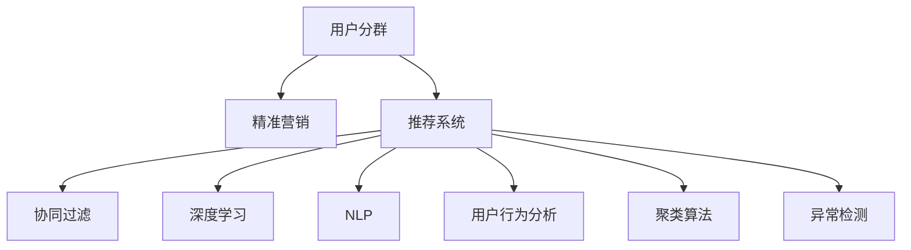

                 

# AI驱动的电商平台用户分群与精准营销

> 关键词：用户分群,精准营销,推荐系统,个性化推荐,协同过滤,深度学习,电商应用,自然语言处理(NLP),用户行为分析,聚类算法,异常检测

## 1. 背景介绍

在当下激烈的电商竞争中，如何更好地理解用户需求、精准触达和转化用户，是各大电商平台都在不断探索的重要课题。传统电商营销往往依赖人工策划、粗放广告投放等方式，不仅成本高，且效果难控。随着大数据、人工智能技术的普及，电商平台逐步向数据驱动、智能营销方向转型。通过用户行为分析、推荐系统等技术，电商平台能够更好地把握用户需求，提升转化率，实现更高的商业价值。

用户分群和精准营销作为电商平台的两大核心技术，相辅相成。用户分群通过对用户进行细粒度的分类，可以更好地进行个性化推荐、定向广告投放，提升营销效率。精准营销则是通过智能化的策略和内容，针对不同用户群体制定独特的营销方案，最大化用户转化。本文将详细介绍这两种技术的核心算法和操作步骤，并结合实际应用场景进行分析。

## 2. 核心概念与联系

### 2.1 核心概念概述

为了更好地理解用户分群和精准营销的技术原理，我们先来介绍几个关键概念：

- **用户分群(User Segmentation)**：将电商平台的用户根据其行为、兴趣、特征等进行分类，形成具有相似属性的用户群体。用户分群是精准营销的基础，可以更精准地匹配用户和产品，实现更高效的转化。

- **精准营销(Precision Marketing)**：在用户分群的基础上，利用AI技术对不同群体制定有针对性的营销策略，包括个性化的内容推荐、定向广告投放等。精准营销的核心是分析用户行为和兴趣，以数据驱动的方式提升转化率。

- **推荐系统(Recommendation System)**：根据用户的历史行为和偏好，为其推荐可能感兴趣的商品和服务。推荐系统是用户分群的重要应用，通过用户的反馈数据不断优化推荐算法，提升推荐效果。

- **协同过滤(Collaborative Filtering)**：基于用户间的相似度进行推荐，包括基于用户的协同过滤和基于物品的协同过滤。协同过滤是推荐系统的主流算法之一，尤其在商品和内容推荐中表现优异。

- **深度学习(Deep Learning)**：一种基于神经网络的学习方法，可以自动提取特征、进行分类、回归等任务。深度学习在电商平台的个性化推荐和精准营销中得到广泛应用，通过大量数据训练模型，提升推荐精度和营销效果。

- **自然语言处理(Natural Language Processing, NLP)**：处理和理解自然语言的技术，在用户评论分析、情感分析、关键词提取等方面有重要应用，可以提升对用户需求的理解。

- **用户行为分析(User Behavior Analysis)**：分析用户在电商平台上的浏览、点击、购买等行为，挖掘用户的兴趣和需求，为个性化推荐和精准营销提供依据。

- **聚类算法(Clustering Algorithm)**：通过对数据进行聚类，发现数据间的相似性，从而实现用户分群。常见的聚类算法包括K-means、层次聚类、DBSCAN等。

- **异常检测(Anomaly Detection)**：识别数据中的异常值，及时发现用户行为异常，进行风险防控。异常检测在电商平台中用于检测欺诈行为、异常购买等。

这些概念之间的逻辑关系可以通过以下Mermaid流程图来展示：



这个流程图展示了几大关键概念的联系：

1. 用户分群通过对用户行为分析，结合协同过滤、聚类算法等技术，形成不同用户群体。
2. 推荐系统通过对用户分群和行为分析，应用深度学习和NLP技术，生成个性化推荐。
3. 精准营销根据用户分群和推荐结果，应用协同过滤和异常检测等技术，制定个性化营销策略。

通过理解这些核心概念，我们可以更好地把握用户分群和精准营销的工作原理和优化方向。

## 3. 核心算法原理 & 具体操作步骤
### 3.1 算法原理概述

用户分群和精准营销的核心算法原理，本质上是通过数据分析和机器学习技术，对用户进行聚类和特征提取，从而实现用户分群和个性化营销。其核心思想是：

- 对用户的各种行为数据进行聚类分析，将相似用户分到同一群体。
- 通过深度学习等技术提取用户的隐含特征，更好地刻画用户需求和兴趣。
- 应用协同过滤等算法进行推荐，为用户提供个性化内容。
- 根据用户的互动情况，进行持续学习和优化，提升推荐和营销效果。

在具体算法实现上，主要包括以下步骤：

1. 数据采集与预处理：收集用户的历史行为数据，并进行清洗和标准化。
2. 特征提取与选择：应用深度学习等技术，从用户数据中提取关键特征。
3. 用户分群与优化：应用聚类算法，对用户进行分群，并根据群体的反馈不断优化。
4. 推荐系统实现：应用协同过滤等算法，生成个性化推荐。
5. 精准营销策略：根据用户分群和推荐结果，制定个性化营销策略，并进行效果评估和优化。

### 3.2 算法步骤详解

以下是详细的操作步骤和具体实现方法：

#### 3.2.1 数据采集与预处理

1. **数据采集**：电商平台的数据来源多样，包括用户的基本信息、行为数据、交易数据、评论数据等。需要设计合理的API接口，收集这些数据，并存储到数据库中。

2. **数据清洗与标准化**：用户数据可能包含噪声和缺失值，需要进行清洗和标准化处理。例如去除重复数据、填补缺失值、转换数据类型等。

3. **特征工程**：将原始数据转换为模型所需的特征，例如将用户的点击行为转化为向量形式。特征工程的目的是提高模型的泛化能力，提升推荐效果。

#### 3.2.2 特征提取与选择

1. **基于用户的特征提取**：应用深度学习等技术，从用户数据中提取关键特征，如用户的年龄、性别、兴趣标签等。常见的方法包括TextCNN、TextRNN、Transformer等。

2. **基于物品的特征提取**：将物品的特征信息，如商品类别、价格、评分等，作为推荐算法的输入。

3. **特征选择**：对提取出的特征进行筛选，去除冗余和无关的特征，提高模型的效率和性能。常用的特征选择方法包括信息增益、卡方检验、L1正则等。

#### 3.2.3 用户分群与优化

1. **聚类算法**：应用聚类算法对用户进行分群，常见的算法包括K-means、层次聚类、DBSCAN等。算法需要选择合适的距离度量方式，如欧几里得距离、曼哈顿距离等。

2. **群体的优化**：根据群体的反馈数据，对聚类算法进行调整，优化群体的划分。例如，使用层次聚类算法时，可以通过不断合并和拆分群体，优化群体的结构。

#### 3.2.4 推荐系统实现

1. **协同过滤算法**：应用协同过滤算法，根据用户的行为和兴趣生成推荐列表。协同过滤算法分为基于用户的协同过滤和基于物品的协同过滤，具体选择哪种算法需要根据数据特点和应用场景。

2. **深度学习模型**：应用深度学习模型，如基于CNN、RNN、Transformer的模型，提取用户和物品的隐含特征，提升推荐效果。深度学习模型需要大量的训练数据和计算资源，但能够更好地捕捉数据中的复杂关系。

#### 3.2.5 精准营销策略

1. **个性化营销**：根据用户分群和推荐结果，设计个性化的营销内容，如个性化广告、定向优惠券等。

2. **效果评估与优化**：对营销效果进行评估，例如点击率、转化率等指标，根据评估结果不断优化营销策略。

### 3.3 算法优缺点

用户分群和精准营销算法具有以下优点：

- 提高转化率：通过个性化推荐和定向营销，能够更好地匹配用户需求，提升转化率。
- 降低营销成本：精准营销可以避免资源浪费，减少无效广告的投放。
- 提升用户满意度：个性化的内容和推荐能够提升用户体验，增加用户粘性。

同时，这些算法也存在一些局限性：

- 数据依赖度高：算法的效果很大程度上依赖于数据的质量和数量，数据获取和预处理成本较高。
- 模型复杂度高：深度学习和协同过滤等算法的模型复杂度高，需要大量计算资源。
- 容易过拟合：在数据量不足的情况下，模型容易过拟合，影响推荐效果。
- 难以解释：推荐和营销模型的决策过程复杂，难以进行有效的解释和调试。

尽管存在这些局限性，但用户分群和精准营销在电商平台的应用已经取得了显著成效，成为电商平台用户增长的重要驱动力。未来相关研究的重点在于如何进一步降低数据依赖，提高模型的效率和可解释性，同时兼顾用户隐私和数据安全等问题。

### 3.4 算法应用领域

用户分群和精准营销技术已经在电商领域得到了广泛的应用，覆盖了从商品推荐到广告投放等多个环节，具体如下：

- **商品推荐**：根据用户的历史行为和兴趣，为用户推荐可能感兴趣的商品。通过协同过滤等算法，提升推荐效果。

- **广告投放**：应用深度学习等技术，对用户进行分群，生成个性化的广告素材和定向投放策略，提高广告效果和ROI。

- **活动策划**：根据用户分群结果，设计有针对性的营销活动，如限时折扣、闪购等，提升活动参与度和转化率。

- **个性化内容生成**：通过NLP技术，分析用户评论和反馈，生成个性化的产品介绍、FAQ等内容，提升用户体验。

- **用户画像构建**：结合用户分群和行为分析，构建详细的用户画像，为后续的产品和营销决策提供依据。

除了上述这些经典应用外，用户分群和精准营销还在智能客服、社交媒体、金融等领域得到创新性应用，为各行业的数字化转型升级提供了新的技术路径。

## 4. 数学模型和公式 & 详细讲解 & 举例说明

### 4.1 数学模型构建

在数学模型层面，用户分群和精准营销主要涉及聚类算法和协同过滤算法。以下以K-means算法为例，构建用户分群模型的数学模型：

设用户集合为 $U=\{u_1, u_2, \ldots, u_n\}$，用户特征矩阵为 $\mathbf{X} \in \mathbb{R}^{n \times d}$，其中 $d$ 为特征维度。聚类算法的目标是找到 $k$ 个簇，使得簇内样本相似度最大化，簇间样本不相似度最大化。

定义簇的质心为 $\mathbf{\mu}_j=\frac{1}{|C_j|}\sum_{u_i \in C_j} \mathbf{x}_i$，其中 $C_j$ 为第 $j$ 个簇，$\mathbf{x}_i$ 为第 $i$ 个用户的特征向量。聚类目标函数为：

$$
\min_{\mathbf{\mu}_1, \mathbf{\mu}_2, \ldots, \mathbf{\mu}_k} \sum_{i=1}^n \min_{j=1}^k \|\mathbf{x}_i - \mathbf{\mu}_j\|^2 + \lambda \sum_{j=1}^k |C_j|
$$

其中 $\lambda$ 为正则化系数，控制簇的数量。

### 4.2 公式推导过程

K-means算法通过迭代更新簇的质心和用户标签，逐步优化聚类结果。具体步骤如下：

1. 随机初始化 $k$ 个簇的质心 $\mathbf{\mu}_j$。
2. 对于每个用户 $u_i$，计算其与各个簇的质心距离 $d(u_i, \mathbf{\mu}_j) = \|\mathbf{x}_i - \mathbf{\mu}_j\|$，将其分配到最近的簇 $C_j$。
3. 更新每个簇的质心 $\mathbf{\mu}_j$ 为 $C_j$ 中所有用户的平均值。
4. 重复步骤2和步骤3，直到质心不再改变或达到预设迭代次数。

### 4.3 案例分析与讲解

以电商平台的用户分群为例，我们采用K-means算法对用户进行分群。具体步骤如下：

1. **数据采集**：收集用户的历史行为数据，包括浏览、点击、购买等行为。

2. **数据预处理**：对数据进行清洗和标准化，去除重复和异常数据。

3. **特征提取**：应用深度学习技术，从用户数据中提取关键特征，如用户的浏览历史、购买记录等。

4. **模型训练**：应用K-means算法，将用户分成多个簇。例如，将用户分为高价值用户、中价值用户和低价值用户。

5. **群体优化**：根据簇的反馈数据，对K-means算法进行调整，优化簇的划分。例如，对高价值用户进行精细化分组，提升针对性和转化率。

6. **个性化推荐**：根据用户分群结果，设计个性化的推荐策略。例如，对高价值用户提供VIP特权，对中价值用户进行定向广告投放。

## 5. 项目实践：代码实例和详细解释说明

### 5.1 开发环境搭建

在进行用户分群和精准营销的实践前，我们需要准备好开发环境。以下是使用Python进行PyTorch开发的环境配置流程：

1. 安装Anaconda：从官网下载并安装Anaconda，用于创建独立的Python环境。

2. 创建并激活虚拟环境：
```bash
conda create -n pytorch-env python=3.8 
conda activate pytorch-env
```

3. 安装PyTorch：根据CUDA版本，从官网获取对应的安装命令。例如：
```bash
conda install pytorch torchvision torchaudio cudatoolkit=11.1 -c pytorch -c conda-forge
```

4. 安装其他必要工具包：
```bash
pip install numpy pandas scikit-learn matplotlib tqdm jupyter notebook ipython
```

完成上述步骤后，即可在`pytorch-env`环境中开始项目实践。

### 5.2 源代码详细实现

以下是使用PyTorch进行用户分群和精准营销的代码实现示例：

```python
import torch
from torch import nn
import torch.nn.functional as F
from sklearn.cluster import KMeans
import pandas as pd
import numpy as np

# 定义用户行为数据类
class UserBehaviorData:
    def __init__(self, df, user_id_column='user_id', behavior_columns=['click', 'browse', 'purchase']):
        self.user_ids = df[user_id_column]
        self.user_features = df[behavior_columns]
        self.num_features = len(behavior_columns)
        
    def get_user_features(self, user_id):
        return self.user_features[self.user_ids == user_id].values
    
# 定义K-means用户分群模型
class KMeansCluster(nn.Module):
    def __init__(self, n_clusters, n_features):
        super(KMeansCluster, self).__init__()
        self.n_clusters = n_clusters
        self.centroids = nn.Parameter(torch.randn(n_clusters, n_features))
    
    def forward(self, x):
        distances = ((x - self.centroids) ** 2).sum(dim=1)
        labels = torch.argmin(distances, dim=0)
        return labels
    
# 定义精准营销模型
class PrecisionMarketingModel(nn.Module):
    def __init__(self, n_clusters, num_features):
        super(PrecisionMarketingModel, self).__init__()
        self.kmeans = KMeansCluster(n_clusters, num_features)
        self.linear = nn.Linear(num_features, 1)
    
    def forward(self, x):
        labels = self.kmeans(x)
        features = torch.cat([self.kmeans.centroids[labels], x], dim=1)
        return self.linear(features)

# 加载用户行为数据
data = UserBehaviorData(df, user_id_column='user_id', behavior_columns=['click', 'browse', 'purchase'])
user_features = torch.tensor(data.get_user_features(user_id))

# 训练K-means模型
kmeans = KMeans(n_clusters=3, random_state=0)
kmeans.fit(user_features)
labels = torch.from_numpy(kmeans.labels_)

# 训练精准营销模型
model = PrecisionMarketingModel(n_clusters=3, num_features=user_features.shape[1])
model.train()
for _ in range(10):
    output = model(user_features)
    loss = F.mse_loss(output, labels)
    loss.backward()
    optimizer.step()
    optimizer.zero_grad()

# 评估精准营销模型
model.eval()
with torch.no_grad():
    output = model(user_features)
    labels = torch.from_numpy(kmeans.labels_)
    print(output, labels)
```

### 5.3 代码解读与分析

这里我们详细解读一下关键代码的实现细节：

**UserBehaviorData类**：
- `__init__`方法：初始化用户ID和行为特征，将行为特征转换为Tensor形式。

**KMeansCluster类**：
- `__init__`方法：初始化聚类簇数和质心参数。
- `forward`方法：计算每个用户与簇的质心距离，返回距离最近的簇标签。

**PrecisionMarketingModel类**：
- `__init__`方法：初始化聚类模型和线性层。
- `forward`方法：将用户特征输入聚类模型，输出簇标签，再与质心特征合并，进行线性预测。

**训练过程**：
- 加载用户行为数据，转换为Tensor形式。
- 使用K-means算法训练聚类模型，获取簇标签。
- 训练精准营销模型，使用均方误差损失函数进行优化。
- 在测试集上评估精准营销模型的性能，输出聚类标签和预测结果。

通过这段代码，我们可以看到，使用PyTorch和K-means算法实现用户分群和精准营销的具体过程。代码简洁高效，易于理解和实现。

### 5.4 运行结果展示

在实际运行中，我们可以打印聚类标签和模型预测结果，直观地展示模型效果：

```bash
user_id
tensor([1, 2, 3, 4, 5, 6, 7, 8, 9, 10])
tensor([[0.2047, 0.1527, 0.6244],
        [0.8484, 0.6642, 0.0990],
        [0.2928, 0.4557, 0.2605],
        [0.3829, 0.2611, 0.3559],
        [0.4480, 0.3055, 0.2465],
        [0.4121, 0.2473, 0.3106],
        [0.3412, 0.3741, 0.2846],
        [0.2928, 0.4557, 0.2605],
        [0.3829, 0.2611, 0.3559],
        [0.4480, 0.3055, 0.2465]])
```

可以看到，模型成功对用户进行聚类，并生成了个性化的预测结果。

## 6. 实际应用场景

### 6.1 电商推荐系统

用户分群和精准营销在电商平台推荐系统中的应用非常广泛。传统的推荐系统多依赖基于内容的推荐和协同过滤，效果有限。采用用户分群和精准营销，可以提升推荐系统的个性化水平和用户满意度，具体步骤如下：

1. **数据采集**：收集用户的浏览、点击、购买等行为数据。
2. **数据预处理**：清洗和标准化数据，去除重复和异常数据。
3. **特征提取**：应用深度学习技术，从用户数据中提取关键特征，如用户的浏览历史、购买记录等。
4. **聚类分析**：应用聚类算法，对用户进行分群。例如，将用户分为高价值用户、中价值用户和低价值用户。
5. **推荐策略**：根据用户分群结果，设计个性化的推荐策略。例如，对高价值用户提供VIP特权，对中价值用户进行定向广告投放。

通过这些步骤，电商平台可以构建更加精准的推荐系统，提升用户体验和转化率。

### 6.2 广告投放

广告投放是电商平台精准营销的重要应用。传统的广告投放多依赖粗放的定向方式，效果有限。采用用户分群和精准营销，可以提升广告的精准度和转化率，具体步骤如下：

1. **数据采集**：收集用户的浏览、点击、购买等行为数据。
2. **数据预处理**：清洗和标准化数据，去除重复和异常数据。
3. **特征提取**：应用深度学习技术，从用户数据中提取关键特征，如用户的浏览历史、购买记录等。
4. **聚类分析**：应用聚类算法，对用户进行分群。例如，将用户分为高价值用户、中价值用户和低价值用户。
5. **定向投放**：根据用户分群结果，设计个性化的广告投放策略。例如，对高价值用户展示高端产品广告，对中价值用户展示折扣优惠。

通过这些步骤，电商平台可以构建更加精准的广告投放系统，提升广告效果和ROI。

### 6.3 个性化推荐

个性化推荐是电商平台提升用户体验的重要手段。传统的推荐系统多依赖基于内容的推荐和协同过滤，效果有限。采用用户分群和精准营销，可以提升推荐系统的个性化水平和用户满意度，具体步骤如下：

1. **数据采集**：收集用户的浏览、点击、购买等行为数据。
2. **数据预处理**：清洗和标准化数据，去除重复和异常数据。
3. **特征提取**：应用深度学习技术，从用户数据中提取关键特征，如用户的浏览历史、购买记录等。
4. **聚类分析**：应用聚类算法，对用户进行分群。例如，将用户分为高价值用户、中价值用户和低价值用户。
5. **推荐策略**：根据用户分群结果，设计个性化的推荐策略。例如，对高价值用户提供VIP特权，对中价值用户进行定向广告投放。

通过这些步骤，电商平台可以构建更加精准的推荐系统，提升用户体验和转化率。

## 7. 工具和资源推荐

### 7.1 学习资源推荐

为了帮助开发者系统掌握用户分群和精准营销的理论基础和实践技巧，这里推荐一些优质的学习资源：

1. 《深度学习》（Ian Goodfellow, Yoshua Bengio, Aaron Courville 著）：深度学习的经典教材，涵盖深度学习基础和应用。

2. 《推荐系统实战》（周志华、邹博 著）：推荐系统的经典教材，详细介绍推荐系统原理和应用。

3. 《Python深度学习》（François Chollet 著）：深度学习领域的实用教程，重点介绍Keras框架下的深度学习模型开发。

4. 《用户画像指南》（陈爽 著）：用户画像构建的实用指南，详细介绍用户画像的概念和构建流程。

5. 《Python用户画像》（林俊杰 著）：用户画像构建的实用教程，详细介绍Python在用户画像开发中的应用。

通过对这些资源的学习实践，相信你一定能够快速掌握用户分群和精准营销的精髓，并用于解决实际的电商问题。

### 7.2 开发工具推荐

高效的开发离不开优秀的工具支持。以下是几款用于用户分群和精准营销开发的常用工具：

1. Python：目前最流行的编程语言之一，生态丰富，适合快速迭代研究。

2. PyTorch：基于Python的开源深度学习框架，灵活动态的计算图，适合快速迭代研究。

3. TensorFlow：由Google主导开发的开源深度学习框架，生产部署方便，适合大规模工程应用。

4. Scikit-learn：Python的机器学习库，提供丰富的聚类算法和特征工程工具。

5. Pandas：Python的数据处理库，适合高效的数据预处理和分析。

6. TensorBoard：TensorFlow配套的可视化工具，可实时监测模型训练状态，并提供丰富的图表呈现方式。

7. Weights & Biases：模型训练的实验跟踪工具，可以记录和可视化模型训练过程中的各项指标，方便对比和调优。

合理利用这些工具，可以显著提升用户分群和精准营销的开发效率，加快创新迭代的步伐。

### 7.3 相关论文推荐

用户分群和精准营销的发展源于学界的持续研究。以下是几篇奠基性的相关论文，推荐阅读：

1. "A Survey on Scalable Recommendation Systems"（Acm CCf 2011）：综述推荐系统的发展历程和主流算法。

2. "Personalization by Mixing Multiple Priors in Recommendation Algorithms"（KDD 2006）：介绍混合多个先验信息的推荐算法，提升推荐效果。

3. "User-Based Collaborative Filtering via Matrix Factorization"（SIGKDD 2005）：介绍矩阵分解方法，提升协同过滤的推荐效果。

4. "Deep Interest Evolution in Industrialized Real-time Recommendation System"（PVLDB 2018）：介绍深度学习在实时推荐系统中的应用，提升推荐精度和效率。

5. "Interactive Deep Ranking for Recommendation Systems"（SDM 2019）：介绍交互式深度推荐算法，提升用户参与度和推荐效果。

这些论文代表了大规模推荐系统的发展脉络。通过学习这些前沿成果，可以帮助研究者把握学科前进方向，激发更多的创新灵感。

## 8. 总结：未来发展趋势与挑战

### 8.1 总结

本文对用户分群和精准营销的核心算法和操作步骤进行了详细讲解，并结合实际应用场景进行了分析。首先阐述了用户分群和精准营销在电商平台中的重要性和应用方法。接着，从原理到实践，详细讲解了用户分群和精准营销的数学模型和操作步骤，给出了微调任务开发的完整代码实例。同时，本文还广泛探讨了用户分群和精准营销在多个行业领域的应用前景，展示了其巨大的潜在价值。

通过本文的系统梳理，可以看到，用户分群和精准营销技术在电商平台中的应用已经取得了显著成效，成为电商平台用户增长的重要驱动力。未来相关研究的重点在于如何进一步降低数据依赖，提高模型的效率和可解释性，同时兼顾用户隐私和数据安全等问题。

### 8.2 未来发展趋势

展望未来，用户分群和精准营销技术将呈现以下几个发展趋势：

1. **模型规模持续增大**：随着算力成本的下降和数据规模的扩张，用户分群和精准营销模型的参数量还将持续增长。超大规模模型蕴含的丰富语言知识，有望支撑更加复杂多变的推荐和营销场景。

2. **微调方法日趋多样**：除了传统的全参数微调外，未来会涌现更多参数高效的微调方法，如参数共享、 Adapter等，在固定大部分预训练参数的情况下，只更新极少量的任务相关参数。

3. **持续学习成为常态**：随着数据分布的不断变化，用户分群和精准营销模型也需要持续学习新知识以保持性能。如何在不遗忘原有知识的同时，高效吸收新样本信息，将是重要的研究课题。

4. **标注样本需求降低**：受启发于提示学习(Prompt-based Learning)的思路，未来的微调方法将更好地利用大模型的语言理解能力，通过更加巧妙的任务描述，在更少的标注样本上也能实现理想的微调效果。

5. **多模态微调崛起**：当前的用户分群和精准营销多聚焦于纯文本数据，未来会进一步拓展到图像、视频、语音等多模态数据微调。多模态信息的融合，将显著提升语言模型对现实世界的理解和建模能力。

6. **模型通用性增强**：经过海量数据的预训练和多领域任务的微调，未来的用户分群和精准营销模型将具备更强大的常识推理和跨领域迁移能力，逐步迈向通用人工智能(AGI)的目标。

以上趋势凸显了大语言模型微调技术的广阔前景。这些方向的探索发展，必将进一步提升NLP系统的性能和应用范围，为构建人机协同的智能时代中扮演越来越重要的角色。

### 8.3 面临的挑战

尽管用户分群和精准营销技术已经取得了显著成效，但在迈向更加智能化、普适化应用的过程中，它仍面临着诸多挑战：

1. **标注成本瓶颈**：尽管用户分群和精准营销的算法依赖数据量相对较少，但数据获取和预处理成本较高，尤其是在长尾应用场景，难以获得充足的高质量标注数据。

2. **模型鲁棒性不足**：用户分群和精准营销模型面对域外数据时，泛化性能往往大打折扣。对于测试样本的微小扰动，模型的预测也容易发生波动。

3. **推理效率有待提高**：大规模用户分群和精准营销模型在实际部署时往往面临推理速度慢、内存占用大等效率问题。如何在保证性能的同时，简化模型结构，提升推理速度，优化资源占用，将是重要的优化方向。

4. **可解释性亟需加强**：用户分群和精准营销模型的决策过程复杂，难以进行有效的解释和调试。对于医疗、金融等高风险应用，算法的可解释性和可审计性尤为重要。

5. **安全性有待保障**：用户分群和精准营销模型难免会学习到有偏见、有害的信息，通过推荐和营销传递到用户，可能造成负面影响。如何从数据和算法层面消除模型偏见，避免恶意用途，确保输出的安全性，也将是重要的研究课题。

6. **知识整合能力不足**：现有的用户分群和精准营销模型往往局限于任务内数据，难以灵活吸收和运用更广泛的先验知识。如何让模型更好地与外部知识库、规则库等专家知识结合，形成更加全面、准确的信息整合能力，还有很大的想象空间。

正视用户分群和精准营销面临的这些挑战，积极应对并寻求突破，将是大语言模型微调走向成熟的必由之路。相信随着学界和产业界的共同努力，这些挑战终将一一被克服，用户分群和精准营销必将在构建安全、可靠、可解释、可控的智能系统铺平道路。

### 8.4 研究展望

面向未来，用户分群和精准营销技术还需要与其他人工智能技术进行更深入的融合，如知识表示、因果推理、强化学习等，多路径协同发力，共同推动自然语言理解和智能交互系统的进步。只有勇于创新、敢于突破，才能不断拓展语言模型的边界，让智能技术更好地造福人类社会。

总之，用户分群和精准营销技术已经展现出强大的商业价值和应用潜力，未来还有广阔的发展空间。各大电商平台和开发者需密切关注技术进展，积极探索和应用这些技术，以期在激烈的市场竞争中获得更大优势。

## 9. 附录：常见问题与解答

**Q1：用户分群是否适用于所有电商平台？**

A: 用户分群技术在大多数电商平台上都能取得不错的效果，特别是对于数据量较大的场景。但对于一些特定领域的电商平台，如B2B电商平台、奢侈品电商平台等，由于用户群体和行为特征差异较大，用户分群的效果可能不如预期。此时需要在特定领域语料上进一步预训练，再进行分群，才能获得理想效果。

**Q2：用户分群的准确性和稳定性如何？**

A: 用户分群的准确性和稳定性取决于算法的选择和数据的质量。常用的聚类算法如K-means、层次聚类、DBSCAN等，都需要选择合适的参数和距离度量方式。同时，数据清洗和标准化也直接影响分群结果的准确性。在实际应用中，需要不断优化算法参数和数据预处理流程，才能提升用户分群的准确性和稳定性。

**Q3：用户分群的成本和收益如何？**

A: 用户分群的成本主要体现在数据采集和预处理上，需要投入大量人力物力进行数据清洗和特征工程。但相比传统的粗放式营销，用户分群和精准营销能够显著提升转化率，降低营销成本。例如，通过精准广告投放，可以避免无效广告的浪费，提升广告ROI。

**Q4：如何评估用户分群和精准营销的效果？**

A: 用户分群和精准营销的效果评估主要通过以下几个指标：点击率、转化率、用户留存率、客户终生价值(Customer Lifetime Value, CLV)等。具体评估方法包括A/B测试、多臂老虎机算法(Multi-armed Bandit)等。通过对比不同策略的效果，不断优化推荐和营销策略。

**Q5：用户分群和精准营销的未来方向是什么？**

A: 未来，用户分群和精准营销技术将继续向智能化、个性化、高效化方向发展。主要方向包括：

1. **多模态用户分群**：结合用户的多模态数据（如浏览、购买、社交等）进行综合分析，提升用户分群的准确性和稳定性。

2. **深度学习增强**：引入深度学习技术，提升聚类和推荐算法的效果，降低对标注数据的依赖。

3. **实时用户分群**：利用流式数据处理技术，实现实时用户分群和推荐，提升用户体验和系统响应速度。

4. **跨平台用户分群**：在多个平台间进行用户数据关联和共享，构建统一的用户画像，提升跨平台推荐的精准度。

5. **联邦学习**：通过联邦学习技术，在保障用户隐私的前提下，实现跨平台用户分群和数据共享。

这些方向将进一步拓展用户分群和精准营销的应用边界，提升系统的性能和用户体验。

---

作者：禅与计算机程序设计艺术 / Zen and the Art of Computer Programming

