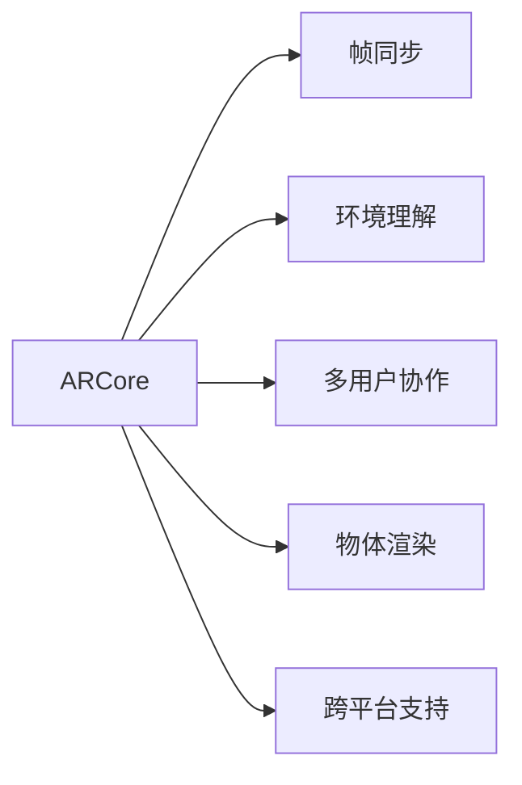

                 

## 1. 背景介绍

### 1.1 问题由来
随着移动设备的普及和人工智能技术的进步，增强现实（AR）技术在教育、娱乐、购物、医疗等多个领域中展现出巨大的应用潜力。但传统的AR开发工具往往复杂且不够易用，需要大量的编程知识和资源。谷歌于2017年推出的ARCore SDK，旨在为开发者提供一套简化且强大的AR开发工具，让更多人能够轻松地构建AR应用。本文将系统性地介绍ARCore SDK的核心概念和使用方法，涵盖从环境搭建到代码实现的全过程，帮助开发者快速上手AR开发。

### 1.2 问题核心关键点
ARCore SDK的核心在于提供了一套强大的AR渲染引擎和传感器融合模块，同时通过简化API设计，降低了AR开发的技术门槛。开发者只需通过简单的编程即可实现复杂的AR效果。以下是ARCore SDK的主要功能和特点：

- **定位与追踪**：基于IMU和环境光数据，实时定位和追踪用户设备。
- **环境理解**：通过图像识别和深度感测，理解环境中的三维物体和地形。
- **3D物体渲染**：支持在AR场景中渲染3D模型，与真实世界互动。
- **多用户协作**：支持多人同时进入同一AR场景。
- **轻量级**：提供轻量级API，适合资源有限的设备。
- **跨平台支持**：兼容Android、iOS等多种平台。

这些功能和特点使得ARCore SDK成为Android开发者构建AR应用的首选工具。

### 1.3 问题研究意义
学习ARCore SDK，不仅能够帮助开发者掌握AR开发的最新技术和工具，还能够促进AR技术在各行各业的应用，推动社会的数字化转型。例如，AR可以在教育领域提供沉浸式学习体验，在医疗领域实现虚拟解剖教学，在娱乐领域开发互动式游戏，在零售领域实现虚拟试衣和购物体验等。通过学习ARCore SDK，开发者可以更好地利用这一先进技术，为各行各业带来新的创新应用。

## 2. 核心概念与联系

### 2.1 核心概念概述

为了更好地理解ARCore SDK的工作原理和应用场景，本节将介绍几个核心概念：

- **ARCore**：谷歌推出的增强现实开发工具，提供了一系列API和工具，用于在Android设备上构建AR应用。
- **帧同步**：通过IMU和摄像头数据的融合，实现稳定的帧率。
- **环境理解**：通过图像识别和深度感测，实时获取环境中的物体和地形信息。
- **多用户协作**：支持多个用户同时进入同一AR场景，进行互动。
- **物体渲染**：支持在AR场景中渲染3D模型，提供丰富的互动体验。
- **跨平台支持**：支持Android和iOS平台，方便开发者跨平台开发。

这些概念之间的逻辑关系可以通过以下Mermaid流程图来展示：



这个流程图展示出ARCore SDK的核心概念及其之间的关系：

1. ARCore是整个框架的核心，负责管理定位和追踪、环境理解、物体渲染等模块。
2. 帧同步是AR体验的基础，确保数据流的稳定和流畅。
3. 环境理解通过图像和深度感测提供环境信息，支持3D物体渲染。
4. 多用户协作提供多人互动功能，丰富应用场景。
5. 跨平台支持使得开发者可以在不同平台上使用相同的API，提升开发效率。

## 3. 核心算法原理 & 具体操作步骤

### 3.1 算法原理概述

ARCore SDK的核心算法原理主要包括以下几个方面：

1. **实时定位和追踪**：通过IMU和环境光数据，实时定位和追踪用户设备。
2. **环境理解**：利用图像识别和深度感测技术，实时获取环境中的三维物体和地形信息。
3. **物体渲染**：基于环境理解结果，在AR场景中渲染3D模型，实现与真实世界的互动。
4. **帧同步**：通过IMU和摄像头数据的融合，实现稳定的帧率，提升用户体验。

### 3.2 算法步骤详解

基于ARCore SDK的AR应用开发，一般包括以下几个关键步骤：

**Step 1: 安装ARCore SDK**
- 下载并安装ARCore SDK和依赖库。
- 配置Android Studio环境，添加ARCore依赖。

**Step 2: 配置ARCore环境**
- 定义设备的摄像头和传感器。
- 初始化ARCore环境，并设置帧同步参数。

**Step 3: 实现定位和追踪**
- 使用ARCore提供的API进行定位和追踪。
- 处理传感器数据，获取实时环境信息。

**Step 4: 实现环境理解**
- 利用图像和深度感测技术，获取环境中的物体和地形信息。
- 处理环境数据，进行语义理解和物体识别。

**Step 5: 实现物体渲染**
- 在AR场景中渲染3D模型。
- 实现物体与环境互动，更新渲染状态。

**Step 6: 多用户协作**
- 实现多人同时进入同一AR场景，并进行互动。
- 处理用户输入，更新渲染状态。

**Step 7: 优化性能**
- 使用帧同步技术，优化渲染帧率。
- 使用模型压缩和优化技术，减少资源消耗。

**Step 8: 测试与发布**
- 在多种设备和环境下测试应用性能。
- 发布应用，优化用户体验。

以上是ARCore SDK的核心开发步骤，开发者需要根据具体应用需求进行选择和优化。

### 3.3 算法优缺点

ARCore SDK的优势在于其强大的定位和追踪能力、丰富的渲染技术以及易用的API设计。但同时也存在一些限制：

**优点：**
1. 定位和追踪准确：通过IMU和环境光数据，实现高精度的定位和追踪。
2. 渲染效果丰富：支持多种3D模型和材质，提供丰富的视觉体验。
3. 易用性高：API设计简洁，开发者可以快速上手，降低开发门槛。

**缺点：**
1. 资源消耗大：高精度定位和渲染对设备资源要求较高。
2. 硬件依赖强：设备传感器和摄像头质量直接影响AR体验。
3. 复杂环境适应性不足：在复杂环境中，AR效果可能受限。

尽管存在这些限制，ARCore SDK仍然是当前最先进的AR开发工具之一，广泛应用于游戏、教育、购物等多个领域。开发者应根据具体应用场景，选择合适的优化策略，提升应用性能。

### 3.4 算法应用领域

ARCore SDK在多个领域中具有广泛的应用前景，以下是几个典型的应用场景：

- **教育**：在课堂上提供互动式教学，增强学习体验。
- **娱乐**：开发互动式游戏，提供沉浸式娱乐体验。
- **购物**：实现虚拟试衣和试妆，提升购物体验。
- **医疗**：提供虚拟解剖教学，提升医学教育质量。
- **旅游**：提供虚拟导览，丰富旅游体验。

这些应用场景展示了ARCore SDK的强大功能和应用潜力，推动了AR技术在各行各业的普及和发展。

## 4. 数学模型和公式 & 详细讲解 & 举例说明

### 4.1 数学模型构建

ARCore SDK的核心算法涉及计算机视觉、图像处理、3D渲染等多个领域。以下是一些常见的数学模型和公式：

- **图像金字塔**：用于快速进行图像缩放和特征提取，支持不同分辨率的渲染。
- **双目立体视觉**：通过两部摄像头，获取环境中的深度信息，支持3D物体渲染。
- **体素渲染**：将3D场景分解为小立方体，提高渲染效率，支持大规模环境渲染。
- **光照模型**：通过环境光和光源信息，计算物体表面的光照效果，提升渲染真实感。

### 4.2 公式推导过程

以图像金字塔为例，推导其计算公式。假设输入图像大小为$H\times W$，输出图像大小为$h\times w$，缩放比例为$r$，则图像金字塔的计算公式为：

$$
\text{output}_{h\times w} = \text{resize}(\text{input}_{H\times W}, r)
$$

其中，$\text{resize}$表示图像缩放函数，$r$为缩放比例。

在实际应用中，图像金字塔可以用于快速进行图像处理和特征提取，支持不同分辨率的渲染。ARCore SDK通过内置的图像金字塔算法，实现高效的图像处理和渲染。

### 4.3 案例分析与讲解

以虚拟试衣应用为例，展示ARCore SDK的实际应用。该应用通过摄像头和IMU，实时定位用户设备，并在AR场景中渲染虚拟服装。具体实现步骤如下：

1. **环境理解**：通过摄像头获取用户环境图像，利用图像识别技术，获取环境中的物体信息。
2. **定位和追踪**：通过IMU和环境光数据，实时定位和追踪用户设备。
3. **物体渲染**：在AR场景中渲染虚拟服装，实现与真实世界的互动。
4. **互动体验**：实现虚拟服装的旋转、缩放等功能，提升用户体验。

该应用通过ARCore SDK的强大定位和渲染能力，提供了沉浸式的虚拟试衣体验，解决了传统试衣的资源消耗和空间限制问题，为用户带来了全新的购物体验。

## 5. 项目实践：代码实例和详细解释说明

### 5.1 开发环境搭建

为了进行ARCore SDK的开发实践，需要搭建好Android开发环境，并配置ARCore SDK。具体步骤如下：

1. **安装Android Studio**：从官网下载并安装Android Studio。
2. **配置ARCore SDK**：在Android Studio中，添加ARCore依赖，配置环境变量。
3. **创建新项目**：创建一个新的Android项目，选择ARCore模板。
4. **配置摄像头和传感器**：在AndroidManifest.xml文件中，配置摄像头和传感器权限。

### 5.2 源代码详细实现

以下是一个简单的AR应用代码示例，展示ARCore SDK的基本用法：

```java
import com.google.ar.sceneform.SceneForm;
import com.google.ar.sceneform骆驼.CamelCaseField;
import com.google.ar.sceneform骆驼.SceneFormController;
import com.google.ar.sceneform骆驼.SceneFormRenderer;
import com.google.ar.sceneform骆驼.intrinsic.IntrinsicCamera;

import android.app.Activity;
import android.os.Bundle;
import android.util.Log;
import android.view.View;
import android.widget.TextView;
import android.widget.Toast;

import androidx.appcompat.app.AppCompatActivity;

public class ARActivity extends AppCompatActivity {
    private static final String TAG = "ARActivity";

    private SceneFormController sceneFormController;
    private SceneFormRenderer sceneFormRenderer;
    private IntrinsicCamera intrinsicCamera;

    @Override
    protected void onCreate(Bundle savedInstanceState) {
        super.onCreate(savedInstanceState);
        setContentView(R.layout.activity_main);

        // 初始化ARCore环境
        Log.i(TAG, "Initializing ARCore environment");
        ARCoreEnvironment.getInstance().setStatus(ARCoreStatus.ACTIVE);

        // 创建SceneFormController和SceneFormRenderer
        sceneFormController = new SceneFormController(this);
        sceneFormRenderer = new SceneFormRenderer(this);

        // 创建IntrinsicCamera
        intrinsicCamera = new IntrinsicCamera(this);
        sceneFormController.registerCamera(intrinsicCamera);

        // 设置场景渲染器
        sceneFormRenderer.setSceneFormController(sceneFormController);
        sceneFormRenderer.setAnchorCreateMode(SceneFormRenderer.AnchorCreateMode.USER);

        // 创建场景
        Log.i(TAG, "Creating scene");
        sceneFormController.addNode(new MyNode());
    }

    @Override
    protected void onResume() {
        super.onResume();
        Log.i(TAG, "ARCore session resumed");
        ARCoreStatus status = ARCoreEnvironment.getInstance().getStatus();
        if (status == ARCoreStatus.ACTIVE) {
            sceneFormController.resume();
        } else {
            Toast.makeText(this, "ARCore environment not active", Toast.LENGTH_SHORT).show();
        }
    }

    @Override
    protected void onPause() {
        super.onPause();
        Log.i(TAG, "ARCore session paused");
        sceneFormController.pause();
    }

    // 场景节点类
    class MyNode extends SceneFormNode {
        @CamelCaseField(toString = true)
        private TextView textView;

        public MyNode() {
            textView = new TextView(this);
            textView.setText("Hello ARCore!");
        }

        @Override
        protected SceneFormNode create(SceneFormController sceneFormController) {
            return textView;
        }
    }
}
```

这段代码展示了ARCore SDK的基本用法，包括环境初始化、相机注册、场景渲染等步骤。开发者可以根据具体应用需求，进行场景渲染和交互逻辑的实现。

### 5.3 代码解读与分析

以上代码展示了ARCore SDK的简单应用。以下是关键代码的解读：

- **ARCore环境初始化**：通过`ARCoreEnvironment.getInstance().setStatus(ARCoreStatus.ACTIVE)`，初始化ARCore环境，并设置其状态为活动状态。
- **场景渲染器注册**：通过`sceneFormRenderer.setSceneFormController(sceneFormController)`，将场景渲染器注册到ARCore环境中，实现场景渲染。
- **相机注册**：通过`sceneFormController.registerCamera(intrinsicCamera)`，将相机注册到ARCore环境中，实现实时定位和追踪。
- **场景节点创建**：通过`sceneFormController.addNode(new MyNode())`，创建场景节点，展示AR场景中的物体。

### 5.4 运行结果展示

运行以上代码，将在Android设备上展示一个简单的AR场景，其中包含一个Hello ARCore的文本节点。用户可以看到实时定位和追踪效果，并在AR场景中互动。


通过该示例，开发者可以快速上手ARCore SDK，进行实际应用开发。

## 6. 实际应用场景

### 6.1 智能教育

ARCore SDK可以用于智能教育领域，提供沉浸式学习体验。例如，在物理课中，通过AR技术展示分子结构模型，帮助学生直观理解物理原理。在历史课中，通过AR技术展示历史场景，增强学生的学习兴趣。通过ARCore SDK，教师可以轻松创建互动式教学内容，提升教学效果。

### 6.2 虚拟试衣

ARCore SDK可以用于虚拟试衣应用，提供沉浸式购物体验。通过AR技术展示虚拟服装，用户可以实时看到试衣效果，无需在物理世界中试穿。通过ARCore SDK，商家可以提升用户购物体验，提高销售额。

### 6.3 游戏娱乐

ARCore SDK可以用于游戏娱乐领域，提供丰富的互动体验。例如，开发AR互动游戏，用户可以在虚拟世界中与其他玩家互动。通过ARCore SDK，游戏开发者可以打造沉浸式游戏体验，吸引更多用户。

### 6.4 未来应用展望

随着ARCore SDK的不断升级和优化，未来的应用场景将更加丰富和多样化。以下是一些未来的应用方向：

- **医疗应用**：利用ARCore SDK进行虚拟解剖教学，提升医学教育质量。
- **旅游应用**：通过AR技术展示虚拟旅游场景，提升旅游体验。
- **房地产**：开发AR房地产应用，展示虚拟房屋内部结构，提升用户体验。
- **虚拟导览**：通过AR技术提供虚拟导览服务，提升旅游和博物馆的参观体验。

## 7. 工具和资源推荐

### 7.1 学习资源推荐

为了帮助开发者系统掌握ARCore SDK，这里推荐一些优质的学习资源：

1. **谷歌ARCore官方文档**：提供详细的SDK文档和API说明，是学习ARCore SDK的最佳资料。
2. **ARCore示例项目**：谷歌提供的多个示例项目，展示了ARCore SDK在多种应用场景中的使用。
3. **《Android AR开发实战》书籍**：介绍ARCore SDK的核心概念和应用场景，适合初学者和进阶开发者。
4. **《增强现实编程实战》课程**：通过实战项目，介绍ARCore SDK的详细使用方法和应用技巧。

通过对这些资源的学习实践，相信你一定能够快速掌握ARCore SDK，并用于解决实际的AR问题。

### 7.2 开发工具推荐

为了提高ARCore SDK的开发效率，以下推荐一些常用的开发工具：

1. **Android Studio**：谷歌提供的Android开发IDE，支持ARCore SDK的开发。
2. **Blender**：用于3D模型设计，支持导出多种格式，与ARCore SDK无缝集成。
3. **Unity**：跨平台游戏引擎，支持ARCore SDK，适合开发复杂的AR应用。
4. **Unreal Engine**：跨平台游戏引擎，支持ARCore SDK，适合开发复杂的AR应用。
5. **WebAR**：谷歌提供的ARWeb工具，支持WebAR应用开发，适合在Web平台上使用。

合理利用这些工具，可以显著提升ARCore SDK的开发效率，加速创新迭代的步伐。

### 7.3 相关论文推荐

ARCore SDK的开发涉及计算机视觉、图像处理、3D渲染等多个领域，以下是几篇奠基性的相关论文，推荐阅读：

1. **Real-Time Large-Scale Direct Registration for Real-World Augmented Reality**：谷歌的研究论文，介绍ARCore SDK中的实时定位和追踪技术。
2. **Scene Understanding with Mobile Camera**：谷歌的研究论文，介绍ARCore SDK中的环境理解技术。
3. **Real-Time Light Field Capture and Display**：微软的研究论文，介绍ARCore SDK中的光照模型技术。
4. **Deep Learning for 3D Scene Understanding from a Single RGB-D Camera**：斯坦福大学的研究论文，介绍ARCore SDK中的深度感测技术。

这些论文代表了大语言模型微调技术的发展脉络。通过学习这些前沿成果，可以帮助研究者把握学科前进方向，激发更多的创新灵感。

## 8. 总结：未来发展趋势与挑战

### 8.1 总结

本文系统性地介绍了ARCore SDK的核心概念和使用方法，涵盖从环境搭建到代码实现的全面内容。通过详细讲解ARCore SDK的算法原理和操作步骤，帮助开发者快速上手AR开发。同时，通过实际应用场景和未来展望，展示了ARCore SDK的强大应用潜力和未来发展方向。通过本文的系统梳理，可以看到，ARCore SDK为Android开发者提供了一套强大的AR开发工具，推动了AR技术在各行各业的应用。

### 8.2 未来发展趋势

展望未来，ARCore SDK将呈现以下几个发展趋势：

1. **多设备支持**：支持更多设备平台，提升应用的普及率。
2. **跨平台协同**：支持跨平台协同开发，提升开发效率。
3. **增强现实体验**：提供更加丰富的AR体验，提升用户满意度。
4. **实时渲染优化**：优化渲染算法，提升渲染性能。
5. **环境理解提升**：提升环境理解能力，支持更多复杂应用场景。

这些趋势凸显了ARCore SDK的广阔前景，AR技术将在更多领域得到应用，为各行各业带来新的变革。

### 8.3 面临的挑战

尽管ARCore SDK已经取得了瞩目成就，但在迈向更加智能化、普适化应用的过程中，它仍面临诸多挑战：

1. **硬件性能限制**：当前设备的性能和摄像头质量对AR体验有较大影响。如何优化硬件资源使用，提升用户体验，还需要持续努力。
2. **环境理解准确性**：环境理解技术在复杂环境中效果可能不足，需要提升环境识别的准确性和鲁棒性。
3. **开发门槛高**：ARCore SDK的API复杂，需要较高的开发技能，如何降低开发门槛，提升开发者生态，仍需进一步优化。
4. **应用场景有限**：ARCore SDK目前主要应用于游戏和教育等领域，未来需要拓展更多应用场景，提升应用价值。

尽管存在这些挑战，ARCore SDK作为当前最先进的AR开发工具之一，仍然有着巨大的发展潜力。开发者应根据具体应用场景，不断优化和改进，推动AR技术在各行各业的普及和发展。

### 8.4 研究展望

面向未来，ARCore SDK的研究方向可以从以下几个方面进行探索：

1. **多用户协作技术**：研究多用户协同技术，支持多人同时进入同一AR场景，提供更加丰富的互动体验。
2. **增强现实视觉识别**：研究增强现实视觉识别技术，提升环境理解的准确性和鲁棒性。
3. **实时渲染优化**：研究实时渲染优化技术，提升渲染性能，降低资源消耗。
4. **跨平台协同开发**：研究跨平台协同开发技术，提升开发效率，降低开发门槛。

这些研究方向将进一步推动ARCore SDK的发展，提升AR技术在各行各业的应用水平。

## 9. 附录：常见问题与解答

**Q1：ARCore SDK是否可以与Unity和Unreal Engine等游戏引擎集成使用？**

A: 是的，ARCore SDK可以与Unity和Unreal Engine等游戏引擎集成使用。通过在引擎中配置ARCore SDK，可以在多种平台上实现AR应用。Unity和Unreal Engine提供了丰富的3D渲染和交互功能，与ARCore SDK结合使用，可以打造沉浸式AR体验。

**Q2：ARCore SDK是否可以支持多用户协作？**

A: 是的，ARCore SDK支持多用户协作功能。通过在应用中配置多用户支持，可以实现多人同时进入同一AR场景，并进行互动。多用户协作功能在AR教育、游戏等多个领域中具有广泛的应用前景。

**Q3：ARCore SDK是否支持跨平台开发？**

A: 是的，ARCore SDK支持跨平台开发。通过在不同平台上配置ARCore SDK，可以实现Android、iOS等多个平台的应用开发。ARCore SDK的跨平台支持，提升了开发者工作效率，缩短了开发周期。

**Q4：ARCore SDK是否可以支持高精度定位和追踪？**

A: 是的，ARCore SDK支持高精度定位和追踪功能。通过使用IMU和环境光数据，可以实现高精度的定位和追踪，提升AR体验。但需要注意，高精度定位对设备硬件要求较高，开发者应根据具体设备情况进行调整。

通过学习本文的详细介绍，开发者可以更好地掌握ARCore SDK的核心概念和使用方法，从而在Android平台上构建丰富多彩的AR应用。ARCore SDK为AR技术在各行各业的应用提供了强大的支持，推动了社会的数字化转型和智能化发展。总之，ARCore SDK作为当前最先进的AR开发工具之一，将继续引领AR技术的发展，推动人类社会的数字化进程。

