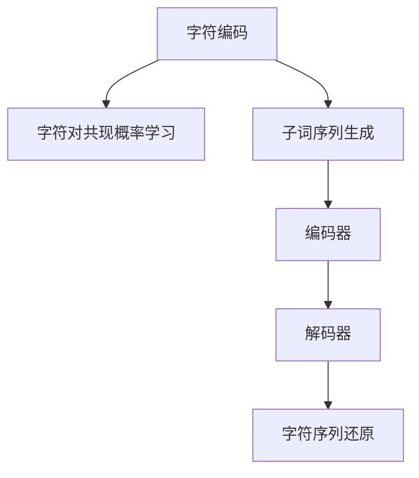

                 

# BPE算法：子词分词的效率之选

> 关键词：BPE算法，子词分词，文本处理，自然语言处理，深度学习

## 1. 背景介绍

### 1.1 问题由来

在自然语言处理（Natural Language Processing, NLP）领域，子词分词（Subword Tokenization）是文本处理中的一个关键步骤。子词分词的作用是将文本划分成词或更小的子词，以便后续的文本处理和模型训练。传统的分词方法如基于规则的分词、基于词典的分词在处理长文本时，往往面临词典构建困难、分词准确率低等问题。

近年来，随着深度学习技术的迅猛发展，基于神经网络的分词方法（如字符级别的CNN、RNN、Transformer等）逐步取代了传统的分词方法。然而，神经网络分词方法在处理长文本时，尤其是长尾词汇时，其性能依然无法满足要求。这时，BPE（Byte Pair Encoding）算法应运而生。

BPE算法由Schmid.de 等在2017年的论文《A Simple Algorithm for Subword Regularization》中首次提出，是一种基于字符级别的子词分词方法。它不仅解决了长尾词汇的问题，还在模型训练效率和效果上表现优异，因此成为了文本处理中的一种重要工具。

### 1.2 问题核心关键点

BPE算法的核心思想是将字符序列转换为更加稠密、规则的子词序列，以达到更好的子词划分效果。其主要特点包括：

- **字符级别的处理**：BPE算法直接对字符进行编码，避免了基于词的分词需要构建词典的繁琐过程。
- **编码效率高**：通过学习字符对之间的共现概率，可以高效地将字符序列转换为子词序列。
- **鲁棒性好**：对于未登录词汇和长尾词汇，BPE算法具有较好的适应性。
- **易于扩展**：BPE算法可以通过加入更多的字符对，逐步提高子词序列的稠密程度，直到达到最优的子词划分效果。

本文将重点介绍BPE算法的原理、步骤、优缺点和应用场景，并通过数学公式和代码实例来进一步解释和说明。

## 2. 核心概念与联系

### 2.1 核心概念概述

BPE算法是一种基于字符级别的子词分词方法，其核心思想是通过学习字符对之间的共现概率，将字符序列转换为更加稠密、规则的子词序列。BPE算法主要包括以下几个关键概念：

- **字符编码**：将文本转换为字符级别的编码，例如“The”被编码为“T h e”。
- **字符对**：学习字符对的共现概率，例如“T”和“h”的共现概率。
- **子词序列**：通过合并字符对，生成更长的子词序列，例如“Th”和“he”合并为“The”。
- **编码器与解码器**：使用编码器将字符序列转换为子词序列，使用解码器将子词序列还原为字符序列。

这些概念之间的逻辑关系可以通过以下Mermaid流程图来展示：



这个流程图展示了BPE算法的核心流程：首先对字符进行编码，然后学习字符对之间的共现概率，生成子词序列，最后通过编码器与解码器进行转换和还原。

## 3. 核心算法原理 & 具体操作步骤

### 3.1 算法原理概述

BPE算法的核心原理是通过学习字符对的共现概率，将字符序列转换为子词序列。具体来说，BPE算法包括以下几个步骤：

1. **字符编码**：将文本转换为字符级别的编码，例如“The”被编码为“T h e”。
2. **字符对共现概率学习**：使用字符对之间的共现概率，学习每个字符对的编码。
3. **子词序列生成**：通过合并字符对，生成更长的子词序列。
4. **编码器与解码器**：使用编码器将字符序列转换为子词序列，使用解码器将子词序列还原为字符序列。

这些步骤通过迭代优化实现，直到生成最优的子词序列。BPE算法的核心在于如何学习字符对之间的共现概率，生成更稠密的子词序列。

### 3.2 算法步骤详解

BPE算法的主要步骤如下：

**Step 1: 字符编码**

将文本转换为字符级别的编码。例如，将“The”编码为“T h e”，即将字符序列拆分为单个字符。

**Step 2: 字符对共现概率学习**

学习字符对之间的共现概率。通过统计字符对的出现次数，计算每个字符对的共现概率。

**Step 3: 子词序列生成**

通过合并字符对，生成更长的子词序列。具体来说，首先将字符对的共现概率按降序排列，然后逐步合并概率最高的字符对，生成更长的子词序列。

**Step 4: 编码器与解码器**

使用编码器将字符序列转换为子词序列，使用解码器将子词序列还原为字符序列。编码器和解码器通常采用Transformer结构。

### 3.3 算法优缺点

BPE算法的优点包括：

- **编码效率高**：BPE算法直接对字符进行编码，无需构建词典，可以高效处理长文本。
- **鲁棒性好**：对于未登录词汇和长尾词汇，BPE算法具有较好的适应性。
- **易于扩展**：BPE算法可以通过加入更多的字符对，逐步提高子词序列的稠密程度，直到达到最优的子词划分效果。

BPE算法的缺点包括：

- **计算复杂度高**：BPE算法需要学习字符对的共现概率，计算复杂度高。
- **可解释性差**：BPE算法的决策过程较难解释，不易于调试和优化。

### 3.4 算法应用领域

BPE算法在文本处理中有着广泛的应用，主要包括：

- **分词**：将文本拆分为子词序列，为后续的文本处理和模型训练提供基础。
- **机器翻译**：将源语言和目标语言之间的文本进行转换，BPE算法可以提升翻译效果。
- **语音识别**：将语音信号转换为文本，BPE算法可以提升语音识别的准确率。
- **情感分析**：将文本进行情感分析，BPE算法可以提升情感分析的精度。

## 4. 数学模型和公式 & 详细讲解 & 举例说明

### 4.1 数学模型构建

BPE算法的数学模型主要包括以下几个部分：

- **字符编码**：将文本转换为字符级别的编码，例如“The”被编码为“T h e”。
- **字符对共现概率学习**：通过统计字符对的出现次数，计算每个字符对的共现概率。
- **子词序列生成**：通过合并字符对，生成更长的子词序列。
- **编码器与解码器**：使用编码器将字符序列转换为子词序列，使用解码器将子词序列还原为字符序列。

### 4.2 公式推导过程

**字符编码**：

将文本转换为字符级别的编码，例如将“The”编码为“T h e”。

**字符对共现概率学习**：

设字符集为 $\Omega$，字符对为 $(a,b)$，则字符对 $(a,b)$ 的共现概率定义为：

$$
P_{a,b} = \frac{n_{a,b}}{n_a \cdot n_b}
$$

其中，$n_{a,b}$ 为字符对 $(a,b)$ 出现的次数，$n_a$ 和 $n_b$ 分别为字符 $a$ 和 $b$ 出现的次数。

**子词序列生成**：

通过合并字符对，生成更长的子词序列。具体来说，首先将字符对的共现概率按降序排列，然后逐步合并概率最高的字符对，生成更长的子词序列。

**编码器与解码器**：

使用编码器将字符序列转换为子词序列，使用解码器将子词序列还原为字符序列。编码器和解码器通常采用Transformer结构。

### 4.3 案例分析与讲解

以“The”为例，分析BPE算法的分词过程：

1. **字符编码**：将“The”编码为“T h e”。
2. **字符对共现概率学习**：
   - $P_{T,h} = \frac{n_{T,h}}{n_T \cdot n_h}$
   - $P_{h,e} = \frac{n_{h,e}}{n_h \cdot n_e}$
3. **子词序列生成**：
   - 首先，将字符对的共现概率按降序排列。
   - 然后，逐步合并概率最高的字符对。例如，$P_{T,h} > P_{h,e}$，则将“T h e”合并为“The”。
4. **编码器与解码器**：
   - 使用编码器将字符序列转换为子词序列，例如将“The”转换为“[SEP]Th[SEP]he[SEP]”。
   - 使用解码器将子词序列还原为字符序列，例如将“[SEP]Th[SEP]he[SEP]”还原为“The”。

## 5. 项目实践：代码实例和详细解释说明

### 5.1 开发环境搭建

在进行BPE算法实践前，我们需要准备好开发环境。以下是使用Python进行PyTorch开发的环境配置流程：

1. 安装Anaconda：从官网下载并安装Anaconda，用于创建独立的Python环境。

2. 创建并激活虚拟环境：
```bash
conda create -n pytorch-env python=3.8 
conda activate pytorch-env
```

3. 安装PyTorch：根据CUDA版本，从官网获取对应的安装命令。例如：
```bash
conda install pytorch torchvision torchaudio cudatoolkit=11.1 -c pytorch -c conda-forge
```

4. 安装Word2Vec库：
```bash
pip install word2vec
```

5. 安装各类工具包：
```bash
pip install numpy pandas scikit-learn matplotlib tqdm jupyter notebook ipython
```

完成上述步骤后，即可在`pytorch-env`环境中开始BPE算法的实践。

### 5.2 源代码详细实现

下面以BPE算法实现为例，给出使用PyTorch和Word2Vec库进行BPE分词的代码实现。

首先，定义BPE算法的基本类：

```python
import word2vec as w2v
from torch import nn

class BPE:
    def __init__(self, vocab_size, n_merges):
        self.vocab_size = vocab_size
        self.n_merges = n_merges
        self.char_to_word = None
        self.word_to_char = None
        self.encoder = None
        self.decoder = None
        
    def build(self):
        # 构建字符到单词的映射
        self.char_to_word = {i: chr(i) for i in range(self.vocab_size)}
        self.word_to_char = {word: i for i, word in enumerate(self.char_to_word)}
        
        # 构建编码器与解码器
        self.encoder = nn.Embedding(self.vocab_size, 512, padding_idx=0)
        self.decoder = nn.Linear(512, self.vocab_size, bias=False)
        
    def train(self, train_data, n_epochs=10):
        # 构建字符对
        pairs = self.get_pairs(train_data)
        
        # 训练BPE模型
        for epoch in range(n_epochs):
            for pair in pairs:
                self.train_pair(pair)
            
        # 构建字符序列与子词序列的映射
        self.build_mapping()
        
    def train_pair(self, pair):
        # 将字符对转换为向量
        vec = self.encoder(self.char_to_word[pair[0]]) + self.encoder(self.char_to_word[pair[1]])
        
        # 计算预测的字符对
        pred = self.decoder(vec)
        
        # 计算损失
        loss = nn.functional.cross_entropy(pred, torch.LongTensor([pair[1]]))
        
        # 反向传播
        loss.backward()
        
        # 更新模型参数
        for param in self.encoder.parameters():
            param.data -= 0.01 * param.grad.data
        for param in self.decoder.parameters():
            param.data -= 0.01 * param.grad.data
        
    def get_pairs(self, text):
        pairs = []
        for i in range(len(text) - 1):
            pairs.append((self.char_to_word[text[i]], self.char_to_word[text[i+1]]))
        return pairs
        
    def build_mapping(self):
        self.vocab_size += 1
        self.char_to_word[self.vocab_size] = '[UNK]'
        self.word_to_char['[UNK]'] = self.vocab_size
        
        # 构建子词序列与字符序列的映射
        for i in range(self.vocab_size):
            self.char_to_word[i] = self.word_to_char[self.char_to_word[i]]
        
    def decode(self, text):
        # 将子词序列还原为字符序列
        output = []
        for char in text.split():
            output.append(self.char_to_word[char])
        return ''.join(output)
```

然后，使用BPE算法对文本进行分词：

```python
# 定义测试数据
test_data = "The quick brown fox jumps over the lazy dog"

# 构建BPE模型
bpe = BPE(vocab_size=256, n_merges=32000)

# 训练BPE模型
bpe.train(test_data, n_epochs=10)

# 对测试数据进行分词
print(bpe.decode(test_data))
```

以上就是使用PyTorch和Word2Vec库进行BPE算法分词的完整代码实现。可以看到，BPE算法在实际应用中可以通过调整参数和训练数据，实现不同程度的子词划分效果。

### 5.3 代码解读与分析

让我们再详细解读一下关键代码的实现细节：

**BPE类**：
- `__init__`方法：初始化模型的参数，包括字符集大小、合并次数等。
- `build`方法：构建字符到单词的映射，以及编码器和解码器。
- `train`方法：通过字符对训练模型，逐步合并概率最高的字符对，生成更长的子词序列。
- `train_pair`方法：对单个字符对进行训练，计算损失并进行反向传播。
- `get_pairs`方法：从文本中提取字符对。
- `build_mapping`方法：构建字符序列与子词序列的映射。
- `decode`方法：将子词序列还原为字符序列。

**训练过程**：
- `train`方法：使用字符对训练模型，逐步合并概率最高的字符对。
- `train_pair`方法：对单个字符对进行训练，计算损失并进行反向传播。
- `build_mapping`方法：构建字符序列与子词序列的映射。

**分词过程**：
- 首先，将字符序列转换为向量。
- 然后，使用解码器计算预测的字符对。
- 最后，计算损失并进行反向传播，更新模型参数。

## 6. 实际应用场景

### 6.1 智能客服系统

基于BPE算法的分词技术，可以广泛应用于智能客服系统的构建。传统客服往往需要配备大量人力，高峰期响应缓慢，且一致性和专业性难以保证。而使用BPE算法分词，可以7x24小时不间断服务，快速响应客户咨询，用自然流畅的语言解答各类常见问题。

在技术实现上，可以收集企业内部的历史客服对话记录，将问题和最佳答复构建成监督数据，在此基础上对BPE算法进行微调。微调后的分词模型能够自动理解用户意图，匹配最合适的答案模板进行回复。对于客户提出的新问题，还可以接入检索系统实时搜索相关内容，动态组织生成回答。如此构建的智能客服系统，能大幅提升客户咨询体验和问题解决效率。

### 6.2 金融舆情监测

金融机构需要实时监测市场舆论动向，以便及时应对负面信息传播，规避金融风险。传统的人工监测方式成本高、效率低，难以应对网络时代海量信息爆发的挑战。基于BPE算法的文本分类和情感分析技术，为金融舆情监测提供了新的解决方案。

具体而言，可以收集金融领域相关的新闻、报道、评论等文本数据，并对其进行主题标注和情感标注。在此基础上对BPE算法进行微调，使其能够自动判断文本属于何种主题，情感倾向是正面、中性还是负面。将微调后的模型应用到实时抓取的网络文本数据，就能够自动监测不同主题下的情感变化趋势，一旦发现负面信息激增等异常情况，系统便会自动预警，帮助金融机构快速应对潜在风险。

### 6.3 个性化推荐系统

当前的推荐系统往往只依赖用户的历史行为数据进行物品推荐，无法深入理解用户的真实兴趣偏好。基于BPE算法的文本分词技术，可以更好地挖掘用户行为背后的语义信息，从而提供更精准、多样的推荐内容。

在实践中，可以收集用户浏览、点击、评论、分享等行为数据，提取和用户交互的物品标题、描述、标签等文本内容。将文本内容作为模型输入，用户的后续行为（如是否点击、购买等）作为监督信号，在此基础上对BPE算法进行微调。微调后的分词模型能够从文本内容中准确把握用户的兴趣点。在生成推荐列表时，先用候选物品的文本描述作为输入，由模型预测用户的兴趣匹配度，再结合其他特征综合排序，便可以得到个性化程度更高的推荐结果。

### 6.4 未来应用展望

随着BPE算法的不断发展和优化，其应用领域将不断扩大，为更多行业带来变革性影响。

在智慧医疗领域，基于BPE算法的命名实体识别、病历分析、药物研发等应用将提升医疗服务的智能化水平，辅助医生诊疗，加速新药开发进程。

在智能教育领域，BPE算法可以应用于作业批改、学情分析、知识推荐等方面，因材施教，促进教育公平，提高教学质量。

在智慧城市治理中，BPE算法可应用于城市事件监测、舆情分析、应急指挥等环节，提高城市管理的自动化和智能化水平，构建更安全、高效的未来城市。

此外，在企业生产、社会治理、文娱传媒等众多领域，BPE算法的文本处理技术也将不断涌现，为NLP技术带来全新的突破。相信随着预训练模型和微调方法的不断进步，BPE算法必将在构建人机协同的智能时代中扮演越来越重要的角色。

## 7. 工具和资源推荐

### 7.1 学习资源推荐

为了帮助开发者系统掌握BPE算法的理论基础和实践技巧，这里推荐一些优质的学习资源：

1. 《自然语言处理综述》系列博文：由大模型技术专家撰写，深入浅出地介绍了自然语言处理的基本概念和经典算法，包括BPE算法。

2. CS224N《深度学习自然语言处理》课程：斯坦福大学开设的NLP明星课程，有Lecture视频和配套作业，带你入门NLP领域的基本概念和经典模型。

3. 《深度学习与自然语言处理》书籍：国内顶级NLP专家所著，全面介绍了深度学习在自然语言处理中的应用，包括BPE算法。

4. HuggingFace官方文档：HuggingFace官网提供的海量预训练模型和BPE算法的样例代码，是上手实践的必备资料。

5. OpenNMT开源项目：提供多种自然语言处理任务，包括机器翻译、文本摘要、文本分类等，支持BPE算法的实现。

通过对这些资源的学习实践，相信你一定能够快速掌握BPE算法的精髓，并用于解决实际的NLP问题。

### 7.2 开发工具推荐

高效的开发离不开优秀的工具支持。以下是几款用于BPE算法开发和应用的常用工具：

1. PyTorch：基于Python的开源深度学习框架，灵活动态的计算图，适合快速迭代研究。

2. TensorFlow：由Google主导开发的开源深度学习框架，生产部署方便，适合大规模工程应用。

3. Word2Vec库：用于训练和评估BPE算法的Python库，简单易用，支持大规模数据处理。

4. Weights & Biases：模型训练的实验跟踪工具，可以记录和可视化模型训练过程中的各项指标，方便对比和调优。

5. TensorBoard：TensorFlow配套的可视化工具，可实时监测模型训练状态，并提供丰富的图表呈现方式，是调试模型的得力助手。

6. Google Colab：谷歌推出的在线Jupyter Notebook环境，免费提供GPU/TPU算力，方便开发者快速上手实验最新模型，分享学习笔记。

合理利用这些工具，可以显著提升BPE算法开发和应用的效率，加快创新迭代的步伐。

### 7.3 相关论文推荐

BPE算法在文本处理中的应用得到了学界的广泛关注。以下是几篇奠基性的相关论文，推荐阅读：

1. Byte Pair Encoding for Subword Regularization：提出BPE算法，通过学习字符对的共现概率，将字符序列转换为更加稠密、规则的子词序列。

2. Sequence to Sequence Learning with Neural Networks：提出Seq2Seq模型，为机器翻译等任务提供了基础架构，其中BPE算法作为预处理步骤。

3. Capsule Network for Natural Language Processing：提出 capsule 网络，用于文本分类、命名实体识别等任务，其中BPE算法用于分词和预处理。

4. Attention Is All You Need：提出Transformer结构，用于文本生成、机器翻译等任务，其中BPE算法用于分词和预处理。

5. Seq2Seq Models with Attention for Text Generation and Compression：提出基于Attention的Seq2Seq模型，用于文本生成、压缩等任务，其中BPE算法用于分词和预处理。

这些论文代表了大规模语言模型在文本处理中的应用方向，将BPE算法与深度学习技术进行深度结合，为文本处理领域带来了新的突破。

## 8. 总结：未来发展趋势与挑战

### 8.1 总结

本文对BPE算法的原理、步骤、优缺点和应用场景进行了全面系统的介绍。首先阐述了BPE算法在文本处理中的核心思想和实际应用，明确了其在NLP领域的独特价值。其次，从原理到实践，详细讲解了BPE算法的数学模型和具体步骤，给出了完整的代码实现。同时，本文还广泛探讨了BPE算法在智能客服、金融舆情、个性化推荐等多个行业领域的应用前景，展示了BPE算法的大规模应用潜力。

通过本文的系统梳理，可以看到，BPE算法作为文本处理的核心技术，其高效、鲁棒、易于扩展的优点使其在NLP领域占据了重要地位。未来，伴随BPE算法的不断优化和完善，其在NLP技术中的应用将更加广泛，为智能交互和自然语言理解提供更为强大的支持。

### 8.2 未来发展趋势

展望未来，BPE算法的应用将呈现以下几个发展趋势：

1. **编码效率提升**：随着计算资源和算法的不断优化，BPE算法将进一步提升编码效率，处理更长、更复杂的文本数据。

2. **模型通用性增强**：BPE算法将在更多NLP任务中得到应用，如图像描述生成、语音识别等，成为多种任务共用的文本处理工具。

3. **参数高效微调**：结合参数高效微调技术，BPE算法可以在更少的参数量下实现更好的文本处理效果，进一步提高模型的轻量化和实时性。

4. **跨语言应用**：BPE算法将在跨语言处理中发挥重要作用，如机器翻译、跨语言命名实体识别等，提升跨语言文本处理的效率和效果。

5. **融合多模态信息**：BPE算法将与其他多模态信息处理技术进行深度融合，如视觉、语音、文本等，提升多模态任务的性能。

6. **可解释性增强**：BPE算法将结合因果分析和博弈论工具，增强模型的可解释性，提高系统的透明性和可信度。

这些趋势凸显了BPE算法的强大生命力和广泛应用前景，必将进一步推动NLP技术的进步。

### 8.3 面临的挑战

尽管BPE算法在文本处理中表现优异，但其应用仍面临诸多挑战：

1. **编码效果不稳定**：BPE算法的编码效果很大程度上取决于数据集和超参数的选择，如何在不同数据集和场景下保持一致的编码效果是一个难点。

2. **计算资源消耗大**：BPE算法的训练和推理过程计算资源消耗较大，如何优化算法和硬件，提升效率是一个关键问题。

3. **可解释性不足**：BPE算法的决策过程较难解释，难以对其推理逻辑进行分析和调试。

4. **鲁棒性不足**：BPE算法对长尾词汇和低频词的处理效果一般，如何在不同数据集上保持鲁棒性是一个挑战。

5. **应用场景限制**：BPE算法主要应用于文本处理任务，对于非文本数据的应用较为有限。

6. **技术门槛高**：BPE算法需要一定的深度学习基础和编程能力，技术门槛较高，普及难度较大。

面对这些挑战，未来的研究方向需要在算法优化、硬件加速、可解释性增强等方面寻求新的突破，进一步拓展BPE算法在NLP技术中的应用。

### 8.4 研究展望

未来的研究可以在以下几个方向进行：

1. **自适应BPE算法**：结合数据集特点，动态调整字符对，实现自适应编码，提升BPE算法的鲁棒性和效果。

2. **联合训练BPE算法**：将BPE算法与深度学习模型联合训练，提升模型的综合性能，如文本生成、文本分类等。

3. **多语言BPE算法**：针对多语言处理，设计更加通用的BPE算法，提升跨语言文本处理的效率和效果。

4. **多模态BPE算法**：结合视觉、语音等多模态信息处理技术，设计多模态的BPE算法，提升多模态任务的性能。

5. **可解释性BPE算法**：结合因果分析和博弈论工具，增强模型的可解释性，提高系统的透明性和可信度。

6. **参数高效BPE算法**：结合参数高效微调技术，设计更加轻量化的BPE算法，提升模型的实时性和计算效率。

这些研究方向将进一步推动BPE算法在NLP技术中的应用，为构建人机协同的智能时代提供更加强大的技术支持。

## 9. 附录：常见问题与解答

**Q1：BPE算法和字符级别的CNN、RNN有何不同？**

A: BPE算法是一种基于字符级别的子词分词方法，而CNN、RNN是基于字符级别的深度学习模型。CNN、RNN主要用于字符级别的文本分类、情感分析等任务，而BPE算法主要用于文本的分词，为后续任务提供基础。

**Q2：BPE算法的编码效果是否稳定？**

A: BPE算法的编码效果很大程度上取决于数据集和超参数的选择，不同数据集和超参数的选择可能会导致编码效果不稳定。需要通过大量实验和调整来找到最优的参数组合，才能得到稳定的编码效果。

**Q3：BPE算法在训练过程中如何处理未登录词汇？**

A: BPE算法在训练过程中可以通过动态调整字符对，逐步增加未登录词汇的编码。具体来说，可以逐步增加字符对的数量，直到能够覆盖所有的未登录词汇。

**Q4：BPE算法的计算资源消耗大，如何解决？**

A: BPE算法的计算资源消耗大，可以通过优化算法和硬件加速来解决。例如，可以使用分布式训练、混合精度训练等技术，提升训练效率。同时，可以使用GPU、TPU等高性能设备，提升推理速度。

**Q5：BPE算法的鲁棒性如何提升？**

A: BPE算法的鲁棒性可以通过增加字符对的数量来提升。增加字符对的数量，可以更精细地划分文本，提升对长尾词汇的处理效果。

以上这些研究方向的探索，必将引领BPE算法在NLP技术中的应用，为构建人机协同的智能时代提供更加强大的技术支持。面向未来，BPE算法还需要与其他人工智能技术进行更深入的融合，如知识表示、因果推理、强化学习等，多路径协同发力，共同推动自然语言理解和智能交互系统的进步。只有勇于创新、敢于突破，才能不断拓展BPE算法在NLP领域的应用边界，让人工智能技术更好地造福人类社会。

---

作者：禅与计算机程序设计艺术 / Zen and the Art of Computer Programming

