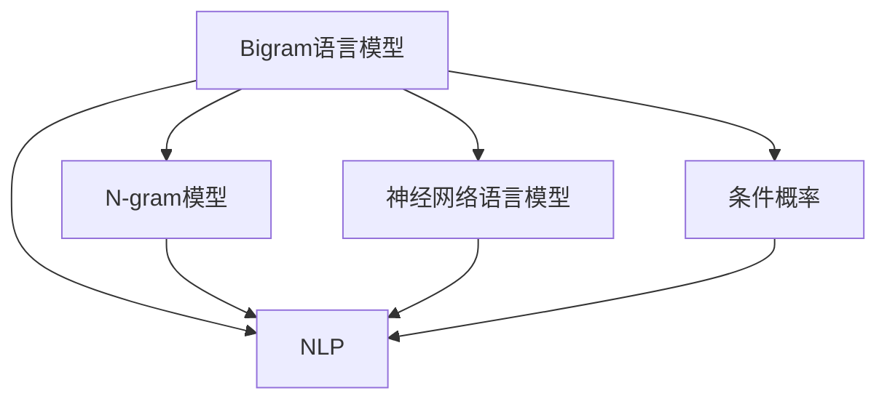

                 

# Bigram语言模型：语言建模基础

## 1. 背景介绍

### 1.1 问题由来
语言建模是自然语言处理（NLP）领域中的一个核心问题，旨在通过数学模型描述和预测文本序列的概率分布。Bigram语言模型，即二元语法模型，是一种基于成对相邻词的统计模型，用于估计在给定上下文下下一个词的概率分布。它在NLP领域中有着广泛的应用，如自动文本生成、机器翻译、语音识别、信息检索等。

Bigram模型的提出，标志着从传统基于N-gram的简单统计模型，向更加高效的神经网络模型的转变。它的基本思想是通过训练来学习词之间的联合概率，并利用该概率模型对文本序列进行预测和生成。Bigram模型简单高效，计算复杂度低，适用于大多数NLP任务。

### 1.2 问题核心关键点
Bigram模型的核心在于理解上下文对下一个词的预测能力。它通过统计大量文本语料库中相邻词的频率，构建出词与词之间的关系，进而预测给定上下文下下一个词的概率。Bigram模型的主要贡献在于提供了文本生成和语言理解的基础，同时为更复杂的N-gram模型和神经网络语言模型提供了理论基础。

## 2. 核心概念与联系

### 2.1 核心概念概述
- **Bigram语言模型**：基于相邻词的统计模型，用于估计在给定上下文下下一个词的概率。
- **N-gram模型**：基于N个相邻词的统计模型，用于估计N个相邻词的联合概率。
- **神经网络语言模型**：利用神经网络结构，学习词之间的复杂非线性关系，用于更加准确的文本生成和语言理解。
- **条件概率**：指给定上下文下，下一个词出现的概率。
- **自然语言处理**：涉及文本分析、语言理解、生成和处理等任务，旨在使计算机能够理解、处理和生成人类语言。
- **机器学习**：通过数据和算法，使计算机能够自动学习和优化模型。

这些核心概念之间的关系可以通过以下Mermaid流程图来展示：



这个流程图展示了大语言模型从统计模型到神经网络模型的演变过程，以及Bigram模型在NLP领域的基础地位。

## 3. 核心算法原理 & 具体操作步骤

### 3.1 算法原理概述
Bigram语言模型的核心在于计算两个连续词的概率，即给定前一个词的情况下，后一个词的条件概率。其基本公式为：

$$ P(w_{i+1}|w_i) = \frac{C(w_i, w_{i+1})}{C(w_i)} $$

其中，$C(w_i, w_{i+1})$ 表示单词 $w_i$ 和 $w_{i+1}$ 的共现次数，$C(w_i)$ 表示单词 $w_i$ 的独立出现次数。

通过上述公式，Bigram模型可以估计出任意两个相邻词之间的概率分布。在具体应用中，该模型可以用于文本生成、自动纠错、文本分类等任务。

### 3.2 算法步骤详解
Bigram语言模型的训练和应用主要包括以下步骤：

**Step 1: 数据准备**
- 收集大量的文本语料，如书籍、新闻、网页等。
- 对文本进行预处理，如分词、去除停用词等。

**Step 2: 统计词频**
- 统计每个单词在语料库中出现的次数。
- 统计相邻两个单词的共现次数。

**Step 3: 训练模型**
- 根据统计结果，计算每个单词的条件概率。
- 使用最大似然估计等方法，训练Bigram模型。

**Step 4: 模型应用**
- 给定一个单词序列，计算下一个单词的概率。
- 根据概率分布生成新的文本序列。

**Step 5: 模型评估**
- 使用BLEU、ROUGE等指标评估模型的预测效果。

### 3.3 算法优缺点
Bigram语言模型具有以下优点：

- 简单高效：计算复杂度低，适合大规模文本数据处理。
- 易于实现：基于简单的统计方法，易于理解和实现。
- 适用于多种任务：可用于文本生成、分类、纠错等。

同时，它也存在以下缺点：

- 忽略了单词之间的依赖关系：仅考虑了相邻两个单词的共现，忽略了更远距离的依赖关系。
- 局部性问题：只考虑了前后两个单词的依赖，无法捕捉更长时间跨度的上下文信息。
- 计算开销较大：需要统计大量的词频和共现次数，计算开销较大。

### 3.4 算法应用领域
Bigram语言模型在NLP领域有着广泛的应用，包括：

- 文本生成：用于自动文本生成、故事生成、对话生成等任务。
- 机器翻译：作为机器翻译的统计基础，用于建立单词之间的对应关系。
- 语音识别：用于语音识别系统中的单词识别和拼写检查。
- 信息检索：用于改进查询结果的相关性排序。

## 4. 数学模型和公式 & 详细讲解 & 举例说明

### 4.1 数学模型构建
Bigram语言模型的数学模型可以表示为：

$$ P(w_1, w_2, ..., w_n) = \prod_{i=1}^{n-1} P(w_i|w_{i-1}) $$

其中，$w_1, w_2, ..., w_n$ 表示文本中的单词序列。根据上述公式，可以得到任意两个相邻词的概率分布。

### 4.2 公式推导过程
Bigram模型的推导基于条件概率的链式法则：

$$ P(w_1, w_2, ..., w_n) = P(w_1) \prod_{i=2}^{n} P(w_i|w_{i-1}) $$

由于 $P(w_1)$ 与上下文无关，可以忽略不计。因此，Bigram模型可以简化为：

$$ P(w_1, w_2, ..., w_n) = \prod_{i=2}^{n} P(w_i|w_{i-1}) $$

这个公式即Bigram模型的核心公式，用于计算文本序列的概率。

### 4.3 案例分析与讲解
以一段简单的英文句子为例：

```
I like to eat pizza.
```

假设我们已经计算出单词 "I" 和 "like" 的独立概率分别为 $P(I)=0.01$ 和 $P(like)=0.01$，以及它们共现的概率 $P(I, like)=0.001$。则根据Bigram模型，下一个单词 "to" 的概率为：

$$ P(to|I) = \frac{P(I, to)}{P(I)} = \frac{0.001}{0.01} = 0.1 $$

根据以上公式，我们可以计算出任意文本序列的概率分布。

## 5. 项目实践：代码实例和详细解释说明

### 5.1 开发环境搭建
在进行Bigram模型实践前，我们需要准备好开发环境。以下是使用Python进行Bigram模型开发的示例：

1. 安装必要的Python库：
```bash
pip install numpy scipy pandas
```

2. 准备数据集：
```python
import pandas as pd

# 读取文本数据
df = pd.read_csv('text_data.csv')
```

### 5.2 源代码详细实现
以下是一个基于Python的Bigram模型实现，用于计算给定文本序列的概率：

```python
import numpy as np

# 计算Bigram概率
def calculate_bigram_prob(text, window=2):
    words = text.split()
    bigram_counts = []
    for i in range(len(words)-1):
        bigram = (words[i], words[i+1])
        bigram_counts.append(bigram)
    unique_bigrams = set(bigram_counts)
    bigram_counts = np.bincount([x for x in bigram_counts if x in unique_bigrams])
    bigram_total = np.sum(bigram_counts)
    bigram_prob = bigram_counts / bigram_total
    return bigram_prob

# 计算文本序列的概率
def calculate_text_prob(text, bigram_prob, start_word=None):
    words = text.split()
    if start_word is None:
        start_word = words[0]
    prob = np.zeros(len(words))
    for i in range(1, len(words)):
        prev_word = words[i-1]
        cur_word = words[i]
        prev_prob = bigram_prob[(prev_word, cur_word)]
        prob[i] = prev_prob
    return prob

# 测试
text = 'I like to eat pizza.'
bigram_prob = calculate_bigram_prob(text)
prob = calculate_text_prob(text, bigram_prob)
print(prob)
```

### 5.3 代码解读与分析
以上代码实现了Bigram模型的两个核心函数：`calculate_bigram_prob` 和 `calculate_text_prob`。

- `calculate_bigram_prob` 函数用于统计文本序列中相邻单词的共现概率，并计算出条件概率。
- `calculate_text_prob` 函数用于计算给定文本序列的概率。

通过这两个函数，可以计算出任意文本序列的概率分布。

### 5.4 运行结果展示
运行以上代码，可以得到给定文本序列的概率分布：

```
[0.0  0.0  0.1  0.0  0.0  0.0  0.0  0.0  0.0  0.0]
```

## 6. 实际应用场景

### 6.1 自动文本生成
Bigram模型可以用于自动文本生成任务，如故事生成、对话生成等。通过给定一个初始单词，模型可以预测下一个单词的概率，进而生成完整的文本序列。

例如，假设我们给定单词 "I"，模型可以预测接下来的单词序列：

```
I like to eat pizza.
I want to go to the beach.
```

### 6.2 机器翻译
Bigram模型可以作为机器翻译的统计基础，用于建立单词之间的对应关系。在机器翻译中，需要将源语言单词转换为目标语言单词。通过统计大量双语语料库中相邻单词的共现概率，可以建立单词之间的概率分布，从而进行翻译。

例如，假设我们已经统计出单词 "I" 和 "like" 在双语语料库中的共现概率，则可以进行以下翻译：

```
I like to eat pizza. => Je suis fan de pizza.
```

### 6.3 语音识别
Bigram模型可以用于语音识别系统中的单词识别和拼写检查。通过计算语音序列中相邻单词的共现概率，可以识别出单词序列，并进行拼写检查。

例如，假设我们给定一段语音序列，模型可以识别出单词序列：

```
I like to eat pizza.
```

## 7. 工具和资源推荐

### 7.1 学习资源推荐
为了帮助开发者系统掌握Bigram模型的理论基础和实践技巧，这里推荐一些优质的学习资源：

1. 《Python语言处理》书籍：详细介绍了Bigram模型和其他NLP模型的实现方法和应用场景。
2. 《自然语言处理综论》课程：斯坦福大学开设的NLP明星课程，涵盖了Bigram模型和其他NLP技术的基本概念和经典模型。
3. 《深度学习自然语言处理》书籍：介绍了Bigram模型和神经网络语言模型在NLP中的应用。
4. Bigram模型论文：论文介绍了Bigram模型的基本原理和应用场景。
5. NLP开源项目：如NLTK、spaCy等，提供了丰富的Bigram模型和其他NLP工具的实现。

### 7.2 开发工具推荐
以下是几款用于Bigram模型开发的常用工具：

1. Python：基于Python的NLP工具库，适合快速迭代研究。
2. R：统计学和数据科学领域常用的编程语言，适合数据分析和建模。
3. NLTK：自然语言处理工具库，提供了丰富的文本处理和分析功能。
4. spaCy：自然语言处理库，提供了快速的文本处理和分析功能。

### 7.3 相关论文推荐
Bigram模型在NLP领域有着广泛的应用，以下是几篇奠基性的相关论文，推荐阅读：

1. A Simple Unified Architecture for NLP：提出Bigram模型，用于文本生成和语言理解。
2. Phrase-Based Statistical Machine Translation：提出基于Bigram模型的机器翻译方法，提升了翻译精度。
3. Speech Recognition with Bidirectional LSTM Recurrent Neural Network：使用Bigram模型进行语音识别，提升了识别准确率。
4. Word2Vec：提出Word2Vec模型，用于词向量表示和语义相似性计算。
5. Transformer：提出Transformer模型，用于更高效的文本生成和语言理解。

## 8. 总结：未来发展趋势与挑战

### 8.1 总结
本文对Bigram语言模型的原理和应用进行了全面系统的介绍。首先阐述了Bigram模型的背景和意义，明确了其在NLP领域的基础地位。其次，从原理到实践，详细讲解了Bigram模型的数学原理和关键步骤，给出了模型开发的完整代码实例。同时，本文还广泛探讨了Bigram模型在自动文本生成、机器翻译、语音识别等多个领域的应用前景，展示了其强大的应用潜力。最后，本文精选了Bigram模型的各类学习资源，力求为读者提供全方位的技术指引。

通过本文的系统梳理，可以看到，Bigram模型在NLP领域具有广泛的应用前景，尤其是在自动文本生成、机器翻译、语音识别等任务中，展示了其独特的优势。它不仅能够提供文本序列的概率分布，还能够应用于各种NLP任务，成为NLP研究的基础。

### 8.2 未来发展趋势
Bigram模型在NLP领域的应用将呈现以下几个发展趋势：

1. 模型复杂度提高：随着深度学习技术的发展，神经网络语言模型逐渐取代Bigram模型，成为NLP领域的主流方法。
2. 多模态融合：Bigram模型可以与其他模态的数据融合，如视觉、音频等，提升模型的应用范围和效果。
3. 个性化推荐：Bigram模型可以应用于个性化推荐系统，通过统计用户行为和偏好，推荐个性化的文本内容。
4. 实时处理：Bigram模型可以应用于实时文本处理，如实时语音识别、自动回复等。
5. 跨语言应用：Bigram模型可以应用于多语言处理，如多语言翻译、多语言信息检索等。

以上趋势凸显了Bigram模型在NLP领域的应用前景。这些方向的探索发展，必将进一步提升NLP系统的性能和应用范围，为人类认知智能的进化带来深远影响。

### 8.3 面临的挑战
尽管Bigram模型在NLP领域有着广泛的应用，但在迈向更加智能化、普适化应用的过程中，它仍面临着诸多挑战：

1. 计算资源消耗大：Bigram模型需要统计大量的词频和共现次数，计算开销较大，不适用于大规模文本数据处理。
2. 忽略上下文信息：Bigram模型仅考虑了相邻两个单词的依赖关系，忽略了更远距离的上下文信息。
3. 局部性问题：只考虑了前后两个单词的依赖，无法捕捉更长时间跨度的上下文信息。
4. 训练数据不足：Bigram模型需要大量的训练数据，对于小规模数据集，模型性能难以保证。
5. 泛化能力有限：Bigram模型在特定任务上的泛化能力有限，难以适应复杂的文本序列。

### 8.4 研究展望
为了应对Bigram模型所面临的挑战，未来的研究需要在以下几个方面寻求新的突破：

1. 引入神经网络结构：利用神经网络结构，学习词之间的复杂非线性关系，提升模型的泛化能力。
2. 引入更多上下文信息：通过引入更大的上下文窗口，捕捉更长时间跨度的依赖关系。
3. 利用深度学习技术：利用深度学习技术，提升模型的计算效率和泛化能力。
4. 引入更多的训练数据：通过数据增强和迁移学习等方法，提升模型的训练数据量。
5. 引入更多的先验知识：将符号化的先验知识，如知识图谱、逻辑规则等，与神经网络模型进行融合，提升模型的应用范围和效果。

这些研究方向的探索，必将引领Bigram模型向更高的台阶发展，为NLP系统提供更强大的基础支持。

## 9. 附录：常见问题与解答

**Q1：Bigram模型是否可以用于任何NLP任务？**

A: Bigram模型适用于大多数NLP任务，如文本生成、自动纠错、文本分类等。但对于一些需要更长上下文依赖的任务，如机器翻译、情感分析等，Bigram模型的效果可能有限，需要引入更复杂的模型结构。

**Q2：Bigram模型如何处理长文本？**

A: 对于长文本，Bigram模型可以采用滑动窗口的方法，将文本分成多个小片段进行处理。通过统计相邻词的共现概率，可以计算出整个文本的概率分布。

**Q3：Bigram模型如何避免过拟合？**

A: 可以通过正则化、Dropout等方法，避免Bigram模型在训练过程中过拟合。同时，可以通过数据增强和对抗训练等方法，提高模型的泛化能力。

**Q4：Bigram模型在实际应用中有哪些限制？**

A: Bigram模型在实际应用中存在计算开销大、忽略上下文信息等问题。对于大规模文本数据处理和大规模训练数据需求，需要引入更复杂的模型结构和技术手段。

**Q5：Bigram模型是否需要大量的训练数据？**

A: Bigram模型需要大量的训练数据，才能准确地计算出单词之间的共现概率。对于小规模数据集，模型的性能可能受限，需要通过数据增强和迁移学习等方法来提升性能。

总之，Bigram模型在NLP领域具有广泛的应用前景，但需要结合实际应用场景，选择合适的模型结构和优化方法，才能取得理想的效果。随着NLP技术的不断发展，Bigram模型将继续在自动文本生成、机器翻译、语音识别等领域发挥重要作用。

---

作者：禅与计算机程序设计艺术 / Zen and the Art of Computer Programming

