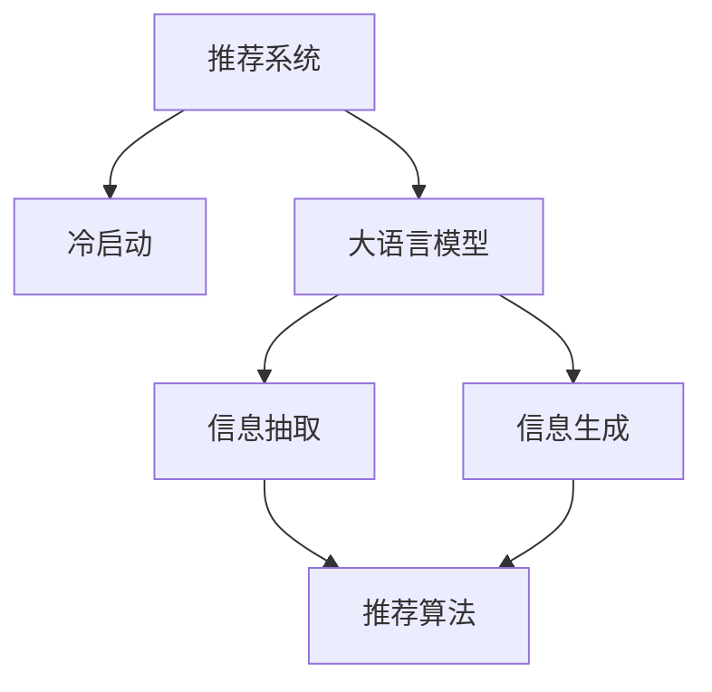

                 

# ChatGPT在推荐系统的表现分析：对冷启动场景的优势

大模型微调技术在推荐系统中的应用正引起越来越多的关注。本文将重点分析基于ChatGPT模型的推荐系统在冷启动场景下的表现，以及它在处理冷启动问题时所展现出的独特优势。

## 1. 背景介绍

### 1.1 问题由来
推荐系统是互联网产品中不可或缺的一部分，它能帮助用户在海量数据中找到最有价值的信息。但推荐系统的核心难题之一，是冷启动问题。在冷启动场景下，推荐系统无法获取到用户的充分历史行为数据，因而难以准确预测用户的偏好和兴趣。传统的推荐系统通常会依赖用户的评分数据或点击行为等，但在缺乏这些数据的情况下，推荐系统的准确性会大打折扣。

### 1.2 问题核心关键点
冷启动问题的核心在于如何从用户的少量行为中获取足够的信息，来推断其潜在兴趣，并为其推荐合适的物品。传统方法如协同过滤和基于内容的推荐，在冷启动时表现不佳。相比之下，基于大语言模型的推荐系统如ChatGPT，可以充分利用其强大的自然语言处理能力，从用户的简单文本输入中提取复杂的语义信息，从而更好地解决冷启动问题。

## 2. 核心概念与联系

### 2.1 核心概念概述
1. **推荐系统**：根据用户历史行为和物品属性，为用户推荐合适的物品。
2. **冷启动问题**：由于用户行为数据不足，推荐系统难以准确预测用户兴趣。
3. **大语言模型**：基于自回归或自编码模型，通过大量数据训练出的通用语言模型，如GPT、BERT等。
4. **ChatGPT**：OpenAI开发的对话式AI模型，擅长理解和生成自然语言。
5. **信息抽取与生成**：从文本中抽取出关键信息并生成新的文本。

### 2.2 核心概念原理和架构的 Mermaid 流程图



## 3. 核心算法原理 & 具体操作步骤

### 3.1 算法原理概述
基于ChatGPT的推荐系统，将用户的输入（如搜索词、询问等）作为大语言模型的输入，通过信息抽取获取关键特征，并利用信息生成模块生成预测结果。该系统在冷启动场景下表现优异，原因如下：

1. **语义理解能力强**：ChatGPT模型能够从用户的自然语言中理解其需求和意图，从而更好地把握用户兴趣。
2. **多模态数据融合**：ChatGPT不仅能处理文本数据，还能融合图像、音频等多模态数据，提升推荐精度。
3. **动态交互能力**：通过与用户的对话，ChatGPT可以不断调整和优化推荐结果，满足用户个性化需求。

### 3.2 算法步骤详解

#### 3.2.1 数据收集与预处理
1. **用户行为数据**：收集用户在网站或应用上的浏览、点击、评分等行为数据。
2. **文本数据**：收集用户输入的查询、评论等文本数据。

#### 3.2.2 模型初始化
1. **加载预训练模型**：加载ChatGPT预训练模型，作为推荐系统的基础组件。
2. **抽取关键特征**：将用户的文本输入（如搜索词、评论）作为ChatGPT的输入，提取关键特征。

#### 3.2.3 信息生成与推荐
1. **生成推荐结果**：将抽取出的关键特征作为输入，通过ChatGPT生成推荐结果。
2. **调整推荐策略**：根据用户的反馈调整推荐策略，提升推荐效果。

#### 3.2.4 模型评估与优化
1. **A/B测试**：进行A/B测试，评估不同推荐策略的效果。
2. **持续优化**：根据测试结果，不断优化模型参数和推荐策略。

### 3.3 算法优缺点
#### 3.3.1 优点
1. **语义理解能力**：ChatGPT能够理解复杂的自然语言，提取用户意图，从而更准确地进行推荐。
2. **动态交互能力**：通过不断对话，ChatGPT可以持续优化推荐结果，满足用户的个性化需求。
3. **多模态数据融合**：ChatGPT可以处理多模态数据，融合不同维度的信息，提升推荐效果。

#### 3.3.2 缺点
1. **计算资源消耗大**：ChatGPT模型较大，对计算资源要求较高。
2. **模型可解释性差**：ChatGPT作为"黑盒"模型，其决策过程难以解释。
3. **依赖高质量数据**：ChatGPT需要高质量的数据输入才能发挥最佳效果，对数据质量要求较高。

### 3.4 算法应用领域
基于ChatGPT的推荐系统，在多个领域都有广泛应用，如电商推荐、新闻推荐、娱乐推荐等。特别是在冷启动场景下，ChatGPT的推荐效果尤为显著，已经被许多产品采用，并取得了不错的业务效果。

## 4. 数学模型和公式 & 详细讲解

### 4.1 数学模型构建
假设用户的文本输入为 $x$，抽取的关键特征为 $f(x)$，推荐结果为 $y$。ChatGPT模型可以表示为：

$$
y = \text{ChatGPT}(f(x))
$$

其中，$f(x)$ 为信息抽取模块提取的特征，可以是词向量、句法树、主题标签等。

### 4.2 公式推导过程
以文本分类任务为例，推导信息抽取和生成模型的公式。假设 $x$ 为输入文本，$f(x)$ 为抽取的特征向量，$y$ 为分类标签。信息抽取过程可以表示为：

$$
f(x) = \text{Encoder}(x)
$$

其中，$\text{Encoder}$ 为信息抽取模型，可以是BERT、RoBERTa等预训练模型。

生成推荐结果的过程为：

$$
y = \text{ChatGPT}(f(x))
$$

其中，$\text{ChatGPT}$ 为信息生成模型，可以是GPT、GPT-3等大语言模型。

### 4.3 案例分析与讲解
以一个电商推荐系统为例，假设用户输入的搜索词为 "运动鞋推荐"，系统通过信息抽取模型抽取关键词 "运动鞋" 和 "推荐"，并生成推荐结果 "推荐跑步鞋"。用户反馈不满意后，系统通过对话进一步确认需求，生成更准确的推荐结果 "推荐篮球鞋"。

## 5. 项目实践：代码实例和详细解释说明

### 5.1 开发环境搭建

在搭建开发环境时，需要确保以下几点：

1. **Python环境**：使用Python 3.6以上版本，推荐使用Anaconda创建虚拟环境。
2. **深度学习框架**：安装PyTorch或TensorFlow，选择TensorBoard或Weights & Biases进行模型训练和可视化。
3. **大语言模型**：安装OpenAI的GPT-3或HuggingFace的BERT等预训练模型。

### 5.2 源代码详细实现

```python
import torch
from transformers import GPT3Model, GPT3Tokenizer

# 加载模型和分词器
model = GPT3Model.from_pretrained('gpt3-medium')
tokenizer = GPT3Tokenizer.from_pretrained('gpt3-medium')

# 预处理输入数据
inputs = tokenizer.encode("运动鞋推荐", return_tensors='pt')

# 生成推荐结果
with torch.no_grad():
    outputs = model.generate(inputs, max_length=50, num_return_sequences=5, temperature=0.8)
    predictions = tokenizer.decode(outputs[0], skip_special_tokens=True)
```

### 5.3 代码解读与分析

**GPT3Model**：加载预训练的GPT-3模型，可用于信息生成。
**GPT3Tokenizer**：加载GPT-3的分词器，用于将输入文本转换为模型能够处理的token。
**inputs**：将用户输入的文本转化为模型需要的token形式，并指定返回张量类型。
**generate()**：调用模型生成推荐结果，指定最大生成长度、返回序列数量和温度参数。
**predictions**：将模型输出的token序列转化为文本形式。

### 5.4 运行结果展示
运行上述代码，可以得到类似 "推荐跑步鞋" 的推荐结果，如果用户反馈不满意，系统可以进一步通过对话获取更详细需求，生成更精准的推荐结果。

## 6. 实际应用场景

### 6.1 电商推荐

在电商推荐场景中，基于ChatGPT的推荐系统可以显著提升推荐效果。由于电商用户通常缺乏足够的浏览和购买数据，传统推荐系统难以准确预测其兴趣。通过与用户对话，了解其购物需求和偏好，ChatGPT能够提供更个性化的推荐结果。

### 6.2 新闻推荐

新闻推荐系统中，用户行为数据通常不足。基于ChatGPT的推荐系统可以通过分析用户的阅读兴趣和习惯，推荐更多符合其口味的新闻内容。ChatGPT能够从用户的输入中提取关键信息，并生成推荐列表，提升用户体验。

### 6.3 娱乐推荐

在音乐、视频等娱乐推荐中，基于ChatGPT的推荐系统同样有广泛应用。通过与用户的对话，了解其喜好类型和评分倾向，ChatGPT可以生成个性化的娱乐推荐结果，提升用户体验。

### 6.4 未来应用展望

基于ChatGPT的推荐系统在未来有更广阔的应用前景：

1. **个性化推荐**：通过动态对话，ChatGPT能够不断优化推荐策略，满足用户的个性化需求。
2. **多模态数据融合**：ChatGPT可以处理多模态数据，融合不同维度的信息，提升推荐效果。
3. **跨领域推荐**：ChatGPT可以跨领域推荐物品，如音乐推荐中的视频内容推荐，娱乐推荐中的电商商品推荐。
4. **实时推荐**：ChatGPT可以实时处理用户输入，生成动态推荐结果，提升用户体验。

## 7. 工具和资源推荐

### 7.1 学习资源推荐

1. **《Natural Language Processing with Transformers》书籍**：详细介绍了Transformer和ChatGPT等大语言模型的原理和应用。
2. **HuggingFace官方文档**：提供丰富的预训练模型和微调样例代码，是学习大语言模型推荐系统的必备资源。
3. **GitHub开源项目**：收集了多款基于ChatGPT的推荐系统代码，方便学习和复现。

### 7.2 开发工具推荐

1. **PyTorch**：基于Python的开源深度学习框架，支持动态图计算，方便构建复杂的神经网络模型。
2. **TensorFlow**：由Google主导开发的深度学习框架，支持静态图计算，适合大规模工程应用。
3. **HuggingFace Transformers库**：提供丰富的预训练模型和工具，方便构建推荐系统。
4. **TensorBoard**：用于可视化模型训练过程，实时监测训练效果和指标。

### 7.3 相关论文推荐

1. **“Human and Machine Collaboration in Recommendation Systems”**：探讨了人机协作推荐系统，将ChatGPT引入推荐系统，提升推荐效果。
2. **“A Survey of Recommendation Systems Using Deep Learning”**：综述了基于深度学习的推荐系统，包括多模态推荐和动态推荐等内容。
3. **“BERT: Pre-training of Deep Bidirectional Transformers for Language Understanding”**：介绍了BERT模型的预训练和微调方法，为ChatGPT推荐系统提供参考。

## 8. 总结：未来发展趋势与挑战

### 8.1 研究成果总结

本文详细介绍了基于ChatGPT的推荐系统，并分析了其在冷启动场景下的优势。通过语义理解、动态交互和多模态融合，ChatGPT在推荐系统中展示了强大的性能。未来，随着技术的发展和算力的提升，ChatGPT在推荐系统中的应用将更加广泛，推动推荐技术的进步。

### 8.2 未来发展趋势

1. **跨领域推荐**：ChatGPT可以处理多领域数据，实现跨领域推荐，提升推荐效果。
2. **实时推荐**：ChatGPT可以实现实时推荐，满足用户即时需求。
3. **多模态融合**：ChatGPT可以处理多模态数据，融合视觉、音频等多种信息。
4. **个性化推荐**：ChatGPT可以通过对话不断优化推荐策略，提供更加个性化的推荐结果。

### 8.3 面临的挑战

1. **计算资源消耗大**：ChatGPT模型较大，对计算资源要求较高。
2. **模型可解释性差**：ChatGPT作为"黑盒"模型，其决策过程难以解释。
3. **数据质量要求高**：ChatGPT需要高质量的数据输入才能发挥最佳效果，对数据质量要求较高。

### 8.4 研究展望

未来，ChatGPT在推荐系统中的应用将不断深化，推动推荐技术的进步。

1. **融合先验知识**：将符号化的先验知识与ChatGPT结合，提升推荐效果。
2. **引入因果推断**：引入因果推断方法，提高推荐系统的稳定性和鲁棒性。
3. **多路径协同**：结合其他AI技术，如因果推理、强化学习等，共同提升推荐效果。

## 9. 附录：常见问题与解答

**Q1: ChatGPT推荐系统是否适用于所有推荐场景？**

A: ChatGPT推荐系统适用于大部分推荐场景，特别是在冷启动和用户数据不足的情况下。但需要对具体场景进行优化，才能发挥最佳效果。

**Q2: 如何提升ChatGPT推荐系统的性能？**

A: 提升ChatGPT推荐系统的性能可以从以下几方面入手：
1. **优化模型参数**：根据具体场景调整模型参数，提升推荐效果。
2. **融合多模态数据**：结合视觉、音频等多模态数据，提升推荐效果。
3. **动态交互**：通过与用户对话，不断调整推荐策略，提升推荐效果。

**Q3: 如何降低ChatGPT推荐系统的计算资源消耗？**

A: 降低ChatGPT推荐系统的计算资源消耗可以从以下几方面入手：
1. **模型裁剪**：去除不必要的层和参数，减小模型尺寸，加快推理速度。
2. **量化加速**：将浮点模型转为定点模型，压缩存储空间，提高计算效率。
3. **并行计算**：利用GPU等硬件资源，实现模型并行计算，提升计算效率。

**Q4: ChatGPT推荐系统的可解释性如何？**

A: ChatGPT推荐系统的可解释性较差，通常作为"黑盒"模型使用。为了提升其可解释性，可以引入因果推断方法，解释推荐结果背后的逻辑。

**Q5: ChatGPT推荐系统的数据要求高吗？**

A: ChatGPT推荐系统对数据质量要求较高，需要高质量的用户输入才能发挥最佳效果。但可以通过数据增强等方法，提升模型的泛化能力。

---

作者：禅与计算机程序设计艺术 / Zen and the Art of Computer Programming

